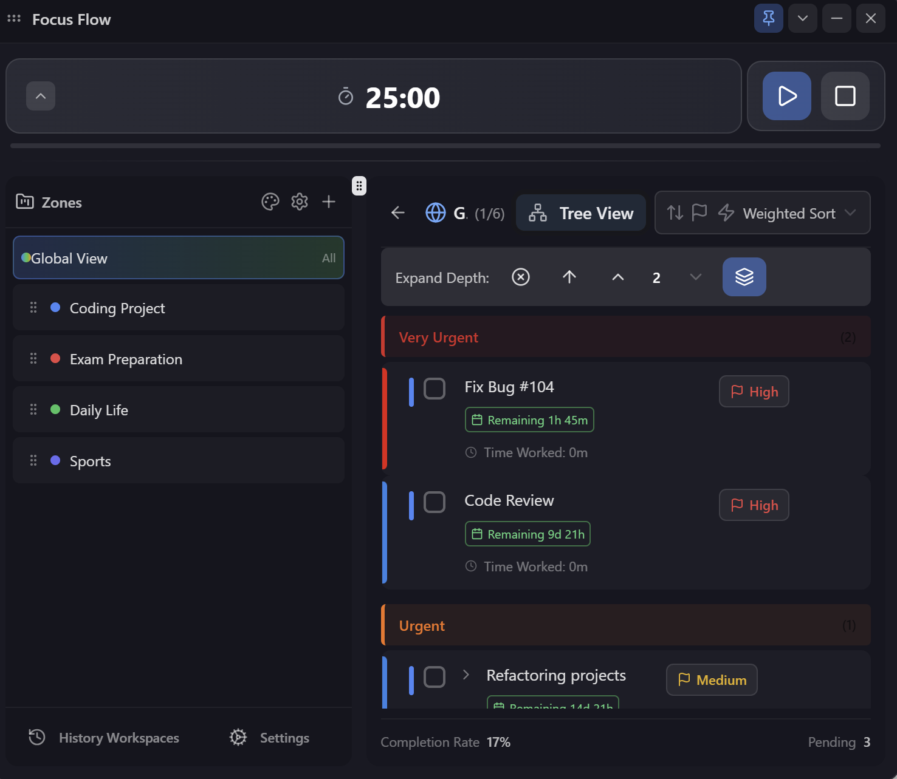
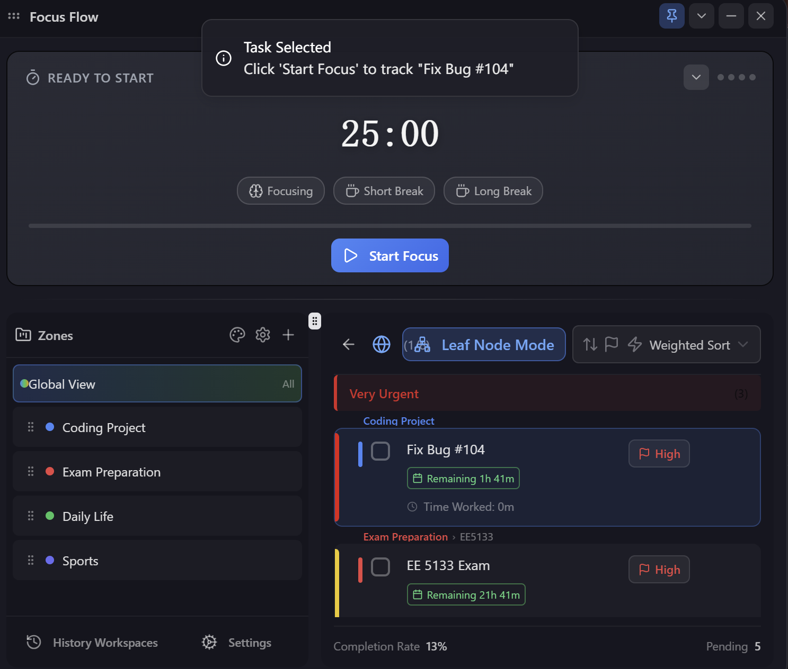
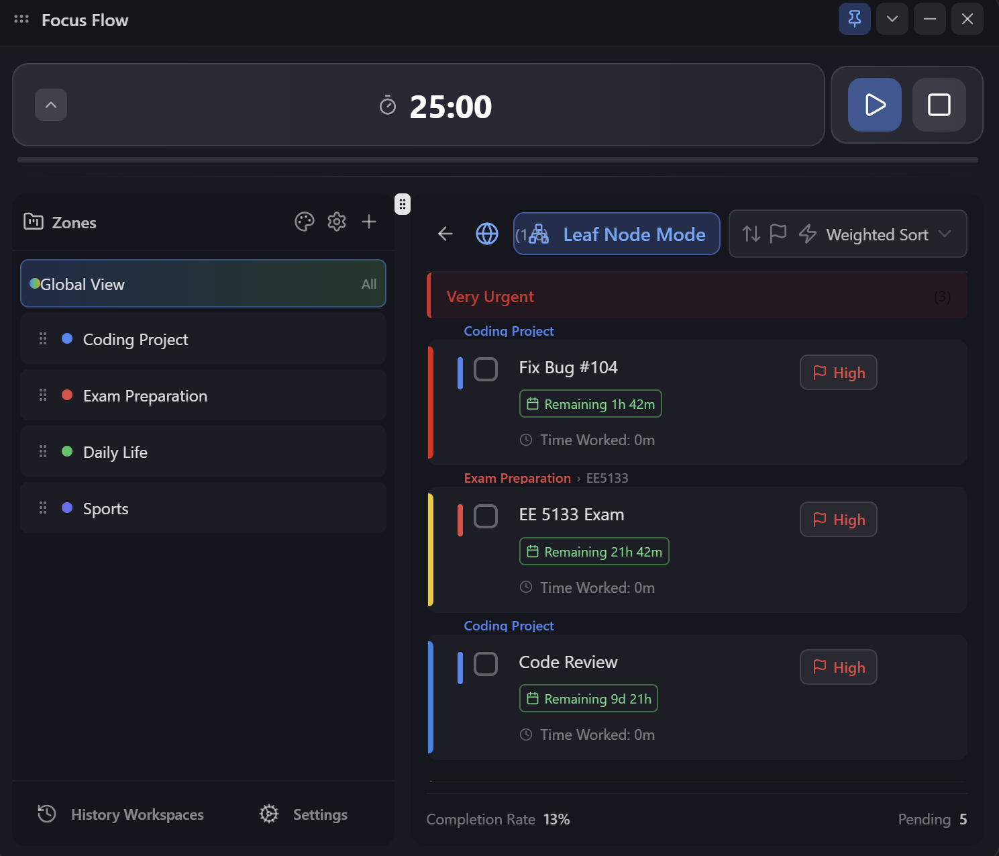
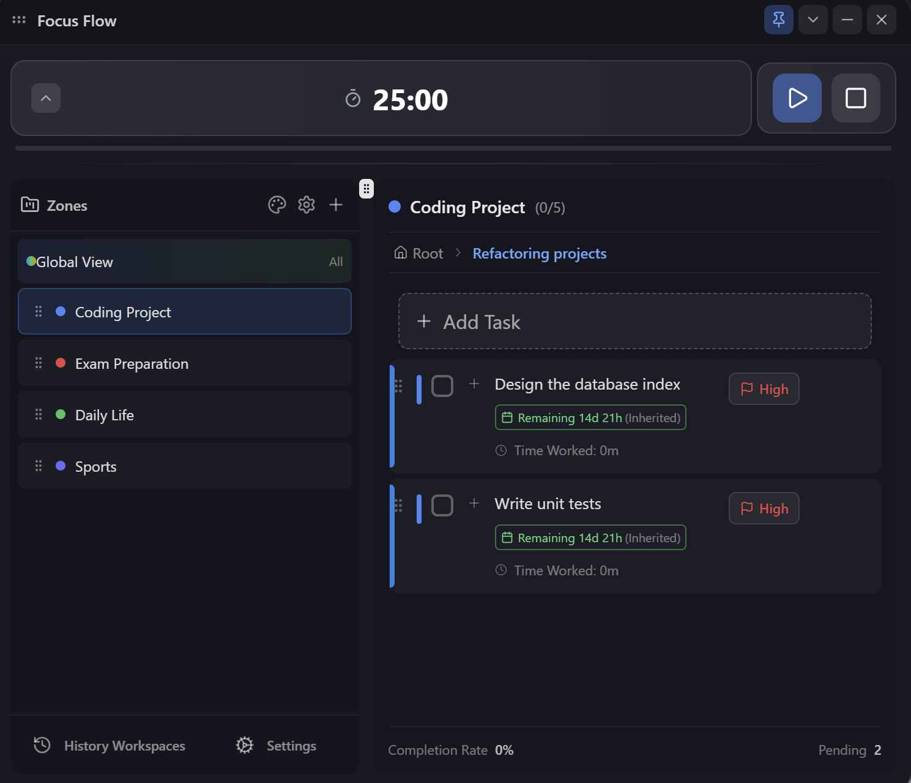
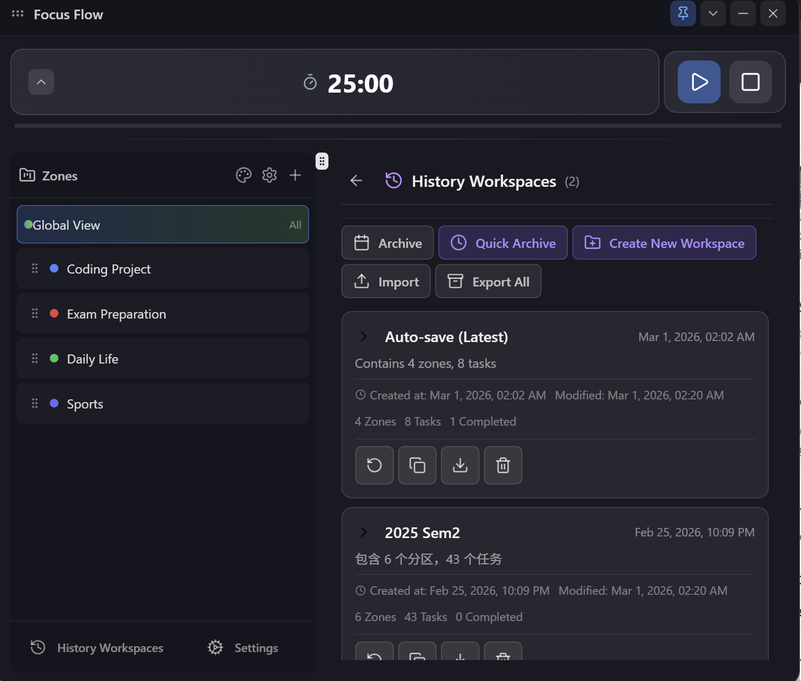

<div align="center">

# 🎯 Focus Flow
### 浮动待办 & 番茄钟 / Floating Todo & Pomodoro

<p>
  <a href="README_zh.md">🇨🇳 简体中文</a> | <a href="#-english">🇬🇧 English</a>
</p>

<!-- 主图：展示最丰富的全局视图 -->


</div>

---

<div id="-english"></div>

## 🇬🇧 English

**Focus Flow** is a minimalist and elegant desktop productivity tool that combines a **Floating Todo List** with a **Pomodoro Timer**. Designed to stay always-on-top, it features multi-language support, workspace management, and powerful task views to help you stay in the flow.

### ✨ Key Features

#### 🖥️ Immersive Focus
- **Always on Top**: Hovers over other apps without blocking your workflow.
- **Minimalist Design**: Borderless Glassmorphism UI with adjustable transparency.
- **Float Ball Mode**: Collapse the main window into a tiny "Float Bar" that shows only the active task timer and progress.

<!-- <div align="center">
  
  <p><i>Float Ball Mode</i></p>
</div> -->

#### 🍅 Pomodoro System
- **Auto Loop**: Standard 25m Focus + 5m Break cycle. Auto-triggers a Long Break after 4 cycles(support custom duration).
- **Task Tracking**: Timer is linked to the selected task, automatically logging time spent on each item.
- **Sound Alerts**: Audio notifications when the timer ends (customizable).

<!-- <div align="center">
  
  <p><i>Pomodoro System</i></p>
</div> -->

#### 📊 Powerful Views
- **Global View**: See all tasks from all workspaces in one unified list and allows you to view them in different sorting rules under that view.
- **Leaf Node Mode**: A togglable view that hides parent folders and shows only the bottom-level actionable items.
- **Breadcrumbs**: Shows the full path `[Zone] > Parent > Task` for context in flat views.
- **Smart Sorting**: Sort by **Priority**, **Urgency**, **Weighted Score**, or **Estimated Time**.

<div align="center">
  
  <p><i>Leaf Node Mode: Focus on actions, not folders</i></p>
</div>

#### ✅ Task System
- **Workspaces (Zones)**: Organize tasks into colored zones (e.g., Work, Study, Life).
- **Tree Structure**: Unlimited subtasks to break down complex goals.
- **Urgency Colors**: Color bars indicate deadline proximity.
- **Importance Setting**: Allows customization of task importance and then determines final priority based on intelligent algorithm weighting when participating in leaf node ordering.

<div align="center">
  
  <p><i>Zone View: Structured task management</i></p>
</div>

#### ⚙️ Automation & Safety
- **Automation Rules**: Set recurring templates (e.g., "Drink Water every 2 hours"), system auto-generates todos.
- **Environment Profiles**: Save/Restore snapshots of your entire setup.
- **Data Persistence**: Local SQLite storage.
- **Auto-save**: Snapshots are saved automatically every 120 seconds. Restore anytime.

<div align="center">
  <table>
    <tr>
      <td align="center"><br /><b>Automation Rules</b></td>
      <td align="center"><br /><b>History & Restore</b></td>
    </tr>
  </table>
</div>

### 🚀 Quick Start

#### Installation
Download the latest installer for your OS from the [Releases Page](https://github.com/Lexiang-Xiong/Focus-Flow/releases):
- **Windows**: `.exe` (NSIS)
- **macOS**: `.dmg` (Intel & Apple Silicon)
- **Linux**: `.AppImage` / `.deb`

#### Build from Source
1. **Prerequisites**: Node.js 20+, Rust 1.70+
2. **Install Deps**:
   ```bash
   npm install
   ```
3. **Run Dev**:
   ```bash
   npm run tauri-dev
   ```
4. **Build**:
   ```bash
   npm run tauri build
   ```

### 📖 Usage Guide

| Action | Description |
|--------|-------------|
| **Add Task** | Type in the input box and press `Enter`. |
| **Add Subtask** | Click the `+` icon next to a task. |
| **Start Focus** | Select a task and click the "Start Focus" button at the top. |
| **Move Window** | Drag the title bar. Click the Pin icon to toggle "Always on Top". |
| **Collapse** | Click the "Chevron Down" icon to shrink to Float Ball. |

### Urgency Colors
Color bars on the left indicate deadline proximity:
- 🔴 **Dark Red**: Overdue
- 🔴 **Red**: Due within 12 hours
- 🟠 **Orange/Yellow**: Due within 24 hours
- 🟢 **Green**: Due within 48 hours
- 🔵 **Blue/Purple**: Due later
- ⚪ **Gray**: No deadline

### 🛠️ Tech Stack
- **Frontend**: React 19, TypeScript, Vite 5
- **UI Libs**: Tailwind CSS, shadcn/ui, Radix UI
- **Desktop**: Tauri v2 (Rust)
- **State**: Zustand (w/ SQLite persistence)
- **i18n**: i18next

---

<div align="center">
  <p>Made with ❤️ for better productivity</p>
  <p>MIT License</p>
</div>
