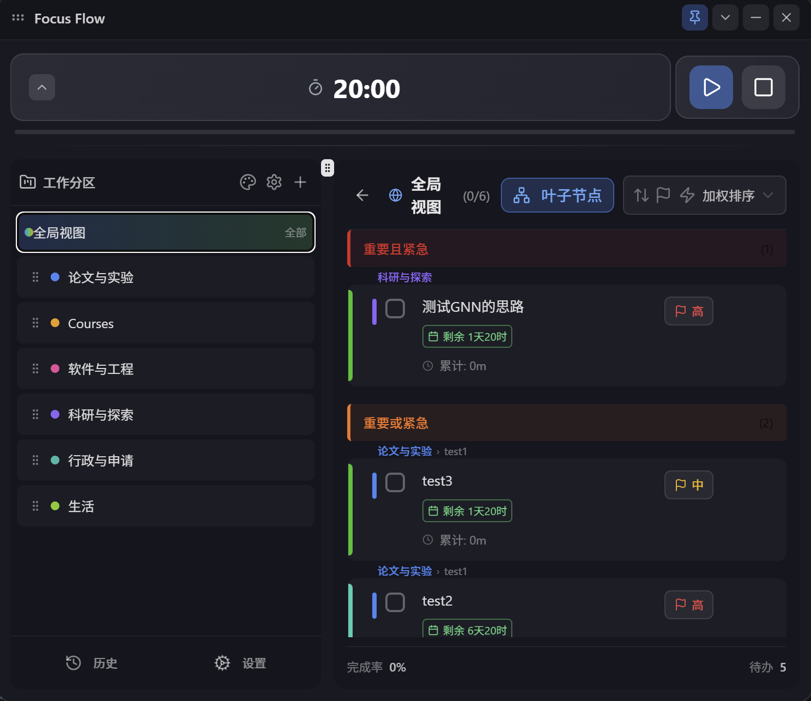

# Focus Flow

一个简洁优雅的浮动工作清单工具，支持番茄钟计时，帮助你保持专注。



## ✨ 功能特性

### 核心功能
- **浮动窗口** - 始终置顶，无边框设计，可拖拽移动
- **番茄钟** - 25分钟专注 + 5分钟休息，自动循环，支持自定义时长
- **任务管理** - 添加、完成、编辑、删除任务，支持优先级标记
- **智能提醒** - 计时完成声音提醒和通知
- **数据持久化** - 本地存储，刷新不丢失
- **毛玻璃效果** - 现代 UI 设计，美观不遮挡

### 工作区管理
- **多工作区** - 创建不同颜色和名称的工作区（如：工作、学习、生活）
- **任务分类** - 将任务分配到不同工作区
- **模板预设** - 内置多种工作区模板，快速创建

### 任务系统
- **树形结构** - 支持创建子任务，层层拆解目标
- **优先级** - 高/中/低三级优先级
- **截止日期** - 支持设置精确日期和时间，快捷选择今天/明天/本周
- **紧急度显示** - 根据截止日期自动计算紧急程度，用颜色区分（赤橙黄绿青蓝紫）
- **时间追踪** - 记录任务耗时，支持预估时间
- **任务历史** - 查看已完成任务的记录

### 视图模式
- **工作区视图** - 按工作区查看任务
- **全局视图** - 跨工作区查看所有任务
- **叶子节点模式** - 只显示可执行的最底层任务，配合面包屑路径快速定位任务来源
- **加权排序** - 根据优先级和紧急度权重智能排序任务

## 🚀 快速开始

### 桌面应用（推荐）

#### 环境要求

- [Node.js](https://nodejs.org/) 20+
- [Rust](https://www.rust-lang.org/tools/install) 1.70+

#### 安装步骤

1. 克隆仓库
```bash
git clone https://github.com/Lexiang-Xiong/Focus-Flow.git
cd Focus-Flow/app
```

2. 安装依赖
```bash
npm install
```

3. 开发模式运行
```bash
npm run tauri-dev
```

4. 构建生产版本
```bash
npm run tauri build
```

构建完成后，安装包位于 `src-tauri/target/release/bundle/` 目录。

### 下载发布版本

前往 [Releases](https://github.com/Lexiang-Xiong/Focus-Flow/releases) 页面下载预构建的安装包：

- **Windows**: `.exe` 安装包
- **macOS**: `.dmg` 安装包（支持 Intel 和 Apple Silicon）
- **Linux**: `.AppImage` 安装包

## 📖 使用说明

### 快捷键

| 快捷键 | 功能 |
|--------|------|
| `Ctrl/Cmd + Shift + T` | 显示/隐藏窗口 |

### 工作区

1. 点击侧边栏「+」添加新工作区
2. 为工作区设置名称和颜色
3. 点击工作区切换当前视图

### 任务管理

1. **添加任务** - 在输入框输入任务内容，按回车或点击 + 按钮
2. **设置优先级** - 点击旗帜图标选择高/中/低优先级
3. **设置截止日期** - 点击日历图标选择日期和时间
4. **创建子任务** - 点击任务右侧的「+」按钮添加子任务
5. **完成任务** - 点击任务左侧圆圈
6. **编辑任务** - 点击编辑图标
7. **删除任务** - 点击垃圾桶图标

### 番茄钟

1. 选择要专注的任务
2. 点击计时器开始按钮
3. 25分钟后自动进入休息模式
4. 完成4个番茄钟后进入长休息（15分钟）
5. 可在设置中自定义时长

### 全局视图与叶子节点模式

点击顶部导航栏切换到全局视图，可以看到所有工作区的任务。

- **叶子节点模式**: 切换到「叶子节点」模式，只显示没有子任务的可执行任务
- **面包屑路径**: 每个任务显示完整路径 `[工作区名称] > 父任务1 > 父任务2`
- **加权排序**: 根据优先级和紧急度权重智能排序

### 紧急度颜色

任务根据截止日期自动显示紧急度颜色：

| 颜色 | 含义 |
|------|------|
| 🔴 深红 | 已过期 |
| 🔴 红色 | 0-5小时 |
| 🟠 橙色 | 5-12小时 |
| 🟡 黄色 | 12-24小时 |
| 🟢 绿色 | 24-48小时 |
| 🔵 青色 | 48小时-1周 |
| 🔵 蓝色 | 1周-1个月 |
| 🟣 紫色 | 1个月以上 |
| ⚪ 灰色 | 未设置截止日期 |

## 🛠️ 技术栈

- **前端**: React + TypeScript + Vite
- **UI**: Tailwind CSS + shadcn/ui + Radix UI
- **桌面框架**: Tauri v2
- **状态管理**: Zustand
- **拖拽排序**: @dnd-kit
- **图标**: Lucide React

## 📁 项目结构

```
Focus-Flow/
├── app/                      # 主应用
│   ├── src/
│   │   ├── components/       # React 组件
│   │   │   ├── GlobalView.tsx      # 全局视图
│   │   │   ├── ZoneManager.tsx     # 工作区管理
│   │   │   ├── TaskList.tsx        # 任务列表
│   │   │   ├── TaskItem.tsx        # 任务项
│   │   │   ├── PomodoroTimer.tsx   # 番茄钟
│   │   │   └── SettingsPanel.tsx   # 设置面板
│   │   ├── store/            # 状态管理
│   │   │   └── slices/       # Zustand slices
│   │   ├── lib/              # 工具函数
│   │   ├── types/            # TypeScript 类型
│   │   └── App.tsx           # 主应用
│   ├── src-tauri/            # Tauri 配置
│   └── .github/               # GitHub Actions
└── README.md
```

## 🔧 配置说明

### 番茄钟时长设置

在设置面板中可自定义：
- 专注时长（默认25分钟）
- 短休息时长（默认5分钟）
- 长休息时长（默认15分钟）

### 排序权重设置

在设置面板中可调整：
- 优先级权重
- 紧急度权重

## 📝 开发计划

- [x] 基础浮动窗口
- [x] 多工作区管理
- [x] 任务树形结构
- [x] 番茄钟计时器
- [x] 截止日期管理
- [x] 紧急度颜色显示
- [x] 全局视图
- [x] 叶子节点模式
- [x] 加权排序
- [x] 任务历史记录
- [ ] 系统托盘图标
- [ ] 云同步功能

## 🤝 贡献

欢迎提交 Issue 和 Pull Request！

## 📄 许可证

MIT License

---

Made with ❤️ for better productivity
