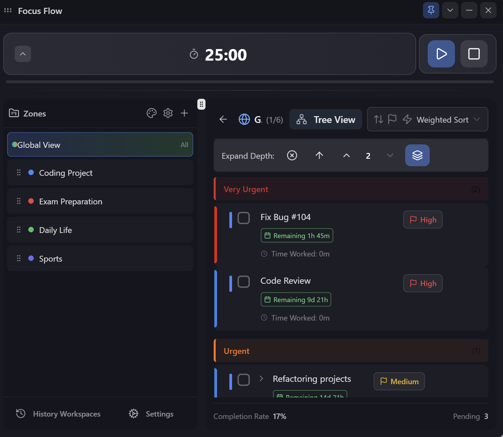
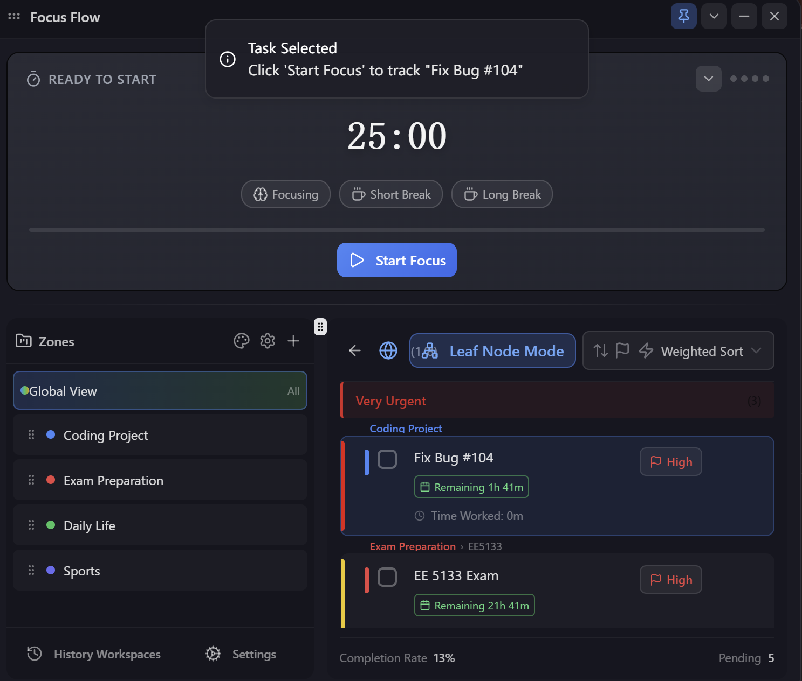
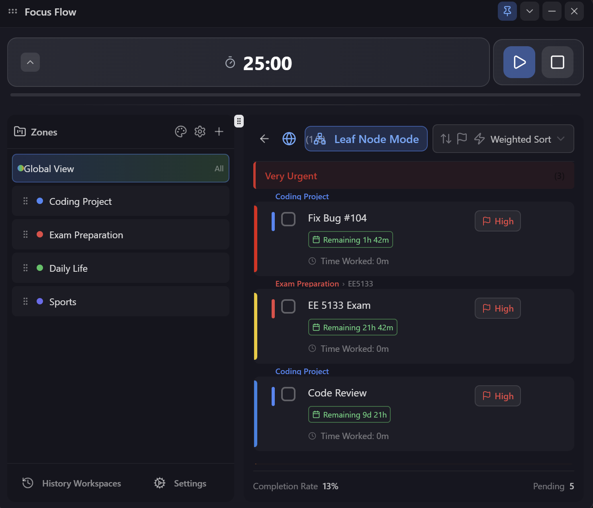
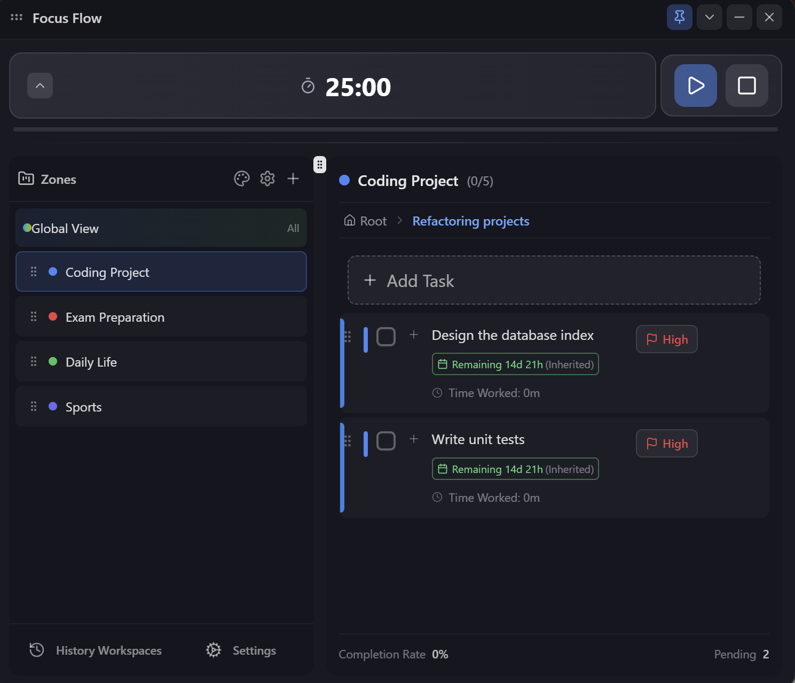
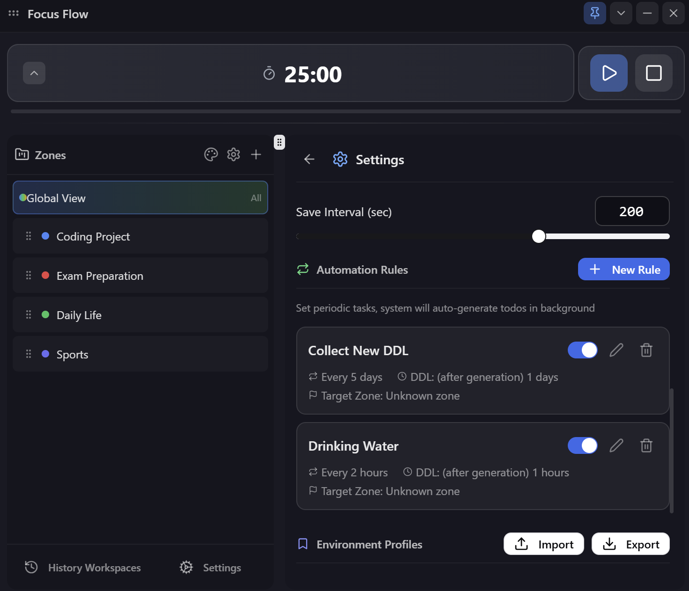
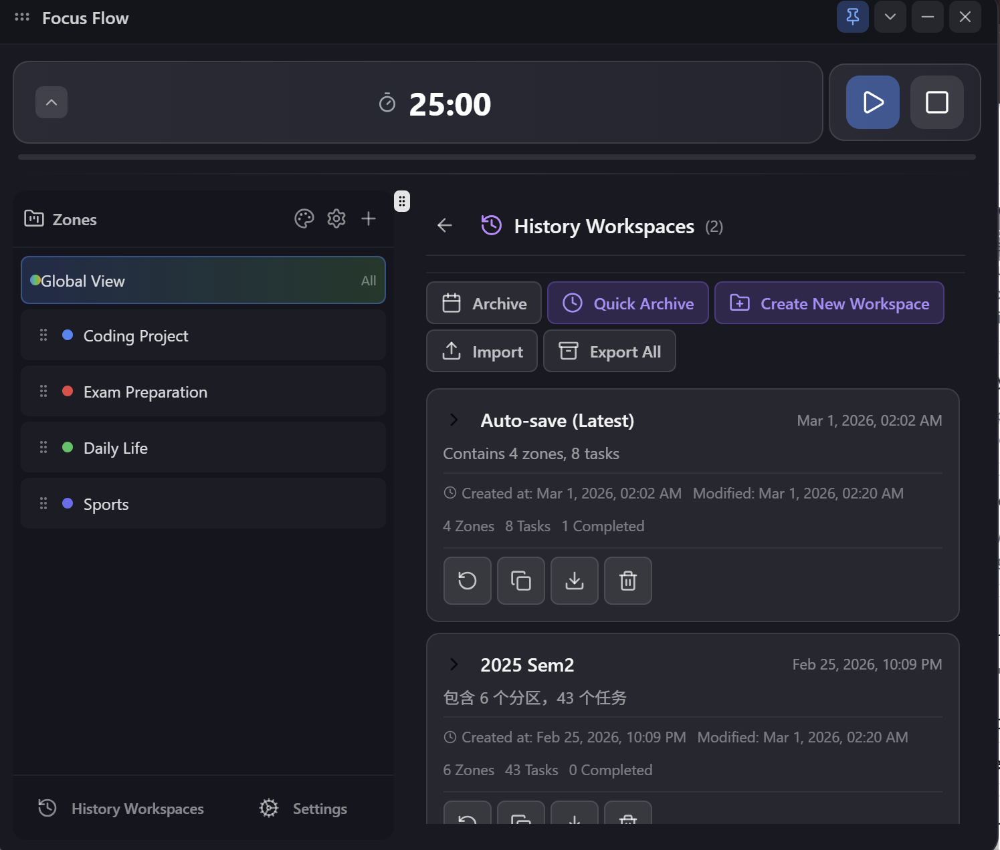

# Generated by ContextBuilder
# 项目源码分析文档 (按配置)

--- AI Interaction Instructions ---
        为您呈现的是一个项目的完整源代码快照(或部分特定项目组件的源码快照)，它采用了一种名为 "LineMark" 的系统进行精确引用。

        **LineMark 格式:**
        代码的每一行都带有一个 `[FileID:LineNumber]|` 格式的前缀。
        - `FileID`: 一个简短的标识符 (如 F1, F2)，它唯一地对应一个完整的文件路径。
        - `LineNumber`: 该行在特定文件中的行号。
        - `|`: (竖线后跟一个空格)标记与原始代码内容的分隔符。

        **您的任务:**
        在您的所有回答中，您必须使用此 LineMark 格式来引用具体的代码位置。例如:
        - "我建议重构 `[F5:23-28]` 中的逻辑。"
        - "在 `[F12:101]` 中可能存在一个潜在的bug。"
        - 若要新增代码，请这样描述: "在 `[F3:45]` 之后，插入以下代码: ..."

        这个系统确保了我们之间沟通的绝对精确性。FileID到文件路径的完整映射关系在下方的 "LineMark Manifest" 中提供。
        ---------------------------------

--- LineMark Manifest ---
F1: app.png
F2: app2.png
F3: build.sh
F4: components.json
F5: DELIVERY.md
F6: dev.sh
F7: eslint.config.js
F8: index.html
F9: info.md
F10: package.json
F11: postcss.config.js
F12: PROJECT_SUMMARY.md
F13: README.md
F14: README_zh.md
F15: tailwind.config.js
F16: tsconfig.app.json
F17: tsconfig.json
F18: tsconfig.node.json
F19: USER_GUIDE.md
F20: vite.config.ts
F21: .github/workflows/build.yml
F22: assets/1.png
F23: assets/2.png
F24: assets/3.png
F25: assets/4.png
F26: assets/5.png
F27: assets/6.png
F28: assets/7.png
F29: src/App.css
F30: src/App.tsx
F31: src/index.css
F32: src/main.tsx
F33: src/components/CollapseButton.tsx
F34: src/components/FloatBall.tsx
F35: src/components/FloatWindow.tsx
F36: src/components/GlobalView.tsx
F37: src/components/HistoryManager.tsx
F38: src/components/PomodoroTimer.tsx
F39: src/components/SettingsPanel.tsx
F40: src/components/TaskItem.tsx
F41: src/components/TaskList.tsx
F42: src/components/ZoneManager.tsx
F43: src/components/ui/accordion.tsx
F44: src/components/ui/alert-dialog.tsx
F45: src/components/ui/alert.tsx
F46: src/components/ui/aspect-ratio.tsx
F47: src/components/ui/avatar.tsx
F48: src/components/ui/badge.tsx
F49: src/components/ui/breadcrumb.tsx
F50: src/components/ui/button-group.tsx
F51: src/components/ui/button.tsx
F52: src/components/ui/calendar.tsx
F53: src/components/ui/card.tsx
F54: src/components/ui/carousel.tsx
F55: src/components/ui/chart.tsx
F56: src/components/ui/checkbox.tsx
F57: src/components/ui/collapsible.tsx
F58: src/components/ui/command.tsx
F59: src/components/ui/context-menu.tsx
F60: src/components/ui/dialog.tsx
F61: src/components/ui/drawer.tsx
F62: src/components/ui/dropdown-menu.tsx
F63: src/components/ui/empty.tsx
F64: src/components/ui/field.tsx
F65: src/components/ui/form.tsx
F66: src/components/ui/hover-card.tsx
F67: src/components/ui/input-group.tsx
F68: src/components/ui/input-otp.tsx
F69: src/components/ui/input.tsx
F70: src/components/ui/item.tsx
F71: src/components/ui/kbd.tsx
F72: src/components/ui/label.tsx
F73: src/components/ui/menubar.tsx
F74: src/components/ui/navigation-menu.tsx
F75: src/components/ui/pagination.tsx
F76: src/components/ui/popover.tsx
F77: src/components/ui/progress.tsx
F78: src/components/ui/radio-group.tsx
F79: src/components/ui/resizable.tsx
F80: src/components/ui/scroll-area.tsx
F81: src/components/ui/select.tsx
F82: src/components/ui/separator.tsx
F83: src/components/ui/sheet.tsx
F84: src/components/ui/sidebar.tsx
F85: src/components/ui/skeleton.tsx
F86: src/components/ui/slider.tsx
F87: src/components/ui/sonner.tsx
F88: src/components/ui/spinner.tsx
F89: src/components/ui/switch.tsx
F90: src/components/ui/table.tsx
F91: src/components/ui/tabs.tsx
F92: src/components/ui/textarea.tsx
F93: src/components/ui/toggle-group.tsx
F94: src/components/ui/toggle.tsx
F95: src/components/ui/tooltip.tsx
F96: src/hooks/use-mobile.ts
F97: src/hooks/useClipboard.ts
F98: src/hooks/useTimer.ts
F99: src/lib/auto-tester.ts
F100: src/lib/db-legacy.ts
F101: src/lib/db.ts
F102: src/lib/i18n.ts
F103: src/lib/migration.ts
F104: src/lib/storage-adapter.ts
F105: src/lib/tree-utils.ts
F106: src/lib/urgency-utils.ts
F107: src/lib/utils.ts
F108: src/locales/en.json
F109: src/locales/zh.json
F110: src/store/index.ts
F111: src/store/slices/historySlice.ts
F112: src/store/slices/settingsSlice.ts
F113: src/store/slices/taskSlice.ts
F114: src/store/slices/uiSlice.ts
F115: src/store/slices/undoSlice.ts
F116: src/store/slices/zoneSlice.ts
F117: src/types/index.ts
-----------------------
- 配置文件: context_config.yaml

## 项目文件结构
```
├── .github/
    └── workflows/
        └── build.yml
├── assets/
    ├── 1.png
    ├── 2.png
    ├── 3.png
    ├── 4.png
    ├── 5.png
    ├── 6.png
    └── 7.png
├── src/
    ├── components/
        ├── ui/
            ├── accordion.tsx
            ├── alert-dialog.tsx
            ├── alert.tsx
            ├── aspect-ratio.tsx
            ├── avatar.tsx
            ├── badge.tsx
            ├── breadcrumb.tsx
            ├── button-group.tsx
            ├── button.tsx
            ├── calendar.tsx
            ├── card.tsx
            ├── carousel.tsx
            ├── chart.tsx
            ├── checkbox.tsx
            ├── collapsible.tsx
            ├── command.tsx
            ├── context-menu.tsx
            ├── dialog.tsx
            ├── drawer.tsx
            ├── dropdown-menu.tsx
            ├── empty.tsx
            ├── field.tsx
            ├── form.tsx
            ├── hover-card.tsx
            ├── input-group.tsx
            ├── input-otp.tsx
            ├── input.tsx
            ├── item.tsx
            ├── kbd.tsx
            ├── label.tsx
            ├── menubar.tsx
            ├── navigation-menu.tsx
            ├── pagination.tsx
            ├── popover.tsx
            ├── progress.tsx
            ├── radio-group.tsx
            ├── resizable.tsx
            ├── scroll-area.tsx
            ├── select.tsx
            ├── separator.tsx
            ├── sheet.tsx
            ├── sidebar.tsx
            ├── skeleton.tsx
            ├── slider.tsx
            ├── sonner.tsx
            ├── spinner.tsx
            ├── switch.tsx
            ├── table.tsx
            ├── tabs.tsx
            ├── textarea.tsx
            ├── toggle-group.tsx
            ├── toggle.tsx
            └── tooltip.tsx
        ├── CollapseButton.tsx
        ├── FloatBall.tsx
        ├── FloatWindow.tsx
        ├── GlobalView.tsx
        ├── HistoryManager.tsx
        ├── PomodoroTimer.tsx
        ├── SettingsPanel.tsx
        ├── TaskItem.tsx
        ├── TaskList.tsx
        └── ZoneManager.tsx
    ├── hooks/
        ├── use-mobile.ts
        ├── useClipboard.ts
        └── useTimer.ts
    ├── lib/
        ├── auto-tester.ts
        ├── db-legacy.ts
        ├── db.ts
        ├── i18n.ts
        ├── migration.ts
        ├── storage-adapter.ts
        ├── tree-utils.ts
        ├── urgency-utils.ts
        └── utils.ts
    ├── locales/
        ├── en.json
        └── zh.json
    ├── store/
        ├── slices/
            ├── historySlice.ts
            ├── settingsSlice.ts
            ├── taskSlice.ts
            ├── uiSlice.ts
            ├── undoSlice.ts
            └── zoneSlice.ts
        └── index.ts
    ├── types/
        └── index.ts
    ├── App.css
    ├── App.tsx
    ├── index.css
    └── main.tsx
├── DELIVERY.md
├── PROJECT_SUMMARY.md
├── README.md
├── README_zh.md
├── USER_GUIDE.md
├── app.png
├── app2.png
├── build.sh
├── components.json
├── dev.sh
├── eslint.config.js
├── index.html
├── info.md
├── package.json
├── postcss.config.js
├── tailwind.config.js
├── tsconfig.app.json
├── tsconfig.json
├── tsconfig.node.json
└── vite.config.ts
```

## 源代码文件内容

================================================================================
文件路径: app.png(F1) (约合大小: 162 KB)
================================================================================
# 错误：无法读取文件 ('utf-8' codec can't decode byte 0x89 in position 0: invalid start byte)

================================================================================
文件路径: app2.png(F2) (约合大小: 8 KB)
================================================================================
# 错误：无法读取文件 ('utf-8' codec can't decode byte 0x89 in position 0: invalid start byte)

$$$$$$$$$$$$$$$$$$$$$$$$$$$$$$$$$$$$$$$$$$$$$$$$$$$$$$$$$$$$$$$$$$$$$$$$$$$$$$$$
文件路径: build.sh(F3) (约合大小: 1 KB)
$$$$$$$$$$$$$$$$$$$$$$$$$$$$$$$$$$$$$$$$$$$$$$$$$$$$$$$$$$$$$$$$$$$$$$$$$$$$$$$$
[F3:1]| #!/bin/bash
[F3:2]| 
[F3:3]| # Floating Todo Build Script
[F3:4]| # This script builds both the frontend and the Tauri desktop application
[F3:5]| 
[F3:6]| set -e
[F3:7]| 
[F3:8]| echo "🚀 Building Floating Todo..."
[F3:9]| 
[F3:10]| # Colors for output
[F3:11]| RED='\033[0;31m'
[F3:12]| GREEN='\033[0;32m'
[F3:13]| YELLOW='\033[1;33m'
[F3:14]| NC='\033[0m' # No Color
[F3:15]| 
[F3:16]| # Check if Node.js is installed
[F3:17]| if ! command -v node &> /dev/null; then
[F3:18]|     echo -e "${RED}❌ Node.js is not installed. Please install Node.js 18+ first.${NC}"
[F3:19]|     exit 1
[F3:20]| fi
[F3:21]| 
[F3:22]| # Check if Rust is installed
[F3:23]| if ! command -v rustc &> /dev/null; then
[F3:24]|     echo -e "${YELLOW}⚠️  Rust is not installed. Installing...${NC}"
[F3:25]|     curl --proto '=https' --tlsv1.2 -sSf https://sh.rustup.rs | sh -s -- -y
[F3:26]|     source $HOME/.cargo/env
[F3:27]| fi
[F3:28]| 
[F3:29]| echo -e "${GREEN}✓ Dependencies check passed${NC}"
[F3:30]| 
[F3:31]| # Install npm dependencies
[F3:32]| echo "📦 Installing npm dependencies..."
[F3:33]| npm install
[F3:34]| 
[F3:35]| # Build frontend
[F3:36]| echo "🔨 Building frontend..."
[F3:37]| npm run build
[F3:38]| 
[F3:39]| # Build Tauri application
[F3:40]| echo "🖥️  Building desktop application..."
[F3:41]| npm run tauri build
[F3:42]| 
[F3:43]| echo -e "${GREEN}✅ Build complete!${NC}"
[F3:44]| echo ""
[F3:45]| echo "📁 Output locations:"
[F3:46]| echo "   - Frontend: ./dist/"
[F3:47]| echo "   - Desktop app: ./src-tauri/target/release/bundle/"
[F3:48]| echo ""
[F3:49]| echo "🎉 You can now install the application from the bundle directory!"

================================================================================
文件路径: components.json(F4) (约合大小: 0 KB)
================================================================================
[F4:1]| {
[F4:2]|   "$schema": "https://ui.shadcn.com/schema.json",
[F4:3]|   "style": "new-york",
[F4:4]|   "rsc": false,
[F4:5]|   "tsx": true,
[F4:6]|   "tailwind": {
[F4:7]|     "config": "postcss.config.js",
[F4:8]|     "css": "src/index.css",
[F4:9]|     "baseColor": "slate",
[F4:10]|     "cssVariables": true,
[F4:11]|     "prefix": ""
[F4:12]|   },
[F4:13]|   "iconLibrary": "lucide",
[F4:14]|   "aliases": {
[F4:15]|     "components": "@/components",
[F4:16]|     "utils": "@/lib/utils",
[F4:17]|     "ui": "@/components/ui",
[F4:18]|     "lib": "@/lib",
[F4:19]|     "hooks": "@/hooks"
[F4:20]|   },
[F4:21]|   "registries": {}
[F4:22]| }

================================================================================
文件路径: DELIVERY.md(F5) (约合大小: 4 KB)
================================================================================
[F5:1]| # 浮动待办 - 交付文档
[F5:2]| 
[F5:3]| ## 📦 交付内容
[F5:4]| 
[F5:5]| ### 1. 源代码
[F5:6]| - **位置**: `/mnt/okcomputer/output/app/`
[F5:7]| - **内容**: 完整的 React + Tauri 项目源代码
[F5:8]| 
[F5:9]| ### 2. 浏览器演示版
[F5:10]| - **在线地址**: https://sjlalkp5t7dw4.ok.kimi.link
[F5:11]| - **本地位置**: `/mnt/okcomputer/output/app/demo/`
[F5:12]| - **说明**: 可在浏览器中直接体验基础功能
[F5:13]| 
[F5:14]| ### 3. 构建输出
[F5:15]| - **位置**: `/mnt/okcomputer/output/app/dist/`
[F5:16]| - **内容**: 前端静态文件，可用于部署
[F5:17]| 
[F5:18]| ## 📁 项目结构
[F5:19]| 
[F5:20]| ```
[F5:21]| /mnt/okcomputer/output/app/
[F5:22]| ├── src/                      # 源代码
[F5:23]| │   ├── components/           # React 组件
[F5:24]| │   │   ├── FloatWindow.tsx   # 浮动窗口
[F5:25]| │   │   ├── PomodoroTimer.tsx # 番茄钟
[F5:26]| │   │   ├── TaskList.tsx      # 任务列表
[F5:27]| │   │   └── TaskItem.tsx      # 任务项
[F5:28]| │   ├── hooks/                # 自定义 Hooks
[F5:29]| │   │   ├── useStorage.ts     # 本地存储
[F5:30]| │   │   ├── useTasks.ts       # 任务管理
[F5:31]| │   │   └── useTimer.ts       # 计时器
[F5:32]| │   ├── types/                # 类型定义
[F5:33]| │   ├── App.tsx               # 主应用
[F5:34]| │   └── App.css               # 样式
[F5:35]| ├── src-tauri/                # Tauri 配置
[F5:36]| │   ├── tauri.conf.json       # Tauri 配置
[F5:37]| │   ├── Cargo.toml            # Rust 依赖
[F5:38]| │   ├── src/main.rs           # Rust 入口
[F5:39]| │   └── icons/                # 应用图标
[F5:40]| ├── demo/                     # 浏览器演示
[F5:41]| ├── dist/                     # 构建输出
[F5:42]| ├── build.sh                  # 构建脚本
[F5:43]| ├── dev.sh                    # 开发脚本
[F5:44]| ├── README.md                 # 项目说明
[F5:45]| ├── USER_GUIDE.md             # 用户指南
[F5:46]| └── PROJECT_SUMMARY.md        # 项目总结
[F5:47]| ```
[F5:48]| 
[F5:49]| ## 🚀 快速开始
[F5:50]| 
[F5:51]| ### 浏览器演示
[F5:52]| 直接访问: https://sjlalkp5t7dw4.ok.kimi.link
[F5:53]| 
[F5:54]| ### 本地开发
[F5:55]| ```bash
[F5:56]| cd /mnt/okcomputer/output/app
[F5:57]| 
[F5:58]| # 安装依赖
[F5:59]| npm install
[F5:60]| 
[F5:61]| # 启动开发服务器
[F5:62]| npm run tauri-dev
[F5:63]| ```
[F5:64]| 
[F5:65]| ### 构建桌面应用
[F5:66]| ```bash
[F5:67]| cd /mnt/okcomputer/output/app
[F5:68]| 
[F5:69]| # 运行构建脚本
[F5:70]| ./build.sh
[F5:71]| ```
[F5:72]| 
[F5:73]| ## ✅ 功能清单
[F5:74]| 
[F5:75]| ### 已实现功能
[F5:76]| - [x] 浮动窗口（始终置顶、无边框、透明）
[F5:77]| - [x] 窗口拖拽移动
[F5:78]| - [x] 窗口控制（置顶、最小化、关闭）
[F5:79]| - [x] 任务添加/编辑/删除
[F5:80]| - [x] 任务优先级设置（高/中/低）
[F5:81]| - [x] 任务完成标记
[F5:82]| - [x] 番茄钟计时器（25/5/15分钟）
[F5:83]| - [x] 计时器控制（开始/暂停/停止/跳过）
[F5:84]| - [x] 进度条显示
[F5:85]| - [x] 声音提醒
[F5:86]| - [x] 数据本地持久化
[F5:87]| - [x] 毛玻璃视觉效果
[F5:88]| - [x] 响应式设计
[F5:89]| 
[F5:90]| ### 待实现功能
[F5:91]| - [ ] 系统托盘图标
[F5:92]| - [ ] 全局快捷键自定义
[F5:93]| - [ ] 任务拖拽排序
[F5:94]| - [ ] 数据统计图表
[F5:95]| - [ ] 多语言支持
[F5:96]| - [ ] 云同步
[F5:97]| 
[F5:98]| ## 🛠️ 技术栈
[F5:99]| 
[F5:100]| | 类别 | 技术 |
[F5:101]| |------|------|
[F5:102]| | 前端框架 | React 19 + TypeScript |
[F5:103]| | 构建工具 | Vite 7 |
[F5:104]| | 样式 | Tailwind CSS 3 |
[F5:105]| | UI 组件 | shadcn/ui |
[F5:106]| | 桌面框架 | Tauri 2 |
[F5:107]| | 后端 | Rust |
[F5:108]| 
[F5:109]| ## 📋 环境要求
[F5:110]| 
[F5:111]| - Node.js 18+
[F5:112]| - Rust 1.70+
[F5:113]| - Windows 10+ / macOS 10.15+ / Linux
[F5:114]| 
[F5:115]| ## 📝 重要文件说明
[F5:116]| 
[F5:117]| | 文件 | 说明 |
[F5:118]| |------|------|
[F5:119]| | `src/App.tsx` | 主应用组件，整合所有功能 |
[F5:120]| | `src/components/FloatWindow.tsx` | 浮动窗口容器，处理拖拽和窗口控制 |
[F5:121]| | `src/components/PomodoroTimer.tsx` | 番茄钟组件 |
[F5:122]| | `src/components/TaskList.tsx` | 任务列表组件 |
[F5:123]| | `src/hooks/useTimer.ts` | 计时器逻辑 Hook |
[F5:124]| | `src/hooks/useTasks.ts` | 任务管理逻辑 Hook |
[F5:125]| | `src-tauri/tauri.conf.json` | Tauri 窗口配置 |
[F5:126]| | `build.sh` | 一键构建脚本 |
[F5:127]| | `dev.sh` | 开发启动脚本 |
[F5:128]| 
[F5:129]| ## 🎯 使用流程
[F5:130]| 
[F5:131]| 1. **启动应用** - 双击图标启动
[F5:132]| 2. **添加任务** - 输入任务内容，选择优先级
[F5:133]| 3. **开始专注** - 选择任务，点击"开始专注"
[F5:134]| 4. **完成任务** - 番茄钟结束后标记任务完成
[F5:135]| 5. **查看统计** - 底部显示完成率和待办数量
[F5:136]| 
[F5:137]| ## 💡 核心设计
[F5:138]| 
[F5:139]| ### 窗口特性
[F5:140]| - 始终置顶，不干扰工作
[F5:141]| - 无边框设计，美观简洁
[F5:142]| - 毛玻璃效果，现代感
[F5:143]| - 鼠标移开自动半透明
[F5:144]| 
[F5:145]| ### 番茄钟流程
[F5:146]| ```
[F5:147]| 开始专注 (25分钟) → 短休息 (5分钟) → 开始专注 → ... → 长休息 (15分钟)
[F5:148]| ```
[F5:149]| 
[F5:150]| ### 数据流
[F5:151]| ```
[F5:152]| 用户操作 → React State → LocalStorage → 持久化保存
[F5:153]| ```
[F5:154]| 
[F5:155]| ## 📞 支持
[F5:156]| 
[F5:157]| 如有问题，请查看：
[F5:158]| - `README.md` - 项目说明
[F5:159]| - `USER_GUIDE.md` - 用户指南
[F5:160]| - `PROJECT_SUMMARY.md` - 技术总结
[F5:161]| 
[F5:162]| ---
[F5:163]| 
[F5:164]| **项目完成日期**: 2026-02-22  
[F5:165]| **版本**: 1.0.0

$$$$$$$$$$$$$$$$$$$$$$$$$$$$$$$$$$$$$$$$$$$$$$$$$$$$$$$$$$$$$$$$$$$$$$$$$$$$$$$$
文件路径: dev.sh(F6) (约合大小: 0 KB)
$$$$$$$$$$$$$$$$$$$$$$$$$$$$$$$$$$$$$$$$$$$$$$$$$$$$$$$$$$$$$$$$$$$$$$$$$$$$$$$$
[F6:1]| #!/bin/bash
[F6:2]| 
[F6:3]| # Floating Todo Development Script
[F6:4]| # This script starts the development server
[F6:5]| 
[F6:6]| echo "🚀 Starting Floating Todo in development mode..."
[F6:7]| echo ""
[F6:8]| 
[F6:9]| # Check if Node.js is installed
[F6:10]| if ! command -v node &> /dev/null; then
[F6:11]|     echo "❌ Node.js is not installed. Please install Node.js 18+ first."
[F6:12]|     exit 1
[F6:13]| fi
[F6:14]| 
[F6:15]| # Check if Rust is installed
[F6:16]| if ! command -v rustc &> /dev/null; then
[F6:17]|     echo "⚠️  Rust is not installed. Installing..."
[F6:18]|     curl --proto '=https' --tlsv1.2 -sSf https://sh.rustup.rs | sh -s -- -y
[F6:19]|     source $HOME/.cargo/env
[F6:20]| fi
[F6:21]| 
[F6:22]| # Install dependencies if node_modules doesn't exist
[F6:23]| if [ ! -d "node_modules" ]; then
[F6:24]|     echo "📦 Installing dependencies..."
[F6:25]|     npm install
[F6:26]| fi
[F6:27]| 
[F6:28]| echo "🔧 Starting development server..."
[F6:29]| echo ""
[F6:30]| echo "💡 Tips:"
[F6:31]| echo "   - Press Ctrl+C to stop"
[F6:32]| echo "   - The app will auto-reload when you make changes"
[F6:33]| echo ""
[F6:34]| 
[F6:35]| npm run tauri-dev

================================================================================
文件路径: eslint.config.js(F7) (约合大小: 0 KB)
================================================================================
[F7:1]| import js from '@eslint/js'
[F7:2]| import globals from 'globals'
[F7:3]| import reactHooks from 'eslint-plugin-react-hooks'
[F7:4]| import reactRefresh from 'eslint-plugin-react-refresh'
[F7:5]| import tseslint from 'typescript-eslint'
[F7:6]| import { defineConfig, globalIgnores } from 'eslint/config'
[F7:7]| 
[F7:8]| export default defineConfig([
[F7:9]|   globalIgnores(['dist']),
[F7:10]|   {
[F7:11]|     files: ['**/*.{ts,tsx}'],
[F7:12]|     extends: [
[F7:13]|       js.configs.recommended,
[F7:14]|       tseslint.configs.recommended,
[F7:15]|       reactHooks.configs.flat.recommended,
[F7:16]|       reactRefresh.configs.vite,
[F7:17]|     ],
[F7:18]|     languageOptions: {
[F7:19]|       ecmaVersion: 2020,
[F7:20]|       globals: globals.browser,
[F7:21]|     },
[F7:22]|   },
[F7:23]| ])

================================================================================
文件路径: index.html(F8) (约合大小: 0 KB)
================================================================================
[F8:1]| <!doctype html>
[F8:2]| <html lang="en">
[F8:3]|   <head>
[F8:4]|     <meta charset="UTF-8" />
[F8:5]|     <meta name="viewport" content="width=device-width, initial-scale=1.0" />
[F8:6]|     <title>Focus Flow</title>
[F8:7]|   </head>
[F8:8]|   <body>
[F8:9]|     <div id="root"></div>
[F8:10]|     <script type="module" src="/src/main.tsx"></script>
[F8:11]|   </body>
[F8:12]| </html>

================================================================================
文件路径: info.md(F9) (约合大小: 1 KB)
================================================================================
[F9:1]| Using Node.js 20, Tailwind CSS v3.4.19, and Vite v7.2.4
[F9:2]| 
[F9:3]| Tailwind CSS has been set up with the shadcn theme
[F9:4]| 
[F9:5]| Setup complete: /mnt/okcomputer/output/app
[F9:6]| 
[F9:7]| Components (40+):
[F9:8]|   accordion, alert-dialog, alert, aspect-ratio, avatar, badge, breadcrumb,
[F9:9]|   button-group, button, calendar, card, carousel, chart, checkbox, collapsible,
[F9:10]|   command, context-menu, dialog, drawer, dropdown-menu, empty, field, form,
[F9:11]|   hover-card, input-group, input-otp, input, item, kbd, label, menubar,
[F9:12]|   navigation-menu, pagination, popover, progress, radio-group, resizable,
[F9:13]|   scroll-area, select, separator, sheet, sidebar, skeleton, slider, sonner,
[F9:14]|   spinner, switch, table, tabs, textarea, toggle-group, toggle, tooltip
[F9:15]| 
[F9:16]| Usage:
[F9:17]|   import { Button } from '@/components/ui/button'
[F9:18]|   import { Card, CardHeader, CardTitle } from '@/components/ui/card'
[F9:19]| 
[F9:20]| Structure:
[F9:21]|   src/sections/        Page sections
[F9:22]|   src/hooks/           Custom hooks
[F9:23]|   src/types/           Type definitions
[F9:24]|   src/App.css          Styles specific to the Webapp
[F9:25]|   src/App.tsx          Root React component
[F9:26]|   src/index.css        Global styles
[F9:27]|   src/main.tsx         Entry point for rendering the Webapp
[F9:28]|   index.html           Entry point for the Webapp
[F9:29]|   tailwind.config.js   Configures Tailwind's theme, plugins, etc.
[F9:30]|   vite.config.ts       Main build and dev server settings for Vite
[F9:31]|   postcss.config.js    Config file for CSS post-processing tools

================================================================================
文件路径: package.json(F10) (约合大小: 3 KB)
================================================================================
[F10:1]| {
[F10:2]|   "name": "focus-flow",
[F10:3]|   "description": "A floating todo app with Pomodoro timer - stay focused and organized",
[F10:4]|   "private": true,
[F10:5]|   "version": "1.0.0",
[F10:6]|   "type": "module",
[F10:7]|   "scripts": {
[F10:8]|     "dev": "vite",
[F10:9]|     "build": "tsc -b && vite build",
[F10:10]|     "lint": "eslint .",
[F10:11]|     "preview": "vite preview",
[F10:12]|     "tauri": "tauri",
[F10:13]|     "tauri-dev": "tauri dev",
[F10:14]|     "tauri-build": "tauri build"
[F10:15]|   },
[F10:16]|   "dependencies": {
[F10:17]|     "@dnd-kit/core": "^6.3.1",
[F10:18]|     "@dnd-kit/sortable": "^10.0.0",
[F10:19]|     "@dnd-kit/utilities": "^3.2.2",
[F10:20]|     "@hookform/resolvers": "^5.2.2",
[F10:21]|     "@radix-ui/react-accordion": "^1.2.12",
[F10:22]|     "@radix-ui/react-alert-dialog": "^1.1.15",
[F10:23]|     "@radix-ui/react-aspect-ratio": "^1.1.8",
[F10:24]|     "@radix-ui/react-avatar": "^1.1.11",
[F10:25]|     "@radix-ui/react-checkbox": "^1.3.3",
[F10:26]|     "@radix-ui/react-collapsible": "^1.1.12",
[F10:27]|     "@radix-ui/react-context-menu": "^2.2.16",
[F10:28]|     "@radix-ui/react-dialog": "^1.1.15",
[F10:29]|     "@radix-ui/react-dropdown-menu": "^2.1.16",
[F10:30]|     "@radix-ui/react-hover-card": "^1.1.15",
[F10:31]|     "@radix-ui/react-label": "^2.1.8",
[F10:32]|     "@radix-ui/react-menubar": "^1.1.16",
[F10:33]|     "@radix-ui/react-navigation-menu": "^1.2.14",
[F10:34]|     "@radix-ui/react-popover": "^1.1.15",
[F10:35]|     "@radix-ui/react-progress": "^1.1.8",
[F10:36]|     "@radix-ui/react-radio-group": "^1.3.8",
[F10:37]|     "@radix-ui/react-scroll-area": "^1.2.10",
[F10:38]|     "@radix-ui/react-select": "^2.2.6",
[F10:39]|     "@radix-ui/react-separator": "^1.1.8",
[F10:40]|     "@radix-ui/react-slider": "^1.3.6",
[F10:41]|     "@radix-ui/react-slot": "^1.2.4",
[F10:42]|     "@radix-ui/react-switch": "^1.2.6",
[F10:43]|     "@radix-ui/react-tabs": "^1.1.13",
[F10:44]|     "@radix-ui/react-toggle": "^1.1.10",
[F10:45]|     "@radix-ui/react-toggle-group": "^1.1.11",
[F10:46]|     "@radix-ui/react-tooltip": "^1.2.8",
[F10:47]|     "@tauri-apps/api": "^2.10.1",
[F10:48]|     "@tauri-apps/cli": "^2.10.0",
[F10:49]|     "@tauri-apps/plugin-dialog": "^2.6.0",
[F10:50]|     "@tauri-apps/plugin-fs": "^2.4.5",
[F10:51]|     "@tauri-apps/plugin-sql": "^2.3.2",
[F10:52]|     "class-variance-authority": "^0.7.1",
[F10:53]|     "clsx": "^2.1.1",
[F10:54]|     "cmdk": "^1.1.1",
[F10:55]|     "date-fns": "^4.1.0",
[F10:56]|     "embla-carousel-react": "^8.6.0",
[F10:57]|     "i18next": "^25.8.13",
[F10:58]|     "i18next-browser-languagedetector": "^8.2.1",
[F10:59]|     "input-otp": "^1.4.2",
[F10:60]|     "jszip": "^3.10.1",
[F10:61]|     "lucide-react": "^0.562.0",
[F10:62]|     "next-themes": "^0.4.6",
[F10:63]|     "react": "^19.2.0",
[F10:64]|     "react-day-picker": "^9.13.0",
[F10:65]|     "react-dom": "^19.2.0",
[F10:66]|     "react-hook-form": "^7.70.0",
[F10:67]|     "react-i18next": "^16.5.4",
[F10:68]|     "react-resizable-panels": "^4.2.2",
[F10:69]|     "recharts": "^2.15.4",
[F10:70]|     "sonner": "^2.0.7",
[F10:71]|     "tailwind-merge": "^3.4.0",
[F10:72]|     "vaul": "^1.1.2",
[F10:73]|     "zod": "^4.3.5",
[F10:74]|     "zustand": "^5.0.11"
[F10:75]|   },
[F10:76]|   "devDependencies": {
[F10:77]|     "@eslint/js": "^9.39.1",
[F10:78]|     "@types/node": "^24.10.1",
[F10:79]|     "@types/react": "^19.2.5",
[F10:80]|     "@types/react-dom": "^19.2.3",
[F10:81]|     "@vitejs/plugin-react": "^5.1.1",
[F10:82]|     "autoprefixer": "^10.4.23",
[F10:83]|     "eslint": "^9.39.1",
[F10:84]|     "eslint-plugin-react-hooks": "^7.0.1",
[F10:85]|     "eslint-plugin-react-refresh": "^0.4.24",
[F10:86]|     "globals": "^16.5.0",
[F10:87]|     "kimi-plugin-inspect-react": "^1.0.3",
[F10:88]|     "postcss": "^8.5.6",
[F10:89]|     "tailwindcss": "^3.4.19",
[F10:90]|     "tailwindcss-animate": "^1.0.7",
[F10:91]|     "tw-animate-css": "^1.4.0",
[F10:92]|     "typescript": "~5.9.3",
[F10:93]|     "typescript-eslint": "^8.46.4",
[F10:94]|     "vite": "^7.2.4"
[F10:95]|   }
[F10:96]| }

================================================================================
文件路径: postcss.config.js(F11) (约合大小: 0 KB)
================================================================================
[F11:1]| export default {
[F11:2]|   plugins: {
[F11:3]|     tailwindcss: {},
[F11:4]|     autoprefixer: {},
[F11:5]|   },
[F11:6]| }

================================================================================
文件路径: PROJECT_SUMMARY.md(F12) (约合大小: 5 KB)
================================================================================
[F12:1]| # 浮动待办 (Floating Todo) - 项目总结
[F12:2]| 
[F12:3]| ## 🎯 项目概述
[F12:4]| 
[F12:5]| 浮动待办是一个专为提升工作效率设计的桌面应用，采用浮动窗口形式，始终置顶显示，帮助用户随时查看当前任务并保持专注。
[F12:6]| 
[F12:7]| **在线演示**: https://sjlalkp5t7dw4.ok.kimi.link
[F12:8]| 
[F12:9]| ## ✨ 核心功能
[F12:10]| 
[F12:11]| ### 1. 浮动窗口
[F12:12]| - ✅ 始终置顶显示，不干扰工作
[F12:13]| - ✅ 无边框设计，美观简洁
[F12:14]| - ✅ 支持拖拽移动位置
[F12:15]| - ✅ 鼠标悬停时透明度变化
[F12:16]| - ✅ 支持最小化到系统托盘
[F12:17]| 
[F12:18]| ### 2. 任务管理
[F12:19]| - ✅ 添加新任务（支持快捷键 Enter）
[F12:20]| - ✅ 设置任务优先级（高/中/低）
[F12:21]| - ✅ 标记任务完成/未完成
[F12:22]| - ✅ 编辑任务内容
[F12:23]| - ✅ 删除任务
[F12:24]| - ✅ 清除已完成任务
[F12:25]| - ✅ 任务完成率统计
[F12:26]| 
[F12:27]| ### 3. 番茄钟计时器
[F12:28]| - ✅ 25分钟专注时间
[F12:29]| - ✅ 5分钟短休息
[F12:30]| - ✅ 15分钟长休息（每4个番茄钟）
[F12:31]| - ✅ 开始/暂停/停止/跳过控制
[F12:32]| - ✅ 进度条显示
[F12:33]| - ✅ 声音提醒（Web Audio API）
[F12:34]| - ✅ 视觉反馈（专注中文字发光效果）
[F12:35]| 
[F12:36]| ### 4. 数据持久化
[F12:37]| - ✅ 本地存储（LocalStorage）
[F12:38]| - ✅ 刷新页面数据不丢失
[F12:39]| - ✅ 设置自动保存
[F12:40]| 
[F12:41]| ## 🛠️ 技术架构
[F12:42]| 
[F12:43]| ### 前端技术栈
[F12:44]| | 技术 | 版本 | 用途 |
[F12:45]| |------|------|------|
[F12:46]| | React | 19.x | UI 框架 |
[F12:47]| | TypeScript | 5.x | 类型安全 |
[F12:48]| | Vite | 7.x | 构建工具 |
[F12:49]| | Tailwind CSS | 3.x | 样式系统 |
[F12:50]| | shadcn/ui | latest | UI 组件库 |
[F12:51]| | Lucide React | latest | 图标库 |
[F12:52]| 
[F12:53]| ### 桌面框架
[F12:54]| | 技术 | 版本 | 用途 |
[F12:55]| |------|------|------|
[F12:56]| | Tauri | 2.x | 桌面应用框架 |
[F12:57]| | Rust | 1.70+ | 后端运行时 |
[F12:58]| 
[F12:59]| ### 项目结构
[F12:60]| ```
[F12:61]| floating-todo/
[F12:62]| ├── src/
[F12:63]| │   ├── components/          # React 组件
[F12:64]| │   │   ├── FloatWindow.tsx       # 浮动窗口容器（拖拽、窗口控制）
[F12:65]| │   │   ├── PomodoroTimer.tsx     # 番茄钟组件
[F12:66]| │   │   ├── TaskList.tsx          # 任务列表
[F12:67]| │   │   └── TaskItem.tsx          # 单个任务项
[F12:68]| │   ├── hooks/               # 自定义 Hooks
[F12:69]| │   │   ├── useStorage.ts         # 本地存储管理
[F12:70]| │   │   ├── useTasks.ts           # 任务管理逻辑
[F12:71]| │   │   └── useTimer.ts           # 计时器逻辑
[F12:72]| │   ├── types/               # TypeScript 类型定义
[F12:73]| │   │   └── index.ts
[F12:74]| │   ├── App.tsx              # 主应用组件
[F12:75]| │   ├── App.css              # 应用样式
[F12:76]| │   └── main.tsx             # 应用入口
[F12:77]| ├── src-tauri/               # Tauri 配置
[F12:78]| │   ├── Cargo.toml           # Rust 依赖
[F12:79]| │   ├── tauri.conf.json      # Tauri 配置
[F12:80]| │   ├── build.rs             # 构建脚本
[F12:81]| │   ├── src/main.rs          # Rust 入口
[F12:82]| │   └── icons/               # 应用图标
[F12:83]| ├── demo/                    # 浏览器演示版本
[F12:84]| ├── dist/                    # 前端构建输出
[F12:85]| ├── build.sh                 # 构建脚本
[F12:86]| ├── dev.sh                   # 开发脚本
[F12:87]| └── README.md                # 项目文档
[F12:88]| ```
[F12:89]| 
[F12:90]| ## 🎨 UI/UX 设计
[F12:91]| 
[F12:92]| ### 视觉风格
[F12:93]| - **深色主题**: 保护眼睛，适合长时间使用
[F12:94]| - **毛玻璃效果**: backdrop-filter: blur(20px)
[F12:95]| - **渐变色彩**: 蓝色（专注）、绿色（休息）、紫色（长休息）
[F12:96]| - **圆角设计**: 16px 圆角，现代感
[F12:97]| 
[F12:98]| ### 交互设计
[F12:99]| - **悬停效果**: 透明度变化、背景色变化
[F12:100]| - **动画过渡**: 所有状态变化都有 0.2s 过渡
[F12:101]| - **视觉反馈**: 当前专注任务高亮显示
[F12:102]| 
[F12:103]| ### 响应式布局
[F12:104]| - 最小宽度: 280px
[F12:105]| - 最大宽度: 500px
[F12:106]| - 最小高度: 350px
[F12:107]| - 最大高度: 800px
[F12:108]| 
[F12:109]| ## 🔧 关键技术实现
[F12:110]| 
[F12:111]| ### 1. 浮动窗口（Tauri）
[F12:112]| ```json
[F12:113]| {
[F12:114]|   "decorations": false,      // 无边框
[F12:115]|   "transparent": true,       // 透明背景
[F12:116]|   "alwaysOnTop": true,       // 始终置顶
[F12:117]|   "shadow": false            // 无阴影
[F12:118]| }
[F12:119]| ```
[F12:120]| 
[F12:121]| ### 2. 拖拽功能
[F12:122]| ```typescript
[F12:123]| // 使用 Tauri 的 startDragging API
[F12:124]| await getCurrentWindow().startDragging();
[F12:125]| ```
[F12:126]| 
[F12:127]| ### 3. 计时器实现
[F12:128]| ```typescript
[F12:129]| // 使用 setInterval 每秒更新
[F12:130]| // 使用 Web Audio API 播放提示音
[F12:131]| // 自动切换工作/休息模式
[F12:132]| ```
[F12:133]| 
[F12:134]| ### 4. 数据持久化
[F12:135]| ```typescript
[F12:136]| // 使用 LocalStorage 存储
[F12:137]| // 数据格式: { tasks, sessions, settings }
[F12:138]| // 自动保存/加载
[F12:139]| ```
[F12:140]| 
[F12:141]| ## 📦 构建与部署
[F12:142]| 
[F12:143]| ### 开发环境
[F12:144]| ```bash
[F12:145]| # 安装依赖
[F12:146]| npm install
[F12:147]| 
[F12:148]| # 启动开发服务器
[F12:149]| npm run tauri-dev
[F12:150]| # 或使用脚本
[F12:151]| ./dev.sh
[F12:152]| ```
[F12:153]| 
[F12:154]| ### 生产构建
[F12:155]| ```bash
[F12:156]| # 构建前端
[F12:157]| npm run build
[F12:158]| 
[F12:159]| # 构建桌面应用
[F12:160]| npm run tauri-build
[F12:161]| # 或使用脚本
[F12:162]| ./build.sh
[F12:163]| ```
[F12:164]| 
[F12:165]| ### 输出文件
[F12:166]| - **Windows**: `src-tauri/target/release/bundle/msi/*.msi`
[F12:167]| - **macOS**: `src-tauri/target/release/bundle/dmg/*.dmg`
[F12:168]| - **Linux**: `src-tauri/target/release/bundle/deb/*.deb`
[F12:169]| 
[F12:170]| ## 🚀 未来规划
[F12:171]| 
[F12:172]| ### 短期计划
[F12:173]| - [ ] 系统托盘图标和菜单
[F12:174]| - [ ] 全局快捷键自定义
[F12:175]| - [ ] 任务拖拽排序
[F12:176]| - [ ] 导出/导入数据
[F12:177]| 
[F12:178]| ### 长期计划
[F12:179]| - [ ] 数据统计图表（日/周/月视图）
[F12:180]| - [ ] 多语言支持（英文、日文等）
[F12:181]| - [ ] 云同步功能
[F12:182]| - [ ] 团队协作功能
[F12:183]| - [ ] 移动端适配
[F12:184]| 
[F12:185]| ## 📝 开发心得
[F12:186]| 
[F12:187]| ### 技术选型思考
[F12:188]| 1. **Tauri vs Electron**: 选择 Tauri 是因为其轻量级（~600KB vs ~100MB）和更好的性能
[F12:189]| 2. **React + TypeScript**: 类型安全提高开发效率，减少运行时错误
[F12:190]| 3. **Tailwind CSS**: 原子化 CSS 快速构建 UI，易于维护
[F12:191]| 
[F12:192]| ### 遇到的挑战
[F12:193]| 1. **Tauri v2 配置**: v2 版本配置格式与 v1 有较大差异，需要查阅最新文档
[F12:194]| 2. **透明窗口**: 需要正确设置 CSS 和 Tauri 配置才能实现真正的透明效果
[F12:195]| 3. **浏览器兼容性**: 使用动态导入来兼容浏览器和桌面环境
[F12:196]| 
[F12:197]| ### 最佳实践
[F12:198]| 1. **Hooks 分离**: 将业务逻辑封装在自定义 Hooks 中，组件只负责渲染
[F12:199]| 2. **类型安全**: 所有数据都有 TypeScript 类型定义
[F12:200]| 3. **错误处理**: 所有异步操作都有 try-catch 处理
[F12:201]| 
[F12:202]| ## 📄 许可证
[F12:203]| 
[F12:204]| MIT License
[F12:205]| 
[F12:206]| ---
[F12:207]| 
[F12:208]| **项目完成日期**: 2026-02-22  
[F12:209]| **开发者**: AI Assistant

================================================================================
文件路径: README.md(F13) (约合大小: 5 KB)
================================================================================
[F13:1]| <div align="center">
[F13:2]| 
[F13:3]| # 🎯 Focus Flow
[F13:4]| ### 浮动待办 & 番茄钟 / Floating Todo & Pomodoro
[F13:5]| 
[F13:6]| <p>
[F13:7]|   <a href="README_zh.md">🇨🇳 简体中文</a> | <a href="#-english">🇬🇧 English</a>
[F13:8]| </p>
[F13:9]| 
[F13:10]| <!-- 主图：展示最丰富的全局视图 -->
[F13:11]| 
[F13:12]| 
[F13:13]| </div>
[F13:14]| 
[F13:15]| ---
[F13:16]| 
[F13:17]| <div id="-english"></div>
[F13:18]| 
[F13:19]| ## 🇬🇧 English
[F13:20]| 
[F13:21]| **Focus Flow** is a minimalist and elegant desktop productivity tool that combines a **Floating Todo List** with a **Pomodoro Timer**. Designed to stay always-on-top, it features multi-language support, workspace management, and powerful task views to help you stay in the flow.
[F13:22]| 
[F13:23]| ### ✨ Key Features
[F13:24]| 
[F13:25]| #### 🖥️ Immersive Focus
[F13:26]| - **Always on Top**: Hovers over other apps without blocking your workflow.
[F13:27]| - **Minimalist Design**: Borderless Glassmorphism UI with adjustable transparency.
[F13:28]| - **Float Ball Mode**: Collapse the main window into a tiny "Float Bar" that shows only the active task timer and progress.
[F13:29]| 
[F13:30]| <!-- <div align="center">
[F13:31]|   
[F13:32]|   <p><i>Float Ball Mode</i></p>
[F13:33]| </div> -->
[F13:34]| 
[F13:35]| #### 🍅 Pomodoro System
[F13:36]| - **Auto Loop**: Standard 25m Focus + 5m Break cycle. Auto-triggers a Long Break after 4 cycles(support custom duration).
[F13:37]| - **Task Tracking**: Timer is linked to the selected task, automatically logging time spent on each item.
[F13:38]| - **Sound Alerts**: Audio notifications when the timer ends (customizable).
[F13:39]| 
[F13:40]| <!-- <div align="center">
[F13:41]|   
[F13:42]|   <p><i>Pomodoro System</i></p>
[F13:43]| </div> -->
[F13:44]| 
[F13:45]| #### 📊 Powerful Views
[F13:46]| - **Global View**: See all tasks from all workspaces in one unified list and allows you to view them in different sorting rules under that view.
[F13:47]| - **Leaf Node Mode**: A togglable view that hides parent folders and shows only the bottom-level actionable items.
[F13:48]| - **Breadcrumbs**: Shows the full path `[Zone] > Parent > Task` for context in flat views.
[F13:49]| - **Smart Sorting**: Sort by **Priority**, **Urgency**, **Weighted Score**, or **Estimated Time**.
[F13:50]| 
[F13:51]| <div align="center">
[F13:52]|   
[F13:53]|   <p><i>Leaf Node Mode: Focus on actions, not folders</i></p>
[F13:54]| </div>
[F13:55]| 
[F13:56]| #### ✅ Task System
[F13:57]| - **Workspaces (Zones)**: Organize tasks into colored zones (e.g., Work, Study, Life).
[F13:58]| - **Tree Structure**: Unlimited subtasks to break down complex goals.
[F13:59]| - **Urgency Colors**: Color bars indicate deadline proximity.
[F13:60]| - **Importance Setting**: Allows customization of task importance and then determines final priority based on intelligent algorithm weighting when participating in leaf node ordering.
[F13:61]| 
[F13:62]| <div align="center">
[F13:63]|   
[F13:64]|   <p><i>Zone View: Structured task management</i></p>
[F13:65]| </div>
[F13:66]| 
[F13:67]| #### ⚙️ Automation & Safety
[F13:68]| - **Automation Rules**: Set recurring templates (e.g., "Drink Water every 2 hours"), system auto-generates todos.
[F13:69]| - **Environment Profiles**: Save/Restore snapshots of your entire setup.
[F13:70]| - **Data Persistence**: Local SQLite storage.
[F13:71]| - **Auto-save**: Snapshots are saved automatically every 120 seconds. Restore anytime.
[F13:72]| 
[F13:73]| <div align="center">
[F13:74]|   <table>
[F13:75]|     <tr>
[F13:76]|       <td align="center"><br /><b>Automation Rules</b></td>
[F13:77]|       <td align="center"><br /><b>History & Restore</b></td>
[F13:78]|     </tr>
[F13:79]|   </table>
[F13:80]| </div>
[F13:81]| 
[F13:82]| ### 🚀 Quick Start
[F13:83]| 
[F13:84]| #### Installation
[F13:85]| Download the latest installer for your OS from the [Releases Page](https://github.com/Lexiang-Xiong/Focus-Flow/releases):
[F13:86]| - **Windows**: `.exe` (NSIS)
[F13:87]| - **macOS**: `.dmg` (Intel & Apple Silicon)
[F13:88]| - **Linux**: `.AppImage` / `.deb`
[F13:89]| 
[F13:90]| #### Build from Source
[F13:91]| 1. **Prerequisites**: Node.js 20+, Rust 1.70+
[F13:92]| 2. **Install Deps**:
[F13:93]|    ```bash
[F13:94]|    npm install
[F13:95]|    ```
[F13:96]| 3. **Run Dev**:
[F13:97]|    ```bash
[F13:98]|    npm run tauri-dev
[F13:99]|    ```
[F13:100]| 4. **Build**:
[F13:101]|    ```bash
[F13:102]|    npm run tauri build
[F13:103]|    ```
[F13:104]| 
[F13:105]| ### 📖 Usage Guide
[F13:106]| 
[F13:107]| | Action | Description |
[F13:108]| |--------|-------------|
[F13:109]| | **Add Task** | Type in the input box and press `Enter`. |
[F13:110]| | **Add Subtask** | Click the `+` icon next to a task. |
[F13:111]| | **Start Focus** | Select a task and click the "Start Focus" button at the top. |
[F13:112]| | **Move Window** | Drag the title bar. Click the Pin icon to toggle "Always on Top". |
[F13:113]| | **Collapse** | Click the "Chevron Down" icon to shrink to Float Ball. |
[F13:114]| 
[F13:115]| ### Urgency Colors
[F13:116]| Color bars on the left indicate deadline proximity:
[F13:117]| - 🔴 **Dark Red**: Overdue
[F13:118]| - 🔴 **Red**: Due within 12 hours
[F13:119]| - 🟠 **Orange/Yellow**: Due within 24 hours
[F13:120]| - 🟢 **Green**: Due within 48 hours
[F13:121]| - 🔵 **Blue/Purple**: Due later
[F13:122]| - ⚪ **Gray**: No deadline
[F13:123]| 
[F13:124]| ### 🛠️ Tech Stack
[F13:125]| - **Frontend**: React 19, TypeScript, Vite 5
[F13:126]| - **UI Libs**: Tailwind CSS, shadcn/ui, Radix UI
[F13:127]| - **Desktop**: Tauri v2 (Rust)
[F13:128]| - **State**: Zustand (w/ SQLite persistence)
[F13:129]| - **i18n**: i18next
[F13:130]| 
[F13:131]| ---
[F13:132]| 
[F13:133]| <div align="center">
[F13:134]|   <p>Made with ❤️ for better productivity</p>
[F13:135]|   <p>MIT License</p>
[F13:136]| </div>

================================================================================
文件路径: README_zh.md(F14) (约合大小: 5 KB)
================================================================================
[F14:1]| <div align="center">
[F14:2]| 
[F14:3]| # 🎯 Focus Flow
[F14:4]| ### 浮动待办 & 番茄钟 / Floating Todo & Pomodoro
[F14:5]| 
[F14:6]| <p>
[F14:7]|   <a href="README.md">🇨🇳 简体中文</a> | <a href="README.md">🇬🇧 English</a>
[F14:8]| </p>
[F14:9]| 
[F14:10]| <!-- 主图：展示最丰富的全局视图 -->
[F14:11]| 
[F14:12]| 
[F14:13]| </div>
[F14:14]| 
[F14:15]| ---
[F14:16]| 
[F14:17]| ## 🇨🇳 简体中文
[F14:18]| 
[F14:19]| **Focus Flow** 是一个简洁优雅的桌面生产力工具，结合了**浮动待办清单**与**番茄工作法**。它采用始终置顶的浮动窗口设计，支持多语言、多工作区管理及强大的任务视图，帮助你保持心流，高效工作。
[F14:20]| 
[F14:21]| ### ✨ 核心特性
[F14:22]| 
[F14:23]| #### 🖥️ 沉浸式专注体验
[F14:24]| - **始终置顶**：窗口悬浮于所有应用之上，不打扰工作流。
[F14:25]| - **极简设计**：无边框毛玻璃（Glassmorphism）效果，支持透明度调节。
[F14:26]| - **悬浮球模式**：点击折叠按钮，窗口瞬间变身为迷你"悬浮条"，仅显示当前任务倒计时，极致节省屏幕空间。
[F14:27]| 
[F14:28]| #### 🍅 番茄钟系统
[F14:29]| - **自动循环**：25分钟专注 + 5分钟短休，每4个循环自动进入长休（支持自定义时长）。
[F14:30]| - **任务关联**：计时器与当前选中的任务绑定，自动记录每个任务的累计专注时间。
[F14:31]| - **声音提醒**：结束时播放提示音（可配置）。
[F14:32]| 
[F14:33]| <!-- <div align="center">
[F14:34]|   
[F14:35]|   <p><i>番茄钟系统</i></p>
[F14:36]| </div> -->
[F14:37]| 
[F14:38]| #### 📊 强大的视图管理
[F14:39]| - **全局视图 (Global View)**：在一个界面概览所有分区的任务，并允许可以在该视图下按照不同的排序规则查看。
[F14:40]| - **叶子节点模式 (Leaf Node Mode)**：一键过滤掉复杂的文件夹层级，仅展示最底层可执行的具体任务。配合**面包屑导航**，让行动更加直接。
[F14:41]| - **智能排序**：支持按**优先级**、**紧急度**（截止日期）、**加权分数**或**预估时间**排序。
[F14:42]| 
[F14:43]| <div align="center">
[F14:44]|   
[F14:45]|   <p><i>叶子节点模式：直面可执行任务，告别层级干扰</i></p>
[F14:46]| </div>
[F14:47]| 
[F14:48]| #### ✅ 任务与分区系统
[F14:49]| - **多工作区 (Zones)**：创建不同的分区（如：开发项目、备考、生活），支持自定义颜色。
[F14:50]| - **树形结构**：支持无限层级的子任务，将大目标拆解为可执行的行动，并进入具体的任务内创建和拆解。
[F14:51]| - **紧急度色条**：任务左侧色条根据截止日期自动变色。
[F14:52]| - **重要性设置**: 允许自定义任务的重要性，然后参与叶子节点排序时根据智能算法加权确定最终优先级。
[F14:53]| 
[F14:54]| <div align="center">
[F14:55]|   
[F14:56]|   <p><i>分区视图：清晰的树形结构与进度管理</i></p>
[F14:57]| </div>
[F14:58]| 
[F14:59]| #### ⚙️ 自动化与数据安全
[F14:60]| - **自动化规则**：设置周期性任务（如"每2天提醒喝水"、"每周五生成周报"），系统自动创建。
[F14:61]| - **环境快照**：一键保存当前的所有设置和规则。
[F14:62]| - **历史回溯**：内置 SQLite 数据库，支持每 120秒 **自动保存**，并可随时查看和恢复历史快照。
[F14:63]| 
[F14:64]| <div align="center">
[F14:65]|   <table>
[F14:66]|     <tr>
[F14:67]|       <td align="center"><br /><b>自动化规则配置</b></td>
[F14:68]|       <td align="center"><br /><b>历史版本回溯</b></td>
[F14:69]|     </tr>
[F14:70]|   </table>
[F14:71]| </div>
[F14:72]| 
[F14:73]| ### 🚀 快速开始
[F14:74]| 
[F14:75]| #### 下载安装
[F14:76]| 请前往 [Releases 页面](https://github.com/Lexiang-Xiong/Focus-Flow/releases) 下载适用于您系统的安装包：
[F14:77]| - **Windows**: `.exe` (NSIS)
[F14:78]| - **macOS**: `.dmg` (支持 Intel & Apple Silicon)
[F14:79]| - **Linux**: `.AppImage` / `.deb`
[F14:80]| 
[F14:81]| #### 开发环境运行
[F14:82]| 1. **环境要求**: Node.js 20+, Rust 1.70+
[F14:83]| 2. **安装依赖**:
[F14:84]|    ```bash
[F14:85]|    npm install
[F14:86]|    ```
[F14:87]| 3. **启动开发模式**:
[F14:88]|    ```bash
[F14:89]|    npm run tauri-dev
[F14:90]|    ```
[F14:91]| 4. **构建生产包**:
[F14:92]|    ```bash
[F14:93]|    npm run tauri build
[F14:94]|    ```
[F14:95]| 
[F14:96]| ### 📖 使用指南
[F14:97]| 
[F14:98]| | 操作 | 说明 |
[F14:99]| |------|------|
[F14:100]| | **添加任务** | 在输入框输入内容，按 `Enter`。 |
[F14:101]| | **添加子任务** | 点击任务右侧的 `+` 号。 |
[F14:102]| | **开始专注** | 点击任务选中它，然后点击顶部的"开始专注"按钮。 |
[F14:103]| | **调整窗口** | 拖动顶部标题栏移动；点击右上角图钉图标切换"始终置顶"。 |
[F14:104]| | **收起窗口** | 点击右上角"折叠"图标，变为迷你悬浮球。 |
[F14:105]| 
[F14:106]| ### 紧急度颜色说明
[F14:107]| 任务左侧的色条代表紧急程度：
[F14:108]| - 🔴 **深红**: 已逾期
[F14:109]| - 🔴 **红**: 12小时内到期
[F14:110]| - 🟠 **橙/黄**: 24小时内到期
[F14:111]| - 🟢 **绿**: 2天内到期
[F14:112]| - 🔵 **蓝/紫**: 还有充足时间
[F14:113]| - ⚪ **灰**: 未设置截止日期
[F14:114]| 
[F14:115]| ### 🛠️ 技术栈
[F14:116]| - **前端**: React 19, TypeScript, Vite 5
[F14:117]| - **UI 框架**: Tailwind CSS, shadcn/ui, Radix UI
[F14:118]| - **桌面运行时**: Tauri v2 (Rust)
[F14:119]| - **状态管理**: Zustand (配合 SQLite 持久化)
[F14:120]| - **国际化**: i18next
[F14:121]| 
[F14:122]| ---
[F14:123]| 
[F14:124]| <div align="center">
[F14:125]|   <p>Made with ❤️ for better productivity</p>
[F14:126]|   <p>MIT License</p>
[F14:127]| </div>

================================================================================
文件路径: tailwind.config.js(F15) (约合大小: 2 KB)
================================================================================
[F15:1]| /** @type {import('tailwindcss').Config} */
[F15:2]| module.exports = {
[F15:3]|   darkMode: ["class"],
[F15:4]|   content: ['./index.html', './src/**/*.{js,ts,jsx,tsx}'],
[F15:5]|   theme: {
[F15:6]|     extend: {
[F15:7]|       colors: {
[F15:8]|         border: "hsl(var(--border))",
[F15:9]|         input: "hsl(var(--input))",
[F15:10]|         ring: "hsl(var(--ring))",
[F15:11]|         background: "hsl(var(--background))",
[F15:12]|         foreground: "hsl(var(--foreground))",
[F15:13]|         primary: {
[F15:14]|           DEFAULT: "hsl(var(--primary))",
[F15:15]|           foreground: "hsl(var(--primary-foreground))",
[F15:16]|         },
[F15:17]|         secondary: {
[F15:18]|           DEFAULT: "hsl(var(--secondary))",
[F15:19]|           foreground: "hsl(var(--secondary-foreground))",
[F15:20]|         },
[F15:21]|         destructive: {
[F15:22]|           DEFAULT: "hsl(var(--destructive) / <alpha-value>)",
[F15:23]|           foreground: "hsl(var(--destructive-foreground) / <alpha-value>)",
[F15:24]|         },
[F15:25]|         muted: {
[F15:26]|           DEFAULT: "hsl(var(--muted))",
[F15:27]|           foreground: "hsl(var(--muted-foreground))",
[F15:28]|         },
[F15:29]|         accent: {
[F15:30]|           DEFAULT: "hsl(var(--accent))",
[F15:31]|           foreground: "hsl(var(--accent-foreground))",
[F15:32]|         },
[F15:33]|         popover: {
[F15:34]|           DEFAULT: "hsl(var(--popover))",
[F15:35]|           foreground: "hsl(var(--popover-foreground))",
[F15:36]|         },
[F15:37]|         card: {
[F15:38]|           DEFAULT: "hsl(var(--card))",
[F15:39]|           foreground: "hsl(var(--card-foreground))",
[F15:40]|         },
[F15:41]|         sidebar: {
[F15:42]|           DEFAULT: "hsl(var(--sidebar-background))",
[F15:43]|           foreground: "hsl(var(--sidebar-foreground))",
[F15:44]|           primary: "hsl(var(--sidebar-primary))",
[F15:45]|           "primary-foreground": "hsl(var(--sidebar-primary-foreground))",
[F15:46]|           accent: "hsl(var(--sidebar-accent))",
[F15:47]|           "accent-foreground": "hsl(var(--sidebar-accent-foreground))",
[F15:48]|           border: "hsl(var(--sidebar-border))",
[F15:49]|           ring: "hsl(var(--sidebar-ring))",
[F15:50]|         },
[F15:51]|       },
[F15:52]|       borderRadius: {
[F15:53]|         xl: "calc(var(--radius) + 4px)",
[F15:54]|         lg: "var(--radius)",
[F15:55]|         md: "calc(var(--radius) - 2px)",
[F15:56]|         sm: "calc(var(--radius) - 4px)",
[F15:57]|         xs: "calc(var(--radius) - 6px)",
[F15:58]|       },
[F15:59]|       boxShadow: {
[F15:60]|         xs: "0 1px 2px 0 rgb(0 0 0 / 0.05)",
[F15:61]|       },
[F15:62]|       keyframes: {
[F15:63]|         "accordion-down": {
[F15:64]|           from: { height: "0" },
[F15:65]|           to: { height: "var(--radix-accordion-content-height)" },
[F15:66]|         },
[F15:67]|         "accordion-up": {
[F15:68]|           from: { height: "var(--radix-accordion-content-height)" },
[F15:69]|           to: { height: "0" },
[F15:70]|         },
[F15:71]|         "caret-blink": {
[F15:72]|           "0%,70%,100%": { opacity: "1" },
[F15:73]|           "20%,50%": { opacity: "0" },
[F15:74]|         },
[F15:75]|       },
[F15:76]|       animation: {
[F15:77]|         "accordion-down": "accordion-down 0.2s ease-out",
[F15:78]|         "accordion-up": "accordion-up 0.2s ease-out",
[F15:79]|         "caret-blink": "caret-blink 1.25s ease-out infinite",
[F15:80]|       },
[F15:81]|     },
[F15:82]|   },
[F15:83]|   plugins: [require("tailwindcss-animate")],
[F15:84]| }

================================================================================
文件路径: tsconfig.app.json(F16) (约合大小: 0 KB)
================================================================================
[F16:1]| {
[F16:2]|   "compilerOptions": {
[F16:3]|     "tsBuildInfoFile": "./node_modules/.tmp/tsconfig.app.tsbuildinfo",
[F16:4]|     "target": "ES2022",
[F16:5]|     "useDefineForClassFields": true,
[F16:6]|     "lib": ["ES2022", "DOM", "DOM.Iterable"],
[F16:7]|     "module": "ESNext",
[F16:8]|     "types": ["vite/client"],
[F16:9]|     "skipLibCheck": true,
[F16:10]| 
[F16:11]|     "baseUrl": ".",
[F16:12]|     "paths": {
[F16:13]|       "@/*": [
[F16:14]|         "./src/*"
[F16:15]|       ]
[F16:16]|     },
[F16:17]|     /* Bundler mode */
[F16:18]|     "moduleResolution": "bundler",
[F16:19]|     "allowImportingTsExtensions": true,
[F16:20]|     "verbatimModuleSyntax": true,
[F16:21]|     "moduleDetection": "force",
[F16:22]|     "noEmit": true,
[F16:23]|     "jsx": "react-jsx",
[F16:24]| 
[F16:25]|     /* Linting */
[F16:26]|     "strict": true,
[F16:27]|     "noUnusedLocals": true,
[F16:28]|     "noUnusedParameters": true,
[F16:29]|     "erasableSyntaxOnly": true,
[F16:30]|     "noFallthroughCasesInSwitch": true,
[F16:31]|     "noUncheckedSideEffectImports": true
[F16:32]|   },
[F16:33]|   "include": ["src"]
[F16:34]| }

================================================================================
文件路径: tsconfig.json(F17) (约合大小: 0 KB)
================================================================================
[F17:1]| {
[F17:2]|   "files": [],
[F17:3]|   "references": [
[F17:4]|     {
[F17:5]|       "path": "./tsconfig.app.json"
[F17:6]|     },
[F17:7]|     {
[F17:8]|       "path": "./tsconfig.node.json"
[F17:9]|     }
[F17:10]|   ],
[F17:11]|   "compilerOptions": {
[F17:12]|     "baseUrl": ".",
[F17:13]|     "paths": {
[F17:14]|       "@/*": ["./src/*"]
[F17:15]|     }
[F17:16]|   }
[F17:17]| }

================================================================================
文件路径: tsconfig.node.json(F18) (约合大小: 0 KB)
================================================================================
[F18:1]| {
[F18:2]|   "compilerOptions": {
[F18:3]|     "tsBuildInfoFile": "./node_modules/.tmp/tsconfig.node.tsbuildinfo",
[F18:4]|     "target": "ES2023",
[F18:5]|     "lib": ["ES2023"],
[F18:6]|     "module": "ESNext",
[F18:7]|     "types": ["node"],
[F18:8]|     "skipLibCheck": true,
[F18:9]| 
[F18:10]|     /* Bundler mode */
[F18:11]|     "moduleResolution": "bundler",
[F18:12]|     "allowImportingTsExtensions": true,
[F18:13]|     "verbatimModuleSyntax": true,
[F18:14]|     "moduleDetection": "force",
[F18:15]|     "noEmit": true,
[F18:16]| 
[F18:17]|     /* Linting */
[F18:18]|     "strict": true,
[F18:19]|     "noUnusedLocals": true,
[F18:20]|     "noUnusedParameters": true,
[F18:21]|     "erasableSyntaxOnly": true,
[F18:22]|     "noFallthroughCasesInSwitch": true,
[F18:23]|     "noUncheckedSideEffectImports": true
[F18:24]|   },
[F18:25]|   "include": ["vite.config.ts"]
[F18:26]| }

================================================================================
文件路径: USER_GUIDE.md(F19) (约合大小: 4 KB)
================================================================================
[F19:1]| # 浮动待办 - 使用指南
[F19:2]| 
[F19:3]| ## 📥 安装
[F19:4]| 
[F19:5]| ### 方法一：下载预编译版本（推荐）
[F19:6]| 
[F19:7]| 1. 访问 [Releases 页面](https://github.com/your-repo/releases)
[F19:8]| 2. 下载对应系统的安装包：
[F19:9]|    - Windows: `.msi` 文件
[F19:10]|    - macOS: `.dmg` 文件
[F19:11]|    - Linux: `.deb` 或 `.AppImage` 文件
[F19:12]| 3. 运行安装程序
[F19:13]| 
[F19:14]| ### 方法二：从源码构建
[F19:15]| 
[F19:16]| ```bash
[F19:17]| # 克隆仓库
[F19:18]| git clone <repository-url>
[F19:19]| cd floating-todo
[F19:20]| 
[F19:21]| # 运行构建脚本
[F19:22]| ./build.sh
[F19:23]| ```
[F19:24]| 
[F19:25]| ## 🚀 快速开始
[F19:26]| 
[F19:27]| ### 首次启动
[F19:28]| 
[F19:29]| 1. 双击应用图标启动
[F19:30]| 2. 窗口会自动显示在屏幕中央
[F19:31]| 3. 窗口会始终置顶，不会被其他窗口遮挡
[F19:32]| 
[F19:33]| ### 基本操作
[F19:34]| 
[F19:35]| #### 移动窗口
[F19:36]| - 按住**标题栏**任意位置拖动
[F19:37]| 
[F19:38]| #### 窗口控制
[F19:39]| - **置顶/取消置顶**: 点击图钉图标
[F19:40]| - **最小化**: 点击减号图标
[F19:41]| - **关闭**: 点击 X 图标
[F19:42]| 
[F19:43]| ## 📝 任务管理
[F19:44]| 
[F19:45]| ### 添加任务
[F19:46]| 1. 在输入框输入任务内容
[F19:47]| 2. 选择优先级（点击左侧圆点）
[F19:48]|    - 🔴 红色 = 高优先级
[F19:49]|    - 🟡 黄色 = 中优先级
[F19:50]|    - 🟢 绿色 = 低优先级
[F19:51]| 3. 按 `Enter` 或点击 `+` 按钮
[F19:52]| 
[F19:53]| ### 完成任务
[F19:54]| - 点击任务左侧的方框
[F19:55]| - 已完成的任务会显示在"已完成"折叠面板中
[F19:56]| 
[F19:57]| ### 编辑任务
[F19:58]| 1. 点击任务右侧的铅笔图标
[F19:59]| 2. 修改任务内容
[F19:60]| 3. 按 `Enter` 保存，或按 `Esc` 取消
[F19:61]| 
[F19:62]| ### 删除任务
[F19:63]| - 点击任务右侧的垃圾桶图标
[F19:64]| 
[F19:65]| ### 修改优先级
[F19:66]| 1. 点击任务右侧的旗帜图标
[F19:67]| 2. 选择新的优先级
[F19:68]| 
[F19:69]| ## ⏱️ 番茄钟
[F19:70]| 
[F19:71]| ### 开始专注
[F19:72]| 1. 选择要专注的任务（点击任务）
[F19:73]| 2. 点击"开始专注"按钮
[F19:74]| 3. 25分钟倒计时开始
[F19:75]| 
[F19:76]| ### 控制计时器
[F19:77]| - **暂停**: 点击暂停按钮
[F19:78]| - **继续**: 点击播放按钮
[F19:79]| - **停止**: 点击方块按钮（重置计时器）
[F19:80]| - **跳过**: 点击快进按钮（进入休息/结束）
[F19:81]| 
[F19:82]| ### 自动循环
[F19:83]| - 完成 25 分钟专注 → 自动进入 5 分钟休息
[F19:84]| - 完成 4 个番茄钟 → 自动进入 15 分钟长休息
[F19:85]| - 休息结束后可开始新的专注
[F19:86]| 
[F19:87]| ### 会话指示器
[F19:88]| - 计时器右上角显示 4 个小圆点
[F19:89]| - 每完成一个番茄钟，一个圆点变蓝
[F19:90]| - 4 个圆点全满后重置
[F19:91]| 
[F19:92]| ## ⌨️ 快捷键
[F19:93]| 
[F19:94]| | 快捷键 | 功能 |
[F19:95]| |--------|------|
[F19:96]| | `Ctrl/Cmd + Shift + T` | 显示/隐藏窗口 |
[F19:97]| | `Enter` | 添加任务 / 保存编辑 |
[F19:98]| | `Esc` | 取消编辑 |
[F19:99]| 
[F19:100]| ## 💡 使用技巧
[F19:101]| 
[F19:102]| ### 1. 保持专注
[F19:103]| - 每次只专注于一个任务
[F19:104]| - 番茄钟期间避免查看手机或浏览无关网页
[F19:105]| - 休息时真正放松，远离屏幕
[F19:106]| 
[F19:107]| ### 2. 任务规划
[F19:108]| - 每天早上列出今日任务
[F19:109]| - 按优先级排序（高优先级先做）
[F19:110]| - 任务不要太宏大，拆分成可执行的小任务
[F19:111]| 
[F19:112]| ### 3. 数据统计
[F19:113]| - 关注完成率，逐步提升
[F19:114]| - 每天完成 4-8 个番茄钟是理想状态
[F19:115]| - 定期回顾已完成任务，获得成就感
[F19:116]| 
[F19:117]| ## 🔧 设置
[F19:118]| 
[F19:119]| ### 修改番茄钟时长
[F19:120]| 
[F19:121]| 编辑配置文件（高级用户）：
[F19:122]| 
[F19:123]| ```bash
[F19:124]| # 配置文件位置
[F19:125]| # Windows: %APPDATA%/com.floatingtodo.app/config.json
[F19:126]| # macOS: ~/Library/Application Support/com.floatingtodo.app/config.json
[F19:127]| # Linux: ~/.config/com.floatingtodo.app/config.json
[F19:128]| ```
[F19:129]| 
[F19:130]| 修改以下字段：
[F19:131]| ```json
[F19:132]| {
[F19:133]|   "settings": {
[F19:134]|     "workDuration": 1500,        // 工作时长（秒）
[F19:135]|     "breakDuration": 300,        // 休息时长（秒）
[F19:136]|     "longBreakDuration": 900,    // 长休息时长（秒）
[F19:137]|     "soundEnabled": true         // 声音提醒
[F19:138]|   }
[F19:139]| }
[F19:140]| ```
[F19:141]| 
[F19:142]| ## ❓ 常见问题
[F19:143]| 
[F19:144]| ### Q: 窗口无法置顶？
[F19:145]| A: 点击图钉图标确保处于"置顶"状态。某些全屏应用可能会覆盖置顶窗口。
[F19:146]| 
[F19:147]| ### Q: 没有声音提醒？
[F19:148]| A: 检查系统音量，并确保设置中"声音提醒"已开启。
[F19:149]| 
[F19:150]| ### Q: 数据会丢失吗？
[F19:151]| A: 数据保存在本地，刷新或重启应用不会丢失。但清除浏览器数据会删除任务。
[F19:152]| 
[F19:153]| ### Q: 如何备份数据？
[F19:154]| A: 目前需要手动备份配置文件。未来版本会支持导出功能。
[F19:155]| 
[F19:156]| ### Q: 支持多设备同步吗？
[F19:157]| A: 目前不支持。未来版本计划添加云同步功能。
[F19:158]| 
[F19:159]| ## 📞 获取帮助
[F19:160]| 
[F19:161]| - 提交 Issue: [GitHub Issues](https://github.com/your-repo/issues)
[F19:162]| - 发送邮件: support@floatingtodo.app
[F19:163]| 
[F19:164]| ---
[F19:165]| 
[F19:166]| **祝你使用愉快，保持专注！** 🎯

================================================================================
文件路径: vite.config.ts(F20) (约合大小: 0 KB)
================================================================================
[F20:1]| import path from "path"
[F20:2]| import react from "@vitejs/plugin-react"
[F20:3]| import { defineConfig } from "vite"
[F20:4]| import { inspectAttr } from 'kimi-plugin-inspect-react'
[F20:5]| 
[F20:6]| // https://vite.dev/config/
[F20:7]| export default defineConfig({
[F20:8]|   base: './',
[F20:9]|   plugins: [inspectAttr(), react()],
[F20:10]|   resolve: {
[F20:11]|     alias: {
[F20:12]|       "@": path.resolve(__dirname, "./src"),
[F20:13]|     },
[F20:14]|   },
[F20:15]| });

================================================================================
文件路径: .github\workflows\build.yml(F21) (约合大小: 4 KB)
================================================================================
[F21:1]| name: Build and Release
[F21:2]| 
[F21:3]| on:
[F21:4]|   push:
[F21:5]|     tags:
[F21:6]|       - 'v*'
[F21:7]|   workflow_dispatch:
[F21:8]| 
[F21:9]| permissions:
[F21:10]|   contents: write
[F21:11]| 
[F21:12]| jobs:
[F21:13]|   build-windows:
[F21:14]|     runs-on: windows-latest
[F21:15]| 
[F21:16]|     steps:
[F21:17]|       - name: Checkout repository
[F21:18]|         uses: actions/checkout@v4
[F21:19]| 
[F21:20]|       - name: Setup Node.js
[F21:21]|         uses: actions/setup-node@v4
[F21:22]|         with:
[F21:23]|           node-version: '20'
[F21:24]|           cache: 'npm'
[F21:25]| 
[F21:26]|       - name: Install Rust stable
[F21:27]|         uses: dtolnay/rust-toolchain@stable
[F21:28]| 
[F21:29]|       - name: Cache Cargo
[F21:30]|         uses: actions/cache@v4
[F21:31]|         with:
[F21:32]|           path: |
[F21:33]|             ~/.cargo/bin/
[F21:34]|             ~/.cargo/registry/index/
[F21:35]|             ~/.cargo/registry/cache/
[F21:36]|             ~/.cargo/git/db/
[F21:37]|             src-tauri/target/
[F21:38]|           key: ${{ runner.os }}-cargo-${{ hashFiles('src-tauri/Cargo.lock') }}
[F21:39]|           restore-keys: |
[F21:40]|             ${{ runner.os }}-cargo-
[F21:41]| 
[F21:42]|       - name: Install frontend dependencies
[F21:43]|         run: npm ci
[F21:44]| 
[F21:45]|       - name: Build Tauri app
[F21:46]|         uses: tauri-apps/tauri-action@v0
[F21:47]|         env:
[F21:48]|           GITHUB_TOKEN: ${{ secrets.GITHUB_TOKEN }}
[F21:49]|         with:
[F21:50]|           tagName: ${{ github.ref_name }}
[F21:51]|           releaseName: 'Focus Flow v__VERSION__'
[F21:52]|           releaseBody: |
[F21:53]|             Focus Flow - 浮动待办事项应用
[F21:54]| 
[F21:55]|             ## 下载说明
[F21:56]|             - Windows: 下载 `.exe` 安装包 (NSIS)
[F21:57]|             - macOS: 下载 `.dmg` (Intel) 或 `.app.tar.gz` (Apple Silicon)
[F21:58]|             - Linux: 下载 `.AppImage`、`.deb` 或 `.rpm`
[F21:59]|           releaseDraft: true
[F21:60]|           prerelease: false
[F21:61]| 
[F21:62]|   build-ubuntu:
[F21:63]|     runs-on: ubuntu-22.04
[F21:64]| 
[F21:65]|     steps:
[F21:66]|       - name: Checkout repository
[F21:67]|         uses: actions/checkout@v4
[F21:68]| 
[F21:69]|       - name: Setup Node.js
[F21:70]|         uses: actions/setup-node@v4
[F21:71]|         with:
[F21:72]|           node-version: '20'
[F21:73]|           cache: 'npm'
[F21:74]| 
[F21:75]|       - name: Install Rust stable
[F21:76]|         uses: dtolnay/rust-toolchain@stable
[F21:77]| 
[F21:78]|       - name: Install dependencies
[F21:79]|         run: |
[F21:80]|           sudo apt-get update
[F21:81]|           sudo apt-get install -y libwebkit2gtk-4.1-dev libappindicator3-dev librsvg2-dev patchelf
[F21:82]| 
[F21:83]|       - name: Cache Cargo
[F21:84]|         uses: actions/cache@v4
[F21:85]|         with:
[F21:86]|           path: |
[F21:87]|             ~/.cargo/bin/
[F21:88]|             ~/.cargo/registry/index/
[F21:89]|             ~/.cargo/registry/cache/
[F21:90]|             ~/.cargo/git/db/
[F21:91]|             src-tauri/target/
[F21:92]|           key: ${{ runner.os }}-cargo-${{ hashFiles('src-tauri/Cargo.lock') }}
[F21:93]|           restore-keys: |
[F21:94]|             ${{ runner.os }}-cargo-
[F21:95]| 
[F21:96]|       - name: Install frontend dependencies
[F21:97]|         run: npm ci
[F21:98]| 
[F21:99]|       - name: Build Tauri app
[F21:100]|         uses: tauri-apps/tauri-action@v0
[F21:101]|         env:
[F21:102]|           GITHUB_TOKEN: ${{ secrets.GITHUB_TOKEN }}
[F21:103]|         with:
[F21:104]|           tagName: ${{ github.ref_name }}
[F21:105]|           releaseName: 'Focus Flow v__VERSION__'
[F21:106]|           releaseBody: |
[F21:107]|             Focus Flow - 浮动待办事项应用
[F21:108]| 
[F21:109]|             ## 下载说明
[F21:110]|             - Windows: 下载 `.exe` 安装包 (NSIS)
[F21:111]|             - macOS: 下载 `.dmg` (Intel) 或 `.app.tar.gz` (Apple Silicon)
[F21:112]|             - Linux: 下载 `.AppImage`、`.deb` 或 `.rpm`
[F21:113]|           releaseDraft: true
[F21:114]|           prerelease: false
[F21:115]| 
[F21:116]|   build-macos:
[F21:117]|     runs-on: macos-latest
[F21:118]| 
[F21:119]|     steps:
[F21:120]|       - name: Checkout repository
[F21:121]|         uses: actions/checkout@v4
[F21:122]| 
[F21:123]|       - name: Setup Node.js
[F21:124]|         uses: actions/setup-node@v4
[F21:125]|         with:
[F21:126]|           node-version: '20'
[F21:127]|           cache: 'npm'
[F21:128]| 
[F21:129]|       - name: Install Rust stable
[F21:130]|         uses: dtolnay/rust-toolchain@stable
[F21:131]| 
[F21:132]|       - name: Cache Cargo
[F21:133]|         uses: actions/cache@v4
[F21:134]|         with:
[F21:135]|           path: |
[F21:136]|             ~/.cargo/bin/
[F21:137]|             ~/.cargo/registry/index/
[F21:138]|             ~/.cargo/registry/cache/
[F21:139]|             ~/.cargo/git/db/
[F21:140]|             src-tauri/target/
[F21:141]|           key: ${{ runner.os }}-cargo-${{ hashFiles('src-tauri/Cargo.lock') }}
[F21:142]|           restore-keys: |
[F21:143]|             ${{ runner.os }}-cargo-
[F21:144]| 
[F21:145]|       - name: Install frontend dependencies
[F21:146]|         run: npm ci
[F21:147]| 
[F21:148]|       - name: Build Tauri app
[F21:149]|         uses: tauri-apps/tauri-action@v0
[F21:150]|         env:
[F21:151]|           GITHUB_TOKEN: ${{ secrets.GITHUB_TOKEN }}
[F21:152]|         with:
[F21:153]|           tagName: ${{ github.ref_name }}
[F21:154]|           releaseName: 'Focus Flow v__VERSION__'
[F21:155]|           releaseBody: |
[F21:156]|             Focus Flow - 浮动待办事项应用
[F21:157]| 
[F21:158]|             ## 下载说明
[F21:159]|             - Windows: 下载 `.exe` 安装包 (NSIS)
[F21:160]|             - macOS: 下载 `.dmg` (Intel) 或 `.app.tar.gz` (Apple Silicon)
[F21:161]|             - Linux: 下载 `.AppImage`、`.deb` 或 `.rpm`
[F21:162]|           releaseDraft: true
[F21:163]|           prerelease: false

================================================================================
文件路径: assets\1.png(F22) (约合大小: 154 KB)
================================================================================
# 错误：无法读取文件 ('utf-8' codec can't decode byte 0x89 in position 0: invalid start byte)

================================================================================
文件路径: assets\2.png(F23) (约合大小: 155 KB)
================================================================================
# 错误：无法读取文件 ('utf-8' codec can't decode byte 0x89 in position 0: invalid start byte)

================================================================================
文件路径: assets\3.png(F24) (约合大小: 138 KB)
================================================================================
# 错误：无法读取文件 ('utf-8' codec can't decode byte 0x89 in position 0: invalid start byte)

================================================================================
文件路径: assets\4.png(F25) (约合大小: 224 KB)
================================================================================
# 错误：无法读取文件 ('utf-8' codec can't decode byte 0x89 in position 0: invalid start byte)

================================================================================
文件路径: assets\5.png(F26) (约合大小: 12 KB)
================================================================================
# 错误：无法读取文件 ('utf-8' codec can't decode byte 0x89 in position 0: invalid start byte)

================================================================================
文件路径: assets\6.png(F27) (约合大小: 204 KB)
================================================================================
# 错误：无法读取文件 ('utf-8' codec can't decode byte 0x89 in position 0: invalid start byte)

================================================================================
文件路径: assets\7.png(F28) (约合大小: 220 KB)
================================================================================
# 错误：无法读取文件 ('utf-8' codec can't decode byte 0x89 in position 0: invalid start byte)

================================================================================
文件路径: src\App.css(F29) (约合大小: 54 KB)
================================================================================
[F29:1]| /* Floating Todo App Styles */
[F29:2]| 
[F29:3]| /* Root and base styles */
[F29:4]| #root {
[F29:5]|   width: 100%;
[F29:6]|   height: 100%;
[F29:7]|   margin: 0;
[F29:8]|   padding: 0;
[F29:9]| }
[F29:10]| 
[F29:11]| /* Float Window - 正常状态完全不透明 */
[F29:12]| .float-window {
[F29:13]|   width: 100%;
[F29:14]|   height: 100%;
[F29:15]|   background: rgba(25, 25, 35, 1);
[F29:16]|   border-radius: 16px;
[F29:17]|   border: 1px solid rgba(255, 255, 255, 0.1);
[F29:18]|   box-shadow:
[F29:19]|     0 8px 32px rgba(0, 0, 0, 0.4),
[F29:20]|     0 2px 8px rgba(0, 0, 0, 0.2);
[F29:21]|   overflow: visible;
[F29:22]|   display: flex;
[F29:23]|   flex-direction: column;
[F29:24]|   position: relative;
[F29:25]| }
[F29:26]| 
[F29:27]| .float-window-progress {
[F29:28]|   width: 100%;
[F29:29]|   height: 2px;
[F29:30]|   flex-shrink: 0;
[F29:31]|   margin-top: auto;
[F29:32]| }
[F29:33]| 
[F29:34]| /* Title Bar */
[F29:35]| .title-bar {
[F29:36]|   display: flex;
[F29:37]|   align-items: center;
[F29:38]|   justify-content: space-between;
[F29:39]|   padding: 8px 12px;
[F29:40]|   background: rgba(0, 0, 0, 0.2);
[F29:41]|   border-bottom: 1px solid rgba(255, 255, 255, 0.05);
[F29:42]|   cursor: grab;
[F29:43]|   user-select: none;
[F29:44]| }
[F29:45]| 
[F29:46]| .title-bar:active {
[F29:47]|   cursor: grabbing;
[F29:48]| }
[F29:49]| 
[F29:50]| .drag-handle {
[F29:51]|   display: flex;
[F29:52]|   align-items: center;
[F29:53]|   gap: 8px;
[F29:54]| }
[F29:55]| 
[F29:56]| .title-text {
[F29:57]|   font-size: 13px;
[F29:58]|   font-weight: 500;
[F29:59]|   color: rgba(255, 255, 255, 0.8);
[F29:60]| }
[F29:61]| 
[F29:62]| .window-controls {
[F29:63]|   display: flex;
[F29:64]|   gap: 4px;
[F29:65]| }
[F29:66]| 
[F29:67]| .control-btn {
[F29:68]|   width: 24px;
[F29:69]|   height: 24px;
[F29:70]|   border-radius: 6px;
[F29:71]|   border: none;
[F29:72]|   background: rgba(255, 255, 255, 0.08);
[F29:73]|   color: rgba(255, 255, 255, 0.6);
[F29:74]|   cursor: pointer;
[F29:75]|   display: flex;
[F29:76]|   align-items: center;
[F29:77]|   justify-content: center;
[F29:78]|   transition: all 0.2s ease;
[F29:79]| }
[F29:80]| 
[F29:81]| .control-btn:hover {
[F29:82]|   background: rgba(255, 255, 255, 0.15);
[F29:83]|   color: rgba(255, 255, 255, 0.9);
[F29:84]| }
[F29:85]| 
[F29:86]| .control-btn.active {
[F29:87]|   background: rgba(59, 130, 246, 0.3);
[F29:88]|   color: #60a5fa;
[F29:89]| }
[F29:90]| 
[F29:91]| .control-btn.close:hover {
[F29:92]|   background: rgba(239, 68, 68, 0.3);
[F29:93]|   color: #f87171;
[F29:94]| }
[F29:95]| 
[F29:96]| /* Content Area */
[F29:97]| .content-area {
[F29:98]|   height: 100%;       /* 核心修复：强制填满 ResizablePanel 的高度 */
[F29:99]|   width: 100%;        /* 确保宽度也填满 */
[F29:100]|   overflow: visible;
[F29:101]|   display: flex;
[F29:102]|   flex-direction: column;
[F29:103]|   min-width: 0;       /* 顺带修复：允许横向收缩，解决不能往右拖的问题 */
[F29:104]|   min-height: 100px;
[F29:105]| }
[F29:106]| 
[F29:107]| .app-container {
[F29:108]|   display: flex;
[F29:109]|   flex-direction: column;
[F29:110]|   /* height: 100%; */
[F29:111]|   height: 100vh; /* 强制占满视口高度 */
[F29:112]|   max-height: 100vh; /* 防止溢出 */
[F29:113]|   padding: 12px;
[F29:114]|   gap: 12px;
[F29:115]|   min-width: 0;
[F29:116]|   overflow: hidden;
[F29:117]| }
[F29:118]| 
[F29:119]| /* Section Divider */
[F29:120]| .section-divider {
[F29:121]|   height: 1px;
[F29:122]|   background: linear-gradient(
[F29:123]|     90deg,
[F29:124]|     transparent,
[F29:125]|     rgba(255, 255, 255, 0.1),
[F29:126]|     transparent
[F29:127]|   );
[F29:128]|   margin: 0 4px;
[F29:129]| }
[F29:130]| 
[F29:131]| /* Main Content Layout - 配合 ResizablePanelGroup 使用 */
[F29:132]| .main-content {
[F29:133]|   display: flex;
[F29:134]|   flex: 1;
[F29:135]|   min-height: 0;
[F29:136]|   min-width: 0;
[F29:137]|   overflow: hidden;
[F29:138]| }
[F29:139]| 
[F29:140]| /* Resizable Panel - 防止内容溢出导致重叠 */
[F29:141]| /* 移除可能干扰 react-resizable-panels 内部 flex 计算的样式 */
[F29:142]| [data-slot="resizable-panel"] {
[F29:143]|   overflow: hidden;
[F29:144]|   min-width: 0;
[F29:145]| }
[F29:146]| 
[F29:147]| /* 分隔条样式 - 使用 react-resizable-panels 默认样式 */
[F29:148]| /* 暂时注释自定义样式以测试基础功能 */
[F29:149]| /*
[F29:150]| .resize-handle {
[F29:151]|   width: 10px;
[F29:152]|   flex-shrink: 0;
[F29:153]|   z-index: 50;
[F29:154]|   display: flex;
[F29:155]|   align-items: center;
[F29:156]|   justify-content: center;
[F29:157]| }
[F29:158]| 
[F29:159]| [data-slot="resizable-handle"] {
[F29:160]|   pointer-events: auto !important;
[F29:161]| }
[F29:162]| 
[F29:163]| .resize-handle::after {
[F29:164]|   content: '';
[F29:165]|   width: 1px;
[F29:166]|   height: 100%;
[F29:167]|   background: rgba(255, 255, 255, 0.1);
[F29:168]|   transition: background 0.2s;
[F29:169]| }
[F29:170]| 
[F29:171]| .resize-handle:hover::after,
[F29:172]| .resize-handle:active::after {
[F29:173]|   background: rgba(59, 130, 246, 0.8);
[F29:174]|   width: 2px;
[F29:175]| }
[F29:176]| 
[F29:177]| .resize-handle[data-panel-group-direction="vertical"] {
[F29:178]|   width: auto;
[F29:179]|   height: 10px;
[F29:180]|   cursor: row-resize;
[F29:181]| }
[F29:182]| */
[F29:183]| 
[F29:184]| /* Timer Container */
[F29:185]| .timer-container {
[F29:186]|   padding: 12px 16px;
[F29:187]|   border-radius: 12px;
[F29:188]|   border: 1px solid;
[F29:189]|   display: flex;
[F29:190]|   flex-direction: column;
[F29:191]|   gap: 10px;
[F29:192]|   flex-shrink: 0;
[F29:193]| }
[F29:194]| 
[F29:195]| .timer-header {
[F29:196]|   display: flex;
[F29:197]|   align-items: center;
[F29:198]|   justify-content: space-between;
[F29:199]| }
[F29:200]| 
[F29:201]| .mode-indicator {
[F29:202]|   display: flex;
[F29:203]|   align-items: center;
[F29:204]|   gap: 6px;
[F29:205]| }
[F29:206]| 
[F29:207]| .mode-text {
[F29:208]|   font-size: 12px;
[F29:209]|   font-weight: 500;
[F29:210]|   text-transform: uppercase;
[F29:211]|   letter-spacing: 0.5px;
[F29:212]| }
[F29:213]| 
[F29:214]| .mode-work { color: #60a5fa; }
[F29:215]| .mode-break { color: #4ade80; }
[F29:216]| .mode-longBreak { color: #a78bfa; }
[F29:217]| .mode-idle { color: #9ca3af; }
[F29:218]| 
[F29:219]| .session-count {
[F29:220]|   display: flex;
[F29:221]|   gap: 4px;
[F29:222]| }
[F29:223]| 
[F29:224]| .session-dot {
[F29:225]|   width: 6px;
[F29:226]|   height: 6px;
[F29:227]|   border-radius: 50%;
[F29:228]|   background: rgba(255, 255, 255, 0.2);
[F29:229]|   transition: all 0.3s ease;
[F29:230]| }
[F29:231]| 
[F29:232]| .session-dot.active {
[F29:233]|   background: #60a5fa;
[F29:234]|   box-shadow: 0 0 6px rgba(96, 165, 250, 0.5);
[F29:235]| }
[F29:236]| 
[F29:237]| .time-display {
[F29:238]|   text-align: center;
[F29:239]|   padding: 4px 0;
[F29:240]| }
[F29:241]| 
[F29:242]| .time-text {
[F29:243]|   font-size: 36px;
[F29:244]|   font-weight: 700;
[F29:245]|   font-variant-numeric: tabular-nums;
[F29:246]|   color: rgba(255, 255, 255, 0.95);
[F29:247]|   font-family: 'SF Mono', Monaco, monospace;
[F29:248]|   text-shadow: 0 2px 8px rgba(0, 0, 0, 0.3);
[F29:249]|   transition: all 0.3s ease;
[F29:250]| }
[F29:251]| 
[F29:252]| .time-text.running {
[F29:253]|   color: #60a5fa;
[F29:254]|   text-shadow: 0 0 20px rgba(96, 165, 250, 0.4);
[F29:255]| }
[F29:256]| 
[F29:257]| .progress-container {
[F29:258]|   padding: 0 4px;
[F29:259]| }
[F29:260]| 
[F29:261]| .timer-progress {
[F29:262]|   height: 4px;
[F29:263]|   background: rgba(255, 255, 255, 0.1);
[F29:264]|   border-radius: 2px;
[F29:265]|   overflow: hidden;
[F29:266]| }
[F29:267]| 
[F29:268]| .timer-progress > div {
[F29:269]|   transition: width 1s linear;
[F29:270]| }
[F29:271]| 
[F29:272]| /* Mode Selector */
[F29:273]| .mode-selector {
[F29:274]|   display: flex;
[F29:275]|   justify-content: center;
[F29:276]|   gap: 8px;
[F29:277]|   margin-bottom: 8px;
[F29:278]| }
[F29:279]| 
[F29:280]| .mode-btn {
[F29:281]|   display: flex;
[F29:282]|   align-items: center;
[F29:283]|   gap: 4px;
[F29:284]|   padding: 4px 10px;
[F29:285]|   border-radius: 12px;
[F29:286]|   border: 1px solid rgba(255, 255, 255, 0.15);
[F29:287]|   background: rgba(255, 255, 255, 0.05);
[F29:288]|   color: rgba(255, 255, 255, 0.6);
[F29:289]|   font-size: 11px;
[F29:290]|   cursor: pointer;
[F29:291]|   transition: all 0.2s ease;
[F29:292]| }
[F29:293]| 
[F29:294]| .mode-btn:hover {
[F29:295]|   background: rgba(255, 255, 255, 0.1);
[F29:296]|   color: rgba(255, 255, 255, 0.8);
[F29:297]| }
[F29:298]| 
[F29:299]| .mode-btn.active {
[F29:300]|   background: rgba(59, 130, 246, 0.3);
[F29:301]|   border-color: rgba(59, 130, 246, 0.5);
[F29:302]|   color: #60a5fa;
[F29:303]| }
[F29:304]| 
[F29:305]| .timer-controls {
[F29:306]|   display: flex;
[F29:307]|   justify-content: center;
[F29:308]|   gap: 8px;
[F29:309]| }
[F29:310]| 
[F29:311]| .control-btn-primary {
[F29:312]|   background: linear-gradient(135deg, #3b82f6, #2563eb);
[F29:313]|   border: none;
[F29:314]|   color: white;
[F29:315]|   padding: 6px 16px;
[F29:316]|   border-radius: 8px;
[F29:317]|   font-size: 13px;
[F29:318]|   font-weight: 500;
[F29:319]|   cursor: pointer;
[F29:320]|   transition: all 0.2s ease;
[F29:321]|   display: flex;
[F29:322]|   align-items: center;
[F29:323]|   gap: 6px;
[F29:324]| }
[F29:325]| 
[F29:326]| .control-btn-primary:hover {
[F29:327]|   background: linear-gradient(135deg, #2563eb, #1d4ed8);
[F29:328]|   transform: translateY(-1px);
[F29:329]|   box-shadow: 0 4px 12px rgba(37, 99, 235, 0.3);
[F29:330]| }
[F29:331]| 
[F29:332]| .timer-controls .control-btn {
[F29:333]|   width: 32px;
[F29:334]|   height: 32px;
[F29:335]|   border-radius: 8px;
[F29:336]| }
[F29:337]| 
[F29:338]| /* Timer Collapse Toggle */
[F29:339]| .timer-header-actions {
[F29:340]|   display: flex;
[F29:341]|   align-items: center;
[F29:342]|   gap: 8px;
[F29:343]| }
[F29:344]| 
[F29:345]| .timer-collapse-toggle {
[F29:346]|   display: flex;
[F29:347]|   align-items: center;
[F29:348]|   justify-content: center;
[F29:349]|   width: 24px;
[F29:350]|   height: 24px;
[F29:351]|   border-radius: 6px;
[F29:352]|   background: rgba(255, 255, 255, 0.1);
[F29:353]|   border: none;
[F29:354]|   color: rgba(255, 255, 255, 0.6);
[F29:355]|   cursor: pointer;
[F29:356]|   transition: all 0.2s ease;
[F29:357]| }
[F29:358]| 
[F29:359]| .timer-collapse-toggle:hover {
[F29:360]|   background: rgba(255, 255, 255, 0.2);
[F29:361]|   color: white;
[F29:362]| }
[F29:363]| 
[F29:364]| /* Timer Collapsed View */
[F29:365]| .timer-collapsed-wrapper {
[F29:366]|   display: flex;
[F29:367]|   align-items: center;
[F29:368]|   gap: 4px;
[F29:369]|   flex-wrap: wrap;
[F29:370]| }
[F29:371]| 
[F29:372]| .timer-collapsed-progress {
[F29:373]|   width: 100%;
[F29:374]|   padding: 0 4px;
[F29:375]|   margin-top: 4px;
[F29:376]|   height: 2px;
[F29:377]| }
[F29:378]| 
[F29:379]| .timer-bottom-line {
[F29:380]|   width: 100%;
[F29:381]|   height: 2px;
[F29:382]|   border-radius: 1px;
[F29:383]| }
[F29:384]| 
[F29:385]| .timer-collapsed-main {
[F29:386]|   display: flex;
[F29:387]|   align-items: center;
[F29:388]|   justify-content: space-between;
[F29:389]|   padding: 12px 16px;
[F29:390]|   border-radius: 12px;
[F29:391]|   border: 1px solid rgba(255, 255, 255, 0.1);
[F29:392]|   min-height: 52px;
[F29:393]|   flex: 1;
[F29:394]| }
[F29:395]| 
[F29:396]| .timer-collapsed-controls {
[F29:397]|   display: flex;
[F29:398]|   align-items: center;
[F29:399]|   gap: 8px;
[F29:400]|   padding: 8px 12px;
[F29:401]|   border-radius: 12px;
[F29:402]|   border: 1px solid rgba(255, 255, 255, 0.1);
[F29:403]| }
[F29:404]| 
[F29:405]| .timer-collapse-btn {
[F29:406]|   display: flex;
[F29:407]|   align-items: center;
[F29:408]|   justify-content: center;
[F29:409]|   width: 24px;
[F29:410]|   height: 24px;
[F29:411]|   border-radius: 6px;
[F29:412]|   background: rgba(255, 255, 255, 0.1);
[F29:413]|   border: none;
[F29:414]|   color: rgba(255, 255, 255, 0.6);
[F29:415]|   cursor: pointer;
[F29:416]|   transition: all 0.2s ease;
[F29:417]| }
[F29:418]| 
[F29:419]| .timer-collapse-btn:hover {
[F29:420]|   background: rgba(255, 255, 255, 0.2);
[F29:421]|   color: white;
[F29:422]| }
[F29:423]| 
[F29:424]| .timer-auto-expand-toggle {
[F29:425]|   display: flex;
[F29:426]|   align-items: center;
[F29:427]|   justify-content: center;
[F29:428]|   width: 20px;
[F29:429]|   height: 20px;
[F29:430]|   border-radius: 4px;
[F29:431]|   background: transparent;
[F29:432]|   border: none;
[F29:433]|   color: rgba(255, 255, 255, 0.4);
[F29:434]|   cursor: pointer;
[F29:435]|   transition: all 0.2s ease;
[F29:436]|   margin-left: 4px;
[F29:437]| }
[F29:438]| 
[F29:439]| .timer-auto-expand-toggle:hover {
[F29:440]|   color: rgba(255, 255, 255, 0.8);
[F29:441]| }
[F29:442]| 
[F29:443]| .timer-collapsed-content {
[F29:444]|   display: flex;
[F29:445]|   align-items: center;
[F29:446]|   gap: 8px;
[F29:447]|   flex: 1;
[F29:448]|   justify-content: center;
[F29:449]| }
[F29:450]| 
[F29:451]| .timer-collapsed-time {
[F29:452]|   font-size: 24px;
[F29:453]|   font-weight: 700;
[F29:454]|   color: white;
[F29:455]|   font-variant-numeric: tabular-nums;
[F29:456]| }
[F29:457]| 
[F29:458]| .timer-collapsed-btn {
[F29:459]|   display: flex;
[F29:460]|   align-items: center;
[F29:461]|   justify-content: center;
[F29:462]|   width: 40px;
[F29:463]|   height: 40px;
[F29:464]|   border-radius: 10px;
[F29:465]|   background: rgba(255, 255, 255, 0.1);
[F29:466]|   border: none;
[F29:467]|   color: white;
[F29:468]|   cursor: pointer;
[F29:469]|   transition: all 0.2s ease;
[F29:470]| }
[F29:471]| 
[F29:472]| .timer-collapsed-btn:hover {
[F29:473]|   background: rgba(255, 255, 255, 0.2);
[F29:474]| }
[F29:475]| 
[F29:476]| .timer-collapsed-btn.primary {
[F29:477]|   background: rgba(59, 130, 246, 0.5);
[F29:478]| }
[F29:479]| 
[F29:480]| .timer-collapsed-btn.primary:hover {
[F29:481]|   background: rgba(59, 130, 246, 0.7);
[F29:482]| }
[F29:483]| 
[F29:484]| /* Zone Manager */
[F29:485]| .zone-manager {
[F29:486]|   height: 100%;
[F29:487]|   display: flex;
[F29:488]|   flex-direction: column;
[F29:489]|   background: rgba(0, 0, 0, 0.15);
[F29:490]|   border-radius: 10px;
[F29:491]|   overflow: hidden;
[F29:492]|   min-width: 0;
[F29:493]|   width: 100%;
[F29:494]|   min-height: 100px;
[F29:495]| }
[F29:496]| 
[F29:497]| .zone-manager-header {
[F29:498]|   display: flex;
[F29:499]|   align-items: center;
[F29:500]|   justify-content: space-between;
[F29:501]|   padding: 10px 8px;
[F29:502]|   border-bottom: 1px solid rgba(255, 255, 255, 0.05);
[F29:503]|   gap: 4px;
[F29:504]| }
[F29:505]| 
[F29:506]| .zone-manager-title {
[F29:507]|   display: flex;
[F29:508]|   align-items: center;
[F29:509]|   gap: 6px;
[F29:510]|   font-size: 12px;
[F29:511]|   font-weight: 500;
[F29:512]|   color: rgba(255, 255, 255, 0.7);
[F29:513]|   flex: 1; /* 新增 */
[F29:514]|   min-width: 0; /* 新增: 允许它自身被压缩 */
[F29:515]|   white-space: nowrap; /* 新增: 禁止文字换行 */
[F29:516]|   overflow: hidden; /* 新增: 隐藏超出 */
[F29:517]|   text-overflow: ellipsis; /* 新增: 显示省略号 */
[F29:518]| }
[F29:519]| 
[F29:520]| .zone-manager-actions {
[F29:521]|   display: flex;
[F29:522]|   gap: 2px;
[F29:523]|   flex-shrink: 0; 
[F29:524]| }
[F29:525]| 
[F29:526]| .zone-action-btn {
[F29:527]|   width: 22px;
[F29:528]|   height: 22px;
[F29:529]|   padding: 0;
[F29:530]|   color: rgba(255, 255, 255, 0.5);
[F29:531]| }
[F29:532]| 
[F29:533]| .zone-action-btn:hover {
[F29:534]|   color: rgba(255, 255, 255, 0.9);
[F29:535]|   background: rgba(255, 255, 255, 0.1);
[F29:536]| }
[F29:537]| 
[F29:538]| .zone-list-scroll {
[F29:539]|   flex: 1;
[F29:540]|   min-height: 0;
[F29:541]| }
[F29:542]| 
[F29:543]| .zone-list {
[F29:544]|   padding: 6px;
[F29:545]|   display: flex;
[F29:546]|   flex-direction: column;
[F29:547]|   gap: 4px;
[F29:548]| }
[F29:549]| 
[F29:550]| .zone-item {
[F29:551]|   display: flex;
[F29:552]|   align-items: center;
[F29:553]|   padding: 8px 6px;
[F29:554]|   border-radius: 6px;
[F29:555]|   background: rgba(255, 255, 255, 0.03);
[F29:556]|   border: 1px solid transparent;
[F29:557]|   transition: all 0.2s ease;
[F29:558]|   cursor: pointer;
[F29:559]| }
[F29:560]| 
[F29:561]| .zone-item:hover {
[F29:562]|   background: rgba(255, 255, 255, 0.06);
[F29:563]| }
[F29:564]| 
[F29:565]| .zone-item.active {
[F29:566]|   background: rgba(59, 130, 246, 0.15);
[F29:567]|   border-color: rgba(59, 130, 246, 0.3);
[F29:568]| }
[F29:569]| 
[F29:570]| .zone-item.dragging {
[F29:571]|   background: rgba(59, 130, 246, 0.25);
[F29:572]|   border-color: rgba(59, 130, 246, 0.5);
[F29:573]|   box-shadow: 0 4px 12px rgba(0, 0, 0, 0.3);
[F29:574]| }
[F29:575]| 
[F29:576]| .zone-grip {
[F29:577]|   display: flex;
[F29:578]|   align-items: center;
[F29:579]|   justify-content: center;
[F29:580]|   padding: 4px;
[F29:581]|   margin-right: 4px;
[F29:582]|   cursor: grab;
[F29:583]|   color: rgba(255, 255, 255, 0.4);
[F29:584]|   border-radius: 4px;
[F29:585]|   background: transparent;
[F29:586]|   border: none;
[F29:587]| }
[F29:588]| 
[F29:589]| .zone-grip:hover {
[F29:590]|   background: rgba(255, 255, 255, 0.1);
[F29:591]|   color: rgba(255, 255, 255, 0.7);
[F29:592]| }
[F29:593]| 
[F29:594]| .zone-grip:active {
[F29:595]|   cursor: grabbing;
[F29:596]| }
[F29:597]| 
[F29:598]| .zone-item.global {
[F29:599]|   background: linear-gradient(90deg, rgba(59, 130, 246, 0.1), rgba(34, 197, 94, 0.1));
[F29:600]| }
[F29:601]| 
[F29:602]| .zone-item.global.active {
[F29:603]|   background: linear-gradient(90deg, rgba(59, 130, 246, 0.2), rgba(34, 197, 94, 0.2));
[F29:604]|   border-color: rgba(59, 130, 246, 0.4);
[F29:605]| }
[F29:606]| 
[F29:607]| .zone-content {
[F29:608]|   display: flex;
[F29:609]|   align-items: center;
[F29:610]|   gap: 8px;
[F29:611]|   flex: 1;
[F29:612]|   min-width: 0;
[F29:613]| }
[F29:614]| 
[F29:615]| .zone-color-indicator {
[F29:616]|   width: 8px;
[F29:617]|   height: 8px;
[F29:618]|   border-radius: 50%;
[F29:619]|   flex-shrink: 0;
[F29:620]| }
[F29:621]| 
[F29:622]| .zone-name {
[F29:623]|   font-size: 12px;
[F29:624]|   color: rgba(255, 255, 255, 0.85);
[F29:625]|   white-space: nowrap;
[F29:626]|   overflow: hidden;
[F29:627]|   text-overflow: ellipsis;
[F29:628]| }
[F29:629]| 
[F29:630]| .zone-count {
[F29:631]|   font-size: 10px;
[F29:632]|   color: rgba(255, 255, 255, 0.4);
[F29:633]|   margin-left: auto;
[F29:634]| }
[F29:635]| 
[F29:636]| .zone-actions {
[F29:637]|   display: flex;
[F29:638]|   gap: 2px;
[F29:639]|   opacity: 0;
[F29:640]|   transition: opacity 0.2s ease;
[F29:641]| }
[F29:642]| 
[F29:643]| .zone-item:hover .zone-actions {
[F29:644]|   opacity: 1;
[F29:645]| }
[F29:646]| 
[F29:647]| .zone-edit-btn,
[F29:648]| .zone-delete-btn {
[F29:649]|   width: 18px;
[F29:650]|   height: 18px;
[F29:651]|   padding: 0;
[F29:652]|   color: rgba(255, 255, 255, 0.4);
[F29:653]| }
[F29:654]| 
[F29:655]| .zone-edit-btn:hover {
[F29:656]|   color: rgba(255, 255, 255, 0.8);
[F29:657]|   background: rgba(255, 255, 255, 0.1);
[F29:658]| }
[F29:659]| 
[F29:660]| .zone-delete-btn:hover {
[F29:661]|   color: #ef4444;
[F29:662]|   background: rgba(239, 68, 68, 0.1);
[F29:663]| }
[F29:664]| 
[F29:665]| /* Zone Add Form */
[F29:666]| .zone-add-form {
[F29:667]|   padding: 8px;
[F29:668]|   border-top: 1px solid rgba(255, 255, 255, 0.05);
[F29:669]|   display: flex;
[F29:670]|   flex-direction: column;
[F29:671]|   gap: 8px;
[F29:672]| }
[F29:673]| 
[F29:674]| .zone-add-form input {
[F29:675]|   background: rgba(255, 255, 255, 0.05);
[F29:676]|   border: 1px solid rgba(255, 255, 255, 0.1);
[F29:677]|   border-radius: 6px;
[F29:678]|   padding: 6px 8px;
[F29:679]|   font-size: 12px;
[F29:680]|   color: rgba(255, 255, 255, 0.9);
[F29:681]| }
[F29:682]| 
[F29:683]| .zone-add-form input:focus {
[F29:684]|   outline: none;
[F29:685]|   border-color: rgba(59, 130, 246, 0.5);
[F29:686]| }
[F29:687]| 
[F29:688]| .color-picker {
[F29:689]|   display: flex;
[F29:690]|   flex-direction: column;
[F29:691]|   gap: 6px;
[F29:692]| }
[F29:693]| 
[F29:694]| .color-label {
[F29:695]|   font-size: 10px;
[F29:696]|   color: rgba(255, 255, 255, 0.5);
[F29:697]| }
[F29:698]| 
[F29:699]| .color-grid {
[F29:700]|   display: grid;
[F29:701]|   grid-template-columns: repeat(6, 1fr);
[F29:702]|   gap: 4px;
[F29:703]| }
[F29:704]| 
[F29:705]| .color-option {
[F29:706]|   width: 18px;
[F29:707]|   height: 18px;
[F29:708]|   border-radius: 4px;
[F29:709]|   border: 2px solid transparent;
[F29:710]|   cursor: pointer;
[F29:711]|   transition: all 0.2s ease;
[F29:712]| }
[F29:713]| 
[F29:714]| .color-option:hover {
[F29:715]|   transform: scale(1.1);
[F29:716]| }
[F29:717]| 
[F29:718]| .color-option.selected {
[F29:719]|   border-color: white;
[F29:720]|   box-shadow: 0 0 0 1px rgba(0, 0, 0, 0.3);
[F29:721]| }
[F29:722]| 
[F29:723]| .zone-add-actions {
[F29:724]|   display: flex;
[F29:725]|   gap: 6px;
[F29:726]|   justify-content: flex-end;
[F29:727]| }
[F29:728]| 
[F29:729]| /* Zone Manager Footer */
[F29:730]| .zone-manager-footer {
[F29:731]|   display: flex;
[F29:732]|   gap: 4px;
[F29:733]|   padding: 8px;
[F29:734]|   border-top: 1px solid rgba(255, 255, 255, 0.05);
[F29:735]|   margin-top: auto;
[F29:736]|   flex-wrap: wrap;
[F29:737]| }
[F29:738]| 
[F29:739]| .footer-btn {
[F29:740]|   flex: 1;
[F29:741]|   font-size: 11px;
[F29:742]|   color: rgba(255, 255, 255, 0.5);
[F29:743]|   padding: 6px 8px;
[F29:744]|   height: auto;
[F29:745]| }
[F29:746]| 
[F29:747]| .footer-btn:hover {
[F29:748]|   color: rgba(255, 255, 255, 0.8);
[F29:749]|   background: rgba(255, 255, 255, 0.08);
[F29:750]| }
[F29:751]| 
[F29:752]| /* Template Dialog */
[F29:753]| .template-dialog {
[F29:754]|   max-width: 320px;
[F29:755]| }
[F29:756]| 
[F29:757]| .template-list {
[F29:758]|   display: flex;
[F29:759]|   flex-direction: column;
[F29:760]|   gap: 8px;
[F29:761]|   padding: 8px 0;
[F29:762]| }
[F29:763]| 
[F29:764]| .template-item {
[F29:765]|   display: flex;
[F29:766]|   align-items: center;
[F29:767]|   justify-content: space-between;
[F29:768]|   padding: 12px;
[F29:769]|   background: rgba(255, 255, 255, 0.05);
[F29:770]|   border: 1px solid rgba(255, 255, 255, 0.1);
[F29:771]|   border-radius: 8px;
[F29:772]|   cursor: pointer;
[F29:773]|   transition: all 0.2s ease;
[F29:774]| }
[F29:775]| 
[F29:776]| .template-item:hover {
[F29:777]|   background: rgba(255, 255, 255, 0.08);
[F29:778]|   border-color: rgba(255, 255, 255, 0.2);
[F29:779]| }
[F29:780]| 
[F29:781]| .template-info {
[F29:782]|   display: flex;
[F29:783]|   flex-direction: column;
[F29:784]|   gap: 4px;
[F29:785]| }
[F29:786]| 
[F29:787]| .template-name {
[F29:788]|   font-size: 13px;
[F29:789]|   font-weight: 500;
[F29:790]|   color: rgba(255, 255, 255, 0.9);
[F29:791]| }
[F29:792]| 
[F29:793]| .template-desc {
[F29:794]|   font-size: 11px;
[F29:795]|   color: rgba(255, 255, 255, 0.5);
[F29:796]| }
[F29:797]| 
[F29:798]| .template-zones {
[F29:799]|   display: flex;
[F29:800]|   gap: 4px;
[F29:801]| }
[F29:802]| 
[F29:803]| .template-zone-dot {
[F29:804]|   width: 10px;
[F29:805]|   height: 10px;
[F29:806]|   border-radius: 50%;
[F29:807]| }
[F29:808]| 
[F29:809]| /* Zone Edit Dialog */
[F29:810]| .zone-edit-dialog {
[F29:811]|   max-width: 280px;
[F29:812]| }
[F29:813]| 
[F29:814]| .zone-edit-form {
[F29:815]|   display: flex;
[F29:816]|   flex-direction: column;
[F29:817]|   gap: 16px;
[F29:818]|   padding: 8px 0;
[F29:819]| }
[F29:820]| 
[F29:821]| .zone-edit-form input {
[F29:822]|   background: rgba(0, 0, 0, 0.3);
[F29:823]|   border: 1px solid rgba(255, 255, 255, 0.2);
[F29:824]|   border-radius: 8px;
[F29:825]|   padding: 10px 12px;
[F29:826]|   font-size: 13px;
[F29:827]|   color: #ffffff;
[F29:828]| }
[F29:829]| 
[F29:830]| .zone-edit-form input:focus {
[F29:831]|   outline: none;
[F29:832]|   border-color: rgba(59, 130, 246, 0.5);
[F29:833]| }
[F29:834]| 
[F29:835]| .zone-edit-actions {
[F29:836]|   display: flex;
[F29:837]|   gap: 8px;
[F29:838]|   justify-content: flex-end;
[F29:839]| }
[F29:840]| 
[F29:841]| /* Task List */
[F29:842]| .task-list-container {
[F29:843]|   flex: 1;
[F29:844]|   display: flex;
[F29:845]|   flex-direction: column;
[F29:846]|   min-height: 0;
[F29:847]|   background: rgba(0, 0, 0, 0.1);
[F29:848]|   border-radius: 10px;
[F29:849]|   padding: 12px;
[F29:850]|   min-width: 0; 
[F29:851]| }
[F29:852]| 
[F29:853]| .task-list-empty {
[F29:854]|   flex: 1;
[F29:855]|   display: flex;
[F29:856]|   align-items: center;
[F29:857]|   justify-content: center;
[F29:858]|   color: rgba(255, 255, 255, 0.4);
[F29:859]|   font-size: 13px;
[F29:860]| }
[F29:861]| 
[F29:862]| .task-list-header {
[F29:863]|   display: flex;
[F29:864]|   align-items: center;
[F29:865]|   justify-content: space-between;
[F29:866]|   padding-bottom: 10px;
[F29:867]|   border-bottom: 1px solid rgba(255, 255, 255, 0.05);
[F29:868]|   gap: 8px;
[F29:869]| }
[F29:870]| 
[F29:871]| .task-list-title {
[F29:872]|   display: flex;
[F29:873]|   align-items: center;
[F29:874]|   gap: 8px;
[F29:875]|   font-size: 14px;
[F29:876]|   font-weight: 600;
[F29:877]|   color: rgba(255, 255, 255, 0.9);
[F29:878]|   flex: 1; /* 新增 */
[F29:879]|   min-width: 0; /* 新增 */
[F29:880]| }
[F29:881]| 
[F29:882]| .task-list-title > span:nth-child(2) {
[F29:883]|   white-space: nowrap;
[F29:884]|   overflow: hidden;
[F29:885]|   text-overflow: ellipsis;
[F29:886]| }
[F29:887]| 
[F29:888]| .zone-color-badge {
[F29:889]|   width: 10px;
[F29:890]|   height: 10px;
[F29:891]|   border-radius: 50%;
[F29:892]| }
[F29:893]| 
[F29:894]| .task-count {
[F29:895]|   font-size: 12px;
[F29:896]|   font-weight: 400;
[F29:897]|   color: rgba(255, 255, 255, 0.5);
[F29:898]| }
[F29:899]| 
[F29:900]| /* Add Task */
[F29:901]| .add-task-container {
[F29:902]|   display: flex;
[F29:903]|   flex-direction: column;
[F29:904]|   gap: 8px;
[F29:905]|   padding: 10px 0;
[F29:906]|   min-width: 0;
[F29:907]|   width: 100%;
[F29:908]| }
[F29:909]| 
[F29:910]| .add-task-top {
[F29:911]|   display: flex;
[F29:912]|   gap: 8px;
[F29:913]|   align-items: flex-start;
[F29:914]| }
[F29:915]| 
[F29:916]| .priority-selector {
[F29:917]|   display: flex;
[F29:918]|   gap: 4px;
[F29:919]|   min-width: 0;
[F29:920]| }
[F29:921]| 
[F29:922]| .priority-urgency-row {
[F29:923]|   display: flex;
[F29:924]|   gap: 8px;
[F29:925]|   align-items: center;
[F29:926]| }
[F29:927]| 
[F29:928]| .priority-btn {
[F29:929]|   width: 24px;
[F29:930]|   height: 24px;
[F29:931]|   border-radius: 6px;
[F29:932]|   border: 1px solid rgba(255, 255, 255, 0.1);
[F29:933]|   background: rgba(255, 255, 255, 0.05);
[F29:934]|   cursor: pointer;
[F29:935]|   display: flex;
[F29:936]|   align-items: center;
[F29:937]|   justify-content: center;
[F29:938]|   transition: all 0.2s ease;
[F29:939]|   min-width: 0;
[F29:940]| }
[F29:941]| 
[F29:942]| .priority-btn:hover {
[F29:943]|   background: rgba(255, 255, 255, 0.1);
[F29:944]| }
[F29:945]| 
[F29:946]| .priority-btn.active {
[F29:947]|   border-color: currentColor;
[F29:948]|   background: rgba(255, 255, 255, 0.1);
[F29:949]| }
[F29:950]| 
[F29:951]| .priority-dot {
[F29:952]|   width: 8px;
[F29:953]|   height: 8px;
[F29:954]|   border-radius: 50%;
[F29:955]| }
[F29:956]| 
[F29:957]| .priority-dot.high { background: #ef4444; }
[F29:958]| .priority-dot.medium { background: #eab308; }
[F29:959]| .priority-dot.low { background: #22c55e; }
[F29:960]| 
[F29:961]| .priority-btn.priority-high.active { color: #ef4444; border-color: #ef4444; }
[F29:962]| .priority-btn.priority-medium.active { color: #eab308; border-color: #eab308; }
[F29:963]| .priority-btn.priority-low.active { color: #22c55e; border-color: #22c55e; }
[F29:964]| 
[F29:965]| .add-task-inputs {
[F29:966]|   flex: 1;
[F29:967]|   display: flex;
[F29:968]|   flex-direction: column;
[F29:969]|   gap: 6px;
[F29:970]|   min-width: 0;
[F29:971]| }
[F29:972]| 
[F29:973]| .add-task-title-input,
[F29:974]| .add-task-desc-input {
[F29:975]|   background: rgba(255, 255, 255, 0.05);
[F29:976]|   border: 1px solid rgba(255, 255, 255, 0.1);
[F29:977]|   border-radius: 8px;
[F29:978]|   padding: 8px 12px;
[F29:979]|   font-size: 13px;
[F29:980]|   color: rgba(255, 255, 255, 0.9);
[F29:981]|   transition: all 0.2s ease;
[F29:982]| }
[F29:983]| 
[F29:984]| .add-task-title-input:focus,
[F29:985]| .add-task-desc-input:focus {
[F29:986]|   outline: none;
[F29:987]|   border-color: rgba(59, 130, 246, 0.5);
[F29:988]|   background: rgba(255, 255, 255, 0.08);
[F29:989]| }
[F29:990]| 
[F29:991]| .add-task-title-input::placeholder,
[F29:992]| .add-task-desc-input::placeholder {
[F29:993]|   color: rgba(255, 255, 255, 0.4);
[F29:994]| }
[F29:995]| 
[F29:996]| .add-task-desc-input {
[F29:997]|   font-size: 12px;
[F29:998]| }
[F29:999]| 
[F29:1000]| .add-task-btn {
[F29:1001]|   width: 32px;
[F29:1002]|   height: 32px;
[F29:1003]|   border-radius: 8px;
[F29:1004]|   background: linear-gradient(135deg, #3b82f6, #2563eb);
[F29:1005]|   border: none;
[F29:1006]|   color: white;
[F29:1007]|   cursor: pointer;
[F29:1008]|   display: flex;
[F29:1009]|   align-items: center;
[F29:1010]|   justify-content: center;
[F29:1011]|   transition: all 0.2s ease;
[F29:1012]| }
[F29:1013]| 
[F29:1014]| .add-task-btn:hover:not(:disabled) {
[F29:1015]|   background: linear-gradient(135deg, #2563eb, #1d4ed8);
[F29:1016]|   transform: translateY(-1px);
[F29:1017]| }
[F29:1018]| 
[F29:1019]| .add-task-btn:disabled {
[F29:1020]|   opacity: 0.5;
[F29:1021]|   cursor: not-allowed;
[F29:1022]| }
[F29:1023]| 
[F29:1024]| .add-task-actions {
[F29:1025]|   display: flex;
[F29:1026]|   gap: 4px;
[F29:1027]| }
[F29:1028]| 
[F29:1029]| .cancel-task-btn {
[F29:1030]|   width: 32px;
[F29:1031]|   height: 32px;
[F29:1032]|   border-radius: 8px;
[F29:1033]|   background: rgba(255, 255, 255, 0.1);
[F29:1034]|   border: none;
[F29:1035]|   color: rgba(255, 255, 255, 0.6);
[F29:1036]|   cursor: pointer;
[F29:1037]|   display: flex;
[F29:1038]|   align-items: center;
[F29:1039]|   justify-content: center;
[F29:1040]|   transition: all 0.2s ease;
[F29:1041]| }
[F29:1042]| 
[F29:1043]| .cancel-task-btn:hover {
[F29:1044]|   background: rgba(255, 255, 255, 0.2);
[F29:1045]|   color: white;
[F29:1046]| }
[F29:1047]| 
[F29:1048]| .add-task-collapsed {
[F29:1049]|   display: flex;
[F29:1050]|   align-items: center;
[F29:1051]|   gap: 8px;
[F29:1052]|   padding: 10px 12px;
[F29:1053]|   margin: 8px;
[F29:1054]|   border-radius: 8px;
[F29:1055]|   background: rgba(255, 255, 255, 0.05);
[F29:1056]|   border: 1px dashed rgba(255, 255, 255, 0.2);
[F29:1057]|   color: rgba(255, 255, 255, 0.6);
[F29:1058]|   cursor: pointer;
[F29:1059]|   transition: all 0.2s ease;
[F29:1060]|   width: calc(100% - 16px);
[F29:1061]| }
[F29:1062]| 
[F29:1063]| .add-task-collapsed:hover {
[F29:1064]|   background: rgba(255, 255, 255, 0.1);
[F29:1065]|   border-color: rgba(255, 255, 255, 0.3);
[F29:1066]|   color: white;
[F29:1067]| }
[F29:1068]| 
[F29:1069]| /* Task Scroll Area */
[F29:1070]| .task-scroll-area {
[F29:1071]|   flex: 1;
[F29:1072]|   min-height: 0;
[F29:1073]| }
[F29:1074]| 
[F29:1075]| .tasks-container {
[F29:1076]|   display: flex;
[F29:1077]|   flex-direction: column;
[F29:1078]|   gap: 4px;
[F29:1079]| }
[F29:1080]| 
[F29:1081]| /* Empty State */
[F29:1082]| .empty-state {
[F29:1083]|   display: flex;
[F29:1084]|   flex-direction: column;
[F29:1085]|   align-items: center;
[F29:1086]|   justify-content: center;
[F29:1087]|   padding: 32px 16px;
[F29:1088]|   color: rgba(255, 255, 255, 0.4);
[F29:1089]|   text-align: center;
[F29:1090]| }
[F29:1091]| 
[F29:1092]| .empty-icon {
[F29:1093]|   margin-bottom: 12px;
[F29:1094]|   opacity: 0.5;
[F29:1095]| }
[F29:1096]| 
[F29:1097]| .empty-state p {
[F29:1098]|   font-size: 13px;
[F29:1099]| }
[F29:1100]| 
[F29:1101]| .empty-hint {
[F29:1102]|   font-size: 11px;
[F29:1103]|   color: rgba(255, 255, 255, 0.3);
[F29:1104]|   margin-top: 8px;
[F29:1105]| }
[F29:1106]| 
[F29:1107]| /* Task Tree Item - Container for task with potential subtasks */
[F29:1108]| .task-tree-item {
[F29:1109]|   display: flex;
[F29:1110]|   flex-direction: column;
[F29:1111]|   width: 100%;
[F29:1112]|   min-width: 0;
[F29:1113]| }
[F29:1114]| 
[F29:1115]| /* Task Item */
[F29:1116]| .task-item {
[F29:1117]|   display: flex;
[F29:1118]|   align-items: flex-start;
[F29:1119]|   gap: 8px;
[F29:1120]|   padding: 10px 8px;
[F29:1121]|   border-radius: 8px;
[F29:1122]|   background: rgba(255, 255, 255, 0.03);
[F29:1123]|   border: 1px solid transparent;
[F29:1124]|   transition: all 0.2s ease;
[F29:1125]|   min-width: 0;
[F29:1126]|   width: 100%;
[F29:1127]|   box-sizing: border-box;
[F29:1128]| }
[F29:1129]| 
[F29:1130]| .task-item:hover {
[F29:1131]|   background: rgba(255, 255, 255, 0.06);
[F29:1132]|   border-color: rgba(255, 255, 255, 0.1);
[F29:1133]| }
[F29:1134]| 
[F29:1135]| /* Subtask indentation - margin handled by TaskList padding-left */
[F29:1136]| .task-item.subtask {
[F29:1137]|   margin-left: 0;
[F29:1138]| }
[F29:1139]| 
[F29:1140]| .task-item.completed {
[F29:1141]|   opacity: 0.5;
[F29:1142]| }
[F29:1143]| 
[F29:1144]| .task-item.completed .task-title {
[F29:1145]|   text-decoration: line-through;
[F29:1146]|   color: rgba(255, 255, 255, 0.4);
[F29:1147]| }
[F29:1148]| 
[F29:1149]| .task-item.active {
[F29:1150]|   background: rgba(59, 130, 246, 0.1);
[F29:1151]|   border-color: rgba(59, 130, 246, 0.3);
[F29:1152]| }
[F29:1153]| 
[F29:1154]| .task-item.drag-over {
[F29:1155]|   background: rgba(59, 130, 246, 0.2);
[F29:1156]|   border-color: rgba(59, 130, 246, 0.5);
[F29:1157]|   box-shadow: 0 0 0 2px rgba(59, 130, 246, 0.3);
[F29:1158]| }
[F29:1159]| 
[F29:1160]| .task-drag-handle {
[F29:1161]|   padding: 4px 0;
[F29:1162]|   cursor: grab;
[F29:1163]|   color: rgba(255, 255, 255, 0.2);
[F29:1164]|   transition: color 0.2s ease;
[F29:1165]| }
[F29:1166]| 
[F29:1167]| .task-drag-handle:hover {
[F29:1168]|   color: rgba(255, 255, 255, 0.4);
[F29:1169]| }
[F29:1170]| 
[F29:1171]| .task-drag-handle:active {
[F29:1172]|   cursor: grabbing;
[F29:1173]| }
[F29:1174]| 
[F29:1175]| /* Subtask Buttons */
[F29:1176]| .subtask-toggle-btn {
[F29:1177]|   display: flex;
[F29:1178]|   align-items: center;
[F29:1179]|   justify-content: center;
[F29:1180]|   width: 18px;
[F29:1181]|   height: 18px;
[F29:1182]|   padding: 0;
[F29:1183]|   border: none;
[F29:1184]|   background: transparent;
[F29:1185]|   color: rgba(255, 255, 255, 0.4);
[F29:1186]|   cursor: pointer;
[F29:1187]|   border-radius: 4px;
[F29:1188]|   transition: all 0.2s ease;
[F29:1189]| }
[F29:1190]| 
[F29:1191]| .subtask-toggle-btn:hover {
[F29:1192]|   background: rgba(255, 255, 255, 0.1);
[F29:1193]|   color: rgba(255, 255, 255, 0.7);
[F29:1194]| }
[F29:1195]| 
[F29:1196]| /* Subtask buttons container - vertical stack */
[F29:1197]| .subtask-buttons-container {
[F29:1198]|   display: flex;
[F29:1199]|   flex-direction: column;
[F29:1200]|   align-items: center;
[F29:1201]|   gap: 2px;
[F29:1202]| }
[F29:1203]| 
[F29:1204]| .add-subtask-btn {
[F29:1205]|   display: flex;
[F29:1206]|   align-items: center;
[F29:1207]|   justify-content: center;
[F29:1208]|   width: 18px;
[F29:1209]|   height: 18px;
[F29:1210]|   padding: 0;
[F29:1211]|   border: none;
[F29:1212]|   background: transparent;
[F29:1213]|   color: rgba(255, 255, 255, 0.3);
[F29:1214]|   cursor: pointer;
[F29:1215]|   border-radius: 4px;
[F29:1216]|   transition: all 0.2s ease;
[F29:1217]| }
[F29:1218]| 
[F29:1219]| .add-subtask-btn:hover {
[F29:1220]|   background: rgba(34, 197, 94, 0.2);
[F29:1221]|   color: rgba(34, 197, 94, 0.8);
[F29:1222]| }
[F29:1223]| 
[F29:1224]| /* Subtask form */
[F29:1225]| .subtask-add-form {
[F29:1226]|   padding: 4px 8px;
[F29:1227]|   background: rgba(255, 255, 255, 0.02);
[F29:1228]|   border-radius: 6px;
[F29:1229]|   margin: 4px 0;
[F29:1230]| }
[F29:1231]| 
[F29:1232]| .subtask-add-inputs {
[F29:1233]|   display: flex;
[F29:1234]|   align-items: center;
[F29:1235]|   gap: 6px;
[F29:1236]| }
[F29:1237]| 
[F29:1238]| .subtask-input {
[F29:1239]|   flex: 1;
[F29:1240]|   height: 28px;
[F29:1241]|   font-size: 12px;
[F29:1242]|   background: rgba(0, 0, 0, 0.2);
[F29:1243]|   border: 1px solid rgba(255, 255, 255, 0.1);
[F29:1244]|   color: white;
[F29:1245]| }
[F29:1246]| 
[F29:1247]| .subtask-input:focus {
[F29:1248]|   border-color: rgba(59, 130, 246, 0.5);
[F29:1249]| }
[F29:1250]| 
[F29:1251]| .subtask-priority-select,
[F29:1252]| .subtask-urgency-select {
[F29:1253]|   display: flex;
[F29:1254]|   gap: 2px;
[F29:1255]| }
[F29:1256]| 
[F29:1257]| .subtask-add-btn,
[F29:1258]| .subtask-cancel-btn {
[F29:1259]|   width: 24px;
[F29:1260]|   height: 24px;
[F29:1261]|   padding: 0;
[F29:1262]|   display: flex;
[F29:1263]|   align-items: center;
[F29:1264]|   justify-content: center;
[F29:1265]| }
[F29:1266]| 
[F29:1267]| .subtask-add-btn {
[F29:1268]|   background: rgba(34, 197, 94, 0.3);
[F29:1269]|   border: none;
[F29:1270]|   color: white;
[F29:1271]| }
[F29:1272]| 
[F29:1273]| .subtask-add-btn:hover:not(:disabled) {
[F29:1274]|   background: rgba(34, 197, 94, 0.5);
[F29:1275]| }
[F29:1276]| 
[F29:1277]| .subtask-add-btn:disabled {
[F29:1278]|   opacity: 0.3;
[F29:1279]| }
[F29:1280]| 
[F29:1281]| .subtask-cancel-btn {
[F29:1282]|   background: transparent;
[F29:1283]|   border: none;
[F29:1284]|   color: rgba(255, 255, 255, 0.4);
[F29:1285]| }
[F29:1286]| 
[F29:1287]| .subtask-cancel-btn:hover {
[F29:1288]|   color: rgba(255, 255, 255, 0.7);
[F29:1289]| }
[F29:1290]| 
[F29:1291]| .task-zone-indicator {
[F29:1292]|   width: 4px;
[F29:1293]|   height: 24px;
[F29:1294]|   border-radius: 2px;
[F29:1295]|   flex-shrink: 0;
[F29:1296]|   margin-top: 2px;
[F29:1297]| }
[F29:1298]| 
[F29:1299]| .task-checkbox {
[F29:1300]|   width: 18px;
[F29:1301]|   height: 18px;
[F29:1302]|   border-radius: 5px;
[F29:1303]|   border: 2px solid rgba(255, 255, 255, 0.3);
[F29:1304]|   background: transparent;
[F29:1305]|   cursor: pointer;
[F29:1306]|   display: flex;
[F29:1307]|   align-items: center;
[F29:1308]|   justify-content: center;
[F29:1309]|   transition: all 0.2s ease;
[F29:1310]|   flex-shrink: 0;
[F29:1311]|   color: white;
[F29:1312]|   margin-top: 2px;
[F29:1313]| }
[F29:1314]| 
[F29:1315]| .task-checkbox:hover {
[F29:1316]|   border-color: rgba(255, 255, 255, 0.5);
[F29:1317]| }
[F29:1318]| 
[F29:1319]| .task-checkbox.checked {
[F29:1320]|   background: #22c55e;
[F29:1321]|   border-color: #22c55e;
[F29:1322]| }
[F29:1323]| 
[F29:1324]| .task-content-wrapper {
[F29:1325]|   flex: 1;
[F29:1326]|   min-width: 0;
[F29:1327]| }
[F29:1328]| 
[F29:1329]| .task-content {
[F29:1330]|   display: flex;
[F29:1331]|   flex-direction: column;
[F29:1332]|   gap: 4px;
[F29:1333]| }
[F29:1334]| 
[F29:1335]| .task-header-row {
[F29:1336]|   display: flex;
[F29:1337]|   align-items: center;
[F29:1338]|   gap: 8px;
[F29:1339]|   min-width: 0;
[F29:1340]| }
[F29:1341]| 
[F29:1342]| .task-title {
[F29:1343]|   font-size: 13px;
[F29:1344]|   color: rgba(255, 255, 255, 0.85);
[F29:1345]|   word-break: break-word;
[F29:1346]|   line-height: 1.4;
[F29:1347]|   flex: 1;
[F29:1348]| }
[F29:1349]| 
[F29:1350]| .task-expand-btn {
[F29:1351]|   width: 18px;
[F29:1352]|   height: 18px;
[F29:1353]|   border-radius: 4px;
[F29:1354]|   border: none;
[F29:1355]|   background: rgba(255, 255, 255, 0.05);
[F29:1356]|   color: rgba(255, 255, 255, 0.4);
[F29:1357]|   cursor: pointer;
[F29:1358]|   display: flex;
[F29:1359]|   align-items: center;
[F29:1360]|   justify-content: center;
[F29:1361]|   transition: all 0.2s ease;
[F29:1362]|   flex-shrink: 0;
[F29:1363]| }
[F29:1364]| 
[F29:1365]| .task-expand-btn:hover {
[F29:1366]|   background: rgba(255, 255, 255, 0.1);
[F29:1367]|   color: rgba(255, 255, 255, 0.7);
[F29:1368]| }
[F29:1369]| 
[F29:1370]| .task-description {
[F29:1371]|   font-size: 12px;
[F29:1372]|   color: rgba(255, 255, 255, 0.5);
[F29:1373]|   line-height: 1.4;
[F29:1374]|   padding: 4px 0;
[F29:1375]|   border-left: 2px solid rgba(255, 255, 255, 0.1);
[F29:1376]|   padding-left: 8px;
[F29:1377]|   margin-left: 4px;
[F29:1378]|   white-space: pre-wrap;
[F29:1379]| }
[F29:1380]| 
[F29:1381]| .task-work-time {
[F29:1382]|   display: flex;
[F29:1383]|   align-items: center;
[F29:1384]|   gap: 6px;
[F29:1385]|   font-size: 11px;
[F29:1386]|   color: rgba(255, 255, 255, 0.4);
[F29:1387]|   margin-top: 4px;
[F29:1388]| }
[F29:1389]| 
[F29:1390]| .task-work-time .estimated-time {
[F29:1391]|   color: rgba(255, 255, 255, 0.3);
[F29:1392]| }
[F29:1393]| 
[F29:1394]| .task-work-time .own-time {
[F29:1395]|   color: rgba(255, 255, 255, 0.25);
[F29:1396]|   font-size: 10px;
[F29:1397]| }
[F29:1398]| 
[F29:1399]| .task-work-time svg {
[F29:1400]|   color: rgba(255, 255, 255, 0.3);
[F29:1401]| }
[F29:1402]| 
[F29:1403]| .task-work-time svg.pulse {
[F29:1404]|   color: #60a5fa;
[F29:1405]|   animation: pulse 1.5s ease-in-out infinite;
[F29:1406]| }
[F29:1407]| 
[F29:1408]| @keyframes pulse {
[F29:1409]|   0%, 100% { opacity: 1; }
[F29:1410]|   50% { opacity: 0.5; }
[F29:1411]| }
[F29:1412]| 
[F29:1413]| .reset-work-time-btn {
[F29:1414]|   width: 16px;
[F29:1415]|   height: 16px;
[F29:1416]|   border-radius: 4px;
[F29:1417]|   border: none;
[F29:1418]|   background: transparent;
[F29:1419]|   color: rgba(255, 255, 255, 0.3);
[F29:1420]|   cursor: pointer;
[F29:1421]|   display: flex;
[F29:1422]|   align-items: center;
[F29:1423]|   justify-content: center;
[F29:1424]|   transition: all 0.2s ease;
[F29:1425]|   opacity: 0;
[F29:1426]| }
[F29:1427]| 
[F29:1428]| .task-item:hover .reset-work-time-btn {
[F29:1429]|   opacity: 1;
[F29:1430]| }
[F29:1431]| 
[F29:1432]| .reset-work-time-btn:hover {
[F29:1433]|   color: #ef4444;
[F29:1434]|   background: rgba(239, 68, 68, 0.1);
[F29:1435]| }
[F29:1436]| 
[F29:1437]| .task-edit-form {
[F29:1438]|   display: flex;
[F29:1439]|   flex-direction: column;
[F29:1440]|   gap: 6px;
[F29:1441]| }
[F29:1442]| 
[F29:1443]| .task-edit-input {
[F29:1444]|   background: rgba(255, 255, 255, 0.1);
[F29:1445]|   border: 1px solid rgba(59, 130, 246, 0.5);
[F29:1446]|   border-radius: 6px;
[F29:1447]|   padding: 6px 10px;
[F29:1448]|   font-size: 13px;
[F29:1449]|   color: rgba(255, 255, 255, 0.9);
[F29:1450]| }
[F29:1451]| 
[F29:1452]| .task-edit-input:focus {
[F29:1453]|   outline: none;
[F29:1454]| }
[F29:1455]| 
[F29:1456]| .task-edit-input.description {
[F29:1457]|   font-size: 12px;
[F29:1458]| }
[F29:1459]| 
[F29:1460]| .task-edit-input.estimated-time {
[F29:1461]|   font-size: 12px;
[F29:1462]| }
[F29:1463]| 
[F29:1464]| /* Task Priority */
[F29:1465]| .task-priority-wrapper {
[F29:1466]|   position: relative;
[F29:1467]| }
[F29:1468]| 
[F29:1469]| .task-priority {
[F29:1470]|   display: flex;
[F29:1471]|   align-items: center;
[F29:1472]|   gap: 4px;
[F29:1473]|   padding: 4px 8px;
[F29:1474]|   border-radius: 6px;
[F29:1475]|   background: rgba(255, 255, 255, 0.05);
[F29:1476]|   border: 1px solid rgba(255, 255, 255, 0.1);
[F29:1477]|   cursor: pointer;
[F29:1478]|   font-size: 11px;
[F29:1479]|   font-weight: 500;
[F29:1480]|   transition: all 0.2s ease;
[F29:1481]| }
[F29:1482]| 
[F29:1483]| .task-priority:hover {
[F29:1484]|   background: rgba(255, 255, 255, 0.1);
[F29:1485]| }
[F29:1486]| 
[F29:1487]| .priority-menu {
[F29:1488]|   position: absolute;
[F29:1489]|   top: 100%;
[F29:1490]|   right: 0;
[F29:1491]|   margin-top: 4px;
[F29:1492]|   background: rgba(35, 35, 45, 0.98);
[F29:1493]|   border: 1px solid rgba(255, 255, 255, 0.1);
[F29:1494]|   border-radius: 8px;
[F29:1495]|   padding: 4px;
[F29:1496]|   display: flex;
[F29:1497]|   flex-direction: column;
[F29:1498]|   gap: 2px;
[F29:1499]|   z-index: 100;
[F29:1500]|   box-shadow: 0 4px 16px rgba(0, 0, 0, 0.3);
[F29:1501]|   min-width: 60px;
[F29:1502]| }
[F29:1503]| 
[F29:1504]| .priority-option {
[F29:1505]|   display: flex;
[F29:1506]|   align-items: center;
[F29:1507]|   gap: 6px;
[F29:1508]|   padding: 6px 10px;
[F29:1509]|   border-radius: 4px;
[F29:1510]|   border: 1px solid transparent;
[F29:1511]|   background: transparent;
[F29:1512]|   cursor: pointer;
[F29:1513]|   font-size: 11px;
[F29:1514]|   font-weight: 500;
[F29:1515]|   transition: all 0.2s ease;
[F29:1516]| }
[F29:1517]| 
[F29:1518]| .priority-option:hover {
[F29:1519]|   background: rgba(255, 255, 255, 0.05);
[F29:1520]| }
[F29:1521]| 
[F29:1522]| .priority-option.selected {
[F29:1523]|   border-color: currentColor;
[F29:1524]|   background: rgba(255, 255, 255, 0.08);
[F29:1525]| }
[F29:1526]| 
[F29:1527]| /* Task Actions */
[F29:1528]| .task-actions {
[F29:1529]|   display: flex;
[F29:1530]|   gap: 2px;
[F29:1531]|   opacity: 0;
[F29:1532]|   transition: opacity 0.2s ease;
[F29:1533]| }
[F29:1534]| 
[F29:1535]| .task-item:hover .task-actions {
[F29:1536]|   opacity: 1;
[F29:1537]| }
[F29:1538]| 
[F29:1539]| .task-action-btn {
[F29:1540]|   width: 24px;
[F29:1541]|   height: 24px;
[F29:1542]|   padding: 0;
[F29:1543]|   color: rgba(255, 255, 255, 0.4);
[F29:1544]| }
[F29:1545]| 
[F29:1546]| .task-action-btn:hover {
[F29:1547]|   color: rgba(255, 255, 255, 0.9);
[F29:1548]|   background: rgba(255, 255, 255, 0.1);
[F29:1549]| }
[F29:1550]| 
[F29:1551]| .task-action-btn.delete:hover {
[F29:1552]|   color: #ef4444;
[F29:1553]|   background: rgba(239, 68, 68, 0.1);
[F29:1554]| }
[F29:1555]| 
[F29:1556]| /* Prevent Auto Complete button active state */
[F29:1557]| .task-action-btn.prevent-active {
[F29:1558]|   color: #60a5fa !important;
[F29:1559]| }
[F29:1560]| 
[F29:1561]| .task-action-btn.prevent-active:hover {
[F29:1562]|   color: #93c5fd !important;
[F29:1563]| }
[F29:1564]| 
[F29:1565]| /* Completed Section */
[F29:1566]| .completed-section {
[F29:1567]|   margin-top: 8px;
[F29:1568]|   padding-top: 8px;
[F29:1569]|   border-top: 1px solid rgba(255, 255, 255, 0.05);
[F29:1570]| }
[F29:1571]| 
[F29:1572]| .completed-toggle {
[F29:1573]|   display: flex;
[F29:1574]|   align-items: center;
[F29:1575]|   gap: 8px;
[F29:1576]|   padding: 8px;
[F29:1577]|   background: transparent;
[F29:1578]|   border: none;
[F29:1579]|   color: rgba(255, 255, 255, 0.6);
[F29:1580]|   font-size: 12px;
[F29:1581]|   cursor: pointer;
[F29:1582]|   width: 100%;
[F29:1583]|   transition: all 0.2s ease;
[F29:1584]| }
[F29:1585]| 
[F29:1586]| .completed-toggle:hover {
[F29:1587]|   color: rgba(255, 255, 255, 0.8);
[F29:1588]| }
[F29:1589]| 
[F29:1590]| .toggle-arrow {
[F29:1591]|   margin-left: auto;
[F29:1592]|   transition: transform 0.2s ease;
[F29:1593]|   font-size: 10px;
[F29:1594]| }
[F29:1595]| 
[F29:1596]| .toggle-arrow.open {
[F29:1597]|   transform: rotate(180deg);
[F29:1598]| }
[F29:1599]| 
[F29:1600]| .completed-tasks {
[F29:1601]|   display: flex;
[F29:1602]|   flex-direction: column;
[F29:1603]|   gap: 4px;
[F29:1604]|   padding-top: 8px;
[F29:1605]| }
[F29:1606]| 
[F29:1607]| .clear-completed-btn {
[F29:1608]|   margin-top: 8px;
[F29:1609]|   color: rgba(255, 255, 255, 0.5);
[F29:1610]|   font-size: 12px;
[F29:1611]| }
[F29:1612]| 
[F29:1613]| .clear-completed-btn:hover {
[F29:1614]|   color: #ef4444;
[F29:1615]|   background: rgba(239, 68, 68, 0.1);
[F29:1616]| }
[F29:1617]| 
[F29:1618]| /* Task List Footer */
[F29:1619]| .task-list-footer {
[F29:1620]|   display: flex;
[F29:1621]|   justify-content: space-between;
[F29:1622]|   padding-top: 10px;
[F29:1623]|   border-top: 1px solid rgba(255, 255, 255, 0.05);
[F29:1624]|   margin-top: 8px;
[F29:1625]| }
[F29:1626]| 
[F29:1627]| .footer-stat {
[F29:1628]|   display: flex;
[F29:1629]|   align-items: center;
[F29:1630]|   gap: 6px;
[F29:1631]|   font-size: 11px;
[F29:1632]| }
[F29:1633]| 
[F29:1634]| .stat-label {
[F29:1635]|   color: rgba(255, 255, 255, 0.4);
[F29:1636]| }
[F29:1637]| 
[F29:1638]| .stat-value {
[F29:1639]|   color: rgba(255, 255, 255, 0.7);
[F29:1640]|   font-weight: 500;
[F29:1641]| }
[F29:1642]| 
[F29:1643]| /* Global View */
[F29:1644]| .global-view-container {
[F29:1645]|   flex: 1;
[F29:1646]|   display: flex;
[F29:1647]|   flex-direction: column;
[F29:1648]|   min-height: 0;
[F29:1649]|   background: rgba(0, 0, 0, 0.1);
[F29:1650]|   border-radius: 10px;
[F29:1651]|   padding: 12px;
[F29:1652]|   min-width: 0;
[F29:1653]| }
[F29:1654]| 
[F29:1655]| .global-view-header {
[F29:1656]|   display: flex;
[F29:1657]|   align-items: center;
[F29:1658]|   gap: 8px;
[F29:1659]|   padding-bottom: 10px;
[F29:1660]|   border-bottom: 1px solid rgba(255, 255, 255, 0.05);
[F29:1661]|   flex-wrap: nowrap; /* 强制单行，绝不换行 */
[F29:1662]|   min-width: 0;      /* 允许内部元素缩小低于其内容宽度 */
[F29:1663]| }
[F29:1664]| 
[F29:1665]| .back-btn {
[F29:1666]|   width: 28px;
[F29:1667]|   height: 28px;
[F29:1668]|   padding: 0;
[F29:1669]|   color: rgba(255, 255, 255, 0.6);
[F29:1670]|   flex-shrink: 0;    /* 返回按钮绝不压缩 */
[F29:1671]| }
[F29:1672]| 
[F29:1673]| .back-btn:hover {
[F29:1674]|   color: rgba(255, 255, 255, 0.9);
[F29:1675]|   background: rgba(255, 255, 255, 0.1);
[F29:1676]| }
[F29:1677]| 
[F29:1678]| .global-view-title {
[F29:1679]|   display: flex;
[F29:1680]|   align-items: center;
[F29:1681]|   gap: 6px;
[F29:1682]|   font-size: 14px;
[F29:1683]|   font-weight: 600;
[F29:1684]|   color: rgba(255, 255, 255, 0.9);
[F29:1685]|   flex: 1;           /* 核心：占据剩余空间并允许吸收被挤压的空间 */
[F29:1686]|   min-width: 0;      /* 核心：必须有，否则 flex 子项无法执行文本截断(truncate) */
[F29:1687]| }
[F29:1688]| 
[F29:1689]| /* 右侧操作按钮组 */
[F29:1690]| .global-view-header .flex.items-center.gap-2.ml-auto {
[F29:1691]|   flex-shrink: 0;   /* 按钮绝不压缩 */
[F29:1692]|   display: flex;
[F29:1693]|   gap: 6px;
[F29:1694]| }
[F29:1695]| 
[F29:1696]| /* Zone Label in Global View */
[F29:1697]| .zone-label {
[F29:1698]|   display: flex;
[F29:1699]|   align-items: center;
[F29:1700]|   gap: 8px;
[F29:1701]|   padding: 6px 10px;
[F29:1702]|   margin: 4px 0;
[F29:1703]|   border-radius: 6px;
[F29:1704]|   border-left: 3px solid;
[F29:1705]|   font-size: 11px;
[F29:1706]|   font-weight: 500;
[F29:1707]| }
[F29:1708]| 
[F29:1709]| .zone-label.completed {
[F29:1710]|   opacity: 0.6;
[F29:1711]| }
[F29:1712]| 
[F29:1713]| .zone-label-dot {
[F29:1714]|   width: 8px;
[F29:1715]|   height: 8px;
[F29:1716]|   border-radius: 50%;
[F29:1717]| }
[F29:1718]| 
[F29:1719]| /* Archive Manager */
[F29:1720]| .archive-manager-container {
[F29:1721]|   flex: 1;
[F29:1722]|   display: flex;
[F29:1723]|   flex-direction: column;
[F29:1724]|   min-height: 0;
[F29:1725]|   background: rgba(0, 0, 0, 0.1);
[F29:1726]|   border-radius: 10px;
[F29:1727]|   padding: 12px;
[F29:1728]| }
[F29:1729]| 
[F29:1730]| .archive-manager-header {
[F29:1731]|   display: flex;
[F29:1732]|   align-items: center;
[F29:1733]|   gap: 10px;
[F29:1734]|   padding-bottom: 10px;
[F29:1735]|   border-bottom: 1px solid rgba(255, 255, 255, 0.05);
[F29:1736]| }
[F29:1737]| 
[F29:1738]| .archive-manager-title {
[F29:1739]|   display: flex;
[F29:1740]|   align-items: center;
[F29:1741]|   gap: 8px;
[F29:1742]|   font-size: 14px;
[F29:1743]|   font-weight: 600;
[F29:1744]|   color: rgba(255, 255, 255, 0.9);
[F29:1745]| }
[F29:1746]| 
[F29:1747]| .archive-actions {
[F29:1748]|   display: flex;
[F29:1749]|   gap: 8px;
[F29:1750]|   padding: 10px 0;
[F29:1751]| }
[F29:1752]| 
[F29:1753]| .archive-action-btn {
[F29:1754]|   font-size: 12px;
[F29:1755]|   color: rgba(255, 255, 255, 0.7);
[F29:1756]| }
[F29:1757]| 
[F29:1758]| .archive-action-btn:hover {
[F29:1759]|   color: rgba(255, 255, 255, 0.9);
[F29:1760]|   background: rgba(255, 255, 255, 0.1);
[F29:1761]| }
[F29:1762]| 
[F29:1763]| .archive-list-scroll {
[F29:1764]|   flex: 1;
[F29:1765]|   min-height: 0;
[F29:1766]| }
[F29:1767]| 
[F29:1768]| .archive-list {
[F29:1769]|   display: flex;
[F29:1770]|   flex-direction: column;
[F29:1771]|   gap: 8px;
[F29:1772]| }
[F29:1773]| 
[F29:1774]| .archive-item {
[F29:1775]|   display: flex;
[F29:1776]|   align-items: center;
[F29:1777]|   justify-content: space-between;
[F29:1778]|   padding: 12px;
[F29:1779]|   background: rgba(255, 255, 255, 0.03);
[F29:1780]|   border: 1px solid rgba(255, 255, 255, 0.05);
[F29:1781]|   border-radius: 8px;
[F29:1782]|   transition: all 0.2s ease;
[F29:1783]| }
[F29:1784]| 
[F29:1785]| .archive-item:hover {
[F29:1786]|   background: rgba(255, 255, 255, 0.06);
[F29:1787]|   border-color: rgba(255, 255, 255, 0.1);
[F29:1788]| }
[F29:1789]| 
[F29:1790]| .archive-info {
[F29:1791]|   display: flex;
[F29:1792]|   flex-direction: column;
[F29:1793]|   gap: 4px;
[F29:1794]| }
[F29:1795]| 
[F29:1796]| .archive-name {
[F29:1797]|   font-size: 13px;
[F29:1798]|   font-weight: 500;
[F29:1799]|   color: rgba(255, 255, 255, 0.9);
[F29:1800]|   cursor: pointer;
[F29:1801]| }
[F29:1802]| 
[F29:1803]| .archive-name:hover {
[F29:1804]|   color: #60a5fa;
[F29:1805]| }
[F29:1806]| 
[F29:1807]| .archive-date {
[F29:1808]|   font-size: 11px;
[F29:1809]|   color: rgba(255, 255, 255, 0.4);
[F29:1810]| }
[F29:1811]| 
[F29:1812]| .archive-stats {
[F29:1813]|   display: flex;
[F29:1814]|   gap: 12px;
[F29:1815]|   font-size: 11px;
[F29:1816]|   color: rgba(255, 255, 255, 0.5);
[F29:1817]| }
[F29:1818]| 
[F29:1819]| .archive-actions {
[F29:1820]|   display: flex;
[F29:1821]|   gap: 4px;
[F29:1822]| }
[F29:1823]| 
[F29:1824]| .archive-action-btn {
[F29:1825]|   width: 28px;
[F29:1826]|   height: 28px;
[F29:1827]|   padding: 0;
[F29:1828]|   color: rgba(255, 255, 255, 0.4);
[F29:1829]| }
[F29:1830]| 
[F29:1831]| .archive-action-btn.restore:hover {
[F29:1832]|   color: #22c55e;
[F29:1833]|   background: rgba(34, 197, 94, 0.1);
[F29:1834]| }
[F29:1835]| 
[F29:1836]| .archive-action-btn.delete:hover {
[F29:1837]|   color: #ef4444;
[F29:1838]|   background: rgba(239, 68, 68, 0.1);
[F29:1839]| }
[F29:1840]| 
[F29:1841]| .archive-edit-input {
[F29:1842]|   background: rgba(255, 255, 255, 0.1);
[F29:1843]|   border: 1px solid rgba(59, 130, 246, 0.5);
[F29:1844]|   border-radius: 6px;
[F29:1845]|   padding: 4px 8px;
[F29:1846]|   font-size: 13px;
[F29:1847]|   color: rgba(255, 255, 255, 0.9);
[F29:1848]|   width: 150px;
[F29:1849]| }
[F29:1850]| 
[F29:1851]| /* Archive Dialog */
[F29:1852]| .archive-dialog {
[F29:1853]|   max-width: 320px;
[F29:1854]| }
[F29:1855]| 
[F29:1856]| .archive-form {
[F29:1857]|   display: flex;
[F29:1858]|   flex-direction: column;
[F29:1859]|   gap: 16px;
[F29:1860]|   padding: 8px 0;
[F29:1861]| }
[F29:1862]| 
[F29:1863]| .archive-form input {
[F29:1864]|   background: rgba(255, 255, 255, 0.05);
[F29:1865]|   border: 1px solid rgba(255, 255, 255, 0.1);
[F29:1866]|   border-radius: 8px;
[F29:1867]|   padding: 10px 12px;
[F29:1868]|   font-size: 13px;
[F29:1869]|   color: rgba(255, 255, 255, 0.9);
[F29:1870]| }
[F29:1871]| 
[F29:1872]| .archive-form input:focus {
[F29:1873]|   outline: none;
[F29:1874]|   border-color: rgba(59, 130, 246, 0.5);
[F29:1875]| }
[F29:1876]| 
[F29:1877]| .archive-form-actions {
[F29:1878]|   display: flex;
[F29:1879]|   gap: 8px;
[F29:1880]|   justify-content: flex-end;
[F29:1881]| }
[F29:1882]| 
[F29:1883]| /* Collapse Button */
[F29:1884]| .collapse-button {
[F29:1885]|   position: fixed;
[F29:1886]|   width: 56px;
[F29:1887]|   height: 56px;
[F29:1888]|   border-radius: 50%;
[F29:1889]|   border: none;
[F29:1890]|   cursor: pointer;
[F29:1891]|   display: flex;
[F29:1892]|   align-items: center;
[F29:1893]|   justify-content: center;
[F29:1894]|   box-shadow: 
[F29:1895]|     0 4px 20px rgba(0, 0, 0, 0.4),
[F29:1896]|     0 0 0 2px rgba(255, 255, 255, 0.1);
[F29:1897]|   transition: all 0.2s ease;
[F29:1898]|   z-index: 9999;
[F29:1899]| }
[F29:1900]| 
[F29:1901]| .collapse-button:hover {
[F29:1902]|   transform: scale(1.05);
[F29:1903]|   box-shadow: 
[F29:1904]|     0 6px 24px rgba(0, 0, 0, 0.5),
[F29:1905]|     0 0 0 2px rgba(255, 255, 255, 0.2);
[F29:1906]| }
[F29:1907]| 
[F29:1908]| .collapse-button.dragging {
[F29:1909]|   cursor: grabbing;
[F29:1910]|   transform: scale(1.1);
[F29:1911]| }
[F29:1912]| 
[F29:1913]| .collapse-button-content {
[F29:1914]|   position: relative;
[F29:1915]|   display: flex;
[F29:1916]|   align-items: center;
[F29:1917]|   justify-content: center;
[F29:1918]| }
[F29:1919]| 
[F29:1920]| .collapse-icon {
[F29:1921]|   color: white;
[F29:1922]| }
[F29:1923]| 
[F29:1924]| .collapse-icon.pulse {
[F29:1925]|   animation: pulse 1.5s ease-in-out infinite;
[F29:1926]| }
[F29:1927]| 
[F29:1928]| @keyframes pulse {
[F29:1929]|   0%, 100% { opacity: 1; }
[F29:1930]|   50% { opacity: 0.6; }
[F29:1931]| }
[F29:1932]| 
[F29:1933]| .collapse-badge {
[F29:1934]|   position: absolute;
[F29:1935]|   top: -8px;
[F29:1936]|   right: -8px;
[F29:1937]|   min-width: 18px;
[F29:1938]|   height: 18px;
[F29:1939]|   padding: 0 5px;
[F29:1940]|   border-radius: 9px;
[F29:1941]|   background: #ef4444;
[F29:1942]|   color: white;
[F29:1943]|   font-size: 11px;
[F29:1944]|   font-weight: 600;
[F29:1945]|   display: flex;
[F29:1946]|   align-items: center;
[F29:1947]|   justify-content: center;
[F29:1948]|   box-shadow: 0 2px 6px rgba(239, 68, 68, 0.4);
[F29:1949]| }
[F29:1950]| 
[F29:1951]| .collapse-button-hint {
[F29:1952]|   position: absolute;
[F29:1953]|   bottom: -4px;
[F29:1954]|   right: -4px;
[F29:1955]|   width: 16px;
[F29:1956]|   height: 16px;
[F29:1957]|   border-radius: 50%;
[F29:1958]|   background: rgba(0, 0, 0, 0.5);
[F29:1959]|   display: flex;
[F29:1960]|   align-items: center;
[F29:1961]|   justify-content: center;
[F29:1962]|   color: rgba(255, 255, 255, 0.6);
[F29:1963]| }
[F29:1964]| 
[F29:1965]| /* ============================================
[F29:1966]|    Collapse Float - 方形半透明磨砂玻璃风格小浮窗
[F29:1967]|    ============================================ */
[F29:1968]| 
[F29:1969]| .collapse-float {
[F29:1970]|   display: flex;
[F29:1971]|   align-items: center;
[F29:1972]|   justify-content: space-between;
[F29:1973]|   padding: 0 12px;
[F29:1974]|   background: rgba(25, 25, 35, 0.5);
[F29:1975]|   backdrop-filter: blur(20px);
[F29:1976]|   -webkit-backdrop-filter: blur(20px);
[F29:1977]|   border: 1px solid rgba(255, 255, 255, 0.15);
[F29:1978]|   box-shadow: 0 0 0 1px rgba(255, 255, 255, 0.05);
[F29:1979]|   cursor: move;
[F29:1980]|   user-select: none;
[F29:1981]|   overflow: hidden;
[F29:1982]| }
[F29:1983]| 
[F29:1984]| .collapse-float:hover {
[F29:1985]|   box-shadow:
[F29:1986]|     0 12px 40px rgba(0, 0, 0, 0.5),
[F29:1987]|     0 0 0 1px rgba(255, 255, 255, 0.1),
[F29:1988]|     0 0 20px rgba(var(--accent-color, 99, 102, 241), 0.2);
[F29:1989]| }
[F29:1990]| 
[F29:1991]| .collapse-float.dragging {
[F29:1992]|   cursor: grabbing;
[F29:1993]|   transform: scale(1.02);
[F29:1994]| }
[F29:1995]| 
[F29:1996]| /* 展开提示 */
[F29:1997]| .float-expand-hint {
[F29:1998]|   position: absolute;
[F29:1999]|   top: -8px;
[F29:2000]|   left: 50%;
[F29:2001]|   transform: translateX(-50%);
[F29:2002]|   width: 24px;
[F29:2003]|   height: 16px;
[F29:2004]|   background: rgba(25, 25, 35, 0.01);
[F29:2005]|   border-radius: 0 0 8px 8px;
[F29:2006]|   display: flex;
[F29:2007]|   align-items: center;
[F29:2008]|   justify-content: center;
[F29:2009]|   color: rgba(255, 255, 255, 0.5);
[F29:2010]| }
[F29:2011]| 
[F29:2012]| /* 左侧：任务信息 */
[F29:2013]| .float-task-info {
[F29:2014]|   flex: 1;
[F29:2015]|   display: flex;
[F29:2016]|   align-items: center;
[F29:2017]|   gap: 8px;
[F29:2018]|   min-width: 0;
[F29:2019]| }
[F29:2020]| 
[F29:2021]| .float-task-title {
[F29:2022]|   font-size: 13px;
[F29:2023]|   font-weight: 500;
[F29:2024]|   color: rgba(255, 255, 255, 0.9);
[F29:2025]|   white-space: nowrap;
[F29:2026]|   overflow: hidden;
[F29:2027]|   text-overflow: ellipsis;
[F29:2028]|   max-width: 100px;
[F29:2029]| }
[F29:2030]| 
[F29:2031]| .float-task-badge {
[F29:2032]|   min-width: 18px;
[F29:2033]|   height: 18px;
[F29:2034]|   padding: 0 5px;
[F29:2035]|   border-radius: 9px;
[F29:2036]|   background: rgba(239, 68, 68, 0.8);
[F29:2037]|   color: white;
[F29:2038]|   font-size: 11px;
[F29:2039]|   font-weight: 600;
[F29:2040]|   display: flex;
[F29:2041]|   align-items: center;
[F29:2042]|   justify-content: center;
[F29:2043]| }
[F29:2044]| 
[F29:2045]| /* 中间：计时器 */
[F29:2046]| .float-timer {
[F29:2047]|   display: flex;
[F29:2048]|   align-items: center;
[F29:2049]|   gap: 6px;
[F29:2050]|   padding: 6px 12px;
[F29:2051]|   background: rgba(0, 0, 0, 0.01);
[F29:2052]|   border-radius: 8px;
[F29:2053]| }
[F29:2054]| 
[F29:2055]| .float-timer-icon {
[F29:2056]|   /* color: var(--accent-color, #6366f1); */
[F29:2057]|   color: rgba(255, 255, 255, 0.8);
[F29:2058]| }
[F29:2059]| 
[F29:2060]| .float-timer-text {
[F29:2061]|   font-size: 18px;
[F29:2062]|   font-weight: 600;
[F29:2063]|   font-variant-numeric: tabular-nums;
[F29:2064]|   color: rgba(255, 255, 255, 0.95);
[F29:2065]|   font-family: 'SF Mono', Monaco, monospace;
[F29:2066]| }
[F29:2067]| 
[F29:2068]| /* 右侧：操作按钮 */
[F29:2069]| .float-action-area {
[F29:2070]|   display: flex;
[F29:2071]|   align-items: center;
[F29:2072]|   gap: 6px;
[F29:2073]| }
[F29:2074]| 
[F29:2075]| .float-action-btn {
[F29:2076]|   width: 32px;
[F29:2077]|   height: 32px;
[F29:2078]|   border-radius: 8px;
[F29:2079]|   border: none;
[F29:2080]|   background: rgba(255, 255, 255, 0.2);
[F29:2081]|   color: rgba(255, 255, 255, 0.8);
[F29:2082]|   cursor: pointer;
[F29:2083]|   display: flex;
[F29:2084]|   align-items: center;
[F29:2085]|   justify-content: center;
[F29:2086]|   transition: all 0.2s ease;
[F29:2087]| }
[F29:2088]| 
[F29:2089]| .float-action-btn:hover {
[F29:2090]|   background: rgba(255, 255, 255, 0.5);
[F29:2091]|   color: rgba(255, 255, 255, 1);
[F29:2092]| }
[F29:2093]| 
[F29:2094]| .float-action-btn.running {
[F29:2095]|   background: rgba(239, 68, 68, 0.2);
[F29:2096]|   color: #f87171;
[F29:2097]| }
[F29:2098]| 
[F29:2099]| .float-action-btn.running:hover {
[F29:2100]|   background: rgba(239, 68, 68, 0.3);
[F29:2101]| }
[F29:2102]| 
[F29:2103]| .float-action-btn.expand {
[F29:2104]|   background: rgba(0, 0, 0, 0.01);
[F29:2105]|   /* color: #818cf8; */
[F29:2106]| }
[F29:2107]| 
[F29:2108]| .float-action-btn.expand:hover {
[F29:2109]|   background: rgba(0, 0, 0, 0.5);
[F29:2110]| }
[F29:2111]| 
[F29:2112]| /* 独立浮动球窗口样式 */
[F29:2113]| .float-ball {
[F29:2114]|   width: 100vw;
[F29:2115]|   height: 100vh;
[F29:2116]|   border-radius: 16px;
[F29:2117]|   background: rgba(25, 25, 35, 0.85);
[F29:2118]|   backdrop-filter: blur(20px);
[F29:2119]|   -webkit-backdrop-filter: blur(20px);
[F29:2120]|   border: 1px solid rgba(255, 255, 255, 0.15);
[F29:2121]|   box-shadow:
[F29:2122]|     0 8px 32px rgba(0, 0, 0, 0.4),
[F29:2123]|     0 0 0 1px rgba(255, 255, 255, 0.05);
[F29:2124]|   cursor: move;
[F29:2125]|   display: flex;
[F29:2126]|   align-items: center;
[F29:2127]|   padding: 0 16px;
[F29:2128]|   gap: 12px;
[F29:2129]|   transition: transform 0.1s ease, box-shadow 0.2s ease;
[F29:2130]|   user-select: none;
[F29:2131]| }
[F29:2132]| 
[F29:2133]| .float-ball-window-container {
[F29:2134]|   width: 100vw;
[F29:2135]|   height: 100vh;
[F29:2136]|   display: flex;
[F29:2137]|   align-items: center;
[F29:2138]|   justify-content: center;
[F29:2139]|   background: transparent;
[F29:2140]| }
[F29:2141]| 
[F29:2142]| .loading-text {
[F29:2143]|   color: rgba(255, 255, 255, 0.5);
[F29:2144]|   font-size: 14px;
[F29:2145]| }
[F29:2146]| 
[F29:2147]| /* Loading Screen */
[F29:2148]| .loading-screen {
[F29:2149]|   display: flex;
[F29:2150]|   flex-direction: column;
[F29:2151]|   align-items: center;
[F29:2152]|   justify-content: center;
[F29:2153]|   height: 100vh;
[F29:2154]|   gap: 16px;
[F29:2155]|   color: rgba(255, 255, 255, 0.6);
[F29:2156]|   font-size: 14px;
[F29:2157]| }
[F29:2158]| 
[F29:2159]| .loading-spinner {
[F29:2160]|   width: 32px;
[F29:2161]|   height: 32px;
[F29:2162]|   border: 2px solid rgba(255, 255, 255, 0.1);
[F29:2163]|   border-top-color: #3b82f6;
[F29:2164]|   border-radius: 50%;
[F29:2165]|   animation: spin 1s linear infinite;
[F29:2166]| }
[F29:2167]| 
[F29:2168]| @keyframes spin {
[F29:2169]|   to { transform: rotate(360deg); }
[F29:2170]| }
[F29:2171]| 
[F29:2172]| /* Scrollbar Styling */
[F29:2173]| ::-webkit-scrollbar {
[F29:2174]|   width: 4px;
[F29:2175]| }
[F29:2176]| 
[F29:2177]| ::-webkit-scrollbar-track {
[F29:2178]|   background: transparent;
[F29:2179]| }
[F29:2180]| 
[F29:2181]| ::-webkit-scrollbar-thumb {
[F29:2182]|   background: rgba(255, 255, 255, 0.15);
[F29:2183]|   border-radius: 2px;
[F29:2184]| }
[F29:2185]| 
[F29:2186]| ::-webkit-scrollbar-thumb:hover {
[F29:2187]|   background: rgba(255, 255, 255, 0.25);
[F29:2188]| }
[F29:2189]| 
[F29:2190]| /* Selection */
[F29:2191]| ::selection {
[F29:2192]|   background: rgba(59, 130, 246, 0.3);
[F29:2193]|   color: white;
[F29:2194]| }
[F29:2195]| 
[F29:2196]| /* Settings Panel */
[F29:2197]| .settings-panel-container {
[F29:2198]|   flex: 1;
[F29:2199]|   display: flex;
[F29:2200]|   flex-direction: column;
[F29:2201]|   min-height: 0;
[F29:2202]|   background: rgba(0, 0, 0, 0.1);
[F29:2203]|   border-radius: 10px;
[F29:2204]|   padding: 12px;
[F29:2205]| }
[F29:2206]| 
[F29:2207]| .settings-panel-header {
[F29:2208]|   display: flex;
[F29:2209]|   align-items: center;
[F29:2210]|   gap: 10px;
[F29:2211]|   padding-bottom: 10px;
[F29:2212]|   border-bottom: 1px solid rgba(255, 255, 255, 0.05);
[F29:2213]| }
[F29:2214]| 
[F29:2215]| .settings-panel-title {
[F29:2216]|   display: flex;
[F29:2217]|   align-items: center;
[F29:2218]|   gap: 8px;
[F29:2219]|   font-size: 14px;
[F29:2220]|   font-weight: 600;
[F29:2221]|   color: rgba(255, 255, 255, 0.9);
[F29:2222]| }
[F29:2223]| 
[F29:2224]| .settings-content {
[F29:2225]|   flex: 1;
[F29:2226]|   overflow-y: auto;
[F29:2227]|   padding: 8px 0;
[F29:2228]| }
[F29:2229]| 
[F29:2230]| .settings-section {
[F29:2231]|   margin-bottom: 20px;
[F29:2232]| }
[F29:2233]| 
[F29:2234]| .settings-section-title {
[F29:2235]|   display: flex;
[F29:2236]|   align-items: center;
[F29:2237]|   font-size: 12px;
[F29:2238]|   font-weight: 600;
[F29:2239]|   color: rgba(255, 255, 255, 0.7);
[F29:2240]|   margin-bottom: 12px;
[F29:2241]|   padding-bottom: 8px;
[F29:2242]|   border-bottom: 1px solid rgba(255, 255, 255, 0.05);
[F29:2243]| }
[F29:2244]| 
[F29:2245]| .setting-item {
[F29:2246]|   margin-bottom: 16px;
[F29:2247]| }
[F29:2248]| 
[F29:2249]| .setting-item.switch {
[F29:2250]|   display: flex;
[F29:2251]|   align-items: center;
[F29:2252]|   justify-content: space-between;
[F29:2253]| }
[F29:2254]| 
[F29:2255]| .setting-label {
[F29:2256]|   display: flex;
[F29:2257]|   align-items: center;
[F29:2258]|   justify-content: space-between;
[F29:2259]|   margin-bottom: 8px;
[F29:2260]| }
[F29:2261]| 
[F29:2262]| .setting-item.switch .setting-label {
[F29:2263]|   flex-direction: column;
[F29:2264]|   align-items: flex-start;
[F29:2265]|   margin-bottom: 0;
[F29:2266]| }
[F29:2267]| 
[F29:2268]| .setting-label span:first-child {
[F29:2269]|   font-size: 13px;
[F29:2270]|   color: rgba(255, 255, 255, 0.85);
[F29:2271]| }
[F29:2272]| 
[F29:2273]| .setting-value {
[F29:2274]|   font-size: 12px;
[F29:2275]|   color: #60a5fa;
[F29:2276]|   font-weight: 500;
[F29:2277]| }
[F29:2278]| 
[F29:2279]| .setting-desc {
[F29:2280]|   font-size: 11px;
[F29:2281]|   color: rgba(255, 255, 255, 0.4);
[F29:2282]|   margin-top: 2px;
[F29:2283]| }
[F29:2284]| 
[F29:2285]| .setting-slider {
[F29:2286]|   width: 100%;
[F29:2287]| }
[F29:2288]| 
[F29:2289]| .settings-footer {
[F29:2290]|   padding-top: 12px;
[F29:2291]|   border-top: 1px solid rgba(255, 255, 255, 0.05);
[F29:2292]| }
[F29:2293]| 
[F29:2294]| .reset-btn {
[F29:2295]|   font-size: 12px;
[F29:2296]|   color: rgba(32, 32, 32, 0.5);
[F29:2297]| }
[F29:2298]| 
[F29:2299]| .reset-btn:hover {
[F29:2300]|   color: rgba(4, 4, 138, 0.8);
[F29:2301]| }
[F29:2302]| 
[F29:2303]| /* ============================================
[F29:2304]|    History Manager Styles (问题1&2)
[F29:2305]|    ============================================ */
[F29:2306]| 
[F29:2307]| .history-manager-container {
[F29:2308]|   display: flex;
[F29:2309]|   flex-direction: column;
[F29:2310]|   height: 100%;
[F29:2311]|   padding: 12px;
[F29:2312]|   gap: 12px;
[F29:2313]|   background: transparent;
[F29:2314]| }
[F29:2315]| 
[F29:2316]| .history-manager-header {
[F29:2317]|   display: flex;
[F29:2318]|   align-items: center;
[F29:2319]|   gap: 12px;
[F29:2320]|   padding-bottom: 8px;
[F29:2321]|   border-bottom: 1px solid rgba(255, 255, 255, 0.08);
[F29:2322]| }
[F29:2323]| 
[F29:2324]| .history-manager-title {
[F29:2325]|   display: flex;
[F29:2326]|   align-items: center;
[F29:2327]|   gap: 8px;
[F29:2328]|   font-size: 15px;
[F29:2329]|   font-weight: 600;
[F29:2330]|   color: rgba(255, 255, 255, 0.95);
[F29:2331]| }
[F29:2332]| 
[F29:2333]| .history-count {
[F29:2334]|   font-size: 12px;
[F29:2335]|   font-weight: 400;
[F29:2336]|   color: rgba(255, 255, 255, 0.5);
[F29:2337]| }
[F29:2338]| 
[F29:2339]| .history-actions {
[F29:2340]|   display: flex;
[F29:2341]|   gap: 8px;
[F29:2342]|   flex-wrap: wrap;
[F29:2343]| }
[F29:2344]| 
[F29:2345]| .history-action-btn {
[F29:2346]|   display: flex;
[F29:2347]|   align-items: center;
[F29:2348]|   gap: 4px;
[F29:2349]|   padding: 6px 12px;
[F29:2350]|   font-size: 12px;
[F29:2351]|   border-radius: 6px;
[F29:2352]|   background: rgba(255, 255, 255, 0.08);
[F29:2353]|   color: rgba(255, 255, 255, 0.7);
[F29:2354]|   border: 1px solid rgba(255, 255, 255, 0.1);
[F29:2355]|   cursor: pointer;
[F29:2356]|   transition: all 0.2s ease;
[F29:2357]| }
[F29:2358]| 
[F29:2359]| .history-action-btn:hover {
[F29:2360]|   background: rgba(255, 255, 255, 0.15);
[F29:2361]|   color: rgba(255, 255, 255, 0.95);
[F29:2362]| }
[F29:2363]| 
[F29:2364]| .history-action-btn.primary {
[F29:2365]|   background: rgba(139, 92, 246, 0.2);
[F29:2366]|   border-color: rgba(139, 92, 246, 0.3);
[F29:2367]|   color: #a78bfa;
[F29:2368]| }
[F29:2369]| 
[F29:2370]| .history-action-btn.primary:hover {
[F29:2371]|   background: rgba(139, 92, 246, 0.3);
[F29:2372]| }
[F29:2373]| 
[F29:2374]| .history-list-scroll {
[F29:2375]|   flex: 1;
[F29:2376]|   overflow: hidden;
[F29:2377]| }
[F29:2378]| 
[F29:2379]| .history-list {
[F29:2380]|   display: flex;
[F29:2381]|   flex-direction: column;
[F29:2382]|   gap: 8px;
[F29:2383]|   padding-right: 4px;
[F29:2384]| }
[F29:2385]| 
[F29:2386]| /* 历史记录卡片 - 基础样式 */
[F29:2387]| .history-item {
[F29:2388]|   display: flex;
[F29:2389]|   flex-direction: column;
[F29:2390]|   gap: 8px;
[F29:2391]|   padding: 12px;
[F29:2392]|   background: rgba(255, 255, 255, 0.06);
[F29:2393]|   border: 1px solid rgba(255, 255, 255, 0.1);
[F29:2394]|   border-radius: 10px;
[F29:2395]|   cursor: pointer;
[F29:2396]|   transition: all 0.2s ease;
[F29:2397]| }
[F29:2398]| 
[F29:2399]| .history-item:hover {
[F29:2400]|   background: rgba(255, 255, 255, 0.1);
[F29:2401]|   border-color: rgba(255, 255, 255, 0.2);
[F29:2402]|   transform: translateY(-1px);
[F29:2403]| }
[F29:2404]| 
[F29:2405]| /* 展开状态 */
[F29:2406]| .history-item.expanded {
[F29:2407]|   background: rgba(255, 255, 255, 0.1);
[F29:2408]|   border-color: rgba(139, 92, 246, 0.4);
[F29:2409]| }
[F29:2410]| 
[F29:2411]| .history-info {
[F29:2412]|   display: flex;
[F29:2413]|   flex-direction: column;
[F29:2414]|   gap: 6px;
[F29:2415]| }
[F29:2416]| 
[F29:2417]| .history-header-row {
[F29:2418]|   display: flex;
[F29:2419]|   align-items: center;
[F29:2420]|   justify-content: space-between;
[F29:2421]|   gap: 8px;
[F29:2422]| }
[F29:2423]| 
[F29:2424]| .history-name {
[F29:2425]|   font-size: 14px;
[F29:2426]|   font-weight: 600;
[F29:2427]|   color: rgba(255, 255, 255, 0.95);
[F29:2428]|   flex: 1;
[F29:2429]|   overflow: hidden;
[F29:2430]|   text-overflow: ellipsis;
[F29:2431]|   white-space: nowrap;
[F29:2432]| }
[F29:2433]| 
[F29:2434]| .history-time {
[F29:2435]|   font-size: 11px;
[F29:2436]|   color: rgba(255, 255, 255, 0.45);
[F29:2437]|   flex-shrink: 0;
[F29:2438]| }
[F29:2439]| 
[F29:2440]| .history-summary {
[F29:2441]|   font-size: 12px;
[F29:2442]|   color: rgba(255, 255, 255, 0.55);
[F29:2443]|   line-height: 1.4;
[F29:2444]| }
[F29:2445]| 
[F29:2446]| .history-summary:hover {
[F29:2447]|   color: rgba(255, 255, 255, 0.75);
[F29:2448]| }
[F29:2449]| 
[F29:2450]| .history-stats {
[F29:2451]|   display: flex;
[F29:2452]|   flex-wrap: wrap;
[F29:2453]|   gap: 8px;
[F29:2454]|   padding-top: 6px;
[F29:2455]|   border-top: 1px solid rgba(255, 255, 255, 0.06);
[F29:2456]| }
[F29:2457]| 
[F29:2458]| .history-stat {
[F29:2459]|   display: flex;
[F29:2460]|   align-items: center;
[F29:2461]|   gap: 4px;
[F29:2462]|   font-size: 11px;
[F29:2463]|   color: rgba(255, 255, 255, 0.4);
[F29:2464]| }
[F29:2465]| 
[F29:2466]| .history-actions {
[F29:2467]|   display: flex;
[F29:2468]|   gap: 4px;
[F29:2469]|   padding-top: 6px;
[F29:2470]|   border-top: 1px solid rgba(255, 255, 255, 0.06);
[F29:2471]| }
[F29:2472]| 
[F29:2473]| /* 历史记录项内的按钮 */
[F29:2474]| .history-item .history-action-btn {
[F29:2475]|   padding: 4px 8px;
[F29:2476]|   font-size: 11px;
[F29:2477]| }
[F29:2478]| 
[F29:2479]| .history-item .history-action-btn.restore:hover {
[F29:2480]|   background: rgba(34, 197, 94, 0.2);
[F29:2481]|   color: #4ade80;
[F29:2482]|   border-color: rgba(34, 197, 94, 0.3);
[F29:2483]| }
[F29:2484]| 
[F29:2485]| .history-item .history-action-btn.copy:hover {
[F29:2486]|   background: rgba(59, 130, 246, 0.2);
[F29:2487]|   color: #60a5fa;
[F29:2488]|   border-color: rgba(59, 130, 246, 0.3);
[F29:2489]| }
[F29:2490]| 
[F29:2491]| .history-item .history-action-btn.delete:hover {
[F29:2492]|   background: rgba(239, 68, 68, 0.2);
[F29:2493]|   color: #f87171;
[F29:2494]|   border-color: rgba(239, 68, 68, 0.3);
[F29:2495]| }
[F29:2496]| 
[F29:2497]| /* 编辑输入框 */
[F29:2498]| .history-edit-input,
[F29:2499]| .history-summary-edit-input {
[F29:2500]|   font-size: 14px;
[F29:2501]|   padding: 4px 8px;
[F29:2502]|   background: rgba(0, 0, 0, 0.3);
[F29:2503]|   border: 1px solid rgba(139, 92, 246, 0.5);
[F29:2504]|   border-radius: 4px;
[F29:2505]|   color: rgba(255, 255, 255, 0.95);
[F29:2506]|   outline: none;
[F29:2507]| }
[F29:2508]| 
[F29:2509]| .history-edit-input:focus,
[F29:2510]| .history-summary-edit-input:focus {
[F29:2511]|   border-color: rgba(139, 92, 246, 0.8);
[F29:2512]|   box-shadow: 0 0 0 2px rgba(139, 92, 246, 0.2);
[F29:2513]| }
[F29:2514]| 
[F29:2515]| /* 展开的任务详情区域 */
[F29:2516]| .history-task-details {
[F29:2517]|   margin-top: 8px;
[F29:2518]|   padding-top: 8px;
[F29:2519]|   border-top: 1px solid rgba(255, 255, 255, 0.1);
[F29:2520]| }
[F29:2521]| 
[F29:2522]| .history-task-list {
[F29:2523]|   display: flex;
[F29:2524]|   flex-direction: column;
[F29:2525]|   gap: 4px;
[F29:2526]|   max-height: 150px;
[F29:2527]|   overflow-y: auto;
[F29:2528]| }
[F29:2529]| 
[F29:2530]| .history-task-item {
[F29:2531]|   display: flex;
[F29:2532]|   align-items: center;
[F29:2533]|   gap: 6px;
[F29:2534]|   padding: 6px 8px;
[F29:2535]|   background: rgba(0, 0, 0, 0.2);
[F29:2536]|   border-radius: 6px;
[F29:2537]|   font-size: 12px;
[F29:2538]|   color: rgba(255, 255, 255, 0.75);
[F29:2539]| }
[F29:2540]| 
[F29:2541]| .history-task-item.completed {
[F29:2542]|   color: rgba(255, 255, 255, 0.4);
[F29:2543]|   text-decoration: line-through;
[F29:2544]| }
[F29:2545]| 
[F29:2546]| .history-task-item .check-icon {
[F29:2547]|   width: 14px;
[F29:2548]|   height: 14px;
[F29:2549]|   color: #4ade80;
[F29:2550]| }
[F29:2551]| 
[F29:2552]| /* 空状态 */
[F29:2553]| .history-manager-container .empty-state {
[F29:2554]|   display: flex;
[F29:2555]|   flex-direction: column;
[F29:2556]|   align-items: center;
[F29:2557]|   justify-content: center;
[F29:2558]|   padding: 40px 20px;
[F29:2559]|   text-align: center;
[F29:2560]| }
[F29:2561]| 
[F29:2562]| .history-manager-container .empty-icon {
[F29:2563]|   color: rgba(255, 255, 255, 0.2);
[F29:2564]|   margin-bottom: 12px;
[F29:2565]| }
[F29:2566]| 
[F29:2567]| .history-manager-container .empty-state p {
[F29:2568]|   color: rgba(255, 255, 255, 0.6);
[F29:2569]|   font-size: 14px;
[F29:2570]| }
[F29:2571]| 
[F29:2572]| .history-manager-container .empty-hint {
[F29:2573]|   color: rgba(255, 255, 255, 0.4);
[F29:2574]|   font-size: 12px;
[F29:2575]|   margin-top: 8px;
[F29:2576]| }
[F29:2577]| 
[F29:2578]| /* 对话框样式 */
[F29:2579]| .history-dialog,
[F29:2580]| .template-dialog {
[F29:2581]|   background: rgba(25, 25, 35, 0.98) !important;
[F29:2582]|   border: 1px solid rgba(255, 255, 255, 0.1);
[F29:2583]|   border-radius: 12px;
[F29:2584]| }
[F29:2585]| 
[F29:2586]| /* 对话框标题样式修复 */
[F29:2587]| .history-dialog [data-slot="dialog-title"],
[F29:2588]| .template-dialog [data-slot="dialog-title"] {
[F29:2589]|   color: rgba(255, 255, 255, 0.95) !important;
[F29:2590]| }
[F29:2591]| 
[F29:2592]| /* 对话框关闭按钮样式修复 */
[F29:2593]| .history-dialog [data-slot="dialog-close"],
[F29:2594]| .template-dialog [data-slot="dialog-close"] {
[F29:2595]|   color: rgba(255, 255, 255, 0.6) !important;
[F29:2596]| }
[F29:2597]| 
[F29:2598]| .history-dialog [data-slot="dialog-close"]:hover,
[F29:2599]| .template-dialog [data-slot="dialog-close"]:hover {
[F29:2600]|   color: rgba(255, 255, 255, 0.9) !important;
[F29:2601]|   background: rgba(255, 255, 255, 0.1) !important;
[F29:2602]| }
[F29:2603]| 
[F29:2604]| /* 对话框内的输入框样式修复 */
[F29:2605]| .history-dialog input,
[F29:2606]| .template-dialog input {
[F29:2607]|   background: rgba(0, 0, 0, 0.3) !important;
[F29:2608]|   border: 1px solid rgba(255, 255, 255, 0.2) !important;
[F29:2609]|   color: rgba(255, 255, 255, 0.9) !important;
[F29:2610]| }
[F29:2611]| 
[F29:2612]| .history-dialog input::placeholder,
[F29:2613]| .template-dialog input::placeholder {
[F29:2614]|   color: rgba(255, 255, 255, 0.4) !important;
[F29:2615]| }
[F29:2616]| 
[F29:2617]| .history-dialog input:focus,
[F29:2618]| .template-dialog input:focus {
[F29:2619]|   border-color: rgba(139, 92, 246, 0.8) !important;
[F29:2620]|   box-shadow: 0 0 0 2px rgba(139, 92, 246, 0.2) !important;
[F29:2621]|   outline: none !important;
[F29:2622]| }
[F29:2623]| 
[F29:2624]| .history-form {
[F29:2625]|   display: flex;
[F29:2626]|   flex-direction: column;
[F29:2627]|   gap: 12px;
[F29:2628]|   padding: 8px 0;
[F29:2629]| }
[F29:2630]| 
[F29:2631]| .history-form-actions {
[F29:2632]|   display: flex;
[F29:2633]|   justify-content: flex-end;
[F29:2634]|   gap: 8px;
[F29:2635]|   padding-top: 8px;
[F29:2636]| }
[F29:2637]| 
[F29:2638]| .new-workspace-form {
[F29:2639]|   padding: 8px 0;
[F29:2640]| }
[F29:2641]| 
[F29:2642]| .template-label {
[F29:2643]|   font-size: 12px;
[F29:2644]|   color: rgba(255, 255, 255, 0.5);
[F29:2645]|   margin-bottom: 8px;
[F29:2646]| }
[F29:2647]| 
[F29:2648]| .template-list {
[F29:2649]|   display: flex;
[F29:2650]|   flex-direction: column;
[F29:2651]|   gap: 8px;
[F29:2652]|   max-height: 300px;
[F29:2653]|   overflow-y: auto;
[F29:2654]| }
[F29:2655]| 
[F29:2656]| .template-item {
[F29:2657]|   display: flex;
[F29:2658]|   align-items: center;
[F29:2659]|   justify-content: space-between;
[F29:2660]|   padding: 12px;
[F29:2661]|   background: rgba(255, 255, 255, 0.05);
[F29:2662]|   border: 1px solid rgba(255, 255, 255, 0.1);
[F29:2663]|   border-radius: 8px;
[F29:2664]|   cursor: pointer;
[F29:2665]|   transition: all 0.2s ease;
[F29:2666]|   text-align: left;
[F29:2667]| }
[F29:2668]| 
[F29:2669]| .template-item:hover {
[F29:2670]|   background: rgba(255, 255, 255, 0.1);
[F29:2671]|   border-color: rgba(139, 92, 246, 0.4);
[F29:2672]| }
[F29:2673]| 
[F29:2674]| .template-info {
[F29:2675]|   display: flex;
[F29:2676]|   flex-direction: column;
[F29:2677]|   gap: 2px;
[F29:2678]| }
[F29:2679]| 
[F29:2680]| .template-name {
[F29:2681]|   font-size: 13px;
[F29:2682]|   font-weight: 500;
[F29:2683]|   color: rgba(255, 255, 255, 0.9);
[F29:2684]| }
[F29:2685]| 
[F29:2686]| .template-desc {
[F29:2687]|   font-size: 11px;
[F29:2688]|   color: rgba(255, 255, 255, 0.5);
[F29:2689]| }
[F29:2690]| 
[F29:2691]| .template-zones {
[F29:2692]|   display: flex;
[F29:2693]|   gap: 4px;
[F29:2694]| }
[F29:2695]| 
[F29:2696]| /* 保存模板按钮样式 */
[F29:2697]| .save-template-btn {
[F29:2698]|   display: flex;
[F29:2699]|   align-items: center;
[F29:2700]|   justify-content: center;
[F29:2701]|   gap: 8px;
[F29:2702]|   color: rgba(139, 92, 246, 0.9) !important;
[F29:2703]|   border-style: dashed !important;
[F29:2704]| }
[F29:2705]| 
[F29:2706]| .save-template-btn:hover {
[F29:2707]|   border-color: rgba(139, 92, 246, 0.6) !important;
[F29:2708]| }
[F29:2709]| 
[F29:2710]| .save-template-btn span {
[F29:2711]|   color: rgba(139, 92, 246, 0.9);
[F29:2712]|   font-size: 13px;
[F29:2713]| }
[F29:2714]| 
[F29:2715]| /* 删除模板按钮样式 */
[F29:2716]| .delete-template-btn {
[F29:2717]|   color: rgba(239, 68, 68, 0.7) !important;
[F29:2718]|   opacity: 0;
[F29:2719]|   transition: opacity 0.2s ease;
[F29:2720]| }
[F29:2721]| 
[F29:2722]| .template-item:hover .delete-template-btn {
[F29:2723]|   opacity: 1;
[F29:2724]| }
[F29:2725]| 
[F29:2726]| .delete-template-btn:hover {
[F29:2727]|   color: rgba(239, 68, 68, 1) !important;
[F29:2728]| }
[F29:2729]| 
[F29:2730]| .template-zone-dot {
[F29:2731]|   width: 8px;
[F29:2732]|   height: 8px;
[F29:2733]|   border-radius: 50%;
[F29:2734]| }
[F29:2735]| 
[F29:2736]| /* ===== Urgency Selector Styles ===== */
[F29:2737]| .urgency-selector {
[F29:2738]|   display: flex;
[F29:2739]|   gap: 4px;
[F29:2740]|   padding: 4px;
[F29:2741]|   background: rgba(0, 0, 0, 0.2);
[F29:2742]|   border-radius: 6px;
[F29:2743]| }
[F29:2744]| 
[F29:2745]| .urgency-btn {
[F29:2746]|   display: flex;
[F29:2747]|   align-items: center;
[F29:2748]|   justify-content: center;
[F29:2749]|   width: 24px;
[F29:2750]|   height: 24px;
[F29:2751]|   border: none;
[F29:2752]|   border-radius: 4px;
[F29:2753]|   background: transparent;
[F29:2754]|   color: rgba(255, 255, 255, 0.4);
[F29:2755]|   cursor: pointer;
[F29:2756]|   transition: all 0.2s ease;
[F29:2757]| }
[F29:2758]| 
[F29:2759]| .urgency-btn:hover {
[F29:2760]|   background: rgba(255, 255, 255, 0.1);
[F29:2761]| }
[F29:2762]| 
[F29:2763]| .urgency-btn.active {
[F29:2764]|   background: rgba(255, 255, 255, 0.15);
[F29:2765]| }
[F29:2766]| 
[F29:2767]| .urgency-btn.urgency-urgent.active { color: #dc2626; }
[F29:2768]| .urgency-btn.urgency-high.active { color: #f97316; }
[F29:2769]| .urgency-btn.urgency-medium.active { color: #eab308; }
[F29:2770]| .urgency-btn.urgency-low.active { color: #22c55e; }
[F29:2771]| 
[F29:2772]| /* ===== Urgency in TaskItem ===== */
[F29:2773]| .task-urgency {
[F29:2774]|   display: flex;
[F29:2775]|   align-items: center;
[F29:2776]|   gap: 2px;
[F29:2777]|   padding: 4px 6px;
[F29:2778]|   border: none;
[F29:2779]|   border-radius: 4px;
[F29:2780]|   background: transparent;
[F29:2781]|   cursor: pointer;
[F29:2782]|   font-size: 10px;
[F29:2783]|   transition: all 0.2s ease;
[F29:2784]| }
[F29:2785]| 
[F29:2786]| .task-urgency:hover {
[F29:2787]|   background: rgba(255, 255, 255, 0.1);
[F29:2788]| }
[F29:2789]| 
[F29:2790]| .urgency-menu {
[F29:2791]|   position: absolute;
[F29:2792]|   top: 100%;
[F29:2793]|   right: 0;
[F29:2794]|   z-index: 50;
[F29:2795]|   min-width: 80px;
[F29:2796]|   padding: 4px;
[F29:2797]|   background: rgba(30, 30, 30, 0.95);
[F29:2798]|   border: 1px solid rgba(255, 255, 255, 0.1);
[F29:2799]|   border-radius: 8px;
[F29:2800]|   box-shadow: 0 4px 12px rgba(0, 0, 0, 0.3);
[F29:2801]| }
[F29:2802]| 
[F29:2803]| .urgency-option {
[F29:2804]|   display: flex;
[F29:2805]|   align-items: center;
[F29:2806]|   gap: 4px;
[F29:2807]|   width: 100%;
[F29:2808]|   padding: 6px 8px;
[F29:2809]|   border: none;
[F29:2810]|   border-radius: 4px;
[F29:2811]|   background: transparent;
[F29:2812]|   cursor: pointer;
[F29:2813]|   font-size: 11px;
[F29:2814]|   transition: all 0.15s ease;
[F29:2815]| }
[F29:2816]| 
[F29:2817]| .urgency-option:hover {
[F29:2818]|   background: rgba(255, 255, 255, 0.1);
[F29:2819]| }
[F29:2820]| 
[F29:2821]| .urgency-option.selected {
[F29:2822]|   background: rgba(255, 255, 255, 0.15);
[F29:2823]| }
[F29:2824]| 
[F29:2825]| /* ===== Sort Mode Selector ===== */
[F29:2826]| .sort-mode-selector {
[F29:2827]|   margin-left: auto;
[F29:2828]| }
[F29:2829]| 
[F29:2830]| .sort-select-trigger {
[F29:2831]|   display: flex;
[F29:2832]|   align-items: center;
[F29:2833]|   gap: 4px;
[F29:2834]|   padding: 4px 8px;
[F29:2835]|   background: rgba(255, 255, 255, 0.05);
[F29:2836]|   border: 1px solid rgba(255, 255, 255, 0.1);
[F29:2837]|   border-radius: 6px;
[F29:2838]|   color: rgba(255, 255, 255, 0.7);
[F29:2839]|   font-size: 12px;
[F29:2840]|   cursor: pointer;
[F29:2841]|   transition: all 0.2s ease;
[F29:2842]| }
[F29:2843]| 
[F29:2844]| .sort-select-trigger:hover {
[F29:2845]|   background: rgba(255, 255, 255, 0.1);
[F29:2846]|   border-color: rgba(255, 255, 255, 0.2);
[F29:2847]| }
[F29:2848]| 
[F29:2849]| .sort-option {
[F29:2850]|   display: flex;
[F29:2851]|   align-items: center;
[F29:2852]|   gap: 6px;
[F29:2853]| }
[F29:2854]| 
[F29:2855]| /* ===== Task Group (for non-zone sorting) ===== */
[F29:2856]| .task-group {
[F29:2857]|   margin-bottom: 8px;
[F29:2858]| }
[F29:2859]| 
[F29:2860]| .group-label {
[F29:2861]|   display: flex;
[F29:2862]|   align-items: center;
[F29:2863]|   justify-content: space-between;
[F29:2864]|   padding: 8px 12px;
[F29:2865]|   margin-bottom: 4px;
[F29:2866]|   border-left: 3px solid;
[F29:2867]|   border-radius: 4px;
[F29:2868]|   font-size: 12px;
[F29:2869]|   font-weight: 500;
[F29:2870]| }
[F29:2871]| 
[F29:2872]| .group-count {
[F29:2873]|   font-size: 11px;
[F29:2874]|   opacity: 0.7;
[F29:2875]| }
[F29:2876]| 
[F29:2877]| /* ===== Settings Section Description ===== */
[F29:2878]| .settings-section-desc {
[F29:2879]|   font-size: 11px;
[F29:2880]|   color: rgba(255, 255, 255, 0.5);
[F29:2881]|   margin-bottom: 12px;
[F29:2882]| }
[F29:2883]| 
[F29:2884]| .setting-value {
[F29:2885]|   margin-left: auto;
[F29:2886]|   font-size: 12px;
[F29:2887]|   font-weight: 500;
[F29:2888]|   color: rgba(255, 255, 255, 0.7);
[F29:2889]| }

================================================================================
文件路径: src\App.tsx(F30) (约合大小: 24 KB)
================================================================================
[F30:1]| import { useState, useCallback, useEffect, useRef, useMemo } from 'react';
[F30:2]| import { FloatWindow } from '@/components/FloatWindow';
[F30:3]| import { PomodoroTimer } from '@/components/PomodoroTimer';
[F30:4]| import { ZoneManager } from '@/components/ZoneManager';
[F30:5]| import { TaskList } from '@/components/TaskList';
[F30:6]| import { GlobalView } from '@/components/GlobalView';
[F30:7]| import { HistoryManager } from '@/components/HistoryManager';
[F30:8]| import { SettingsPanel } from '@/components/SettingsPanel';
[F30:9]| import { CollapseButton } from '@/components/CollapseButton';
[F30:10]| import { ResizablePanelGroup, ResizablePanel, ResizableHandle } from '@/components/ui/resizable';
[F30:11]| import { useAppStore } from '@/store';
[F30:12]| import { useTimer } from '@/hooks/useTimer';
[F30:13]| import { useClipboard } from '@/hooks/useClipboard';
[F30:14]| import { Toaster } from '@/components/ui/sonner';
[F30:15]| import { toast } from 'sonner';
[F30:16]| import type { TimerMode } from '@/types';
[F30:17]| import { PREDEFINED_TEMPLATES } from '@/types';
[F30:18]| import { useTranslation } from 'react-i18next';
[F30:19]| import './App.css';
[F30:20]| 
[F30:21]| function App() {
[F30:22]|   const {
[F30:23]|     currentWorkspace,
[F30:24]|     settings,
[F30:25]|     currentView,
[F30:26]|     activeZoneId,
[F30:27]|     focusedTaskId,
[F30:28]|     historyWorkspaces,
[F30:29]|     zones,
[F30:30]|     tasks,
[F30:31]|     setCurrentView,
[F30:32]|     setActiveZoneId,
[F30:33]|     setFocusedTaskId,
[F30:34]|     updateSettings,
[F30:35]|     getZoneById,
[F30:36]|     getTasksByZone,
[F30:37]|     toggleTask,
[F30:38]|     deleteTask,
[F30:39]|     updateTask,
[F30:40]|     reorderTasks,
[F30:41]|     toggleExpanded,
[F30:42]|     toggleSubtasksCollapsed,
[F30:43]|     clearCompleted,
[F30:44]|     archiveCurrentWorkspace,
[F30:45]|     quickArchiveCurrentWorkspace,
[F30:46]|     autoSaveSnapshot,
[F30:47]|     overwriteHistoryWorkspace,
[F30:48]|     restoreFromHistory,
[F30:49]|     createNewWorkspace,
[F30:50]|     deleteHistoryWorkspace,
[F30:51]|     renameHistoryWorkspace,
[F30:52]|     updateHistorySummary,
[F30:53]|     exportHistoryToJson,
[F30:54]|     exportAllHistoryToJson,
[F30:55]|     importHistoryFromJson,
[F30:56]|     importAllHistoryFromJson,
[F30:57]|     customTemplates,
[F30:58]|     saveCustomTemplate,
[F30:59]|     deleteCustomTemplate,
[F30:60]|     getStats,
[F30:61]|     addWorkTime,
[F30:62]|     getTotalWorkTime,
[F30:63]|     getEstimatedTime,
[F30:64]|     addZone,
[F30:65]|     hasUnsavedChanges,
[F30:66]|     undo,
[F30:67]|     redo,
[F30:68]|     checkRecurringTasks,
[F30:69]|     recurringTemplates,
[F30:70]|     addRecurringTemplate,
[F30:71]|     updateRecurringTemplate,
[F30:72]|     deleteRecurringTemplate,
[F30:73]|   } = useAppStore();
[F30:74]|   const { t, i18n } = useTranslation();
[F30:75]| 
[F30:76]|   // 同步 i18n 和 settings.language
[F30:77]|   useEffect(() => {
[F30:78]|     if (settings.language && i18n.language !== settings.language) {
[F30:79]|       i18n.changeLanguage(settings.language);
[F30:80]|     }
[F30:81]|   }, [settings.language, i18n]);
[F30:82]| 
[F30:83]|   // 预计算所有任务时间（避免渲染时递归计算）
[F30:84]|   const taskComputedTimes = useMemo(() => {
[F30:85]|     const computed: Record<string, { totalWorkTime: number; estimatedTime: number }> = {};
[F30:86]|     if (!tasks || tasks.length === 0) return computed;
[F30:87]| 
[F30:88]|     // 计算 estimatedTime（自底向上）
[F30:89]|     const computeEstimated = (taskId: string): number => {
[F30:90]|       const task = tasks.find(t => t.id === taskId);
[F30:91]|       if (!task) return 0;
[F30:92]| 
[F30:93]|       if (task.estimatedTime !== undefined && task.estimatedTime > 0) {
[F30:94]|         computed[taskId] = computed[taskId] || { totalWorkTime: 0, estimatedTime: 0 };
[F30:95]|         computed[taskId].estimatedTime = task.estimatedTime;
[F30:96]|         return task.estimatedTime;
[F30:97]|       }
[F30:98]| 
[F30:99]|       const children = tasks.filter(t => t.parentId === taskId);
[F30:100]|       const childrenEst = children.reduce((sum, child) => sum + computeEstimated(child.id), 0);
[F30:101]| 
[F30:102]|       computed[taskId] = computed[taskId] || { totalWorkTime: 0, estimatedTime: 0 };
[F30:103]|       computed[taskId].estimatedTime = childrenEst;
[F30:104]|       return childrenEst;
[F30:105]|     };
[F30:106]| 
[F30:107]|     // 计算 totalWorkTime（自底向上）
[F30:108]|     const computeTotalWorkTime = (taskId: string): number => {
[F30:109]|       const task = tasks.find(t => t.id === taskId);
[F30:110]|       if (!task) return 0;
[F30:111]| 
[F30:112]|       const children = tasks.filter(t => t.parentId === taskId);
[F30:113]|       const childrenTotal = children.reduce((sum, child) => sum + computeTotalWorkTime(child.id), 0);
[F30:114]| 
[F30:115]|       const total = (task.ownTime || 0) + childrenTotal;
[F30:116]| 
[F30:117]|       if (!computed[taskId]) {
[F30:118]|         computed[taskId] = { totalWorkTime: 0, estimatedTime: 0 };
[F30:119]|       }
[F30:120]|       computed[taskId].totalWorkTime = total;
[F30:121]| 
[F30:122]|       return total;
[F30:123]|     };
[F30:124]| 
[F30:125]|     const rootTasks = tasks.filter(t => !t.parentId);
[F30:126]|     rootTasks.forEach(t => {
[F30:127]|       computeEstimated(t.id);
[F30:128]|       computeTotalWorkTime(t.id);
[F30:129]|     });
[F30:130]| 
[F30:131]|     return computed;
[F30:132]|   }, [tasks]);
[F30:133]| 
[F30:134]|   const [activeTaskId, setActiveTaskId] = useState<string | null>(null);
[F30:135]| 
[F30:136]|   // 使用ref存储activeTaskId和tasks，确保计时器回调中能获取最新值
[F30:137]|   const activeTaskIdRef = useRef<string | null>(null);
[F30:138]|   const tasksRef = useRef<typeof tasks>([]);
[F30:139]|   const timerRef = useRef<{ isRunning: boolean; mode: string }>({ isRunning: false, mode: 'idle' });
[F30:140]| 
[F30:141]|   // 同步ref和state
[F30:142]|   useEffect(() => {
[F30:143]|     activeTaskIdRef.current = activeTaskId;
[F30:144]|   }, [activeTaskId]);
[F30:145]| 
[F30:146]|   useEffect(() => {
[F30:147]|     tasksRef.current = tasks;
[F30:148]|   }, [tasks]);
[F30:149]| 
[F30:150]|   // 使用 ref 保持 addWorkTime 稳定，避免计时器回调重复创建
[F30:151]|   const addWorkTimeRef = useRef(addWorkTime);
[F30:152]|   addWorkTimeRef.current = addWorkTime;
[F30:153]| 
[F30:154]|   // 处理计时器滴答，累计任务时间
[F30:155]|   const handleTimerTick = useCallback(() => {
[F30:156]|     const currentActiveTaskId = activeTaskIdRef.current;
[F30:157]|     const currentTimer = timerRef.current;
[F30:158]| 
[F30:159]|     if (currentActiveTaskId && currentTimer.isRunning && currentTimer.mode === 'work') {
[F30:160]|       // 使用 addWorkTime 累加时间：当前任务增加 ownTime
[F30:161]|       addWorkTimeRef.current(currentActiveTaskId, 1);
[F30:162]|     }
[F30:163]|   }, []);
[F30:164]| 
[F30:165]|   const handleTimerComplete = useCallback((mode: TimerMode) => {
[F30:166]|     if (mode === 'work' && activeTaskId) {
[F30:167]|       const task = tasks.find(t => t.id === activeTaskId);
[F30:168]|       if (task) {
[F30:169]|         const minutes = Math.floor((task.totalWorkTime || 0) / 60);
[F30:170]|         toast.success(t('toast.focusComplete'), {
[F30:171]|           description: t('toast.taskAccumulated', { title: task.title, minutes }),
[F30:172]|         });
[F30:173]|       }
[F30:174]|     } else if (mode === 'break' || mode === 'longBreak') {
[F30:175]|       toast.info(t('toast.breakEnd'), {
[F30:176]|         description: t('toast.readyForNext'),
[F30:177]|       });
[F30:178]|     }
[F30:179]|   }, [activeTaskId, tasks, t]);
[F30:180]| 
[F30:181]|   const timer = useTimer({
[F30:182]|     workDuration: settings.workDuration,
[F30:183]|     breakDuration: settings.breakDuration,
[F30:184]|     longBreakDuration: settings.longBreakDuration,
[F30:185]|     autoStartBreak: settings.autoStartBreak,
[F30:186]|     soundEnabled: settings.soundEnabled,
[F30:187]|     onComplete: handleTimerComplete,
[F30:188]|     onTick: handleTimerTick,
[F30:189]|   });
[F30:190]| 
[F30:191]|   // 剪贴板功能
[F30:192]|   const {
[F30:193]|     copyTask,
[F30:194]|     copyZone,
[F30:195]|     pasteTask,
[F30:196]|     pasteZone,
[F30:197]|     getOriginalParentId,
[F30:198]|     hasTask,
[F30:199]|     hasZone,
[F30:200]|   } = useClipboard();
[F30:201]| 
[F30:202]|   // 同步timerRef
[F30:203]|   useEffect(() => {
[F30:204]|     timerRef.current = { isRunning: timer.isRunning, mode: timer.mode };
[F30:205]|   }, [timer.isRunning, timer.mode]);
[F30:206]| 
[F30:207]|   // 使用 ref 追踪当前模式
[F30:208]|   const currentModeRef = useRef<TimerMode>('work');
[F30:209]|   useEffect(() => {
[F30:210]|     currentModeRef.current = timer.mode;
[F30:211]|   }, [timer.mode]);
[F30:212]| 
[F30:213]|   // 监听 settings 变化
[F30:214]|   useEffect(() => {
[F30:215]|     if (timer.mode === 'idle' && !timer.isRunning) {
[F30:216]|       const targetDuration = currentModeRef.current === 'break'
[F30:217]|         ? settings.breakDuration
[F30:218]|         : currentModeRef.current === 'longBreak'
[F30:219]|         ? settings.longBreakDuration
[F30:220]|         : settings.workDuration;
[F30:221]| 
[F30:222]|       if (timer.timeRemaining !== targetDuration) {
[F30:223]|         timer.updateTime(targetDuration);
[F30:224]|       }
[F30:225]|     }
[F30:226]|   }, [settings.workDuration, settings.breakDuration, settings.longBreakDuration, timer]);
[F30:227]| 
[F30:228]|   // 键盘快捷键监听
[F30:229]|   useEffect(() => {
[F30:230]|     const handleKeyDown = (e: KeyboardEvent) => {
[F30:231]|       if (e.target instanceof HTMLInputElement || e.target instanceof HTMLTextAreaElement) {
[F30:232]|         return;
[F30:233]|       }
[F30:234]| 
[F30:235]|       // Ctrl+Z 撤销
[F30:236]|       if ((e.ctrlKey || e.metaKey) && e.key === 'z' && !e.shiftKey) {
[F30:237]|         e.preventDefault();
[F30:238]|         undo();
[F30:239]|         toast.info(t('toast.undo'));
[F30:240]|         return;
[F30:241]|       }
[F30:242]| 
[F30:243]|       // Ctrl+Shift+Z 或 Ctrl+Y 重做
[F30:244]|       if ((e.ctrlKey || e.metaKey) && (e.key === 'y' || (e.key === 'z' && e.shiftKey))) {
[F30:245]|         e.preventDefault();
[F30:246]|         redo();
[F30:247]|         toast.info(t('toast.redo'));
[F30:248]|         return;
[F30:249]|       }
[F30:250]| 
[F30:251]|       // 尝试获取当前操作的区域上下文
[F30:252]|       let currentZone = getZoneById(activeZoneId || '') || null;
[F30:253]| 
[F30:254]|       // 如果没有选中分区，尝试通过"选中任务"或"当前聚焦的任务"来推断分区
[F30:255]|       if (!currentZone) {
[F30:256]|         const contextTaskId = activeTaskId || focusedTaskId;
[F30:257]|         if (contextTaskId) {
[F30:258]|           const contextTask = tasks.find(t => t.id === contextTaskId);
[F30:259]|           if (contextTask) {
[F30:260]|             currentZone = getZoneById(contextTask.zoneId) || null;
[F30:261]|           }
[F30:262]|         }
[F30:263]|       }
[F30:264]| 
[F30:265]|       if (e.ctrlKey && e.key === 'c') {
[F30:266]|         if (activeTaskId) {
[F30:267]|           const task = tasks.find(t => t.id === activeTaskId);
[F30:268]|           if (task) {
[F30:269]|             copyTask(task);
[F30:270]|             toast.success(t('toast.taskCopied'));
[F30:271]|             return;
[F30:272]|           }
[F30:273]|         }
[F30:274]|         if (currentZone) {
[F30:275]|           const zoneTasks = tasks.filter(t => t.zoneId === currentZone.id);
[F30:276]|           if (zoneTasks.length > 0) {
[F30:277]|             copyZone(currentZone, zoneTasks);
[F30:278]|             toast.success(t('toast.zoneCopied', { name: currentZone.name }));
[F30:279]|           }
[F30:280]|         }
[F30:281]|       }
[F30:282]| 
[F30:283]|       if (e.ctrlKey && e.key === 'v') {
[F30:284]|         if (hasZone && currentZone) {
[F30:285]|           const result = pasteZone(zones);
[F30:286]|           if (result) {
[F30:287]|             // 直接更新 store
[F30:288]|             result.zone.id = `zone-${Date.now()}`;
[F30:289]|             addZone(result.zone.name || t('common.unnamed'), result.zone.color);
[F30:290]|             const newTasks = result.tasks.map(t => ({ ...t, id: `task-${Date.now()}-${Math.random()}`, zoneId: result.zone.id }));
[F30:291]|             newTasks.forEach(t => {
[F30:292]|               useAppStore.getState().addTask(t.zoneId, t.title, t.description, t.priority, t.urgency, t.deadline || null, t.deadlineType || 'none', t.parentId);
[F30:293]|             });
[F30:294]|             toast.success(t('toast.zonePasted', { name: result.zone.name || t('common.unnamed') }));
[F30:295]|           }
[F30:296]|         } else if (hasTask && currentZone) {
[F30:297]|           const newTask = pasteTask(currentZone.id);
[F30:298]|           if (newTask) {
[F30:299]|             let targetZoneId = currentZone.id;
[F30:300]|             let parentId: string | null = null;
[F30:301]| 
[F30:302]|             if (currentView === 'global') {
[F30:303]|               // 1. 全局模式下：无视当前的聚焦路径，直接粘贴在被复制者的同一层级
[F30:304]|               parentId = getOriginalParentId();
[F30:305]|               if (parentId) {
[F30:306]|                 const parentTask = tasks.find(t => t.id === parentId);
[F30:307]|                 if (parentTask) {
[F30:308]|                   targetZoneId = parentTask.zoneId;
[F30:309]|                 }
[F30:310]|               }
[F30:311]|             } else if (focusedTaskId) {
[F30:312]|               // 2. 分区模式且有聚焦（面包屑路径）：粘贴为当前所处路径（文件夹）的子任务，与选中的 activeTaskId 无关
[F30:313]|               const focusedTask = tasks.find(t => t.id === focusedTaskId);
[F30:314]|               if (focusedTask) {
[F30:315]|                 parentId = focusedTaskId;
[F30:316]|                 targetZoneId = focusedTask.zoneId;
[F30:317]|               }
[F30:318]|             } else {
[F30:319]|               // 3. 普通分区视图，无聚焦：粘贴为根级任务
[F30:320]|               parentId = null;
[F30:321]|             }
[F30:322]| 
[F30:323]|             useAppStore.getState().addTask(
[F30:324]|               targetZoneId,
[F30:325]|               newTask.title,
[F30:326]|               newTask.description,
[F30:327]|               newTask.priority,
[F30:328]|               newTask.urgency,
[F30:329]|               newTask.deadline || null,
[F30:330]|               newTask.deadlineType || 'none',
[F30:331]|               parentId
[F30:332]|             );
[F30:333]|             toast.success(parentId ? t('toast.subtaskPasted') : t('toast.taskPasted'));
[F30:334]|           }
[F30:335]|         }
[F30:336]|       }
[F30:337]| 
[F30:338]|       // Delete 键删除选中的任务
[F30:339]|       if (e.key === 'Delete' && activeTaskId) {
[F30:340]|         const task = tasks.find(t => t.id === activeTaskId);
[F30:341]|         if (task) {
[F30:342]|           deleteTask(activeTaskId);
[F30:343]|           toast.success(t('toast.taskDeleted'));
[F30:344]|           setActiveTaskId(null);
[F30:345]|         }
[F30:346]|       }
[F30:347]|     };
[F30:348]| 
[F30:349]|     window.addEventListener('keydown', handleKeyDown);
[F30:350]|     return () => window.removeEventListener('keydown', handleKeyDown);
[F30:351]|   }, [activeTaskId, tasks, zones, getZoneById, activeZoneId, focusedTaskId, currentView, copyTask, copyZone, pasteTask, pasteZone, getOriginalParentId, hasTask, hasZone, addZone, deleteTask]);
[F30:352]| 
[F30:353]|   const handleStartTimer = useCallback(() => {
[F30:354]|     const incompleteTasksList = tasks.filter((t) => !t.completed);
[F30:355]|     if (incompleteTasksList.length > 0 && !activeTaskId) {
[F30:356]|       setActiveTaskId(incompleteTasksList[0].id);
[F30:357]|       timer.start('work', incompleteTasksList[0].id);
[F30:358]|     } else {
[F30:359]|       timer.start('work', activeTaskId);
[F30:360]|     }
[F30:361]|   }, [timer, tasks, activeTaskId]);
[F30:362]| 
[F30:363]|   const handleSelectTask = useCallback((taskId: string) => {
[F30:364]|     setActiveTaskId(taskId);
[F30:365]|     if (timer.mode === 'idle') {
[F30:366]|       const task = tasks.find(t => t.id === taskId);
[F30:367]|       toast.info(t('toast.taskSelected'), {
[F30:368]|         description: task ? t('toast.clickToStartTimer', { title: task.title }) : t('toast.clickToStart'),
[F30:369]|       });
[F30:370]|     }
[F30:371]|   }, [timer.mode, tasks, t]);
[F30:372]| 
[F30:373]|   // 窗口尺寸常量
[F30:374]|   const NORMAL_SIZE = { width: 750, height: 650 };
[F30:375]|   const COLLAPSED_SIZE = { width: 280, height: 40 };
[F30:376]| 
[F30:377]|   const handleToggleCollapse = useCallback(async () => {
[F30:378]|     const willCollapse = !settings.collapsed;
[F30:379]| 
[F30:380]|     try {
[F30:381]|       const { getCurrentWindow, LogicalSize } = await import('@tauri-apps/api/window');
[F30:382]|       const win = getCurrentWindow();
[F30:383]| 
[F30:384]|       if (willCollapse) {
[F30:385]|         await win.setSize(new LogicalSize(COLLAPSED_SIZE.width, COLLAPSED_SIZE.height));
[F30:386]|       } else {
[F30:387]|         await win.setSize(new LogicalSize(NORMAL_SIZE.width, NORMAL_SIZE.height));
[F30:388]|         await win.setFocus();
[F30:389]|       }
[F30:390]|     } catch (e) {
[F30:391]|       console.error('调整窗口大小失败:', e);
[F30:392]|     }
[F30:393]| 
[F30:394]|     updateSettings({ collapsed: willCollapse });
[F30:395]|   }, [settings.collapsed, updateSettings]);
[F30:396]| 
[F30:397]|   const handleArchiveCurrent = useCallback((name: string, summary: string) => {
[F30:398]|     const id = archiveCurrentWorkspace(name, summary);
[F30:399]|     toast.success(t('toast.archived'), {
[F30:400]|       description: t('toast.archiveSuccessDesc', { name }),
[F30:401]|     });
[F30:402]|     return id;
[F30:403]|   }, [archiveCurrentWorkspace, t]);
[F30:404]| 
[F30:405]|   const handleCreateNewWorkspace = useCallback((name?: string, templateId?: string) => {
[F30:406]|     createNewWorkspace(name, templateId);
[F30:407]|     if (templateId) {
[F30:408]|       toast.success(t('toast.workspaceCreatedTemplate'));
[F30:409]|     } else {
[F30:410]|       toast.success(t('toast.workspaceCreatedBlank'));
[F30:411]|     }
[F30:412]|   }, [createNewWorkspace, t]);
[F30:413]| 
[F30:414]|   const handleRestoreFromHistory = useCallback((historyId: string) => {
[F30:415]|     restoreFromHistory(historyId);
[F30:416]|     toast.success(t('messages.workspaceRestored'));
[F30:417]|   }, [restoreFromHistory]);
[F30:418]| 
[F30:419]|   // Update timer when active task changes
[F30:420]|   useEffect(() => {
[F30:421]|     if (timer.currentTaskId && timer.currentTaskId !== activeTaskId) {
[F30:422]|       setActiveTaskId(timer.currentTaskId);
[F30:423]|     }
[F30:424]|   }, [timer.currentTaskId, activeTaskId]);
[F30:425]| 
[F30:426]|   // 自动保存历史
[F30:427]|   useEffect(() => {
[F30:428]|     if (!settings.autoSaveEnabled) return;
[F30:429]| 
[F30:430]|     const interval = settings.autoSaveInterval * 1000; // 转换为毫秒
[F30:431]|     const intervalId = setInterval(() => {
[F30:432]|       if (hasUnsavedChanges()) {
[F30:433]|         autoSaveSnapshot();
[F30:434]|         toast.success(t('toast.autoSaved'));
[F30:435]|       }
[F30:436]|     }, interval);
[F30:437]| 
[F30:438]|     return () => clearInterval(intervalId);
[F30:439]|   }, [settings.autoSaveEnabled, settings.autoSaveInterval, hasUnsavedChanges, autoSaveSnapshot, t]);
[F30:440]| 
[F30:441]|   // 定时任务心跳 - 每分钟检查一次
[F30:442]|   useEffect(() => {
[F30:443]|     // 首次加载检查一次
[F30:444]|     checkRecurringTasks();
[F30:445]| 
[F30:446]|     const interval = setInterval(() => {
[F30:447]|       checkRecurringTasks();
[F30:448]|     }, 60000); // 60秒
[F30:449]| 
[F30:450]|     return () => clearInterval(interval);
[F30:451]|   }, [checkRecurringTasks]);
[F30:452]| 
[F30:453]|   // Loading state
[F30:454]|   const [isLoaded, setIsLoaded] = useState(false);
[F30:455]|   useEffect(() => {
[F30:456]|     // 短暂延迟确保 store 已初始化
[F30:457]|     const timer = setTimeout(() => setIsLoaded(true), 100);
[F30:458]|     return () => clearTimeout(timer);
[F30:459]|   }, []);
[F30:460]| 
[F30:461]|   if (!isLoaded) {
[F30:462]|     return (
[F30:463]|       <div className="loading-screen">
[F30:464]|         <div className="loading-spinner" />
[F30:465]|         <span>{t('common.loading')}</span>
[F30:466]|       </div>
[F30:467]|     );
[F30:468]|   }
[F30:469]| 
[F30:470]|   // 悬浮条模式
[F30:471]|   if (settings.collapsed) {
[F30:472]|     const activeTask = tasks.find(t => t.id === activeTaskId);
[F30:473]|     const stats = getStats();
[F30:474]| 
[F30:475]|     return (
[F30:476]|       <>
[F30:477]|         <CollapseButton
[F30:478]|           pendingTasks={stats.pending}
[F30:479]|           isTimerRunning={timer.isRunning}
[F30:480]|           timerMode={timer.mode}
[F30:481]|           formattedTime={timer.formattedTime}
[F30:482]|           activeTaskId={activeTaskId}
[F30:483]|           taskTitle={activeTask?.title || t('timer.noTaskSelected')}
[F30:484]|           progress={timer.progress}
[F30:485]|           onStart={() => timer.start('work', activeTaskId)}
[F30:486]|           onPause={timer.pause}
[F30:487]|           onResume={timer.resume}
[F30:488]|           onExpand={handleToggleCollapse}
[F30:489]|         />
[F30:490]|         <Toaster position="top-center" />
[F30:491]|       </>
[F30:492]|     );
[F30:493]|   }
[F30:494]| 
[F30:495]|   const activeZone = getZoneById(activeZoneId || '') || null;
[F30:496]|   const currentZoneTasks = activeZone ? getTasksByZone(activeZone.id) : [];
[F30:497]| 
[F30:498]|   return (
[F30:499]|     <>
[F30:500]|       <FloatWindow onCollapse={handleToggleCollapse}>
[F30:501]|         <div className="app-container">
[F30:502]|           {/* Timer Section */}
[F30:503]|           <PomodoroTimer
[F30:504]|             mode={timer.mode}
[F30:505]|             formattedTime={timer.formattedTime}
[F30:506]|             timeRemaining={timer.timeRemaining}
[F30:507]|             isRunning={timer.isRunning}
[F30:508]|             progress={timer.progress}
[F30:509]|             completedSessions={timer.completedSessions}
[F30:510]|             workDuration={settings.workDuration}
[F30:511]|             breakDuration={settings.breakDuration}
[F30:512]|             longBreakDuration={settings.longBreakDuration}
[F30:513]|             onStart={handleStartTimer}
[F30:514]|             onPause={timer.pause}
[F30:515]|             onResume={timer.resume}
[F30:516]|             onStop={timer.stop}
[F30:517]|             onSkip={timer.skip}
[F30:518]|             onUpdateTime={(seconds, mode) => {
[F30:519]|               if (mode === 'work') {
[F30:520]|                 updateSettings({ workDuration: seconds });
[F30:521]|               } else if (mode === 'break') {
[F30:522]|                 updateSettings({ breakDuration: seconds });
[F30:523]|               } else if (mode === 'longBreak') {
[F30:524]|                 updateSettings({ longBreakDuration: seconds });
[F30:525]|               }
[F30:526]|               timer.updateTime(seconds);
[F30:527]|             }}
[F30:528]|             onSetMode={(newMode) => {
[F30:529]|               timer.setMode(newMode);
[F30:530]|             }}
[F30:531]|           />
[F30:532]| 
[F30:533]|           {/* Divider */}
[F30:534]|           <div className="section-divider" />
[F30:535]| 
[F30:536]|           {/* Main Content */}
[F30:537]|           <ResizablePanelGroup direction="horizontal" className="main-content">
[F30:538]|             <ResizablePanel defaultSize="40%" minSize="5%" maxSize="95%">
[F30:539]|               <ZoneManager
[F30:540]|                 zones={zones}
[F30:541]|                 activeZoneId={activeZoneId}
[F30:542]|                 templates={PREDEFINED_TEMPLATES}
[F30:543]|                 customTemplates={customTemplates}
[F30:544]|                 onSelectZone={(zoneId) => {
[F30:545]|                   setActiveZoneId(zoneId);
[F30:546]|                   setCurrentView(zoneId === null ? 'global' : 'zones');
[F30:547]|                 }}
[F30:548]|                 onAddZone={addZone}
[F30:549]|                 onUpdateZone={useAppStore.getState().updateZone}
[F30:550]|                 onDeleteZone={useAppStore.getState().deleteZone}
[F30:551]|                 onReorderZones={useAppStore.getState().reorderZones}
[F30:552]|                 onApplyTemplate={(templateId) => {
[F30:553]|                   // 应用模板前先自动保存当前工作区
[F30:554]|                   if (currentWorkspace.tasks.length > 0) {
[F30:555]|                     archiveCurrentWorkspace();
[F30:556]|                   }
[F30:557]|                   useAppStore.getState().applyTemplate(templateId);
[F30:558]|                 }}
[F30:559]|                 onViewChange={(view) => {
[F30:560]|                   setCurrentView(view);
[F30:561]|                   if (view === 'global') setActiveZoneId(null);
[F30:562]|                 }}
[F30:563]|                 onOpenHistory={() => setCurrentView('history')}
[F30:564]|                 onOpenSettings={() => setCurrentView('settings')}
[F30:565]|                 onSaveAsTemplate={saveCustomTemplate}
[F30:566]|                 onDeleteCustomTemplate={deleteCustomTemplate}
[F30:567]|               />
[F30:568]|             </ResizablePanel>
[F30:569]| 
[F30:570]|             <ResizableHandle className="resize-handle" withHandle />
[F30:571]| 
[F30:572]|             <ResizablePanel defaultSize="60%" minSize="5%">
[F30:573]|               <div className="content-area">
[F30:574]|                 {currentView === 'history' ? (
[F30:575]|                   <HistoryManager
[F30:576]|                     historyWorkspaces={historyWorkspaces}
[F30:577]|                     templates={PREDEFINED_TEMPLATES}
[F30:578]|                     currentSourceHistoryId={currentWorkspace.sourceHistoryId}
[F30:579]|                     hasUnsavedChanges={hasUnsavedChanges}
[F30:580]|                     onBack={() => setCurrentView('zones')}
[F30:581]|                     onRestore={handleRestoreFromHistory}
[F30:582]|                     onDelete={deleteHistoryWorkspace}
[F30:583]|                     onRename={renameHistoryWorkspace}
[F30:584]|                     onUpdateSummary={updateHistorySummary}
[F30:585]|                     onCreateNewWorkspace={handleCreateNewWorkspace}
[F30:586]|                     onArchiveCurrent={handleArchiveCurrent}
[F30:587]|                     onQuickArchive={quickArchiveCurrentWorkspace}
[F30:588]|                     onOverwriteHistory={overwriteHistoryWorkspace}
[F30:589]|                     onExportHistory={exportHistoryToJson}
[F30:590]|                     onExportAllHistory={exportAllHistoryToJson}
[F30:591]|                     onImportHistory={importHistoryFromJson}
[F30:592]|                     onImportAllHistory={importAllHistoryFromJson}
[F30:593]|                     customTemplates={customTemplates}
[F30:594]|                     onSaveCustomTemplate={saveCustomTemplate}
[F30:595]|                     onDeleteCustomTemplate={deleteCustomTemplate}
[F30:596]|                   />
[F30:597]|                 ) : currentView === 'settings' ? (
[F30:598]|                   <SettingsPanel
[F30:599]|                     settings={settings}
[F30:600]|                     zones={zones}
[F30:601]|                     recurringTemplates={recurringTemplates}
[F30:602]|                     onAddRecurringTemplate={addRecurringTemplate}
[F30:603]|                     onUpdateRecurringTemplate={updateRecurringTemplate}
[F30:604]|                     onDeleteRecurringTemplate={deleteRecurringTemplate}
[F30:605]|                     onBack={() => setCurrentView('zones')}
[F30:606]|                     onUpdateSettings={updateSettings}
[F30:607]|                     onPreviewMode={timer.setMode}
[F30:608]|                   />
[F30:609]|                 ) : currentView === 'global' ? (
[F30:610]|                   <GlobalView
[F30:611]|                     zones={zones}
[F30:612]|                     tasks={tasks}
[F30:613]|                     activeTaskId={activeTaskId}
[F30:614]|                     isTimerRunning={timer.isRunning}
[F30:615]|                     sortConfig={settings.globalViewSort}
[F30:616]|                     isLeafMode={settings.globalViewLeafMode}
[F30:617]|                     onLeafModeChange={(isLeaf) => updateSettings({ globalViewLeafMode: isLeaf })}
[F30:618]|                     onBack={() => {
[F30:619]|                       setCurrentView('zones');
[F30:620]|                       if (zones.length > 0) {
[F30:621]|                         setActiveZoneId(zones[0].id);
[F30:622]|                       }
[F30:623]|                     }}
[F30:624]|                     onToggleTask={toggleTask}
[F30:625]|                     onDeleteTask={deleteTask}
[F30:626]|                     onUpdateTask={updateTask}
[F30:627]|                     onToggleExpanded={toggleExpanded}
[F30:628]|                     onToggleSubtasksCollapsed={toggleSubtasksCollapsed}
[F30:629]|                     onReorderTasks={reorderTasks}
[F30:630]|                     onSelectTask={handleSelectTask}
[F30:631]|                     onSortConfigChange={(config) => updateSettings({ globalViewSort: config })}
[F30:632]|                     onNavigateToZone={(zoneId, taskId) => {
[F30:633]|                       setActiveZoneId(zoneId);
[F30:634]|                       setFocusedTaskId(taskId);
[F30:635]|                       setCurrentView('zones');
[F30:636]|                     }}
[F30:637]|                     getTotalWorkTime={getTotalWorkTime}
[F30:638]|                     getEstimatedTime={getEstimatedTime}
[F30:639]|                     taskComputedTimes={taskComputedTimes}
[F30:640]|                   />
[F30:641]|                 ) : (
[F30:642]|                   <TaskList
[F30:643]|                     zone={activeZone}
[F30:644]|                     zones={zones}
[F30:645]|                     tasks={currentZoneTasks}
[F30:646]|                     activeTaskId={activeTaskId}
[F30:647]|                     isTimerRunning={timer.isRunning}
[F30:648]|                     focusedTaskId={focusedTaskId}
[F30:649]|                     onSetFocusedTaskId={setFocusedTaskId}
[F30:650]|                     onAddTask={useAppStore.getState().addTask}
[F30:651]|                     onToggleTask={toggleTask}
[F30:652]|                     onDeleteTask={deleteTask}
[F30:653]|                     onUpdateTask={updateTask}
[F30:654]|                     onToggleExpanded={toggleExpanded}
[F30:655]|                     onToggleSubtasksCollapsed={toggleSubtasksCollapsed}
[F30:656]|                     onReorderTasks={reorderTasks}
[F30:657]|                     onSelectTask={handleSelectTask}
[F30:658]|                     onClearCompleted={clearCompleted}
[F30:659]|                   />
[F30:660]|                 )}
[F30:661]|               </div>
[F30:662]|             </ResizablePanel>
[F30:663]|           </ResizablePanelGroup>
[F30:664]|         </div>
[F30:665]|       </FloatWindow>
[F30:666]|       <Toaster
[F30:667]|         position="top-center"
[F30:668]|         toastOptions={{
[F30:669]|           style: {
[F30:670]|             background: 'rgba(30, 30, 40, 0.95)',
[F30:671]|             border: '1px solid rgba(255, 255, 255, 0.1)',
[F30:672]|             color: '#fff',
[F30:673]|           },
[F30:674]|         }}
[F30:675]|       />
[F30:676]|     </>
[F30:677]|   );
[F30:678]| }
[F30:679]| 
[F30:680]| export default App;

================================================================================
文件路径: src\index.css(F31) (约合大小: 4 KB)
================================================================================
[F31:1]| @tailwind base;
[F31:2]| @tailwind components;
[F31:3]| @tailwind utilities;
[F31:4]| 
[F31:5]| @layer base {
[F31:6]|   :root {
[F31:7]|     --background: 0 0% 100%;
[F31:8]|     --foreground: 240 10% 3.9%;
[F31:9]|     --card: 0 0% 100%;
[F31:10]|     --card-foreground: 240 10% 3.9%;
[F31:11]|     --popover: 0 0% 100%;
[F31:12]|     --popover-foreground: 240 10% 3.9%;
[F31:13]|     --primary: 240 5.9% 10%;
[F31:14]|     --primary-foreground: 0 0% 98%;
[F31:15]|     --secondary: 240 4.8% 95.9%;
[F31:16]|     --secondary-foreground: 240 5.9% 10%;
[F31:17]|     --muted: 240 4.8% 95.9%;
[F31:18]|     --muted-foreground: 240 3.8% 46.1%;
[F31:19]|     --accent: 240 4.8% 95.9%;
[F31:20]|     --accent-foreground: 240 5.9% 10%;
[F31:21]|     --destructive: 0 84.2% 60.2%;
[F31:22]|     --destructive-foreground: 0 0% 98%;
[F31:23]|     --border: 240 5.9% 90%;
[F31:24]|     --input: 240 5.9% 90%;
[F31:25]|     --ring: 240 5.9% 10%;
[F31:26]|     --radius: 0.625rem;
[F31:27]|     --sidebar-background: 0 0% 98%;
[F31:28]|     --sidebar-foreground: 240 5.3% 26.1%;
[F31:29]|     --sidebar-primary: 240 5.9% 10%;
[F31:30]|     --sidebar-primary-foreground: 0 0% 98%;
[F31:31]|     --sidebar-accent: 240 4.8% 95.9%;
[F31:32]|     --sidebar-accent-foreground: 240 5.9% 10%;
[F31:33]|     --sidebar-border: 220 13% 91%;
[F31:34]|     --sidebar-ring: 217.2 91.2% 59.8%;
[F31:35]|   }
[F31:36]| 
[F31:37]|   .dark {
[F31:38]|     --background: 240 10% 3.9%;
[F31:39]|     --foreground: 0 0% 98%;
[F31:40]|     --card: 240 10% 3.9%;
[F31:41]|     --card-foreground: 0 0% 98%;
[F31:42]|     --popover: 240 10% 3.9%;
[F31:43]|     --popover-foreground: 0 0% 98%;
[F31:44]|     --primary: 0 0% 98%;
[F31:45]|     --primary-foreground: 240 5.9% 10%;
[F31:46]|     --secondary: 240 3.7% 15.9%;
[F31:47]|     --secondary-foreground: 0 0% 98%;
[F31:48]|     --muted: 240 3.7% 15.9%;
[F31:49]|     --muted-foreground: 240 5% 64.9%;
[F31:50]|     --accent: 240 3.7% 15.9%;
[F31:51]|     --accent-foreground: 0 0% 98%;
[F31:52]|     --destructive: 0 62.8% 30.6%;
[F31:53]|     --destructive-foreground: 0 0% 98%;
[F31:54]|     --border: 240 3.7% 15.9%;
[F31:55]|     --input: 240 3.7% 15.9%;
[F31:56]|     --ring: 240 4.9% 83.9%;
[F31:57]|     --sidebar-background: 240 5.9% 10%;
[F31:58]|     --sidebar-foreground: 240 4.8% 95.9%;
[F31:59]|     --sidebar-primary: 224.3 76.3% 48%;
[F31:60]|     --sidebar-primary-foreground: 0 0% 100%;
[F31:61]|     --sidebar-accent: 240 3.7% 15.9%;
[F31:62]|     --sidebar-accent-foreground: 240 4.8% 95.9%;
[F31:63]|     --sidebar-border: 240 3.7% 15.9%;
[F31:64]|     --sidebar-ring: 217.2 91.2% 59.8%;
[F31:65]|   }
[F31:66]| }
[F31:67]| 
[F31:68]| @layer base {
[F31:69]|   * {
[F31:70]|     @apply border-border;
[F31:71]|   }
[F31:72]|   
[F31:73]|   html, body, #root {
[F31:74]|     width: 100%;
[F31:75]|     height: 100%;
[F31:76]|     margin: 0;
[F31:77]|     padding: 0;
[F31:78]|     overflow: hidden;
[F31:79]|   }
[F31:80]|   
[F31:81]|   body {
[F31:82]|     @apply bg-transparent text-foreground;
[F31:83]|     font-family: -apple-system, BlinkMacSystemFont, 'Segoe UI', Roboto, 'Helvetica Neue', Arial, sans-serif;
[F31:84]|     -webkit-font-smoothing: antialiased;
[F31:85]|     -moz-osx-font-smoothing: grayscale;
[F31:86]|   }
[F31:87]| }
[F31:88]| 
[F31:89]| /* Transparent background for Tauri window */
[F31:90]| html {
[F31:91]|   background: transparent !important;
[F31:92]| }
[F31:93]| 
[F31:94]| body {
[F31:95]|   background: transparent !important;
[F31:96]| }
[F31:97]| 
[F31:98]| /* Depth controls for GlobalView */
[F31:99]| .depth-controls {
[F31:100]|   display: flex;
[F31:101]|   align-items: center;
[F31:102]|   gap: 4px;
[F31:103]|   padding: 8px 12px;
[F31:104]|   background: rgba(255, 255, 255, 0.1);
[F31:105]|   border-radius: 6px;
[F31:106]|   margin-bottom: 8px;
[F31:107]| }
[F31:108]| 
[F31:109]| .depth-label {
[F31:110]|   color: rgba(255, 255, 255, 0.7);
[F31:111]|   font-size: 12px;
[F31:112]|   margin-right: 4px;
[F31:113]| }
[F31:114]| 
[F31:115]| .depth-controls .depth-value {
[F31:116]|   color: #fff;
[F31:117]|   font-size: 12px;
[F31:118]|   font-weight: 600;
[F31:119]|   min-width: 20px;
[F31:120]|   text-align: center;
[F31:121]| }
[F31:122]| 
[F31:123]| .depth-controls button {
[F31:124]|   color: rgba(255, 255, 255, 0.8) !important;
[F31:125]| }
[F31:126]| 
[F31:127]| .depth-controls button:hover:not(:disabled) {
[F31:128]|   background: rgba(255, 255, 255, 0.2) !important;
[F31:129]|   color: #fff !important;
[F31:130]| }
[F31:131]| 
[F31:132]| .depth-controls button:disabled {
[F31:133]|   opacity: 0.3;
[F31:134]| }
[F31:135]| 
[F31:136]| .depth-controls button.active {
[F31:137]|   background: rgba(59, 130, 246, 0.5) !important;
[F31:138]|   color: #fff !important;
[F31:139]| }
[F31:140]| 
[F31:141]| /* Calendar date picker fixes */
[F31:142]| .calendar-header {
[F31:143]|   display: flex;
[F31:144]|   justify-content: space-between;
[F31:145]|   align-items: center;
[F31:146]|   padding: 0.5rem;
[F31:147]|   gap: 0.5rem;
[F31:148]| }
[F31:149]| 
[F31:150]| .calendar-title {
[F31:151]|   font-weight: 600;
[F31:152]| }
[F31:153]| 
[F31:154]| /* Fix calendar month/year display overlap with navigation buttons */
[F31:155]| [data-calendar-header] {
[F31:156]|   display: flex !important;
[F31:157]|   justify-content: space-between !important;
[F31:158]|   align-items: center !important;
[F31:159]|   padding-left: 0.5rem !important;
[F31:160]|   padding-right: 0.5rem !important;
[F31:161]| }
[F31:162]| 
[F31:163]| /* Ensure popover can overflow viewport */
[F31:164]| [data-radix-popover-content-wrapper] {
[F31:165]|   z-index: 9999 !important;
[F31:166]|   position: fixed !important;
[F31:167]| }

================================================================================
文件路径: src\main.tsx(F32) (约合大小: 0 KB)
================================================================================
[F32:1]| import { StrictMode } from 'react'
[F32:2]| import { createRoot } from 'react-dom/client'
[F32:3]| import './lib/i18n'
[F32:4]| import './index.css'
[F32:5]| import App from './App.tsx'
[F32:6]| 
[F32:7]| createRoot(document.getElementById('root')!).render(
[F32:8]|   <StrictMode>
[F32:9]|     <App />
[F32:10]|   </StrictMode>,
[F32:11]| )

================================================================================
文件路径: src\components\CollapseButton.tsx(F33) (约合大小: 3 KB)
================================================================================
[F33:1]| import { Clock, Play, Pause, ChevronUp } from 'lucide-react';
[F33:2]| 
[F33:3]| interface CollapseButtonProps {
[F33:4]|   pendingTasks: number;
[F33:5]|   isTimerRunning: boolean;
[F33:6]|   timerMode: 'work' | 'break' | 'longBreak' | 'idle';
[F33:7]|   formattedTime: string;
[F33:8]|   activeTaskId: string | null;
[F33:9]|   taskTitle: string;
[F33:10]|   progress: number;
[F33:11]|   onStart: () => void;
[F33:12]|   onPause: () => void;
[F33:13]|   onResume?: () => void;
[F33:14]|   onExpand: () => void;
[F33:15]| }
[F33:16]| 
[F33:17]| // 获取进度条颜色
[F33:18]| const getProgressColor = (mode: string): string => {
[F33:19]|   switch (mode) {
[F33:20]|     case 'work':
[F33:21]|       return '#60a5fa'; // blue-400
[F33:22]|     case 'break':
[F33:23]|       return '#4ade80'; // green-400
[F33:24]|     case 'longBreak':
[F33:25]|       return '#c084fc'; // purple-400
[F33:26]|     default:
[F33:27]|       return '#d1d5db'; // gray-300
[F33:28]|   }
[F33:29]| };
[F33:30]| 
[F33:31]| export function CollapseButton({
[F33:32]|   pendingTasks,
[F33:33]|   isTimerRunning,
[F33:34]|   timerMode,
[F33:35]|   formattedTime,
[F33:36]|   activeTaskId: _activeTaskId,
[F33:37]|   taskTitle,
[F33:38]|   progress,
[F33:39]|   onStart,
[F33:40]|   onPause,
[F33:41]|   onResume,
[F33:42]|   onExpand,
[F33:43]| }: CollapseButtonProps) {
[F33:44]|   void _activeTaskId; // 预留参数
[F33:45]|   const getModeColor = () => {
[F33:46]|     if (isTimerRunning) {
[F33:47]|       switch (timerMode) {
[F33:48]|         case 'work':
[F33:49]|           return '#3b82f6';
[F33:50]|         case 'break':
[F33:51]|           return '#22c55e';
[F33:52]|         case 'longBreak':
[F33:53]|           return '#8b5cf6';
[F33:54]|         default:
[F33:55]|           return '#6366f1';
[F33:56]|       }
[F33:57]|     }
[F33:58]|     return '#6366f1';
[F33:59]|   };
[F33:60]| 
[F33:61]|   const handleTimerAction = (e: React.MouseEvent) => {
[F33:62]|     e.stopPropagation();
[F33:63]| 
[F33:64]|     if (isTimerRunning) {
[F33:65]|       onPause();
[F33:66]|     } else if (timerMode !== 'idle' && onResume) {
[F33:67]|       onResume();
[F33:68]|     } else {
[F33:69]|       onStart();
[F33:70]|     }
[F33:71]|   };
[F33:72]| 
[F33:73]|   return (
[F33:74]|     <div
[F33:75]|       className="collapse-float"
[F33:76]|       data-tauri-drag-region
[F33:77]|       style={{
[F33:78]|         position: 'absolute',
[F33:79]|         inset: 0,
[F33:80]|         width: '100%',
[F33:81]|         height: '100%',
[F33:82]|         left: 0,
[F33:83]|         top: 0,
[F33:84]|         transform: 'none',
[F33:85]|         '--accent-color': getModeColor(),
[F33:86]|       } as React.CSSProperties}
[F33:87]|       onDoubleClick={(e) => {
[F33:88]|         e.stopPropagation();
[F33:89]|         onExpand();
[F33:90]|       }}
[F33:91]|     >
[F33:92]|       {/* 展开提示 */}
[F33:93]|       <div className="float-expand-hint" onClick={(e) => { e.stopPropagation(); onExpand(); }} style={{ cursor: 'pointer' }}>
[F33:94]|         <ChevronUp size={12} />
[F33:95]|       </div>
[F33:96]| 
[F33:97]|       {/* 左侧：任务信息 */}
[F33:98]|       <div className="float-task-info" style={{ pointerEvents: 'none' }}>
[F33:99]|         <span className="float-task-title" title={taskTitle}>
[F33:100]|           {taskTitle}
[F33:101]|         </span>
[F33:102]|         {pendingTasks > 0 && (
[F33:103]|           <span className="float-task-badge">{pendingTasks}</span>
[F33:104]|         )}
[F33:105]|       </div>
[F33:106]| 
[F33:107]|       {/* 中间：计时器 */}
[F33:108]|       <div className="float-timer" style={{ pointerEvents: 'none' }}>
[F33:109]|         <Clock size={14} className="float-timer-icon" />
[F33:110]|         <span className="float-timer-text">{formattedTime}</span>
[F33:111]|       </div>
[F33:112]| 
[F33:113]|       {/* 右侧：操作按钮 */}
[F33:114]|       <div className="float-action-area">
[F33:115]|         <button
[F33:116]|           className={`float-action-btn ${isTimerRunning ? 'running' : ''}`}
[F33:117]|           onClick={handleTimerAction}
[F33:118]|           title={isTimerRunning ? '暂停' : '开始'}
[F33:119]|         >
[F33:120]|           {isTimerRunning ? <Pause size={16} /> : <Play size={16} />}
[F33:121]|         </button>
[F33:122]|         <button
[F33:123]|           className="float-action-btn expand"
[F33:124]|           onClick={(e) => {
[F33:125]|             e.stopPropagation();
[F33:126]|             onExpand();
[F33:127]|           }}
[F33:128]|           title="展开"
[F33:129]|         >
[F33:130]|           <ChevronUp size={16} />
[F33:131]|         </button>
[F33:132]|       </div>
[F33:133]| 
[F33:134]|       {/* 底部进度条 */}
[F33:135]|       <div
[F33:136]|         style={{
[F33:137]|           position: 'absolute',
[F33:138]|           bottom: 0,
[F33:139]|           left: 0,
[F33:140]|           right: 0,
[F33:141]|           height: '2px',
[F33:142]|           backgroundColor: 'rgba(255, 255, 255, 0.2)',
[F33:143]|         }}
[F33:144]|       >
[F33:145]|         <div
[F33:146]|           style={{
[F33:147]|             height: '100%',
[F33:148]|             width: `${progress}%`,
[F33:149]|             backgroundColor: getProgressColor(timerMode),
[F33:150]|             transition: 'width 0.3s ease, background-color 0.3s ease',
[F33:151]|           }}
[F33:152]|         />
[F33:153]|       </div>
[F33:154]|     </div>
[F33:155]|   );
[F33:156]| }

================================================================================
文件路径: src\components\FloatBall.tsx(F34) (约合大小: 4 KB)
================================================================================
[F34:1]| import { useState, useCallback } from 'react';
[F34:2]| import { Clock, Play, Pause, ChevronUp } from 'lucide-react';
[F34:3]| 
[F34:4]| interface FloatBallProps {
[F34:5]|   pendingTasks: number;
[F34:6]|   isTimerRunning: boolean;
[F34:7]|   timerMode: 'work' | 'break' | 'longBreak' | 'idle';
[F34:8]|   formattedTime: string;
[F34:9]|   activeTaskId: string | null;
[F34:10]|   taskTitle: string;
[F34:11]|   onStart: () => void;
[F34:12]|   onPause: () => void;
[F34:13]|   onExpand: () => void;
[F34:14]| }
[F34:15]| 
[F34:16]| // Tauri API wrapper
[F34:17]| const tauriWindow = {
[F34:18]|   startDraggingWithMove: (startX: number, startY: number) => {
[F34:19]|     const moveHandler = async (e: MouseEvent) => {
[F34:20]|       try {
[F34:21]|         const { getCurrentWindow, PhysicalPosition } = await import('@tauri-apps/api/window');
[F34:22]|         const win = getCurrentWindow();
[F34:23]|         const deltaX = e.screenX - startX;
[F34:24]|         const deltaY = e.screenY - startY;
[F34:25]|         const position = await win.outerPosition();
[F34:26]|         await win.setPosition(new PhysicalPosition(position.x + deltaX, position.y + deltaY));
[F34:27]|       } catch {
[F34:28]|         // 忽略错误
[F34:29]|       }
[F34:30]|     };
[F34:31]| 
[F34:32]|     const upHandler = () => {
[F34:33]|       document.removeEventListener('mousemove', moveHandler);
[F34:34]|       document.removeEventListener('mouseup', upHandler);
[F34:35]|     };
[F34:36]| 
[F34:37]|     document.addEventListener('mousemove', moveHandler);
[F34:38]|     document.addEventListener('mouseup', upHandler);
[F34:39]|   },
[F34:40]|   hide: async () => {
[F34:41]|     try {
[F34:42]|       const { getCurrentWindow } = await import('@tauri-apps/api/window');
[F34:43]|       await getCurrentWindow().hide();
[F34:44]|     } catch {
[F34:45]|       // Browser mode
[F34:46]|     }
[F34:47]|   },
[F34:48]|   show: async () => {
[F34:49]|     try {
[F34:50]|       const { getCurrentWindow } = await import('@tauri-apps/api/window');
[F34:51]|       await getCurrentWindow().show();
[F34:52]|     } catch {
[F34:53]|       // Browser mode
[F34:54]|     }
[F34:55]|   },
[F34:56]|   setFocus: async () => {
[F34:57]|     try {
[F34:58]|       const { getCurrentWindow } = await import('@tauri-apps/api/window');
[F34:59]|       await getCurrentWindow().setFocus();
[F34:60]|     } catch {
[F34:61]|       // Browser mode
[F34:62]|     }
[F34:63]|   },
[F34:64]| };
[F34:65]| 
[F34:66]| export function FloatBall({
[F34:67]|   pendingTasks,
[F34:68]|   isTimerRunning,
[F34:69]|   timerMode,
[F34:70]|   formattedTime,
[F34:71]|   activeTaskId,
[F34:72]|   taskTitle,
[F34:73]|   onStart,
[F34:74]|   onPause,
[F34:75]|   onExpand,
[F34:76]| }: FloatBallProps) {
[F34:77]|   const [, setIsDragging] = useState(false);
[F34:78]| 
[F34:79]|   const handleMouseDown = useCallback((e: React.MouseEvent) => {
[F34:80]|     // 如果点击的是按钮区域，不触发拖动
[F34:81]|     if ((e.target as HTMLElement).closest('.float-action-area')) {
[F34:82]|       return;
[F34:83]|     }
[F34:84]| 
[F34:85]|     setIsDragging(true);
[F34:86]|     tauriWindow.startDraggingWithMove(e.screenX, e.screenY);
[F34:87]| 
[F34:88]|     // 短暂延迟后重置拖动状态
[F34:89]|     setTimeout(() => setIsDragging(false), 100);
[F34:90]|   }, []);
[F34:91]| 
[F34:92]|   const handleTimerAction = () => {
[F34:93]|     if (!activeTaskId && !isTimerRunning) {
[F34:94]|       return;
[F34:95]|     }
[F34:96]| 
[F34:97]|     if (isTimerRunning) {
[F34:98]|       onPause();
[F34:99]|     } else {
[F34:100]|       onStart();
[F34:101]|     }
[F34:102]|   };
[F34:103]| 
[F34:104]|   const getModeColor = () => {
[F34:105]|     if (isTimerRunning) {
[F34:106]|       switch (timerMode) {
[F34:107]|         case 'work':
[F34:108]|           return '#3b82f6';
[F34:109]|         case 'break':
[F34:110]|           return '#22c55e';
[F34:111]|         case 'longBreak':
[F34:112]|           return '#8b5cf6';
[F34:113]|         default:
[F34:114]|           return '#6366f1';
[F34:115]|       }
[F34:116]|     }
[F34:117]|     return '#6366f1';
[F34:118]|   };
[F34:119]| 
[F34:120]|   return (
[F34:121]|     <div
[F34:122]|       className="float-ball"
[F34:123]|       style={{
[F34:124]|         '--accent-color': getModeColor(),
[F34:125]|       } as React.CSSProperties}
[F34:126]|       onMouseDown={handleMouseDown}
[F34:127]|     >
[F34:128]|       {/* 展开提示 */}
[F34:129]|       <div className="float-expand-hint">
[F34:130]|         <ChevronUp size={12} />
[F34:131]|       </div>
[F34:132]| 
[F34:133]|       {/* 左侧：任务信息 */}
[F34:134]|       <div className="float-task-info">
[F34:135]|         <span className="float-task-title" title={taskTitle}>
[F34:136]|           {taskTitle}
[F34:137]|         </span>
[F34:138]|         {pendingTasks > 0 && (
[F34:139]|           <span className="float-task-badge">{pendingTasks}</span>
[F34:140]|         )}
[F34:141]|       </div>
[F34:142]| 
[F34:143]|       {/* 中间：计时器 */}
[F34:144]|       <div className="float-timer">
[F34:145]|         <Clock size={14} className="float-timer-icon" />
[F34:146]|         <span className="float-timer-text">{formattedTime}</span>
[F34:147]|       </div>
[F34:148]| 
[F34:149]|       {/* 右侧：操作按钮 */}
[F34:150]|       <div className="float-action-area">
[F34:151]|         <button
[F34:152]|           className={`float-action-btn ${isTimerRunning ? 'running' : ''}`}
[F34:153]|           onClick={(e) => {
[F34:154]|             e.stopPropagation();
[F34:155]|             handleTimerAction();
[F34:156]|           }}
[F34:157]|           title={isTimerRunning ? '暂停' : '开始'}
[F34:158]|         >
[F34:159]|           {isTimerRunning ? <Pause size={16} /> : <Play size={16} />}
[F34:160]|         </button>
[F34:161]|         <button
[F34:162]|           className="float-action-btn expand"
[F34:163]|           onClick={(e) => {
[F34:164]|             e.stopPropagation();
[F34:165]|             onExpand();
[F34:166]|           }}
[F34:167]|           title="展开"
[F34:168]|         >
[F34:169]|           <ChevronUp size={16} />
[F34:170]|         </button>
[F34:171]|       </div>
[F34:172]|     </div>
[F34:173]|   );
[F34:174]| }
[F34:175]| 
[F34:176]| // 独立窗口版本的入口组件
[F34:177]| export function FloatBallWindow() {
[F34:178]|   // 从URL参数或storage获取状态
[F34:179]|   // 在实际部署时，主窗口和浮动球窗口可以共享同一个storage
[F34:180]|   // 这里暂时返回一个简单的占位符
[F34:181]| 
[F34:182]|   return (
[F34:183]|     <div className="float-ball-window-container">
[F34:184]|       <div className="loading-text">加载中...</div>
[F34:185]|     </div>
[F34:186]|   );
[F34:187]| }

================================================================================
文件路径: src\components\FloatWindow.tsx(F35) (约合大小: 4 KB)
================================================================================
[F35:1]| import { useState, useRef, useEffect } from 'react';
[F35:2]| import { Pin, Minus, X, GripHorizontal, ChevronDown } from 'lucide-react';
[F35:3]| import { useTranslation } from 'react-i18next';
[F35:4]| 
[F35:5]| interface FloatWindowProps {
[F35:6]|   children: React.ReactNode;
[F35:7]|   onCollapse?: () => void;
[F35:8]| }
[F35:9]| 
[F35:10]| // Tauri API wrapper for browser compatibility
[F35:11]| const tauriWindow = {
[F35:12]|   setAlwaysOnTop: async (value: boolean) => {
[F35:13]|     try {
[F35:14]|       const { getCurrentWindow } = await import('@tauri-apps/api/window');
[F35:15]|       await getCurrentWindow().setAlwaysOnTop(value);
[F35:16]|     } catch {
[F35:17]|       // Browser mode
[F35:18]|     }
[F35:19]|   },
[F35:20]|   minimize: async () => {
[F35:21]|     try {
[F35:22]|       const { getCurrentWindow } = await import('@tauri-apps/api/window');
[F35:23]|       await getCurrentWindow().minimize();
[F35:24]|     } catch {
[F35:25]|       // Browser mode
[F35:26]|     }
[F35:27]|   },
[F35:28]|   close: async () => {
[F35:29]|     try {
[F35:30]|       const { getCurrentWindow } = await import('@tauri-apps/api/window');
[F35:31]|       await getCurrentWindow().close();
[F35:32]|     } catch {
[F35:33]|       // Browser mode
[F35:34]|     }
[F35:35]|   },
[F35:36]|   isVisible: async () => {
[F35:37]|     try {
[F35:38]|       const { getCurrentWindow } = await import('@tauri-apps/api/window');
[F35:39]|       return await getCurrentWindow().isVisible();
[F35:40]|     } catch {
[F35:41]|       return true;
[F35:42]|     }
[F35:43]|   },
[F35:44]|   hide: async () => {
[F35:45]|     try {
[F35:46]|       const { getCurrentWindow } = await import('@tauri-apps/api/window');
[F35:47]|       await getCurrentWindow().hide();
[F35:48]|     } catch {
[F35:49]|       // Browser mode
[F35:50]|     }
[F35:51]|   },
[F35:52]|   show: async () => {
[F35:53]|     try {
[F35:54]|       const { getCurrentWindow } = await import('@tauri-apps/api/window');
[F35:55]|       await getCurrentWindow().show();
[F35:56]|     } catch {
[F35:57]|       // Browser mode
[F35:58]|     }
[F35:59]|   },
[F35:60]|   setFocus: async () => {
[F35:61]|     try {
[F35:62]|       const { getCurrentWindow } = await import('@tauri-apps/api/window');
[F35:63]|       await getCurrentWindow().setFocus();
[F35:64]|     } catch {
[F35:65]|       // Browser mode
[F35:66]|     }
[F35:67]|   },
[F35:68]| };
[F35:69]| 
[F35:70]| export function FloatWindow({ children, onCollapse }: FloatWindowProps) {
[F35:71]|   const { t } = useTranslation();
[F35:72]|   const [isPinned, setIsPinned] = useState(true);
[F35:73]|   const containerRef = useRef<HTMLDivElement>(null);
[F35:74]| 
[F35:75]|   // Toggle always on top
[F35:76]|   const togglePin = async () => {
[F35:77]|     await tauriWindow.setAlwaysOnTop(!isPinned);
[F35:78]|     setIsPinned(!isPinned);
[F35:79]|   };
[F35:80]| 
[F35:81]|   // Minimize window
[F35:82]|   const handleMinimize = async () => {
[F35:83]|     await tauriWindow.minimize();
[F35:84]|   };
[F35:85]| 
[F35:86]|   // Close window
[F35:87]|   const handleClose = async () => {
[F35:88]|     await tauriWindow.close();
[F35:89]|     // Fallback for browser mode
[F35:90]|     if (containerRef.current) {
[F35:91]|       containerRef.current.style.display = 'none';
[F35:92]|     }
[F35:93]|   };
[F35:94]| 
[F35:95]|   // Keyboard shortcut to show/hide (Ctrl/Cmd + Shift + T)
[F35:96]|   useEffect(() => {
[F35:97]|     const handleKeyDown = async (e: KeyboardEvent) => {
[F35:98]|       if ((e.ctrlKey || e.metaKey) && e.shiftKey && e.key === 'T') {
[F35:99]|         const isVisible = await tauriWindow.isVisible();
[F35:100]|         if (isVisible) {
[F35:101]|           await tauriWindow.hide();
[F35:102]|         } else {
[F35:103]|           await tauriWindow.show();
[F35:104]|           await tauriWindow.setFocus();
[F35:105]|         }
[F35:106]|       }
[F35:107]|     };
[F35:108]| 
[F35:109]|     window.addEventListener('keydown', handleKeyDown);
[F35:110]|     return () => window.removeEventListener('keydown', handleKeyDown);
[F35:111]|   }, []);
[F35:112]| 
[F35:113]|   return (
[F35:114]|     <div
[F35:115]|       ref={containerRef}
[F35:116]|       className="float-window"
[F35:117]|     >
[F35:118]|       {/* Title bar */}
[F35:119]|       <div
[F35:120]|         className="title-bar"
[F35:121]|         data-tauri-drag-region
[F35:122]|       >
[F35:123]|         <div className="drag-handle" style={{ pointerEvents: 'none' }}>
[F35:124]|           <GripHorizontal size={14} className="text-white/50" />
[F35:125]|           <span className="title-text">{t('app.name')}</span>
[F35:126]|         </div>
[F35:127]|         <div className="window-controls no-drag" data-tauri-drag-region="false">
[F35:128]|           <button
[F35:129]|             className={`control-btn ${isPinned ? 'active' : ''}`}
[F35:130]|             onClick={togglePin}
[F35:131]|             title={isPinned ? t('window.unpin') : t('window.pin')}
[F35:132]|           >
[F35:133]|             <Pin size={14} />
[F35:134]|           </button>
[F35:135]|           {onCollapse && (
[F35:136]|             <button
[F35:137]|               className="control-btn"
[F35:138]|               onClick={onCollapse}
[F35:139]|               title={t('window.collapseToBall')}
[F35:140]|             >
[F35:141]|               <ChevronDown size={14} />
[F35:142]|             </button>
[F35:143]|           )}
[F35:144]|           <button
[F35:145]|             className="control-btn"
[F35:146]|             onClick={handleMinimize}
[F35:147]|             title={t('window.minimize')}
[F35:148]|           >
[F35:149]|             <Minus size={14} />
[F35:150]|           </button>
[F35:151]|           <button
[F35:152]|             className="control-btn close"
[F35:153]|             onClick={handleClose}
[F35:154]|             title={t('window.close')}
[F35:155]|           >
[F35:156]|             <X size={14} />
[F35:157]|           </button>
[F35:158]|         </div>
[F35:159]|       </div>
[F35:160]| 
[F35:161]|       {/* Content */}
[F35:162]|       <div className="content-area">
[F35:163]|         {children}
[F35:164]|       </div>
[F35:165]|     </div>
[F35:166]|   );
[F35:167]| }

================================================================================
文件路径: src\components\GlobalView.tsx(F36) (约合大小: 37 KB)
================================================================================
[F36:1]| import { useState, useMemo } from 'react';
[F36:2]| import {
[F36:3]|   DndContext,
[F36:4]|   closestCenter,
[F36:5]|   KeyboardSensor,
[F36:6]|   PointerSensor,
[F36:7]|   useSensor,
[F36:8]|   useSensors,
[F36:9]|   type DragEndEvent,
[F36:10]| } from '@dnd-kit/core';
[F36:11]| import {
[F36:12]|   arrayMove,
[F36:13]|   SortableContext,
[F36:14]|   sortableKeyboardCoordinates,
[F36:15]|   verticalListSortingStrategy,
[F36:16]| } from '@dnd-kit/sortable';
[F36:17]| import React from 'react';
[F36:18]| import { ArrowLeft, CheckCircle2, Globe, ArrowUpDown, Zap, Flag, ChevronDown, ChevronRight, ChevronUp, ArrowUp, Layers, Home, Clock, CircleX, Network } from 'lucide-react';
[F36:19]| import { getFlattenedTasks } from '@/lib/tree-utils';
[F36:20]| import { calculateRankScores, mapRankToUrgency, getInheritedDeadline } from '@/lib/urgency-utils';
[F36:21]| import { Button } from '@/components/ui/button';
[F36:22]| import { ScrollArea } from '@/components/ui/scroll-area';
[F36:23]| import {
[F36:24]|   Select,
[F36:25]|   SelectContent,
[F36:26]|   SelectItem,
[F36:27]|   SelectTrigger,
[F36:28]|   SelectValue,
[F36:29]| } from '@/components/ui/select';
[F36:30]| import { TaskItem } from './TaskItem';
[F36:31]| import type { Task, Zone, GlobalViewSortMode, SortConfig, TaskPriority, TaskUrgency, DeadlineType } from '@/types';
[F36:32]| import type { TaskComputedTime } from '@/store/slices/taskSlice';
[F36:33]| import { useTranslation } from 'react-i18next';
[F36:34]| 
[F36:35]| interface GlobalViewProps {
[F36:36]|   zones: Zone[];
[F36:37]|   tasks: Task[];
[F36:38]|   activeTaskId: string | null;
[F36:39]|   isTimerRunning: boolean;
[F36:40]|   sortConfig: SortConfig;
[F36:41]|   isLeafMode?: boolean; // 叶子节点模式状态（可选，用于外部控制）
[F36:42]|   onLeafModeChange?: (isLeaf: boolean) => void; // 叶子节点模式变化回调
[F36:43]|   onBack: () => void;
[F36:44]|   onToggleTask: (id: string) => void;
[F36:45]|   onDeleteTask: (id: string) => void;
[F36:46]|   onUpdateTask: (id: string, updates: Partial<Omit<Task, 'id'>>) => void;
[F36:47]|   onToggleExpanded: (id: string) => void;
[F36:48]|   onToggleSubtasksCollapsed?: (id: string) => void;
[F36:49]|   onAddSubtask?: (parentId: string, title: string, priority: TaskPriority, urgency: TaskUrgency, deadline?: number | null, deadlineType?: DeadlineType) => void;
[F36:50]|   onReorderTasks: (zoneId: string, _tasks: Task[]) => void;
[F36:51]|   onSelectTask: (id: string) => void;
[F36:52]|   onSortConfigChange: (config: SortConfig) => void;
[F36:53]|   onNavigateToZone?: (zoneId: string, taskId: string) => void;
[F36:54]|   getTotalWorkTime?: (taskId: string) => number;
[F36:55]|   getEstimatedTime?: (taskId: string) => number;
[F36:56]|   taskComputedTimes?: Record<string, TaskComputedTime>;
[F36:57]| }
[F36:58]| 
[F36:59]| export function GlobalView({
[F36:60]|   zones,
[F36:61]|   tasks,
[F36:62]|   activeTaskId,
[F36:63]|   isTimerRunning,
[F36:64]|   sortConfig,
[F36:65]|   isLeafMode: externalLeafMode,
[F36:66]|   onLeafModeChange,
[F36:67]|   onBack,
[F36:68]|   onToggleTask,
[F36:69]|   onDeleteTask,
[F36:70]|   onUpdateTask,
[F36:71]|   onToggleExpanded,
[F36:72]|   onToggleSubtasksCollapsed,
[F36:73]|   onAddSubtask: _onAddSubtask,
[F36:74]|   onReorderTasks,
[F36:75]|   onSelectTask,
[F36:76]|   onSortConfigChange,
[F36:77]|   onNavigateToZone,
[F36:78]|   getTotalWorkTime,
[F36:79]|   getEstimatedTime,
[F36:80]|   taskComputedTimes,
[F36:81]| }: GlobalViewProps) {
[F36:82]|   const { t } = useTranslation();
[F36:83]|   const [showCompleted, setShowCompleted] = useState(false);
[F36:84]|   const [viewDepth, setViewDepth] = useState(2); // For sorting modes: how many levels to expand (默认展开2层)
[F36:85]|   const [focusedTaskId, setFocusedTaskId] = useState<string | null>(null);
[F36:86]|   // 叶子节点模式：如果外部提供了状态则使用外部状态，否则使用本地状态
[F36:87]|   const [internalLeafMode, setInternalLeafMode] = useState(false);
[F36:88]|   const isLeafMode = externalLeafMode !== undefined ? externalLeafMode : internalLeafMode;
[F36:89]|   const setIsLeafMode = (value: boolean) => {
[F36:90]|     if (onLeafModeChange) {
[F36:91]|       onLeafModeChange(value);
[F36:92]|     } else {
[F36:93]|       setInternalLeafMode(value);
[F36:94]|     }
[F36:95]|   };
[F36:96]| 
[F36:97]|   const sensors = useSensors(
[F36:98]|     useSensor(PointerSensor),
[F36:99]|     useSensor(KeyboardSensor, {
[F36:100]|       coordinateGetter: sortableKeyboardCoordinates,
[F36:101]|     })
[F36:102]|   );
[F36:103]| 
[F36:104]|   // Helper functions for sorting
[F36:105]|   const priorityOrder: Record<TaskPriority, number> = { high: 0, medium: 1, low: 2 };
[F36:106]| 
[F36:107]|   // 计算所有任务的排名分数
[F36:108]|   const rankScores = useMemo(() => calculateRankScores(tasks), [tasks]);
[F36:109]| 
[F36:110]|   const calculateWeightedScore = (task: Task): number => {
[F36:111]|     const pWeight = sortConfig.priorityWeight ?? 0.6;
[F36:112]|     const dWeight = sortConfig.deadlineWeight ?? 0.4;
[F36:113]|     const normalizedPriority = (2 - priorityOrder[task.priority]) / 2; // 0-1, high=1
[F36:114]|     // 使用继承的截止日期计算分数
[F36:115]|     const effectiveDeadline = getInheritedDeadline(task, tasks);
[F36:116]|     const deadlineScore = effectiveDeadline ? (leafModeRankScores[task.id] || 0) : 0;
[F36:117]|     return normalizedPriority * pWeight + deadlineScore * dWeight;
[F36:118]|   };
[F36:119]| 
[F36:120]|   // Get base tasks for sorting (either pure leaf nodes or root nodes)
[F36:121]|   const baseTasksForSorting = useMemo(() => {
[F36:122]|     const incompleteTasks = tasks.filter(t => !t.completed);
[F36:123]| 
[F36:124]|     if (isLeafMode) {
[F36:125]|       // 叶子节点模式：寻找没有任何子任务的节点
[F36:126]|       return incompleteTasks.filter(t => !tasks.some(child => child.parentId === t.id));
[F36:127]|     }
[F36:128]| 
[F36:129]|     // 树状模式：寻找根节点（没有父节点的任务）
[F36:130]|     return incompleteTasks.filter(t => t.parentId === null || t.parentId === undefined);
[F36:131]|   }, [tasks, isLeafMode]);
[F36:132]| 
[F36:133]|   // 将结果赋值给 rootTasks，使后续逻辑自动生效
[F36:134]|   const rootTasks = baseTasksForSorting;
[F36:135]| 
[F36:136]|   // 叶子节点模式专用排名分数（只基于叶子节点计算）
[F36:137]|   const leafModeRankScores = useMemo(() => {
[F36:138]|     if (!isLeafMode) return rankScores;
[F36:139]| 
[F36:140]|     const leafTasks = rootTasks.filter(t => {
[F36:141]|       const effectiveDeadline = getInheritedDeadline(t, tasks);
[F36:142]|       return effectiveDeadline && effectiveDeadline > 0;
[F36:143]|     });
[F36:144]| 
[F36:145]|     // 按 deadline 排序（越早越紧急）
[F36:146]|     leafTasks.sort((a, b) => getInheritedDeadline(a, tasks)! - getInheritedDeadline(b, tasks)!);
[F36:147]|     // 分配排名分数
[F36:148]|     const scores: Record<string, number> = {};
[F36:149]|     leafTasks.forEach((task, index) => {
[F36:150]|       scores[task.id] = 1 - (index / Math.max(leafTasks.length - 1, 1));
[F36:151]|     });
[F36:152]|     return scores;
[F36:153]|   }, [rootTasks, isLeafMode, rankScores, tasks]);
[F36:154]| 
[F36:155]|   // Get child tasks for a parent
[F36:156]|   const getChildTasks = (parentId: string): Task[] => {
[F36:157]|     return tasks.filter((t) => t.parentId === parentId && !t.completed).sort((a, b) => a.order - b.order);
[F36:158]|   };
[F36:159]| 
[F36:160]|   // 计算任务的动态预期时间（优先使用预计算值，否则递归计算）
[F36:161]|   const calculateEstimatedTime = (taskId: string): number => {
[F36:162]|     // 优先使用预计算值
[F36:163]|     if (taskComputedTimes && taskComputedTimes[taskId]) {
[F36:164]|       return taskComputedTimes[taskId].estimatedTime;
[F36:165]|     }
[F36:166]|     // Fallback: 递归计算
[F36:167]|     const task = tasks.find(t => t.id === taskId);
[F36:168]|     if (!task) return 0;
[F36:169]| 
[F36:170]|     if (task.estimatedTime !== undefined && task.estimatedTime > 0) {
[F36:171]|       return task.estimatedTime;
[F36:172]|     }
[F36:173]| 
[F36:174]|     const childTasks = getChildTasks(taskId);
[F36:175]|     return childTasks.reduce((sum, child) => sum + calculateEstimatedTime(child.id), 0);
[F36:176]|   };
[F36:177]| 
[F36:178]|   // 计算任务的动态总工作时间（优先使用预计算值，否则递归计算）
[F36:179]|   const calculateTotalWorkTime = (taskId: string): number => {
[F36:180]|     // 优先使用预计算值
[F36:181]|     if (taskComputedTimes && taskComputedTimes[taskId]) {
[F36:182]|       return taskComputedTimes[taskId].totalWorkTime;
[F36:183]|     }
[F36:184]|     // Fallback: 递归计算
[F36:185]|     const task = tasks.find(t => t.id === taskId);
[F36:186]|     if (!task) return 0;
[F36:187]| 
[F36:188]|     const childTasks = getChildTasks(taskId);
[F36:189]|     const childrenTotalTime = childTasks.reduce((sum, child) => sum + calculateTotalWorkTime(child.id), 0);
[F36:190]| 
[F36:191]|     return (task.ownTime || 0) + childrenTotalTime;
[F36:192]|   };
[F36:193]| 
[F36:194]|   // Get max depth of task tree
[F36:195]|   const getMaxDepth = (taskId: string): number => {
[F36:196]|     const children = getChildTasks(taskId);
[F36:197]|     if (children.length === 0) return 0;
[F36:198]|     let maxChildDepth = 0;
[F36:199]|     children.forEach((child) => {
[F36:200]|       maxChildDepth = Math.max(maxChildDepth, getMaxDepth(child.id));
[F36:201]|     });
[F36:202]|     return 1 + maxChildDepth;
[F36:203]|   };
[F36:204]| 
[F36:205]|   const maxTreeDepth = useMemo(() => {
[F36:206]|     let max = 0;
[F36:207]|     rootTasks.forEach((task) => {
[F36:208]|       max = Math.max(max, getMaxDepth(task.id));
[F36:209]|     });
[F36:210]|     return max;
[F36:211]|   }, [rootTasks, tasks]);
[F36:212]| 
[F36:213]|   // For zone mode: show tree structure
[F36:214]|   const zoneModeTasks = useMemo(() => {
[F36:215]|     return rootTasks.sort((a, b) => {
[F36:216]|       const zoneA = zones.find((z) => z.id === a.zoneId);
[F36:217]|       const zoneB = zones.find((z) => z.id === b.zoneId);
[F36:218]|       if (zoneA?.order !== zoneB?.order) {
[F36:219]|         return (zoneA?.order || 0) - (zoneB?.order || 0);
[F36:220]|       }
[F36:221]|       return a.order - b.order;
[F36:222]|     });
[F36:223]|   }, [rootTasks, zones]);
[F36:224]| 
[F36:225]|   // For sorting modes: only root tasks participate in sorting
[F36:226]|   const sortedRootTasks = useMemo(() => {
[F36:227]|     if (sortConfig.mode === 'zone') return zoneModeTasks;
[F36:228]| 
[F36:229]|     return [...rootTasks].sort((a, b) => {
[F36:230]|       switch (sortConfig.mode) {
[F36:231]|         case 'priority':
[F36:232]|           return priorityOrder[a.priority] - priorityOrder[b.priority];
[F36:233]|         case 'urgency':
[F36:234]|           const aEffective = getInheritedDeadline(a, tasks);
[F36:235]|           const bEffective = getInheritedDeadline(b, tasks);
[F36:236]|           const aUrgencyScore = aEffective ? (leafModeRankScores[a.id] || 0) : 0;
[F36:237]|           const bUrgencyScore = bEffective ? (leafModeRankScores[b.id] || 0) : 0;
[F36:238]|           return bUrgencyScore - aUrgencyScore;
[F36:239]|         case 'weighted':
[F36:240]|           return calculateWeightedScore(b) - calculateWeightedScore(a);
[F36:241]|         case 'workTime':
[F36:242]|           // 按执行时间降序，未工作排最后，使用动态计算的值
[F36:243]|           return calculateTotalWorkTime(b.id) - calculateTotalWorkTime(a.id);
[F36:244]|         case 'estimatedTime':
[F36:245]|           // 按预期时间降序，未定义排最后，使用动态计算的值
[F36:246]|           const aEst = calculateEstimatedTime(a.id);
[F36:247]|           const bEst = calculateEstimatedTime(b.id);
[F36:248]|           if (aEst === 0 && bEst === 0) return 0;
[F36:249]|           if (aEst === 0) return 1; // 未定义排最后
[F36:250]|           if (bEst === 0) return -1;
[F36:251]|           return bEst - aEst;
[F36:252]|         case 'timeDiff':
[F36:253]|           // 按时间差降序（实际时间 - 预期时间），差值越大越靠前
[F36:254]|           const aDiffTotal = calculateTotalWorkTime(a.id) / 60 - calculateEstimatedTime(a.id);
[F36:255]|           const bDiffTotal = calculateTotalWorkTime(b.id) / 60 - calculateEstimatedTime(b.id);
[F36:256]|           // 如果都没有预期时间，按工作时间排序
[F36:257]|           const aHasEst = calculateEstimatedTime(a.id) > 0;
[F36:258]|           const bHasEst = calculateEstimatedTime(b.id) > 0;
[F36:259]|           if (!aHasEst && !bHasEst) {
[F36:260]|             return calculateTotalWorkTime(b.id) - calculateTotalWorkTime(a.id);
[F36:261]|           }
[F36:262]|           if (!aHasEst) return 1;
[F36:263]|           if (!bHasEst) return -1;
[F36:264]|           return bDiffTotal - aDiffTotal;
[F36:265]|         default:
[F36:266]|           return 0;
[F36:267]|       }
[F36:268]|     });
[F36:269]|   }, [rootTasks, sortConfig, zoneModeTasks, leafModeRankScores]);
[F36:270]| 
[F36:271]|   // Group tasks for all sorting modes
[F36:272]|   const taskGroups = useMemo(() => {
[F36:273]|     const groups: { title: string; color: string; tasks: Task[]; zoneId?: string }[] = [];
[F36:274]| 
[F36:275]|     // Zone mode: create groups by zone
[F36:276]|     if (sortConfig.mode === 'zone') {
[F36:277]|       zones.forEach((zone) => {
[F36:278]|         const zoneTasks = sortedRootTasks.filter((t) => t.zoneId === zone.id);
[F36:279]|         if (zoneTasks.length > 0) {
[F36:280]|           groups.push({
[F36:281]|             title: zone.name || t('zone.unknownZone'),
[F36:282]|             color: zone.color,
[F36:283]|             tasks: zoneTasks,
[F36:284]|             zoneId: zone.id,
[F36:285]|           });
[F36:286]|         }
[F36:287]|       });
[F36:288]|       return groups;
[F36:289]|     }
[F36:290]| 
[F36:291]|     if (sortConfig.mode === 'priority') {
[F36:292]|       const priorityGroups: Record<TaskPriority, Task[]> = { high: [], medium: [], low: [] };
[F36:293]|       sortedRootTasks.forEach((t) => priorityGroups[t.priority].push(t));
[F36:294]| 
[F36:295]|       const priorityLabels: Record<TaskPriority, { title: string; color: string }> = {
[F36:296]|         high: { title: t('task.priorityHigh'), color: '#ef4444' },
[F36:297]|         medium: { title: t('task.priorityMedium'), color: '#eab308' },
[F36:298]|         low: { title: t('task.priorityLow'), color: '#22c55e' },
[F36:299]|       };
[F36:300]| 
[F36:301]|       (['high', 'medium', 'low'] as TaskPriority[]).forEach((p) => {
[F36:302]|         if (priorityGroups[p].length > 0) {
[F36:303]|           groups.push({
[F36:304]|             title: priorityLabels[p].title,
[F36:305]|             color: priorityLabels[p].color,
[F36:306]|             tasks: priorityGroups[p],
[F36:307]|           });
[F36:308]|         }
[F36:309]|       });
[F36:310]|     } else if (sortConfig.mode === 'urgency') {
[F36:311]|       // 使用 deadline 排名自动计算 urgency
[F36:312]|       const urgencyGroups: Record<TaskUrgency, Task[]> = { urgent: [], high: [], medium: [], low: [] };
[F36:313]|       const noDeadlineTasks: Task[] = [];
[F36:314]| 
[F36:315]|       sortedRootTasks.forEach((t) => {
[F36:316]|         const effectiveDeadline = getInheritedDeadline(t, tasks);
[F36:317]|         if (!effectiveDeadline || effectiveDeadline <= 0) {
[F36:318]|           noDeadlineTasks.push(t);
[F36:319]|         } else {
[F36:320]|           const score = leafModeRankScores[t.id] || 0;
[F36:321]|           const urgency = mapRankToUrgency(score, true);
[F36:322]|           urgencyGroups[urgency].push(t);
[F36:323]|         }
[F36:324]|       });
[F36:325]| 
[F36:326]|       const urgencyLabels: Record<TaskUrgency, { title: string; color: string }> = {
[F36:327]|         urgent: { title: '紧急', color: '#dc2626' },
[F36:328]|         high: { title: '高紧急度', color: '#f97316' },
[F36:329]|         medium: { title: '中紧急度', color: '#eab308' },
[F36:330]|         low: { title: '低紧急度', color: '#22c55e' },
[F36:331]|       };
[F36:332]| 
[F36:333]|       (['urgent', 'high', 'medium', 'low'] as TaskUrgency[]).forEach((u) => {
[F36:334]|         if (urgencyGroups[u].length > 0) {
[F36:335]|           groups.push({
[F36:336]|             title: urgencyLabels[u].title,
[F36:337]|             color: urgencyLabels[u].color,
[F36:338]|             tasks: urgencyGroups[u],
[F36:339]|           });
[F36:340]|         }
[F36:341]|       });
[F36:342]| 
[F36:343]|       // 添加"未设截止日期"分组
[F36:344]|       if (noDeadlineTasks.length > 0) {
[F36:345]|         groups.push({
[F36:346]|           title: t('urgency.noDeadline'),
[F36:347]|           color: '#6b7280',
[F36:348]|           tasks: noDeadlineTasks,
[F36:349]|         });
[F36:350]|       }
[F36:351]|     } else if (sortConfig.mode === 'weighted') {
[F36:352]|       const scoreGroups: { title: string; color: string; minScore: number; tasks: Task[] }[] = [
[F36:353]|         { title: t('urgency.veryUrgent'), color: '#dc2626', minScore: 0.75, tasks: [] },
[F36:354]|         { title: t('urgency.urgent'), color: '#f97316', minScore: 0.5, tasks: [] },
[F36:355]|         { title: t('view.normal'), color: '#eab308', minScore: 0.25, tasks: [] },
[F36:356]|         { title: t('urgency.later'), color: '#22c55e', minScore: 0, tasks: [] },
[F36:357]|       ];
[F36:358]| 
[F36:359]|       sortedRootTasks.forEach((t) => {
[F36:360]|         const score = calculateWeightedScore(t);
[F36:361]|         if (score >= 0.75) scoreGroups[0].tasks.push(t);
[F36:362]|         else if (score >= 0.5) scoreGroups[1].tasks.push(t);
[F36:363]|         else if (score >= 0.25) scoreGroups[2].tasks.push(t);
[F36:364]|         else scoreGroups[3].tasks.push(t);
[F36:365]|       });
[F36:366]| 
[F36:367]|       scoreGroups.forEach((g) => {
[F36:368]|         if (g.tasks.length > 0) {
[F36:369]|           groups.push({
[F36:370]|             title: g.title,
[F36:371]|             color: g.color,
[F36:372]|             tasks: g.tasks,
[F36:373]|           });
[F36:374]|         }
[F36:375]|       });
[F36:376]|     } else if (sortConfig.mode === 'workTime' || sortConfig.mode === 'estimatedTime' || sortConfig.mode === 'timeDiff') {
[F36:377]|       // 这三种模式按时间排序，不需要分组，直接显示所有任务
[F36:378]|       if (sortedRootTasks.length > 0) {
[F36:379]|         let title = '';
[F36:380]|         let color = '#6b7280';
[F36:381]|         switch (sortConfig.mode) {
[F36:382]|           case 'workTime':
[F36:383]|             title = t('view.sortByWorkTime') || 'By Time Worked';
[F36:384]|             color = '#3b82f6';
[F36:385]|             break;
[F36:386]|           case 'estimatedTime':
[F36:387]|             title = t('view.sortByEstimatedTime') || 'By Estimated Time';
[F36:388]|             color = '#8b5cf6';
[F36:389]|             break;
[F36:390]|           case 'timeDiff':
[F36:391]|             title = t('view.sortByTimeDiff') || 'By Time Difference';
[F36:392]|             color = '#f59e0b';
[F36:393]|             break;
[F36:394]|         }
[F36:395]|         groups.push({
[F36:396]|           title,
[F36:397]|           color,
[F36:398]|           tasks: sortedRootTasks,
[F36:399]|         });
[F36:400]|       }
[F36:401]|     }
[F36:402]| 
[F36:403]|     return groups;
[F36:404]|   }, [sortedRootTasks, sortConfig.mode, zones]);
[F36:405]| 
[F36:406]|   const completedTasks = tasks.filter((t) => t.completed);
[F36:407]| 
[F36:408]|   // 使用 getFlattenedTasks 支持聚焦模式
[F36:409]|   const flattenedTasks = useMemo(() => {
[F36:410]|     return getFlattenedTasks(tasks, null, focusedTaskId);
[F36:411]|   }, [tasks, focusedTaskId]);
[F36:412]| 
[F36:413]|   // 计算 breadcrumbs
[F36:414]|   const breadcrumbs = useMemo(() => {
[F36:415]|     if (!focusedTaskId) return [];
[F36:416]|     const path: Task[] = [];
[F36:417]|     let current = tasks.find((t) => t.id === focusedTaskId);
[F36:418]|     while (current) {
[F36:419]|       path.unshift(current);
[F36:420]|       current = current.parentId ? tasks.find((t) => t.id === current!.parentId) : undefined;
[F36:421]|     }
[F36:422]|     return path;
[F36:423]|   }, [tasks, focusedTaskId]);
[F36:424]| 
[F36:425]|   // 计算当前焦点的根任务
[F36:426]|   const focusedRootTasks = useMemo(() => {
[F36:427]|     if (!focusedTaskId) return null;
[F36:428]|     return flattenedTasks.filter(t => t.parentId === focusedTaskId);
[F36:429]|   }, [flattenedTasks, focusedTaskId]);
[F36:430]| 
[F36:431]|   const handleDragEnd = (event: DragEndEvent) => {
[F36:432]|     const { active, over } = event;
[F36:433]| 
[F36:434]|     if (over && active.id !== over.id) {
[F36:435]|       // Find active and over tasks
[F36:436]|       const activeTask = rootTasks.find((t) => t.id === active.id);
[F36:437]|       const overTask = rootTasks.find((t) => t.id === over.id);
[F36:438]| 
[F36:439]|       if (!activeTask || !overTask) return;
[F36:440]| 
[F36:441]|       // Case 1: Cross-zone drag - update zoneId
[F36:442]|       if (activeTask.zoneId !== overTask.zoneId && sortConfig.mode === 'zone') {
[F36:443]|         onUpdateTask(activeTask.id, { zoneId: overTask.zoneId });
[F36:444]|         return;
[F36:445]|       }
[F36:446]| 
[F36:447]|       // Case 2: Same zone - reorder
[F36:448]|       const oldIndex = sortedRootTasks.findIndex((t) => t.id === active.id);
[F36:449]|       const newIndex = sortedRootTasks.findIndex((t) => t.id === over.id);
[F36:450]| 
[F36:451]|       if (oldIndex !== -1 && newIndex !== -1) {
[F36:452]|         const reordered = arrayMove(sortedRootTasks, oldIndex, newIndex);
[F36:453]|         // Group by zone and reorder within each zone
[F36:454]|         const zoneGroups = new Map<string, Task[]>();
[F36:455]|         reordered.forEach((task) => {
[F36:456]|           if (!zoneGroups.has(task.zoneId)) {
[F36:457]|             zoneGroups.set(task.zoneId, []);
[F36:458]|           }
[F36:459]|           zoneGroups.get(task.zoneId)!.push(task);
[F36:460]|         });
[F36:461]| 
[F36:462]|         // Update order for each zone
[F36:463]|         zoneGroups.forEach((zoneTasks, zoneId) => {
[F36:464]|           onReorderTasks(zoneId, zoneTasks);
[F36:465]|         });
[F36:466]|       }
[F36:467]|     }
[F36:468]|   };
[F36:469]| 
[F36:470]|   const getZoneColor = (zoneId: string) => {
[F36:471]|     const zone = zones.find((z) => z.id === zoneId);
[F36:472]|     return zone?.color || '#6b7280';
[F36:473]|   };
[F36:474]| 
[F36:475]|   const getZoneName = (zoneId: string) => {
[F36:476]|     const zone = zones.find((z) => z.id === zoneId);
[F36:477]|     return zone?.name || t('zone.unknownZone');
[F36:478]|   };
[F36:479]| 
[F36:480]|   const stats = {
[F36:481]|     total: tasks.length,
[F36:482]|     completed: completedTasks.length,
[F36:483]|     pending: rootTasks.length,
[F36:484]|     completionRate: tasks.length > 0 ? Math.round((completedTasks.length / tasks.length) * 100) : 0,
[F36:485]|   };
[F36:486]| 
[F36:487]|   // Recursively render task with children for zone mode
[F36:488]|   const renderTaskWithChildren = (task: Task, depth: number, maxExpandDepth: number): React.ReactNode => {
[F36:489]|     const taskChildren = getChildTasks(task.id);
[F36:490]|     const hasKids = taskChildren.length > 0;
[F36:491]|     const showChildren = !task.isCollapsed && depth < maxExpandDepth;
[F36:492]| 
[F36:493]|     return (
[F36:494]|       <div
[F36:495]|         key={task.id}
[F36:496]|         className="task-tree-item"
[F36:497]|         style={{ paddingLeft: depth > 0 ? `${depth * 24}px` : undefined }}
[F36:498]|       >
[F36:499]|         <TaskItem
[F36:500]|           task={task}
[F36:501]|           zoneColor={getZoneColor(task.zoneId)}
[F36:502]|           isActive={task.id === activeTaskId}
[F36:503]|           isTimerRunning={isTimerRunning && task.id === activeTaskId}
[F36:504]|           onToggle={onToggleTask}
[F36:505]|           onDelete={onDeleteTask}
[F36:506]|           onUpdate={onUpdateTask}
[F36:507]|           onToggleExpanded={onToggleExpanded}
[F36:508]|           onToggleSubtasksCollapsed={onToggleSubtasksCollapsed}
[F36:509]|           onSelect={onSelectTask}
[F36:510]|           onZoomIn={onNavigateToZone ? (id) => {
[F36:511]|             const t = tasks.find(task => task.id === id);
[F36:512]|             if (t) onNavigateToZone(t.zoneId, id);
[F36:513]|           } : undefined}
[F36:514]|           hasChildren={hasKids}
[F36:515]|           depth={depth}
[F36:516]|           getTotalWorkTime={getTotalWorkTime}
[F36:517]|           getEstimatedTime={getEstimatedTime}
[F36:518]|           rankScores={rankScores}
[F36:519]|           allTasks={tasks}
[F36:520]|         />
[F36:521]|         {showChildren && taskChildren.map((child) => renderTaskWithChildren(child, depth + 1, maxExpandDepth))}
[F36:522]|       </div>
[F36:523]|     );
[F36:524]|   };
[F36:525]| 
[F36:526]|   // Recursively render task with children for focused mode (always expand)
[F36:527]|   const renderFocusedTaskWithChildren = (task: Task, depth: number): React.ReactNode => {
[F36:528]|     const taskChildren = getChildTasks(task.id);
[F36:529]|     const hasKids = taskChildren.length > 0;
[F36:530]|     const showChildren = !task.isCollapsed;
[F36:531]| 
[F36:532]|     return (
[F36:533]|       <div
[F36:534]|         key={task.id}
[F36:535]|         className="task-tree-item"
[F36:536]|         style={{ paddingLeft: depth > 0 ? `${depth * 24}px` : undefined }}
[F36:537]|       >
[F36:538]|         <TaskItem
[F36:539]|           task={task}
[F36:540]|           zoneColor={getZoneColor(task.zoneId)}
[F36:541]|           isActive={task.id === activeTaskId}
[F36:542]|           isTimerRunning={isTimerRunning && task.id === activeTaskId}
[F36:543]|           onToggle={onToggleTask}
[F36:544]|           onDelete={onDeleteTask}
[F36:545]|           onUpdate={onUpdateTask}
[F36:546]|           onToggleExpanded={onToggleExpanded}
[F36:547]|           onToggleSubtasksCollapsed={onToggleSubtasksCollapsed}
[F36:548]|           onSelect={onSelectTask}
[F36:549]|           onZoomIn={onNavigateToZone ? (id) => {
[F36:550]|             const t = tasks.find(task => task.id === id);
[F36:551]|             if (t) onNavigateToZone(t.zoneId, id);
[F36:552]|           } : undefined}
[F36:553]|           hasChildren={hasKids}
[F36:554]|           depth={depth}
[F36:555]|           isDraggable={false}
[F36:556]|         />
[F36:557]|         {showChildren && taskChildren.map((child) => renderFocusedTaskWithChildren(child, depth + 1))}
[F36:558]|       </div>
[F36:559]|     );
[F36:560]|   };
[F36:561]| 
[F36:562]|   // Recursively render task with children for sorting modes (respecting viewDepth)
[F36:563]|   const renderTaskWithDepth = (task: Task, currentDepth: number): React.ReactNode => {
[F36:564]|     const taskChildren = getChildTasks(task.id);
[F36:565]|     const hasKids = taskChildren.length > 0;
[F36:566]|     const showChildren = !task.isCollapsed && currentDepth < viewDepth;
[F36:567]| 
[F36:568]|     return (
[F36:569]|       <div
[F36:570]|         key={task.id}
[F36:571]|         className="task-tree-item"
[F36:572]|         style={{ paddingLeft: currentDepth > 0 ? `${currentDepth * 24}px` : undefined }}
[F36:573]|       >
[F36:574]|         <TaskItem
[F36:575]|           task={task}
[F36:576]|           zoneColor={getZoneColor(task.zoneId)}
[F36:577]|           isActive={task.id === activeTaskId}
[F36:578]|           isTimerRunning={isTimerRunning && task.id === activeTaskId}
[F36:579]|           onToggle={onToggleTask}
[F36:580]|           onDelete={onDeleteTask}
[F36:581]|           onUpdate={onUpdateTask}
[F36:582]|           onToggleExpanded={onToggleExpanded}
[F36:583]|           onToggleSubtasksCollapsed={onToggleSubtasksCollapsed}
[F36:584]|           onSelect={onSelectTask}
[F36:585]|           onZoomIn={onNavigateToZone ? (id) => {
[F36:586]|             const t = tasks.find(task => task.id === id);
[F36:587]|             if (t) onNavigateToZone(t.zoneId, id);
[F36:588]|           } : undefined}
[F36:589]|           hasChildren={hasKids}
[F36:590]|           depth={currentDepth}
[F36:591]|           isDraggable={sortConfig.mode === 'zone' && currentDepth === 0}
[F36:592]|           getTotalWorkTime={getTotalWorkTime}
[F36:593]|           getEstimatedTime={getEstimatedTime}
[F36:594]|         />
[F36:595]|         {showChildren && taskChildren.map((child) => renderTaskWithDepth(child, currentDepth + 1))}
[F36:596]|       </div>
[F36:597]|     );
[F36:598]|   };
[F36:599]| 
[F36:600]|   // 缓存面包屑路径，避免重复计算
[F36:601]|   const breadcrumbsCache = useMemo(() => new Map<string, Task[]>(), [tasks]);
[F36:602]| 
[F36:603]|   // 获取任务的父级路径用于叶子节点模式的上下文展示
[F36:604]|   const getTaskBreadcrumbs = (taskId: string): Task[] => {
[F36:605]|     // 检查缓存
[F36:606]|     if (breadcrumbsCache.has(taskId)) {
[F36:607]|       return breadcrumbsCache.get(taskId)!;
[F36:608]|     }
[F36:609]| 
[F36:610]|     const path: Task[] = [];
[F36:611]|     let current = tasks.find(t => t.id === taskId);
[F36:612]|     const visited = new Set<string>(); // 防止循环引用
[F36:613]| 
[F36:614]|     while (current?.parentId && !visited.has(current.id)) {
[F36:615]|       visited.add(current.id);
[F36:616]|       const parent = tasks.find(t => t.id === current!.parentId);
[F36:617]|       if (parent) {
[F36:618]|         path.unshift(parent);
[F36:619]|         current = parent;
[F36:620]|       } else break;
[F36:621]|     }
[F36:622]| 
[F36:623]|     // 存入缓存
[F36:624]|     breadcrumbsCache.set(taskId, path);
[F36:625]|     return path;
[F36:626]|   };
[F36:627]| 
[F36:628]|   // 专属的叶子节点渲染函数
[F36:629]|   const renderLeafTask = (task: Task): React.ReactNode => {
[F36:630]|     const path = getTaskBreadcrumbs(task.id);
[F36:631]|     const zoneName = getZoneName(task.zoneId);
[F36:632]|     const zoneColor = getZoneColor(task.zoneId);
[F36:633]| 
[F36:634]|     return (
[F36:635]|       <div key={task.id} className="task-tree-item mb-1 relative">
[F36:636]|         {/* 上下文面包屑：工作区 > 父任务1 > 父任务2 > ... */}
[F36:637]|         <div className="flex items-center gap-1 pl-7 pr-2 text-[10px] text-white/40 mb-0.5 leading-none">
[F36:638]|           {/* 工作区名称 */}
[F36:639]|           <span
[F36:640]|             className="truncate max-w-[80px] font-medium"
[F36:641]|             style={{ color: zoneColor }}
[F36:642]|             title={zoneName}
[F36:643]|           >
[F36:644]|             {zoneName}
[F36:645]|           </span>
[F36:646]|           {path.length > 0 && <span className="text-white/30">›</span>}
[F36:647]|           {/* 父任务路径 */}
[F36:648]|           {path.map((p, i) => (
[F36:649]|             <span key={p.id} className="truncate max-w-[80px]">
[F36:650]|               {p.title} {i < path.length - 1 ? <span className="text-white/30 mx-0.5">›</span> : ''}
[F36:651]|             </span>
[F36:652]|           ))}
[F36:653]|         </div>
[F36:654]|         <TaskItem
[F36:655]|           task={task}
[F36:656]|           zoneColor={getZoneColor(task.zoneId)}
[F36:657]|           isActive={task.id === activeTaskId}
[F36:658]|           isTimerRunning={isTimerRunning && task.id === activeTaskId}
[F36:659]|           onToggle={onToggleTask}
[F36:660]|           onDelete={onDeleteTask}
[F36:661]|           onUpdate={onUpdateTask}
[F36:662]|           onToggleExpanded={onToggleExpanded}
[F36:663]|           onSelect={onSelectTask}
[F36:664]|           onZoomIn={onNavigateToZone ? (id) => {
[F36:665]|             const t = tasks.find(task => task.id === id);
[F36:666]|             if (t) onNavigateToZone(t.zoneId, id);
[F36:667]|           } : undefined}
[F36:668]|           hasChildren={false}
[F36:669]|           depth={0}
[F36:670]|           isDraggable={false} // 安全限制：叶子模式下强制禁用拖拽
[F36:671]|           getTotalWorkTime={getTotalWorkTime}
[F36:672]|           getEstimatedTime={getEstimatedTime}
[F36:673]|           rankScores={rankScores}
[F36:674]|           allTasks={tasks}
[F36:675]|         />
[F36:676]|       </div>
[F36:677]|     );
[F36:678]|   };
[F36:679]| 
[F36:680]|   return (
[F36:681]|     <div className="global-view-container">
[F36:682]|       {/* Header */}
[F36:683]|       <div className="global-view-header">
[F36:684]|         <Button
[F36:685]|           size="icon"
[F36:686]|           variant="ghost"
[F36:687]|           className="back-btn"
[F36:688]|           onClick={onBack}
[F36:689]|         >
[F36:690]|           <ArrowLeft size={18} />
[F36:691]|         </Button>
[F36:692]|         <div className="global-view-title">
[F36:693]|           <Globe size={18} className="text-blue-400 shrink-0" />
[F36:694]|           <span className="truncate" title={t('view.globalView')}>{t('view.globalView')}</span>
[F36:695]|           <span className="task-count shrink-0">({stats.completed}/{stats.total})</span>
[F36:696]|         </div>
[F36:697]|         <div className="flex items-center gap-2 ml-auto shrink-0">
[F36:698]|           {/* 叶子节点模式切换开关 */}
[F36:699]|           <Button
[F36:700]|             variant="outline"
[F36:701]|             size="sm"
[F36:702]|             className={`h-8 px-2 border flex-shrink-0 ${isLeafMode ? 'bg-blue-500/20 text-blue-400 border-blue-500/50' : 'bg-gray-800 text-gray-200 border-gray-600'}`}
[F36:703]|             onClick={() => setIsLeafMode(!isLeafMode)}
[F36:704]|             title={isLeafMode ? t('view.leafMode') : t('view.treeView')}
[F36:705]|           >
[F36:706]|             <Network size={14} className={isLeafMode ? "" : "opacity-70"} />
[F36:707]|             {/* 核心修复：为文字添加 span 并根据需要处理 */}
[F36:708]|             <span className="ml-1 whitespace-nowrap">
[F36:709]|               {isLeafMode ? t('view.leafMode') : t('view.treeView')}
[F36:710]|             </span>
[F36:711]|           </Button>
[F36:712]| 
[F36:713]|           <div className="sort-mode-selector m-0">
[F36:714]|           <Select
[F36:715]|             value={sortConfig.mode}
[F36:716]|             onValueChange={(value: GlobalViewSortMode) => {
[F36:717]|               onSortConfigChange({ ...sortConfig, mode: value });
[F36:718]|               // 保留用户之前的展开层级习惯
[F36:719]|             }}
[F36:720]|           >
[F36:721]|             <SelectTrigger className="sort-select-trigger min-w-[100px] flex-shrink-0">
[F36:722]|               <ArrowUpDown size={14} />
[F36:723]|               <SelectValue placeholder={t('view.sortMode')} />
[F36:724]|             </SelectTrigger>
[F36:725]|             <SelectContent position="popper">
[F36:726]|               <SelectItem value="zone">
[F36:727]|                 <div className="sort-option">
[F36:728]|                   <Globe size={14} />
[F36:729]|                   <span>{t('view.sortByZone')}</span>
[F36:730]|                 </div>
[F36:731]|               </SelectItem>
[F36:732]|               <SelectItem value="priority">
[F36:733]|                 <div className="sort-option">
[F36:734]|                   <Flag size={14} />
[F36:735]|                   <span>{t('view.sortByPriority')}</span>
[F36:736]|                 </div>
[F36:737]|               </SelectItem>
[F36:738]|               <SelectItem value="urgency">
[F36:739]|                 <div className="sort-option">
[F36:740]|                   <Zap size={14} />
[F36:741]|                   <span>{t('view.sortByUrgency')}</span>
[F36:742]|                 </div>
[F36:743]|               </SelectItem>
[F36:744]|               <SelectItem value="weighted">
[F36:745]|                 <div className="sort-option">
[F36:746]|                   <Flag size={14} />
[F36:747]|                   <Zap size={14} />
[F36:748]|                   <span>{t('settings.weightedSort')}</span>
[F36:749]|                 </div>
[F36:750]|               </SelectItem>
[F36:751]|               <SelectItem value="workTime">
[F36:752]|                 <div className="sort-option">
[F36:753]|                   <Clock size={14} />
[F36:754]|                   <span>{t('view.sortByWorkTime')}</span>
[F36:755]|                 </div>
[F36:756]|               </SelectItem>
[F36:757]|               <SelectItem value="estimatedTime">
[F36:758]|                 <div className="sort-option">
[F36:759]|                   <Clock size={14} />
[F36:760]|                   <span>{t('view.sortByEstimatedTime')}</span>
[F36:761]|                 </div>
[F36:762]|               </SelectItem>
[F36:763]|               <SelectItem value="timeDiff">
[F36:764]|                 <div className="sort-option">
[F36:765]|                   <Clock size={14} />
[F36:766]|                   <span>{t('view.sortByTimeDiff')}</span>
[F36:767]|                 </div>
[F36:768]|               </SelectItem>
[F36:769]|             </SelectContent>
[F36:770]|           </Select>
[F36:771]|         </div>
[F36:772]|         </div>
[F36:773]|       </div>
[F36:774]| 
[F36:775]|       {/* Depth Controls for sorting modes */}
[F36:776]|       {!isLeafMode && sortConfig.mode !== 'zone' && maxTreeDepth > 0 && !focusedTaskId && (
[F36:777]|         <div className="depth-controls">
[F36:778]|           <span className="depth-label">{t('view.expandDepth')}:</span>
[F36:779]|           <Button
[F36:780]|             size="sm"
[F36:781]|             variant="ghost"
[F36:782]|             onClick={() => setViewDepth(0)}
[F36:783]|             className={viewDepth === 0 ? 'active' : ''}
[F36:784]|             title={t('view.collapseAll')}
[F36:785]|           >
[F36:786]|             <CircleX size={14} />
[F36:787]|           </Button>
[F36:788]|           <Button
[F36:789]|             size="sm"
[F36:790]|             variant="ghost"
[F36:791]|             onClick={() => setViewDepth(1)}
[F36:792]|             className={viewDepth === 1 ? 'active' : ''}
[F36:793]|             title={t('view.topLevelOnly')}
[F36:794]|           >
[F36:795]|             <ArrowUp size={14} />
[F36:796]|           </Button>
[F36:797]|           <Button
[F36:798]|             size="sm"
[F36:799]|             variant="ghost"
[F36:800]|             onClick={() => setViewDepth(Math.max(0, viewDepth - 1))}
[F36:801]|             disabled={viewDepth <= 0}
[F36:802]|             title={t('view.collapseOneLevel')}
[F36:803]|           >
[F36:804]|             <ChevronUp size={14} />
[F36:805]|           </Button>
[F36:806]|           <span className="depth-value">{viewDepth}</span>
[F36:807]|           <Button
[F36:808]|             size="sm"
[F36:809]|             variant="ghost"
[F36:810]|             onClick={() => setViewDepth(Math.min(maxTreeDepth, viewDepth + 1))}
[F36:811]|             disabled={viewDepth >= maxTreeDepth}
[F36:812]|             title={t('view.expandOneLevel')}
[F36:813]|           >
[F36:814]|             <ChevronDown size={14} />
[F36:815]|           </Button>
[F36:816]|           <Button
[F36:817]|             size="sm"
[F36:818]|             variant="ghost"
[F36:819]|             onClick={() => setViewDepth(maxTreeDepth)}
[F36:820]|             className={viewDepth >= maxTreeDepth ? 'active' : ''}
[F36:821]|             title={t('view.expandAll')}
[F36:822]|           >
[F36:823]|             <Layers size={14} />
[F36:824]|           </Button>
[F36:825]|         </div>
[F36:826]|       )}
[F36:827]| 
[F36:828]|       {/* Breadcrumb Navigation for focused task */}
[F36:829]|       {focusedTaskId && (
[F36:830]|         <div className="flex items-center gap-1.5 px-1 py-2 mb-2 text-xs text-white/50 overflow-x-auto whitespace-nowrap border-b border-white/5">
[F36:831]|           <button
[F36:832]|             onClick={() => setFocusedTaskId(null)}
[F36:833]|             className="hover:text-white flex items-center gap-1 transition-colors"
[F36:834]|           >
[F36:835]|             <Home size={12} /> {t('view.breadcrumb')}
[F36:836]|           </button>
[F36:837]|           {breadcrumbs.map((crumb) => (
[F36:838]|             <React.Fragment key={crumb.id}>
[F36:839]|               <ChevronRight size={12} className="opacity-50" />
[F36:840]|               <button
[F36:841]|                 onClick={() => setFocusedTaskId(crumb.id)}
[F36:842]|                 className={`hover:text-white transition-colors ${crumb.id === focusedTaskId ? 'text-blue-400 font-medium' : ''}`}
[F36:843]|               >
[F36:844]|                 {crumb.title}
[F36:845]|               </button>
[F36:846]|             </React.Fragment>
[F36:847]|           ))}
[F36:848]|         </div>
[F36:849]|       )}
[F36:850]| 
[F36:851]|       {/* Task List */}
[F36:852]|       <ScrollArea className="task-scroll-area">
[F36:853]|         <div className="tasks-container">
[F36:854]|           {/* Focused task view - show only children of focused task */}
[F36:855]|           {focusedTaskId && focusedRootTasks && focusedRootTasks.length > 0 ? (
[F36:856]|             <div className="focused-task-view">
[F36:857]|               {focusedRootTasks.map((task) => renderFocusedTaskWithChildren(task, 0))}
[F36:858]|             </div>
[F36:859]|           ) : focusedTaskId && focusedRootTasks && focusedRootTasks.length === 0 ? (
[F36:860]|             <div className="empty-state">
[F36:861]|               <p>{t('view.noSubtasksHere')}</p>
[F36:862]|               <p className="empty-hint">{t('view.clickTitleHint')}</p>
[F36:863]|             </div>
[F36:864]|           ) : rootTasks.length === 0 && completedTasks.length === 0 ? (
[F36:865]|             <div className="empty-state">
[F36:866]|               <Globe size={48} className="empty-icon" />
[F36:867]|               <p>{t('view.noTasksGlobal')}</p>
[F36:868]|               <p className="empty-hint">{t('view.emptyGlobalView')}</p>
[F36:869]|             </div>
[F36:870]|           ) : (
[F36:871]|             <>
[F36:872]|               {/* All sorting modes use taskGroups with DndContext at root level */}
[F36:873]|               {sortConfig.mode === 'zone' && taskGroups && taskGroups.length > 0 ? (
[F36:874]|                 <DndContext
[F36:875]|                   sensors={sensors}
[F36:876]|                   collisionDetection={closestCenter}
[F36:877]|                   onDragEnd={handleDragEnd}
[F36:878]|                 >
[F36:879]|                   {taskGroups.map((group) => (
[F36:880]|                     <div key={group.title} className="task-group">
[F36:881]|                       <div
[F36:882]|                         className="group-label"
[F36:883]|                         style={{
[F36:884]|                           backgroundColor: `${group.color}15`,
[F36:885]|                           borderLeftColor: group.color,
[F36:886]|                         }}
[F36:887]|                       >
[F36:888]|                         <span style={{ color: group.color }}>{group.title}</span>
[F36:889]|                         <span className="group-count">({group.tasks.length})</span>
[F36:890]|                       </div>
[F36:891]|                       <SortableContext
[F36:892]|                         items={group.tasks.map((t) => t.id)}
[F36:893]|                         strategy={verticalListSortingStrategy}
[F36:894]|                       >
[F36:895]|                         {group.tasks.map((task) =>
[F36:896]|                           isLeafMode ? renderLeafTask(task) : renderTaskWithDepth(task, 0)
[F36:897]|                         )}
[F36:898]|                       </SortableContext>
[F36:899]|                     </div>
[F36:900]|                   ))}
[F36:901]|                 </DndContext>
[F36:902]|               ) : sortConfig.mode !== 'zone' ? (
[F36:903]|                 /* Non-zone sorting modes */
[F36:904]|                 taskGroups?.map((group) => (
[F36:905]|                   <div key={group.title} className="task-group">
[F36:906]|                     <div
[F36:907]|                       className="group-label"
[F36:908]|                       style={{
[F36:909]|                         backgroundColor: `${group.color}15`,
[F36:910]|                         borderLeftColor: group.color,
[F36:911]|                       }}
[F36:912]|                     >
[F36:913]|                       <span style={{ color: group.color }}>{group.title}</span>
[F36:914]|                       <span className="group-count">({group.tasks.length})</span>
[F36:915]|                     </div>
[F36:916]|                     <SortableContext
[F36:917]|                       items={group.tasks.map((t) => t.id)}
[F36:918]|                       strategy={verticalListSortingStrategy}
[F36:919]|                     >
[F36:920]|                       {group.tasks.map((task) =>
[F36:921]|                         isLeafMode ? renderLeafTask(task) : renderTaskWithDepth(task, 0)
[F36:922]|                       )}
[F36:923]|                     </SortableContext>
[F36:924]|                   </div>
[F36:925]|                 ))
[F36:926]|               ) : null}
[F36:927]| 
[F36:928]|               {/* Completed Tasks */}
[F36:929]|               {completedTasks.length > 0 && (
[F36:930]|                 <div className="completed-section">
[F36:931]|                   <button
[F36:932]|                     className="completed-toggle"
[F36:933]|                     onClick={() => setShowCompleted(!showCompleted)}
[F36:934]|                   >
[F36:935]|                     <CheckCircle2 size={14} className="text-green-400" />
[F36:936]|                     <span>{t('task.completed')} ({completedTasks.length})</span>
[F36:937]|                     <span className={`toggle-arrow ${showCompleted ? 'open' : ''}`}>
[F36:938]|                       ▼
[F36:939]|                     </span>
[F36:940]|                   </button>
[F36:941]| 
[F36:942]|                   {showCompleted && (
[F36:943]|                     <div className="completed-tasks">
[F36:944]|                       {/* 将已完成列表改为扁平化渲染，无论是不是子任务都单独列出 */}
[F36:945]|                       {completedTasks.map((task) => (
[F36:946]|                         <div key={task.id} className="task-tree-item relative mb-1">
[F36:947]|                           {/* 添加轻量级的父任务面包屑提示，避免只看到子任务不知道归属 */}
[F36:948]|                           {task.parentId && (
[F36:949]|                             <div className="flex items-center gap-1 pl-7 pr-2 text-[10px] text-white/40 mb-0.5">
[F36:950]|                               <span>{getZoneName(task.zoneId)}</span>
[F36:951]|                               <span className="text-white/30">›</span>
[F36:952]|                               <span className="truncate max-w-[120px]">{tasks.find(t => t.id === task.parentId)?.title || '...'}</span>
[F36:953]|                             </div>
[F36:954]|                           )}
[F36:955]|                           <TaskItem
[F36:956]|                             task={task}
[F36:957]|                             zoneColor={getZoneColor(task.zoneId)}
[F36:958]|                             isActive={false}
[F36:959]|                             isTimerRunning={false}
[F36:960]|                             onToggle={onToggleTask}
[F36:961]|                             onDelete={onDeleteTask}
[F36:962]|                             onUpdate={onUpdateTask}
[F36:963]|                             onToggleExpanded={onToggleExpanded}
[F36:964]|                             onSelect={onSelectTask}
[F36:965]|                             hasChildren={false}
[F36:966]|                             depth={0}
[F36:967]|                             isDraggable={false}
[F36:968]|                             getTotalWorkTime={getTotalWorkTime}
[F36:969]|                             getEstimatedTime={getEstimatedTime}
[F36:970]|                           />
[F36:971]|                         </div>
[F36:972]|                       ))}
[F36:973]|                     </div>
[F36:974]|                   )}
[F36:975]|                 </div>
[F36:976]|               )}
[F36:977]|             </>
[F36:978]|           )}
[F36:979]|         </div>
[F36:980]|       </ScrollArea>
[F36:981]| 
[F36:982]|       {/* Footer Stats */}
[F36:983]|       <div className="task-list-footer">
[F36:984]|         <div className="footer-stat">
[F36:985]|           <span className="stat-label">{t('task.completionRate')}</span>
[F36:986]|           <span className="stat-value">{stats.completionRate}%</span>
[F36:987]|         </div>
[F36:988]|         <div className="footer-stat">
[F36:989]|           <span className="stat-label">{t('task.pending')}</span>
[F36:990]|           <span className="stat-value">{stats.pending}</span>
[F36:991]|         </div>
[F36:992]|       </div>
[F36:993]|     </div>
[F36:994]|   );
[F36:995]| }

================================================================================
文件路径: src\components\HistoryManager.tsx(F37) (约合大小: 33 KB)
================================================================================
[F37:1]| import { useState } from 'react';
[F37:2]| import { useTranslation } from 'react-i18next';
[F37:3]| import { toast } from 'sonner';
[F37:4]| import { History, ArrowLeft, RotateCcw, Trash2, Copy, FolderPlus, Calendar, Clock, ChevronDown, ChevronRight, CheckCircle2, Circle, Download, Upload, Archive, Save, X } from 'lucide-react';
[F37:5]| import { Button } from '@/components/ui/button';
[F37:6]| import { Input } from '@/components/ui/input';
[F37:7]| import { ScrollArea } from '@/components/ui/scroll-area';
[F37:8]| import { Dialog, DialogContent, DialogHeader, DialogTitle, DialogTrigger } from '@/components/ui/dialog';
[F37:9]| import { AlertDialog, AlertDialogAction, AlertDialogCancel, AlertDialogContent, AlertDialogDescription, AlertDialogFooter, AlertDialogHeader, AlertDialogTitle } from '@/components/ui/alert-dialog';
[F37:10]| import { save, open } from '@tauri-apps/plugin-dialog';
[F37:11]| import { writeTextFile, readTextFile } from '@tauri-apps/plugin-fs';
[F37:12]| import JSZip from 'jszip';
[F37:13]| import type { HistoryWorkspace, Template } from '@/types';
[F37:14]| 
[F37:15]| interface HistoryManagerProps {
[F37:16]|   historyWorkspaces: HistoryWorkspace[];
[F37:17]|   templates: Template[];
[F37:18]|   customTemplates?: Template[]; // 自定义模板
[F37:19]|   currentSourceHistoryId?: string; // 当前工作区来自哪个历史记录
[F37:20]|   hasUnsavedChanges?: () => boolean; // 检测当前工作区是否有未{t('common.save')}的内容
[F37:21]|   onBack: () => void;
[F37:22]|   onRestore: (historyId: string) => void;
[F37:23]|   onDelete: (historyId: string) => void;
[F37:24]|   onRename: (historyId: string, newName: string) => void;
[F37:25]|   onUpdateSummary: (historyId: string, summary: string) => void;
[F37:26]|   onCreateNewWorkspace: (name?: string, templateId?: string) => void;
[F37:27]|   onArchiveCurrent: (name: string, summary: string) => string | null;
[F37:28]|   onQuickArchive?: () => string | null; // 快速存档，返回 null 表示需要确认覆盖
[F37:29]|   onOverwriteHistory?: (historyId: string) => void; // 覆盖历史记录
[F37:30]|   onExportHistory?: (historyId: string) => string | null;
[F37:31]|   onExportAllHistory?: () => string;
[F37:32]|   onImportHistory?: (jsonString: string) => boolean;
[F37:33]|   onImportAllHistory?: (jsonString: string) => number;
[F37:34]|   onSaveCustomTemplate?: (name: string) => void;
[F37:35]|   onDeleteCustomTemplate?: (id: string) => void;
[F37:36]| }
[F37:37]| 
[F37:38]| export function HistoryManager({
[F37:39]|   historyWorkspaces,
[F37:40]|   templates,
[F37:41]|   customTemplates = [],
[F37:42]|   currentSourceHistoryId,
[F37:43]|   hasUnsavedChanges,
[F37:44]|   onBack,
[F37:45]|   onRestore,
[F37:46]|   onDelete,
[F37:47]|   onRename,
[F37:48]|   onUpdateSummary,
[F37:49]|   onCreateNewWorkspace,
[F37:50]|   onArchiveCurrent,
[F37:51]|   onQuickArchive,
[F37:52]|   onOverwriteHistory,
[F37:53]|   onExportHistory,
[F37:54]|   onExportAllHistory,
[F37:55]|   onImportHistory,
[F37:56]|   onImportAllHistory,
[F37:57]|   onSaveCustomTemplate,
[F37:58]|   onDeleteCustomTemplate,
[F37:59]| }: HistoryManagerProps) {
[F37:60]|   const [showNewWorkspaceDialog, setShowNewWorkspaceDialog] = useState(false);
[F37:61]|   const [showArchiveDialog, setShowArchiveDialog] = useState(false);
[F37:62]|   const [showOverwriteConfirm, setShowOverwriteConfirm] = useState(false);
[F37:63]|   const [pendingOverwriteId, setPendingOverwriteId] = useState<string | null>(null);
[F37:64]|   const [showSaveTemplateDialog, setShowSaveTemplateDialog] = useState(false);
[F37:65]|   const [showDeleteTemplateConfirm, setShowDeleteTemplateConfirm] = useState(false);
[F37:66]|   const [pendingDeleteTemplateId, setPendingDeleteTemplateId] = useState<string | null>(null);
[F37:67]|   const [newTemplateName, setNewTemplateName] = useState('');
[F37:68]|   const [newWorkspaceName, setNewWorkspaceName] = useState('');
[F37:69]|   const [archiveName, setArchiveName] = useState('');
[F37:70]|   const [archiveSummary, setArchiveSummary] = useState('');
[F37:71]|   const [editingId, setEditingId] = useState<string | null>(null);
[F37:72]|   const [editName, setEditName] = useState('');
[F37:73]|   const [editingSummaryId, setEditingSummaryId] = useState<string | null>(null);
[F37:74]|   const [editSummary, setEditSummary] = useState('');
[F37:75]|   const [expandedId, setExpandedId] = useState<string | null>(null);
[F37:76]|   const { t, i18n } = useTranslation();
[F37:77]| 
[F37:78]|   // Helper to get translated template name
[F37:79]|   const getTemplateName = (templateId: string, defaultName?: string) => {
[F37:80]|     const keyMap: Record<string, string> = {
[F37:81]|       'general': 'template.templateGeneral',
[F37:82]|       'project': 'template.templateProject',
[F37:83]|       'dev': 'template.templateDev',
[F37:84]|       'blank': 'template.templateBlank'
[F37:85]|     };
[F37:86]|     return keyMap[templateId] ? t(keyMap[templateId]) : (defaultName || t('common.unnamed'));
[F37:87]|   };
[F37:88]| 
[F37:89]|   // Helper to get translated template description
[F37:90]|   const getTemplateDesc = (templateId: string, defaultDesc?: string) => {
[F37:91]|     const keyMap: Record<string, string> = {
[F37:92]|       'general': 'template.templateGeneralDesc',
[F37:93]|       'project': 'template.templateProjectDesc',
[F37:94]|       'dev': 'template.templateDevDesc',
[F37:95]|       'blank': 'template.templateBlankDesc'
[F37:96]|     };
[F37:97]|     return keyMap[templateId] ? t(keyMap[templateId]) : (defaultDesc || '');
[F37:98]|   };
[F37:99]| 
[F37:100]|   // 未{t('common.save')}确认对话框状态
[F37:101]|   const [showUnsavedConfirm, setShowUnsavedConfirm] = useState(false);
[F37:102]|   // 保留 pendingAction 用于日志或调试
[F37:103]|   const [_pendingAction, setPendingAction] = useState<{
[F37:104]|     type: 'restore' | 'import' | 'newWorkspace';
[F37:105]|     data?: string | undefined;
[F37:106]|   } | null>(null);
[F37:107]|   const [pendingCallback, setPendingCallback] = useState<(() => void) | null>(null);
[F37:108]| 
[F37:109]|   // 检查是否有未{t('common.save')}的更改，如果有则弹出确认对话框
[F37:110]|   const checkAndProceed = (action: { type: 'restore' | 'import' | 'newWorkspace'; data?: string | undefined }, callback: () => void) => {
[F37:111]|     if (hasUnsavedChanges && hasUnsavedChanges()) {
[F37:112]|       setPendingAction(action);
[F37:113]|       setPendingCallback(() => callback);
[F37:114]|       setShowUnsavedConfirm(true);
[F37:115]|     } else {
[F37:116]|       callback();
[F37:117]|     }
[F37:118]|   };
[F37:119]| 
[F37:120]|   // 执行待处理的操作
[F37:121]|   const executePendingAction = () => {
[F37:122]|     if (pendingCallback) {
[F37:123]|       pendingCallback();
[F37:124]|     }
[F37:125]| 
[F37:126]|     setShowUnsavedConfirm(false);
[F37:127]|     setPendingAction(null);
[F37:128]|     setPendingCallback(null);
[F37:129]|   };
[F37:130]| 
[F37:131]|   // {t('common.cancel')}待处理操作
[F37:132]|   const cancelPendingAction = () => {
[F37:133]|     setShowUnsavedConfirm(false);
[F37:134]|     setPendingAction(null);
[F37:135]|     setPendingCallback(null);
[F37:136]|   };
[F37:137]| 
[F37:138]| 
[F37:139]|   // 处理导出 - 使用 Tauri 对话框
[F37:140]|   const handleExport = async (historyId: string) => {
[F37:141]|     if (!onExportHistory) return;
[F37:142]|     const json = onExportHistory(historyId);
[F37:143]|     if (!json) return;
[F37:144]| 
[F37:145]|     try {
[F37:146]|       // 弹出{t('common.save')}对话框
[F37:147]|       const filePath = await save({
[F37:148]|         defaultPath: `focus-flow-history-${Date.now()}.json`,
[F37:149]|         filters: [{ name: 'JSON', extensions: ['json'] }]
[F37:150]|       });
[F37:151]| 
[F37:152]|       if (filePath) {
[F37:153]|         await writeTextFile(filePath, json);
[F37:154]|       }
[F37:155]|     } catch (error) {
[F37:156]|       console.error('Export failed:', error);
[F37:157]|     }
[F37:158]|   };
[F37:159]| 
[F37:160]|   // 处理导入 - 使用 Tauri 对话框
[F37:161]|   const handleImport = async () => {
[F37:162]|     if (!onImportHistory || !onImportAllHistory) return;
[F37:163]| 
[F37:164]|     try {
[F37:165]|       // 弹出打开文件对话框，支持 json 和 zip
[F37:166]|       const selected = await open({
[F37:167]|         multiple: false,
[F37:168]|         filters: [
[F37:169]|           { name: '支持格式', extensions: ['json', 'zip'] },
[F37:170]|           { name: 'JSON', extensions: ['json'] },
[F37:171]|           { name: 'ZIP', extensions: ['zip'] }
[F37:172]|         ]
[F37:173]|       });
[F37:174]| 
[F37:175]|       if (selected && typeof selected === 'string') {
[F37:176]|         const content = await readTextFile(selected);
[F37:177]|         const isZip = selected.toLowerCase().endsWith('.zip');
[F37:178]| 
[F37:179]|         if (isZip) {
[F37:180]|           // 处理 zip 文件
[F37:181]|           try {
[F37:182]|             const zip = await JSZip.loadAsync(content);
[F37:183]|             // 查找 zip 中的 json 文件
[F37:184]|             const jsonFiles = Object.keys(zip.files).filter(f => f.endsWith('.json'));
[F37:185]| 
[F37:186]|             if (jsonFiles.length === 0) {
[F37:187]|               toast.error(t('workspace.noJsonFound'));
[F37:188]|               return;
[F37:189]|             }
[F37:190]| 
[F37:191]|             let totalImported = 0;
[F37:192]|             for (const fileName of jsonFiles) {
[F37:193]|               const file = zip.files[fileName];
[F37:194]|               const jsonContent = await file.async('string');
[F37:195]|               const count = onImportAllHistory(jsonContent);
[F37:196]|               totalImported += count;
[F37:197]|             }
[F37:198]| 
[F37:199]|             if (totalImported > 0) {
[F37:200]|               toast.success(t('workspace.importSuccess', { count: totalImported }));
[F37:201]|             } else {
[F37:202]|               toast.error(t('workspace.importFailed'));
[F37:203]|             }
[F37:204]|           } catch (zipError) {
[F37:205]|             console.error('Zip parse error:', zipError);
[F37:206]|             toast.error(t('workspace.zipParseError'));
[F37:207]|           }
[F37:208]|         } else {
[F37:209]|           // 处理单个 json 文件
[F37:210]|           const count = onImportAllHistory(content);
[F37:211]|           if (count > 0) {
[F37:212]|             toast.success(t('workspace.importSuccess', { count }));
[F37:213]|           } else {
[F37:214]|             toast.error(t('workspace.importFailed'));
[F37:215]|           }
[F37:216]|         }
[F37:217]|       }
[F37:218]|     } catch (error) {
[F37:219]|       console.error('Import failed:', error);
[F37:220]|       toast.error(t('workspace.importFailed'));
[F37:221]|     }
[F37:222]|   };
[F37:223]| 
[F37:224]|   // 触发导入（带未{t('common.save')}检查）
[F37:225]|   const triggerImport = () => {
[F37:226]|     checkAndProceed({ type: 'import' }, () => {
[F37:227]|       handleImport();
[F37:228]|     });
[F37:229]|   };
[F37:230]| 
[F37:231]|   // 处理全量导出
[F37:232]|   const handleExportAll = async () => {
[F37:233]|     if (!onExportAllHistory) return;
[F37:234]| 
[F37:235]|     try {
[F37:236]|       // 弹出{t('common.save')}对话框
[F37:237]|       const filePath = await save({
[F37:238]|         defaultPath: `focus-flow-all-history-${Date.now()}.zip`,
[F37:239]|         filters: [{ name: 'ZIP', extensions: ['zip'] }]
[F37:240]|       });
[F37:241]| 
[F37:242]|       if (filePath) {
[F37:243]|         // 创建 zip 文件
[F37:244]|         const zip = new JSZip();
[F37:245]|         // 添加元数据文件
[F37:246]|         zip.file('metadata.json', JSON.stringify({
[F37:247]|           exportDate: new Date().toISOString(),
[F37:248]|           version: '1.0',
[F37:249]|           count: historyWorkspaces.length
[F37:250]|         }, null, 2));
[F37:251]| 
[F37:252]|         // 导出所有历史记录为单独的 json 文件
[F37:253]|         historyWorkspaces.forEach((workspace, index) => {
[F37:254]|           const safeName = workspace.name.replace(/[<>:"/\\|?*]/g, '_');
[F37:255]|           zip.file(`history-${index + 1}-${safeName}.json`, JSON.stringify(workspace, null, 2));
[F37:256]|         });
[F37:257]| 
[F37:258]|         // 生成 zip 文件
[F37:259]|         const zipContent = await zip.generateAsync({ type: 'base64' });
[F37:260]|         // 将 base64 转为字符串并写入（这里需要用 binary 方式）
[F37:261]|         const binaryString = atob(zipContent);
[F37:262]|         const bytes = new Uint8Array(binaryString.length);
[F37:263]|         for (let i = 0; i < binaryString.length; i++) {
[F37:264]|           bytes[i] = binaryString.charCodeAt(i);
[F37:265]|         }
[F37:266]| 
[F37:267]|         // 写入文件
[F37:268]|         await writeTextFile(filePath, Array.from(bytes).map(b => String.fromCharCode(b)).join(''));
[F37:269]|         toast.success(t('workspace.exportSuccess', { count: historyWorkspaces.length }));
[F37:270]|       }
[F37:271]|     } catch (error) {
[F37:272]|       console.error('Export all failed:', error);
[F37:273]|       toast.error(t('workspace.importFailed'));
[F37:274]|     }
[F37:275]|   };
[F37:276]| 
[F37:277]|   // 切换展开/收起状态
[F37:278]|   const toggleExpand = (id: string) => {
[F37:279]|     setExpandedId(expandedId === id ? null : id);
[F37:280]|   };
[F37:281]| 
[F37:282]|   // 处理恢复确认
[F37:283]|   const handleRestoreWithConfirm = (id: string) => {
[F37:284]|     checkAndProceed({ type: 'restore', data: id }, () => {
[F37:285]|       onRestore(id);
[F37:286]|     });
[F37:287]|   };
[F37:288]| 
[F37:289]|   const handleCreateNewWorkspace = (templateId?: string) => {
[F37:290]|     checkAndProceed({ type: 'newWorkspace', data: templateId }, () => {
[F37:291]|       onCreateNewWorkspace(newWorkspaceName || undefined, templateId);
[F37:292]|       setNewWorkspaceName('');
[F37:293]|       setShowNewWorkspaceDialog(false);
[F37:294]|     });
[F37:295]|   };
[F37:296]| 
[F37:297]|   const handleArchive = () => {
[F37:298]|     const dateStr = new Date().toLocaleDateString(i18n.language === 'zh' ? 'zh-CN' : 'en-US');
[F37:299]|     const name = archiveName.trim() || t('workspace.archiveDefaultName', { date: dateStr });
[F37:300]|     const summary = archiveSummary.trim() || '';
[F37:301]|     onArchiveCurrent(name, summary);
[F37:302]|     setArchiveName('');
[F37:303]|     setArchiveSummary('');
[F37:304]|     setShowArchiveDialog(false);
[F37:305]|   };
[F37:306]| 
[F37:307]|   // 处理快速存入（默认名称 + 日期）
[F37:308]|   const handleQuickArchive = () => {
[F37:309]|     if (!onQuickArchive) return;
[F37:310]| 
[F37:311]|     // 先检查是否需要确认覆盖
[F37:312]|     if (currentSourceHistoryId) {
[F37:313]|       const existingHistory = historyWorkspaces.find(h => h.id === currentSourceHistoryId);
[F37:314]|       if (existingHistory) {
[F37:315]|         // 显示确认对话框
[F37:316]|         setPendingOverwriteId(currentSourceHistoryId);
[F37:317]|         setShowOverwriteConfirm(true);
[F37:318]|         return;
[F37:319]|       }
[F37:320]|     }
[F37:321]| 
[F37:322]|     // 不需要确认，直接执行存档
[F37:323]|     onQuickArchive();
[F37:324]|   };
[F37:325]| 
[F37:326]|   // 处理覆盖确认
[F37:327]|   const handleOverwriteConfirm = () => {
[F37:328]|     if (pendingOverwriteId && onOverwriteHistory) {
[F37:329]|       onOverwriteHistory(pendingOverwriteId);
[F37:330]|     }
[F37:331]|     setShowOverwriteConfirm(false);
[F37:332]|     setPendingOverwriteId(null);
[F37:333]|   };
[F37:334]| 
[F37:335]|   // 处理覆盖{t('common.cancel')}
[F37:336]|   const handleOverwriteCancel = () => {
[F37:337]|     setShowOverwriteConfirm(false);
[F37:338]|     setPendingOverwriteId(null);
[F37:339]|   };
[F37:340]| 
[F37:341]|   // 处理{t('common.save')}模板
[F37:342]|   const handleSaveTemplate = () => {
[F37:343]|     if (newTemplateName.trim() && onSaveCustomTemplate) {
[F37:344]|       onSaveCustomTemplate(newTemplateName.trim());
[F37:345]|       setNewTemplateName('');
[F37:346]|       setShowSaveTemplateDialog(false);
[F37:347]|     }
[F37:348]|   };
[F37:349]| 
[F37:350]|   // 处理删除自定义模板
[F37:351]|   const handleDeleteCustomTemplate = (id: string) => {
[F37:352]|     setPendingDeleteTemplateId(id);
[F37:353]|     setShowDeleteTemplateConfirm(true);
[F37:354]|   };
[F37:355]| 
[F37:356]|   // 确认删除模板
[F37:357]|   const confirmDeleteTemplate = () => {
[F37:358]|     if (onDeleteCustomTemplate && pendingDeleteTemplateId) {
[F37:359]|       onDeleteCustomTemplate(pendingDeleteTemplateId);
[F37:360]|     }
[F37:361]|     setShowDeleteTemplateConfirm(false);
[F37:362]|     setPendingDeleteTemplateId(null);
[F37:363]|   };
[F37:364]| 
[F37:365]|   // {t('common.cancel')}删除模板
[F37:366]|   const cancelDeleteTemplate = () => {
[F37:367]|     setShowDeleteTemplateConfirm(false);
[F37:368]|     setPendingDeleteTemplateId(null);
[F37:369]|   };
[F37:370]| 
[F37:371]|   const handleRename = (historyId: string) => {
[F37:372]|     if (editName.trim()) {
[F37:373]|       onRename(historyId, editName.trim());
[F37:374]|       setEditingId(null);
[F37:375]|       setEditName('');
[F37:376]|     }
[F37:377]|   };
[F37:378]| 
[F37:379]|   const handleUpdateSummary = (historyId: string) => {
[F37:380]|     onUpdateSummary(historyId, editSummary);
[F37:381]|     setEditingSummaryId(null);
[F37:382]|     setEditSummary('');
[F37:383]|   };
[F37:384]| 
[F37:385]|   const formatDate = (timestamp: number) => {
[F37:386]|     const date = new Date(timestamp);
[F37:387]|     return date.toLocaleDateString(i18n.language === 'zh' ? 'zh-CN' : 'en-US', {
[F37:388]|       year: 'numeric',
[F37:389]|       month: 'short',
[F37:390]|       day: 'numeric',
[F37:391]|       hour: '2-digit',
[F37:392]|       minute: '2-digit',
[F37:393]|     });
[F37:394]|   };
[F37:395]| 
[F37:396]|   return (
[F37:397]|     <div className="history-manager-container">
[F37:398]|       {/* 未{t('common.save')}更改确认对话框 */}
[F37:399]|       <AlertDialog open={showUnsavedConfirm} onOpenChange={setShowUnsavedConfirm}>
[F37:400]|         <AlertDialogContent className="history-dialog">
[F37:401]|           <AlertDialogHeader>
[F37:402]|             <AlertDialogTitle>Current workspace unsaved</AlertDialogTitle>
[F37:403]|             <AlertDialogDescription>
[F37:404]|               {t('workspace.confirmRestore')}
[F37:405]|             </AlertDialogDescription>
[F37:406]|           </AlertDialogHeader>
[F37:407]|           <AlertDialogFooter>
[F37:408]|             <AlertDialogCancel onClick={cancelPendingAction}>{t('common.cancel')}</AlertDialogCancel>
[F37:409]|             <AlertDialogAction onClick={executePendingAction}>{t('common.continue')}</AlertDialogAction>
[F37:410]|           </AlertDialogFooter>
[F37:411]|         </AlertDialogContent>
[F37:412]|       </AlertDialog>
[F37:413]| 
[F37:414]|       {/* Header */}
[F37:415]|       <div className="history-manager-header">
[F37:416]|         <Button
[F37:417]|           size="icon"
[F37:418]|           variant="ghost"
[F37:419]|           className="back-btn"
[F37:420]|           onClick={onBack}
[F37:421]|         >
[F37:422]|           <ArrowLeft size={18} />
[F37:423]|         </Button>
[F37:424]|         <div className="history-manager-title">
[F37:425]|           <History size={18} className="text-purple-400" />
[F37:426]|           <span>{t('workspace.history')}</span>
[F37:427]|           <span className="history-count">({historyWorkspaces.length})</span>
[F37:428]|         </div>
[F37:429]|       </div>
[F37:430]| 
[F37:431]|       {/* Actions */}
[F37:432]|       <div className="history-actions">
[F37:433]|         <Dialog open={showArchiveDialog} onOpenChange={setShowArchiveDialog}>
[F37:434]|           <DialogTrigger asChild>
[F37:435]|             <Button variant="outline" size="sm" className="history-action-btn">
[F37:436]|               <Calendar size={14} className="mr-1" />
[F37:437]|               {t('workspace.archive')}
[F37:438]|             </Button>
[F37:439]|           </DialogTrigger>
[F37:440]|           <DialogContent className="history-dialog">
[F37:441]|             <DialogHeader>
[F37:442]|               <DialogTitle>{t('workspace.archiveCurrent')}</DialogTitle>
[F37:443]|             </DialogHeader>
[F37:444]|             <div className="history-form">
[F37:445]|               <Input
[F37:446]|                 value={archiveName}
[F37:447]|                 onChange={(e) => setArchiveName(e.target.value)}
[F37:448]|                 placeholder={t('workspace.workspaceName') + ' (e.g., Project Phase 1)'}
[F37:449]|               />
[F37:450]|               <Input
[F37:451]|                 value={archiveSummary}
[F37:452]|                 onChange={(e) => setArchiveSummary(e.target.value)}
[F37:453]|                 placeholder={t('workspace.workspaceSummary') + ' (optional)'}
[F37:454]|               />
[F37:455]|               <div className="history-form-actions">
[F37:456]|                 <Button variant="outline" onClick={() => setShowArchiveDialog(false)}>
[F37:457]|                   {t('common.cancel')}
[F37:458]|                 </Button>
[F37:459]|                 <Button onClick={handleArchive}>
[F37:460]|                   {t('workspace.archive')}
[F37:461]|                 </Button>
[F37:462]|               </div>
[F37:463]|             </div>
[F37:464]|           </DialogContent>
[F37:465]|         </Dialog>
[F37:466]| 
[F37:467]|         {/* 快速存入按钮 */}
[F37:468]|         {onQuickArchive && (
[F37:469]|           <Button
[F37:470]|             variant="outline"
[F37:471]|             size="sm"
[F37:472]|             className="history-action-btn primary"
[F37:473]|             onClick={handleQuickArchive}
[F37:474]|           >
[F37:475]|             <Clock size={14} className="mr-1" />
[F37:476]|             {t('workspace.quickArchive')}
[F37:477]|           </Button>
[F37:478]|         )}
[F37:479]| 
[F37:480]|         {/* 覆盖确认对话框 */}
[F37:481]|         <Dialog open={showOverwriteConfirm} onOpenChange={setShowOverwriteConfirm}>
[F37:482]|           <DialogContent className="history-dialog">
[F37:483]|             <DialogHeader>
[F37:484]|               <DialogTitle>{t('messages.confirmOverwrite') || 'Confirm Overwrite'}</DialogTitle>
[F37:485]|             </DialogHeader>
[F37:486]|             <p>{t('messages.overwriteConfirm') || 'This record already exists. Overwrite the previous archive?'}</p>
[F37:487]|             <div className="history-form-actions">
[F37:488]|               <Button variant="outline" onClick={handleOverwriteCancel}>
[F37:489]|                 {t('common.cancel')}
[F37:490]|               </Button>
[F37:491]|               <Button onClick={handleOverwriteConfirm}>
[F37:492]|                 {t('common.confirm')}
[F37:493]|               </Button>
[F37:494]|             </div>
[F37:495]|           </DialogContent>
[F37:496]|         </Dialog>
[F37:497]| 
[F37:498]|         {/* {t('common.save')}模板对话框 */}
[F37:499]|         <Dialog open={showSaveTemplateDialog} onOpenChange={setShowSaveTemplateDialog}>
[F37:500]|           <DialogContent className="history-dialog">
[F37:501]|             <DialogHeader>
[F37:502]|               <DialogTitle>{t('template.saveAsTemplate')}</DialogTitle>
[F37:503]|             </DialogHeader>
[F37:504]|             <p>{t('template.saveAsTemplateDesc')}</p>
[F37:505]|             <Input
[F37:506]|               value={newTemplateName}
[F37:507]|               onChange={(e) => setNewTemplateName(e.target.value)}
[F37:508]|               placeholder={t('template.templateName')}
[F37:509]|               onKeyDown={(e) => {
[F37:510]|                 if (e.key === 'Enter') handleSaveTemplate();
[F37:511]|               }}
[F37:512]|             />
[F37:513]|             <div className="history-form-actions">
[F37:514]|               <Button variant="outline" onClick={() => setShowSaveTemplateDialog(false)}>
[F37:515]|                 {t('common.cancel')}
[F37:516]|               </Button>
[F37:517]|               <Button onClick={handleSaveTemplate} disabled={!newTemplateName.trim()}>
[F37:518]|                 {t('common.save')}
[F37:519]|               </Button>
[F37:520]|             </div>
[F37:521]|           </DialogContent>
[F37:522]|         </Dialog>
[F37:523]| 
[F37:524]|         {/* 删除模板确认对话框 */}
[F37:525]|         <Dialog open={showDeleteTemplateConfirm} onOpenChange={setShowDeleteTemplateConfirm}>
[F37:526]|           <DialogContent className="history-dialog">
[F37:527]|             <DialogHeader>
[F37:528]|               <DialogTitle>{t('template.deleteTemplate')}</DialogTitle>
[F37:529]|             </DialogHeader>
[F37:530]|             <p>{t('messages.confirmDelete')}</p>
[F37:531]|             <div className="history-form-actions">
[F37:532]|               <Button variant="outline" onClick={cancelDeleteTemplate}>
[F37:533]|                 {t('common.cancel')}
[F37:534]|               </Button>
[F37:535]|               <Button onClick={confirmDeleteTemplate} className="bg-red-500 hover:bg-red-600">
[F37:536]|                 {t('common.delete')}
[F37:537]|               </Button>
[F37:538]|             </div>
[F37:539]|           </DialogContent>
[F37:540]|         </Dialog>
[F37:541]| 
[F37:542]|         <Dialog open={showNewWorkspaceDialog} onOpenChange={setShowNewWorkspaceDialog}>
[F37:543]|           <DialogTrigger asChild>
[F37:544]|             <Button variant="outline" size="sm" className="history-action-btn primary">
[F37:545]|               <FolderPlus size={14} className="mr-1" />
[F37:546]|               {t('workspace.newWorkspace')}
[F37:547]|             </Button>
[F37:548]|           </DialogTrigger>
[F37:549]|           <DialogContent className="template-dialog">
[F37:550]|             <DialogHeader>
[F37:551]|               <DialogTitle>{t('workspace.newWorkspace')}</DialogTitle>
[F37:552]|             </DialogHeader>
[F37:553]|             <div className="new-workspace-form">
[F37:554]|               <Input
[F37:555]|                 value={newWorkspaceName}
[F37:556]|                 onChange={(e) => setNewWorkspaceName(e.target.value)}
[F37:557]|                 placeholder={t('workspace.workspaceName') + ' (optional)'}
[F37:558]|                 className="mb-4"
[F37:559]|               />
[F37:560]|               <p className="template-label">{t('template.applyTemplate')} (optional)</p>
[F37:561]|               <div className="template-list">
[F37:562]|                 <button
[F37:563]|                   className="template-item"
[F37:564]|                   onClick={() => handleCreateNewWorkspace()}
[F37:565]|                 >
[F37:566]|                   <div className="template-info">
[F37:567]|                     <span className="template-name">{t('template.templateBlank')}</span>
[F37:568]|                     <span className="template-desc">{t('template.templateBlankDesc')}</span>
[F37:569]|                   </div>
[F37:570]|                 </button>
[F37:571]|                 {templates.map((template) => (
[F37:572]|                   <button
[F37:573]|                     key={template.id}
[F37:574]|                     className="template-item"
[F37:575]|                     onClick={() => handleCreateNewWorkspace(template.id)}
[F37:576]|                   >
[F37:577]|                     <div className="template-info">
[F37:578]|                       <span className="template-name">{getTemplateName(template.id, template.name)}</span>
[F37:579]|                       <span className="template-desc">{getTemplateDesc(template.id, template.description)}</span>
[F37:580]|                     </div>
[F37:581]|                     <div className="template-zones">
[F37:582]|                       {template.zones.map((z, i) => (
[F37:583]|                         <span
[F37:584]|                           key={i}
[F37:585]|                           className="template-zone-dot"
[F37:586]|                           style={{ backgroundColor: z.color }}
[F37:587]|                         />
[F37:588]|                       ))}
[F37:589]|                     </div>
[F37:590]|                   </button>
[F37:591]|                 ))}
[F37:592]|                 {/* 自定义模板 */}
[F37:593]|                 {customTemplates.map((template) => (
[F37:594]|                   <button
[F37:595]|                     key={template.id}
[F37:596]|                     className="template-item custom-template"
[F37:597]|                     onClick={() => handleCreateNewWorkspace(template.id)}
[F37:598]|                   >
[F37:599]|                     <div className="template-info">
[F37:600]|                       <span className="template-name">{getTemplateName(template.id, template.name)}</span>
[F37:601]|                       <span className="template-desc">{getTemplateDesc(template.id, template.description)}</span>
[F37:602]|                     </div>
[F37:603]|                     <div className="template-zones">
[F37:604]|                       {template.zones.map((z, i) => (
[F37:605]|                         <span
[F37:606]|                           key={i}
[F37:607]|                           className="template-zone-dot"
[F37:608]|                           style={{ backgroundColor: z.color }}
[F37:609]|                         />
[F37:610]|                       ))}
[F37:611]|                     </div>
[F37:612]|                     <Button
[F37:613]|                       size="icon"
[F37:614]|                       variant="ghost"
[F37:615]|                       className="delete-template-btn"
[F37:616]|                       onClick={(e) => {
[F37:617]|                         e.stopPropagation();
[F37:618]|                         handleDeleteCustomTemplate(template.id);
[F37:619]|                       }}
[F37:620]|                     >
[F37:621]|                       <X size={12} />
[F37:622]|                     </Button>
[F37:623]|                   </button>
[F37:624]|                 ))}
[F37:625]|                 {/* {t('common.save')}当前分区为模板按钮 */}
[F37:626]|                 {onSaveCustomTemplate && (
[F37:627]|                   <button
[F37:628]|                     className="template-item save-template-btn"
[F37:629]|                     onClick={() => setShowSaveTemplateDialog(true)}
[F37:630]|                   >
[F37:631]|                     <Save size={16} />
[F37:632]|                     <span>{t('template.saveAsTemplate')}</span>
[F37:633]|                   </button>
[F37:634]|                 )}
[F37:635]|               </div>
[F37:636]|             </div>
[F37:637]|           </DialogContent>
[F37:638]|         </Dialog>
[F37:639]| 
[F37:640]|         {/* 导入按钮 */}
[F37:641]|         {onImportHistory && (
[F37:642]|           <Button variant="outline" size="sm" className="history-action-btn" onClick={triggerImport}>
[F37:643]|             <Upload size={14} className="mr-1" />
[F37:644]|             {t('common.import')}
[F37:645]|           </Button>
[F37:646]|         )}
[F37:647]| 
[F37:648]|         {/* 全量导出按钮 */}
[F37:649]|         {onExportAllHistory && historyWorkspaces.length > 0 && (
[F37:650]|           <Button variant="outline" size="sm" className="history-action-btn" onClick={handleExportAll}>
[F37:651]|             <Archive size={14} className="mr-1" />
[F37:652]|             {t('workspace.exportAll')}
[F37:653]|           </Button>
[F37:654]|         )}
[F37:655]|       </div>
[F37:656]| 
[F37:657]|       {/* History List */}
[F37:658]|       <ScrollArea className="history-list-scroll">
[F37:659]|         <div className="history-list">
[F37:660]|           {historyWorkspaces.length === 0 ? (
[F37:661]|             <div className="empty-state">
[F37:662]|               <History size={48} className="empty-icon" />
[F37:663]|               <p>{t('workspace.noHistory')}</p>
[F37:664]|               <p className="empty-hint">{t('workspace.noHistoryHint')}</p>
[F37:665]|             </div>
[F37:666]|           ) : (
[F37:667]|             historyWorkspaces
[F37:668]|               .sort((a, b) => b.createdAt - a.createdAt)
[F37:669]|               .map((workspace) => (
[F37:670]|                 <div
[F37:671]|                   key={workspace.id}
[F37:672]|                   className={`history-item ${expandedId === workspace.id ? 'expanded' : ''}`}
[F37:673]|                 >
[F37:674]|                   {/* 主内容区域 - 点击展开/收起 */}
[F37:675]|                   <div
[F37:676]|                     className="history-info"
[F37:677]|                     onClick={() => toggleExpand(workspace.id)}
[F37:678]|                   >
[F37:679]|                     <div className="history-header-row">
[F37:680]|                       {/* 展开/收起图标 */}
[F37:681]|                       <span className="expand-icon" style={{ marginRight: '4px' }}>
[F37:682]|                         {expandedId === workspace.id ? (
[F37:683]|                           <ChevronDown size={16} />
[F37:684]|                         ) : (
[F37:685]|                           <ChevronRight size={16} />
[F37:686]|                         )}
[F37:687]|                       </span>
[F37:688]| 
[F37:689]|                       {editingId === workspace.id ? (
[F37:690]|                         <Input
[F37:691]|                           value={editName}
[F37:692]|                           onChange={(e) => setEditName(e.target.value)}
[F37:693]|                           onKeyDown={(e) => {
[F37:694]|                             if (e.key === 'Enter') handleRename(workspace.id);
[F37:695]|                             if (e.key === 'Escape') {
[F37:696]|                               setEditingId(null);
[F37:697]|                               setEditName('');
[F37:698]|                             }
[F37:699]|                           }}
[F37:700]|                           onBlur={() => handleRename(workspace.id)}
[F37:701]|                           onClick={(e) => e.stopPropagation()}
[F37:702]|                           autoFocus
[F37:703]|                           className="history-edit-input"
[F37:704]|                         />
[F37:705]|                       ) : (
[F37:706]|                         <span
[F37:707]|                           className="history-name"
[F37:708]|                           onClick={(e) => {
[F37:709]|                             e.stopPropagation();
[F37:710]|                             setEditingId(workspace.id);
[F37:711]|                             setEditName(workspace.name);
[F37:712]|                           }}
[F37:713]|                           title={t('workspace.clickToEditName')}
[F37:714]|                         >
[F37:715]|                           {workspace.name}
[F37:716]|                         </span>
[F37:717]|                       )}
[F37:718]|                       <span className="history-time">
[F37:719]|                         {formatDate(workspace.createdAt)}
[F37:720]|                       </span>
[F37:721]|                     </div>
[F37:722]| 
[F37:723]|                     {editingSummaryId === workspace.id ? (
[F37:724]|                       <Input
[F37:725]|                         value={editSummary}
[F37:726]|                         onChange={(e) => setEditSummary(e.target.value)}
[F37:727]|                         onKeyDown={(e) => {
[F37:728]|                           if (e.key === 'Enter') handleUpdateSummary(workspace.id);
[F37:729]|                           if (e.key === 'Escape') {
[F37:730]|                             setEditingSummaryId(null);
[F37:731]|                             setEditSummary('');
[F37:732]|                           }
[F37:733]|                         }}
[F37:734]|                         onBlur={() => handleUpdateSummary(workspace.id)}
[F37:735]|                         onClick={(e) => e.stopPropagation()}
[F37:736]|                         autoFocus
[F37:737]|                         className="history-summary-edit-input"
[F37:738]|                         placeholder={t('workspace.addSummary')}
[F37:739]|                       />
[F37:740]|                     ) : (
[F37:741]|                       <span
[F37:742]|                         className="history-summary"
[F37:743]|                         onClick={(e) => {
[F37:744]|                           e.stopPropagation();
[F37:745]|                           setEditingSummaryId(workspace.id);
[F37:746]|                           setEditSummary(workspace.summary || '');
[F37:747]|                         }}
[F37:748]|                         title={t('workspace.clickToEditSummary')}
[F37:749]|                       >
[F37:750]|                         {workspace.summary || t('workspace.defaultSummary', { zones: workspace.zones.length, tasks: workspace.tasks.length })}
[F37:751]|                       </span>
[F37:752]|                     )}
[F37:753]| 
[F37:754]|                     <div className="history-stats">
[F37:755]|                       <span className="history-stat">
[F37:756]|                         <Clock size={10} />
[F37:757]|                         {t('profile.createdAt')}: {formatDate(workspace.createdAt)}
[F37:758]|                       </span>
[F37:759]|                       {workspace.lastModified !== workspace.createdAt && (
[F37:760]|                         <span className="history-stat modified">
[F37:761]|                           {t('workspace.modified')}: {formatDate(workspace.lastModified)}
[F37:762]|                         </span>
[F37:763]|                       )}
[F37:764]|                       <span className="history-stat">{workspace.zones.length} {t('zone.zones')}</span>
[F37:765]|                       <span className="history-stat">{workspace.tasks.length} {t('task.tasks')}</span>
[F37:766]|                       <span className="history-stat">
[F37:767]|                         {workspace.tasks.filter(t => t.completed).length} {t('task.completed')}
[F37:768]|                       </span>
[F37:769]|                     </div>
[F37:770]|                   </div>
[F37:771]| 
[F37:772]|                   {/* 操作按钮 */}
[F37:773]|                   <div className="history-actions" onClick={(e) => e.stopPropagation()}>
[F37:774]|                     <Button
[F37:775]|                       size="icon"
[F37:776]|                       variant="ghost"
[F37:777]|                       className="history-action-btn restore"
[F37:778]|                       onClick={() => handleRestoreWithConfirm(workspace.id)}
[F37:779]|                       title={t('workspace.restore')}
[F37:780]|                     >
[F37:781]|                       <RotateCcw size={14} />
[F37:782]|                     </Button>
[F37:783]|                     <Button
[F37:784]|                       size="icon"
[F37:785]|                       variant="ghost"
[F37:786]|                       className="history-action-btn copy"
[F37:787]|                       onClick={() => {
[F37:788]|                         const data = JSON.stringify(workspace, null, 2);
[F37:789]|                         navigator.clipboard.writeText(data);
[F37:790]|                       }}
[F37:791]|                       title={t('common.copyData')}
[F37:792]|                     >
[F37:793]|                       <Copy size={14} />
[F37:794]|                     </Button>
[F37:795]|                     {onExportHistory && (
[F37:796]|                       <Button
[F37:797]|                         size="icon"
[F37:798]|                         variant="ghost"
[F37:799]|                         className="history-action-btn export"
[F37:800]|                         onClick={() => handleExport(workspace.id)}
[F37:801]|                         title={t('common.exportAsFile')}
[F37:802]|                       >
[F37:803]|                         <Download size={14} />
[F37:804]|                       </Button>
[F37:805]|                     )}
[F37:806]|                     <Button
[F37:807]|                       size="icon"
[F37:808]|                       variant="ghost"
[F37:809]|                       className="history-action-btn delete"
[F37:810]|                       onClick={() => onDelete(workspace.id)}
[F37:811]|                       title={t('common.delete')}
[F37:812]|                     >
[F37:813]|                       <Trash2 size={14} />
[F37:814]|                     </Button>
[F37:815]|                   </div>
[F37:816]| 
[F37:817]|                   {/* 展开的任务详情 */}
[F37:818]|                   {expandedId === workspace.id && workspace.tasks.length > 0 && (
[F37:819]|                     <div className="history-task-details" onClick={(e) => e.stopPropagation()}>
[F37:820]|                       <div className="history-task-list">
[F37:821]|                         {workspace.tasks.slice(0, 20).map((task, index) => (
[F37:822]|                           <div
[F37:823]|                             key={index}
[F37:824]|                             className={`history-task-item ${task.completed ? 'completed' : ''}`}
[F37:825]|                           >
[F37:826]|                             {task.completed ? (
[F37:827]|                               <CheckCircle2 size={14} className="check-icon" />
[F37:828]|                             ) : (
[F37:829]|                               <Circle size={14} style={{ opacity: 0.5 }} />
[F37:830]|                             )}
[F37:831]|                             <span className="task-title">{task.title}</span>
[F37:832]|                             {task.totalWorkTime && task.totalWorkTime > 0 && (
[F37:833]|                               <span className="task-time">
[F37:834]|                                 {Math.floor(task.totalWorkTime / 60)}m
[F37:835]|                               </span>
[F37:836]|                             )}
[F37:837]|                           </div>
[F37:838]|                         ))}
[F37:839]|                         {workspace.tasks.length > 20 && (
[F37:840]|                           <div className="history-task-item" style={{ opacity: 0.5, justifyContent: 'center' }}>
[F37:841]|                             {t('workspace.moreTasks', { count: workspace.tasks.length - 20 })}
[F37:842]|                           </div>
[F37:843]|                         )}
[F37:844]|                       </div>
[F37:845]|                     </div>
[F37:846]|                   )}
[F37:847]|                 </div>
[F37:848]|               ))
[F37:849]|           )}
[F37:850]|         </div>
[F37:851]|       </ScrollArea>
[F37:852]|     </div>
[F37:853]|   );
[F37:854]| }

================================================================================
文件路径: src\components\PomodoroTimer.tsx(F38) (约合大小: 11 KB)
================================================================================
[F38:1]| import { useState, useRef, useEffect } from 'react';
[F38:2]| import { useTranslation } from 'react-i18next';
[F38:3]| import { Play, Pause, Square, SkipForward, Coffee, Brain, Timer, ChevronDown, ChevronUp } from 'lucide-react';
[F38:4]| import { Button } from '@/components/ui/button';
[F38:5]| import { Progress } from '@/components/ui/progress';
[F38:6]| import { Input } from '@/components/ui/input';
[F38:7]| import type { TimerMode } from '@/types';
[F38:8]| 
[F38:9]| interface PomodoroTimerProps {
[F38:10]|   mode: TimerMode;
[F38:11]|   formattedTime: string;
[F38:12]|   timeRemaining: number;
[F38:13]|   isRunning: boolean;
[F38:14]|   progress: number;
[F38:15]|   completedSessions: number;
[F38:16]|   workDuration: number;
[F38:17]|   breakDuration: number;
[F38:18]|   longBreakDuration: number;
[F38:19]|   onStart: () => void;
[F38:20]|   onPause: () => void;
[F38:21]|   onResume: () => void;
[F38:22]|   onStop: () => void;
[F38:23]|   onSkip: () => void;
[F38:24]|   onUpdateTime?: (seconds: number, mode: TimerMode) => void;
[F38:25]|   onSetMode?: (mode: TimerMode) => void;
[F38:26]| }
[F38:27]| 
[F38:28]| export function PomodoroTimer({
[F38:29]|   mode,
[F38:30]|   formattedTime,
[F38:31]|   timeRemaining,
[F38:32]|   isRunning,
[F38:33]|   progress,
[F38:34]|   completedSessions,
[F38:35]|   workDuration,
[F38:36]|   breakDuration,
[F38:37]|   longBreakDuration,
[F38:38]|   onStart,
[F38:39]|   onPause,
[F38:40]|   onResume,
[F38:41]|   onStop,
[F38:42]|   onSkip,
[F38:43]|   onUpdateTime,
[F38:44]|   onSetMode,
[F38:45]| }: PomodoroTimerProps) {
[F38:46]|   const { t } = useTranslation();
[F38:47]|   // 编辑状态
[F38:48]|   const [isEditing, setIsEditing] = useState(false);
[F38:49]|   const [editMinutes, setEditMinutes] = useState('');
[F38:50]|   // 默认收起状态
[F38:51]|   const [isCollapsed, setIsCollapsed] = useState(true);
[F38:52]|   const inputRef = useRef<HTMLInputElement>(null);
[F38:53]| 
[F38:54]|   // 鼠标进入时不做任何操作（取消自动展开）
[F38:55]|   const handleMouseEnter = () => {};
[F38:56]| 
[F38:57]|   // 鼠标离开时只处理编辑状态的取消（取消自动收起）
[F38:58]|   const handleMouseLeave = () => {
[F38:59]|     if (isEditing) {
[F38:60]|       setIsEditing(false);
[F38:61]|       setEditMinutes('');
[F38:62]|     }
[F38:63]|   };
[F38:64]| 
[F38:65]|   // 进入编辑模式
[F38:66]|   const handleTimeClick = () => {
[F38:67]|     if (isRunning || !onUpdateTime) return;
[F38:68]|     const currentMins = Math.floor(timeRemaining / 60);
[F38:69]|     setEditMinutes(currentMins.toString());
[F38:70]|     setIsEditing(true);
[F38:71]|   };
[F38:72]| 
[F38:73]|   // 提交修改
[F38:74]|   const handleTimeSubmit = () => {
[F38:75]|     setIsEditing(false);
[F38:76]|     const mins = parseInt(editMinutes);
[F38:77]|     if (!isNaN(mins) && mins > 0 && onUpdateTime) {
[F38:78]|       // 传递当前模式和对应的秒数
[F38:79]|       onUpdateTime(mins * 60, mode === 'idle' ? 'work' : mode);
[F38:80]|     }
[F38:81]|   };
[F38:82]| 
[F38:83]|   // 自动聚焦
[F38:84]|   useEffect(() => {
[F38:85]|     if (isEditing && inputRef.current) {
[F38:86]|       inputRef.current.focus();
[F38:87]|       inputRef.current.select();
[F38:88]|     }
[F38:89]|   }, [isEditing]);
[F38:90]| 
[F38:91]|   const getModeIcon = () => {
[F38:92]|     switch (mode) {
[F38:93]|       case 'work':
[F38:94]|         return <Brain size={16} className="text-blue-400" />;
[F38:95]|       case 'break':
[F38:96]|         return <Coffee size={16} className="text-green-400" />;
[F38:97]|       case 'longBreak':
[F38:98]|         return <Coffee size={16} className="text-purple-400" />;
[F38:99]|       default:
[F38:100]|         return <Timer size={16} className="text-gray-400" />;
[F38:101]|     }
[F38:102]|   };
[F38:103]| 
[F38:104]|   const getModeText = () => {
[F38:105]|     switch (mode) {
[F38:106]|       case 'work':
[F38:107]|         return t('timer.work');
[F38:108]|       case 'break':
[F38:109]|         return t('timer.break');
[F38:110]|       case 'longBreak':
[F38:111]|         return t('timer.longBreak');
[F38:112]|       default:
[F38:113]|         return t('timer.idle');
[F38:114]|     }
[F38:115]|   };
[F38:116]| 
[F38:117]|   const getModeColor = () => {
[F38:118]|     switch (mode) {
[F38:119]|       case 'work':
[F38:120]|         return 'from-blue-500/20 to-blue-600/20 border-blue-500/30';
[F38:121]|       case 'break':
[F38:122]|         return 'from-green-500/20 to-green-600/20 border-green-500/30';
[F38:123]|       case 'longBreak':
[F38:124]|         return 'from-purple-500/20 to-purple-600/20 border-purple-500/30';
[F38:125]|       default:
[F38:126]|         return 'from-gray-500/20 to-gray-600/20 border-gray-500/30';
[F38:127]|     }
[F38:128]|   };
[F38:129]| 
[F38:130]|   // 获取进度条颜色（亮色）
[F38:131]|   const getProgressColor = () => {
[F38:132]|     switch (mode) {
[F38:133]|       case 'work':
[F38:134]|         return '#60a5fa'; // blue-400
[F38:135]|       case 'break':
[F38:136]|         return '#4ade80'; // green-400
[F38:137]|       case 'longBreak':
[F38:138]|         return '#c084fc'; // purple-400
[F38:139]|       default:
[F38:140]|         return '#d1d5db'; // gray-300
[F38:141]|     }
[F38:142]|   };
[F38:143]| 
[F38:144]|   // 收缩状态下的紧凑视图 - 控制按钮独立侧边栏
[F38:145]|   if (isCollapsed) {
[F38:146]|     return (
[F38:147]|       <div className="timer-collapsed-wrapper">
[F38:148]|         {/* 主计时区域 */}
[F38:149]|         <div
[F38:150]|           className={`timer-collapsed-main bg-gradient-to-r ${getModeColor()}`}
[F38:151]|         >
[F38:152]|           <button
[F38:153]|             className="timer-collapse-btn"
[F38:154]|             onClick={() => setIsCollapsed(false)}
[F38:155]|             title={t('view.expand') || 'Expand'}
[F38:156]|           >
[F38:157]|             <ChevronUp size={14} />
[F38:158]|           </button>
[F38:159]|           {/* 时间显示区域 - 支持点击修改时间 */}
[F38:160]|           <div className="timer-collapsed-content" onClick={handleTimeClick}>
[F38:161]|             {isEditing ? (
[F38:162]|               <div className="flex items-center gap-1">
[F38:163]|                 <Input
[F38:164]|                   ref={inputRef}
[F38:165]|                   type="number"
[F38:166]|                   value={editMinutes}
[F38:167]|                   onChange={(e) => setEditMinutes(e.target.value)}
[F38:168]|                   onBlur={handleTimeSubmit}
[F38:169]|                   onKeyDown={(e) => e.key === 'Enter' && handleTimeSubmit()}
[F38:170]|                   className="w-14 h-6 text-sm font-bold text-center bg-black/20 border-white/20 text-white"
[F38:171]|                   min={1}
[F38:172]|                   max={120}
[F38:173]|                   onClick={(e) => e.stopPropagation()}
[F38:174]|                 />
[F38:175]|                 <span className="text-xs text-white/50">min</span>
[F38:176]|               </div>
[F38:177]|             ) : (
[F38:178]|               <>
[F38:179]|                 {getModeIcon()}
[F38:180]|                 <span
[F38:181]|                   className={`timer-collapsed-time ${!isRunning ? 'cursor-pointer' : ''}`}
[F38:182]|                   style={isRunning ? { color: getProgressColor() } : undefined}
[F38:183]|                   title={isRunning ? t('timer.runningNoEdit') || 'Cannot edit while running' : t('timer.clickToEdit') || 'Click to edit'}
[F38:184]|                 >
[F38:185]|                   {formattedTime}
[F38:186]|                 </span>
[F38:187]|               </>
[F38:188]|             )}
[F38:189]|           </div>
[F38:190]|         </div>
[F38:191]|         {/* 控制按钮区域 */}
[F38:192]|         <div className={`timer-collapsed-controls bg-gradient-to-r ${getModeColor()}`}>
[F38:193]|           {isRunning ? (
[F38:194]|             <button className="timer-collapsed-btn primary" onClick={onPause} title={t('timer.pause')}>
[F38:195]|               <Pause size={20} />
[F38:196]|             </button>
[F38:197]|           ) : mode !== 'idle' ? (
[F38:198]|             <button className="timer-collapsed-btn primary" onClick={onResume} title={t('timer.resume')}>
[F38:199]|               <Play size={20} />
[F38:200]|             </button>
[F38:201]|           ) : (
[F38:202]|             <button className="timer-collapsed-btn primary" onClick={onStart} title={t('timer.startFocus')}>
[F38:203]|               <Play size={20} />
[F38:204]|             </button>
[F38:205]|           )}
[F38:206]|           <button className="timer-collapsed-btn" onClick={onStop} title={t('common.reset')}>
[F38:207]|             <Square size={20} />
[F38:208]|           </button>
[F38:209]|         </div>
[F38:210]|         {/* 进度条 */}
[F38:211]|         <div className="timer-collapsed-progress">
[F38:212]|           <Progress value={progress} className="timer-progress" style={{ backgroundColor: getProgressColor() }} />
[F38:213]|         </div>
[F38:214]|       </div>
[F38:215]|     );
[F38:216]|   }
[F38:217]| 
[F38:218]|   return (
[F38:219]|     <div
[F38:220]|       className={`timer-container bg-gradient-to-br ${getModeColor()}`}
[F38:221]|       onMouseEnter={handleMouseEnter}
[F38:222]|       onMouseLeave={handleMouseLeave}
[F38:223]|     >
[F38:224]|       {/* Header */}
[F38:225]|       <div className="timer-header">
[F38:226]|         <div className="mode-indicator">
[F38:227]|           {getModeIcon()}
[F38:228]|           <span className={`mode-text mode-${mode}`}>{getModeText()}</span>
[F38:229]|         </div>
[F38:230]|         <div className="timer-header-actions">
[F38:231]|           <button
[F38:232]|             className="timer-collapse-toggle"
[F38:233]|             onClick={() => setIsCollapsed(true)}
[F38:234]|             title={t('view.collapse') || 'Collapse'}
[F38:235]|           >
[F38:236]|             <ChevronDown size={14} />
[F38:237]|           </button>
[F38:238]|           <div className="session-count">
[F38:239]|             {[...Array(4)].map((_, i) => (
[F38:240]|               <div
[F38:241]|                 key={i}
[F38:242]|                 className={`session-dot ${i < completedSessions % 4 ? 'active' : ''}`}
[F38:243]|               />
[F38:244]|             ))}
[F38:245]|           </div>
[F38:246]|         </div>
[F38:247]|       </div>
[F38:248]| 
[F38:249]|       {/* Time display */}
[F38:250]|       <div className="time-display">
[F38:251]|         {isEditing ? (
[F38:252]|           <div className="flex items-center justify-center gap-1">
[F38:253]|             <Input
[F38:254]|               ref={inputRef}
[F38:255]|               type="number"
[F38:256]|               value={editMinutes}
[F38:257]|               onChange={(e) => setEditMinutes(e.target.value)}
[F38:258]|               onBlur={handleTimeSubmit}
[F38:259]|               onKeyDown={(e) => e.key === 'Enter' && handleTimeSubmit()}
[F38:260]|               className="w-24 h-12 text-3xl font-bold text-center bg-black/20 border-white/20 text-white"
[F38:261]|               min={1}
[F38:262]|               max={120}
[F38:263]|             />
[F38:264]|             <span className="text-xl text-white/50">min</span>
[F38:265]|           </div>
[F38:266]|         ) : (
[F38:267]|           <span
[F38:268]|             className={`time-text ${isRunning ? 'running' : ''} ${!isRunning ? 'cursor-pointer hover:scale-105' : ''}`}
[F38:269]|             style={isRunning ? { color: getProgressColor() } : undefined}
[F38:270]|             onClick={handleTimeClick}
[F38:271]|             title={isRunning ? t('timer.runningNoEdit') || 'Cannot edit while running' : t('timer.clickToEdit') || 'Click to edit'}
[F38:272]|           >
[F38:273]|             {formattedTime}
[F38:274]|           </span>
[F38:275]|         )}
[F38:276]|       </div>
[F38:277]| 
[F38:278]|       {/* Mode Selector - only show when idle */}
[F38:279]|       {mode === 'idle' && onSetMode && (
[F38:280]|         <div className="mode-selector">
[F38:281]|           <button
[F38:282]|             className="mode-btn"
[F38:283]|             onClick={() => onSetMode('work')}
[F38:284]|             title={`${t('timer.work')} ${Math.floor(workDuration / 60)} ${t('settings.workDurationMinutes')}`}
[F38:285]|           >
[F38:286]|             <Brain size={14} />
[F38:287]|             <span>{t('timer.work')}</span>
[F38:288]|           </button>
[F38:289]|           <button
[F38:290]|             className="mode-btn"
[F38:291]|             onClick={() => onSetMode('break')}
[F38:292]|             title={`${t('timer.break')} ${Math.floor(breakDuration / 60)} ${t('settings.workDurationMinutes')}`}
[F38:293]|           >
[F38:294]|             <Coffee size={14} />
[F38:295]|             <span>{t('timer.break')}</span>
[F38:296]|           </button>
[F38:297]|           <button
[F38:298]|             className="mode-btn"
[F38:299]|             onClick={() => onSetMode('longBreak')}
[F38:300]|             title={`${t('timer.longBreak')} ${Math.floor(longBreakDuration / 60)} ${t('settings.workDurationMinutes')}`}
[F38:301]|           >
[F38:302]|             <Coffee size={14} />
[F38:303]|             <span>{t('timer.longBreak')}</span>
[F38:304]|           </button>
[F38:305]|         </div>
[F38:306]|       )}
[F38:307]| 
[F38:308]|       {/* Progress bar */}
[F38:309]|       <div className="progress-container">
[F38:310]|         <Progress
[F38:311]|           value={progress}
[F38:312]|           className="timer-progress"
[F38:313]|           style={{ backgroundColor: getProgressColor() }}
[F38:314]|         />
[F38:315]|       </div>
[F38:316]| 
[F38:317]|       {/* Controls */}
[F38:318]|       <div className="timer-controls">
[F38:319]|         {mode === 'idle' ? (
[F38:320]|           <Button
[F38:321]|             size="sm"
[F38:322]|             className="control-btn-primary"
[F38:323]|             onClick={onStart}
[F38:324]|           >
[F38:325]|             <Play size={16} className="mr-1" />
[F38:326]|             {t('timer.startFocus')}
[F38:327]|           </Button>
[F38:328]|         ) : (
[F38:329]|           <>
[F38:330]|             {isRunning ? (
[F38:331]|               <Button
[F38:332]|                 size="sm"
[F38:333]|                 variant="outline"
[F38:334]|                 className="control-btn"
[F38:335]|                 onClick={onPause}
[F38:336]|               >
[F38:337]|                 <Pause size={16} />
[F38:338]|               </Button>
[F38:339]|             ) : (
[F38:340]|               <Button
[F38:341]|                 size="sm"
[F38:342]|                 variant="outline"
[F38:343]|                 className="control-btn"
[F38:344]|                 onClick={onResume}
[F38:345]|               >
[F38:346]|                 <Play size={16} />
[F38:347]|               </Button>
[F38:348]|             )}
[F38:349]|             <Button
[F38:350]|               size="sm"
[F38:351]|               variant="outline"
[F38:352]|               className="control-btn"
[F38:353]|               onClick={onStop}
[F38:354]|             >
[F38:355]|               <Square size={16} />
[F38:356]|             </Button>
[F38:357]|             <Button
[F38:358]|               size="sm"
[F38:359]|               variant="outline"
[F38:360]|               className="control-btn"
[F38:361]|               onClick={onSkip}
[F38:362]|             >
[F38:363]|               <SkipForward size={16} />
[F38:364]|             </Button>
[F38:365]|           </>
[F38:366]|         )}
[F38:367]|       </div>
[F38:368]|     </div>
[F38:369]|   );
[F38:370]| }

================================================================================
文件路径: src\components\SettingsPanel.tsx(F39) (约合大小: 38 KB)
================================================================================
[F39:1]| import { useState, useEffect, useMemo } from 'react';
[F39:2]| import { useTranslation } from 'react-i18next';
[F39:3]| import { ArrowLeft, Settings, Clock, Volume2, RotateCcw, Flag, Zap, Repeat, Plus, Trash2, Edit2, Bookmark, Download, Upload, Save, Database, FolderOpen } from 'lucide-react';
[F39:4]| import { Button } from '@/components/ui/button';
[F39:5]| import { Slider } from '@/components/ui/slider';
[F39:6]| import { Switch } from '@/components/ui/switch';
[F39:7]| import { Input } from '@/components/ui/input';
[F39:8]| import { Dialog, DialogContent, DialogHeader, DialogTitle } from '@/components/ui/dialog';
[F39:9]| import { Select, SelectContent, SelectItem, SelectTrigger, SelectValue } from '@/components/ui/select';
[F39:10]| import type { AppState, TimerMode, GlobalViewSortMode, Zone, RecurringTemplate, TaskPriority, ConfigProfile } from '@/types';
[F39:11]| import { DEFAULT_SETTINGS } from '@/types';
[F39:12]| import { useAppStore } from '@/store';
[F39:13]| import { save, open } from '@tauri-apps/plugin-dialog';
[F39:14]| import { writeTextFile, readTextFile } from '@tauri-apps/plugin-fs';
[F39:15]| import { toast } from 'sonner';
[F39:16]| import { getDbPath, changeDbPath } from '@/lib/db';
[F39:17]| 
[F39:18]| interface SettingsPanelProps {
[F39:19]|   settings: AppState['settings'];
[F39:20]|   zones: Zone[];
[F39:21]|   recurringTemplates: RecurringTemplate[];
[F39:22]|   onAddRecurringTemplate: (template: Omit<RecurringTemplate, 'id' | 'lastTriggeredAt'>) => void;
[F39:23]|   onUpdateRecurringTemplate: (id: string, updates: Partial<RecurringTemplate>) => void;
[F39:24]|   onDeleteRecurringTemplate: (id: string) => void;
[F39:25]|   onBack: () => void;
[F39:26]|   onUpdateSettings: (settings: Partial<AppState['settings']>) => void;
[F39:27]|   onPreviewMode?: (mode: TimerMode) => void;
[F39:28]| }
[F39:29]| 
[F39:30]| export function SettingsPanel({
[F39:31]|   settings,
[F39:32]|   zones,
[F39:33]|   recurringTemplates,
[F39:34]|   onAddRecurringTemplate,
[F39:35]|   onUpdateRecurringTemplate,
[F39:36]|   onDeleteRecurringTemplate,
[F39:37]|   onBack,
[F39:38]|   onUpdateSettings,
[F39:39]|   onPreviewMode,
[F39:40]| }: SettingsPanelProps) {
[F39:41]|   const { t, i18n } = useTranslation();
[F39:42]|   const [workMinutes, setWorkMinutes] = useState(Math.floor(settings.workDuration / 60));
[F39:43]|   const [breakMinutes, setBreakMinutes] = useState(Math.floor(settings.breakDuration / 60));
[F39:44]|   const [longBreakMinutes, setLongBreakMinutes] = useState(Math.floor(settings.longBreakDuration / 60));
[F39:45]|   const [priorityWeight, setPriorityWeight] = useState(settings.globalViewSort.priorityWeight * 100);
[F39:46]|   const [autoSaveInterval, setAutoSaveInterval] = useState(settings.autoSaveInterval || 60);
[F39:47]|   // deadlineWeight 由 priorityWeight 计算得出，保证两者之和为 100
[F39:48]|   const deadlineWeight = useMemo(() => 100 - priorityWeight, [priorityWeight]);
[F39:49]| 
[F39:50]|   // 数据存储路径相关状态
[F39:51]|   const [currentDbPath, setCurrentDbPath] = useState<string>('');
[F39:52]| 
[F39:53]|   // 定时任务配置弹窗状态
[F39:54]|   const [showRecurringDialog, setShowRecurringDialog] = useState(false);
[F39:55]|   const [editingTemplate, setEditingTemplate] = useState<RecurringTemplate | null>(null);
[F39:56]|   const [recTitle, setRecTitle] = useState('');
[F39:57]|   const [recDesc, setRecDesc] = useState('');
[F39:58]|   const [recZoneId, setRecZoneId] = useState('');
[F39:59]|   const [recPriority, setRecPriority] = useState<TaskPriority>('medium');
[F39:60]|   const [recIntervalValue, setRecIntervalValue] = useState(1);
[F39:61]|   const [recIntervalUnit, setRecIntervalUnit] = useState<'minutes' | 'hours' | 'days'>('days');
[F39:62]|   const [recDeadlineValue, setRecDeadlineValue] = useState(2);
[F39:63]|   const [recDeadlineUnit, setRecDeadlineUnit] = useState<'hours' | 'days'>('days');
[F39:64]| 
[F39:65]|   // 配置快照相关状态
[F39:66]|   const { configProfiles, saveConfigProfile, applyConfigProfile, deleteConfigProfile, updateConfigProfile, importConfigProfile } = useAppStore();
[F39:67]|   const [showSaveProfileDialog, setShowSaveProfileDialog] = useState(false);
[F39:68]|   const [profileName, setProfileName] = useState('');
[F39:69]|   const [editingProfile, setEditingProfile] = useState<ConfigProfile | null>(null);
[F39:70]|   const [editingProfileName, setEditingProfileName] = useState('');
[F39:71]| 
[F39:72]|   // 加载当前数据库路径
[F39:73]|   useEffect(() => {
[F39:74]|     getDbPath()
[F39:75]|       .then(path => setCurrentDbPath(path))
[F39:76]|       .catch(err => {
[F39:77]|         console.error('获取路径失败:', err);
[F39:78]|         setCurrentDbPath('获取路径失败，使用默认相对路径');
[F39:79]|       });
[F39:80]|   }, []);
[F39:81]| 
[F39:82]|   // 初始化默认分区
[F39:83]|   useEffect(() => {
[F39:84]|     if (zones.length > 0 && !recZoneId) {
[F39:85]|       setRecZoneId(zones[0].id);
[F39:86]|     }
[F39:87]|   }, [zones, recZoneId]);
[F39:88]| 
[F39:89]|   // 同步语言设置
[F39:90]|   useEffect(() => {
[F39:91]|     if (settings.language && settings.language !== i18n.language) {
[F39:92]|       i18n.changeLanguage(settings.language);
[F39:93]|     }
[F39:94]|   }, [settings.language, i18n]);
[F39:95]| 
[F39:96]|   // 更改数据库路径
[F39:97]|   const handleChangeDbPath = async () => {
[F39:98]|     try {
[F39:99]|       const selectedDir = await open({
[F39:100]|         directory: true, // 选择文件夹
[F39:101]|         multiple: false,
[F39:102]|         title: t('settings.selectDbFolder') || 'Select Storage Folder'
[F39:103]|       });
[F39:104]| 
[F39:105]|       if (selectedDir && typeof selectedDir === 'string') {
[F39:106]|         toast.info(t('settings.migratingData') || 'Moving data, please wait...');
[F39:107]|         await changeDbPath(selectedDir);
[F39:108]|       }
[F39:109]|     } catch (e) {
[F39:110]|       console.error('Change DB path failed', e);
[F39:111]|       toast.error(t('settings.migrationFailed') || 'Failed to change data location');
[F39:112]|     }
[F39:113]|   };
[F39:114]| 
[F39:115]|   // 打开编辑弹窗
[F39:116]|   const handleEditTemplate = (tpl: RecurringTemplate) => {
[F39:117]|     setEditingTemplate(tpl);
[F39:118]|     setRecTitle(tpl.title);
[F39:119]|     setRecDesc(tpl.description);
[F39:120]|     setRecZoneId(tpl.zoneId);
[F39:121]|     setRecPriority(tpl.priority);
[F39:122]| 
[F39:123]|     // 反推 interval 单位
[F39:124]|     if (tpl.intervalMinutes < 60) {
[F39:125]|       setRecIntervalValue(tpl.intervalMinutes);
[F39:126]|       setRecIntervalUnit('minutes');
[F39:127]|     } else if (tpl.intervalMinutes < 1440) {
[F39:128]|       setRecIntervalValue(Math.round(tpl.intervalMinutes / 60));
[F39:129]|       setRecIntervalUnit('hours');
[F39:130]|     } else {
[F39:131]|       setRecIntervalValue(Math.round(tpl.intervalMinutes / 1440));
[F39:132]|       setRecIntervalUnit('days');
[F39:133]|     }
[F39:134]| 
[F39:135]|     // 反推 deadline 单位
[F39:136]|     if (tpl.deadlineOffsetHours < 24) {
[F39:137]|       setRecDeadlineValue(tpl.deadlineOffsetHours);
[F39:138]|       setRecDeadlineUnit('hours');
[F39:139]|     } else {
[F39:140]|       setRecDeadlineValue(Math.round(tpl.deadlineOffsetHours / 24));
[F39:141]|       setRecDeadlineUnit('days');
[F39:142]|     }
[F39:143]| 
[F39:144]|     setShowRecurringDialog(true);
[F39:145]|   };
[F39:146]| 
[F39:147]|   const handleSaveRecurring = () => {
[F39:148]|     if (!recTitle.trim() || !recZoneId) return;
[F39:149]| 
[F39:150]|     // 转换为底层需要的单位，并强制最低 5 分钟安全限制
[F39:151]|     let intervalMinutes = recIntervalUnit === 'days'
[F39:152]|       ? recIntervalValue * 24 * 60
[F39:153]|       : recIntervalUnit === 'hours'
[F39:154]|         ? recIntervalValue * 60
[F39:155]|         : recIntervalValue;
[F39:156]| 
[F39:157]|     // 强制防刷屏限制：任何任务的生成间隔不得低于 5 分钟
[F39:158]|     if (intervalMinutes < 5) {
[F39:159]|       intervalMinutes = 5;
[F39:160]|     }
[F39:161]| 
[F39:162]|     const deadlineOffsetHours = recDeadlineUnit === 'days' ? recDeadlineValue * 24 : recDeadlineValue;
[F39:163]| 
[F39:164]|     if (editingTemplate) {
[F39:165]|       // 编辑模式
[F39:166]|       onUpdateRecurringTemplate(editingTemplate.id, {
[F39:167]|         title: recTitle.trim(),
[F39:168]|         description: recDesc.trim(),
[F39:169]|         zoneId: recZoneId,
[F39:170]|         priority: recPriority,
[F39:171]|         intervalMinutes,
[F39:172]|         deadlineOffsetHours,
[F39:173]|       });
[F39:174]|     } else {
[F39:175]|       // 新建模式
[F39:176]|       onAddRecurringTemplate({
[F39:177]|         title: recTitle.trim(),
[F39:178]|         description: recDesc.trim(),
[F39:179]|         zoneId: recZoneId,
[F39:180]|         priority: recPriority,
[F39:181]|         intervalMinutes,
[F39:182]|         deadlineOffsetHours,
[F39:183]|         isActive: true,
[F39:184]|         scope: 'global',
[F39:185]|       });
[F39:186]|     }
[F39:187]| 
[F39:188]|     setShowRecurringDialog(false);
[F39:189]|     setEditingTemplate(null);
[F39:190]|     setRecTitle('');
[F39:191]|     setRecDesc('');
[F39:192]|     setRecIntervalValue(1);
[F39:193]|     setRecDeadlineValue(2);
[F39:194]|   };
[F39:195]| 
[F39:196]|   // 导出配置
[F39:197]|   const handleExportConfig = async () => {
[F39:198]|     try {
[F39:199]|       const state = useAppStore.getState();
[F39:200]|       const exportData = {
[F39:201]|         version: 1,
[F39:202]|         name: `${t('profile.exportName') || 'Environment Backup'} ${new Date().toLocaleDateString()}`,
[F39:203]|         settings: state.settings,
[F39:204]|         customTemplates: state.customTemplates,
[F39:205]|         recurringTemplates: state.recurringTemplates.filter((r: RecurringTemplate) => r.scope === 'global' || !r.scope)
[F39:206]|       };
[F39:207]| 
[F39:208]|       const filePath = await save({
[F39:209]|         defaultPath: `focus-flow-env-${Date.now()}.json`,
[F39:210]|         filters:[{ name: 'JSON', extensions: ['json'] }]
[F39:211]|       });
[F39:212]| 
[F39:213]|       if (filePath) {
[F39:214]|         await writeTextFile(filePath, JSON.stringify(exportData, null, 2));
[F39:215]|         toast.success(t('profile.exportSuccess'));
[F39:216]|       }
[F39:217]|     } catch (e) {
[F39:218]|       console.error('导出配置失败', e);
[F39:219]|       toast.error(t('profile.exportFailed') || 'Export failed');
[F39:220]|     }
[F39:221]|   };
[F39:222]| 
[F39:223]|   // 导入配置
[F39:224]|   const handleImportConfig = async () => {
[F39:225]|     try {
[F39:226]|       const selected = await open({
[F39:227]|         multiple: false,
[F39:228]|         filters: [{ name: 'JSON', extensions: ['json'] }]
[F39:229]|       });
[F39:230]| 
[F39:231]|       if (selected && typeof selected === 'string') {
[F39:232]|         const content = await readTextFile(selected);
[F39:233]|         const success = importConfigProfile(JSON.parse(content));
[F39:234]|         if (success) {
[F39:235]|           toast.success(t('profile.profileImported'));
[F39:236]|         } else {
[F39:237]|           toast.error(t('profile.importFailed'));
[F39:238]|         }
[F39:239]|       }
[F39:240]|     } catch (e) {
[F39:241]|       console.error('导入配置失败', e);
[F39:242]|       toast.error(t('profile.importFailed'));
[F39:243]|     }
[F39:244]|   };
[F39:245]| 
[F39:246]|   // 同步外部 settings 变化到本地状态
[F39:247]|   useEffect(() => {
[F39:248]|     setWorkMinutes(Math.floor(settings.workDuration / 60));
[F39:249]|   }, [settings.workDuration]);
[F39:250]| 
[F39:251]|   useEffect(() => {
[F39:252]|     setBreakMinutes(Math.floor(settings.breakDuration / 60));
[F39:253]|   }, [settings.breakDuration]);
[F39:254]| 
[F39:255]|   useEffect(() => {
[F39:256]|     setLongBreakMinutes(Math.floor(settings.longBreakDuration / 60));
[F39:257]|   }, [settings.longBreakDuration]);
[F39:258]| 
[F39:259]|   useEffect(() => {
[F39:260]|     setAutoSaveInterval(settings.autoSaveInterval || 60);
[F39:261]|   }, [settings.autoSaveInterval]);
[F39:262]| 
[F39:263]|   const handleWorkDurationChange = (value: number[]) => {
[F39:264]|     const minutes = value[0];
[F39:265]|     setWorkMinutes(minutes);
[F39:266]|     onUpdateSettings({ workDuration: minutes * 60 });
[F39:267]|   };
[F39:268]| 
[F39:269]|   const handleBreakDurationChange = (value: number[]) => {
[F39:270]|     const minutes = value[0];
[F39:271]|     setBreakMinutes(minutes);
[F39:272]|     onUpdateSettings({ breakDuration: minutes * 60 });
[F39:273]|   };
[F39:274]| 
[F39:275]|   const handleLongBreakDurationChange = (value: number[]) => {
[F39:276]|     const minutes = value[0];
[F39:277]|     setLongBreakMinutes(minutes);
[F39:278]|     onUpdateSettings({ longBreakDuration: minutes * 60 });
[F39:279]|   };
[F39:280]| 
[F39:281]|   // 预览模式 - 只在完成拖动后触发
[F39:282]|   const handleWorkDurationCommit = () => {
[F39:283]|     onPreviewMode?.('work');
[F39:284]|   };
[F39:285]| 
[F39:286]|   const handleBreakDurationCommit = () => {
[F39:287]|     onPreviewMode?.('break');
[F39:288]|   };
[F39:289]| 
[F39:290]|   const handleLongBreakDurationCommit = () => {
[F39:291]|     onPreviewMode?.('longBreak');
[F39:292]|   };
[F39:293]| 
[F39:294]|   const handlePriorityWeightChange = (value: number[]) => {
[F39:295]|     const weight = value[0];
[F39:296]|     setPriorityWeight(weight);
[F39:297]|     // deadlineWeight 会通过 useMemo 自动计算
[F39:298]|     onUpdateSettings({
[F39:299]|       globalViewSort: {
[F39:300]|         mode: settings.globalViewSort.mode as GlobalViewSortMode,
[F39:301]|         priorityWeight: weight / 100,
[F39:302]|         deadlineWeight: (100 - weight) / 100,
[F39:303]|       },
[F39:304]|     });
[F39:305]|   };
[F39:306]| 
[F39:307]|   const handleDeadlineWeightChange = (value: number[]) => {
[F39:308]|     // 紧急度 Slider 正向联动：拖动紧急度时，优先级跟随反向变动
[F39:309]|     const dWeight = value[0];
[F39:310]|     const pWeight = 100 - dWeight;
[F39:311]|     setPriorityWeight(pWeight);
[F39:312]|     onUpdateSettings({
[F39:313]|       globalViewSort: {
[F39:314]|         mode: settings.globalViewSort.mode as GlobalViewSortMode,
[F39:315]|         priorityWeight: pWeight / 100,
[F39:316]|         deadlineWeight: dWeight / 100,
[F39:317]|       },
[F39:318]|     });
[F39:319]|   };
[F39:320]| 
[F39:321]|   const handleReset = () => {
[F39:322]|     setWorkMinutes(25);
[F39:323]|     setBreakMinutes(5);
[F39:324]|     setLongBreakMinutes(15);
[F39:325]|     setPriorityWeight(DEFAULT_SETTINGS.globalViewSort.priorityWeight * 100);
[F39:326]|     setAutoSaveInterval(DEFAULT_SETTINGS.autoSaveInterval);
[F39:327]|     // deadlineWeight 会通过 useMemo 自动计算
[F39:328]|     onUpdateSettings({
[F39:329]|       workDuration: DEFAULT_SETTINGS.workDuration,
[F39:330]|       breakDuration: DEFAULT_SETTINGS.breakDuration,
[F39:331]|       longBreakDuration: DEFAULT_SETTINGS.longBreakDuration,
[F39:332]|       autoStartBreak: DEFAULT_SETTINGS.autoStartBreak,
[F39:333]|       soundEnabled: DEFAULT_SETTINGS.soundEnabled,
[F39:334]|       globalViewSort: DEFAULT_SETTINGS.globalViewSort,
[F39:335]|       autoSaveEnabled: DEFAULT_SETTINGS.autoSaveEnabled,
[F39:336]|       autoSaveInterval: DEFAULT_SETTINGS.autoSaveInterval,
[F39:337]|     });
[F39:338]|   };
[F39:339]| 
[F39:340]|   return (
[F39:341]|     <div className="settings-panel-container">
[F39:342]|       {/* Header */}
[F39:343]|       <div className="settings-panel-header">
[F39:344]|         <Button
[F39:345]|           size="icon"
[F39:346]|           variant="ghost"
[F39:347]|           className="back-btn"
[F39:348]|           onClick={onBack}
[F39:349]|         >
[F39:350]|           <ArrowLeft size={18} />
[F39:351]|         </Button>
[F39:352]|         <div className="settings-panel-title">
[F39:353]|           <Settings size={18} className="text-blue-400" />
[F39:354]|           <span>{t('settings.title')}</span>
[F39:355]|         </div>
[F39:356]|       </div>
[F39:357]| 
[F39:358]|       {/* Settings Content */}
[F39:359]|       <div className="settings-content">
[F39:360]|         {/* Language Settings */}
[F39:361]|         <div className="settings-section">
[F39:362]|           <h3 className="settings-section-title">
[F39:363]|             <Settings size={14} className="mr-2" />
[F39:364]|             {t('settings.language')}
[F39:365]|           </h3>
[F39:366]|           <div className="setting-item">
[F39:367]|             <div className="setting-label">
[F39:368]|               <span>{t('settings.language')}</span>
[F39:369]|               <Select
[F39:370]|                 value={settings.language || 'zh'}
[F39:371]|                 onValueChange={(val) => {
[F39:372]|                   onUpdateSettings({ language: val });
[F39:373]|                   i18n.changeLanguage(val);
[F39:374]|                 }}
[F39:375]|               >
[F39:376]|                 <SelectTrigger className="w-32">
[F39:377]|                   <SelectValue />
[F39:378]|                 </SelectTrigger>
[F39:379]|                 <SelectContent>
[F39:380]|                   <SelectItem value="zh">简体中文</SelectItem>
[F39:381]|                   <SelectItem value="en">English</SelectItem>
[F39:382]|                 </SelectContent>
[F39:383]|               </Select>
[F39:384]|             </div>
[F39:385]|           </div>
[F39:386]|         </div>
[F39:387]| 
[F39:388]|         {/* Timer Settings */}
[F39:389]|         <div className="settings-section">
[F39:390]|           <h3 className="settings-section-title">
[F39:391]|             <Clock size={14} className="mr-2" />
[F39:392]|             {t('settings.timerSettings')}
[F39:393]|           </h3>
[F39:394]| 
[F39:395]|           {/* Work Duration */}
[F39:396]|           <div className="setting-item">
[F39:397]|             <div className="setting-label">
[F39:398]|               <span>{t('settings.workDuration')} {t('settings.workDurationMinutes')}</span>
[F39:399]|               <Input
[F39:400]|                 type="number"
[F39:401]|                 value={workMinutes}
[F39:402]|                 onChange={(e) => {
[F39:403]|                   const val = Math.max(1, parseInt(e.target.value) || 0);
[F39:404]|                   setWorkMinutes(val);
[F39:405]|                   onUpdateSettings({ workDuration: val * 60 });
[F39:406]|                 }}
[F39:407]|                 className="w-20 h-8 text-right font-mono bg-black/30 border-white/20 text-white"
[F39:408]|                 min={1}
[F39:409]|               />
[F39:410]|             </div>
[F39:411]|             <Slider
[F39:412]|               value={[workMinutes]}
[F39:413]|               onValueChange={handleWorkDurationChange}
[F39:414]|               onValueCommit={handleWorkDurationCommit}
[F39:415]|               min={1}
[F39:416]|               max={120}
[F39:417]|               step={1}
[F39:418]|               className="setting-slider mt-2"
[F39:419]|             />
[F39:420]|           </div>
[F39:421]| 
[F39:422]|           {/* Break Duration */}
[F39:423]|           <div className="setting-item">
[F39:424]|             <div className="setting-label">
[F39:425]|               <span>{t('settings.breakDuration')} {t('settings.workDurationMinutes')}</span>
[F39:426]|               <Input
[F39:427]|                 type="number"
[F39:428]|                 value={breakMinutes}
[F39:429]|                 onChange={(e) => {
[F39:430]|                   const val = Math.max(1, parseInt(e.target.value) || 0);
[F39:431]|                   setBreakMinutes(val);
[F39:432]|                   onUpdateSettings({ breakDuration: val * 60 });
[F39:433]|                 }}
[F39:434]|                 className="w-20 h-8 text-right font-mono bg-black/30 border-white/20 text-white"
[F39:435]|                 min={1}
[F39:436]|               />
[F39:437]|             </div>
[F39:438]|             <Slider
[F39:439]|               value={[breakMinutes]}
[F39:440]|               onValueChange={handleBreakDurationChange}
[F39:441]|               onValueCommit={handleBreakDurationCommit}
[F39:442]|               min={1}
[F39:443]|               max={60}
[F39:444]|               step={1}
[F39:445]|               className="setting-slider mt-2"
[F39:446]|             />
[F39:447]|           </div>
[F39:448]| 
[F39:449]|           {/* Long Break Duration */}
[F39:450]|           <div className="setting-item">
[F39:451]|             <div className="setting-label">
[F39:452]|               <span>{t('settings.longBreakDuration')} {t('settings.workDurationMinutes')}</span>
[F39:453]|               <Input
[F39:454]|                 type="number"
[F39:455]|                 value={longBreakMinutes}
[F39:456]|                 onChange={(e) => {
[F39:457]|                   const val = Math.max(1, parseInt(e.target.value) || 0);
[F39:458]|                   setLongBreakMinutes(val);
[F39:459]|                   onUpdateSettings({ longBreakDuration: val * 60 });
[F39:460]|                 }}
[F39:461]|                 className="w-20 h-8 text-right font-mono bg-black/30 border-white/20 text-white"
[F39:462]|                 min={1}
[F39:463]|               />
[F39:464]|             </div>
[F39:465]|             <Slider
[F39:466]|               value={[longBreakMinutes]}
[F39:467]|               onValueChange={handleLongBreakDurationChange}
[F39:468]|               onValueCommit={handleLongBreakDurationCommit}
[F39:469]|               min={1}
[F39:470]|               max={90}
[F39:471]|               step={1}
[F39:472]|               className="setting-slider mt-2"
[F39:473]|             />
[F39:474]|           </div>
[F39:475]|         </div>
[F39:476]| 
[F39:477]|         {/* Weighted Sort Settings */}
[F39:478]|         <div className="settings-section">
[F39:479]|           <h3 className="settings-section-title">
[F39:480]|             <Flag size={14} className="mr-2" />
[F39:481]|             {t('settings.weightedSort')}
[F39:482]|           </h3>
[F39:483]|           <p className="settings-section-desc">
[F39:484]|             {t('settings.weightedSortDesc')}
[F39:485]|           </p>
[F39:486]| 
[F39:487]|           {/* Priority Weight */}
[F39:488]|           <div className="setting-item">
[F39:489]|             <div className="setting-label">
[F39:490]|               <Flag size={14} className="mr-2 text-red-400" />
[F39:491]|               <span>{t('settings.priorityWeight')}</span>
[F39:492]|               <span className="setting-value">{priorityWeight}%</span>
[F39:493]|             </div>
[F39:494]|             <Slider
[F39:495]|               value={[priorityWeight]}
[F39:496]|               onValueChange={handlePriorityWeightChange}
[F39:497]|               min={0}
[F39:498]|               max={100}
[F39:499]|               step={10}
[F39:500]|               className="setting-slider mt-2"
[F39:501]|             />
[F39:502]|           </div>
[F39:503]| 
[F39:504]|           {/* Urgency Weight */}
[F39:505]|           <div className="setting-item">
[F39:506]|             <div className="setting-label">
[F39:507]|               <Zap size={14} className="mr-2 text-orange-400" />
[F39:508]|               <span>{t('settings.deadlineWeight')}</span>
[F39:509]|               <span className="setting-value">{deadlineWeight}%</span>
[F39:510]|             </div>
[F39:511]|             <Slider
[F39:512]|               value={[deadlineWeight]}
[F39:513]|               onValueChange={handleDeadlineWeightChange}
[F39:514]|               min={0}
[F39:515]|               max={100}
[F39:516]|               step={10}
[F39:517]|               className="setting-slider mt-2"
[F39:518]|             />
[F39:519]|           </div>
[F39:520]|         </div>
[F39:521]| 
[F39:522]|         {/* Other Settings */}
[F39:523]|         <div className="settings-section">
[F39:524]|           <h3 className="settings-section-title">
[F39:525]|             <Volume2 size={14} className="mr-2" />
[F39:526]|             {t('settings.otherSettings')}
[F39:527]|           </h3>
[F39:528]| 
[F39:529]|           {/* Auto Start Break */}
[F39:530]|           <div className="setting-item switch">
[F39:531]|             <div className="setting-label">
[F39:532]|               <span>{t('settings.autoStartBreak')}</span>
[F39:533]|               <span className="setting-desc">{t('settings.autoStartBreakDesc')}</span>
[F39:534]|             </div>
[F39:535]|             <Switch
[F39:536]|               checked={settings.autoStartBreak}
[F39:537]|               onCheckedChange={(checked) => onUpdateSettings({ autoStartBreak: checked })}
[F39:538]|             />
[F39:539]|           </div>
[F39:540]| 
[F39:541]|           {/* Sound Enabled */}
[F39:542]|           <div className="setting-item switch">
[F39:543]|             <div className="setting-label">
[F39:544]|               <span>{t('settings.soundEnabled')}</span>
[F39:545]|               <span className="setting-desc">{t('settings.soundEnabledDesc')}</span>
[F39:546]|             </div>
[F39:547]|             <Switch
[F39:548]|               checked={settings.soundEnabled}
[F39:549]|               onCheckedChange={(checked) => onUpdateSettings({ soundEnabled: checked })}
[F39:550]|             />
[F39:551]|           </div>
[F39:552]| 
[F39:553]|           {/* Auto Save Enabled */}
[F39:554]|           <div className="setting-item switch">
[F39:555]|             <div className="setting-label">
[F39:556]|               <span>{t('settings.autoSaveEnabled')}</span>
[F39:557]|               <span className="setting-desc">{t('settings.autoSaveEnabledDesc')}</span>
[F39:558]|             </div>
[F39:559]|             <Switch
[F39:560]|               checked={settings.autoSaveEnabled || false}
[F39:561]|               onCheckedChange={(checked) => onUpdateSettings({ autoSaveEnabled: checked })}
[F39:562]|             />
[F39:563]|           </div>
[F39:564]| 
[F39:565]|           {/* Auto Save Interval */}
[F39:566]|           {settings.autoSaveEnabled && (
[F39:567]|             <div className="setting-item">
[F39:568]|               <div className="setting-label">
[F39:569]|                 <span>{t('settings.autoSaveInterval')} {t('settings.autoSaveIntervalSeconds')}</span>
[F39:570]|                 <Input
[F39:571]|                   type="number"
[F39:572]|                   value={autoSaveInterval}
[F39:573]|                   onChange={(e) => {
[F39:574]|                     const val = Math.max(10, parseInt(e.target.value) || 60);
[F39:575]|                     setAutoSaveInterval(val);
[F39:576]|                     onUpdateSettings({ autoSaveInterval: val });
[F39:577]|                   }}
[F39:578]|                   className="w-20 h-8 text-right font-mono bg-black/30 border-white/20 text-white"
[F39:579]|                   min={10}
[F39:580]|                 />
[F39:581]|               </div>
[F39:582]|               <Slider
[F39:583]|                 value={[autoSaveInterval]}
[F39:584]|                 onValueChange={(value) => {
[F39:585]|                   setAutoSaveInterval(value[0]);
[F39:586]|                 }}
[F39:587]|                 onValueCommit={(value) => {
[F39:588]|                   onUpdateSettings({ autoSaveInterval: value[0] });
[F39:589]|                 }}
[F39:590]|                 min={10}
[F39:591]|                 max={300}
[F39:592]|                 step={10}
[F39:593]|                 className="setting-slider mt-2"
[F39:594]|               />
[F39:595]|             </div>
[F39:596]|           )}
[F39:597]|         </div>
[F39:598]| 
[F39:599]|         {/* Data Storage Settings */}
[F39:600]|         <div className="settings-section">
[F39:601]|           <h3 className="settings-section-title">
[F39:602]|             <Database size={14} className="mr-2 text-emerald-400" />
[F39:603]|             {t('settings.dataStorage') || 'Data Storage'}
[F39:604]|           </h3>
[F39:605]|           <p className="settings-section-desc">
[F39:606]|             {t('settings.dataStorageDesc') || 'Change where your data is saved. Select a cloud drive folder (like OneDrive, iCloud, or Dropbox) to sync across devices.'}
[F39:607]|           </p>
[F39:608]| 
[F39:609]|           <div className="setting-item flex flex-col gap-2">
[F39:610]|             <div className="text-xs text-white/50 break-all bg-black/20 p-2 rounded border border-white/10 flex items-center justify-between">
[F39:611]|               <span className="truncate">{currentDbPath || t('common.loading')}</span>
[F39:612]|             </div>
[F39:613]|             <Button
[F39:614]|               variant="outline"
[F39:615]|               size="sm"
[F39:616]|               className="w-fit"
[F39:617]|               onClick={handleChangeDbPath}
[F39:618]|             >
[F39:619]|               <FolderOpen size={14} className="mr-2" />
[F39:620]|               {t('settings.changeLocation') || 'Change Location'}
[F39:621]|             </Button>
[F39:622]|           </div>
[F39:623]|         </div>
[F39:624]| 
[F39:625]|         {/* Recurring Tasks Settings */}
[F39:626]|         <div className="settings-section">
[F39:627]|           <div className="flex items-center justify-between mb-3 pb-2 border-b border-white/5">
[F39:628]|             <h3 className="flex items-center text-xs font-semibold text-white/70">
[F39:629]|               <Repeat size={14} className="mr-2 text-green-400" />
[F39:630]|               {t('settings.recurringTasks')}
[F39:631]|             </h3>
[F39:632]|             <Button size="sm" className="h-6 text-xs px-2 bg-blue-600 hover:bg-blue-500 text-white" onClick={() => setShowRecurringDialog(true)}>
[F39:633]|               <Plus size={12} className="mr-1" />
[F39:634]|               {t('settings.newRule')}
[F39:635]|             </Button>
[F39:636]|           </div>
[F39:637]|           <p className="settings-section-desc mb-3">
[F39:638]|             {t('settings.recurringTasksDesc')}
[F39:639]|           </p>
[F39:640]| 
[F39:641]|           <div className="flex flex-col gap-2">
[F39:642]|             {!recurringTemplates || recurringTemplates.length === 0 ? (
[F39:643]|               <div className="text-center py-4 text-xs text-white/30 bg-black/10 rounded-md border border-dashed border-white/10">
[F39:644]|                 {t('recurring.noRules')}
[F39:645]|               </div>
[F39:646]|             ) : (
[F39:647]|               recurringTemplates.map(tpl => (
[F39:648]|                 <div key={tpl.id} className="flex flex-col gap-2 p-3 rounded-lg bg-white/5 border border-white/10">
[F39:649]|                   <div className="flex items-center justify-between">
[F39:650]|                     <span className="text-sm font-medium text-white/90">{tpl.title}</span>
[F39:651]|                     <div className="flex items-center gap-2">
[F39:652]|                       <Switch
[F39:653]|                         checked={tpl.isActive}
[F39:654]|                         onCheckedChange={(c) => onUpdateRecurringTemplate(tpl.id, { isActive: c })}
[F39:655]|                       />
[F39:656]|                       <Button size="icon" variant="ghost" className="h-6 w-6 text-white/40 hover:text-blue-400 hover:bg-blue-400/10" onClick={() => handleEditTemplate(tpl)} title={t('settings.editRule')}>
[F39:657]|                         <Edit2 size={12} />
[F39:658]|                       </Button>
[F39:659]|                       <Button size="icon" variant="ghost" className="h-6 w-6 text-white/40 hover:text-red-400 hover:bg-red-400/10" onClick={() => onDeleteRecurringTemplate(tpl.id)}>
[F39:660]|                         <Trash2 size={12} />
[F39:661]|                       </Button>
[F39:662]|                     </div>
[F39:663]|                   </div>
[F39:664]|                   <div className="flex flex-wrap gap-x-4 gap-y-1 text-xs text-white/50">
[F39:665]|                     <span className="flex items-center">
[F39:666]|                       <Repeat size={10} className="mr-1" />
[F39:667]|                       {t('recurring.every')} {tpl.intervalMinutes >= 1440 ? `${tpl.intervalMinutes / 1440} ${t('recurring.days')}` : tpl.intervalMinutes >= 60 ? `${tpl.intervalMinutes / 60} ${t('recurring.hours')}` : `${tpl.intervalMinutes} ${t('recurring.minutes')}`}
[F39:668]|                     </span>
[F39:669]|                     <span className="flex items-center">
[F39:670]|                       <Clock size={10} className="mr-1" />
[F39:671]|                       {t('recurring.ddl')}: {t('recurring.afterGeneration')} {tpl.deadlineOffsetHours >= 24 ? `${tpl.deadlineOffsetHours / 24} ${t('recurring.days')}` : `${tpl.deadlineOffsetHours} ${t('recurring.hours')}`}
[F39:672]|                     </span>
[F39:673]|                     <span className="flex items-center">
[F39:674]|                       <Flag size={10} className="mr-1" />
[F39:675]|                       {t('recurring.targetZone')}: {zones.find(z => z.id === tpl.zoneId)?.name || t('recurring.unknownZone')}
[F39:676]|                     </span>
[F39:677]|                   </div>
[F39:678]|                 </div>
[F39:679]|               ))
[F39:680]|             )}
[F39:681]|           </div>
[F39:682]|         </div>
[F39:683]| 
[F39:684]|         {/* 新建定时任务的弹窗 */}
[F39:685]|         <Dialog open={showRecurringDialog} onOpenChange={setShowRecurringDialog}>
[F39:686]|           <DialogContent className="bg-zinc-900 border-white/10 text-white sm:max-w-[400px]">
[F39:687]|             <DialogHeader>
[F39:688]|               <DialogTitle>{editingTemplate ? t('recurring.editRule') : t('recurring.addRule')}</DialogTitle>
[F39:689]|             </DialogHeader>
[F39:690]|             <div className="flex flex-col gap-4 py-2">
[F39:691]|               <div className="flex flex-col gap-2">
[F39:692]|                 <label className="text-xs text-white/60">{t('recurring.ruleTitle')}</label>
[F39:693]|                 <Input value={recTitle} onChange={e => setRecTitle(e.target.value)} className="bg-black/30 border-white/20" placeholder={t('recurring.ruleTitlePlaceholder')} />
[F39:694]|               </div>
[F39:695]| 
[F39:696]|               <div className="flex flex-col gap-2">
[F39:697]|                 <label className="text-xs text-white/60">{t('recurring.ruleDescription')}</label>
[F39:698]|                 <Input value={recDesc} onChange={e => setRecDesc(e.target.value)} className="bg-black/30 border-white/20" placeholder={t('recurring.ruleDescriptionPlaceholder')} />
[F39:699]|               </div>
[F39:700]| 
[F39:701]|               <div className="flex gap-4">
[F39:702]|                 <div className="flex flex-col gap-2 flex-1">
[F39:703]|                   <label className="text-xs text-white/60">{t('recurring.triggerInterval')} <span className="text-white/30 text-[10px]">{t('recurring.minInterval')}</span></label>
[F39:704]|                   <div className="flex items-center gap-2">
[F39:705]|                     <Input
[F39:706]|                       type="number"
[F39:707]|                       min={recIntervalUnit === 'minutes' ? 5 : 1}
[F39:708]|                       value={recIntervalValue}
[F39:709]|                       onChange={e => {
[F39:710]|                         const val = Number(e.target.value);
[F39:711]|                         // 如果单位是分钟，限制最低输入为5
[F39:712]|                         if (recIntervalUnit === 'minutes' && val < 5 && val !== 0) {
[F39:713]|                           setRecIntervalValue(5);
[F39:714]|                         } else {
[F39:715]|                           setRecIntervalValue(val);
[F39:716]|                         }
[F39:717]|                       }}
[F39:718]|                       className="bg-black/30 border-white/20"
[F39:719]|                     />
[F39:720]|                     <Select value={recIntervalUnit} onValueChange={(v: 'minutes' | 'hours' | 'days') => {
[F39:721]|                       setRecIntervalUnit(v);
[F39:722]|                       if (v === 'minutes' && recIntervalValue < 5) {
[F39:723]|                         setRecIntervalValue(5);
[F39:724]|                       }
[F39:725]|                     }}>
[F39:726]|                       <SelectTrigger className="w-[80px] bg-black/30 border-white/20"><SelectValue /></SelectTrigger>
[F39:727]|                       <SelectContent><SelectItem value="minutes">{t('recurring.minutes')}</SelectItem><SelectItem value="hours">{t('recurring.hours')}</SelectItem><SelectItem value="days">{t('recurring.days')}</SelectItem></SelectContent>
[F39:728]|                     </Select>
[F39:729]|                   </div>
[F39:730]|                 </div>
[F39:731]|                 <div className="flex flex-col gap-2 flex-1">
[F39:732]|                   <label className="text-xs text-white/60">{t('recurring.targetZone')}</label>
[F39:733]|                   <Select value={recZoneId} onValueChange={setRecZoneId}>
[F39:734]|                     <SelectTrigger className="bg-black/30 border-white/20"><SelectValue placeholder={t('recurring.selectZone')} /></SelectTrigger>
[F39:735]|                     <SelectContent>
[F39:736]|                       {zones.map(z => <SelectItem key={z.id} value={z.id}>{z.name}</SelectItem>)}
[F39:737]|                     </SelectContent>
[F39:738]|                   </Select>
[F39:739]|                 </div>
[F39:740]|               </div>
[F39:741]| 
[F39:742]|               <div className="flex gap-4">
[F39:743]|                 <div className="flex flex-col gap-2 flex-1">
[F39:744]|                   <label className="text-xs text-white/60">{t('recurring.autoDeadline')} {t('recurring.afterGeneration')}</label>
[F39:745]|                   <div className="flex items-center gap-2">
[F39:746]|                     <Input type="number" min={0} value={recDeadlineValue} onChange={e => setRecDeadlineValue(Number(e.target.value))} className="bg-black/30 border-white/20" />
[F39:747]|                     <Select value={recDeadlineUnit} onValueChange={(v: 'hours' | 'days') => setRecDeadlineUnit(v)}>
[F39:748]|                       <SelectTrigger className="w-[80px] bg-black/30 border-white/20"><SelectValue /></SelectTrigger>
[F39:749]|                       <SelectContent><SelectItem value="hours">{t('recurring.hours')}</SelectItem><SelectItem value="days">{t('recurring.days')}</SelectItem></SelectContent>
[F39:750]|                     </Select>
[F39:751]|                   </div>
[F39:752]|                 </div>
[F39:753]|                 <div className="flex flex-col gap-2 flex-1">
[F39:754]|                   <label className="text-xs text-white/60">{t('recurring.priority')}</label>
[F39:755]|                   <Select value={recPriority} onValueChange={(v: TaskPriority) => setRecPriority(v)}>
[F39:756]|                     <SelectTrigger className="bg-black/30 border-white/20"><SelectValue /></SelectTrigger>
[F39:757]|                     <SelectContent>
[F39:758]|                       <SelectItem value="high">{t('task.priorityHigh')}</SelectItem>
[F39:759]|                       <SelectItem value="medium">{t('task.priorityMedium')}</SelectItem>
[F39:760]|                       <SelectItem value="low">{t('task.priorityLow')}</SelectItem>
[F39:761]|                     </SelectContent>
[F39:762]|                   </Select>
[F39:763]|                 </div>
[F39:764]|               </div>
[F39:765]|             </div>
[F39:766]|             <div className="flex justify-end gap-2 mt-4">
[F39:767]|               <Button variant="ghost" onClick={() => setShowRecurringDialog(false)}>{t('common.cancel')}</Button>
[F39:768]|               <Button className="bg-blue-600 hover:bg-blue-500 text-white" onClick={handleSaveRecurring} disabled={!recTitle.trim()}>
[F39:769]|                 {t('recurring.saveRule')}
[F39:770]|               </Button>
[F39:771]|             </div>
[F39:772]|           </DialogContent>
[F39:773]|         </Dialog>
[F39:774]| 
[F39:775]|         {/* Environment Profiles Section */}
[F39:776]|         <div className="settings-section mt-6">
[F39:777]|           <div className="flex items-center justify-between mb-3 pb-2 border-b border-white/5">
[F39:778]|             <h3 className="flex items-center text-xs font-semibold text-white/70">
[F39:779]|               <Bookmark size={14} className="mr-2 text-indigo-400" />
[F39:780]|               {t('settings.environmentProfiles')}
[F39:781]|             </h3>
[F39:782]|             <div className="flex gap-2">
[F39:783]|               <Button size="sm" variant="outline" className="h-6 text-xs px-2" onClick={handleImportConfig}>
[F39:784]|                 <Upload size={12} className="mr-1" /> {t('common.import')}
[F39:785]|               </Button>
[F39:786]|               <Button size="sm" variant="outline" className="h-6 text-xs px-2" onClick={handleExportConfig}>
[F39:787]|                 <Download size={12} className="mr-1" /> {t('common.export')}
[F39:788]|               </Button>
[F39:789]|             </div>
[F39:790]|           </div>
[F39:791]|           <p className="settings-section-desc mb-3">
[F39:792]|             {t('settings.environmentProfilesDesc')}
[F39:793]|           </p>
[F39:794]| 
[F39:795]|           <Button
[F39:796]|             variant="outline"
[F39:797]|             className="w-full mb-3 border-dashed border-indigo-500/50 text-indigo-400 hover:text-indigo-300 hover:bg-indigo-500/10"
[F39:798]|             onClick={() => setShowSaveProfileDialog(true)}
[F39:799]|           >
[F39:800]|             <Save size={14} className="mr-2" /> {t('settings.saveAsSnapshot')}
[F39:801]|           </Button>
[F39:802]| 
[F39:803]|           <div className="flex flex-col gap-2">
[F39:804]|             {(!configProfiles || configProfiles.length === 0) && (
[F39:805]|               <div className="text-center py-4 text-xs text-white/30 bg-black/10 rounded-md border border-white/5">
[F39:806]|                 {t('profile.noProfiles')}
[F39:807]|               </div>
[F39:808]|             )}
[F39:809]|             {(configProfiles || []).map(profile => (
[F39:810]|               <div key={profile.id} className="flex flex-col gap-2 p-3 rounded-lg bg-white/5 border border-white/10 hover:border-indigo-500/30 transition-colors">
[F39:811]|                 <div className="flex items-center justify-between">
[F39:812]|                   <span className="text-sm font-medium text-white/90">{profile.name}</span>
[F39:813]|                   <div className="flex items-center gap-2">
[F39:814]|                     <Button size="sm" className="h-6 text-xs px-2 bg-indigo-600 hover:bg-indigo-500 text-white" onClick={() => {
[F39:815]|                       applyConfigProfile(profile.id);
[F39:816]|                       toast.success(`${t('profile.profileApplied')}: ${profile.name}`);
[F39:817]|                     }}>
[F39:818]|                       {t('common.apply')}
[F39:819]|                     </Button>
[F39:820]|                     <Button size="icon" variant="ghost" className="h-6 w-6 text-white/40 hover:text-blue-400 hover:bg-blue-400/10" onClick={() => {
[F39:821]|                       setEditingProfile(profile);
[F39:822]|                       setEditingProfileName(profile.name);
[F39:823]|                     }}>
[F39:824]|                       <Edit2 size={12} />
[F39:825]|                     </Button>
[F39:826]|                     <Button size="icon" variant="ghost" className="h-6 w-6 text-white/40 hover:text-red-400 hover:bg-red-400/10" onClick={() => deleteConfigProfile(profile.id)}>
[F39:827]|                       <Trash2 size={12} />
[F39:828]|                     </Button>
[F39:829]|                   </div>
[F39:830]|                 </div>
[F39:831]|                 <div className="text-[10px] text-white/40">
[F39:832]|                   {t('profile.createdAt')}: {new Date(profile.createdAt).toLocaleString()} · {t('profile.containsRules', { count: profile.recurringTemplates.length })}
[F39:833]|                 </div>
[F39:834]|               </div>
[F39:835]|             ))}
[F39:836]|           </div>
[F39:837]|         </div>
[F39:838]| 
[F39:839]|         {/* Save Profile Dialog */}
[F39:840]|         <Dialog open={showSaveProfileDialog} onOpenChange={setShowSaveProfileDialog}>
[F39:841]|           <DialogContent className="bg-zinc-900 border-white/10 text-white sm:max-w-[400px]">
[F39:842]|             <DialogHeader>
[F39:843]|               <DialogTitle>{t('profile.saveProfile')}</DialogTitle>
[F39:844]|             </DialogHeader>
[F39:845]|             <div className="flex flex-col gap-4 py-2">
[F39:846]|               <Input
[F39:847]|                 value={profileName}
[F39:848]|                 onChange={e => setProfileName(e.target.value)}
[F39:849]|                 placeholder={t('profile.exampleMode')}
[F39:850]|                 className="bg-black/30 border-white/20"
[F39:851]|                 autoFocus
[F39:852]|               />
[F39:853]|             </div>
[F39:854]|             <div className="flex justify-end gap-2 mt-2">
[F39:855]|               <Button variant="ghost" onClick={() => setShowSaveProfileDialog(false)}>{t('common.cancel')}</Button>
[F39:856]|               <Button className="bg-indigo-600 hover:bg-indigo-500 text-white" disabled={!profileName.trim()} onClick={() => {
[F39:857]|                 saveConfigProfile(profileName.trim(), recurringTemplates.filter((r: RecurringTemplate) => r.scope === 'global' || !r.scope));
[F39:858]|                 setProfileName('');
[F39:859]|                 setShowSaveProfileDialog(false);
[F39:860]|                 toast.success(t('profile.profileSaved'));
[F39:861]|               }}>
[F39:862]|                 {t('common.save')}
[F39:863]|               </Button>
[F39:864]|             </div>
[F39:865]|           </DialogContent>
[F39:866]|         </Dialog>
[F39:867]| 
[F39:868]|         {/* Edit Profile Dialog */}
[F39:869]|         <Dialog open={!!editingProfile} onOpenChange={(open) => !open && setEditingProfile(null)}>
[F39:870]|           <DialogContent className="bg-zinc-900 border-white/10 text-white sm:max-w-[400px]">
[F39:871]|             <DialogHeader>
[F39:872]|               <DialogTitle>{t('profile.editProfile') || 'Edit Profile'}</DialogTitle>
[F39:873]|             </DialogHeader>
[F39:874]|             <div className="flex flex-col gap-4 py-2">
[F39:875]|               <Input
[F39:876]|                 value={editingProfileName}
[F39:877]|                 onChange={e => setEditingProfileName(e.target.value)}
[F39:878]|                 placeholder={t('profile.snapshotName')}
[F39:879]|                 className="bg-black/30 border-white/20"
[F39:880]|                 autoFocus
[F39:881]|               />
[F39:882]|             </div>
[F39:883]|             <div className="flex justify-end gap-2 mt-2">
[F39:884]|               <Button variant="ghost" onClick={() => setEditingProfile(null)}>{t('common.cancel')}</Button>
[F39:885]|               <Button className="bg-indigo-600 hover:bg-indigo-500 text-white" disabled={!editingProfileName.trim()} onClick={() => {
[F39:886]|                 if (editingProfile) {
[F39:887]|                   updateConfigProfile(editingProfile.id, { name: editingProfileName.trim() });
[F39:888]|                   toast.success(t('profile.profileSaved'));
[F39:889]|                 }
[F39:890]|                 setEditingProfile(null);
[F39:891]|                 setEditingProfileName('');
[F39:892]|               }}>
[F39:893]|                 {t('common.save')}
[F39:894]|               </Button>
[F39:895]|             </div>
[F39:896]|           </DialogContent>
[F39:897]|         </Dialog>
[F39:898]| 
[F39:899]|         {/* Reset Button */}
[F39:900]|         <div className="settings-footer">
[F39:901]|           <Button
[F39:902]|             variant="outline"
[F39:903]|             size="sm"
[F39:904]|             className="reset-btn"
[F39:905]|             onClick={handleReset}
[F39:906]|           >
[F39:907]|             <RotateCcw size={14} className="mr-1" />
[F39:908]|             {t('settings.resetSettings')}
[F39:909]|           </Button>
[F39:910]|         </div>
[F39:911]|       </div>
[F39:912]|     </div>
[F39:913]|   );
[F39:914]| }

================================================================================
文件路径: src\components\TaskItem.tsx(F40) (约合大小: 27 KB)
================================================================================
[F40:1]| import { useSortable } from '@dnd-kit/sortable';
[F40:2]| import { CSS } from '@dnd-kit/utilities';
[F40:3]| import { Check, Trash2, Edit2, GripVertical, ChevronDown, ChevronUp, ChevronRight, Flag, RotateCcw, Clock, Plus, Calendar, Pin } from 'lucide-react';
[F40:4]| import React from 'react';
[F40:5]| import { Button } from '@/components/ui/button';
[F40:6]| import { Input } from '@/components/ui/input';
[F40:7]| import { Textarea } from '@/components/ui/textarea';
[F40:8]| import { Popover, PopoverContent, PopoverTrigger } from '@/components/ui/popover';
[F40:9]| import { Calendar as CalendarComponent } from '@/components/ui/calendar';
[F40:10]| import { useState, useRef, useEffect, useMemo } from 'react';
[F40:11]| import type { Task, TaskPriority, DeadlineType } from '@/types';
[F40:12]| import { formatDuration } from '@/types';
[F40:13]| import { getDeadlineStatus, getAbsoluteUrgencyColor, convertDeadlineType, getInheritedDeadline } from '@/lib/urgency-utils';
[F40:14]| import { useAppStore } from '@/store';
[F40:15]| import { useTranslation } from 'react-i18next';
[F40:16]| 
[F40:17]| interface TaskItemProps {
[F40:18]|   task: Task;
[F40:19]|   zoneColor: string;
[F40:20]|   isActive: boolean;
[F40:21]|   isTimerRunning: boolean;
[F40:22]|   isDragOver?: boolean;
[F40:23]|   onToggle: (id: string) => void;
[F40:24]|   onDelete: (id: string) => void;
[F40:25]|   onUpdate: (id: string, updates: Partial<Omit<Task, 'id'>>) => void;
[F40:26]|   onToggleExpanded: (id: string) => void;
[F40:27]|   onToggleSubtasksCollapsed?: (id: string) => void;
[F40:28]|   onAddSubtask?: (parentId: string) => void;
[F40:29]|   onZoomIn?: (id: string) => void;
[F40:30]|   onSelect?: (id: string) => void;
[F40:31]|   hasChildren?: boolean;
[F40:32]|   depth?: number;
[F40:33]|   isDraggable?: boolean;
[F40:34]|   getTotalWorkTime?: (taskId: string) => number;
[F40:35]|   getEstimatedTime?: (taskId: string) => number;
[F40:36]|   rankScores?: Record<string, number>;  // 排名分数
[F40:37]|   allTasks?: Task[];  // 所有任务，用于计算排名
[F40:38]| }
[F40:39]| 
[F40:40]| export function TaskItem({
[F40:41]|   task,
[F40:42]|   zoneColor,
[F40:43]|   isActive,
[F40:44]|   isTimerRunning,
[F40:45]|   isDragOver = false,
[F40:46]|   onToggle,
[F40:47]|   onDelete,
[F40:48]|   onUpdate,
[F40:49]|   onToggleExpanded,
[F40:50]|   onToggleSubtasksCollapsed,
[F40:51]|   onAddSubtask,
[F40:52]|   onZoomIn,
[F40:53]|   onSelect,
[F40:54]|   hasChildren = false,
[F40:55]|   depth = 0,
[F40:56]|   isDraggable = true,
[F40:57]|   getTotalWorkTime,
[F40:58]|   getEstimatedTime,
[F40:59]|   // rankScores 不再需要用于紧迫性显示（使用绝对时间）
[F40:60]|   allTasks = [],
[F40:61]| }: TaskItemProps) {
[F40:62]|   const { t, i18n } = useTranslation();
[F40:63]|   const [isEditing, setIsEditing] = useState(false);
[F40:64]|   const [editTitle, setEditTitle] = useState(task.title);
[F40:65]|   const [editDescription, setEditDescription] = useState(task.description);
[F40:66]|   const [editEstimatedTime, setEditEstimatedTime] = useState(task.estimatedTime?.toString() || '');
[F40:67]|   const [showPriorityMenu, setShowPriorityMenu] = useState(false);
[F40:68]|   const [showDeadlinePicker, setShowDeadlinePicker] = useState(false);
[F40:69]|   const [editDeadline, setEditDeadline] = useState<number | null>(task.deadline || null);
[F40:70]|   const [editDeadlineType, setEditDeadlineType] = useState<DeadlineType>(task.deadlineType || 'none');
[F40:71]|   const [editHour, setEditHour] = useState<number>(task.deadline ? new Date(task.deadline).getHours() : 23);
[F40:72]|   const [editMinute, setEditMinute] = useState<number>(task.deadline ? new Date(task.deadline).getMinutes() : 59);
[F40:73]|   const titleInputRef = useRef<HTMLInputElement>(null);
[F40:74]| 
[F40:75]|   const {
[F40:76]|     attributes,
[F40:77]|     listeners,
[F40:78]|     setNodeRef,
[F40:79]|     transform,
[F40:80]|     transition,
[F40:81]|     isDragging,
[F40:82]|   } = useSortable({ id: task.id, disabled: !isDraggable });
[F40:83]| 
[F40:84]|   useEffect(() => {
[F40:85]|     if (isEditing && titleInputRef.current) {
[F40:86]|       titleInputRef.current.focus();
[F40:87]|     }
[F40:88]|   }, [isEditing]);
[F40:89]| 
[F40:90]|   // 同步截止日期编辑状态
[F40:91]|   useEffect(() => {
[F40:92]|     setEditDeadline(task.deadline || null);
[F40:93]|     setEditDeadlineType(task.deadlineType || 'none');
[F40:94]|     if (task.deadline) {
[F40:95]|       const date = new Date(task.deadline);
[F40:96]|       setEditHour(date.getHours());
[F40:97]|       setEditMinute(date.getMinutes());
[F40:98]|     }
[F40:99]|   }, [task.deadline, task.deadlineType, showDeadlinePicker]);
[F40:100]| 
[F40:101]|   const style: React.CSSProperties = {
[F40:102]|     // 只有可拖拽时才应用 transform，避免子任务缩进被覆盖
[F40:103]|     transform: isDraggable ? CSS.Transform.toString(transform) : undefined,
[F40:104]|     transition: isDraggable ? transition : undefined,
[F40:105]|     opacity: isDragging ? 0.5 : 1,
[F40:106]|     // 通过 paddingLeft 实现缩进
[F40:107]|     paddingLeft: `${depth * 24}px`,
[F40:108]|   };
[F40:109]| 
[F40:110]|   const handleSave = () => {
[F40:111]|     if (editTitle.trim()) {
[F40:112]|       const estimatedTimeValue = editEstimatedTime ? parseInt(editEstimatedTime, 10) : undefined;
[F40:113]|       onUpdate(task.id, {
[F40:114]|         title: editTitle.trim(),
[F40:115]|         description: editDescription.trim(),
[F40:116]|         estimatedTime: (estimatedTimeValue !== undefined && !isNaN(estimatedTimeValue) && estimatedTimeValue > 0)
[F40:117]|           ? estimatedTimeValue
[F40:118]|           : undefined,
[F40:119]|       });
[F40:120]|     }
[F40:121]|     setIsEditing(false);
[F40:122]|   };
[F40:123]| 
[F40:124]|   // 处理编辑区域失去焦点 - 使用 setTimeout 延迟判断，给用户切换输入框的时间
[F40:125]|   const handleBlur = () => {
[F40:126]|     // 延迟检查，确保用户不是切换到另一个输入框
[F40:127]|     setTimeout(() => {
[F40:128]|       // 检查当前是否仍然有焦点在任何输入框上
[F40:129]|       const activeElement = document.activeElement;
[F40:130]|       const isFocusInsideForm = activeElement?.closest('.task-edit-form');
[F40:131]|       if (!isFocusInsideForm) {
[F40:132]|         handleSave();
[F40:133]|       }
[F40:134]|     }, 0);
[F40:135]|   };
[F40:136]| 
[F40:137]|   const handleKeyDown = (e: React.KeyboardEvent) => {
[F40:138]|     if (e.key === 'Enter' && !e.shiftKey) {
[F40:139]|       e.preventDefault(); // 阻止 textarea 默认的换行行为
[F40:140]|       handleSave();
[F40:141]|     } else if (e.key === 'Escape') {
[F40:142]|       setEditTitle(task.title);
[F40:143]|       setEditDescription(task.description);
[F40:144]|       setIsEditing(false);
[F40:145]|     }
[F40:146]|   };
[F40:147]| 
[F40:148]|   const handleCheckboxClick = (e: React.MouseEvent) => {
[F40:149]|     e.stopPropagation();
[F40:150]|     onToggle(task.id);
[F40:151]|   };
[F40:152]| 
[F40:153]|   const handleTitleClick = (e: React.MouseEvent) => {
[F40:154]|     e.stopPropagation();
[F40:155]|     // 标题点击只触发进入下级，不触发选择
[F40:156]|     if (onZoomIn) {
[F40:157]|       onZoomIn(task.id);
[F40:158]|     }
[F40:159]|   };
[F40:160]| 
[F40:161]|   const handleContentClick = (e: React.MouseEvent) => {
[F40:162]|     // 点击任务内容区域（非按钮部分）才触发选择
[F40:163]|     e.stopPropagation();
[F40:164]|     if (!isEditing) {
[F40:165]|       onSelect?.(task.id);
[F40:166]|     }
[F40:167]|   };
[F40:168]| 
[F40:169]|   const handleDoubleClick = (e: React.MouseEvent) => {
[F40:170]|     e.stopPropagation();
[F40:171]|     // 编辑模式下不触发展开/收缩
[F40:172]|     if (!isEditing) {
[F40:173]|       onToggleExpanded(task.id);
[F40:174]|     }
[F40:175]|   };
[F40:176]| 
[F40:177]|   const handleResetWorkTime = (e: React.MouseEvent) => {
[F40:178]|     e.stopPropagation();
[F40:179]|     onUpdate(task.id, { totalWorkTime: 0 });
[F40:180]|   };
[F40:181]| 
[F40:182]|   // 从 store 获取所有任务，用于计算截止日期继承
[F40:183]|   const allTasksFromStore = useAppStore((state) => state.tasks);
[F40:184]| 
[F40:185]|   // 计算任务的紧迫程度（用于热力条颜色）- 使用绝对时间计算7档位
[F40:186]|   const { urgencyColor, deadlineText, isOverdue, inheritedDeadline } = useMemo(() => {
[F40:187]|     // 使用 store 中的所有任务来计算继承关系
[F40:188]|     const tasksForInheritance = allTasks.length > 0 ? allTasks : allTasksFromStore;
[F40:189]|     // 获取继承后的截止日期
[F40:190]|     const inherited = getInheritedDeadline(task, tasksForInheritance);
[F40:191]|     const { text: deadlineText, isOverdue } = getDeadlineStatus(inherited);
[F40:192]|     // 使用绝对时间计算紧迫性颜色（7档位：赤橙黄绿青蓝紫 + 灰 + 深红）
[F40:193]|     const color = getAbsoluteUrgencyColor(inherited, isOverdue);
[F40:194]|     return { urgencyColor: color, deadlineText, isOverdue, inheritedDeadline: inherited };
[F40:195]|   }, [task.id, task.deadline, task.parentId, allTasks, allTasksFromStore]);
[F40:196]| 
[F40:197]|   const getPriorityColor = (priority: TaskPriority) => {
[F40:198]|     switch (priority) {
[F40:199]|       case 'high':
[F40:200]|         return '#ef4444';
[F40:201]|       case 'medium':
[F40:202]|         return '#eab308';
[F40:203]|       case 'low':
[F40:204]|         return '#22c55e';
[F40:205]|     }
[F40:206]|   };
[F40:207]| 
[F40:208]|   const getPriorityLabel = (priority: TaskPriority) => {
[F40:209]|     switch (priority) {
[F40:210]|       case 'high':
[F40:211]|         return t('task.priorityHigh');
[F40:212]|       case 'medium':
[F40:213]|         return t('task.priorityMedium');
[F40:214]|       case 'low':
[F40:215]|         return t('task.priorityLow');
[F40:216]|     }
[F40:217]|   };
[F40:218]| 
[F40:219]|   return (
[F40:220]|     <div
[F40:221]|       ref={setNodeRef}
[F40:222]|       style={style}
[F40:223]|       className={`task-item group relative ${task.completed ? 'completed' : ''} ${isActive ? 'active' : ''} ${isTimerRunning && isActive ? 'working' : ''} ${depth > 0 ? 'subtask' : ''} ${isDragOver ? 'drag-over' : ''}`}
[F40:224]|       onClick={() => {
[F40:225]|         // 点击任务项的空白区域时触发选择
[F40:226]|         if (!isEditing) {
[F40:227]|           onSelect?.(task.id);
[F40:228]|         }
[F40:229]|       }}
[F40:230]|     >
[F40:231]|       {/* 极简视觉引导 - 左侧分区颜色条：hover/激活时显示 */}
[F40:232]|       <div
[F40:233]|         className="absolute left-0 top-1 bottom-1 w-[3px] rounded-r-sm transition-opacity duration-200"
[F40:234]|         style={{
[F40:235]|           backgroundColor: zoneColor,
[F40:236]|           opacity: isActive || isTimerRunning ? 1 : 0,
[F40:237]|         }}
[F40:238]|       />
[F40:239]|       <div
[F40:240]|         className="absolute left-0 top-1 bottom-1 w-[3px] rounded-r-sm bg-white/20 transition-opacity duration-200 group-hover:opacity-100 opacity-0 pointer-events-none"
[F40:241]|       />
[F40:242]| 
[F40:243]|       {/* Drag Handle */}
[F40:244]|       {isDraggable ? (
[F40:245]|         <div className="task-drag-handle" {...attributes} {...listeners}>
[F40:246]|           <GripVertical size={14} className="text-white/30" />
[F40:247]|         </div>
[F40:248]|       ) : (
[F40:249]|         <div className="task-drag-handle invisible">
[F40:250]|           <GripVertical size={14} />
[F40:251]|         </div>
[F40:252]|       )}
[F40:253]| 
[F40:254]|       {/* Zone Color Indicator */}
[F40:255]|       <div
[F40:256]|         className="task-zone-indicator"
[F40:257]|         style={{ backgroundColor: zoneColor }}
[F40:258]|       />
[F40:259]| 
[F40:260]|       {/* Urgency Heat Bar - 显示在任务左侧，根据紧迫程度变色（未完成任务都显示） */}
[F40:261]|       {!task.completed && (
[F40:262]|         <div
[F40:263]|           className="absolute left-0 top-1 bottom-1 w-[4px] rounded-r-md transition-colors duration-300"
[F40:264]|           style={{ backgroundColor: urgencyColor }}
[F40:265]|           title={deadlineText || (inheritedDeadline ? `${t('task.remaining')} ${deadlineText}` : t('task.noDeadline'))}
[F40:266]|         />
[F40:267]|       )}
[F40:268]| 
[F40:269]|       {/* Checkbox */}
[F40:270]|       <button
[F40:271]|         className={`task-checkbox ${task.completed ? 'checked' : ''}`}
[F40:272]|         onClick={handleCheckboxClick}
[F40:273]|       >
[F40:274]|         {task.completed && <Check size={12} />}
[F40:275]|       </button>
[F40:276]| 
[F40:277]|       {/* Subtask Buttons Container - vertically stacked */}
[F40:278]|       <div className="subtask-buttons-container">
[F40:279]|         {/* Add Subtask Button - 只在传递了onAddSubtask回调时显示 */}
[F40:280]|         {onAddSubtask && (
[F40:281]|           <button
[F40:282]|             className="add-subtask-btn"
[F40:283]|             onClick={(e) => {
[F40:284]|               e.stopPropagation();
[F40:285]|               onAddSubtask?.(task.id);
[F40:286]|             }}
[F40:287]|             title={t('task.addSubtask')}
[F40:288]|           >
[F40:289]|             <Plus size={12} />
[F40:290]|           </button>
[F40:291]|         )}
[F40:292]| 
[F40:293]|         {/* Subtask Toggle Button */}
[F40:294]|         {hasChildren && (
[F40:295]|           <button
[F40:296]|             className="subtask-toggle-btn"
[F40:297]|             onClick={(e) => {
[F40:298]|               e.stopPropagation();
[F40:299]|               onToggleSubtasksCollapsed?.(task.id);
[F40:300]|             }}
[F40:301]|             title={task.isCollapsed ? '展开子任务' : '收起子任务'}
[F40:302]|           >
[F40:303]|             {task.isCollapsed ? <ChevronRight size={14} /> : <ChevronDown size={14} />}
[F40:304]|           </button>
[F40:305]|         )}
[F40:306]|       </div>
[F40:307]| 
[F40:308]|       {/* Task Content */}
[F40:309]|       <div className="task-content-wrapper" onClick={handleContentClick} onDoubleClick={handleDoubleClick}>
[F40:310]|         {isEditing ? (
[F40:311]|           <div className="task-edit-form">
[F40:312]|             <Input
[F40:313]|               ref={titleInputRef}
[F40:314]|               value={editTitle}
[F40:315]|               onChange={(e) => setEditTitle(e.target.value)}
[F40:316]|               onKeyDown={handleKeyDown}
[F40:317]|               onBlur={handleBlur}
[F40:318]|               placeholder="任务标题"
[F40:319]|               className="task-edit-input"
[F40:320]|             />
[F40:321]|             <Textarea
[F40:322]|               value={editDescription}
[F40:323]|               onChange={(e) => setEditDescription(e.target.value)}
[F40:324]|               onKeyDown={handleKeyDown}
[F40:325]|               onBlur={handleBlur}
[F40:326]|               placeholder="任务描述（可选，Shift+Enter 换行）"
[F40:327]|               className="task-edit-input description min-h-[32px] resize-none py-1"
[F40:328]|               rows={1}
[F40:329]|             />
[F40:330]|             <Input
[F40:331]|               type="number"
[F40:332]|               value={editEstimatedTime}
[F40:333]|               onChange={(e) => setEditEstimatedTime(e.target.value)}
[F40:334]|               onKeyDown={handleKeyDown}
[F40:335]|               onBlur={handleBlur}
[F40:336]|               placeholder="预期时间（分钟，可选）"
[F40:337]|               className="task-edit-input estimated-time"
[F40:338]|               min="0"
[F40:339]|             />
[F40:340]|           </div>
[F40:341]|         ) : (
[F40:342]|           <div className="task-content">
[F40:343]|             <div className="task-header-row">
[F40:344]|               <span
[F40:345]|                 className={`task-title ${onZoomIn ? 'cursor-pointer hover:text-blue-400 hover:underline' : ''}`}
[F40:346]|                 onClick={handleTitleClick}
[F40:347]|                 title={onZoomIn ? "点击进入该任务视图" : undefined}
[F40:348]|               >
[F40:349]|                 {task.title}
[F40:350]|               </span>
[F40:351]|               {task.description && (
[F40:352]|                 <button
[F40:353]|                   className="task-expand-btn"
[F40:354]|                   onClick={(e) => {
[F40:355]|                     e.stopPropagation();
[F40:356]|                     onToggleExpanded(task.id);
[F40:357]|                   }}
[F40:358]|                 >
[F40:359]|                   {task.expanded ? <ChevronUp size={14} /> : <ChevronDown size={14} />}
[F40:360]|                 </button>
[F40:361]|               )}
[F40:362]|             </div>
[F40:363]|             {task.expanded && task.description && (
[F40:364]|               <div className="task-description">{task.description}</div>
[F40:365]|             )}
[F40:366]| 
[F40:367]|             {/* Deadline / Completed Display */}
[F40:368]|             <div className="mt-1">
[F40:369]|               {task.completed ? (
[F40:370]|                 /* 如果任务已完成，直接渲染绿色徽章，不显示日历组件 */
[F40:371]|                 <div className="text-[10px] w-fit flex items-center gap-1 px-1 py-0.5 rounded border border-green-500/50 text-green-400 bg-green-500/10 cursor-default">
[F40:372]|                   <Check size={10} />
[F40:373]|                   <span>
[F40:374]|                     {task.completedAt ? new Date(task.completedAt).toLocaleDateString(i18n.language === 'zh' ? 'zh-CN' : 'en-US') : ''} ({t('task.completed')})
[F40:375]|                   </span>
[F40:376]|                 </div>
[F40:377]|               ) : (
[F40:378]|                 <Popover open={showDeadlinePicker} onOpenChange={setShowDeadlinePicker}>
[F40:379]|                 <PopoverTrigger asChild>
[F40:380]|                   <button
[F40:381]|                     className={`text-[10px] flex items-center gap-1 hover:bg-white/10 px-1 py-0.5 rounded transition-colors border ${isOverdue ? 'text-red-500 font-bold border-red-500/50' : inheritedDeadline && inheritedDeadline > 0 ? 'text-green-400 border-green-500/50 hover:text-green-300 hover:border-green-400' : 'border-white/30 text-white/50 hover:text-white/80 hover:border-white/50'}`}
[F40:382]|                     title="点击修改截止日期"
[F40:383]|                     onClick={(e) => e.stopPropagation()}
[F40:384]|                   >
[F40:385]|                     <Calendar size={10} />
[F40:386]|                     {inheritedDeadline && inheritedDeadline > 0 ? (
[F40:387]|                       <span>{deadlineText}{task.parentId && !task.deadline && <span className="text-white/40 ml-0.5">{t('task.inherited')}</span>}</span>
[F40:388]|                     ) : (
[F40:389]|                       <span className="italic">{t('task.setDeadline')}</span>
[F40:390]|                     )}
[F40:391]|                   </button>
[F40:392]|                 </PopoverTrigger>
[F40:393]|                   <PopoverContent
[F40:394]|                     className="w-auto p-2 bg-black border border-white/20 max-h-[90vh] overflow-y-auto z-[9999]"
[F40:395]|                     align="start"
[F40:396]|                     side="bottom"
[F40:397]|                     sideOffset={4}
[F40:398]|                     collisionPadding={20}
[F40:399]|                     onClick={(e) => e.stopPropagation()}
[F40:400]|                   >
[F40:401]|                     <CalendarComponent
[F40:402]|                       mode="single"
[F40:403]|                       selected={editDeadline ? new Date(editDeadline) : undefined}
[F40:404]|                       onSelect={(date) => {
[F40:405]|                         if (date) {
[F40:406]|                           // 保持之前选择的时间，只更新日期
[F40:407]|                           date.setHours(editHour, editMinute, 0, 0);
[F40:408]|                           setEditDeadline(date.getTime());
[F40:409]|                           setEditDeadlineType('exact');
[F40:410]|                         }
[F40:411]|                       }}
[F40:412]|                       className="rounded-md my-2"
[F40:413]|                       classNames={{
[F40:414]|                         root: "calendar-dark",
[F40:415]|                         months: "flex flex-col gap-1 relative",
[F40:416]|                         month: "flex flex-col",
[F40:417]|                         caption: "flex justify-center items-center py-1 relative",
[F40:418]|                         caption_label: "text-sm font-medium text-white",
[F40:419]|                         nav: "absolute inset-x-0 top-1 flex items-center justify-between w-full z-10 px-1",
[F40:420]|                         nav_button: "h-6 w-6 bg-black p-0 text-white hover:bg-white hover:text-black rounded flex items-center justify-center transition-colors text-xs border border-white/20",
[F40:421]|                         nav_button_previous: "",
[F40:422]|                         nav_button_next: "",
[F40:423]|                         table: "w-full border-collapse space-y-1",
[F40:424]|                         head_row: "flex",
[F40:425]|                         head_cell: "text-white/50 rounded-md w-9 font-normal text-[0.8rem]",
[F40:426]|                         row: "flex w-full mt-1",
[F40:427]|                         cell: "h-9 w-9 text-center text-sm p-0 relative focus-within:relative focus-within:z-20",
[F40:428]|                         day: "h-9 w-9 p-0 font-normal text-white bg-black hover:bg-white hover:text-black rounded-md transition-colors",
[F40:429]|                         day_selected: "bg-white text-black hover:bg-white hover:text-black",
[F40:430]|                         day_today: "border border-green-500 text-green-400",
[F40:431]|                         day_outside: "text-white/30 opacity-50",
[F40:432]|                         day_disabled: "text-white/30 opacity-50",
[F40:433]|                         day_hidden: "invisible",
[F40:434]|                       }}
[F40:435]|                     />
[F40:436]|                     {/* 时间选择器和快捷按钮 */}
[F40:437]|                     <div className="flex items-center gap-2 mb-2 px-1 flex-wrap">
[F40:438]|                       <div className="flex items-center gap-1">
[F40:439]|                         <span className="text-xs text-white/80">时间:</span>
[F40:440]|                         <input
[F40:441]|                           type="number"
[F40:442]|                           min="0"
[F40:443]|                           max="23"
[F40:444]|                           value={editHour}
[F40:445]|                           onChange={(e) => {
[F40:446]|                             const val = Math.max(0, Math.min(23, parseInt(e.target.value) || 0));
[F40:447]|                             setEditHour(val);
[F40:448]|                           }}
[F40:449]|                           className="w-10 h-6 text-xs bg-black/60 border border-green-500/50 rounded px-1 text-center text-green-400 focus:border-green-400 focus:outline-none"
[F40:450]|                         />
[F40:451]|                         <span className="text-white/80">:</span>
[F40:452]|                         <input
[F40:453]|                           type="number"
[F40:454]|                           min="0"
[F40:455]|                           max="59"
[F40:456]|                           value={editMinute}
[F40:457]|                           onChange={(e) => {
[F40:458]|                             const val = Math.max(0, Math.min(59, parseInt(e.target.value) || 0));
[F40:459]|                             setEditMinute(val);
[F40:460]|                           }}
[F40:461]|                           className="w-10 h-6 text-xs bg-black/60 border border-green-500/50 rounded px-1 text-center text-green-400 focus:border-green-400 focus:outline-none"
[F40:462]|                         />
[F40:463]|                       </div>
[F40:464]|                       <div className="flex gap-1">
[F40:465]|                         <Button
[F40:466]|                           variant="ghost"
[F40:467]|                           size="sm"
[F40:468]|                           className={`h-6 px-2 text-xs ${editDeadlineType === 'today' ? 'bg-white text-black' : 'text-white hover:bg-white hover:text-black'}`}
[F40:469]|                           onClick={() => {
[F40:470]|                             const result = convertDeadlineType('today');
[F40:471]|                             setEditDeadline(result.deadline);
[F40:472]|                             setEditDeadlineType(result.deadlineType);
[F40:473]|                           }}
[F40:474]|                         >
[F40:475]|                           {t('task.deadlineToday')}
[F40:476]|                         </Button>
[F40:477]|                         <Button
[F40:478]|                           variant="ghost"
[F40:479]|                           size="sm"
[F40:480]|                           className={`h-6 px-2 text-xs ${editDeadlineType === 'tomorrow' ? 'bg-white text-black' : 'text-white hover:bg-white hover:text-black'}`}
[F40:481]|                           onClick={() => {
[F40:482]|                             const result = convertDeadlineType('tomorrow');
[F40:483]|                             setEditDeadline(result.deadline);
[F40:484]|                             setEditDeadlineType(result.deadlineType);
[F40:485]|                           }}
[F40:486]|                         >
[F40:487]|                           {t('task.deadlineTomorrow')}
[F40:488]|                         </Button>
[F40:489]|                         <Button
[F40:490]|                           variant="ghost"
[F40:491]|                           size="sm"
[F40:492]|                           className={`h-6 px-2 text-xs ${editDeadlineType === 'week' ? 'bg-white text-black' : 'text-white hover:bg-white hover:text-black'}`}
[F40:493]|                           onClick={() => {
[F40:494]|                             const result = convertDeadlineType('week');
[F40:495]|                             setEditDeadline(result.deadline);
[F40:496]|                             setEditDeadlineType(result.deadlineType);
[F40:497]|                           }}
[F40:498]|                         >
[F40:499]|                           {t('task.deadlineWeek')}
[F40:500]|                         </Button>
[F40:501]|                         <Button
[F40:502]|                           variant="ghost"
[F40:503]|                           size="sm"
[F40:504]|                           className={`h-6 px-2 text-xs ${editDeadlineType === 'none' ? 'bg-white text-black' : 'text-white hover:bg-white hover:text-black'}`}
[F40:505]|                           onClick={() => {
[F40:506]|                             setEditDeadline(null);
[F40:507]|                             setEditDeadlineType('none');
[F40:508]|                           }}
[F40:509]|                         >
[F40:510]|                           {t('task.deadlineNone')}
[F40:511]|                         </Button>
[F40:512]|                       </div>
[F40:513]|                     </div>
[F40:514]|                     <div className="flex gap-2 group">
[F40:515]|                       <Button
[F40:516]|                         size="sm"
[F40:517]|                         variant="outline"
[F40:518]|                         className="flex-1 bg-black text-white hover:bg-white hover:text-black"
[F40:519]|                         onClick={() => {
[F40:520]|                           // 使用编辑的时间和日期创建新的截止时间
[F40:521]|                           if (editDeadline) {
[F40:522]|                             const date = new Date(editDeadline);
[F40:523]|                             date.setHours(editHour, editMinute, 0, 0);
[F40:524]|                             onUpdate(task.id, { deadline: date.getTime(), deadlineType: 'exact' });
[F40:525]|                           } else {
[F40:526]|                             onUpdate(task.id, { deadline: editDeadline, deadlineType: editDeadlineType });
[F40:527]|                           }
[F40:528]|                           setShowDeadlinePicker(false);
[F40:529]|                         }}
[F40:530]|                       >
[F40:531]|                         {t('common.save')}
[F40:532]|                       </Button>
[F40:533]|                       <Button
[F40:534]|                         size="sm"
[F40:535]|                         variant="ghost"
[F40:536]|                         className="flex-1 bg-black text-white hover:bg-white hover:text-black"
[F40:537]|                         onClick={() => {
[F40:538]|                           setEditDeadline(task.deadline || null);
[F40:539]|                           setEditDeadlineType(task.deadlineType || 'none');
[F40:540]|                           setShowDeadlinePicker(false);
[F40:541]|                         }}
[F40:542]|                       >
[F40:543]|                         {t('common.cancel')}
[F40:544]|                       </Button>
[F40:545]|                     </div>
[F40:546]|                   </PopoverContent>
[F40:547]|                 </Popover>
[F40:548]|               )}
[F40:549]|             </div>
[F40:550]| 
[F40:551]|             {/* Work Time Display */}
[F40:552]|             <div className="task-work-time">
[F40:553]|               <Clock size={10} className={isTimerRunning && isActive ? 'pulse' : ''} />
[F40:554]|               {/* 使用动态计算的 totalWorkTime */}
[F40:555]|               <span>{t('task.totalWorkTime')}: {formatDuration(getTotalWorkTime ? getTotalWorkTime(task.id) : (task.totalWorkTime || 0))}</span>
[F40:556]|               {/* 显示预期时间：区分手动设置和自动继承 */}
[F40:557]|               {(() => {
[F40:558]|                 const estimated = getEstimatedTime ? getEstimatedTime(task.id) : (task.estimatedTime || 0);
[F40:559]|                 if (estimated > 0) {
[F40:560]|                   // 检查是否手动设置了预期时间
[F40:561]|                   const isManual = task.estimatedTime !== undefined && task.estimatedTime > 0;
[F40:562]|                   const isInherited = !isManual && hasChildren;
[F40:563]|                   return (
[F40:564]|                     <span className="estimated-time" title={isManual ? "手动设置的预期时间" : "从子任务继承的预期时间"}>
[F40:565]|                       / 预期: {estimated}m{isInherited ? '+' : ''}
[F40:566]|                     </span>
[F40:567]|                   );
[F40:568]|                 }
[F40:569]|                 return null;
[F40:570]|               })()}
[F40:571]|               {/* 显示独立时间（自己的 ownTime） */}
[F40:572]|               {(task.ownTime || 0) > 0 && (
[F40:573]|                 <span className="own-time" title="在该任务上独立花费的时间（不含子任务）">
[F40:574]|                   (独立: {formatDuration(task.ownTime || 0)})
[F40:575]|                 </span>
[F40:576]|               )}
[F40:577]|               <button
[F40:578]|                 className="reset-work-time-btn"
[F40:579]|                 onClick={handleResetWorkTime}
[F40:580]|                 title="清零累计时间"
[F40:581]|               >
[F40:582]|                 <RotateCcw size={10} />
[F40:583]|               </button>
[F40:584]|             </div>
[F40:585]|           </div>
[F40:586]|         )}
[F40:587]|       </div>
[F40:588]| 
[F40:589]|       {/* Priority */}
[F40:590]|       <div className="task-priority-wrapper">
[F40:591]|         {/* Priority */}
[F40:592]|         <button
[F40:593]|           className="task-priority"
[F40:594]|           style={{ color: getPriorityColor(task.priority) }}
[F40:595]|           onClick={(e) => {
[F40:596]|             e.stopPropagation();
[F40:597]|             setShowPriorityMenu(!showPriorityMenu);
[F40:598]|           }}
[F40:599]|         >
[F40:600]|           <Flag size={12} />
[F40:601]|           <span>{getPriorityLabel(task.priority)}</span>
[F40:602]|         </button>
[F40:603]|         {showPriorityMenu && (
[F40:604]|           <div className="priority-menu">
[F40:605]|             {(['high', 'medium', 'low'] as TaskPriority[]).map((p) => (
[F40:606]|               <button
[F40:607]|                 key={p}
[F40:608]|                 className={`priority-option ${task.priority === p ? 'selected' : ''}`}
[F40:609]|                 style={{ color: getPriorityColor(p) }}
[F40:610]|                 onClick={(e) => {
[F40:611]|                   e.stopPropagation();
[F40:612]|                   onUpdate(task.id, { priority: p });
[F40:613]|                   setShowPriorityMenu(false);
[F40:614]|                 }}
[F40:615]|               >
[F40:616]|                 <Flag size={10} />
[F40:617]|                 <span>{getPriorityLabel(p)}</span>
[F40:618]|               </button>
[F40:619]|             ))}
[F40:620]|           </div>
[F40:621]|         )}
[F40:622]|       </div>
[F40:623]| 
[F40:624]|       {/* Actions */}
[F40:625]|       <div className="task-actions">
[F40:626]|         {/* Prevent Auto Complete Switch - 只有有子任务时才显示 */}
[F40:627]|         {hasChildren && (
[F40:628]|           <button
[F40:629]|             className={`task-action-btn ${task.preventAutoComplete ? 'prevent-active' : ''}`}
[F40:630]|             onClick={(e) => {
[F40:631]|               e.stopPropagation();
[F40:632]|               onUpdate(task.id, { preventAutoComplete: !task.preventAutoComplete });
[F40:633]|             }}
[F40:634]|             title={task.preventAutoComplete ? t('task.preventAutoCompleteEnabled') : t('task.preventAutoCompleteDisabled')}
[F40:635]|           >
[F40:636]|             <Pin size={12} />
[F40:637]|           </button>
[F40:638]|         )}
[F40:639]|         <Button
[F40:640]|           size="icon"
[F40:641]|           variant="ghost"
[F40:642]|           className="task-action-btn"
[F40:643]|           onClick={(e) => {
[F40:644]|             e.stopPropagation();
[F40:645]|             setIsEditing(true);
[F40:646]|           }}
[F40:647]|         >
[F40:648]|           <Edit2 size={12} />
[F40:649]|         </Button>
[F40:650]|         <Button
[F40:651]|           size="icon"
[F40:652]|           variant="ghost"
[F40:653]|           className="task-action-btn delete"
[F40:654]|           onClick={(e) => {
[F40:655]|             e.stopPropagation();
[F40:656]|             onDelete(task.id);
[F40:657]|           }}
[F40:658]|         >
[F40:659]|           <Trash2 size={12} />
[F40:660]|         </Button>
[F40:661]|       </div>
[F40:662]|     </div>
[F40:663]|   );
[F40:664]| }

================================================================================
文件路径: src\components\TaskList.tsx(F41) (约合大小: 52 KB)
================================================================================
[F41:1]| import React, { useState, useRef, useMemo } from 'react';
[F41:2]| import {
[F41:3]|   DndContext,
[F41:4]|   DragOverlay,
[F41:5]|   PointerSensor,
[F41:6]|   useSensor,
[F41:7]|   useSensors,
[F41:8]|   type DragStartEvent,
[F41:9]|   type DragEndEvent,
[F41:10]|   defaultDropAnimationSideEffects,
[F41:11]| } from '@dnd-kit/core';
[F41:12]| import {
[F41:13]|   SortableContext,
[F41:14]|   verticalListSortingStrategy,
[F41:15]| } from '@dnd-kit/sortable';
[F41:16]| import { Plus, CheckCircle2, Circle, Trash2, ChevronDown, ChevronRight, Home, Calendar, Network, ArrowUpDown, Flag, Zap, Clock } from 'lucide-react';
[F41:17]| import { Button } from '@/components/ui/button';
[F41:18]| import { Input } from '@/components/ui/input';
[F41:19]| import { Textarea } from '@/components/ui/textarea';
[F41:20]| import { ScrollArea } from '@/components/ui/scroll-area';
[F41:21]| import { Popover, PopoverContent, PopoverTrigger } from '@/components/ui/popover';
[F41:22]| import {
[F41:23]|   Select,
[F41:24]|   SelectContent,
[F41:25]|   SelectItem,
[F41:26]|   SelectTrigger,
[F41:27]| } from '@/components/ui/select';
[F41:28]| import { Calendar as CalendarComponent } from '@/components/ui/calendar';
[F41:29]| import { TaskItem } from './TaskItem';
[F41:30]| import type { Task, TaskPriority, TaskUrgency, DeadlineType, Zone } from '@/types';
[F41:31]| import { convertDeadlineType, getInheritedDeadline } from '@/lib/urgency-utils';
[F41:32]| import { useAppStore } from '@/store';
[F41:33]| import { getFlattenedTasks, calculateNewPosition, type FlattenedTask } from '@/lib/tree-utils';
[F41:34]| import { useTranslation } from 'react-i18next';
[F41:35]| 
[F41:36]| interface TaskListProps {
[F41:37]|   zone: Zone | null;
[F41:38]|   zones: Zone[];
[F41:39]|   tasks: Task[];
[F41:40]|   activeTaskId: string | null;
[F41:41]|   isTimerRunning: boolean;
[F41:42]|   focusedTaskId?: string | null; // 从全局视图导航过来时聚焦的任务ID
[F41:43]|   onSetFocusedTaskId?: (id: string | null) => void;
[F41:44]|   onAddTask: (zoneId: string, title: string, description: string, priority?: TaskPriority, urgency?: TaskUrgency, deadline?: number | null, deadlineType?: DeadlineType, parentId?: string | null) => void;
[F41:45]|   onToggleTask: (id: string) => void;
[F41:46]|   onDeleteTask: (id: string) => void;
[F41:47]|   onUpdateTask: (id: string, updates: Partial<Omit<Task, 'id'>>) => void;
[F41:48]|   onToggleExpanded: (id: string) => void;
[F41:49]|   onToggleSubtasksCollapsed?: (id: string) => void;
[F41:50]|   onReorderTasks: (zoneId: string, tasks: Task[]) => void;
[F41:51]|   onSelectTask: (id: string) => void;
[F41:52]|   onClearCompleted: () => void;
[F41:53]| }
[F41:54]| 
[F41:55]| export function TaskList({
[F41:56]|   zone,
[F41:57]|   zones,
[F41:58]|   tasks,
[F41:59]|   activeTaskId,
[F41:60]|   isTimerRunning,
[F41:61]|   focusedTaskId: propFocusedTaskId,
[F41:62]|   onSetFocusedTaskId,
[F41:63]|   onAddTask,
[F41:64]|   onToggleTask,
[F41:65]|   onDeleteTask,
[F41:66]|   onUpdateTask,
[F41:67]|   onToggleExpanded,
[F41:68]|   onToggleSubtasksCollapsed,
[F41:69]|   onSelectTask,
[F41:70]|   onClearCompleted,
[F41:71]| }: TaskListProps) {
[F41:72]|   const { moveTaskNode, expandTask, getTotalWorkTime, getEstimatedTime } = useAppStore();
[F41:73]|   const { t, i18n } = useTranslation();
[F41:74]| 
[F41:75]|   const [newTaskTitle, setNewTaskTitle] = useState('');
[F41:76]|   const [newTaskDescription, setNewTaskDescription] = useState('');
[F41:77]|   const [selectedPriority, setSelectedPriority] = useState<TaskPriority>('medium');
[F41:78]|   const [selectedUrgency] = useState<TaskUrgency>('low');  // Urgency is now auto-calculated from deadline
[F41:79]|   const [selectedDeadline, setSelectedDeadline] = useState<number | null>(null);
[F41:80]|   const [selectedDeadlineType, setSelectedDeadlineType] = useState<DeadlineType>('none');
[F41:81]|   const [selectedDeadlineHour, setSelectedDeadlineHour] = useState<number>(23);
[F41:82]|   const [selectedDeadlineMinute, setSelectedDeadlineMinute] = useState<number>(59);
[F41:83]|   const [showCompleted, setShowCompleted] = useState(false);
[F41:84]|   const [isAddingTask, setIsAddingTask] = useState(false);
[F41:85]|   const [activeId, setActiveId] = useState<string | null>(null);
[F41:86]|   const [overId, setOverId] = useState<string | null>(null);
[F41:87]| 
[F41:88]|   // 直接使用全局传递进来的聚焦状态，并通过回调更新 Store
[F41:89]|   const focusedTaskId = propFocusedTaskId;
[F41:90]|   const setFocusedTaskId = (id: string | null) => {
[F41:91]|     if (onSetFocusedTaskId) {
[F41:92]|       onSetFocusedTaskId(id);
[F41:93]|     }
[F41:94]|   };
[F41:95]| 
[F41:96]|   // 新增：局部视图模式状态
[F41:97]|   const [isLeafMode, setIsLeafMode] = useState(false);
[F41:98]|   const [sortMode, setSortMode] = useState<'manual' | 'priority' | 'urgency' | 'weighted' | 'workTime' | 'estimatedTime'>('manual');
[F41:99]|   const [addingSubtaskParentId, setAddingSubtaskParentId] = useState<string | null>(null);
[F41:100]|   const [newSubtaskTitle, setNewSubtaskTitle] = useState('');
[F41:101]|   const [newSubtaskDescription, setNewSubtaskDescription] = useState('');
[F41:102]|   const [subtaskPriority, setSubtaskPriority] = useState<TaskPriority>('medium');
[F41:103]|   const [subtaskUrgency, setSubtaskUrgency] = useState<TaskUrgency>('low');
[F41:104]|   const [subtaskDeadline, setSubtaskDeadline] = useState<number | null>(null);
[F41:105]|   const [subtaskDeadlineType, setSubtaskDeadlineType] = useState<DeadlineType>('none');
[F41:106]|   const [subtaskDeadlineHour, setSubtaskDeadlineHour] = useState<number>(23);
[F41:107]|   const [subtaskDeadlineMinute, setSubtaskDeadlineMinute] = useState<number>(59);
[F41:108]|   const subtaskInputRef = useRef<HTMLInputElement>(null);
[F41:109]| 
[F41:110]|   const inputRef = useRef<HTMLInputElement>(null);
[F41:111]| 
[F41:112]|   const sensors = useSensors(
[F41:113]|     useSensor(PointerSensor, { activationConstraint: { distance: 5 } }),
[F41:114]|   );
[F41:115]| 
[F41:116]|   // 使用扁平化任务列表（支持聚焦模式）
[F41:117]|   const flattenedTasks = useMemo(() =>
[F41:118]|     getFlattenedTasks(tasks, zone?.id || null, focusedTaskId),
[F41:119]|     [tasks, zone?.id, focusedTaskId]
[F41:120]|   );
[F41:121]| 
[F41:122]|   // 分离未完成和已完成任务
[F41:123]|   const incompleteTasks = useMemo(() =>
[F41:124]|     flattenedTasks.filter(t => !t.completed),
[F41:125]|     [flattenedTasks]
[F41:126]|   );
[F41:127]| 
[F41:128]|   const completedTasks = useMemo(() =>
[F41:129]|     flattenedTasks.filter(t => t.completed),
[F41:130]|     [flattenedTasks]
[F41:131]|   );
[F41:132]| 
[F41:133]|   const activeItem = activeId ? flattenedTasks.find(t => t.id === activeId) : null;
[F41:134]| 
[F41:135]|   const getZoneColor = (zoneId: string) => {
[F41:136]|     const z = zones.find((z) => z.id === zoneId);
[F41:137]|     return z?.color || '#6b7280';
[F41:138]|   };
[F41:139]| 
[F41:140]|   const handleDragStart = (event: DragStartEvent) => {
[F41:141]|     setActiveId(event.active.id as string);
[F41:142]|   };
[F41:143]| 
[F41:144]|   const handleDragOver = (event: { over: { id: string | number } | null }) => {
[F41:145]|     setOverId(event.over?.id as string | null);
[F41:146]|   };
[F41:147]| 
[F41:148]|   const handleDragEnd = (event: DragEndEvent) => {
[F41:149]|     const { active, over, delta } = event;
[F41:150]|     setActiveId(null);
[F41:151]|     setOverId(null);
[F41:152]| 
[F41:153]|     if (over && active.id !== over.id && zone) {
[F41:154]|       // 计算新位置
[F41:155]|       const result = calculateNewPosition(
[F41:156]|         flattenedTasks,
[F41:157]|         active.id as string,
[F41:158]|         over.id as string,
[F41:159]|         delta.x,
[F41:160]|         focusedTaskId || null
[F41:161]|       );
[F41:162]|       if (result) {
[F41:163]|         moveTaskNode(active.id as string, result.newParentId, result.anchorId, zone.id);
[F41:164]|       }
[F41:165]|     }
[F41:166]|   };
[F41:167]| 
[F41:168]|   const handleAddTask = () => {
[F41:169]|     if (newTaskTitle.trim() && zone) {
[F41:170]|       onAddTask(zone.id, newTaskTitle.trim(), newTaskDescription.trim(), selectedPriority, selectedUrgency, selectedDeadline, selectedDeadlineType, focusedTaskId || null);
[F41:171]|       setNewTaskTitle('');
[F41:172]|       setNewTaskDescription('');
[F41:173]|       setSelectedDeadline(null);
[F41:174]|       setSelectedDeadlineType('none');
[F41:175]|       inputRef.current?.focus();
[F41:176]|     }
[F41:177]|   };
[F41:178]| 
[F41:179]|   const handleKeyDown = (e: React.KeyboardEvent) => {
[F41:180]|     if (e.key === 'Enter' && !e.shiftKey) {
[F41:181]|       e.preventDefault();
[F41:182]|       handleAddTask();
[F41:183]|     }
[F41:184]|   };
[F41:185]| 
[F41:186]|   // 处理点击添加子任务按钮 - 展开父任务并显示输入框
[F41:187]|   const handleAddSubtaskClick = (parentId: string) => {
[F41:188]|     expandTask(parentId); // 展开父任务
[F41:189]|     setAddingSubtaskParentId(parentId); // 显示添加子任务输入框
[F41:190]|     setNewSubtaskTitle('');
[F41:191]|     setNewSubtaskDescription('');
[F41:192]|     setSubtaskPriority('medium'); // 重置优先级
[F41:193]|     setSubtaskUrgency('low');     // 重置紧急度
[F41:194]|     setTimeout(() => subtaskInputRef.current?.focus(), 0);
[F41:195]|   };
[F41:196]| 
[F41:197]|   // 处理添加子任务
[F41:198]|   const handleAddSubtask = () => {
[F41:199]|     if (newSubtaskTitle.trim() && addingSubtaskParentId && zone) {
[F41:200]|       onAddTask(zone.id, newSubtaskTitle.trim(), newSubtaskDescription.trim(), subtaskPriority, subtaskUrgency, subtaskDeadline, subtaskDeadlineType, addingSubtaskParentId);
[F41:201]|       setNewSubtaskTitle('');
[F41:202]|       setNewSubtaskDescription('');
[F41:203]|       setSubtaskDeadline(null);
[F41:204]|       setSubtaskDeadlineType('none');
[F41:205]|       // 保持输入框焦点，方便连续添加
[F41:206]|       setTimeout(() => subtaskInputRef.current?.focus(), 0);
[F41:207]|     }
[F41:208]|   };
[F41:209]| 
[F41:210]|   // 处理取消添加子任务
[F41:211]|   const handleCancelAddSubtask = () => {
[F41:212]|     setAddingSubtaskParentId(null);
[F41:213]|     setNewSubtaskTitle('');
[F41:214]|     setNewSubtaskDescription('');
[F41:215]|     setSubtaskDeadline(null);
[F41:216]|     setSubtaskDeadlineType('none');
[F41:217]|   };
[F41:218]| 
[F41:219]|   // 处理子任务输入框按键事件
[F41:220]|   const handleSubtaskKeyDown = (e: React.KeyboardEvent) => {
[F41:221]|     if (e.key === 'Enter' && !e.shiftKey) {
[F41:222]|       e.preventDefault();
[F41:223]|       handleAddSubtask();
[F41:224]|     } else if (e.key === 'Escape') {
[F41:225]|       handleCancelAddSubtask();
[F41:226]|     }
[F41:227]|   };
[F41:228]| 
[F41:229]|   const stats = {
[F41:230]|     total: tasks.filter((t) => t.zoneId === zone?.id).length,
[F41:231]|     completed: completedTasks.length,
[F41:232]|     pending: incompleteTasks.length,
[F41:233]|     completionRate: 0,
[F41:234]|   };
[F41:235]|   stats.completionRate = stats.total > 0 ? Math.round((stats.completed / stats.total) * 100) : 0;
[F41:236]| 
[F41:237]|   // 计算 breadcrumbs
[F41:238]|   const breadcrumbs = useMemo(() => {
[F41:239]|     if (!focusedTaskId) return [];
[F41:240]|     const path: Task[] = [];
[F41:241]|     let current = tasks.find((t) => t.id === focusedTaskId);
[F41:242]|     while (current) {
[F41:243]|       path.unshift(current);
[F41:244]|       current = current.parentId ? tasks.find((t) => t.id === current!.parentId) : undefined;
[F41:245]|     }
[F41:246]|     return path;
[F41:247]|   }, [tasks, focusedTaskId]);
[F41:248]| 
[F41:249]|   // --- Core logic: calculate display task list ---
[F41:250]|   const processedDisplayTasks = useMemo(() => {
[F41:251]|     // 1. Get base task set (if no focus, get all zone tasks; if focus, get all descendants)
[F41:252]|     let baseTasks = tasks.filter(t => t.zoneId === zone?.id && !t.completed);
[F41:253]| 
[F41:254]|     if (focusedTaskId) {
[F41:255]|       const getAllDescendants = (parentId: string): Task[] => {
[F41:256]|         const children = tasks.filter(t => t.parentId === parentId && !t.completed);
[F41:257]|         return [...children, ...children.flatMap(c => getAllDescendants(c.id))];
[F41:258]|       };
[F41:259]|       baseTasks = getAllDescendants(focusedTaskId);
[F41:260]|     }
[F41:261]| 
[F41:262]|     // 2. Scenario A: Default tree manual sort mode
[F41:263]|     if (sortMode === 'manual' && !isLeafMode) {
[F41:264]|       return getFlattenedTasks(tasks, zone?.id || null, focusedTaskId).filter(t => !t.completed);
[F41:265]|     }
[F41:266]| 
[F41:267]|     // Common sort function
[F41:268]|     const applySort = (tasksToSort: Task[]) => {
[F41:269]|       const priorityOrder: Record<TaskPriority, number> = { high: 0, medium: 1, low: 2 };
[F41:270]| 
[F41:271]|       tasksToSort.sort((a, b) => {
[F41:272]|         switch (sortMode) {
[F41:273]|           case 'priority':
[F41:274]|             return priorityOrder[a.priority] - priorityOrder[b.priority];
[F41:275]|           case 'urgency':
[F41:276]|             const aDdl = getInheritedDeadline(a, tasks);
[F41:277]|             const bDdl = getInheritedDeadline(b, tasks);
[F41:278]|             if (!aDdl && !bDdl) return 0;
[F41:279]|             if (!aDdl) return 1;
[F41:280]|             if (!bDdl) return -1;
[F41:281]|             return aDdl - bDdl;
[F41:282]|           case 'workTime':
[F41:283]|             return (b.totalWorkTime || 0) - (a.totalWorkTime || 0);
[F41:284]|           case 'estimatedTime':
[F41:285]|             return (b.estimatedTime || 0) - (a.estimatedTime || 0);
[F41:286]|           case 'weighted': {
[F41:287]|             const aTaskAny = tasks.find(t => t.id === a.id) as any || {priorityWeight: 50, deadlineWeight: 50};
[F41:288]|             const bTaskAny = tasks.find(t => t.id === b.id) as any || {priorityWeight: 50, deadlineWeight: 50};
[F41:289]|             const aScoreDdl = getInheritedDeadline(a, tasks) || 0;
[F41:290]|             const bScoreDdl = getInheritedDeadline(b, tasks) || 0;
[F41:291]|             const aScore = (priorityOrder[a.priority] * (aTaskAny.priorityWeight || 50)) + ((aScoreDdl ? 10000000000 - aScoreDdl : 0) * (aTaskAny.deadlineWeight || 50));
[F41:292]|             const bScore = (priorityOrder[b.priority] * (bTaskAny.priorityWeight || 50)) + ((bScoreDdl ? 10000000000 - bScoreDdl : 0) * (bTaskAny.deadlineWeight || 50));
[F41:293]|             return aScore - bScore;
[F41:294]|           }
[F41:295]|           default:
[F41:296]|             return 0;
[F41:297]|         }
[F41:298]|       });
[F41:299]|     };
[F41:300]| 
[F41:301]|     // 3. Scenario B: Pure leaf node mode (flatten all levels, only keep nodes without children)
[F41:302]|     if (isLeafMode) {
[F41:303]|       const parentIds = new Set(tasks.filter(t => !t.completed && t.parentId).map(t => t.parentId));
[F41:304]|       // Filter from ALL baseTasks, not just topLevel, so deep nested leaves can be found
[F41:305]|       const leafTasks = baseTasks.filter(t => !parentIds.has(t.id));
[F41:306]| 
[F41:307]|       applySort(leafTasks);
[F41:308]|       return leafTasks.map(t => ({ ...t, depth: 0 } as FlattenedTask));
[F41:309]|     }
[F41:310]| 
[F41:311]|     // 4. Scenario C: Tree structure + specified sort (only sort top level, recursively attach children)
[F41:312]|     const topLevelTasks = baseTasks.filter(t => focusedTaskId ? t.parentId === focusedTaskId : !t.parentId);
[F41:313]|     applySort(topLevelTasks);
[F41:314]| 
[F41:315]|     const result: FlattenedTask[] = [];
[F41:316]|     const appendChildren = (parentId: string, currentDepth: number) => {
[F41:317]|       // Children keep original order sort, don't participate in advanced sorting
[F41:318]|       const children = tasks.filter(t => t.parentId === parentId && !t.completed).sort((a, b) => a.order - b.order);
[F41:319]|       for (const child of children) {
[F41:320]|         result.push({ ...child, depth: currentDepth } as FlattenedTask);
[F41:321]|         if (!child.isCollapsed) {
[F41:322]|           appendChildren(child.id, currentDepth + 1);
[F41:323]|         }
[F41:324]|       }
[F41:325]|     };
[F41:326]| 
[F41:327]|     for (const topTask of topLevelTasks) {
[F41:328]|       result.push({ ...topTask, depth: 0 } as FlattenedTask);
[F41:329]|       if (!topTask.isCollapsed) {
[F41:330]|         appendChildren(topTask.id, 1);
[F41:331]|       }
[F41:332]|     }
[F41:333]| 
[F41:334]|     return result;
[F41:335]|   }, [tasks, zone?.id, focusedTaskId, isLeafMode, sortMode]);
[F41:336]| 
[F41:337]|   // Derived state: whether in non-draggable special view
[F41:338]|   const isSpecialView = isLeafMode || sortMode !== 'manual';
[F41:339]| 
[F41:340]|   // 检查任务是否有子任务
[F41:341]|   const checkHasChildren = (taskId: string): boolean => {
[F41:342]|     return tasks.some(t => t.parentId === taskId && !t.completed);
[F41:343]|   };
[F41:344]| 
[F41:345]|   // 获取任务的面包屑路径（所有祖先任务）
[F41:346]|   const getTaskBreadcrumbs = (taskId: string): Task[] => {
[F41:347]|     const path: Task[] = [];
[F41:348]|     let current = tasks.find(t => t.id === taskId);
[F41:349]|     const visited = new Set<string>(); // 防止循环引用
[F41:350]| 
[F41:351]|     while (current?.parentId && !visited.has(current.id)) {
[F41:352]|       visited.add(current.id);
[F41:353]|       const parent = tasks.find(t => t.id === current!.parentId);
[F41:354]|       if (parent) {
[F41:355]|         path.unshift(parent);
[F41:356]|         current = parent;
[F41:357]|       } else break;
[F41:358]|     }
[F41:359]|     return path;
[F41:360]|   };
[F41:361]| 
[F41:362]|   if (!zone) {
[F41:363]|     return (
[F41:364]|       <div className="task-list-empty">
[F41:365]|         <p>{t('zone.noZones')}</p>
[F41:366]|       </div>
[F41:367]|     );
[F41:368]|   }
[F41:369]| 
[F41:370]|   const dropAnimation = {
[F41:371]|     sideEffects: defaultDropAnimationSideEffects({
[F41:372]|       styles: {
[F41:373]|         active: {
[F41:374]|           opacity: '0.5',
[F41:375]|         },
[F41:376]|       },
[F41:377]|     }),
[F41:378]|   };
[F41:379]| 
[F41:380]|   return (
[F41:381]|     <div className="task-list-container">
[F41:382]|       {/* Header */}
[F41:383]|       <div className="task-list-header flex items-center justify-between gap-2 pb-2 border-b border-white/5">
[F41:384]|         <div className="task-list-title flex-1 min-w-0 flex items-center gap-2">
[F41:385]|           <div className="zone-color-badge shrink-0" style={{ backgroundColor: zone.color }} />
[F41:386]|           <span className="truncate" title={zone.name}>{zone.name}</span>
[F41:387]|           <span className="task-count shrink-0 text-xs text-white/50">
[F41:388]|             ({stats.completed}/{stats.total})
[F41:389]|           </span>
[F41:390]|         </div>
[F41:391]|         <div className="flex items-center gap-1 shrink-0 ml-auto">
[F41:392]|           <Button
[F41:393]|             variant="ghost"
[F41:394]|             size="sm"
[F41:395]|             className={`h-7 px-2 ${isLeafMode ? 'bg-blue-500/10 text-blue-400' : 'text-white/40 hover:text-white'}`}
[F41:396]|             onClick={() => {
[F41:397]|               if (!isLeafMode) {
[F41:398]|                 // 从树状切换到叶子模式：如果当前是手动排序，自动切换到加权排序
[F41:399]|                 if (sortMode === 'manual') {
[F41:400]|                   setSortMode('weighted');
[F41:401]|                 }
[F41:402]|               }
[F41:403]|               setIsLeafMode(!isLeafMode);
[F41:404]|             }}
[F41:405]|           >
[F41:406]|             <Network size={14} className={isLeafMode ? "" : "opacity-70"} />
[F41:407]|           </Button>
[F41:408]|           <Select value={sortMode} onValueChange={(val: any) => {
[F41:409]|             // 如果切换到手动排序，自动退出叶子节点模式
[F41:410]|             if (val === 'manual' && isLeafMode) {
[F41:411]|               setIsLeafMode(false);
[F41:412]|             }
[F41:413]|             setSortMode(val);
[F41:414]|           }}>
[F41:415]|             <SelectTrigger className="h-7 px-2 min-w-[32px] border border-white/10 bg-black/40 text-white/60 hover:text-white">
[F41:416]|               {sortMode === 'manual' ? <ArrowUpDown size={14} /> :
[F41:417]|                sortMode === 'priority' ? <Flag size={14} className="text-red-400"/> :
[F41:418]|                sortMode === 'urgency' ? <Zap size={14} className="text-orange-400" /> :
[F41:419]|                sortMode === 'weighted' ? <><Flag size={14} className="text-red-400"/><Zap size={14} className="text-orange-400"/></> :
[F41:420]|                <Clock size={14} className="text-blue-400" />}
[F41:421]|             </SelectTrigger>
[F41:422]|             <SelectContent position="popper">
[F41:423]|               <SelectItem value="manual">
[F41:424]|                 <div className="sort-option flex items-center gap-2">
[F41:425]|                   <ArrowUpDown size={14} />
[F41:426]|                   <span>{t('view.sortManual')}</span>
[F41:427]|                 </div>
[F41:428]|               </SelectItem>
[F41:429]|               <SelectItem value="priority">
[F41:430]|                 <div className="sort-option flex items-center gap-2">
[F41:431]|                   <Flag size={14} className="text-red-400" />
[F41:432]|                   <span>{t('view.sortByPriority')}</span>
[F41:433]|                 </div>
[F41:434]|               </SelectItem>
[F41:435]|               <SelectItem value="urgency">
[F41:436]|                 <div className="sort-option flex items-center gap-2">
[F41:437]|                   <Zap size={14} className="text-orange-400" />
[F41:438]|                   <span>{t('view.sortByUrgency')}</span>
[F41:439]|                 </div>
[F41:440]|               </SelectItem>
[F41:441]|               <SelectItem value="weighted">
[F41:442]|                 <div className="sort-option flex items-center gap-2">
[F41:443]|                   <Flag size={14} className="text-red-400" />
[F41:444]|                   <Zap size={14} className="text-orange-400" />
[F41:445]|                   <span>{t('settings.weightedSort')}</span>
[F41:446]|                 </div>
[F41:447]|               </SelectItem>
[F41:448]|               <SelectItem value="workTime">
[F41:449]|                 <div className="sort-option flex items-center gap-2">
[F41:450]|                   <Clock size={14} className="text-blue-400" />
[F41:451]|                   <span>{t('view.sortByWorkTime')}</span>
[F41:452]|                 </div>
[F41:453]|               </SelectItem>
[F41:454]|               <SelectItem value="estimatedTime">
[F41:455]|                 <div className="sort-option flex items-center gap-2">
[F41:456]|                   <Clock size={14} className="text-purple-400" />
[F41:457]|                   <span>{t('view.sortByEstimatedTime')}</span>
[F41:458]|                 </div>
[F41:459]|               </SelectItem>
[F41:460]|             </SelectContent>
[F41:461]|           </Select>
[F41:462]|         </div>
[F41:463]|       </div>
[F41:464]| 
[F41:465]|       {/* Breadcrumb Navigation */}
[F41:466]|       {focusedTaskId && (
[F41:467]|         <div className="flex items-center gap-1.5 px-1 py-2 mb-2 text-xs text-white/50 overflow-x-auto whitespace-nowrap border-b border-white/5">
[F41:468]|           <button
[F41:469]|             onClick={() => setFocusedTaskId(null)}
[F41:470]|             className="hover:text-white flex items-center gap-1 transition-colors"
[F41:471]|           >
[F41:472]|             <Home size={12} /> Root
[F41:473]|           </button>
[F41:474]|           {breadcrumbs.map((crumb) => (
[F41:475]|             <React.Fragment key={crumb.id}>
[F41:476]|               <ChevronRight size={12} className="opacity-50" />
[F41:477]|               <button
[F41:478]|                 onClick={() => setFocusedTaskId(crumb.id)}
[F41:479]|                 className={`hover:text-white transition-colors ${crumb.id === focusedTaskId ? 'text-blue-400 font-medium' : ''}`}
[F41:480]|               >
[F41:481]|                 {crumb.title}
[F41:482]|               </button>
[F41:483]|             </React.Fragment>
[F41:484]|           ))}
[F41:485]|         </div>
[F41:486]|       )}
[F41:487]| 
[F41:488]|       {/* Add Task */}
[F41:489]|       {isAddingTask ? (
[F41:490]|         <div className="add-task-container">
[F41:491]|           <div className="priority-urgency-row">
[F41:492]|             <div className="priority-selector">
[F41:493]|               {(['high', 'medium', 'low'] as TaskPriority[]).map((p) => (
[F41:494]|                 <button
[F41:495]|                   key={p}
[F41:496]|                   className={`priority-btn ${selectedPriority === p ? 'active' : ''} priority-${p}`}
[F41:497]|                   onClick={() => setSelectedPriority(p)}
[F41:498]|                 >
[F41:499]|                   <div className={`priority-dot ${p}`} />
[F41:500]|                 </button>
[F41:501]|               ))}
[F41:502]|             </div>
[F41:503]|             {/* Deadline Selector */}
[F41:504]|             <div className="flex items-center gap-1">
[F41:505]|               <Popover>
[F41:506]|                 <PopoverTrigger asChild>
[F41:507]|                   <Button
[F41:508]|                     variant="outline"
[F41:509]|                     size="sm"
[F41:510]|                     className={`h-7 text-xs border-dashed ${selectedDeadlineType !== 'none' ? 'border-blue-500 text-blue-400' : ''}`}
[F41:511]|                   >
[F41:512]|                     <Calendar size={12} className="mr-1" />
[F41:513]|                     {selectedDeadlineType === 'none' ? t('task.deadline') :
[F41:514]|                       selectedDeadlineType === 'today' ? t('task.deadlineToday') :
[F41:515]|                       selectedDeadlineType === 'tomorrow' ? t('task.deadlineTomorrow') :
[F41:516]|                       selectedDeadlineType === 'week' ? t('task.deadlineWeek') :
[F41:517]|                       selectedDeadline ? new Date(selectedDeadline).toLocaleDateString(i18n.language === 'zh' ? 'zh-CN' : 'en-US', { month: 'numeric', day: 'numeric' }) : t('task.deadline')}
[F41:518]|                   </Button>
[F41:519]|                 </PopoverTrigger>
[F41:520]|                 <PopoverContent className="w-auto p-2 bg-black border border-white/20 max-h-[90vh] overflow-y-auto z-[9999]" align="start" side="bottom" sideOffset={4} collisionPadding={20} onClick={(e) => e.stopPropagation()}>
[F41:521]|                   <div className="flex gap-1 mb-2 border-b border-white/10 pb-2">
[F41:522]|                     <Button
[F41:523]|                       variant="ghost"
[F41:524]|                       size="sm"
[F41:525]|                       className={selectedDeadlineType === 'today' ? 'bg-white text-black hover:bg-white/90' : 'text-white hover:bg-white hover:text-black'}
[F41:526]|                       onClick={() => {
[F41:527]|                         const result = convertDeadlineType('today');
[F41:528]|                         setSelectedDeadline(result.deadline);
[F41:529]|                         setSelectedDeadlineType(result.deadlineType);
[F41:530]|                       }}
[F41:531]|                     >
[F41:532]|                       {t('task.deadlineToday')}
[F41:533]|                     </Button>
[F41:534]|                     <Button
[F41:535]|                       variant="ghost"
[F41:536]|                       size="sm"
[F41:537]|                       className={selectedDeadlineType === 'tomorrow' ? 'bg-white text-black hover:bg-white/90' : 'text-white hover:bg-white hover:text-black'}
[F41:538]|                       onClick={() => {
[F41:539]|                         const result = convertDeadlineType('tomorrow');
[F41:540]|                         setSelectedDeadline(result.deadline);
[F41:541]|                         setSelectedDeadlineType(result.deadlineType);
[F41:542]|                       }}
[F41:543]|                     >
[F41:544]|                       {t('task.deadlineTomorrow')}
[F41:545]|                     </Button>
[F41:546]|                     <Button
[F41:547]|                       variant="ghost"
[F41:548]|                       size="sm"
[F41:549]|                       className={selectedDeadlineType === 'week' ? 'bg-white text-black hover:bg-white/90' : 'text-white hover:bg-white hover:text-black'}
[F41:550]|                       onClick={() => {
[F41:551]|                         const result = convertDeadlineType('week');
[F41:552]|                         setSelectedDeadline(result.deadline);
[F41:553]|                         setSelectedDeadlineType(result.deadlineType);
[F41:554]|                       }}
[F41:555]|                     >
[F41:556]|                       {t('task.deadlineWeek')}
[F41:557]|                     </Button>
[F41:558]|                     <Button
[F41:559]|                       variant="ghost"
[F41:560]|                       size="sm"
[F41:561]|                       className={selectedDeadlineType === 'none' ? 'bg-white text-black hover:bg-white/90' : 'text-white hover:bg-white hover:text-black'}
[F41:562]|                       onClick={() => {
[F41:563]|                         setSelectedDeadline(null);
[F41:564]|                         setSelectedDeadlineType('none');
[F41:565]|                       }}
[F41:566]|                     >
[F41:567]|                       {t('task.deadlineNone')}
[F41:568]|                     </Button>
[F41:569]|                   </div>
[F41:570]|                   <CalendarComponent
[F41:571]|                     mode="single"
[F41:572]|                     selected={selectedDeadline ? new Date(selectedDeadline) : undefined}
[F41:573]|                     onSelect={(date) => {
[F41:574]|                       if (date) {
[F41:575]|                         date.setHours(selectedDeadlineHour, selectedDeadlineMinute, 0, 0);
[F41:576]|                         setSelectedDeadline(date.getTime());
[F41:577]|                         setSelectedDeadlineType('exact');
[F41:578]|                       }
[F41:579]|                     }}
[F41:580]|                     className="rounded-md my-2"
[F41:581]|                     classNames={{
[F41:582]|                       root: "calendar-dark",
[F41:583]|                       months: "flex flex-col gap-1 relative",
[F41:584]|                       month: "flex flex-col",
[F41:585]|                       caption: "flex justify-center items-center py-1 relative",
[F41:586]|                       caption_label: "text-sm font-medium text-white",
[F41:587]|                       nav: "absolute inset-x-0 top-1 flex items-center justify-between w-full z-10 px-1",
[F41:588]|                       nav_button: "h-6 w-6 bg-black p-0 text-white hover:bg-white hover:text-black rounded flex items-center justify-center transition-colors text-xs border border-white/20",
[F41:589]|                       nav_button_previous: "",
[F41:590]|                       nav_button_next: "",
[F41:591]|                       table: "w-full border-collapse space-y-1",
[F41:592]|                       head_row: "flex",
[F41:593]|                       head_cell: "text-white/50 rounded-md w-9 font-normal text-[0.8rem]",
[F41:594]|                       row: "flex w-full mt-1",
[F41:595]|                       cell: "h-9 w-9 text-center text-sm p-0 relative focus-within:relative focus-within:z-20",
[F41:596]|                       day: "h-9 w-9 p-0 font-normal text-white bg-black hover:bg-white hover:text-black rounded-md transition-colors",
[F41:597]|                       day_selected: "bg-white text-black hover:bg-white hover:text-black",
[F41:598]|                       day_today: "border border-green-500 text-green-400",
[F41:599]|                       day_outside: "text-white/30 opacity-50",
[F41:600]|                       day_disabled: "text-white/30 opacity-50",
[F41:601]|                       day_hidden: "invisible",
[F41:602]|                     }}
[F41:603]|                   />
[F41:604]|                   {/* 时间选择器 */}
[F41:605]|                   <div className="flex items-center gap-2 mb-2 px-1 flex-wrap">
[F41:606]|                     <div className="flex items-center gap-1">
[F41:607]|                       <span className="text-xs text-white/80">{t('task.time')}:</span>
[F41:608]|                       <input
[F41:609]|                         type="number"
[F41:610]|                         min="0"
[F41:611]|                         max="23"
[F41:612]|                         value={selectedDeadlineHour}
[F41:613]|                         onChange={(e) => {
[F41:614]|                           const val = Math.max(0, Math.min(23, parseInt(e.target.value) || 0));
[F41:615]|                           setSelectedDeadlineHour(val);
[F41:616]|                           if (selectedDeadline) {
[F41:617]|                             const date = new Date(selectedDeadline);
[F41:618]|                             date.setHours(val, selectedDeadlineMinute, 0, 0);
[F41:619]|                             setSelectedDeadline(date.getTime());
[F41:620]|                           }
[F41:621]|                         }}
[F41:622]|                         className="w-10 h-6 text-xs bg-black/60 border border-green-500/50 rounded px-1 text-center text-green-400 focus:border-green-400 focus:outline-none"
[F41:623]|                       />
[F41:624]|                       <span className="text-white/80">:</span>
[F41:625]|                       <input
[F41:626]|                         type="number"
[F41:627]|                         min="0"
[F41:628]|                         max="59"
[F41:629]|                         value={selectedDeadlineMinute}
[F41:630]|                         onChange={(e) => {
[F41:631]|                           const val = Math.max(0, Math.min(59, parseInt(e.target.value) || 0));
[F41:632]|                           setSelectedDeadlineMinute(val);
[F41:633]|                           if (selectedDeadline) {
[F41:634]|                             const date = new Date(selectedDeadline);
[F41:635]|                             date.setHours(selectedDeadlineHour, val, 0, 0);
[F41:636]|                             setSelectedDeadline(date.getTime());
[F41:637]|                           }
[F41:638]|                         }}
[F41:639]|                         className="w-10 h-6 text-xs bg-black/60 border border-green-500/50 rounded px-1 text-center text-green-400 focus:border-green-400 focus:outline-none"
[F41:640]|                       />
[F41:641]|                     </div>
[F41:642]|                   </div>
[F41:643]|                 </PopoverContent>
[F41:644]|               </Popover>
[F41:645]|             </div>
[F41:646]|           </div>
[F41:647]|           <div className="add-task-inputs">
[F41:648]|             <Input
[F41:649]|               ref={inputRef}
[F41:650]|               value={newTaskTitle}
[F41:651]|               onChange={(e) => setNewTaskTitle(e.target.value)}
[F41:652]|               onKeyDown={handleKeyDown}
[F41:653]|               placeholder={t('task.taskTitle') + '...'}
[F41:654]|               className="add-task-title-input"
[F41:655]|             />
[F41:656]|             <Textarea
[F41:657]|               value={newTaskDescription}
[F41:658]|               onChange={(e) => setNewTaskDescription(e.target.value)}
[F41:659]|               onKeyDown={handleKeyDown}
[F41:660]|               placeholder={t('task.descriptionOptional')}
[F41:661]|               className="add-task-desc-input min-h-[36px] py-2 resize-none"
[F41:662]|               rows={1}
[F41:663]|             />
[F41:664]|           </div>
[F41:665]|           <div className="add-task-actions">
[F41:666]|             <Button
[F41:667]|               size="icon"
[F41:668]|               className="add-task-btn"
[F41:669]|               onClick={() => {
[F41:670]|                 handleAddTask();
[F41:671]|                 setIsAddingTask(false);
[F41:672]|               }}
[F41:673]|               disabled={!newTaskTitle.trim()}
[F41:674]|             >
[F41:675]|               <Plus size={18} />
[F41:676]|             </Button>
[F41:677]|             <Button
[F41:678]|               size="icon"
[F41:679]|               variant="ghost"
[F41:680]|               className="cancel-task-btn"
[F41:681]|               onClick={() => {
[F41:682]|                 setIsAddingTask(false);
[F41:683]|                 setNewTaskTitle('');
[F41:684]|                 setNewTaskDescription('');
[F41:685]|                 setSelectedDeadline(null);
[F41:686]|                 setSelectedDeadlineType('none');
[F41:687]|               }}
[F41:688]|             >
[F41:689]|               <ChevronDown size={18} />
[F41:690]|             </Button>
[F41:691]|           </div>
[F41:692]|         </div>
[F41:693]|       ) : (
[F41:694]|         <button
[F41:695]|           className="add-task-collapsed"
[F41:696]|           onClick={() => setIsAddingTask(true)}
[F41:697]|         >
[F41:698]|           <Plus size={16} />
[F41:699]|           <span>{t('task.addTask')}</span>
[F41:700]|         </button>
[F41:701]|       )}
[F41:702]| 
[F41:703]|       {/* Task List */}
[F41:704]|       <ScrollArea className="task-scroll-area">
[F41:705]|         <div className="tasks-container">
[F41:706]|           {incompleteTasks.length === 0 && completedTasks.length === 0 ? (
[F41:707]|             <div className="empty-state">
[F41:708]|               <Circle size={48} className="empty-icon" />
[F41:709]|               <p>{t('task.noTasks')}</p>
[F41:710]|               <p className="empty-hint">{t('task.doubleClickHint')}</p>
[F41:711]|             </div>
[F41:712]|           ) : (
[F41:713]|             <>
[F41:714]|               {/* 特殊视图：禁用拖拽，添加面包屑上下文 */}
[F41:715]|               {isSpecialView ? (
[F41:716]|                 <div className="flex flex-col gap-1">
[F41:717]|                   {processedDisplayTasks.map((task) => {
[F41:718]|                     const breadcrumbs = getTaskBreadcrumbs(task.id);
[F41:719]|                     return (
[F41:720]|                     <div key={task.id} className="relative">
[F41:721]|                       {/* 完整面包屑路径：父任务1 > 父任务2 > ... */}
[F41:722]|                       {isLeafMode && breadcrumbs.length > 0 && (
[F41:723]|                         <div className="flex items-center gap-1 pl-2 text-[10px] text-white/30 mb-0.5 leading-none">
[F41:724]|                           {breadcrumbs.map((crumb, i) => (
[F41:725]|                             <span key={crumb.id} className="flex items-center gap-1">
[F41:726]|                               <span className="truncate max-w-[100px]" title={crumb.title}>
[F41:727]|                                 {crumb.title}
[F41:728]|                               </span>
[F41:729]|                               {i < breadcrumbs.length - 1 && <ChevronRight size={10} />}
[F41:730]|                             </span>
[F41:731]|                           ))}
[F41:732]|                         </div>
[F41:733]|                       )}
[F41:734]|                       <TaskItem
[F41:735]|                         task={task}
[F41:736]|                         zoneColor={getZoneColor(task.zoneId)}
[F41:737]|                         isActive={task.id === activeTaskId}
[F41:738]|                         isTimerRunning={isTimerRunning && task.id === activeTaskId}
[F41:739]|                         isDragOver={task.id === overId}
[F41:740]|                         onToggle={onToggleTask}
[F41:741]|                         onDelete={onDeleteTask}
[F41:742]|                         onUpdate={onUpdateTask}
[F41:743]|                         onToggleExpanded={onToggleExpanded}
[F41:744]|                         onToggleSubtasksCollapsed={onToggleSubtasksCollapsed}
[F41:745]|                         onSelect={onSelectTask}
[F41:746]|                         onZoomIn={(id) => setFocusedTaskId(id)}
[F41:747]|                         hasChildren={!isLeafMode && tasks.some(t => t.parentId === task.id && !t.completed)}
[F41:748]|                         depth={task.depth}
[F41:749]|                         isDraggable={false}
[F41:750]|                         getTotalWorkTime={getTotalWorkTime}
[F41:751]|                         getEstimatedTime={getEstimatedTime}
[F41:752]|                       />
[F41:753]|                     </div>
[F41:754]|                   );
[F41:755]|                   })}
[F41:756]|                 </div>
[F41:757]|               ) : (
[F41:758]|                 /* 默认视图：保留拖拽功能 */
[F41:759]|                 <DndContext
[F41:760]|                   sensors={sensors}
[F41:761]|                   onDragStart={handleDragStart}
[F41:762]|                   onDragOver={handleDragOver}
[F41:763]|                   onDragEnd={handleDragEnd}
[F41:764]|                 >
[F41:765]|                   <SortableContext
[F41:766]|                     items={processedDisplayTasks.map((t) => t.id)}
[F41:767]|                     strategy={verticalListSortingStrategy}
[F41:768]|                   >
[F41:769]|                     {processedDisplayTasks.map((task) => (
[F41:770]|                     <React.Fragment key={task.id}>
[F41:771]|                       <TaskItem
[F41:772]|                         task={task}
[F41:773]|                         zoneColor={getZoneColor(task.zoneId)}
[F41:774]|                         isActive={task.id === activeTaskId}
[F41:775]|                         isTimerRunning={isTimerRunning && task.id === activeTaskId}
[F41:776]|                         isDragOver={task.id === overId}
[F41:777]|                         onToggle={onToggleTask}
[F41:778]|                         onDelete={onDeleteTask}
[F41:779]|                         onUpdate={onUpdateTask}
[F41:780]|                         onToggleExpanded={onToggleExpanded}
[F41:781]|                         onToggleSubtasksCollapsed={onToggleSubtasksCollapsed}
[F41:782]|                         onAddSubtask={() => handleAddSubtaskClick(task.id)}
[F41:783]|                         onZoomIn={(id) => setFocusedTaskId(id)}
[F41:784]|                         onSelect={onSelectTask}
[F41:785]|                         hasChildren={checkHasChildren(task.id)}
[F41:786]|                         depth={(task as FlattenedTask).depth}
[F41:787]|                         isDraggable={true}
[F41:788]|                         getTotalWorkTime={getTotalWorkTime}
[F41:789]|                         getEstimatedTime={getEstimatedTime}
[F41:790]|                       />
[F41:791]|                       {/* 添加子任务输入框 - 完整表单 */}
[F41:792]|                       {addingSubtaskParentId === task.id && (
[F41:793]|                         <div
[F41:794]|                           className="relative mt-1 mb-2 pr-2"
[F41:795]|                           style={{ paddingLeft: `${((task as FlattenedTask).depth + 1) * 24 + 8}px` }}
[F41:796]|                         >
[F41:797]|                           <div className="flex flex-col gap-2 p-3 rounded-lg border border-white/10 bg-white/5 shadow-inner">
[F41:798]|                             <div className="flex items-center gap-2">
[F41:799]|                               <div className="flex-1">
[F41:800]|                                 <Input
[F41:801]|                                   ref={subtaskInputRef}
[F41:802]|                                   value={newSubtaskTitle}
[F41:803]|                                   onChange={(e) => setNewSubtaskTitle(e.target.value)}
[F41:804]|                                   onKeyDown={handleSubtaskKeyDown}
[F41:805]|                                   placeholder={t('task.subtaskTitle')}
[F41:806]|                                   className="h-8 text-sm text-white bg-transparent border-none focus-visible:ring-0 px-0 placeholder:text-white/30"
[F41:807]|                                   autoFocus
[F41:808]|                                 />
[F41:809]|                               </div>
[F41:810]|                               <Button
[F41:811]|                                 size="icon"
[F41:812]|                                 className="h-7 w-7 bg-blue-600 hover:bg-blue-500 text-white rounded-md shrink-0"
[F41:813]|                                 onClick={handleAddSubtask}
[F41:814]|                                 disabled={!newSubtaskTitle.trim()}
[F41:815]|                               >
[F41:816]|                                 <Plus size={14} />
[F41:817]|                               </Button>
[F41:818]|                             </div>
[F41:819]|                             {/* 描述输入框 */}
[F41:820]|                             <Textarea
[F41:821]|                               value={newSubtaskDescription}
[F41:822]|                               onChange={(e) => setNewSubtaskDescription(e.target.value)}
[F41:823]|                               onKeyDown={handleSubtaskKeyDown}
[F41:824]|                               placeholder={t('task.descriptionOptional')}
[F41:825]|                               className="min-h-[28px] text-sm text-white bg-transparent border-none focus-visible:ring-0 px-0 placeholder:text-white/30 resize-none py-1"
[F41:826]|                               rows={1}
[F41:827]|                             />
[F41:828]|                             {/* 子任务支持优先级和截止日期设置 */}
[F41:829]|                             <div className="flex items-center justify-between">
[F41:830]|                               <div className="flex items-center gap-2">
[F41:831]|                                 <div className="priority-selector">
[F41:832]|                                   {(['high', 'medium', 'low'] as TaskPriority[]).map((p) => (
[F41:833]|                                     <button
[F41:834]|                                       key={p}
[F41:835]|                                       className={`priority-btn ${subtaskPriority === p ? 'active' : ''} priority-${p}`}
[F41:836]|                                       onClick={() => setSubtaskPriority(p)}
[F41:837]|                                     >
[F41:838]|                                       <div className={`priority-dot ${p}`} />
[F41:839]|                                     </button>
[F41:840]|                                   ))}
[F41:841]|                                 </div>
[F41:842]|                                 {/* 子任务截止日期选择器 */}
[F41:843]|                                 <Popover>
[F41:844]|                                   <PopoverTrigger asChild>
[F41:845]|                                     <Button
[F41:846]|                                       variant="outline"
[F41:847]|                                       size="sm"
[F41:848]|                                       className={`h-6 text-xs border-dashed ${subtaskDeadlineType !== 'none' ? 'border-blue-500 text-blue-400' : ''}`}
[F41:849]|                                     >
[F41:850]|                                       <Calendar size={10} className="mr-1" />
[F41:851]|                                       {subtaskDeadlineType === 'none' ? t('recurring.ddl') :
[F41:852]|                                         subtaskDeadlineType === 'today' ? t('task.deadlineToday') :
[F41:853]|                                         subtaskDeadlineType === 'tomorrow' ? t('task.deadlineTomorrow') :
[F41:854]|                                         subtaskDeadlineType === 'week' ? t('task.deadlineWeek') :
[F41:855]|                                         subtaskDeadline ? new Date(subtaskDeadline).toLocaleDateString(i18n.language === 'zh' ? 'zh-CN' : 'en-US', { month: 'numeric', day: 'numeric' }) : t('recurring.ddl')}
[F41:856]|                                     </Button>
[F41:857]|                                   </PopoverTrigger>
[F41:858]|                                   <PopoverContent className="w-auto p-2 bg-black border border-white/20 max-h-[90vh] overflow-y-auto z-[9999]" align="start" side="bottom" sideOffset={4} collisionPadding={20} onClick={(e) => e.stopPropagation()}>
[F41:859]|                                     <div className="flex gap-1 mb-2 border-b border-white/10 pb-2">
[F41:860]|                                       <Button
[F41:861]|                                         variant="ghost"
[F41:862]|                                         size="sm"
[F41:863]|                                         className={subtaskDeadlineType === 'today' ? 'bg-white text-black hover:bg-white/90' : 'text-white hover:bg-white hover:text-black'}
[F41:864]|                                         onClick={() => {
[F41:865]|                                           const result = convertDeadlineType('today');
[F41:866]|                                           setSubtaskDeadline(result.deadline);
[F41:867]|                                           setSubtaskDeadlineType(result.deadlineType);
[F41:868]|                                         }}
[F41:869]|                                       >
[F41:870]|                                         {t('task.deadlineToday')}
[F41:871]|                                       </Button>
[F41:872]|                                       <Button
[F41:873]|                                         variant="ghost"
[F41:874]|                                         size="sm"
[F41:875]|                                         className={subtaskDeadlineType === 'tomorrow' ? 'bg-white text-black hover:bg-white/90' : 'text-white hover:bg-white hover:text-black'}
[F41:876]|                                         onClick={() => {
[F41:877]|                                           const result = convertDeadlineType('tomorrow');
[F41:878]|                                           setSubtaskDeadline(result.deadline);
[F41:879]|                                           setSubtaskDeadlineType(result.deadlineType);
[F41:880]|                                         }}
[F41:881]|                                       >
[F41:882]|                                         {t('task.deadlineTomorrow')}
[F41:883]|                                       </Button>
[F41:884]|                                       <Button
[F41:885]|                                         variant="ghost"
[F41:886]|                                         size="sm"
[F41:887]|                                         className={subtaskDeadlineType === 'week' ? 'bg-white text-black hover:bg-white/90' : 'text-white hover:bg-white hover:text-black'}
[F41:888]|                                         onClick={() => {
[F41:889]|                                           const result = convertDeadlineType('week');
[F41:890]|                                           setSubtaskDeadline(result.deadline);
[F41:891]|                                           setSubtaskDeadlineType(result.deadlineType);
[F41:892]|                                         }}
[F41:893]|                                       >
[F41:894]|                                         {t('task.deadlineWeek')}
[F41:895]|                                       </Button>
[F41:896]|                                       <Button
[F41:897]|                                         variant="ghost"
[F41:898]|                                         size="sm"
[F41:899]|                                         className={subtaskDeadlineType === 'none' ? 'bg-white text-black hover:bg-white/90' : 'text-white hover:bg-white hover:text-black'}
[F41:900]|                                         onClick={() => {
[F41:901]|                                           setSubtaskDeadline(null);
[F41:902]|                                           setSubtaskDeadlineType('none');
[F41:903]|                                         }}
[F41:904]|                                       >
[F41:905]|                                         {t('task.deadlineNone')}
[F41:906]|                                       </Button>
[F41:907]|                                     </div>
[F41:908]|                                     <CalendarComponent
[F41:909]|                                       mode="single"
[F41:910]|                                       selected={subtaskDeadline ? new Date(subtaskDeadline) : undefined}
[F41:911]|                                       onSelect={(date) => {
[F41:912]|                                         if (date) {
[F41:913]|                                           date.setHours(subtaskDeadlineHour, subtaskDeadlineMinute, 0, 0);
[F41:914]|                                           setSubtaskDeadline(date.getTime());
[F41:915]|                                           setSubtaskDeadlineType('exact');
[F41:916]|                                         }
[F41:917]|                                       }}
[F41:918]|                                       className="rounded-md my-2"
[F41:919]|                                       classNames={{
[F41:920]|                                         root: "calendar-dark",
[F41:921]|                                         months: "flex flex-col gap-1 relative",
[F41:922]|                                         month: "flex flex-col",
[F41:923]|                                         caption: "flex justify-center items-center py-1 relative",
[F41:924]|                                         caption_label: "text-sm font-medium text-white",
[F41:925]|                                         nav: "absolute inset-x-0 top-1 flex items-center justify-between w-full z-10 px-1",
[F41:926]|                                         nav_button: "h-6 w-6 bg-black p-0 text-white hover:bg-white hover:text-black rounded flex items-center justify-center transition-colors text-xs border border-white/20",
[F41:927]|                                         nav_button_previous: "",
[F41:928]|                                         nav_button_next: "",
[F41:929]|                                         table: "w-full border-collapse space-y-1",
[F41:930]|                                         head_row: "flex",
[F41:931]|                                         head_cell: "text-white/50 rounded-md w-9 font-normal text-[0.8rem]",
[F41:932]|                                         row: "flex w-full mt-1",
[F41:933]|                                         cell: "h-9 w-9 text-center text-sm p-0 relative focus-within:relative focus-within:z-20",
[F41:934]|                                         day: "h-9 w-9 p-0 font-normal text-white bg-black hover:bg-white hover:text-black rounded-md transition-colors",
[F41:935]|                                         day_selected: "bg-white text-black hover:bg-white hover:text-black",
[F41:936]|                                         day_today: "border border-green-500 text-green-400",
[F41:937]|                                         day_outside: "text-white/30 opacity-50",
[F41:938]|                                         day_disabled: "text-white/30 opacity-50",
[F41:939]|                                         day_hidden: "invisible",
[F41:940]|                                       }}
[F41:941]|                                     />
[F41:942]|                                     {/* 时间选择器 */}
[F41:943]|                                     <div className="flex items-center gap-2 mb-2 px-1 flex-wrap">
[F41:944]|                                       <div className="flex items-center gap-1">
[F41:945]|                                         <span className="text-xs text-white/80">{t('task.time')}:</span>
[F41:946]|                                         <input
[F41:947]|                                           type="number"
[F41:948]|                                           min="0"
[F41:949]|                                           max="23"
[F41:950]|                                           value={subtaskDeadlineHour}
[F41:951]|                                           onChange={(e) => {
[F41:952]|                                             const val = Math.max(0, Math.min(23, parseInt(e.target.value) || 0));
[F41:953]|                                             setSubtaskDeadlineHour(val);
[F41:954]|                                             if (subtaskDeadline) {
[F41:955]|                                               const date = new Date(subtaskDeadline);
[F41:956]|                                               date.setHours(val, subtaskDeadlineMinute, 0, 0);
[F41:957]|                                               setSubtaskDeadline(date.getTime());
[F41:958]|                                             }
[F41:959]|                                           }}
[F41:960]|                                           className="w-10 h-6 text-xs bg-black/60 border border-green-500/50 rounded px-1 text-center text-green-400 focus:border-green-400 focus:outline-none"
[F41:961]|                                         />
[F41:962]|                                         <span className="text-white/80">:</span>
[F41:963]|                                         <input
[F41:964]|                                           type="number"
[F41:965]|                                           min="0"
[F41:966]|                                           max="59"
[F41:967]|                                           value={subtaskDeadlineMinute}
[F41:968]|                                           onChange={(e) => {
[F41:969]|                                             const val = Math.max(0, Math.min(59, parseInt(e.target.value) || 0));
[F41:970]|                                             setSubtaskDeadlineMinute(val);
[F41:971]|                                             if (subtaskDeadline) {
[F41:972]|                                               const date = new Date(subtaskDeadline);
[F41:973]|                                               date.setHours(subtaskDeadlineHour, val, 0, 0);
[F41:974]|                                               setSubtaskDeadline(date.getTime());
[F41:975]|                                             }
[F41:976]|                                           }}
[F41:977]|                                           className="w-10 h-6 text-xs bg-black/60 border border-green-500/50 rounded px-1 text-center text-green-400 focus:border-green-400 focus:outline-none"
[F41:978]|                                         />
[F41:979]|                                       </div>
[F41:980]|                                     </div>
[F41:981]|                                   </PopoverContent>
[F41:982]|                                 </Popover>
[F41:983]|                               </div>
[F41:984]|                               <Button
[F41:985]|                                 size="sm"
[F41:986]|                                 variant="ghost"
[F41:987]|                                 className="h-6 text-xs text-white/40 hover:text-white/80 px-2"
[F41:988]|                                 onClick={handleCancelAddSubtask}
[F41:989]|                               >
[F41:990]|                                 {t('common.cancel')}
[F41:991]|                               </Button>
[F41:992]|                             </div>
[F41:993]|                           </div>
[F41:994]|                         </div>
[F41:995]|                       )}
[F41:996]|                     </React.Fragment>
[F41:997]|                   ))}
[F41:998]|                 </SortableContext>
[F41:999]| 
[F41:1000]|                 <DragOverlay dropAnimation={dropAnimation}>
[F41:1001]|                   {activeItem ? (
[F41:1002]|                     <TaskItem
[F41:1003]|                       task={activeItem}
[F41:1004]|                       zoneColor={getZoneColor(activeItem.zoneId)}
[F41:1005]|                       isActive={false}
[F41:1006]|                       isTimerRunning={false}
[F41:1007]|                       isDragOver={false}
[F41:1008]|                       onToggle={() => {}}
[F41:1009]|                       onDelete={() => {}}
[F41:1010]|                       onUpdate={() => {}}
[F41:1011]|                       onToggleExpanded={() => {}}
[F41:1012]|                       onSelect={() => {}}
[F41:1013]|                       hasChildren={false}
[F41:1014]|                       depth={(activeItem as FlattenedTask).depth}
[F41:1015]|                       isDraggable={true}
[F41:1016]|                       getTotalWorkTime={getTotalWorkTime}
[F41:1017]|                       getEstimatedTime={getEstimatedTime}
[F41:1018]|                     />
[F41:1019]|                   ) : null}
[F41:1020]|                 </DragOverlay>
[F41:1021]|               </DndContext>
[F41:1022]|               )}
[F41:1023]| 
[F41:1024]|               {/* Completed Tasks */}
[F41:1025]|               {completedTasks.length > 0 && (
[F41:1026]|                 <div className="completed-section">
[F41:1027]|                   <button
[F41:1028]|                     className="completed-toggle"
[F41:1029]|                     onClick={() => setShowCompleted(!showCompleted)}
[F41:1030]|                   >
[F41:1031]|                     <CheckCircle2 size={14} className="text-green-400" />
[F41:1032]|                     <span>{t('task.completed')} ({completedTasks.length})</span>
[F41:1033]|                     <span className={`toggle-arrow ${showCompleted ? 'open' : ''}`}>
[F41:1034]|                       ▼
[F41:1035]|                     </span>
[F41:1036]|                   </button>
[F41:1037]| 
[F41:1038]|                   {showCompleted && (
[F41:1039]|                     <div className="completed-tasks">
[F41:1040]|                       {completedTasks.map((task) => (
[F41:1041]|                         <div key={task.id} className="task-tree-item relative mb-1">
[F41:1042]|                           {/* 添加父级任务标题提示，防止打平后不知道是哪个任务的子项 */}
[F41:1043]|                           {task.parentId && (
[F41:1044]|                             <div className="flex items-center gap-1 pl-7 pr-2 text-[10px] text-white/40 mb-0.5 leading-none">
[F41:1045]|                               <span className="truncate max-w-[150px]">{tasks.find(t => t.id === task.parentId)?.title || '...'}</span>
[F41:1046]|                             </div>
[F41:1047]|                           )}
[F41:1048]|                           <TaskItem
[F41:1049]|                             task={task}
[F41:1050]|                             zoneColor={getZoneColor(task.zoneId)}
[F41:1051]|                             isActive={false}
[F41:1052]|                             isTimerRunning={false}
[F41:1053]|                             onToggle={onToggleTask}
[F41:1054]|                             onDelete={onDeleteTask}
[F41:1055]|                             onUpdate={onUpdateTask}
[F41:1056]|                             onToggleExpanded={onToggleExpanded}
[F41:1057]|                             onSelect={onSelectTask}
[F41:1058]|                             hasChildren={false}
[F41:1059]|                             depth={0}
[F41:1060]|                             isDraggable={false}
[F41:1061]|                             getTotalWorkTime={getTotalWorkTime}
[F41:1062]|                             getEstimatedTime={getEstimatedTime}
[F41:1063]|                           />
[F41:1064]|                         </div>
[F41:1065]|                       ))}
[F41:1066]|                       <Button
[F41:1067]|                         variant="ghost"
[F41:1068]|                         size="sm"
[F41:1069]|                         className="clear-completed-btn"
[F41:1070]|                         onClick={onClearCompleted}
[F41:1071]|                       >
[F41:1072]|                         <Trash2 size={14} className="mr-1" />
[F41:1073]|                         {t('task.clearCompleted')}
[F41:1074]|                       </Button>
[F41:1075]|                     </div>
[F41:1076]|                   )}
[F41:1077]|                 </div>
[F41:1078]|               )}
[F41:1079]|             </>
[F41:1080]|           )}
[F41:1081]|         </div>
[F41:1082]|       </ScrollArea>
[F41:1083]| 
[F41:1084]|       {/* Footer Stats */}
[F41:1085]|       <div className="task-list-footer">
[F41:1086]|         <div className="footer-stat">
[F41:1087]|           <span className="stat-label">{t('task.completionRate')}</span>
[F41:1088]|           <span className="stat-value">{stats.completionRate}%</span>
[F41:1089]|         </div>
[F41:1090]|         <div className="footer-stat">
[F41:1091]|           <span className="stat-label">{t('task.pending')}</span>
[F41:1092]|           <span className="stat-value">{stats.pending}</span>
[F41:1093]|         </div>
[F41:1094]|       </div>
[F41:1095]|     </div>
[F41:1096]|   );
[F41:1097]| }

================================================================================
文件路径: src\components\ZoneManager.tsx(F42) (约合大小: 16 KB)
================================================================================
[F42:1]| import { useState } from 'react';
[F42:2]| import { useTranslation } from 'react-i18next';
[F42:3]| import { Plus, Settings, Trash2, Edit2, Palette, FolderKanban, History, Cog, Save, X, GripVertical } from 'lucide-react';
[F42:4]| import { Button } from '@/components/ui/button';
[F42:5]| import { Input } from '@/components/ui/input';
[F42:6]| import { Dialog, DialogContent, DialogHeader, DialogTitle, DialogTrigger } from '@/components/ui/dialog';
[F42:7]| import { ScrollArea } from '@/components/ui/scroll-area';
[F42:8]| import {
[F42:9]|   DndContext,
[F42:10]|   closestCenter,
[F42:11]|   KeyboardSensor,
[F42:12]|   PointerSensor,
[F42:13]|   useSensor,
[F42:14]|   useSensors,
[F42:15]|   type DragEndEvent,
[F42:16]| } from '@dnd-kit/core';
[F42:17]| import {
[F42:18]|   arrayMove,
[F42:19]|   SortableContext,
[F42:20]|   sortableKeyboardCoordinates,
[F42:21]|   verticalListSortingStrategy,
[F42:22]|   useSortable,
[F42:23]| } from '@dnd-kit/sortable';
[F42:24]| import { CSS } from '@dnd-kit/utilities';
[F42:25]| import type { Zone, Template } from '@/types';
[F42:26]| import { ZONE_COLORS } from '@/types';
[F42:27]| 
[F42:28]| interface ZoneManagerProps {
[F42:29]|   zones: Zone[];
[F42:30]|   activeZoneId: string | null;
[F42:31]|   templates: Template[];
[F42:32]|   customTemplates?: Template[];
[F42:33]|   onSelectZone: (zoneId: string | null) => void;
[F42:34]|   onAddZone: (name: string, color: string) => void;
[F42:35]|   onUpdateZone: (id: string, updates: Partial<Omit<Zone, 'id'>>) => void;
[F42:36]|   onDeleteZone: (id: string) => void;
[F42:37]|   onReorderZones?: (zones: Zone[]) => void;
[F42:38]|   onApplyTemplate: (templateId: string) => void;
[F42:39]|   onViewChange: (view: 'zones' | 'global' | 'history') => void;
[F42:40]|   onOpenHistory: () => void;
[F42:41]|   onOpenSettings: () => void;
[F42:42]|   onSaveAsTemplate?: (name: string) => void;
[F42:43]|   onDeleteCustomTemplate?: (id: string) => void;
[F42:44]| }
[F42:45]| 
[F42:46]| // 可排序的 Zone Item 组件
[F42:47]| function SortableZoneItem({
[F42:48]|   zone,
[F42:49]|   isActive,
[F42:50]|   onSelect,
[F42:51]|   onEdit,
[F42:52]|   onDelete,
[F42:53]| }: {
[F42:54]|   zone: Zone;
[F42:55]|   isActive: boolean;
[F42:56]|   onSelect: () => void;
[F42:57]|   onEdit: () => void;
[F42:58]|   onDelete: () => void;
[F42:59]| }) {
[F42:60]|   const {
[F42:61]|     attributes,
[F42:62]|     listeners,
[F42:63]|     setNodeRef,
[F42:64]|     transform,
[F42:65]|     transition,
[F42:66]|     isDragging,
[F42:67]|   } = useSortable({ id: zone.id });
[F42:68]| 
[F42:69]|   const style = {
[F42:70]|     transform: CSS.Transform.toString(transform),
[F42:71]|     transition,
[F42:72]|     opacity: isDragging ? 0.5 : 1,
[F42:73]|     zIndex: isDragging ? 1000 : 'auto',
[F42:74]|   };
[F42:75]| 
[F42:76]|   return (
[F42:77]|     <div
[F42:78]|       ref={setNodeRef}
[F42:79]|       style={style}
[F42:80]|       className={`zone-item ${isActive ? 'active' : ''} ${isDragging ? 'dragging' : ''}`}
[F42:81]|     >
[F42:82]|       <button
[F42:83]|         className="zone-grip"
[F42:84]|         {...attributes}
[F42:85]|         {...listeners}
[F42:86]|       >
[F42:87]|         <GripVertical size={12} />
[F42:88]|       </button>
[F42:89]|       <button
[F42:90]|         className="zone-content"
[F42:91]|         onClick={onSelect}
[F42:92]|       >
[F42:93]|         <div
[F42:94]|           className="zone-color-indicator"
[F42:95]|           style={{ backgroundColor: zone.color }}
[F42:96]|         />
[F42:97]|         <span className="zone-name">{zone.name}</span>
[F42:98]|       </button>
[F42:99]|       <div className="zone-actions">
[F42:100]|         <Button
[F42:101]|           size="icon"
[F42:102]|           variant="ghost"
[F42:103]|           className="zone-edit-btn"
[F42:104]|           onClick={onEdit}
[F42:105]|         >
[F42:106]|           <Edit2 size={12} />
[F42:107]|         </Button>
[F42:108]|         <Button
[F42:109]|           size="icon"
[F42:110]|           variant="ghost"
[F42:111]|           className="zone-delete-btn"
[F42:112]|           onClick={onDelete}
[F42:113]|         >
[F42:114]|           <Trash2 size={12} />
[F42:115]|         </Button>
[F42:116]|       </div>
[F42:117]|     </div>
[F42:118]|   );
[F42:119]| }
[F42:120]| 
[F42:121]| export function ZoneManager({
[F42:122]|   zones,
[F42:123]|   activeZoneId,
[F42:124]|   templates,
[F42:125]|   customTemplates = [],
[F42:126]|   onSelectZone,
[F42:127]|   onAddZone,
[F42:128]|   onUpdateZone,
[F42:129]|   onDeleteZone,
[F42:130]|   onReorderZones,
[F42:131]|   onApplyTemplate,
[F42:132]|   onViewChange,
[F42:133]|   onOpenHistory,
[F42:134]|   onOpenSettings,
[F42:135]|   onSaveAsTemplate,
[F42:136]|   onDeleteCustomTemplate,
[F42:137]| }: ZoneManagerProps) {
[F42:138]|   const { t } = useTranslation();
[F42:139]|   const sensors = useSensors(
[F42:140]|     useSensor(PointerSensor, {
[F42:141]|       activationConstraint: {
[F42:142]|         distance: 8,
[F42:143]|       },
[F42:144]|     }),
[F42:145]|     useSensor(KeyboardSensor, {
[F42:146]|       coordinateGetter: sortableKeyboardCoordinates,
[F42:147]|     })
[F42:148]|   );
[F42:149]| 
[F42:150]|   const handleDragEnd = (event: DragEndEvent) => {
[F42:151]|     const { active, over } = event;
[F42:152]| 
[F42:153]|     if (over && active.id !== over.id) {
[F42:154]|       const oldIndex = zones.findIndex((z) => z.id === active.id);
[F42:155]|       const newIndex = zones.findIndex((z) => z.id === over.id);
[F42:156]| 
[F42:157]|       const newZones = arrayMove(zones, oldIndex, newIndex).map((z, i) => ({
[F42:158]|         ...z,
[F42:159]|         order: i,
[F42:160]|       }));
[F42:161]| 
[F42:162]|       onReorderZones?.(newZones);
[F42:163]|     }
[F42:164]|   };
[F42:165]|   const [isAdding, setIsAdding] = useState(false);
[F42:166]|   const [newZoneName, setNewZoneName] = useState('');
[F42:167]|   const [newZoneColor, setNewZoneColor] = useState(ZONE_COLORS[0]);
[F42:168]|   const [editingZone, setEditingZone] = useState<Zone | null>(null);
[F42:169]|   const [showTemplates, setShowTemplates] = useState(false);
[F42:170]|   const [showSaveTemplateDialog, setShowSaveTemplateDialog] = useState(false);
[F42:171]|   const [newTemplateName, setNewTemplateName] = useState('');
[F42:172]| 
[F42:173]|   const handleAddZone = () => {
[F42:174]|     if (newZoneName.trim()) {
[F42:175]|       onAddZone(newZoneName.trim(), newZoneColor);
[F42:176]|       setNewZoneName('');
[F42:177]|       setIsAdding(false);
[F42:178]|     }
[F42:179]|   };
[F42:180]| 
[F42:181]|   const handleUpdateZone = () => {
[F42:182]|     if (editingZone && editingZone.name && editingZone.name.trim()) {
[F42:183]|       onUpdateZone(editingZone.id, {
[F42:184]|         name: editingZone.name.trim(),
[F42:185]|         color: editingZone.color,
[F42:186]|       });
[F42:187]|       setEditingZone(null);
[F42:188]|     }
[F42:189]|   };
[F42:190]| 
[F42:191]|   const handleApplyTemplate = (templateId: string) => {
[F42:192]|     onApplyTemplate(templateId);
[F42:193]|     setShowTemplates(false);
[F42:194]|   };
[F42:195]| 
[F42:196]|   return (
[F42:197]|     <div className="zone-manager">
[F42:198]|       {/* Header */}
[F42:199]|       <div className="zone-manager-header">
[F42:200]|         <span className="zone-manager-title">
[F42:201]|           <FolderKanban size={16} />
[F42:202]|           {t('zone.zones')}
[F42:203]|         </span>
[F42:204]|         <div className="zone-manager-actions">
[F42:205]|           <Button
[F42:206]|             size="icon"
[F42:207]|             variant="ghost"
[F42:208]|             className="zone-action-btn"
[F42:209]|             onClick={() => onViewChange('global')}
[F42:210]|             title={t('view.globalView')}
[F42:211]|           >
[F42:212]|             <Palette size={14} />
[F42:213]|           </Button>
[F42:214]|           <Dialog open={showTemplates} onOpenChange={setShowTemplates}>
[F42:215]|             <DialogTrigger asChild>
[F42:216]|               <Button
[F42:217]|                 size="icon"
[F42:218]|                 variant="ghost"
[F42:219]|                 className="zone-action-btn"
[F42:220]|                 title={t('template.applyTemplate')}
[F42:221]|               >
[F42:222]|                 <Settings size={14} />
[F42:223]|               </Button>
[F42:224]|             </DialogTrigger>
[F42:225]|             <DialogContent className="template-dialog">
[F42:226]|               <DialogHeader>
[F42:227]|                 <DialogTitle>{t('template.applyTemplate')}</DialogTitle>
[F42:228]|               </DialogHeader>
[F42:229]|               <div className="template-list">
[F42:230]|                 {/* {t('template.predefinedTemplates')} */}
[F42:231]|                 {templates.map((template) => (
[F42:232]|                   <button
[F42:233]|                     key={template.id}
[F42:234]|                     className="template-item"
[F42:235]|                     onClick={() => handleApplyTemplate(template.id)}
[F42:236]|                   >
[F42:237]|                     <div className="template-info">
[F42:238]|                       <span className="template-name">{template.nameKey ? t(template.nameKey) : template.name}</span>
[F42:239]|                       <span className="template-desc">{template.descKey ? t(template.descKey) : template.description}</span>
[F42:240]|                     </div>
[F42:241]|                     <div className="template-zones">
[F42:242]|                       {template.zones.map((z: { color: string; nameKey?: string; name?: string }, i: number) => (
[F42:243]|                         <span
[F42:244]|                           key={i}
[F42:245]|                           className="template-zone-dot"
[F42:246]|                           style={{ backgroundColor: z.color }}
[F42:247]|                           title={z.nameKey ? t(z.nameKey) : z.name}
[F42:248]|                         />
[F42:249]|                       ))}
[F42:250]|                     </div>
[F42:251]|                   </button>
[F42:252]|                 ))}
[F42:253]|                 {/* {t('template.customTemplates')} */}
[F42:254]|                 {customTemplates.map((template) => (
[F42:255]|                   <button
[F42:256]|                     key={template.id}
[F42:257]|                     className="template-item"
[F42:258]|                     onClick={() => handleApplyTemplate(template.id)}
[F42:259]|                   >
[F42:260]|                     <div className="template-info">
[F42:261]|                       <span className="template-name">{template.nameKey ? t(template.nameKey) : template.name}</span>
[F42:262]|                       <span className="template-desc">{template.descKey ? t(template.descKey) : template.description}</span>
[F42:263]|                     </div>
[F42:264]|                     <div className="template-zones">
[F42:265]|                       {template.zones.map((z: { color: string; nameKey?: string; name?: string }, i: number) => (
[F42:266]|                         <span
[F42:267]|                           key={i}
[F42:268]|                           className="template-zone-dot"
[F42:269]|                           style={{ backgroundColor: z.color }}
[F42:270]|                           title={z.nameKey ? t(z.nameKey) : z.name}
[F42:271]|                         />
[F42:272]|                       ))}
[F42:273]|                     </div>
[F42:274]|                     {onDeleteCustomTemplate && (
[F42:275]|                       <Button
[F42:276]|                         size="icon"
[F42:277]|                         variant="ghost"
[F42:278]|                         className="delete-template-btn"
[F42:279]|                         onClick={(e) => {
[F42:280]|                           e.stopPropagation();
[F42:281]|                           if (window.confirm(t('messages.confirmDelete'))) {
[F42:282]|                             onDeleteCustomTemplate(template.id);
[F42:283]|                           }
[F42:284]|                         }}
[F42:285]|                       >
[F42:286]|                         <X size={12} />
[F42:287]|                       </Button>
[F42:288]|                     )}
[F42:289]|                   </button>
[F42:290]|                 ))}
[F42:291]|                 {/* {t('template.saveAsTemplate')} */}
[F42:292]|                 {onSaveAsTemplate && zones.length > 0 && (
[F42:293]|                   <button
[F42:294]|                     className="template-item save-template-btn"
[F42:295]|                     onClick={() => setShowSaveTemplateDialog(true)}
[F42:296]|                   >
[F42:297]|                     <Save size={16} />
[F42:298]|                     <span>{t('template.saveAsTemplate')}</span>
[F42:299]|                   </button>
[F42:300]|                 )}
[F42:301]|               </div>
[F42:302]|             </DialogContent>
[F42:303]| 
[F42:304]|             {/* 保存模板对话框 */}
[F42:305]|             <Dialog open={showSaveTemplateDialog} onOpenChange={setShowSaveTemplateDialog}>
[F42:306]|               <DialogContent className="history-dialog">
[F42:307]|                 <DialogHeader>
[F42:308]|                   <DialogTitle>{t('template.saveAsTemplate')}</DialogTitle>
[F42:309]|                 </DialogHeader>
[F42:310]|                 <p>{t('template.saveAsTemplateDesc') || 'Save current zones as template'}</p>
[F42:311]|                 <Input
[F42:312]|                   value={newTemplateName}
[F42:313]|                   onChange={(e) => setNewTemplateName(e.target.value)}
[F42:314]|                   placeholder={t('template.templateName')}
[F42:315]|                   onKeyDown={(e) => {
[F42:316]|                     if (e.key === 'Enter' && newTemplateName.trim() && onSaveAsTemplate) {
[F42:317]|                       onSaveAsTemplate(newTemplateName.trim());
[F42:318]|                       setNewTemplateName('');
[F42:319]|                       setShowSaveTemplateDialog(false);
[F42:320]|                     }
[F42:321]|                   }}
[F42:322]|                 />
[F42:323]|                 <div className="history-form-actions">
[F42:324]|                   <Button variant="outline" onClick={() => setShowSaveTemplateDialog(false)}>
[F42:325]|                     {t('common.cancel')}
[F42:326]|                   </Button>
[F42:327]|                   <Button
[F42:328]|                     onClick={() => {
[F42:329]|                       if (newTemplateName.trim() && onSaveAsTemplate) {
[F42:330]|                         onSaveAsTemplate(newTemplateName.trim());
[F42:331]|                         setNewTemplateName('');
[F42:332]|                         setShowSaveTemplateDialog(false);
[F42:333]|                       }
[F42:334]|                     }}
[F42:335]|                     disabled={!newTemplateName.trim()}
[F42:336]|                   >
[F42:337]|                     {t('common.save')}
[F42:338]|                   </Button>
[F42:339]|                 </div>
[F42:340]|               </DialogContent>
[F42:341]|             </Dialog>
[F42:342]|           </Dialog>
[F42:343]|           <Button
[F42:344]|             size="icon"
[F42:345]|             variant="ghost"
[F42:346]|             className="zone-action-btn"
[F42:347]|             onClick={() => setIsAdding(true)}
[F42:348]|             title={t('zone.addZone')}
[F42:349]|           >
[F42:350]|             <Plus size={14} />
[F42:351]|           </Button>
[F42:352]|         </div>
[F42:353]|       </div>
[F42:354]| 
[F42:355]|       {/* Zone List */}
[F42:356]|       <ScrollArea className="zone-list-scroll">
[F42:357]|         <DndContext
[F42:358]|           sensors={sensors}
[F42:359]|           collisionDetection={closestCenter}
[F42:360]|           onDragEnd={handleDragEnd}
[F42:361]|         >
[F42:362]|           <SortableContext
[F42:363]|             items={zones.map(z => z.id)}
[F42:364]|             strategy={verticalListSortingStrategy}
[F42:365]|           >
[F42:366]|             <div className="zone-list">
[F42:367]|               {/* Global View Button */}
[F42:368]|               <button
[F42:369]|                 className={`zone-item global ${activeZoneId === null ? 'active' : ''}`}
[F42:370]|                 onClick={() => onSelectZone(null)}
[F42:371]|               >
[F42:372]|                 <div className="zone-color-indicator" style={{ background: 'linear-gradient(90deg, #3b82f6, #22c55e, #f59e0b)' }} />
[F42:373]|                 <span className="zone-name">{t('view.globalView')}</span>
[F42:374]|                 <span className="zone-count">{t('common.all')}</span>
[F42:375]|               </button>
[F42:376]| 
[F42:377]|               {/* Zone Items */}
[F42:378]|               {zones.map((zone) => (
[F42:379]|                 <SortableZoneItem
[F42:380]|                   key={zone.id}
[F42:381]|                   zone={zone}
[F42:382]|                   isActive={activeZoneId === zone.id}
[F42:383]|                   onSelect={() => onSelectZone(zone.id)}
[F42:384]|                   onEdit={() => setEditingZone(zone)}
[F42:385]|                   onDelete={() => onDeleteZone(zone.id)}
[F42:386]|                 />
[F42:387]|               ))}
[F42:388]|             </div>
[F42:389]|           </SortableContext>
[F42:390]|         </DndContext>
[F42:391]|       </ScrollArea>
[F42:392]| 
[F42:393]|       {/* Edit Zone Dialog */}
[F42:394]|       {editingZone && (
[F42:395]|         <Dialog open={!!editingZone} onOpenChange={(open) => !open && setEditingZone(null)}>
[F42:396]|           <DialogContent className="zone-edit-dialog">
[F42:397]|             <DialogHeader>
[F42:398]|               <DialogTitle>{t('settings.editZone')}</DialogTitle>
[F42:399]|             </DialogHeader>
[F42:400]|             <div className="zone-edit-form">
[F42:401]|               <Input
[F42:402]|                 value={editingZone?.name || ''}
[F42:403]|                 onChange={(e) => setEditingZone(prev => prev ? { ...prev, name: e.target.value } : null)}
[F42:404]|                 placeholder={t('zone.zoneName')}
[F42:405]|               />
[F42:406]|               <div className="color-picker">
[F42:407]|                 <span className="color-label">选择颜色</span>
[F42:408]|                 <div className="color-grid">
[F42:409]|                   {ZONE_COLORS.map((color) => (
[F42:410]|                     <button
[F42:411]|                       key={color}
[F42:412]|                       className={`color-option ${editingZone?.color === color ? 'selected' : ''}`}
[F42:413]|                       style={{ backgroundColor: color }}
[F42:414]|                       onClick={() => setEditingZone(prev => prev ? { ...prev, color } : null)}
[F42:415]|                     />
[F42:416]|                   ))}
[F42:417]|                 </div>
[F42:418]|               </div>
[F42:419]|               <div className="zone-edit-actions">
[F42:420]|                 <Button variant="outline" onClick={() => setEditingZone(null)}>
[F42:421]|                   {t('common.cancel')}
[F42:422]|                 </Button>
[F42:423]|                 <Button onClick={handleUpdateZone}>
[F42:424]|                   {t('common.save')}
[F42:425]|                 </Button>
[F42:426]|               </div>
[F42:427]|             </div>
[F42:428]|           </DialogContent>
[F42:429]|         </Dialog>
[F42:430]|       )}
[F42:431]| 
[F42:432]|       {/* Footer Actions */}
[F42:433]|       <div className="zone-manager-footer">
[F42:434]|         <Button
[F42:435]|           variant="ghost"
[F42:436]|           size="sm"
[F42:437]|           className="footer-btn"
[F42:438]|           onClick={onOpenHistory}
[F42:439]|         >
[F42:440]|           <History size={14} className="mr-1" />
[F42:441]|           {t('workspace.history')}
[F42:442]|         </Button>
[F42:443]|         <Button
[F42:444]|           variant="ghost"
[F42:445]|           size="sm"
[F42:446]|           className="footer-btn"
[F42:447]|           onClick={onOpenSettings}
[F42:448]|         >
[F42:449]|           <Cog size={14} className="mr-1" />
[F42:450]|           {t('settings.title')}
[F42:451]|         </Button>
[F42:452]|       </div>
[F42:453]| 
[F42:454]|       {/* Add Zone Dialog */}
[F42:455]|       {isAdding && (
[F42:456]|         <div className="zone-add-form">
[F42:457]|           <Input
[F42:458]|             value={newZoneName}
[F42:459]|             onChange={(e) => setNewZoneName(e.target.value)}
[F42:460]|             placeholder={t('zone.zoneName')}
[F42:461]|             onKeyDown={(e) => e.key === 'Enter' && handleAddZone()}
[F42:462]|             autoFocus
[F42:463]|           />
[F42:464]|           <div className="color-picker">
[F42:465]|             <div className="color-grid">
[F42:466]|               {ZONE_COLORS.map((color) => (
[F42:467]|                 <button
[F42:468]|                   key={color}
[F42:469]|                   className={`color-option ${newZoneColor === color ? 'selected' : ''}`}
[F42:470]|                   style={{ backgroundColor: color }}
[F42:471]|                   onClick={() => setNewZoneColor(color)}
[F42:472]|                 />
[F42:473]|               ))}
[F42:474]|             </div>
[F42:475]|           </div>
[F42:476]|           <div className="zone-add-actions">
[F42:477]|             <Button variant="outline" size="sm" onClick={() => setIsAdding(false)}>
[F42:478]|               {t('common.cancel')}
[F42:479]|             </Button>
[F42:480]|             <Button size="sm" onClick={handleAddZone} disabled={!newZoneName.trim()}>
[F42:481]|               {t('common.add')}
[F42:482]|             </Button>
[F42:483]|           </div>
[F42:484]|         </div>
[F42:485]|       )}
[F42:486]|     </div>
[F42:487]|   );
[F42:488]| }

================================================================================
文件路径: src\components\ui\accordion.tsx(F43) (约合大小: 1 KB)
================================================================================
[F43:1]| import * as React from "react"
[F43:2]| import * as AccordionPrimitive from "@radix-ui/react-accordion"
[F43:3]| import { ChevronDownIcon } from "lucide-react"
[F43:4]| 
[F43:5]| import { cn } from "@/lib/utils"
[F43:6]| 
[F43:7]| function Accordion({
[F43:8]|   ...props
[F43:9]| }: React.ComponentProps<typeof AccordionPrimitive.Root>) {
[F43:10]|   return <AccordionPrimitive.Root data-slot="accordion" {...props} />
[F43:11]| }
[F43:12]| 
[F43:13]| function AccordionItem({
[F43:14]|   className,
[F43:15]|   ...props
[F43:16]| }: React.ComponentProps<typeof AccordionPrimitive.Item>) {
[F43:17]|   return (
[F43:18]|     <AccordionPrimitive.Item
[F43:19]|       data-slot="accordion-item"
[F43:20]|       className={cn("border-b last:border-b-0", className)}
[F43:21]|       {...props}
[F43:22]|     />
[F43:23]|   )
[F43:24]| }
[F43:25]| 
[F43:26]| function AccordionTrigger({
[F43:27]|   className,
[F43:28]|   children,
[F43:29]|   ...props
[F43:30]| }: React.ComponentProps<typeof AccordionPrimitive.Trigger>) {
[F43:31]|   return (
[F43:32]|     <AccordionPrimitive.Header className="flex">
[F43:33]|       <AccordionPrimitive.Trigger
[F43:34]|         data-slot="accordion-trigger"
[F43:35]|         className={cn(
[F43:36]|           "focus-visible:border-ring focus-visible:ring-ring/50 flex flex-1 items-start justify-between gap-4 rounded-md py-4 text-left text-sm font-medium transition-all outline-none hover:underline focus-visible:ring-[3px] disabled:pointer-events-none disabled:opacity-50 [&[data-state=open]>svg]:rotate-180",
[F43:37]|           className
[F43:38]|         )}
[F43:39]|         {...props}
[F43:40]|       >
[F43:41]|         {children}
[F43:42]|         <ChevronDownIcon className="text-muted-foreground pointer-events-none size-4 shrink-0 translate-y-0.5 transition-transform duration-200" />
[F43:43]|       </AccordionPrimitive.Trigger>
[F43:44]|     </AccordionPrimitive.Header>
[F43:45]|   )
[F43:46]| }
[F43:47]| 
[F43:48]| function AccordionContent({
[F43:49]|   className,
[F43:50]|   children,
[F43:51]|   ...props
[F43:52]| }: React.ComponentProps<typeof AccordionPrimitive.Content>) {
[F43:53]|   return (
[F43:54]|     <AccordionPrimitive.Content
[F43:55]|       data-slot="accordion-content"
[F43:56]|       className="data-[state=closed]:animate-accordion-up data-[state=open]:animate-accordion-down overflow-hidden text-sm"
[F43:57]|       {...props}
[F43:58]|     >
[F43:59]|       <div className={cn("pt-0 pb-4", className)}>{children}</div>
[F43:60]|     </AccordionPrimitive.Content>
[F43:61]|   )
[F43:62]| }
[F43:63]| 
[F43:64]| export { Accordion, AccordionItem, AccordionTrigger, AccordionContent }

================================================================================
文件路径: src\components\ui\alert-dialog.tsx(F44) (约合大小: 3 KB)
================================================================================
[F44:1]| import * as React from "react"
[F44:2]| import * as AlertDialogPrimitive from "@radix-ui/react-alert-dialog"
[F44:3]| 
[F44:4]| import { cn } from "@/lib/utils"
[F44:5]| import { buttonVariants } from "@/components/ui/button"
[F44:6]| 
[F44:7]| function AlertDialog({
[F44:8]|   ...props
[F44:9]| }: React.ComponentProps<typeof AlertDialogPrimitive.Root>) {
[F44:10]|   return <AlertDialogPrimitive.Root data-slot="alert-dialog" {...props} />
[F44:11]| }
[F44:12]| 
[F44:13]| function AlertDialogTrigger({
[F44:14]|   ...props
[F44:15]| }: React.ComponentProps<typeof AlertDialogPrimitive.Trigger>) {
[F44:16]|   return (
[F44:17]|     <AlertDialogPrimitive.Trigger data-slot="alert-dialog-trigger" {...props} />
[F44:18]|   )
[F44:19]| }
[F44:20]| 
[F44:21]| function AlertDialogPortal({
[F44:22]|   ...props
[F44:23]| }: React.ComponentProps<typeof AlertDialogPrimitive.Portal>) {
[F44:24]|   return (
[F44:25]|     <AlertDialogPrimitive.Portal data-slot="alert-dialog-portal" {...props} />
[F44:26]|   )
[F44:27]| }
[F44:28]| 
[F44:29]| function AlertDialogOverlay({
[F44:30]|   className,
[F44:31]|   ...props
[F44:32]| }: React.ComponentProps<typeof AlertDialogPrimitive.Overlay>) {
[F44:33]|   return (
[F44:34]|     <AlertDialogPrimitive.Overlay
[F44:35]|       data-slot="alert-dialog-overlay"
[F44:36]|       className={cn(
[F44:37]|         "data-[state=open]:animate-in data-[state=closed]:animate-out data-[state=closed]:fade-out-0 data-[state=open]:fade-in-0 fixed inset-0 z-50 bg-black/50",
[F44:38]|         className
[F44:39]|       )}
[F44:40]|       {...props}
[F44:41]|     />
[F44:42]|   )
[F44:43]| }
[F44:44]| 
[F44:45]| function AlertDialogContent({
[F44:46]|   className,
[F44:47]|   ...props
[F44:48]| }: React.ComponentProps<typeof AlertDialogPrimitive.Content>) {
[F44:49]|   return (
[F44:50]|     <AlertDialogPortal>
[F44:51]|       <AlertDialogOverlay />
[F44:52]|       <AlertDialogPrimitive.Content
[F44:53]|         data-slot="alert-dialog-content"
[F44:54]|         className={cn(
[F44:55]|           "bg-background data-[state=open]:animate-in data-[state=closed]:animate-out data-[state=closed]:fade-out-0 data-[state=open]:fade-in-0 data-[state=closed]:zoom-out-95 data-[state=open]:zoom-in-95 fixed top-[50%] left-[50%] z-50 grid w-full max-w-[calc(100%-2rem)] translate-x-[-50%] translate-y-[-50%] gap-4 rounded-lg border p-6 shadow-lg duration-200 sm:max-w-lg",
[F44:56]|           className
[F44:57]|         )}
[F44:58]|         {...props}
[F44:59]|       />
[F44:60]|     </AlertDialogPortal>
[F44:61]|   )
[F44:62]| }
[F44:63]| 
[F44:64]| function AlertDialogHeader({
[F44:65]|   className,
[F44:66]|   ...props
[F44:67]| }: React.ComponentProps<"div">) {
[F44:68]|   return (
[F44:69]|     <div
[F44:70]|       data-slot="alert-dialog-header"
[F44:71]|       className={cn("flex flex-col gap-2 text-center sm:text-left", className)}
[F44:72]|       {...props}
[F44:73]|     />
[F44:74]|   )
[F44:75]| }
[F44:76]| 
[F44:77]| function AlertDialogFooter({
[F44:78]|   className,
[F44:79]|   ...props
[F44:80]| }: React.ComponentProps<"div">) {
[F44:81]|   return (
[F44:82]|     <div
[F44:83]|       data-slot="alert-dialog-footer"
[F44:84]|       className={cn(
[F44:85]|         "flex flex-col-reverse gap-2 sm:flex-row sm:justify-end",
[F44:86]|         className
[F44:87]|       )}
[F44:88]|       {...props}
[F44:89]|     />
[F44:90]|   )
[F44:91]| }
[F44:92]| 
[F44:93]| function AlertDialogTitle({
[F44:94]|   className,
[F44:95]|   ...props
[F44:96]| }: React.ComponentProps<typeof AlertDialogPrimitive.Title>) {
[F44:97]|   return (
[F44:98]|     <AlertDialogPrimitive.Title
[F44:99]|       data-slot="alert-dialog-title"
[F44:100]|       className={cn("text-lg font-semibold", className)}
[F44:101]|       {...props}
[F44:102]|     />
[F44:103]|   )
[F44:104]| }
[F44:105]| 
[F44:106]| function AlertDialogDescription({
[F44:107]|   className,
[F44:108]|   ...props
[F44:109]| }: React.ComponentProps<typeof AlertDialogPrimitive.Description>) {
[F44:110]|   return (
[F44:111]|     <AlertDialogPrimitive.Description
[F44:112]|       data-slot="alert-dialog-description"
[F44:113]|       className={cn("text-muted-foreground text-sm", className)}
[F44:114]|       {...props}
[F44:115]|     />
[F44:116]|   )
[F44:117]| }
[F44:118]| 
[F44:119]| function AlertDialogAction({
[F44:120]|   className,
[F44:121]|   ...props
[F44:122]| }: React.ComponentProps<typeof AlertDialogPrimitive.Action>) {
[F44:123]|   return (
[F44:124]|     <AlertDialogPrimitive.Action
[F44:125]|       className={cn(buttonVariants(), className)}
[F44:126]|       {...props}
[F44:127]|     />
[F44:128]|   )
[F44:129]| }
[F44:130]| 
[F44:131]| function AlertDialogCancel({
[F44:132]|   className,
[F44:133]|   ...props
[F44:134]| }: React.ComponentProps<typeof AlertDialogPrimitive.Cancel>) {
[F44:135]|   return (
[F44:136]|     <AlertDialogPrimitive.Cancel
[F44:137]|       className={cn(buttonVariants({ variant: "outline" }), className)}
[F44:138]|       {...props}
[F44:139]|     />
[F44:140]|   )
[F44:141]| }
[F44:142]| 
[F44:143]| export {
[F44:144]|   AlertDialog,
[F44:145]|   AlertDialogPortal,
[F44:146]|   AlertDialogOverlay,
[F44:147]|   AlertDialogTrigger,
[F44:148]|   AlertDialogContent,
[F44:149]|   AlertDialogHeader,
[F44:150]|   AlertDialogFooter,
[F44:151]|   AlertDialogTitle,
[F44:152]|   AlertDialogDescription,
[F44:153]|   AlertDialogAction,
[F44:154]|   AlertDialogCancel,
[F44:155]| }

================================================================================
文件路径: src\components\ui\alert.tsx(F45) (约合大小: 1 KB)
================================================================================
[F45:1]| import * as React from "react"
[F45:2]| import { cva, type VariantProps } from "class-variance-authority"
[F45:3]| 
[F45:4]| import { cn } from "@/lib/utils"
[F45:5]| 
[F45:6]| const alertVariants = cva(
[F45:7]|   "relative w-full rounded-lg border px-4 py-3 text-sm grid has-[>svg]:grid-cols-[calc(var(--spacing)*4)_1fr] grid-cols-[0_1fr] has-[>svg]:gap-x-3 gap-y-0.5 items-start [&>svg]:size-4 [&>svg]:translate-y-0.5 [&>svg]:text-current",
[F45:8]|   {
[F45:9]|     variants: {
[F45:10]|       variant: {
[F45:11]|         default: "bg-card text-card-foreground",
[F45:12]|         destructive:
[F45:13]|           "text-destructive bg-card [&>svg]:text-current *:data-[slot=alert-description]:text-destructive/90",
[F45:14]|       },
[F45:15]|     },
[F45:16]|     defaultVariants: {
[F45:17]|       variant: "default",
[F45:18]|     },
[F45:19]|   }
[F45:20]| )
[F45:21]| 
[F45:22]| function Alert({
[F45:23]|   className,
[F45:24]|   variant,
[F45:25]|   ...props
[F45:26]| }: React.ComponentProps<"div"> & VariantProps<typeof alertVariants>) {
[F45:27]|   return (
[F45:28]|     <div
[F45:29]|       data-slot="alert"
[F45:30]|       role="alert"
[F45:31]|       className={cn(alertVariants({ variant }), className)}
[F45:32]|       {...props}
[F45:33]|     />
[F45:34]|   )
[F45:35]| }
[F45:36]| 
[F45:37]| function AlertTitle({ className, ...props }: React.ComponentProps<"div">) {
[F45:38]|   return (
[F45:39]|     <div
[F45:40]|       data-slot="alert-title"
[F45:41]|       className={cn(
[F45:42]|         "col-start-2 line-clamp-1 min-h-4 font-medium tracking-tight",
[F45:43]|         className
[F45:44]|       )}
[F45:45]|       {...props}
[F45:46]|     />
[F45:47]|   )
[F45:48]| }
[F45:49]| 
[F45:50]| function AlertDescription({
[F45:51]|   className,
[F45:52]|   ...props
[F45:53]| }: React.ComponentProps<"div">) {
[F45:54]|   return (
[F45:55]|     <div
[F45:56]|       data-slot="alert-description"
[F45:57]|       className={cn(
[F45:58]|         "text-muted-foreground col-start-2 grid justify-items-start gap-1 text-sm [&_p]:leading-relaxed",
[F45:59]|         className
[F45:60]|       )}
[F45:61]|       {...props}
[F45:62]|     />
[F45:63]|   )
[F45:64]| }
[F45:65]| 
[F45:66]| export { Alert, AlertTitle, AlertDescription }

================================================================================
文件路径: src\components\ui\aspect-ratio.tsx(F46) (约合大小: 0 KB)
================================================================================
[F46:1]| "use client"
[F46:2]| 
[F46:3]| import * as AspectRatioPrimitive from "@radix-ui/react-aspect-ratio"
[F46:4]| 
[F46:5]| function AspectRatio({
[F46:6]|   ...props
[F46:7]| }: React.ComponentProps<typeof AspectRatioPrimitive.Root>) {
[F46:8]|   return <AspectRatioPrimitive.Root data-slot="aspect-ratio" {...props} />
[F46:9]| }
[F46:10]| 
[F46:11]| export { AspectRatio }

================================================================================
文件路径: src\components\ui\avatar.tsx(F47) (约合大小: 1 KB)
================================================================================
[F47:1]| import * as React from "react"
[F47:2]| import * as AvatarPrimitive from "@radix-ui/react-avatar"
[F47:3]| 
[F47:4]| import { cn } from "@/lib/utils"
[F47:5]| 
[F47:6]| function Avatar({
[F47:7]|   className,
[F47:8]|   ...props
[F47:9]| }: React.ComponentProps<typeof AvatarPrimitive.Root>) {
[F47:10]|   return (
[F47:11]|     <AvatarPrimitive.Root
[F47:12]|       data-slot="avatar"
[F47:13]|       className={cn(
[F47:14]|         "relative flex size-8 shrink-0 overflow-hidden rounded-full",
[F47:15]|         className
[F47:16]|       )}
[F47:17]|       {...props}
[F47:18]|     />
[F47:19]|   )
[F47:20]| }
[F47:21]| 
[F47:22]| function AvatarImage({
[F47:23]|   className,
[F47:24]|   ...props
[F47:25]| }: React.ComponentProps<typeof AvatarPrimitive.Image>) {
[F47:26]|   return (
[F47:27]|     <AvatarPrimitive.Image
[F47:28]|       data-slot="avatar-image"
[F47:29]|       className={cn("aspect-square size-full", className)}
[F47:30]|       {...props}
[F47:31]|     />
[F47:32]|   )
[F47:33]| }
[F47:34]| 
[F47:35]| function AvatarFallback({
[F47:36]|   className,
[F47:37]|   ...props
[F47:38]| }: React.ComponentProps<typeof AvatarPrimitive.Fallback>) {
[F47:39]|   return (
[F47:40]|     <AvatarPrimitive.Fallback
[F47:41]|       data-slot="avatar-fallback"
[F47:42]|       className={cn(
[F47:43]|         "bg-muted flex size-full items-center justify-center rounded-full",
[F47:44]|         className
[F47:45]|       )}
[F47:46]|       {...props}
[F47:47]|     />
[F47:48]|   )
[F47:49]| }
[F47:50]| 
[F47:51]| export { Avatar, AvatarImage, AvatarFallback }

================================================================================
文件路径: src\components\ui\badge.tsx(F48) (约合大小: 1 KB)
================================================================================
[F48:1]| import * as React from "react"
[F48:2]| import { Slot } from "@radix-ui/react-slot"
[F48:3]| import { cva, type VariantProps } from "class-variance-authority"
[F48:4]| 
[F48:5]| import { cn } from "@/lib/utils"
[F48:6]| 
[F48:7]| const badgeVariants = cva(
[F48:8]|   "inline-flex items-center justify-center rounded-full border px-2 py-0.5 text-xs font-medium w-fit whitespace-nowrap shrink-0 [&>svg]:size-3 gap-1 [&>svg]:pointer-events-none focus-visible:border-ring focus-visible:ring-ring/50 focus-visible:ring-[3px] aria-invalid:ring-destructive/20 dark:aria-invalid:ring-destructive/40 aria-invalid:border-destructive transition-[color,box-shadow] overflow-hidden",
[F48:9]|   {
[F48:10]|     variants: {
[F48:11]|       variant: {
[F48:12]|         default:
[F48:13]|           "border-transparent bg-primary text-primary-foreground [a&]:hover:bg-primary/90",
[F48:14]|         secondary:
[F48:15]|           "border-transparent bg-secondary text-secondary-foreground [a&]:hover:bg-secondary/90",
[F48:16]|         destructive:
[F48:17]|           "border-transparent bg-destructive text-white [a&]:hover:bg-destructive/90 focus-visible:ring-destructive/20 dark:focus-visible:ring-destructive/40 dark:bg-destructive/60",
[F48:18]|         outline:
[F48:19]|           "text-foreground [a&]:hover:bg-accent [a&]:hover:text-accent-foreground",
[F48:20]|       },
[F48:21]|     },
[F48:22]|     defaultVariants: {
[F48:23]|       variant: "default",
[F48:24]|     },
[F48:25]|   }
[F48:26]| )
[F48:27]| 
[F48:28]| function Badge({
[F48:29]|   className,
[F48:30]|   variant,
[F48:31]|   asChild = false,
[F48:32]|   ...props
[F48:33]| }: React.ComponentProps<"span"> &
[F48:34]|   VariantProps<typeof badgeVariants> & { asChild?: boolean }) {
[F48:35]|   const Comp = asChild ? Slot : "span"
[F48:36]| 
[F48:37]|   return (
[F48:38]|     <Comp
[F48:39]|       data-slot="badge"
[F48:40]|       className={cn(badgeVariants({ variant }), className)}
[F48:41]|       {...props}
[F48:42]|     />
[F48:43]|   )
[F48:44]| }
[F48:45]| 
[F48:46]| export { Badge, badgeVariants }

================================================================================
文件路径: src\components\ui\breadcrumb.tsx(F49) (约合大小: 2 KB)
================================================================================
[F49:1]| import * as React from "react"
[F49:2]| import { Slot } from "@radix-ui/react-slot"
[F49:3]| import { ChevronRight, MoreHorizontal } from "lucide-react"
[F49:4]| 
[F49:5]| import { cn } from "@/lib/utils"
[F49:6]| 
[F49:7]| function Breadcrumb({ ...props }: React.ComponentProps<"nav">) {
[F49:8]|   return <nav aria-label="breadcrumb" data-slot="breadcrumb" {...props} />
[F49:9]| }
[F49:10]| 
[F49:11]| function BreadcrumbList({ className, ...props }: React.ComponentProps<"ol">) {
[F49:12]|   return (
[F49:13]|     <ol
[F49:14]|       data-slot="breadcrumb-list"
[F49:15]|       className={cn(
[F49:16]|         "text-muted-foreground flex flex-wrap items-center gap-1.5 text-sm break-words sm:gap-2.5",
[F49:17]|         className
[F49:18]|       )}
[F49:19]|       {...props}
[F49:20]|     />
[F49:21]|   )
[F49:22]| }
[F49:23]| 
[F49:24]| function BreadcrumbItem({ className, ...props }: React.ComponentProps<"li">) {
[F49:25]|   return (
[F49:26]|     <li
[F49:27]|       data-slot="breadcrumb-item"
[F49:28]|       className={cn("inline-flex items-center gap-1.5", className)}
[F49:29]|       {...props}
[F49:30]|     />
[F49:31]|   )
[F49:32]| }
[F49:33]| 
[F49:34]| function BreadcrumbLink({
[F49:35]|   asChild,
[F49:36]|   className,
[F49:37]|   ...props
[F49:38]| }: React.ComponentProps<"a"> & {
[F49:39]|   asChild?: boolean
[F49:40]| }) {
[F49:41]|   const Comp = asChild ? Slot : "a"
[F49:42]| 
[F49:43]|   return (
[F49:44]|     <Comp
[F49:45]|       data-slot="breadcrumb-link"
[F49:46]|       className={cn("hover:text-foreground transition-colors", className)}
[F49:47]|       {...props}
[F49:48]|     />
[F49:49]|   )
[F49:50]| }
[F49:51]| 
[F49:52]| function BreadcrumbPage({ className, ...props }: React.ComponentProps<"span">) {
[F49:53]|   return (
[F49:54]|     <span
[F49:55]|       data-slot="breadcrumb-page"
[F49:56]|       role="link"
[F49:57]|       aria-disabled="true"
[F49:58]|       aria-current="page"
[F49:59]|       className={cn("text-foreground font-normal", className)}
[F49:60]|       {...props}
[F49:61]|     />
[F49:62]|   )
[F49:63]| }
[F49:64]| 
[F49:65]| function BreadcrumbSeparator({
[F49:66]|   children,
[F49:67]|   className,
[F49:68]|   ...props
[F49:69]| }: React.ComponentProps<"li">) {
[F49:70]|   return (
[F49:71]|     <li
[F49:72]|       data-slot="breadcrumb-separator"
[F49:73]|       role="presentation"
[F49:74]|       aria-hidden="true"
[F49:75]|       className={cn("[&>svg]:size-3.5", className)}
[F49:76]|       {...props}
[F49:77]|     >
[F49:78]|       {children ?? <ChevronRight />}
[F49:79]|     </li>
[F49:80]|   )
[F49:81]| }
[F49:82]| 
[F49:83]| function BreadcrumbEllipsis({
[F49:84]|   className,
[F49:85]|   ...props
[F49:86]| }: React.ComponentProps<"span">) {
[F49:87]|   return (
[F49:88]|     <span
[F49:89]|       data-slot="breadcrumb-ellipsis"
[F49:90]|       role="presentation"
[F49:91]|       aria-hidden="true"
[F49:92]|       className={cn("flex size-9 items-center justify-center", className)}
[F49:93]|       {...props}
[F49:94]|     >
[F49:95]|       <MoreHorizontal className="size-4" />
[F49:96]|       <span className="sr-only">More</span>
[F49:97]|     </span>
[F49:98]|   )
[F49:99]| }
[F49:100]| 
[F49:101]| export {
[F49:102]|   Breadcrumb,
[F49:103]|   BreadcrumbList,
[F49:104]|   BreadcrumbItem,
[F49:105]|   BreadcrumbLink,
[F49:106]|   BreadcrumbPage,
[F49:107]|   BreadcrumbSeparator,
[F49:108]|   BreadcrumbEllipsis,
[F49:109]| }

================================================================================
文件路径: src\components\ui\button-group.tsx(F50) (约合大小: 2 KB)
================================================================================
[F50:1]| import { Slot } from "@radix-ui/react-slot"
[F50:2]| import { cva, type VariantProps } from "class-variance-authority"
[F50:3]| 
[F50:4]| import { cn } from "@/lib/utils"
[F50:5]| import { Separator } from "@/components/ui/separator"
[F50:6]| 
[F50:7]| const buttonGroupVariants = cva(
[F50:8]|   "flex w-fit items-stretch [&>*]:focus-visible:z-10 [&>*]:focus-visible:relative [&>[data-slot=select-trigger]:not([class*='w-'])]:w-fit [&>input]:flex-1 has-[select[aria-hidden=true]:last-child]:[&>[data-slot=select-trigger]:last-of-type]:rounded-r-md has-[>[data-slot=button-group]]:gap-2",
[F50:9]|   {
[F50:10]|     variants: {
[F50:11]|       orientation: {
[F50:12]|         horizontal:
[F50:13]|           "[&>*:not(:first-child)]:rounded-l-none [&>*:not(:first-child)]:border-l-0 [&>*:not(:last-child)]:rounded-r-none",
[F50:14]|         vertical:
[F50:15]|           "flex-col [&>*:not(:first-child)]:rounded-t-none [&>*:not(:first-child)]:border-t-0 [&>*:not(:last-child)]:rounded-b-none",
[F50:16]|       },
[F50:17]|     },
[F50:18]|     defaultVariants: {
[F50:19]|       orientation: "horizontal",
[F50:20]|     },
[F50:21]|   }
[F50:22]| )
[F50:23]| 
[F50:24]| function ButtonGroup({
[F50:25]|   className,
[F50:26]|   orientation,
[F50:27]|   ...props
[F50:28]| }: React.ComponentProps<"div"> & VariantProps<typeof buttonGroupVariants>) {
[F50:29]|   return (
[F50:30]|     <div
[F50:31]|       role="group"
[F50:32]|       data-slot="button-group"
[F50:33]|       data-orientation={orientation}
[F50:34]|       className={cn(buttonGroupVariants({ orientation }), className)}
[F50:35]|       {...props}
[F50:36]|     />
[F50:37]|   )
[F50:38]| }
[F50:39]| 
[F50:40]| function ButtonGroupText({
[F50:41]|   className,
[F50:42]|   asChild = false,
[F50:43]|   ...props
[F50:44]| }: React.ComponentProps<"div"> & {
[F50:45]|   asChild?: boolean
[F50:46]| }) {
[F50:47]|   const Comp = asChild ? Slot : "div"
[F50:48]| 
[F50:49]|   return (
[F50:50]|     <Comp
[F50:51]|       className={cn(
[F50:52]|         "bg-muted flex items-center gap-2 rounded-md border px-4 text-sm font-medium shadow-xs [&_svg]:pointer-events-none [&_svg:not([class*='size-'])]:size-4",
[F50:53]|         className
[F50:54]|       )}
[F50:55]|       {...props}
[F50:56]|     />
[F50:57]|   )
[F50:58]| }
[F50:59]| 
[F50:60]| function ButtonGroupSeparator({
[F50:61]|   className,
[F50:62]|   orientation = "vertical",
[F50:63]|   ...props
[F50:64]| }: React.ComponentProps<typeof Separator>) {
[F50:65]|   return (
[F50:66]|     <Separator
[F50:67]|       data-slot="button-group-separator"
[F50:68]|       orientation={orientation}
[F50:69]|       className={cn(
[F50:70]|         "bg-input relative !m-0 self-stretch data-[orientation=vertical]:h-auto",
[F50:71]|         className
[F50:72]|       )}
[F50:73]|       {...props}
[F50:74]|     />
[F50:75]|   )
[F50:76]| }
[F50:77]| 
[F50:78]| export {
[F50:79]|   ButtonGroup,
[F50:80]|   ButtonGroupSeparator,
[F50:81]|   ButtonGroupText,
[F50:82]|   buttonGroupVariants,
[F50:83]| }

================================================================================
文件路径: src\components\ui\button.tsx(F51) (约合大小: 2 KB)
================================================================================
[F51:1]| import * as React from "react"
[F51:2]| import { Slot } from "@radix-ui/react-slot"
[F51:3]| import { cva, type VariantProps } from "class-variance-authority"
[F51:4]| 
[F51:5]| import { cn } from "@/lib/utils"
[F51:6]| 
[F51:7]| const buttonVariants = cva(
[F51:8]|   "inline-flex items-center justify-center gap-2 whitespace-nowrap rounded-md text-sm font-medium transition-all disabled:pointer-events-none disabled:opacity-50 [&_svg]:pointer-events-none [&_svg:not([class*='size-'])]:size-4 shrink-0 [&_svg]:shrink-0 outline-none focus-visible:border-ring focus-visible:ring-ring/50 focus-visible:ring-[3px] aria-invalid:ring-destructive/20 dark:aria-invalid:ring-destructive/40 aria-invalid:border-destructive",
[F51:9]|   {
[F51:10]|     variants: {
[F51:11]|       variant: {
[F51:12]|         default: "bg-primary text-primary-foreground hover:bg-primary/90",
[F51:13]|         destructive:
[F51:14]|           "bg-destructive text-white hover:bg-destructive/90 focus-visible:ring-destructive/20 dark:focus-visible:ring-destructive/40 dark:bg-destructive/60",
[F51:15]|         outline:
[F51:16]|           "border bg-background shadow-xs hover:bg-accent hover:text-accent-foreground dark:bg-input/30 dark:border-input dark:hover:bg-input/50",
[F51:17]|         secondary:
[F51:18]|           "bg-secondary text-secondary-foreground hover:bg-secondary/80",
[F51:19]|         ghost:
[F51:20]|           "hover:bg-accent hover:text-accent-foreground dark:hover:bg-accent/50",
[F51:21]|         link: "text-primary underline-offset-4 hover:underline",
[F51:22]|       },
[F51:23]|       size: {
[F51:24]|         default: "h-9 px-4 py-2 has-[>svg]:px-3",
[F51:25]|         sm: "h-8 rounded-md gap-1.5 px-3 has-[>svg]:px-2.5",
[F51:26]|         lg: "h-10 rounded-md px-6 has-[>svg]:px-4",
[F51:27]|         icon: "size-9",
[F51:28]|         "icon-sm": "size-8",
[F51:29]|         "icon-lg": "size-10",
[F51:30]|       },
[F51:31]|     },
[F51:32]|     defaultVariants: {
[F51:33]|       variant: "default",
[F51:34]|       size: "default",
[F51:35]|     },
[F51:36]|   }
[F51:37]| )
[F51:38]| 
[F51:39]| function Button({
[F51:40]|   className,
[F51:41]|   variant = "default",
[F51:42]|   size = "default",
[F51:43]|   asChild = false,
[F51:44]|   ...props
[F51:45]| }: React.ComponentProps<"button"> &
[F51:46]|   VariantProps<typeof buttonVariants> & {
[F51:47]|     asChild?: boolean
[F51:48]|   }) {
[F51:49]|   const Comp = asChild ? Slot : "button"
[F51:50]| 
[F51:51]|   return (
[F51:52]|     <Comp
[F51:53]|       data-slot="button"
[F51:54]|       data-variant={variant}
[F51:55]|       data-size={size}
[F51:56]|       className={cn(buttonVariants({ variant, size, className }))}
[F51:57]|       {...props}
[F51:58]|     />
[F51:59]|   )
[F51:60]| }
[F51:61]| 
[F51:62]| export { Button, buttonVariants }

================================================================================
文件路径: src\components\ui\calendar.tsx(F52) (约合大小: 8 KB)
================================================================================
[F52:1]| "use client"
[F52:2]| 
[F52:3]| import * as React from "react"
[F52:4]| import {
[F52:5]|   ChevronDownIcon,
[F52:6]|   ChevronLeftIcon,
[F52:7]|   ChevronRightIcon,
[F52:8]| } from "lucide-react"
[F52:9]| import {
[F52:10]|   DayPicker,
[F52:11]|   getDefaultClassNames,
[F52:12]|   type DayButton,
[F52:13]| } from "react-day-picker"
[F52:14]| 
[F52:15]| import { cn } from "@/lib/utils"
[F52:16]| import { Button, buttonVariants } from "@/components/ui/button"
[F52:17]| 
[F52:18]| // 添加全局样式来控制 caption 和 nav 在同一行
[F52:19]| const calendarInlineStyles = `
[F52:20]|   .calendar-inline-nav .rdp-month {
[F52:21]|     display: flex;
[F52:22]|     flex-direction: column;
[F52:23]|     position: relative;
[F52:24]|   }
[F52:25]|   .calendar-inline-nav .rdp-month_caption {
[F52:26]|     display: flex;
[F52:27]|     justify-content: center;
[F52:28]|     align-items: center;
[F52:29]|     padding: 4px 40px;
[F52:30]|   }
[F52:31]|   .calendar-inline-nav .rdp-nav {
[F52:32]|     position: absolute;
[F52:33]|     top: 4px;
[F52:34]|     left: 0;
[F52:35]|     right: 0;
[F52:36]|     display: flex;
[F52:37]|     justify-content: space-between;
[F52:38]|     padding: 0 4px;
[F52:39]|   }
[F52:40]| `
[F52:41]| 
[F52:42]| function Calendar({
[F52:43]|   className,
[F52:44]|   classNames,
[F52:45]|   showOutsideDays = true,
[F52:46]|   captionLayout = "label",
[F52:47]|   buttonVariant = "ghost",
[F52:48]|   formatters,
[F52:49]|   components,
[F52:50]|   ...props
[F52:51]| }: React.ComponentProps<typeof DayPicker> & {
[F52:52]|   buttonVariant?: React.ComponentProps<typeof Button>["variant"]
[F52:53]| }) {
[F52:54]|   const defaultClassNames = getDefaultClassNames()
[F52:55]| 
[F52:56]|   return (
[F52:57]|     <>
[F52:58]|       <style>{calendarInlineStyles}</style>
[F52:59]|       <DayPicker
[F52:60]|         showOutsideDays={showOutsideDays}
[F52:61]|         className={cn(
[F52:62]|           "bg-background group/calendar p-3 [--cell-size:--spacing(8)] [[data-slot=card-content]_&]:bg-transparent [[data-slot=popover-content]_&]:bg-transparent calendar-inline-nav",
[F52:63]|           String.raw`rtl:**:[.rdp-button\_next>svg]:rotate-180`,
[F52:64]|           String.raw`rtl:**:[.rdp-button\_previous>svg]:rotate-180`,
[F52:65]|           className
[F52:66]|         )}
[F52:67]|       captionLayout={captionLayout}
[F52:68]|       formatters={{
[F52:69]|         formatMonthDropdown: (date) =>
[F52:70]|           date.toLocaleString("default", { month: "short" }),
[F52:71]|         ...formatters,
[F52:72]|       }}
[F52:73]|       classNames={{
[F52:74]|         root: cn("w-fit", defaultClassNames.root),
[F52:75]|         months: cn(
[F52:76]|           "flex gap-4 flex-col md:flex-row relative",
[F52:77]|           defaultClassNames.months
[F52:78]|         ),
[F52:79]|         month: cn("flex flex-col w-full", defaultClassNames.month),
[F52:80]|         nav: cn(
[F52:81]|           "flex items-center justify-between",
[F52:82]|           defaultClassNames.nav
[F52:83]|         ),
[F52:84]|         button_previous: cn(
[F52:85]|           buttonVariants({ variant: buttonVariant }),
[F52:86]|           "h-7 w-7 bg-transparent p-0 opacity-100 hover:opacity-100 text-white border border-white/20 hover:bg-white hover:text-black transition-colors",
[F52:87]|           defaultClassNames.button_previous
[F52:88]|         ),
[F52:89]|         button_next: cn(
[F52:90]|           buttonVariants({ variant: buttonVariant }),
[F52:91]|           "h-7 w-7 bg-transparent p-0 opacity-100 hover:opacity-100 text-white border border-white/20 hover:bg-white hover:text-black transition-colors",
[F52:92]|           defaultClassNames.button_next
[F52:93]|         ),
[F52:94]|         month_caption: cn(
[F52:95]|           "flex items-center justify-center gap-2 w-full",
[F52:96]|           defaultClassNames.month_caption
[F52:97]|         ),
[F52:98]|         dropdowns: cn(
[F52:99]|           "w-full flex items-center text-sm font-medium justify-center h-(--cell-size) gap-1.5",
[F52:100]|           defaultClassNames.dropdowns
[F52:101]|         ),
[F52:102]|         dropdown_root: cn(
[F52:103]|           "relative has-focus:border-ring border border-input shadow-xs has-focus:ring-ring/50 has-focus:ring-[3px] rounded-md",
[F52:104]|           defaultClassNames.dropdown_root
[F52:105]|         ),
[F52:106]|         dropdown: cn(
[F52:107]|           "absolute bg-popover inset-0 opacity-0",
[F52:108]|           defaultClassNames.dropdown
[F52:109]|         ),
[F52:110]|         caption_label: cn(
[F52:111]|           "select-none font-medium",
[F52:112]|           captionLayout === "label"
[F52:113]|             ? "text-sm"
[F52:114]|             : "rounded-md pl-2 pr-1 flex items-center gap-1 text-sm h-8 [&>svg]:text-muted-foreground [&>svg]:size-3.5",
[F52:115]|           defaultClassNames.caption_label
[F52:116]|         ),
[F52:117]|         table: "w-full border-collapse",
[F52:118]|         weekdays: cn("flex", defaultClassNames.weekdays),
[F52:119]|         weekday: cn(
[F52:120]|           "text-muted-foreground rounded-md flex-1 font-normal text-[0.8rem] select-none",
[F52:121]|           defaultClassNames.weekday
[F52:122]|         ),
[F52:123]|         week: cn("flex w-full mt-2", defaultClassNames.week),
[F52:124]|         week_number_header: cn(
[F52:125]|           "select-none w-(--cell-size)",
[F52:126]|           defaultClassNames.week_number_header
[F52:127]|         ),
[F52:128]|         week_number: cn(
[F52:129]|           "text-[0.8rem] select-none text-muted-foreground",
[F52:130]|           defaultClassNames.week_number
[F52:131]|         ),
[F52:132]|         day: cn(
[F52:133]|           "relative w-full h-full p-0 text-center [&:last-child[data-selected=true]_button]:rounded-r-md group/day aspect-square select-none",
[F52:134]|           props.showWeekNumber
[F52:135]|             ? "[&:nth-child(2)[data-selected=true]_button]:rounded-l-md"
[F52:136]|             : "[&:first-child[data-selected=true]_button]:rounded-l-md",
[F52:137]|           defaultClassNames.day
[F52:138]|         ),
[F52:139]|         range_start: cn(
[F52:140]|           "rounded-l-md bg-accent",
[F52:141]|           defaultClassNames.range_start
[F52:142]|         ),
[F52:143]|         range_middle: cn("rounded-none", defaultClassNames.range_middle),
[F52:144]|         range_end: cn("rounded-r-md bg-accent", defaultClassNames.range_end),
[F52:145]|         today: cn(
[F52:146]|           "bg-accent text-accent-foreground rounded-md data-[selected=true]:rounded-none",
[F52:147]|           defaultClassNames.today
[F52:148]|         ),
[F52:149]|         outside: cn(
[F52:150]|           "text-muted-foreground aria-selected:text-muted-foreground",
[F52:151]|           defaultClassNames.outside
[F52:152]|         ),
[F52:153]|         disabled: cn(
[F52:154]|           "text-muted-foreground opacity-50",
[F52:155]|           defaultClassNames.disabled
[F52:156]|         ),
[F52:157]|         hidden: cn("invisible", defaultClassNames.hidden),
[F52:158]|         ...classNames,
[F52:159]|       }}
[F52:160]|       components={{
[F52:161]|         Root: ({ className, rootRef, ...props }) => {
[F52:162]|           return (
[F52:163]|             <div
[F52:164]|               data-slot="calendar"
[F52:165]|               ref={rootRef}
[F52:166]|               className={cn(className)}
[F52:167]|               {...props}
[F52:168]|             />
[F52:169]|           )
[F52:170]|         },
[F52:171]|         Chevron: ({ className, orientation, ...props }) => {
[F52:172]|           if (orientation === "left") {
[F52:173]|             return (
[F52:174]|               <ChevronLeftIcon className={cn("size-4", className)} {...props} />
[F52:175]|             )
[F52:176]|           }
[F52:177]| 
[F52:178]|           if (orientation === "right") {
[F52:179]|             return (
[F52:180]|               <ChevronRightIcon
[F52:181]|                 className={cn("size-4", className)}
[F52:182]|                 {...props}
[F52:183]|               />
[F52:184]|             )
[F52:185]|           }
[F52:186]| 
[F52:187]|           return (
[F52:188]|             <ChevronDownIcon className={cn("size-4", className)} {...props} />
[F52:189]|           )
[F52:190]|         },
[F52:191]|         DayButton: CalendarDayButton,
[F52:192]|         WeekNumber: ({ children, ...props }) => {
[F52:193]|           return (
[F52:194]|             <td {...props}>
[F52:195]|               <div className="flex size-(--cell-size) items-center justify-center text-center">
[F52:196]|                 {children}
[F52:197]|               </div>
[F52:198]|             </td>
[F52:199]|           )
[F52:200]|         },
[F52:201]|         ...components,
[F52:202]|       }}
[F52:203]|       {...props}
[F52:204]|     />
[F52:205]|     </>
[F52:206]|   )
[F52:207]| }
[F52:208]| 
[F52:209]| function CalendarDayButton({
[F52:210]|   className,
[F52:211]|   day,
[F52:212]|   modifiers,
[F52:213]|   ...props
[F52:214]| }: React.ComponentProps<typeof DayButton>) {
[F52:215]|   const defaultClassNames = getDefaultClassNames()
[F52:216]| 
[F52:217]|   const ref = React.useRef<HTMLButtonElement>(null)
[F52:218]|   React.useEffect(() => {
[F52:219]|     if (modifiers.focused) ref.current?.focus()
[F52:220]|   }, [modifiers.focused])
[F52:221]| 
[F52:222]|   return (
[F52:223]|     <Button
[F52:224]|       ref={ref}
[F52:225]|       variant="ghost"
[F52:226]|       size="icon"
[F52:227]|       data-day={day.date.toLocaleDateString()}
[F52:228]|       data-selected-single={
[F52:229]|         modifiers.selected &&
[F52:230]|         !modifiers.range_start &&
[F52:231]|         !modifiers.range_end &&
[F52:232]|         !modifiers.range_middle
[F52:233]|       }
[F52:234]|       data-range-start={modifiers.range_start}
[F52:235]|       data-range-end={modifiers.range_end}
[F52:236]|       data-range-middle={modifiers.range_middle}
[F52:237]|       className={cn(
[F52:238]|         "data-[selected-single=true]:!bg-white data-[selected-single=true]:!text-black data-[range-middle=true]:bg-accent data-[range-middle=true]:text-accent-foreground data-[range-start=true]:!bg-white data-[range-start=true]:!text-black data-[range-end=true]:!bg-white data-[range-end=true]:!text-black group-data-[focused=true]/day:border-ring group-data-[focused=true]/day:ring-ring/50 hover:!bg-white hover:!text-black flex aspect-square size-auto w-full min-w-(--cell-size) flex-col gap-1 leading-none font-normal group-data-[focused=true]/day:relative group-data-[focused=true]/day:z-10 group-data-[focused=true]/day:ring-[3px] data-[range-end=true]:rounded-md data-[range-end=true]:rounded-r-md data-[range-middle=true]:rounded-none data-[range-start=true]:rounded-md data-[range-start=true]:rounded-l-md [&>span]:text-xs [&>span]:opacity-70",
[F52:239]|         defaultClassNames.day,
[F52:240]|         className
[F52:241]|       )}
[F52:242]|       {...props}
[F52:243]|     />
[F52:244]|   )
[F52:245]| }
[F52:246]| 
[F52:247]| export { Calendar, CalendarDayButton }

================================================================================
文件路径: src\components\ui\card.tsx(F53) (约合大小: 1 KB)
================================================================================
[F53:1]| import * as React from "react"
[F53:2]| 
[F53:3]| import { cn } from "@/lib/utils"
[F53:4]| 
[F53:5]| function Card({ className, ...props }: React.ComponentProps<"div">) {
[F53:6]|   return (
[F53:7]|     <div
[F53:8]|       data-slot="card"
[F53:9]|       className={cn(
[F53:10]|         "bg-card text-card-foreground flex flex-col gap-6 rounded-xl border py-6 shadow-sm",
[F53:11]|         className
[F53:12]|       )}
[F53:13]|       {...props}
[F53:14]|     />
[F53:15]|   )
[F53:16]| }
[F53:17]| 
[F53:18]| function CardHeader({ className, ...props }: React.ComponentProps<"div">) {
[F53:19]|   return (
[F53:20]|     <div
[F53:21]|       data-slot="card-header"
[F53:22]|       className={cn(
[F53:23]|         "@container/card-header grid auto-rows-min grid-rows-[auto_auto] items-start gap-2 px-6 has-data-[slot=card-action]:grid-cols-[1fr_auto] [.border-b]:pb-6",
[F53:24]|         className
[F53:25]|       )}
[F53:26]|       {...props}
[F53:27]|     />
[F53:28]|   )
[F53:29]| }
[F53:30]| 
[F53:31]| function CardTitle({ className, ...props }: React.ComponentProps<"div">) {
[F53:32]|   return (
[F53:33]|     <div
[F53:34]|       data-slot="card-title"
[F53:35]|       className={cn("leading-none font-semibold", className)}
[F53:36]|       {...props}
[F53:37]|     />
[F53:38]|   )
[F53:39]| }
[F53:40]| 
[F53:41]| function CardDescription({ className, ...props }: React.ComponentProps<"div">) {
[F53:42]|   return (
[F53:43]|     <div
[F53:44]|       data-slot="card-description"
[F53:45]|       className={cn("text-muted-foreground text-sm", className)}
[F53:46]|       {...props}
[F53:47]|     />
[F53:48]|   )
[F53:49]| }
[F53:50]| 
[F53:51]| function CardAction({ className, ...props }: React.ComponentProps<"div">) {
[F53:52]|   return (
[F53:53]|     <div
[F53:54]|       data-slot="card-action"
[F53:55]|       className={cn(
[F53:56]|         "col-start-2 row-span-2 row-start-1 self-start justify-self-end",
[F53:57]|         className
[F53:58]|       )}
[F53:59]|       {...props}
[F53:60]|     />
[F53:61]|   )
[F53:62]| }
[F53:63]| 
[F53:64]| function CardContent({ className, ...props }: React.ComponentProps<"div">) {
[F53:65]|   return (
[F53:66]|     <div
[F53:67]|       data-slot="card-content"
[F53:68]|       className={cn("px-6", className)}
[F53:69]|       {...props}
[F53:70]|     />
[F53:71]|   )
[F53:72]| }
[F53:73]| 
[F53:74]| function CardFooter({ className, ...props }: React.ComponentProps<"div">) {
[F53:75]|   return (
[F53:76]|     <div
[F53:77]|       data-slot="card-footer"
[F53:78]|       className={cn("flex items-center px-6 [.border-t]:pt-6", className)}
[F53:79]|       {...props}
[F53:80]|     />
[F53:81]|   )
[F53:82]| }
[F53:83]| 
[F53:84]| export {
[F53:85]|   Card,
[F53:86]|   CardHeader,
[F53:87]|   CardFooter,
[F53:88]|   CardTitle,
[F53:89]|   CardAction,
[F53:90]|   CardDescription,
[F53:91]|   CardContent,
[F53:92]| }

================================================================================
文件路径: src\components\ui\carousel.tsx(F54) (约合大小: 5 KB)
================================================================================
[F54:1]| import * as React from "react"
[F54:2]| import useEmblaCarousel, {
[F54:3]|   type UseEmblaCarouselType,
[F54:4]| } from "embla-carousel-react"
[F54:5]| import { ArrowLeft, ArrowRight } from "lucide-react"
[F54:6]| 
[F54:7]| import { cn } from "@/lib/utils"
[F54:8]| import { Button } from "@/components/ui/button"
[F54:9]| 
[F54:10]| type CarouselApi = UseEmblaCarouselType[1]
[F54:11]| type UseCarouselParameters = Parameters<typeof useEmblaCarousel>
[F54:12]| type CarouselOptions = UseCarouselParameters[0]
[F54:13]| type CarouselPlugin = UseCarouselParameters[1]
[F54:14]| 
[F54:15]| type CarouselProps = {
[F54:16]|   opts?: CarouselOptions
[F54:17]|   plugins?: CarouselPlugin
[F54:18]|   orientation?: "horizontal" | "vertical"
[F54:19]|   setApi?: (api: CarouselApi) => void
[F54:20]| }
[F54:21]| 
[F54:22]| type CarouselContextProps = {
[F54:23]|   carouselRef: ReturnType<typeof useEmblaCarousel>[0]
[F54:24]|   api: ReturnType<typeof useEmblaCarousel>[1]
[F54:25]|   scrollPrev: () => void
[F54:26]|   scrollNext: () => void
[F54:27]|   canScrollPrev: boolean
[F54:28]|   canScrollNext: boolean
[F54:29]| } & CarouselProps
[F54:30]| 
[F54:31]| const CarouselContext = React.createContext<CarouselContextProps | null>(null)
[F54:32]| 
[F54:33]| function useCarousel() {
[F54:34]|   const context = React.useContext(CarouselContext)
[F54:35]| 
[F54:36]|   if (!context) {
[F54:37]|     throw new Error("useCarousel must be used within a <Carousel />")
[F54:38]|   }
[F54:39]| 
[F54:40]|   return context
[F54:41]| }
[F54:42]| 
[F54:43]| function Carousel({
[F54:44]|   orientation = "horizontal",
[F54:45]|   opts,
[F54:46]|   setApi,
[F54:47]|   plugins,
[F54:48]|   className,
[F54:49]|   children,
[F54:50]|   ...props
[F54:51]| }: React.ComponentProps<"div"> & CarouselProps) {
[F54:52]|   const [carouselRef, api] = useEmblaCarousel(
[F54:53]|     {
[F54:54]|       ...opts,
[F54:55]|       axis: orientation === "horizontal" ? "x" : "y",
[F54:56]|     },
[F54:57]|     plugins
[F54:58]|   )
[F54:59]|   const [canScrollPrev, setCanScrollPrev] = React.useState(false)
[F54:60]|   const [canScrollNext, setCanScrollNext] = React.useState(false)
[F54:61]| 
[F54:62]|   const onSelect = React.useCallback((api: CarouselApi) => {
[F54:63]|     if (!api) return
[F54:64]|     setCanScrollPrev(api.canScrollPrev())
[F54:65]|     setCanScrollNext(api.canScrollNext())
[F54:66]|   }, [])
[F54:67]| 
[F54:68]|   const scrollPrev = React.useCallback(() => {
[F54:69]|     api?.scrollPrev()
[F54:70]|   }, [api])
[F54:71]| 
[F54:72]|   const scrollNext = React.useCallback(() => {
[F54:73]|     api?.scrollNext()
[F54:74]|   }, [api])
[F54:75]| 
[F54:76]|   const handleKeyDown = React.useCallback(
[F54:77]|     (event: React.KeyboardEvent<HTMLDivElement>) => {
[F54:78]|       if (event.key === "ArrowLeft") {
[F54:79]|         event.preventDefault()
[F54:80]|         scrollPrev()
[F54:81]|       } else if (event.key === "ArrowRight") {
[F54:82]|         event.preventDefault()
[F54:83]|         scrollNext()
[F54:84]|       }
[F54:85]|     },
[F54:86]|     [scrollPrev, scrollNext]
[F54:87]|   )
[F54:88]| 
[F54:89]|   React.useEffect(() => {
[F54:90]|     if (!api || !setApi) return
[F54:91]|     setApi(api)
[F54:92]|   }, [api, setApi])
[F54:93]| 
[F54:94]|   React.useEffect(() => {
[F54:95]|     if (!api) return
[F54:96]|     onSelect(api)
[F54:97]|     api.on("reInit", onSelect)
[F54:98]|     api.on("select", onSelect)
[F54:99]| 
[F54:100]|     return () => {
[F54:101]|       api?.off("select", onSelect)
[F54:102]|     }
[F54:103]|   }, [api, onSelect])
[F54:104]| 
[F54:105]|   return (
[F54:106]|     <CarouselContext.Provider
[F54:107]|       value={{
[F54:108]|         carouselRef,
[F54:109]|         api: api,
[F54:110]|         opts,
[F54:111]|         orientation:
[F54:112]|           orientation || (opts?.axis === "y" ? "vertical" : "horizontal"),
[F54:113]|         scrollPrev,
[F54:114]|         scrollNext,
[F54:115]|         canScrollPrev,
[F54:116]|         canScrollNext,
[F54:117]|       }}
[F54:118]|     >
[F54:119]|       <div
[F54:120]|         onKeyDownCapture={handleKeyDown}
[F54:121]|         className={cn("relative", className)}
[F54:122]|         role="region"
[F54:123]|         aria-roledescription="carousel"
[F54:124]|         data-slot="carousel"
[F54:125]|         {...props}
[F54:126]|       >
[F54:127]|         {children}
[F54:128]|       </div>
[F54:129]|     </CarouselContext.Provider>
[F54:130]|   )
[F54:131]| }
[F54:132]| 
[F54:133]| function CarouselContent({ className, ...props }: React.ComponentProps<"div">) {
[F54:134]|   const { carouselRef, orientation } = useCarousel()
[F54:135]| 
[F54:136]|   return (
[F54:137]|     <div
[F54:138]|       ref={carouselRef}
[F54:139]|       className="overflow-hidden"
[F54:140]|       data-slot="carousel-content"
[F54:141]|     >
[F54:142]|       <div
[F54:143]|         className={cn(
[F54:144]|           "flex",
[F54:145]|           orientation === "horizontal" ? "-ml-4" : "-mt-4 flex-col",
[F54:146]|           className
[F54:147]|         )}
[F54:148]|         {...props}
[F54:149]|       />
[F54:150]|     </div>
[F54:151]|   )
[F54:152]| }
[F54:153]| 
[F54:154]| function CarouselItem({ className, ...props }: React.ComponentProps<"div">) {
[F54:155]|   const { orientation } = useCarousel()
[F54:156]| 
[F54:157]|   return (
[F54:158]|     <div
[F54:159]|       role="group"
[F54:160]|       aria-roledescription="slide"
[F54:161]|       data-slot="carousel-item"
[F54:162]|       className={cn(
[F54:163]|         "min-w-0 shrink-0 grow-0 basis-full",
[F54:164]|         orientation === "horizontal" ? "pl-4" : "pt-4",
[F54:165]|         className
[F54:166]|       )}
[F54:167]|       {...props}
[F54:168]|     />
[F54:169]|   )
[F54:170]| }
[F54:171]| 
[F54:172]| function CarouselPrevious({
[F54:173]|   className,
[F54:174]|   variant = "outline",
[F54:175]|   size = "icon",
[F54:176]|   ...props
[F54:177]| }: React.ComponentProps<typeof Button>) {
[F54:178]|   const { orientation, scrollPrev, canScrollPrev } = useCarousel()
[F54:179]| 
[F54:180]|   return (
[F54:181]|     <Button
[F54:182]|       data-slot="carousel-previous"
[F54:183]|       variant={variant}
[F54:184]|       size={size}
[F54:185]|       className={cn(
[F54:186]|         "absolute size-8 rounded-full",
[F54:187]|         orientation === "horizontal"
[F54:188]|           ? "top-1/2 -left-12 -translate-y-1/2"
[F54:189]|           : "-top-12 left-1/2 -translate-x-1/2 rotate-90",
[F54:190]|         className
[F54:191]|       )}
[F54:192]|       disabled={!canScrollPrev}
[F54:193]|       onClick={scrollPrev}
[F54:194]|       {...props}
[F54:195]|     >
[F54:196]|       <ArrowLeft />
[F54:197]|       <span className="sr-only">Previous slide</span>
[F54:198]|     </Button>
[F54:199]|   )
[F54:200]| }
[F54:201]| 
[F54:202]| function CarouselNext({
[F54:203]|   className,
[F54:204]|   variant = "outline",
[F54:205]|   size = "icon",
[F54:206]|   ...props
[F54:207]| }: React.ComponentProps<typeof Button>) {
[F54:208]|   const { orientation, scrollNext, canScrollNext } = useCarousel()
[F54:209]| 
[F54:210]|   return (
[F54:211]|     <Button
[F54:212]|       data-slot="carousel-next"
[F54:213]|       variant={variant}
[F54:214]|       size={size}
[F54:215]|       className={cn(
[F54:216]|         "absolute size-8 rounded-full",
[F54:217]|         orientation === "horizontal"
[F54:218]|           ? "top-1/2 -right-12 -translate-y-1/2"
[F54:219]|           : "-bottom-12 left-1/2 -translate-x-1/2 rotate-90",
[F54:220]|         className
[F54:221]|       )}
[F54:222]|       disabled={!canScrollNext}
[F54:223]|       onClick={scrollNext}
[F54:224]|       {...props}
[F54:225]|     >
[F54:226]|       <ArrowRight />
[F54:227]|       <span className="sr-only">Next slide</span>
[F54:228]|     </Button>
[F54:229]|   )
[F54:230]| }
[F54:231]| 
[F54:232]| export {
[F54:233]|   type CarouselApi,
[F54:234]|   Carousel,
[F54:235]|   CarouselContent,
[F54:236]|   CarouselItem,
[F54:237]|   CarouselPrevious,
[F54:238]|   CarouselNext,
[F54:239]| }

================================================================================
文件路径: src\components\ui\chart.tsx(F55) (约合大小: 9 KB)
================================================================================
[F55:1]| "use client"
[F55:2]| 
[F55:3]| import * as React from "react"
[F55:4]| import * as RechartsPrimitive from "recharts"
[F55:5]| 
[F55:6]| import { cn } from "@/lib/utils"
[F55:7]| 
[F55:8]| // Format: { THEME_NAME: CSS_SELECTOR }
[F55:9]| const THEMES = { light: "", dark: ".dark" } as const
[F55:10]| 
[F55:11]| export type ChartConfig = {
[F55:12]|   [k in string]: {
[F55:13]|     label?: React.ReactNode
[F55:14]|     icon?: React.ComponentType
[F55:15]|   } & (
[F55:16]|     | { color?: string; theme?: never }
[F55:17]|     | { color?: never; theme: Record<keyof typeof THEMES, string> }
[F55:18]|   )
[F55:19]| }
[F55:20]| 
[F55:21]| type ChartContextProps = {
[F55:22]|   config: ChartConfig
[F55:23]| }
[F55:24]| 
[F55:25]| const ChartContext = React.createContext<ChartContextProps | null>(null)
[F55:26]| 
[F55:27]| function useChart() {
[F55:28]|   const context = React.useContext(ChartContext)
[F55:29]| 
[F55:30]|   if (!context) {
[F55:31]|     throw new Error("useChart must be used within a <ChartContainer />")
[F55:32]|   }
[F55:33]| 
[F55:34]|   return context
[F55:35]| }
[F55:36]| 
[F55:37]| function ChartContainer({
[F55:38]|   id,
[F55:39]|   className,
[F55:40]|   children,
[F55:41]|   config,
[F55:42]|   ...props
[F55:43]| }: React.ComponentProps<"div"> & {
[F55:44]|   config: ChartConfig
[F55:45]|   children: React.ComponentProps<
[F55:46]|     typeof RechartsPrimitive.ResponsiveContainer
[F55:47]|   >["children"]
[F55:48]| }) {
[F55:49]|   const uniqueId = React.useId()
[F55:50]|   const chartId = `chart-${id || uniqueId.replace(/:/g, "")}`
[F55:51]| 
[F55:52]|   return (
[F55:53]|     <ChartContext.Provider value={{ config }}>
[F55:54]|       <div
[F55:55]|         data-slot="chart"
[F55:56]|         data-chart={chartId}
[F55:57]|         className={cn(
[F55:58]|           "[&_.recharts-cartesian-axis-tick_text]:fill-muted-foreground [&_.recharts-cartesian-grid_line[stroke='#ccc']]:stroke-border/50 [&_.recharts-curve.recharts-tooltip-cursor]:stroke-border [&_.recharts-polar-grid_[stroke='#ccc']]:stroke-border [&_.recharts-radial-bar-background-sector]:fill-muted [&_.recharts-rectangle.recharts-tooltip-cursor]:fill-muted [&_.recharts-reference-line_[stroke='#ccc']]:stroke-border flex aspect-video justify-center text-xs [&_.recharts-dot[stroke='#fff']]:stroke-transparent [&_.recharts-layer]:outline-hidden [&_.recharts-sector]:outline-hidden [&_.recharts-sector[stroke='#fff']]:stroke-transparent [&_.recharts-surface]:outline-hidden",
[F55:59]|           className
[F55:60]|         )}
[F55:61]|         {...props}
[F55:62]|       >
[F55:63]|         <ChartStyle id={chartId} config={config} />
[F55:64]|         <RechartsPrimitive.ResponsiveContainer>
[F55:65]|           {children}
[F55:66]|         </RechartsPrimitive.ResponsiveContainer>
[F55:67]|       </div>
[F55:68]|     </ChartContext.Provider>
[F55:69]|   )
[F55:70]| }
[F55:71]| 
[F55:72]| const ChartStyle = ({ id, config }: { id: string; config: ChartConfig }) => {
[F55:73]|   const colorConfig = Object.entries(config).filter(
[F55:74]|     ([, config]) => config.theme || config.color
[F55:75]|   )
[F55:76]| 
[F55:77]|   if (!colorConfig.length) {
[F55:78]|     return null
[F55:79]|   }
[F55:80]| 
[F55:81]|   return (
[F55:82]|     <style
[F55:83]|       dangerouslySetInnerHTML={{
[F55:84]|         __html: Object.entries(THEMES)
[F55:85]|           .map(
[F55:86]|             ([theme, prefix]) => `
[F55:87]| ${prefix} [data-chart=${id}] {
[F55:88]| ${colorConfig
[F55:89]|   .map(([key, itemConfig]) => {
[F55:90]|     const color =
[F55:91]|       itemConfig.theme?.[theme as keyof typeof itemConfig.theme] ||
[F55:92]|       itemConfig.color
[F55:93]|     return color ? `  --color-${key}: ${color};` : null
[F55:94]|   })
[F55:95]|   .join("\n")}
[F55:96]| }
[F55:97]| `
[F55:98]|           )
[F55:99]|           .join("\n"),
[F55:100]|       }}
[F55:101]|     />
[F55:102]|   )
[F55:103]| }
[F55:104]| 
[F55:105]| const ChartTooltip = RechartsPrimitive.Tooltip
[F55:106]| 
[F55:107]| function ChartTooltipContent({
[F55:108]|   active,
[F55:109]|   payload,
[F55:110]|   className,
[F55:111]|   indicator = "dot",
[F55:112]|   hideLabel = false,
[F55:113]|   hideIndicator = false,
[F55:114]|   label,
[F55:115]|   labelFormatter,
[F55:116]|   labelClassName,
[F55:117]|   formatter,
[F55:118]|   color,
[F55:119]|   nameKey,
[F55:120]|   labelKey,
[F55:121]| }: React.ComponentProps<typeof RechartsPrimitive.Tooltip> &
[F55:122]|   React.ComponentProps<"div"> & {
[F55:123]|     hideLabel?: boolean
[F55:124]|     hideIndicator?: boolean
[F55:125]|     indicator?: "line" | "dot" | "dashed"
[F55:126]|     nameKey?: string
[F55:127]|     labelKey?: string
[F55:128]|   }) {
[F55:129]|   const { config } = useChart()
[F55:130]| 
[F55:131]|   const tooltipLabel = React.useMemo(() => {
[F55:132]|     if (hideLabel || !payload?.length) {
[F55:133]|       return null
[F55:134]|     }
[F55:135]| 
[F55:136]|     const [item] = payload
[F55:137]|     const key = `${labelKey || item?.dataKey || item?.name || "value"}`
[F55:138]|     const itemConfig = getPayloadConfigFromPayload(config, item, key)
[F55:139]|     const value =
[F55:140]|       !labelKey && typeof label === "string"
[F55:141]|         ? config[label as keyof typeof config]?.label || label
[F55:142]|         : itemConfig?.label
[F55:143]| 
[F55:144]|     if (labelFormatter) {
[F55:145]|       return (
[F55:146]|         <div className={cn("font-medium", labelClassName)}>
[F55:147]|           {labelFormatter(value, payload)}
[F55:148]|         </div>
[F55:149]|       )
[F55:150]|     }
[F55:151]| 
[F55:152]|     if (!value) {
[F55:153]|       return null
[F55:154]|     }
[F55:155]| 
[F55:156]|     return <div className={cn("font-medium", labelClassName)}>{value}</div>
[F55:157]|   }, [
[F55:158]|     label,
[F55:159]|     labelFormatter,
[F55:160]|     payload,
[F55:161]|     hideLabel,
[F55:162]|     labelClassName,
[F55:163]|     config,
[F55:164]|     labelKey,
[F55:165]|   ])
[F55:166]| 
[F55:167]|   if (!active || !payload?.length) {
[F55:168]|     return null
[F55:169]|   }
[F55:170]| 
[F55:171]|   const nestLabel = payload.length === 1 && indicator !== "dot"
[F55:172]| 
[F55:173]|   return (
[F55:174]|     <div
[F55:175]|       className={cn(
[F55:176]|         "border-border/50 bg-background grid min-w-[8rem] items-start gap-1.5 rounded-lg border px-2.5 py-1.5 text-xs shadow-xl",
[F55:177]|         className
[F55:178]|       )}
[F55:179]|     >
[F55:180]|       {!nestLabel ? tooltipLabel : null}
[F55:181]|       <div className="grid gap-1.5">
[F55:182]|         {payload
[F55:183]|           .filter((item) => item.type !== "none")
[F55:184]|           .map((item, index) => {
[F55:185]|             const key = `${nameKey || item.name || item.dataKey || "value"}`
[F55:186]|             const itemConfig = getPayloadConfigFromPayload(config, item, key)
[F55:187]|             const indicatorColor = color || item.payload.fill || item.color
[F55:188]| 
[F55:189]|             return (
[F55:190]|               <div
[F55:191]|                 key={item.dataKey}
[F55:192]|                 className={cn(
[F55:193]|                   "[&>svg]:text-muted-foreground flex w-full flex-wrap items-stretch gap-2 [&>svg]:h-2.5 [&>svg]:w-2.5",
[F55:194]|                   indicator === "dot" && "items-center"
[F55:195]|                 )}
[F55:196]|               >
[F55:197]|                 {formatter && item?.value !== undefined && item.name ? (
[F55:198]|                   formatter(item.value, item.name, item, index, item.payload)
[F55:199]|                 ) : (
[F55:200]|                   <>
[F55:201]|                     {itemConfig?.icon ? (
[F55:202]|                       <itemConfig.icon />
[F55:203]|                     ) : (
[F55:204]|                       !hideIndicator && (
[F55:205]|                         <div
[F55:206]|                           className={cn(
[F55:207]|                             "shrink-0 rounded-[2px] border-(--color-border) bg-(--color-bg)",
[F55:208]|                             {
[F55:209]|                               "h-2.5 w-2.5": indicator === "dot",
[F55:210]|                               "w-1": indicator === "line",
[F55:211]|                               "w-0 border-[1.5px] border-dashed bg-transparent":
[F55:212]|                                 indicator === "dashed",
[F55:213]|                               "my-0.5": nestLabel && indicator === "dashed",
[F55:214]|                             }
[F55:215]|                           )}
[F55:216]|                           style={
[F55:217]|                             {
[F55:218]|                               "--color-bg": indicatorColor,
[F55:219]|                               "--color-border": indicatorColor,
[F55:220]|                             } as React.CSSProperties
[F55:221]|                           }
[F55:222]|                         />
[F55:223]|                       )
[F55:224]|                     )}
[F55:225]|                     <div
[F55:226]|                       className={cn(
[F55:227]|                         "flex flex-1 justify-between leading-none",
[F55:228]|                         nestLabel ? "items-end" : "items-center"
[F55:229]|                       )}
[F55:230]|                     >
[F55:231]|                       <div className="grid gap-1.5">
[F55:232]|                         {nestLabel ? tooltipLabel : null}
[F55:233]|                         <span className="text-muted-foreground">
[F55:234]|                           {itemConfig?.label || item.name}
[F55:235]|                         </span>
[F55:236]|                       </div>
[F55:237]|                       {item.value && (
[F55:238]|                         <span className="text-foreground font-mono font-medium tabular-nums">
[F55:239]|                           {item.value.toLocaleString()}
[F55:240]|                         </span>
[F55:241]|                       )}
[F55:242]|                     </div>
[F55:243]|                   </>
[F55:244]|                 )}
[F55:245]|               </div>
[F55:246]|             )
[F55:247]|           })}
[F55:248]|       </div>
[F55:249]|     </div>
[F55:250]|   )
[F55:251]| }
[F55:252]| 
[F55:253]| const ChartLegend = RechartsPrimitive.Legend
[F55:254]| 
[F55:255]| function ChartLegendContent({
[F55:256]|   className,
[F55:257]|   hideIcon = false,
[F55:258]|   payload,
[F55:259]|   verticalAlign = "bottom",
[F55:260]|   nameKey,
[F55:261]| }: React.ComponentProps<"div"> &
[F55:262]|   Pick<RechartsPrimitive.LegendProps, "payload" | "verticalAlign"> & {
[F55:263]|     hideIcon?: boolean
[F55:264]|     nameKey?: string
[F55:265]|   }) {
[F55:266]|   const { config } = useChart()
[F55:267]| 
[F55:268]|   if (!payload?.length) {
[F55:269]|     return null
[F55:270]|   }
[F55:271]| 
[F55:272]|   return (
[F55:273]|     <div
[F55:274]|       className={cn(
[F55:275]|         "flex items-center justify-center gap-4",
[F55:276]|         verticalAlign === "top" ? "pb-3" : "pt-3",
[F55:277]|         className
[F55:278]|       )}
[F55:279]|     >
[F55:280]|       {payload
[F55:281]|         .filter((item) => item.type !== "none")
[F55:282]|         .map((item) => {
[F55:283]|           const key = `${nameKey || item.dataKey || "value"}`
[F55:284]|           const itemConfig = getPayloadConfigFromPayload(config, item, key)
[F55:285]| 
[F55:286]|           return (
[F55:287]|             <div
[F55:288]|               key={item.value}
[F55:289]|               className={cn(
[F55:290]|                 "[&>svg]:text-muted-foreground flex items-center gap-1.5 [&>svg]:h-3 [&>svg]:w-3"
[F55:291]|               )}
[F55:292]|             >
[F55:293]|               {itemConfig?.icon && !hideIcon ? (
[F55:294]|                 <itemConfig.icon />
[F55:295]|               ) : (
[F55:296]|                 <div
[F55:297]|                   className="h-2 w-2 shrink-0 rounded-[2px]"
[F55:298]|                   style={{
[F55:299]|                     backgroundColor: item.color,
[F55:300]|                   }}
[F55:301]|                 />
[F55:302]|               )}
[F55:303]|               {itemConfig?.label}
[F55:304]|             </div>
[F55:305]|           )
[F55:306]|         })}
[F55:307]|     </div>
[F55:308]|   )
[F55:309]| }
[F55:310]| 
[F55:311]| // Helper to extract item config from a payload.
[F55:312]| function getPayloadConfigFromPayload(
[F55:313]|   config: ChartConfig,
[F55:314]|   payload: unknown,
[F55:315]|   key: string
[F55:316]| ) {
[F55:317]|   if (typeof payload !== "object" || payload === null) {
[F55:318]|     return undefined
[F55:319]|   }
[F55:320]| 
[F55:321]|   const payloadPayload =
[F55:322]|     "payload" in payload &&
[F55:323]|     typeof payload.payload === "object" &&
[F55:324]|     payload.payload !== null
[F55:325]|       ? payload.payload
[F55:326]|       : undefined
[F55:327]| 
[F55:328]|   let configLabelKey: string = key
[F55:329]| 
[F55:330]|   if (
[F55:331]|     key in payload &&
[F55:332]|     typeof payload[key as keyof typeof payload] === "string"
[F55:333]|   ) {
[F55:334]|     configLabelKey = payload[key as keyof typeof payload] as string
[F55:335]|   } else if (
[F55:336]|     payloadPayload &&
[F55:337]|     key in payloadPayload &&
[F55:338]|     typeof payloadPayload[key as keyof typeof payloadPayload] === "string"
[F55:339]|   ) {
[F55:340]|     configLabelKey = payloadPayload[
[F55:341]|       key as keyof typeof payloadPayload
[F55:342]|     ] as string
[F55:343]|   }
[F55:344]| 
[F55:345]|   return configLabelKey in config
[F55:346]|     ? config[configLabelKey]
[F55:347]|     : config[key as keyof typeof config]
[F55:348]| }
[F55:349]| 
[F55:350]| export {
[F55:351]|   ChartContainer,
[F55:352]|   ChartTooltip,
[F55:353]|   ChartTooltipContent,
[F55:354]|   ChartLegend,
[F55:355]|   ChartLegendContent,
[F55:356]|   ChartStyle,
[F55:357]| }

================================================================================
文件路径: src\components\ui\checkbox.tsx(F56) (约合大小: 1 KB)
================================================================================
[F56:1]| "use client"
[F56:2]| 
[F56:3]| import * as React from "react"
[F56:4]| import * as CheckboxPrimitive from "@radix-ui/react-checkbox"
[F56:5]| import { CheckIcon } from "lucide-react"
[F56:6]| 
[F56:7]| import { cn } from "@/lib/utils"
[F56:8]| 
[F56:9]| function Checkbox({
[F56:10]|   className,
[F56:11]|   ...props
[F56:12]| }: React.ComponentProps<typeof CheckboxPrimitive.Root>) {
[F56:13]|   return (
[F56:14]|     <CheckboxPrimitive.Root
[F56:15]|       data-slot="checkbox"
[F56:16]|       className={cn(
[F56:17]|         "peer border-input dark:bg-input/30 data-[state=checked]:bg-primary data-[state=checked]:text-primary-foreground dark:data-[state=checked]:bg-primary data-[state=checked]:border-primary focus-visible:border-ring focus-visible:ring-ring/50 aria-invalid:ring-destructive/20 dark:aria-invalid:ring-destructive/40 aria-invalid:border-destructive size-4 shrink-0 rounded-[4px] border shadow-xs transition-shadow outline-none focus-visible:ring-[3px] disabled:cursor-not-allowed disabled:opacity-50",
[F56:18]|         className
[F56:19]|       )}
[F56:20]|       {...props}
[F56:21]|     >
[F56:22]|       <CheckboxPrimitive.Indicator
[F56:23]|         data-slot="checkbox-indicator"
[F56:24]|         className="grid place-content-center text-current transition-none"
[F56:25]|       >
[F56:26]|         <CheckIcon className="size-3.5" />
[F56:27]|       </CheckboxPrimitive.Indicator>
[F56:28]|     </CheckboxPrimitive.Root>
[F56:29]|   )
[F56:30]| }
[F56:31]| 
[F56:32]| export { Checkbox }

================================================================================
文件路径: src\components\ui\collapsible.tsx(F57) (约合大小: 0 KB)
================================================================================
[F57:1]| import * as CollapsiblePrimitive from "@radix-ui/react-collapsible"
[F57:2]| 
[F57:3]| function Collapsible({
[F57:4]|   ...props
[F57:5]| }: React.ComponentProps<typeof CollapsiblePrimitive.Root>) {
[F57:6]|   return <CollapsiblePrimitive.Root data-slot="collapsible" {...props} />
[F57:7]| }
[F57:8]| 
[F57:9]| function CollapsibleTrigger({
[F57:10]|   ...props
[F57:11]| }: React.ComponentProps<typeof CollapsiblePrimitive.CollapsibleTrigger>) {
[F57:12]|   return (
[F57:13]|     <CollapsiblePrimitive.CollapsibleTrigger
[F57:14]|       data-slot="collapsible-trigger"
[F57:15]|       {...props}
[F57:16]|     />
[F57:17]|   )
[F57:18]| }
[F57:19]| 
[F57:20]| function CollapsibleContent({
[F57:21]|   ...props
[F57:22]| }: React.ComponentProps<typeof CollapsiblePrimitive.CollapsibleContent>) {
[F57:23]|   return (
[F57:24]|     <CollapsiblePrimitive.CollapsibleContent
[F57:25]|       data-slot="collapsible-content"
[F57:26]|       {...props}
[F57:27]|     />
[F57:28]|   )
[F57:29]| }
[F57:30]| 
[F57:31]| export { Collapsible, CollapsibleTrigger, CollapsibleContent }

================================================================================
文件路径: src\components\ui\command.tsx(F58) (约合大小: 4 KB)
================================================================================
[F58:1]| import * as React from "react"
[F58:2]| import { Command as CommandPrimitive } from "cmdk"
[F58:3]| import { SearchIcon } from "lucide-react"
[F58:4]| 
[F58:5]| import { cn } from "@/lib/utils"
[F58:6]| import {
[F58:7]|   Dialog,
[F58:8]|   DialogContent,
[F58:9]|   DialogDescription,
[F58:10]|   DialogHeader,
[F58:11]|   DialogTitle,
[F58:12]| } from "@/components/ui/dialog"
[F58:13]| 
[F58:14]| function Command({
[F58:15]|   className,
[F58:16]|   ...props
[F58:17]| }: React.ComponentProps<typeof CommandPrimitive>) {
[F58:18]|   return (
[F58:19]|     <CommandPrimitive
[F58:20]|       data-slot="command"
[F58:21]|       className={cn(
[F58:22]|         "bg-popover text-popover-foreground flex h-full w-full flex-col overflow-hidden rounded-md",
[F58:23]|         className
[F58:24]|       )}
[F58:25]|       {...props}
[F58:26]|     />
[F58:27]|   )
[F58:28]| }
[F58:29]| 
[F58:30]| function CommandDialog({
[F58:31]|   title = "Command Palette",
[F58:32]|   description = "Search for a command to run...",
[F58:33]|   children,
[F58:34]|   className,
[F58:35]|   showCloseButton = true,
[F58:36]|   ...props
[F58:37]| }: React.ComponentProps<typeof Dialog> & {
[F58:38]|   title?: string
[F58:39]|   description?: string
[F58:40]|   className?: string
[F58:41]|   showCloseButton?: boolean
[F58:42]| }) {
[F58:43]|   return (
[F58:44]|     <Dialog {...props}>
[F58:45]|       <DialogHeader className="sr-only">
[F58:46]|         <DialogTitle>{title}</DialogTitle>
[F58:47]|         <DialogDescription>{description}</DialogDescription>
[F58:48]|       </DialogHeader>
[F58:49]|       <DialogContent
[F58:50]|         className={cn("overflow-hidden p-0", className)}
[F58:51]|         showCloseButton={showCloseButton}
[F58:52]|       >
[F58:53]|         <Command className="[&_[cmdk-group-heading]]:text-muted-foreground **:data-[slot=command-input-wrapper]:h-12 [&_[cmdk-group-heading]]:px-2 [&_[cmdk-group-heading]]:font-medium [&_[cmdk-group]]:px-2 [&_[cmdk-group]:not([hidden])_~[cmdk-group]]:pt-0 [&_[cmdk-input-wrapper]_svg]:h-5 [&_[cmdk-input-wrapper]_svg]:w-5 [&_[cmdk-input]]:h-12 [&_[cmdk-item]]:px-2 [&_[cmdk-item]]:py-3 [&_[cmdk-item]_svg]:h-5 [&_[cmdk-item]_svg]:w-5">
[F58:54]|           {children}
[F58:55]|         </Command>
[F58:56]|       </DialogContent>
[F58:57]|     </Dialog>
[F58:58]|   )
[F58:59]| }
[F58:60]| 
[F58:61]| function CommandInput({
[F58:62]|   className,
[F58:63]|   ...props
[F58:64]| }: React.ComponentProps<typeof CommandPrimitive.Input>) {
[F58:65]|   return (
[F58:66]|     <div
[F58:67]|       data-slot="command-input-wrapper"
[F58:68]|       className="flex h-9 items-center gap-2 border-b px-3"
[F58:69]|     >
[F58:70]|       <SearchIcon className="size-4 shrink-0 opacity-50" />
[F58:71]|       <CommandPrimitive.Input
[F58:72]|         data-slot="command-input"
[F58:73]|         className={cn(
[F58:74]|           "placeholder:text-muted-foreground flex h-10 w-full rounded-md bg-transparent py-3 text-sm outline-hidden disabled:cursor-not-allowed disabled:opacity-50",
[F58:75]|           className
[F58:76]|         )}
[F58:77]|         {...props}
[F58:78]|       />
[F58:79]|     </div>
[F58:80]|   )
[F58:81]| }
[F58:82]| 
[F58:83]| function CommandList({
[F58:84]|   className,
[F58:85]|   ...props
[F58:86]| }: React.ComponentProps<typeof CommandPrimitive.List>) {
[F58:87]|   return (
[F58:88]|     <CommandPrimitive.List
[F58:89]|       data-slot="command-list"
[F58:90]|       className={cn(
[F58:91]|         "max-h-[300px] scroll-py-1 overflow-x-hidden overflow-y-auto",
[F58:92]|         className
[F58:93]|       )}
[F58:94]|       {...props}
[F58:95]|     />
[F58:96]|   )
[F58:97]| }
[F58:98]| 
[F58:99]| function CommandEmpty({
[F58:100]|   ...props
[F58:101]| }: React.ComponentProps<typeof CommandPrimitive.Empty>) {
[F58:102]|   return (
[F58:103]|     <CommandPrimitive.Empty
[F58:104]|       data-slot="command-empty"
[F58:105]|       className="py-6 text-center text-sm"
[F58:106]|       {...props}
[F58:107]|     />
[F58:108]|   )
[F58:109]| }
[F58:110]| 
[F58:111]| function CommandGroup({
[F58:112]|   className,
[F58:113]|   ...props
[F58:114]| }: React.ComponentProps<typeof CommandPrimitive.Group>) {
[F58:115]|   return (
[F58:116]|     <CommandPrimitive.Group
[F58:117]|       data-slot="command-group"
[F58:118]|       className={cn(
[F58:119]|         "text-foreground [&_[cmdk-group-heading]]:text-muted-foreground overflow-hidden p-1 [&_[cmdk-group-heading]]:px-2 [&_[cmdk-group-heading]]:py-1.5 [&_[cmdk-group-heading]]:text-xs [&_[cmdk-group-heading]]:font-medium",
[F58:120]|         className
[F58:121]|       )}
[F58:122]|       {...props}
[F58:123]|     />
[F58:124]|   )
[F58:125]| }
[F58:126]| 
[F58:127]| function CommandSeparator({
[F58:128]|   className,
[F58:129]|   ...props
[F58:130]| }: React.ComponentProps<typeof CommandPrimitive.Separator>) {
[F58:131]|   return (
[F58:132]|     <CommandPrimitive.Separator
[F58:133]|       data-slot="command-separator"
[F58:134]|       className={cn("bg-border -mx-1 h-px", className)}
[F58:135]|       {...props}
[F58:136]|     />
[F58:137]|   )
[F58:138]| }
[F58:139]| 
[F58:140]| function CommandItem({
[F58:141]|   className,
[F58:142]|   ...props
[F58:143]| }: React.ComponentProps<typeof CommandPrimitive.Item>) {
[F58:144]|   return (
[F58:145]|     <CommandPrimitive.Item
[F58:146]|       data-slot="command-item"
[F58:147]|       className={cn(
[F58:148]|         "data-[selected=true]:bg-accent data-[selected=true]:text-accent-foreground [&_svg:not([class*='text-'])]:text-muted-foreground relative flex cursor-default items-center gap-2 rounded-sm px-2 py-1.5 text-sm outline-hidden select-none data-[disabled=true]:pointer-events-none data-[disabled=true]:opacity-50 [&_svg]:pointer-events-none [&_svg]:shrink-0 [&_svg:not([class*='size-'])]:size-4",
[F58:149]|         className
[F58:150]|       )}
[F58:151]|       {...props}
[F58:152]|     />
[F58:153]|   )
[F58:154]| }
[F58:155]| 
[F58:156]| function CommandShortcut({
[F58:157]|   className,
[F58:158]|   ...props
[F58:159]| }: React.ComponentProps<"span">) {
[F58:160]|   return (
[F58:161]|     <span
[F58:162]|       data-slot="command-shortcut"
[F58:163]|       className={cn(
[F58:164]|         "text-muted-foreground ml-auto text-xs tracking-widest",
[F58:165]|         className
[F58:166]|       )}
[F58:167]|       {...props}
[F58:168]|     />
[F58:169]|   )
[F58:170]| }
[F58:171]| 
[F58:172]| export {
[F58:173]|   Command,
[F58:174]|   CommandDialog,
[F58:175]|   CommandInput,
[F58:176]|   CommandList,
[F58:177]|   CommandEmpty,
[F58:178]|   CommandGroup,
[F58:179]|   CommandItem,
[F58:180]|   CommandShortcut,
[F58:181]|   CommandSeparator,
[F58:182]| }

================================================================================
文件路径: src\components\ui\context-menu.tsx(F59) (约合大小: 8 KB)
================================================================================
[F59:1]| "use client"
[F59:2]| 
[F59:3]| import * as React from "react"
[F59:4]| import * as ContextMenuPrimitive from "@radix-ui/react-context-menu"
[F59:5]| import { CheckIcon, ChevronRightIcon, CircleIcon } from "lucide-react"
[F59:6]| 
[F59:7]| import { cn } from "@/lib/utils"
[F59:8]| 
[F59:9]| function ContextMenu({
[F59:10]|   ...props
[F59:11]| }: React.ComponentProps<typeof ContextMenuPrimitive.Root>) {
[F59:12]|   return <ContextMenuPrimitive.Root data-slot="context-menu" {...props} />
[F59:13]| }
[F59:14]| 
[F59:15]| function ContextMenuTrigger({
[F59:16]|   ...props
[F59:17]| }: React.ComponentProps<typeof ContextMenuPrimitive.Trigger>) {
[F59:18]|   return (
[F59:19]|     <ContextMenuPrimitive.Trigger data-slot="context-menu-trigger" {...props} />
[F59:20]|   )
[F59:21]| }
[F59:22]| 
[F59:23]| function ContextMenuGroup({
[F59:24]|   ...props
[F59:25]| }: React.ComponentProps<typeof ContextMenuPrimitive.Group>) {
[F59:26]|   return (
[F59:27]|     <ContextMenuPrimitive.Group data-slot="context-menu-group" {...props} />
[F59:28]|   )
[F59:29]| }
[F59:30]| 
[F59:31]| function ContextMenuPortal({
[F59:32]|   ...props
[F59:33]| }: React.ComponentProps<typeof ContextMenuPrimitive.Portal>) {
[F59:34]|   return (
[F59:35]|     <ContextMenuPrimitive.Portal data-slot="context-menu-portal" {...props} />
[F59:36]|   )
[F59:37]| }
[F59:38]| 
[F59:39]| function ContextMenuSub({
[F59:40]|   ...props
[F59:41]| }: React.ComponentProps<typeof ContextMenuPrimitive.Sub>) {
[F59:42]|   return <ContextMenuPrimitive.Sub data-slot="context-menu-sub" {...props} />
[F59:43]| }
[F59:44]| 
[F59:45]| function ContextMenuRadioGroup({
[F59:46]|   ...props
[F59:47]| }: React.ComponentProps<typeof ContextMenuPrimitive.RadioGroup>) {
[F59:48]|   return (
[F59:49]|     <ContextMenuPrimitive.RadioGroup
[F59:50]|       data-slot="context-menu-radio-group"
[F59:51]|       {...props}
[F59:52]|     />
[F59:53]|   )
[F59:54]| }
[F59:55]| 
[F59:56]| function ContextMenuSubTrigger({
[F59:57]|   className,
[F59:58]|   inset,
[F59:59]|   children,
[F59:60]|   ...props
[F59:61]| }: React.ComponentProps<typeof ContextMenuPrimitive.SubTrigger> & {
[F59:62]|   inset?: boolean
[F59:63]| }) {
[F59:64]|   return (
[F59:65]|     <ContextMenuPrimitive.SubTrigger
[F59:66]|       data-slot="context-menu-sub-trigger"
[F59:67]|       data-inset={inset}
[F59:68]|       className={cn(
[F59:69]|         "focus:bg-accent focus:text-accent-foreground data-[state=open]:bg-accent data-[state=open]:text-accent-foreground [&_svg:not([class*='text-'])]:text-muted-foreground flex cursor-default items-center rounded-sm px-2 py-1.5 text-sm outline-hidden select-none data-[inset]:pl-8 [&_svg]:pointer-events-none [&_svg]:shrink-0 [&_svg:not([class*='size-'])]:size-4",
[F59:70]|         className
[F59:71]|       )}
[F59:72]|       {...props}
[F59:73]|     >
[F59:74]|       {children}
[F59:75]|       <ChevronRightIcon className="ml-auto" />
[F59:76]|     </ContextMenuPrimitive.SubTrigger>
[F59:77]|   )
[F59:78]| }
[F59:79]| 
[F59:80]| function ContextMenuSubContent({
[F59:81]|   className,
[F59:82]|   ...props
[F59:83]| }: React.ComponentProps<typeof ContextMenuPrimitive.SubContent>) {
[F59:84]|   return (
[F59:85]|     <ContextMenuPrimitive.SubContent
[F59:86]|       data-slot="context-menu-sub-content"
[F59:87]|       className={cn(
[F59:88]|         "bg-popover text-popover-foreground data-[state=open]:animate-in data-[state=closed]:animate-out data-[state=closed]:fade-out-0 data-[state=open]:fade-in-0 data-[state=closed]:zoom-out-95 data-[state=open]:zoom-in-95 data-[side=bottom]:slide-in-from-top-2 data-[side=left]:slide-in-from-right-2 data-[side=right]:slide-in-from-left-2 data-[side=top]:slide-in-from-bottom-2 z-50 min-w-[8rem] origin-(--radix-context-menu-content-transform-origin) overflow-hidden rounded-md border p-1 shadow-lg",
[F59:89]|         className
[F59:90]|       )}
[F59:91]|       {...props}
[F59:92]|     />
[F59:93]|   )
[F59:94]| }
[F59:95]| 
[F59:96]| function ContextMenuContent({
[F59:97]|   className,
[F59:98]|   ...props
[F59:99]| }: React.ComponentProps<typeof ContextMenuPrimitive.Content>) {
[F59:100]|   return (
[F59:101]|     <ContextMenuPrimitive.Portal>
[F59:102]|       <ContextMenuPrimitive.Content
[F59:103]|         data-slot="context-menu-content"
[F59:104]|         className={cn(
[F59:105]|           "bg-popover text-popover-foreground data-[state=open]:animate-in data-[state=closed]:animate-out data-[state=closed]:fade-out-0 data-[state=open]:fade-in-0 data-[state=closed]:zoom-out-95 data-[state=open]:zoom-in-95 data-[side=bottom]:slide-in-from-top-2 data-[side=left]:slide-in-from-right-2 data-[side=right]:slide-in-from-left-2 data-[side=top]:slide-in-from-bottom-2 z-50 max-h-(--radix-context-menu-content-available-height) min-w-[8rem] origin-(--radix-context-menu-content-transform-origin) overflow-x-hidden overflow-y-auto rounded-md border p-1 shadow-md",
[F59:106]|           className
[F59:107]|         )}
[F59:108]|         {...props}
[F59:109]|       />
[F59:110]|     </ContextMenuPrimitive.Portal>
[F59:111]|   )
[F59:112]| }
[F59:113]| 
[F59:114]| function ContextMenuItem({
[F59:115]|   className,
[F59:116]|   inset,
[F59:117]|   variant = "default",
[F59:118]|   ...props
[F59:119]| }: React.ComponentProps<typeof ContextMenuPrimitive.Item> & {
[F59:120]|   inset?: boolean
[F59:121]|   variant?: "default" | "destructive"
[F59:122]| }) {
[F59:123]|   return (
[F59:124]|     <ContextMenuPrimitive.Item
[F59:125]|       data-slot="context-menu-item"
[F59:126]|       data-inset={inset}
[F59:127]|       data-variant={variant}
[F59:128]|       className={cn(
[F59:129]|         "focus:bg-accent focus:text-accent-foreground data-[variant=destructive]:text-destructive data-[variant=destructive]:focus:bg-destructive/10 dark:data-[variant=destructive]:focus:bg-destructive/20 data-[variant=destructive]:focus:text-destructive data-[variant=destructive]:*:[svg]:!text-destructive [&_svg:not([class*='text-'])]:text-muted-foreground relative flex cursor-default items-center gap-2 rounded-sm px-2 py-1.5 text-sm outline-hidden select-none data-[disabled]:pointer-events-none data-[disabled]:opacity-50 data-[inset]:pl-8 [&_svg]:pointer-events-none [&_svg]:shrink-0 [&_svg:not([class*='size-'])]:size-4",
[F59:130]|         className
[F59:131]|       )}
[F59:132]|       {...props}
[F59:133]|     />
[F59:134]|   )
[F59:135]| }
[F59:136]| 
[F59:137]| function ContextMenuCheckboxItem({
[F59:138]|   className,
[F59:139]|   children,
[F59:140]|   checked,
[F59:141]|   ...props
[F59:142]| }: React.ComponentProps<typeof ContextMenuPrimitive.CheckboxItem>) {
[F59:143]|   return (
[F59:144]|     <ContextMenuPrimitive.CheckboxItem
[F59:145]|       data-slot="context-menu-checkbox-item"
[F59:146]|       className={cn(
[F59:147]|         "focus:bg-accent focus:text-accent-foreground relative flex cursor-default items-center gap-2 rounded-sm py-1.5 pr-2 pl-8 text-sm outline-hidden select-none data-[disabled]:pointer-events-none data-[disabled]:opacity-50 [&_svg]:pointer-events-none [&_svg]:shrink-0 [&_svg:not([class*='size-'])]:size-4",
[F59:148]|         className
[F59:149]|       )}
[F59:150]|       checked={checked}
[F59:151]|       {...props}
[F59:152]|     >
[F59:153]|       <span className="pointer-events-none absolute left-2 flex size-3.5 items-center justify-center">
[F59:154]|         <ContextMenuPrimitive.ItemIndicator>
[F59:155]|           <CheckIcon className="size-4" />
[F59:156]|         </ContextMenuPrimitive.ItemIndicator>
[F59:157]|       </span>
[F59:158]|       {children}
[F59:159]|     </ContextMenuPrimitive.CheckboxItem>
[F59:160]|   )
[F59:161]| }
[F59:162]| 
[F59:163]| function ContextMenuRadioItem({
[F59:164]|   className,
[F59:165]|   children,
[F59:166]|   ...props
[F59:167]| }: React.ComponentProps<typeof ContextMenuPrimitive.RadioItem>) {
[F59:168]|   return (
[F59:169]|     <ContextMenuPrimitive.RadioItem
[F59:170]|       data-slot="context-menu-radio-item"
[F59:171]|       className={cn(
[F59:172]|         "focus:bg-accent focus:text-accent-foreground relative flex cursor-default items-center gap-2 rounded-sm py-1.5 pr-2 pl-8 text-sm outline-hidden select-none data-[disabled]:pointer-events-none data-[disabled]:opacity-50 [&_svg]:pointer-events-none [&_svg]:shrink-0 [&_svg:not([class*='size-'])]:size-4",
[F59:173]|         className
[F59:174]|       )}
[F59:175]|       {...props}
[F59:176]|     >
[F59:177]|       <span className="pointer-events-none absolute left-2 flex size-3.5 items-center justify-center">
[F59:178]|         <ContextMenuPrimitive.ItemIndicator>
[F59:179]|           <CircleIcon className="size-2 fill-current" />
[F59:180]|         </ContextMenuPrimitive.ItemIndicator>
[F59:181]|       </span>
[F59:182]|       {children}
[F59:183]|     </ContextMenuPrimitive.RadioItem>
[F59:184]|   )
[F59:185]| }
[F59:186]| 
[F59:187]| function ContextMenuLabel({
[F59:188]|   className,
[F59:189]|   inset,
[F59:190]|   ...props
[F59:191]| }: React.ComponentProps<typeof ContextMenuPrimitive.Label> & {
[F59:192]|   inset?: boolean
[F59:193]| }) {
[F59:194]|   return (
[F59:195]|     <ContextMenuPrimitive.Label
[F59:196]|       data-slot="context-menu-label"
[F59:197]|       data-inset={inset}
[F59:198]|       className={cn(
[F59:199]|         "text-foreground px-2 py-1.5 text-sm font-medium data-[inset]:pl-8",
[F59:200]|         className
[F59:201]|       )}
[F59:202]|       {...props}
[F59:203]|     />
[F59:204]|   )
[F59:205]| }
[F59:206]| 
[F59:207]| function ContextMenuSeparator({
[F59:208]|   className,
[F59:209]|   ...props
[F59:210]| }: React.ComponentProps<typeof ContextMenuPrimitive.Separator>) {
[F59:211]|   return (
[F59:212]|     <ContextMenuPrimitive.Separator
[F59:213]|       data-slot="context-menu-separator"
[F59:214]|       className={cn("bg-border -mx-1 my-1 h-px", className)}
[F59:215]|       {...props}
[F59:216]|     />
[F59:217]|   )
[F59:218]| }
[F59:219]| 
[F59:220]| function ContextMenuShortcut({
[F59:221]|   className,
[F59:222]|   ...props
[F59:223]| }: React.ComponentProps<"span">) {
[F59:224]|   return (
[F59:225]|     <span
[F59:226]|       data-slot="context-menu-shortcut"
[F59:227]|       className={cn(
[F59:228]|         "text-muted-foreground ml-auto text-xs tracking-widest",
[F59:229]|         className
[F59:230]|       )}
[F59:231]|       {...props}
[F59:232]|     />
[F59:233]|   )
[F59:234]| }
[F59:235]| 
[F59:236]| export {
[F59:237]|   ContextMenu,
[F59:238]|   ContextMenuTrigger,
[F59:239]|   ContextMenuContent,
[F59:240]|   ContextMenuItem,
[F59:241]|   ContextMenuCheckboxItem,
[F59:242]|   ContextMenuRadioItem,
[F59:243]|   ContextMenuLabel,
[F59:244]|   ContextMenuSeparator,
[F59:245]|   ContextMenuShortcut,
[F59:246]|   ContextMenuGroup,
[F59:247]|   ContextMenuPortal,
[F59:248]|   ContextMenuSub,
[F59:249]|   ContextMenuSubContent,
[F59:250]|   ContextMenuSubTrigger,
[F59:251]|   ContextMenuRadioGroup,
[F59:252]| }

================================================================================
文件路径: src\components\ui\dialog.tsx(F60) (约合大小: 3 KB)
================================================================================
[F60:1]| import * as React from "react"
[F60:2]| import * as DialogPrimitive from "@radix-ui/react-dialog"
[F60:3]| import { XIcon } from "lucide-react"
[F60:4]| 
[F60:5]| import { cn } from "@/lib/utils"
[F60:6]| 
[F60:7]| function Dialog({
[F60:8]|   ...props
[F60:9]| }: React.ComponentProps<typeof DialogPrimitive.Root>) {
[F60:10]|   return <DialogPrimitive.Root data-slot="dialog" {...props} />
[F60:11]| }
[F60:12]| 
[F60:13]| function DialogTrigger({
[F60:14]|   ...props
[F60:15]| }: React.ComponentProps<typeof DialogPrimitive.Trigger>) {
[F60:16]|   return <DialogPrimitive.Trigger data-slot="dialog-trigger" {...props} />
[F60:17]| }
[F60:18]| 
[F60:19]| function DialogPortal({
[F60:20]|   ...props
[F60:21]| }: React.ComponentProps<typeof DialogPrimitive.Portal>) {
[F60:22]|   return <DialogPrimitive.Portal data-slot="dialog-portal" {...props} />
[F60:23]| }
[F60:24]| 
[F60:25]| function DialogClose({
[F60:26]|   ...props
[F60:27]| }: React.ComponentProps<typeof DialogPrimitive.Close>) {
[F60:28]|   return <DialogPrimitive.Close data-slot="dialog-close" {...props} />
[F60:29]| }
[F60:30]| 
[F60:31]| function DialogOverlay({
[F60:32]|   className,
[F60:33]|   ...props
[F60:34]| }: React.ComponentProps<typeof DialogPrimitive.Overlay>) {
[F60:35]|   return (
[F60:36]|     <DialogPrimitive.Overlay
[F60:37]|       data-slot="dialog-overlay"
[F60:38]|       className={cn(
[F60:39]|         "data-[state=open]:animate-in data-[state=closed]:animate-out data-[state=closed]:fade-out-0 data-[state=open]:fade-in-0 fixed inset-0 z-50 bg-black/50",
[F60:40]|         className
[F60:41]|       )}
[F60:42]|       {...props}
[F60:43]|     />
[F60:44]|   )
[F60:45]| }
[F60:46]| 
[F60:47]| function DialogContent({
[F60:48]|   className,
[F60:49]|   children,
[F60:50]|   showCloseButton = true,
[F60:51]|   ...props
[F60:52]| }: React.ComponentProps<typeof DialogPrimitive.Content> & {
[F60:53]|   showCloseButton?: boolean
[F60:54]| }) {
[F60:55]|   return (
[F60:56]|     <DialogPortal data-slot="dialog-portal">
[F60:57]|       <DialogOverlay />
[F60:58]|       <DialogPrimitive.Content
[F60:59]|         data-slot="dialog-content"
[F60:60]|         className={cn(
[F60:61]|           "bg-background data-[state=open]:animate-in data-[state=closed]:animate-out data-[state=closed]:fade-out-0 data-[state=open]:fade-in-0 data-[state=closed]:zoom-out-95 data-[state=open]:zoom-in-95 fixed top-[50%] left-[50%] z-50 grid w-full max-w-[calc(100%-2rem)] translate-x-[-50%] translate-y-[-50%] gap-4 rounded-lg border p-6 shadow-lg duration-200 outline-none sm:max-w-lg",
[F60:62]|           className
[F60:63]|         )}
[F60:64]|         {...props}
[F60:65]|       >
[F60:66]|         {children}
[F60:67]|         {showCloseButton && (
[F60:68]|           <DialogPrimitive.Close
[F60:69]|             data-slot="dialog-close"
[F60:70]|             className="ring-offset-background focus:ring-ring data-[state=open]:bg-accent data-[state=open]:text-muted-foreground absolute top-4 right-4 rounded-xs opacity-70 transition-opacity hover:opacity-100 focus:ring-2 focus:ring-offset-2 focus:outline-hidden disabled:pointer-events-none [&_svg]:pointer-events-none [&_svg]:shrink-0 [&_svg:not([class*='size-'])]:size-4"
[F60:71]|           >
[F60:72]|             <XIcon />
[F60:73]|             <span className="sr-only">Close</span>
[F60:74]|           </DialogPrimitive.Close>
[F60:75]|         )}
[F60:76]|       </DialogPrimitive.Content>
[F60:77]|     </DialogPortal>
[F60:78]|   )
[F60:79]| }
[F60:80]| 
[F60:81]| function DialogHeader({ className, ...props }: React.ComponentProps<"div">) {
[F60:82]|   return (
[F60:83]|     <div
[F60:84]|       data-slot="dialog-header"
[F60:85]|       className={cn("flex flex-col gap-2 text-center sm:text-left", className)}
[F60:86]|       {...props}
[F60:87]|     />
[F60:88]|   )
[F60:89]| }
[F60:90]| 
[F60:91]| function DialogFooter({ className, ...props }: React.ComponentProps<"div">) {
[F60:92]|   return (
[F60:93]|     <div
[F60:94]|       data-slot="dialog-footer"
[F60:95]|       className={cn(
[F60:96]|         "flex flex-col-reverse gap-2 sm:flex-row sm:justify-end",
[F60:97]|         className
[F60:98]|       )}
[F60:99]|       {...props}
[F60:100]|     />
[F60:101]|   )
[F60:102]| }
[F60:103]| 
[F60:104]| function DialogTitle({
[F60:105]|   className,
[F60:106]|   ...props
[F60:107]| }: React.ComponentProps<typeof DialogPrimitive.Title>) {
[F60:108]|   return (
[F60:109]|     <DialogPrimitive.Title
[F60:110]|       data-slot="dialog-title"
[F60:111]|       className={cn("text-lg leading-none font-semibold", className)}
[F60:112]|       {...props}
[F60:113]|     />
[F60:114]|   )
[F60:115]| }
[F60:116]| 
[F60:117]| function DialogDescription({
[F60:118]|   className,
[F60:119]|   ...props
[F60:120]| }: React.ComponentProps<typeof DialogPrimitive.Description>) {
[F60:121]|   return (
[F60:122]|     <DialogPrimitive.Description
[F60:123]|       data-slot="dialog-description"
[F60:124]|       className={cn("text-muted-foreground text-sm", className)}
[F60:125]|       {...props}
[F60:126]|     />
[F60:127]|   )
[F60:128]| }
[F60:129]| 
[F60:130]| export {
[F60:131]|   Dialog,
[F60:132]|   DialogClose,
[F60:133]|   DialogContent,
[F60:134]|   DialogDescription,
[F60:135]|   DialogFooter,
[F60:136]|   DialogHeader,
[F60:137]|   DialogOverlay,
[F60:138]|   DialogPortal,
[F60:139]|   DialogTitle,
[F60:140]|   DialogTrigger,
[F60:141]| }

================================================================================
文件路径: src\components\ui\drawer.tsx(F61) (约合大小: 4 KB)
================================================================================
[F61:1]| "use client"
[F61:2]| 
[F61:3]| import * as React from "react"
[F61:4]| import { Drawer as DrawerPrimitive } from "vaul"
[F61:5]| 
[F61:6]| import { cn } from "@/lib/utils"
[F61:7]| 
[F61:8]| function Drawer({
[F61:9]|   ...props
[F61:10]| }: React.ComponentProps<typeof DrawerPrimitive.Root>) {
[F61:11]|   return <DrawerPrimitive.Root data-slot="drawer" {...props} />
[F61:12]| }
[F61:13]| 
[F61:14]| function DrawerTrigger({
[F61:15]|   ...props
[F61:16]| }: React.ComponentProps<typeof DrawerPrimitive.Trigger>) {
[F61:17]|   return <DrawerPrimitive.Trigger data-slot="drawer-trigger" {...props} />
[F61:18]| }
[F61:19]| 
[F61:20]| function DrawerPortal({
[F61:21]|   ...props
[F61:22]| }: React.ComponentProps<typeof DrawerPrimitive.Portal>) {
[F61:23]|   return <DrawerPrimitive.Portal data-slot="drawer-portal" {...props} />
[F61:24]| }
[F61:25]| 
[F61:26]| function DrawerClose({
[F61:27]|   ...props
[F61:28]| }: React.ComponentProps<typeof DrawerPrimitive.Close>) {
[F61:29]|   return <DrawerPrimitive.Close data-slot="drawer-close" {...props} />
[F61:30]| }
[F61:31]| 
[F61:32]| function DrawerOverlay({
[F61:33]|   className,
[F61:34]|   ...props
[F61:35]| }: React.ComponentProps<typeof DrawerPrimitive.Overlay>) {
[F61:36]|   return (
[F61:37]|     <DrawerPrimitive.Overlay
[F61:38]|       data-slot="drawer-overlay"
[F61:39]|       className={cn(
[F61:40]|         "data-[state=open]:animate-in data-[state=closed]:animate-out data-[state=closed]:fade-out-0 data-[state=open]:fade-in-0 fixed inset-0 z-50 bg-black/50",
[F61:41]|         className
[F61:42]|       )}
[F61:43]|       {...props}
[F61:44]|     />
[F61:45]|   )
[F61:46]| }
[F61:47]| 
[F61:48]| function DrawerContent({
[F61:49]|   className,
[F61:50]|   children,
[F61:51]|   ...props
[F61:52]| }: React.ComponentProps<typeof DrawerPrimitive.Content>) {
[F61:53]|   return (
[F61:54]|     <DrawerPortal data-slot="drawer-portal">
[F61:55]|       <DrawerOverlay />
[F61:56]|       <DrawerPrimitive.Content
[F61:57]|         data-slot="drawer-content"
[F61:58]|         className={cn(
[F61:59]|           "group/drawer-content bg-background fixed z-50 flex h-auto flex-col",
[F61:60]|           "data-[vaul-drawer-direction=top]:inset-x-0 data-[vaul-drawer-direction=top]:top-0 data-[vaul-drawer-direction=top]:mb-24 data-[vaul-drawer-direction=top]:max-h-[80vh] data-[vaul-drawer-direction=top]:rounded-b-lg data-[vaul-drawer-direction=top]:border-b",
[F61:61]|           "data-[vaul-drawer-direction=bottom]:inset-x-0 data-[vaul-drawer-direction=bottom]:bottom-0 data-[vaul-drawer-direction=bottom]:mt-24 data-[vaul-drawer-direction=bottom]:max-h-[80vh] data-[vaul-drawer-direction=bottom]:rounded-t-lg data-[vaul-drawer-direction=bottom]:border-t",
[F61:62]|           "data-[vaul-drawer-direction=right]:inset-y-0 data-[vaul-drawer-direction=right]:right-0 data-[vaul-drawer-direction=right]:w-3/4 data-[vaul-drawer-direction=right]:border-l data-[vaul-drawer-direction=right]:sm:max-w-sm",
[F61:63]|           "data-[vaul-drawer-direction=left]:inset-y-0 data-[vaul-drawer-direction=left]:left-0 data-[vaul-drawer-direction=left]:w-3/4 data-[vaul-drawer-direction=left]:border-r data-[vaul-drawer-direction=left]:sm:max-w-sm",
[F61:64]|           className
[F61:65]|         )}
[F61:66]|         {...props}
[F61:67]|       >
[F61:68]|         <div className="bg-muted mx-auto mt-4 hidden h-2 w-[100px] shrink-0 rounded-full group-data-[vaul-drawer-direction=bottom]/drawer-content:block" />
[F61:69]|         {children}
[F61:70]|       </DrawerPrimitive.Content>
[F61:71]|     </DrawerPortal>
[F61:72]|   )
[F61:73]| }
[F61:74]| 
[F61:75]| function DrawerHeader({ className, ...props }: React.ComponentProps<"div">) {
[F61:76]|   return (
[F61:77]|     <div
[F61:78]|       data-slot="drawer-header"
[F61:79]|       className={cn(
[F61:80]|         "flex flex-col gap-0.5 p-4 group-data-[vaul-drawer-direction=bottom]/drawer-content:text-center group-data-[vaul-drawer-direction=top]/drawer-content:text-center md:gap-1.5 md:text-left",
[F61:81]|         className
[F61:82]|       )}
[F61:83]|       {...props}
[F61:84]|     />
[F61:85]|   )
[F61:86]| }
[F61:87]| 
[F61:88]| function DrawerFooter({ className, ...props }: React.ComponentProps<"div">) {
[F61:89]|   return (
[F61:90]|     <div
[F61:91]|       data-slot="drawer-footer"
[F61:92]|       className={cn("mt-auto flex flex-col gap-2 p-4", className)}
[F61:93]|       {...props}
[F61:94]|     />
[F61:95]|   )
[F61:96]| }
[F61:97]| 
[F61:98]| function DrawerTitle({
[F61:99]|   className,
[F61:100]|   ...props
[F61:101]| }: React.ComponentProps<typeof DrawerPrimitive.Title>) {
[F61:102]|   return (
[F61:103]|     <DrawerPrimitive.Title
[F61:104]|       data-slot="drawer-title"
[F61:105]|       className={cn("text-foreground font-semibold", className)}
[F61:106]|       {...props}
[F61:107]|     />
[F61:108]|   )
[F61:109]| }
[F61:110]| 
[F61:111]| function DrawerDescription({
[F61:112]|   className,
[F61:113]|   ...props
[F61:114]| }: React.ComponentProps<typeof DrawerPrimitive.Description>) {
[F61:115]|   return (
[F61:116]|     <DrawerPrimitive.Description
[F61:117]|       data-slot="drawer-description"
[F61:118]|       className={cn("text-muted-foreground text-sm", className)}
[F61:119]|       {...props}
[F61:120]|     />
[F61:121]|   )
[F61:122]| }
[F61:123]| 
[F61:124]| export {
[F61:125]|   Drawer,
[F61:126]|   DrawerPortal,
[F61:127]|   DrawerOverlay,
[F61:128]|   DrawerTrigger,
[F61:129]|   DrawerClose,
[F61:130]|   DrawerContent,
[F61:131]|   DrawerHeader,
[F61:132]|   DrawerFooter,
[F61:133]|   DrawerTitle,
[F61:134]|   DrawerDescription,
[F61:135]| }

================================================================================
文件路径: src\components\ui\dropdown-menu.tsx(F62) (约合大小: 8 KB)
================================================================================
[F62:1]| import * as React from "react"
[F62:2]| import * as DropdownMenuPrimitive from "@radix-ui/react-dropdown-menu"
[F62:3]| import { CheckIcon, ChevronRightIcon, CircleIcon } from "lucide-react"
[F62:4]| 
[F62:5]| import { cn } from "@/lib/utils"
[F62:6]| 
[F62:7]| function DropdownMenu({
[F62:8]|   ...props
[F62:9]| }: React.ComponentProps<typeof DropdownMenuPrimitive.Root>) {
[F62:10]|   return <DropdownMenuPrimitive.Root data-slot="dropdown-menu" {...props} />
[F62:11]| }
[F62:12]| 
[F62:13]| function DropdownMenuPortal({
[F62:14]|   ...props
[F62:15]| }: React.ComponentProps<typeof DropdownMenuPrimitive.Portal>) {
[F62:16]|   return (
[F62:17]|     <DropdownMenuPrimitive.Portal data-slot="dropdown-menu-portal" {...props} />
[F62:18]|   )
[F62:19]| }
[F62:20]| 
[F62:21]| function DropdownMenuTrigger({
[F62:22]|   ...props
[F62:23]| }: React.ComponentProps<typeof DropdownMenuPrimitive.Trigger>) {
[F62:24]|   return (
[F62:25]|     <DropdownMenuPrimitive.Trigger
[F62:26]|       data-slot="dropdown-menu-trigger"
[F62:27]|       {...props}
[F62:28]|     />
[F62:29]|   )
[F62:30]| }
[F62:31]| 
[F62:32]| function DropdownMenuContent({
[F62:33]|   className,
[F62:34]|   sideOffset = 4,
[F62:35]|   ...props
[F62:36]| }: React.ComponentProps<typeof DropdownMenuPrimitive.Content>) {
[F62:37]|   return (
[F62:38]|     <DropdownMenuPrimitive.Portal>
[F62:39]|       <DropdownMenuPrimitive.Content
[F62:40]|         data-slot="dropdown-menu-content"
[F62:41]|         sideOffset={sideOffset}
[F62:42]|         className={cn(
[F62:43]|           "bg-popover text-popover-foreground data-[state=open]:animate-in data-[state=closed]:animate-out data-[state=closed]:fade-out-0 data-[state=open]:fade-in-0 data-[state=closed]:zoom-out-95 data-[state=open]:zoom-in-95 data-[side=bottom]:slide-in-from-top-2 data-[side=left]:slide-in-from-right-2 data-[side=right]:slide-in-from-left-2 data-[side=top]:slide-in-from-bottom-2 z-50 max-h-(--radix-dropdown-menu-content-available-height) min-w-[8rem] origin-(--radix-dropdown-menu-content-transform-origin) overflow-x-hidden overflow-y-auto rounded-md border p-1 shadow-md",
[F62:44]|           className
[F62:45]|         )}
[F62:46]|         {...props}
[F62:47]|       />
[F62:48]|     </DropdownMenuPrimitive.Portal>
[F62:49]|   )
[F62:50]| }
[F62:51]| 
[F62:52]| function DropdownMenuGroup({
[F62:53]|   ...props
[F62:54]| }: React.ComponentProps<typeof DropdownMenuPrimitive.Group>) {
[F62:55]|   return (
[F62:56]|     <DropdownMenuPrimitive.Group data-slot="dropdown-menu-group" {...props} />
[F62:57]|   )
[F62:58]| }
[F62:59]| 
[F62:60]| function DropdownMenuItem({
[F62:61]|   className,
[F62:62]|   inset,
[F62:63]|   variant = "default",
[F62:64]|   ...props
[F62:65]| }: React.ComponentProps<typeof DropdownMenuPrimitive.Item> & {
[F62:66]|   inset?: boolean
[F62:67]|   variant?: "default" | "destructive"
[F62:68]| }) {
[F62:69]|   return (
[F62:70]|     <DropdownMenuPrimitive.Item
[F62:71]|       data-slot="dropdown-menu-item"
[F62:72]|       data-inset={inset}
[F62:73]|       data-variant={variant}
[F62:74]|       className={cn(
[F62:75]|         "focus:bg-accent focus:text-accent-foreground data-[variant=destructive]:text-destructive data-[variant=destructive]:focus:bg-destructive/10 dark:data-[variant=destructive]:focus:bg-destructive/20 data-[variant=destructive]:focus:text-destructive data-[variant=destructive]:*:[svg]:!text-destructive [&_svg:not([class*='text-'])]:text-muted-foreground relative flex cursor-default items-center gap-2 rounded-sm px-2 py-1.5 text-sm outline-hidden select-none data-[disabled]:pointer-events-none data-[disabled]:opacity-50 data-[inset]:pl-8 [&_svg]:pointer-events-none [&_svg]:shrink-0 [&_svg:not([class*='size-'])]:size-4",
[F62:76]|         className
[F62:77]|       )}
[F62:78]|       {...props}
[F62:79]|     />
[F62:80]|   )
[F62:81]| }
[F62:82]| 
[F62:83]| function DropdownMenuCheckboxItem({
[F62:84]|   className,
[F62:85]|   children,
[F62:86]|   checked,
[F62:87]|   ...props
[F62:88]| }: React.ComponentProps<typeof DropdownMenuPrimitive.CheckboxItem>) {
[F62:89]|   return (
[F62:90]|     <DropdownMenuPrimitive.CheckboxItem
[F62:91]|       data-slot="dropdown-menu-checkbox-item"
[F62:92]|       className={cn(
[F62:93]|         "focus:bg-accent focus:text-accent-foreground relative flex cursor-default items-center gap-2 rounded-sm py-1.5 pr-2 pl-8 text-sm outline-hidden select-none data-[disabled]:pointer-events-none data-[disabled]:opacity-50 [&_svg]:pointer-events-none [&_svg]:shrink-0 [&_svg:not([class*='size-'])]:size-4",
[F62:94]|         className
[F62:95]|       )}
[F62:96]|       checked={checked}
[F62:97]|       {...props}
[F62:98]|     >
[F62:99]|       <span className="pointer-events-none absolute left-2 flex size-3.5 items-center justify-center">
[F62:100]|         <DropdownMenuPrimitive.ItemIndicator>
[F62:101]|           <CheckIcon className="size-4" />
[F62:102]|         </DropdownMenuPrimitive.ItemIndicator>
[F62:103]|       </span>
[F62:104]|       {children}
[F62:105]|     </DropdownMenuPrimitive.CheckboxItem>
[F62:106]|   )
[F62:107]| }
[F62:108]| 
[F62:109]| function DropdownMenuRadioGroup({
[F62:110]|   ...props
[F62:111]| }: React.ComponentProps<typeof DropdownMenuPrimitive.RadioGroup>) {
[F62:112]|   return (
[F62:113]|     <DropdownMenuPrimitive.RadioGroup
[F62:114]|       data-slot="dropdown-menu-radio-group"
[F62:115]|       {...props}
[F62:116]|     />
[F62:117]|   )
[F62:118]| }
[F62:119]| 
[F62:120]| function DropdownMenuRadioItem({
[F62:121]|   className,
[F62:122]|   children,
[F62:123]|   ...props
[F62:124]| }: React.ComponentProps<typeof DropdownMenuPrimitive.RadioItem>) {
[F62:125]|   return (
[F62:126]|     <DropdownMenuPrimitive.RadioItem
[F62:127]|       data-slot="dropdown-menu-radio-item"
[F62:128]|       className={cn(
[F62:129]|         "focus:bg-accent focus:text-accent-foreground relative flex cursor-default items-center gap-2 rounded-sm py-1.5 pr-2 pl-8 text-sm outline-hidden select-none data-[disabled]:pointer-events-none data-[disabled]:opacity-50 [&_svg]:pointer-events-none [&_svg]:shrink-0 [&_svg:not([class*='size-'])]:size-4",
[F62:130]|         className
[F62:131]|       )}
[F62:132]|       {...props}
[F62:133]|     >
[F62:134]|       <span className="pointer-events-none absolute left-2 flex size-3.5 items-center justify-center">
[F62:135]|         <DropdownMenuPrimitive.ItemIndicator>
[F62:136]|           <CircleIcon className="size-2 fill-current" />
[F62:137]|         </DropdownMenuPrimitive.ItemIndicator>
[F62:138]|       </span>
[F62:139]|       {children}
[F62:140]|     </DropdownMenuPrimitive.RadioItem>
[F62:141]|   )
[F62:142]| }
[F62:143]| 
[F62:144]| function DropdownMenuLabel({
[F62:145]|   className,
[F62:146]|   inset,
[F62:147]|   ...props
[F62:148]| }: React.ComponentProps<typeof DropdownMenuPrimitive.Label> & {
[F62:149]|   inset?: boolean
[F62:150]| }) {
[F62:151]|   return (
[F62:152]|     <DropdownMenuPrimitive.Label
[F62:153]|       data-slot="dropdown-menu-label"
[F62:154]|       data-inset={inset}
[F62:155]|       className={cn(
[F62:156]|         "px-2 py-1.5 text-sm font-medium data-[inset]:pl-8",
[F62:157]|         className
[F62:158]|       )}
[F62:159]|       {...props}
[F62:160]|     />
[F62:161]|   )
[F62:162]| }
[F62:163]| 
[F62:164]| function DropdownMenuSeparator({
[F62:165]|   className,
[F62:166]|   ...props
[F62:167]| }: React.ComponentProps<typeof DropdownMenuPrimitive.Separator>) {
[F62:168]|   return (
[F62:169]|     <DropdownMenuPrimitive.Separator
[F62:170]|       data-slot="dropdown-menu-separator"
[F62:171]|       className={cn("bg-border -mx-1 my-1 h-px", className)}
[F62:172]|       {...props}
[F62:173]|     />
[F62:174]|   )
[F62:175]| }
[F62:176]| 
[F62:177]| function DropdownMenuShortcut({
[F62:178]|   className,
[F62:179]|   ...props
[F62:180]| }: React.ComponentProps<"span">) {
[F62:181]|   return (
[F62:182]|     <span
[F62:183]|       data-slot="dropdown-menu-shortcut"
[F62:184]|       className={cn(
[F62:185]|         "text-muted-foreground ml-auto text-xs tracking-widest",
[F62:186]|         className
[F62:187]|       )}
[F62:188]|       {...props}
[F62:189]|     />
[F62:190]|   )
[F62:191]| }
[F62:192]| 
[F62:193]| function DropdownMenuSub({
[F62:194]|   ...props
[F62:195]| }: React.ComponentProps<typeof DropdownMenuPrimitive.Sub>) {
[F62:196]|   return <DropdownMenuPrimitive.Sub data-slot="dropdown-menu-sub" {...props} />
[F62:197]| }
[F62:198]| 
[F62:199]| function DropdownMenuSubTrigger({
[F62:200]|   className,
[F62:201]|   inset,
[F62:202]|   children,
[F62:203]|   ...props
[F62:204]| }: React.ComponentProps<typeof DropdownMenuPrimitive.SubTrigger> & {
[F62:205]|   inset?: boolean
[F62:206]| }) {
[F62:207]|   return (
[F62:208]|     <DropdownMenuPrimitive.SubTrigger
[F62:209]|       data-slot="dropdown-menu-sub-trigger"
[F62:210]|       data-inset={inset}
[F62:211]|       className={cn(
[F62:212]|         "focus:bg-accent focus:text-accent-foreground data-[state=open]:bg-accent data-[state=open]:text-accent-foreground [&_svg:not([class*='text-'])]:text-muted-foreground flex cursor-default items-center gap-2 rounded-sm px-2 py-1.5 text-sm outline-hidden select-none data-[inset]:pl-8 [&_svg]:pointer-events-none [&_svg]:shrink-0 [&_svg:not([class*='size-'])]:size-4",
[F62:213]|         className
[F62:214]|       )}
[F62:215]|       {...props}
[F62:216]|     >
[F62:217]|       {children}
[F62:218]|       <ChevronRightIcon className="ml-auto size-4" />
[F62:219]|     </DropdownMenuPrimitive.SubTrigger>
[F62:220]|   )
[F62:221]| }
[F62:222]| 
[F62:223]| function DropdownMenuSubContent({
[F62:224]|   className,
[F62:225]|   ...props
[F62:226]| }: React.ComponentProps<typeof DropdownMenuPrimitive.SubContent>) {
[F62:227]|   return (
[F62:228]|     <DropdownMenuPrimitive.SubContent
[F62:229]|       data-slot="dropdown-menu-sub-content"
[F62:230]|       className={cn(
[F62:231]|         "bg-popover text-popover-foreground data-[state=open]:animate-in data-[state=closed]:animate-out data-[state=closed]:fade-out-0 data-[state=open]:fade-in-0 data-[state=closed]:zoom-out-95 data-[state=open]:zoom-in-95 data-[side=bottom]:slide-in-from-top-2 data-[side=left]:slide-in-from-right-2 data-[side=right]:slide-in-from-left-2 data-[side=top]:slide-in-from-bottom-2 z-50 min-w-[8rem] origin-(--radix-dropdown-menu-content-transform-origin) overflow-hidden rounded-md border p-1 shadow-lg",
[F62:232]|         className
[F62:233]|       )}
[F62:234]|       {...props}
[F62:235]|     />
[F62:236]|   )
[F62:237]| }
[F62:238]| 
[F62:239]| export {
[F62:240]|   DropdownMenu,
[F62:241]|   DropdownMenuPortal,
[F62:242]|   DropdownMenuTrigger,
[F62:243]|   DropdownMenuContent,
[F62:244]|   DropdownMenuGroup,
[F62:245]|   DropdownMenuLabel,
[F62:246]|   DropdownMenuItem,
[F62:247]|   DropdownMenuCheckboxItem,
[F62:248]|   DropdownMenuRadioGroup,
[F62:249]|   DropdownMenuRadioItem,
[F62:250]|   DropdownMenuSeparator,
[F62:251]|   DropdownMenuShortcut,
[F62:252]|   DropdownMenuSub,
[F62:253]|   DropdownMenuSubTrigger,
[F62:254]|   DropdownMenuSubContent,
[F62:255]| }

================================================================================
文件路径: src\components\ui\empty.tsx(F63) (约合大小: 2 KB)
================================================================================
[F63:1]| import { cva, type VariantProps } from "class-variance-authority"
[F63:2]| 
[F63:3]| import { cn } from "@/lib/utils"
[F63:4]| 
[F63:5]| function Empty({ className, ...props }: React.ComponentProps<"div">) {
[F63:6]|   return (
[F63:7]|     <div
[F63:8]|       data-slot="empty"
[F63:9]|       className={cn(
[F63:10]|         "flex min-w-0 flex-1 flex-col items-center justify-center gap-6 rounded-lg border-dashed p-6 text-center text-balance md:p-12",
[F63:11]|         className
[F63:12]|       )}
[F63:13]|       {...props}
[F63:14]|     />
[F63:15]|   )
[F63:16]| }
[F63:17]| 
[F63:18]| function EmptyHeader({ className, ...props }: React.ComponentProps<"div">) {
[F63:19]|   return (
[F63:20]|     <div
[F63:21]|       data-slot="empty-header"
[F63:22]|       className={cn(
[F63:23]|         "flex max-w-sm flex-col items-center gap-2 text-center",
[F63:24]|         className
[F63:25]|       )}
[F63:26]|       {...props}
[F63:27]|     />
[F63:28]|   )
[F63:29]| }
[F63:30]| 
[F63:31]| const emptyMediaVariants = cva(
[F63:32]|   "flex shrink-0 items-center justify-center mb-2 [&_svg]:pointer-events-none [&_svg]:shrink-0",
[F63:33]|   {
[F63:34]|     variants: {
[F63:35]|       variant: {
[F63:36]|         default: "bg-transparent",
[F63:37]|         icon: "bg-muted text-foreground flex size-10 shrink-0 items-center justify-center rounded-lg [&_svg:not([class*='size-'])]:size-6",
[F63:38]|       },
[F63:39]|     },
[F63:40]|     defaultVariants: {
[F63:41]|       variant: "default",
[F63:42]|     },
[F63:43]|   }
[F63:44]| )
[F63:45]| 
[F63:46]| function EmptyMedia({
[F63:47]|   className,
[F63:48]|   variant = "default",
[F63:49]|   ...props
[F63:50]| }: React.ComponentProps<"div"> & VariantProps<typeof emptyMediaVariants>) {
[F63:51]|   return (
[F63:52]|     <div
[F63:53]|       data-slot="empty-icon"
[F63:54]|       data-variant={variant}
[F63:55]|       className={cn(emptyMediaVariants({ variant, className }))}
[F63:56]|       {...props}
[F63:57]|     />
[F63:58]|   )
[F63:59]| }
[F63:60]| 
[F63:61]| function EmptyTitle({ className, ...props }: React.ComponentProps<"div">) {
[F63:62]|   return (
[F63:63]|     <div
[F63:64]|       data-slot="empty-title"
[F63:65]|       className={cn("text-lg font-medium tracking-tight", className)}
[F63:66]|       {...props}
[F63:67]|     />
[F63:68]|   )
[F63:69]| }
[F63:70]| 
[F63:71]| function EmptyDescription({ className, ...props }: React.ComponentProps<"p">) {
[F63:72]|   return (
[F63:73]|     <div
[F63:74]|       data-slot="empty-description"
[F63:75]|       className={cn(
[F63:76]|         "text-muted-foreground [&>a:hover]:text-primary text-sm/relaxed [&>a]:underline [&>a]:underline-offset-4",
[F63:77]|         className
[F63:78]|       )}
[F63:79]|       {...props}
[F63:80]|     />
[F63:81]|   )
[F63:82]| }
[F63:83]| 
[F63:84]| function EmptyContent({ className, ...props }: React.ComponentProps<"div">) {
[F63:85]|   return (
[F63:86]|     <div
[F63:87]|       data-slot="empty-content"
[F63:88]|       className={cn(
[F63:89]|         "flex w-full max-w-sm min-w-0 flex-col items-center gap-4 text-sm text-balance",
[F63:90]|         className
[F63:91]|       )}
[F63:92]|       {...props}
[F63:93]|     />
[F63:94]|   )
[F63:95]| }
[F63:96]| 
[F63:97]| export {
[F63:98]|   Empty,
[F63:99]|   EmptyHeader,
[F63:100]|   EmptyTitle,
[F63:101]|   EmptyDescription,
[F63:102]|   EmptyContent,
[F63:103]|   EmptyMedia,
[F63:104]| }

================================================================================
文件路径: src\components\ui\field.tsx(F64) (约合大小: 6 KB)
================================================================================
[F64:1]| import { useMemo } from "react"
[F64:2]| import { cva, type VariantProps } from "class-variance-authority"
[F64:3]| 
[F64:4]| import { cn } from "@/lib/utils"
[F64:5]| import { Label } from "@/components/ui/label"
[F64:6]| import { Separator } from "@/components/ui/separator"
[F64:7]| 
[F64:8]| function FieldSet({ className, ...props }: React.ComponentProps<"fieldset">) {
[F64:9]|   return (
[F64:10]|     <fieldset
[F64:11]|       data-slot="field-set"
[F64:12]|       className={cn(
[F64:13]|         "flex flex-col gap-6",
[F64:14]|         "has-[>[data-slot=checkbox-group]]:gap-3 has-[>[data-slot=radio-group]]:gap-3",
[F64:15]|         className
[F64:16]|       )}
[F64:17]|       {...props}
[F64:18]|     />
[F64:19]|   )
[F64:20]| }
[F64:21]| 
[F64:22]| function FieldLegend({
[F64:23]|   className,
[F64:24]|   variant = "legend",
[F64:25]|   ...props
[F64:26]| }: React.ComponentProps<"legend"> & { variant?: "legend" | "label" }) {
[F64:27]|   return (
[F64:28]|     <legend
[F64:29]|       data-slot="field-legend"
[F64:30]|       data-variant={variant}
[F64:31]|       className={cn(
[F64:32]|         "mb-3 font-medium",
[F64:33]|         "data-[variant=legend]:text-base",
[F64:34]|         "data-[variant=label]:text-sm",
[F64:35]|         className
[F64:36]|       )}
[F64:37]|       {...props}
[F64:38]|     />
[F64:39]|   )
[F64:40]| }
[F64:41]| 
[F64:42]| function FieldGroup({ className, ...props }: React.ComponentProps<"div">) {
[F64:43]|   return (
[F64:44]|     <div
[F64:45]|       data-slot="field-group"
[F64:46]|       className={cn(
[F64:47]|         "group/field-group @container/field-group flex w-full flex-col gap-7 data-[slot=checkbox-group]:gap-3 [&>[data-slot=field-group]]:gap-4",
[F64:48]|         className
[F64:49]|       )}
[F64:50]|       {...props}
[F64:51]|     />
[F64:52]|   )
[F64:53]| }
[F64:54]| 
[F64:55]| const fieldVariants = cva(
[F64:56]|   "group/field flex w-full gap-3 data-[invalid=true]:text-destructive",
[F64:57]|   {
[F64:58]|     variants: {
[F64:59]|       orientation: {
[F64:60]|         vertical: ["flex-col [&>*]:w-full [&>.sr-only]:w-auto"],
[F64:61]|         horizontal: [
[F64:62]|           "flex-row items-center",
[F64:63]|           "[&>[data-slot=field-label]]:flex-auto",
[F64:64]|           "has-[>[data-slot=field-content]]:items-start has-[>[data-slot=field-content]]:[&>[role=checkbox],[role=radio]]:mt-px",
[F64:65]|         ],
[F64:66]|         responsive: [
[F64:67]|           "flex-col [&>*]:w-full [&>.sr-only]:w-auto @md/field-group:flex-row @md/field-group:items-center @md/field-group:[&>*]:w-auto",
[F64:68]|           "@md/field-group:[&>[data-slot=field-label]]:flex-auto",
[F64:69]|           "@md/field-group:has-[>[data-slot=field-content]]:items-start @md/field-group:has-[>[data-slot=field-content]]:[&>[role=checkbox],[role=radio]]:mt-px",
[F64:70]|         ],
[F64:71]|       },
[F64:72]|     },
[F64:73]|     defaultVariants: {
[F64:74]|       orientation: "vertical",
[F64:75]|     },
[F64:76]|   }
[F64:77]| )
[F64:78]| 
[F64:79]| function Field({
[F64:80]|   className,
[F64:81]|   orientation = "vertical",
[F64:82]|   ...props
[F64:83]| }: React.ComponentProps<"div"> & VariantProps<typeof fieldVariants>) {
[F64:84]|   return (
[F64:85]|     <div
[F64:86]|       role="group"
[F64:87]|       data-slot="field"
[F64:88]|       data-orientation={orientation}
[F64:89]|       className={cn(fieldVariants({ orientation }), className)}
[F64:90]|       {...props}
[F64:91]|     />
[F64:92]|   )
[F64:93]| }
[F64:94]| 
[F64:95]| function FieldContent({ className, ...props }: React.ComponentProps<"div">) {
[F64:96]|   return (
[F64:97]|     <div
[F64:98]|       data-slot="field-content"
[F64:99]|       className={cn(
[F64:100]|         "group/field-content flex flex-1 flex-col gap-1.5 leading-snug",
[F64:101]|         className
[F64:102]|       )}
[F64:103]|       {...props}
[F64:104]|     />
[F64:105]|   )
[F64:106]| }
[F64:107]| 
[F64:108]| function FieldLabel({
[F64:109]|   className,
[F64:110]|   ...props
[F64:111]| }: React.ComponentProps<typeof Label>) {
[F64:112]|   return (
[F64:113]|     <Label
[F64:114]|       data-slot="field-label"
[F64:115]|       className={cn(
[F64:116]|         "group/field-label peer/field-label flex w-fit gap-2 leading-snug group-data-[disabled=true]/field:opacity-50",
[F64:117]|         "has-[>[data-slot=field]]:w-full has-[>[data-slot=field]]:flex-col has-[>[data-slot=field]]:rounded-md has-[>[data-slot=field]]:border [&>*]:data-[slot=field]:p-4",
[F64:118]|         "has-data-[state=checked]:bg-primary/5 has-data-[state=checked]:border-primary dark:has-data-[state=checked]:bg-primary/10",
[F64:119]|         className
[F64:120]|       )}
[F64:121]|       {...props}
[F64:122]|     />
[F64:123]|   )
[F64:124]| }
[F64:125]| 
[F64:126]| function FieldTitle({ className, ...props }: React.ComponentProps<"div">) {
[F64:127]|   return (
[F64:128]|     <div
[F64:129]|       data-slot="field-label"
[F64:130]|       className={cn(
[F64:131]|         "flex w-fit items-center gap-2 text-sm leading-snug font-medium group-data-[disabled=true]/field:opacity-50",
[F64:132]|         className
[F64:133]|       )}
[F64:134]|       {...props}
[F64:135]|     />
[F64:136]|   )
[F64:137]| }
[F64:138]| 
[F64:139]| function FieldDescription({ className, ...props }: React.ComponentProps<"p">) {
[F64:140]|   return (
[F64:141]|     <p
[F64:142]|       data-slot="field-description"
[F64:143]|       className={cn(
[F64:144]|         "text-muted-foreground text-sm leading-normal font-normal group-has-[[data-orientation=horizontal]]/field:text-balance",
[F64:145]|         "last:mt-0 nth-last-2:-mt-1 [[data-variant=legend]+&]:-mt-1.5",
[F64:146]|         "[&>a:hover]:text-primary [&>a]:underline [&>a]:underline-offset-4",
[F64:147]|         className
[F64:148]|       )}
[F64:149]|       {...props}
[F64:150]|     />
[F64:151]|   )
[F64:152]| }
[F64:153]| 
[F64:154]| function FieldSeparator({
[F64:155]|   children,
[F64:156]|   className,
[F64:157]|   ...props
[F64:158]| }: React.ComponentProps<"div"> & {
[F64:159]|   children?: React.ReactNode
[F64:160]| }) {
[F64:161]|   return (
[F64:162]|     <div
[F64:163]|       data-slot="field-separator"
[F64:164]|       data-content={!!children}
[F64:165]|       className={cn(
[F64:166]|         "relative -my-2 h-5 text-sm group-data-[variant=outline]/field-group:-mb-2",
[F64:167]|         className
[F64:168]|       )}
[F64:169]|       {...props}
[F64:170]|     >
[F64:171]|       <Separator className="absolute inset-0 top-1/2" />
[F64:172]|       {children && (
[F64:173]|         <span
[F64:174]|           className="bg-background text-muted-foreground relative mx-auto block w-fit px-2"
[F64:175]|           data-slot="field-separator-content"
[F64:176]|         >
[F64:177]|           {children}
[F64:178]|         </span>
[F64:179]|       )}
[F64:180]|     </div>
[F64:181]|   )
[F64:182]| }
[F64:183]| 
[F64:184]| function FieldError({
[F64:185]|   className,
[F64:186]|   children,
[F64:187]|   errors,
[F64:188]|   ...props
[F64:189]| }: React.ComponentProps<"div"> & {
[F64:190]|   errors?: Array<{ message?: string } | undefined>
[F64:191]| }) {
[F64:192]|   const content = useMemo(() => {
[F64:193]|     if (children) {
[F64:194]|       return children
[F64:195]|     }
[F64:196]| 
[F64:197]|     if (!errors?.length) {
[F64:198]|       return null
[F64:199]|     }
[F64:200]| 
[F64:201]|     const uniqueErrors = [
[F64:202]|       ...new Map(errors.map((error) => [error?.message, error])).values(),
[F64:203]|     ]
[F64:204]| 
[F64:205]|     if (uniqueErrors?.length == 1) {
[F64:206]|       return uniqueErrors[0]?.message
[F64:207]|     }
[F64:208]| 
[F64:209]|     return (
[F64:210]|       <ul className="ml-4 flex list-disc flex-col gap-1">
[F64:211]|         {uniqueErrors.map(
[F64:212]|           (error, index) =>
[F64:213]|             error?.message && <li key={index}>{error.message}</li>
[F64:214]|         )}
[F64:215]|       </ul>
[F64:216]|     )
[F64:217]|   }, [children, errors])
[F64:218]| 
[F64:219]|   if (!content) {
[F64:220]|     return null
[F64:221]|   }
[F64:222]| 
[F64:223]|   return (
[F64:224]|     <div
[F64:225]|       role="alert"
[F64:226]|       data-slot="field-error"
[F64:227]|       className={cn("text-destructive text-sm font-normal", className)}
[F64:228]|       {...props}
[F64:229]|     >
[F64:230]|       {content}
[F64:231]|     </div>
[F64:232]|   )
[F64:233]| }
[F64:234]| 
[F64:235]| export {
[F64:236]|   Field,
[F64:237]|   FieldLabel,
[F64:238]|   FieldDescription,
[F64:239]|   FieldError,
[F64:240]|   FieldGroup,
[F64:241]|   FieldLegend,
[F64:242]|   FieldSeparator,
[F64:243]|   FieldSet,
[F64:244]|   FieldContent,
[F64:245]|   FieldTitle,
[F64:246]| }

================================================================================
文件路径: src\components\ui\form.tsx(F65) (约合大小: 3 KB)
================================================================================
[F65:1]| "use client"
[F65:2]| 
[F65:3]| import * as React from "react"
[F65:4]| import type * as LabelPrimitive from "@radix-ui/react-label"
[F65:5]| import { Slot } from "@radix-ui/react-slot"
[F65:6]| import {
[F65:7]|   Controller,
[F65:8]|   FormProvider,
[F65:9]|   useFormContext,
[F65:10]|   useFormState,
[F65:11]|   type ControllerProps,
[F65:12]|   type FieldPath,
[F65:13]|   type FieldValues,
[F65:14]| } from "react-hook-form"
[F65:15]| 
[F65:16]| import { cn } from "@/lib/utils"
[F65:17]| import { Label } from "@/components/ui/label"
[F65:18]| 
[F65:19]| const Form = FormProvider
[F65:20]| 
[F65:21]| type FormFieldContextValue<
[F65:22]|   TFieldValues extends FieldValues = FieldValues,
[F65:23]|   TName extends FieldPath<TFieldValues> = FieldPath<TFieldValues>,
[F65:24]| > = {
[F65:25]|   name: TName
[F65:26]| }
[F65:27]| 
[F65:28]| const FormFieldContext = React.createContext<FormFieldContextValue>(
[F65:29]|   {} as FormFieldContextValue
[F65:30]| )
[F65:31]| 
[F65:32]| const FormField = <
[F65:33]|   TFieldValues extends FieldValues = FieldValues,
[F65:34]|   TName extends FieldPath<TFieldValues> = FieldPath<TFieldValues>,
[F65:35]| >({
[F65:36]|   ...props
[F65:37]| }: ControllerProps<TFieldValues, TName>) => {
[F65:38]|   return (
[F65:39]|     <FormFieldContext.Provider value={{ name: props.name }}>
[F65:40]|       <Controller {...props} />
[F65:41]|     </FormFieldContext.Provider>
[F65:42]|   )
[F65:43]| }
[F65:44]| 
[F65:45]| const useFormField = () => {
[F65:46]|   const fieldContext = React.useContext(FormFieldContext)
[F65:47]|   const itemContext = React.useContext(FormItemContext)
[F65:48]|   const { getFieldState } = useFormContext()
[F65:49]|   const formState = useFormState({ name: fieldContext.name })
[F65:50]|   const fieldState = getFieldState(fieldContext.name, formState)
[F65:51]| 
[F65:52]|   if (!fieldContext) {
[F65:53]|     throw new Error("useFormField should be used within <FormField>")
[F65:54]|   }
[F65:55]| 
[F65:56]|   const { id } = itemContext
[F65:57]| 
[F65:58]|   return {
[F65:59]|     id,
[F65:60]|     name: fieldContext.name,
[F65:61]|     formItemId: `${id}-form-item`,
[F65:62]|     formDescriptionId: `${id}-form-item-description`,
[F65:63]|     formMessageId: `${id}-form-item-message`,
[F65:64]|     ...fieldState,
[F65:65]|   }
[F65:66]| }
[F65:67]| 
[F65:68]| type FormItemContextValue = {
[F65:69]|   id: string
[F65:70]| }
[F65:71]| 
[F65:72]| const FormItemContext = React.createContext<FormItemContextValue>(
[F65:73]|   {} as FormItemContextValue
[F65:74]| )
[F65:75]| 
[F65:76]| function FormItem({ className, ...props }: React.ComponentProps<"div">) {
[F65:77]|   const id = React.useId()
[F65:78]| 
[F65:79]|   return (
[F65:80]|     <FormItemContext.Provider value={{ id }}>
[F65:81]|       <div
[F65:82]|         data-slot="form-item"
[F65:83]|         className={cn("grid gap-2", className)}
[F65:84]|         {...props}
[F65:85]|       />
[F65:86]|     </FormItemContext.Provider>
[F65:87]|   )
[F65:88]| }
[F65:89]| 
[F65:90]| function FormLabel({
[F65:91]|   className,
[F65:92]|   ...props
[F65:93]| }: React.ComponentProps<typeof LabelPrimitive.Root>) {
[F65:94]|   const { error, formItemId } = useFormField()
[F65:95]| 
[F65:96]|   return (
[F65:97]|     <Label
[F65:98]|       data-slot="form-label"
[F65:99]|       data-error={!!error}
[F65:100]|       className={cn("data-[error=true]:text-destructive", className)}
[F65:101]|       htmlFor={formItemId}
[F65:102]|       {...props}
[F65:103]|     />
[F65:104]|   )
[F65:105]| }
[F65:106]| 
[F65:107]| function FormControl({ ...props }: React.ComponentProps<typeof Slot>) {
[F65:108]|   const { error, formItemId, formDescriptionId, formMessageId } = useFormField()
[F65:109]| 
[F65:110]|   return (
[F65:111]|     <Slot
[F65:112]|       data-slot="form-control"
[F65:113]|       id={formItemId}
[F65:114]|       aria-describedby={
[F65:115]|         !error
[F65:116]|           ? `${formDescriptionId}`
[F65:117]|           : `${formDescriptionId} ${formMessageId}`
[F65:118]|       }
[F65:119]|       aria-invalid={!!error}
[F65:120]|       {...props}
[F65:121]|     />
[F65:122]|   )
[F65:123]| }
[F65:124]| 
[F65:125]| function FormDescription({ className, ...props }: React.ComponentProps<"p">) {
[F65:126]|   const { formDescriptionId } = useFormField()
[F65:127]| 
[F65:128]|   return (
[F65:129]|     <p
[F65:130]|       data-slot="form-description"
[F65:131]|       id={formDescriptionId}
[F65:132]|       className={cn("text-muted-foreground text-sm", className)}
[F65:133]|       {...props}
[F65:134]|     />
[F65:135]|   )
[F65:136]| }
[F65:137]| 
[F65:138]| function FormMessage({ className, ...props }: React.ComponentProps<"p">) {
[F65:139]|   const { error, formMessageId } = useFormField()
[F65:140]|   const body = error ? String(error?.message ?? "") : props.children
[F65:141]| 
[F65:142]|   if (!body) {
[F65:143]|     return null
[F65:144]|   }
[F65:145]| 
[F65:146]|   return (
[F65:147]|     <p
[F65:148]|       data-slot="form-message"
[F65:149]|       id={formMessageId}
[F65:150]|       className={cn("text-destructive text-sm", className)}
[F65:151]|       {...props}
[F65:152]|     >
[F65:153]|       {body}
[F65:154]|     </p>
[F65:155]|   )
[F65:156]| }
[F65:157]| 
[F65:158]| export {
[F65:159]|   useFormField,
[F65:160]|   Form,
[F65:161]|   FormItem,
[F65:162]|   FormLabel,
[F65:163]|   FormControl,
[F65:164]|   FormDescription,
[F65:165]|   FormMessage,
[F65:166]|   FormField,
[F65:167]| }

================================================================================
文件路径: src\components\ui\hover-card.tsx(F66) (约合大小: 1 KB)
================================================================================
[F66:1]| "use client"
[F66:2]| 
[F66:3]| import * as React from "react"
[F66:4]| import * as HoverCardPrimitive from "@radix-ui/react-hover-card"
[F66:5]| 
[F66:6]| import { cn } from "@/lib/utils"
[F66:7]| 
[F66:8]| function HoverCard({
[F66:9]|   ...props
[F66:10]| }: React.ComponentProps<typeof HoverCardPrimitive.Root>) {
[F66:11]|   return <HoverCardPrimitive.Root data-slot="hover-card" {...props} />
[F66:12]| }
[F66:13]| 
[F66:14]| function HoverCardTrigger({
[F66:15]|   ...props
[F66:16]| }: React.ComponentProps<typeof HoverCardPrimitive.Trigger>) {
[F66:17]|   return (
[F66:18]|     <HoverCardPrimitive.Trigger data-slot="hover-card-trigger" {...props} />
[F66:19]|   )
[F66:20]| }
[F66:21]| 
[F66:22]| function HoverCardContent({
[F66:23]|   className,
[F66:24]|   align = "center",
[F66:25]|   sideOffset = 4,
[F66:26]|   ...props
[F66:27]| }: React.ComponentProps<typeof HoverCardPrimitive.Content>) {
[F66:28]|   return (
[F66:29]|     <HoverCardPrimitive.Portal data-slot="hover-card-portal">
[F66:30]|       <HoverCardPrimitive.Content
[F66:31]|         data-slot="hover-card-content"
[F66:32]|         align={align}
[F66:33]|         sideOffset={sideOffset}
[F66:34]|         className={cn(
[F66:35]|           "bg-popover text-popover-foreground data-[state=open]:animate-in data-[state=closed]:animate-out data-[state=closed]:fade-out-0 data-[state=open]:fade-in-0 data-[state=closed]:zoom-out-95 data-[state=open]:zoom-in-95 data-[side=bottom]:slide-in-from-top-2 data-[side=left]:slide-in-from-right-2 data-[side=right]:slide-in-from-left-2 data-[side=top]:slide-in-from-bottom-2 z-50 w-64 origin-(--radix-hover-card-content-transform-origin) rounded-md border p-4 shadow-md outline-hidden",
[F66:36]|           className
[F66:37]|         )}
[F66:38]|         {...props}
[F66:39]|       />
[F66:40]|     </HoverCardPrimitive.Portal>
[F66:41]|   )
[F66:42]| }
[F66:43]| 
[F66:44]| export { HoverCard, HoverCardTrigger, HoverCardContent }

================================================================================
文件路径: src\components\ui\input-group.tsx(F67) (约合大小: 4 KB)
================================================================================
[F67:1]| "use client"
[F67:2]| 
[F67:3]| import * as React from "react"
[F67:4]| import { cva, type VariantProps } from "class-variance-authority"
[F67:5]| 
[F67:6]| import { cn } from "@/lib/utils"
[F67:7]| import { Button } from "@/components/ui/button"
[F67:8]| import { Input } from "@/components/ui/input"
[F67:9]| import { Textarea } from "@/components/ui/textarea"
[F67:10]| 
[F67:11]| function InputGroup({ className, ...props }: React.ComponentProps<"div">) {
[F67:12]|   return (
[F67:13]|     <div
[F67:14]|       data-slot="input-group"
[F67:15]|       role="group"
[F67:16]|       className={cn(
[F67:17]|         "group/input-group border-input dark:bg-input/30 relative flex w-full items-center rounded-md border shadow-xs transition-[color,box-shadow] outline-none",
[F67:18]|         "h-9 min-w-0 has-[>textarea]:h-auto",
[F67:19]| 
[F67:20]|         // Variants based on alignment.
[F67:21]|         "has-[>[data-align=inline-start]]:[&>input]:pl-2",
[F67:22]|         "has-[>[data-align=inline-end]]:[&>input]:pr-2",
[F67:23]|         "has-[>[data-align=block-start]]:h-auto has-[>[data-align=block-start]]:flex-col has-[>[data-align=block-start]]:[&>input]:pb-3",
[F67:24]|         "has-[>[data-align=block-end]]:h-auto has-[>[data-align=block-end]]:flex-col has-[>[data-align=block-end]]:[&>input]:pt-3",
[F67:25]| 
[F67:26]|         // Focus state.
[F67:27]|         "has-[[data-slot=input-group-control]:focus-visible]:border-ring has-[[data-slot=input-group-control]:focus-visible]:ring-ring/50 has-[[data-slot=input-group-control]:focus-visible]:ring-[3px]",
[F67:28]| 
[F67:29]|         // Error state.
[F67:30]|         "has-[[data-slot][aria-invalid=true]]:ring-destructive/20 has-[[data-slot][aria-invalid=true]]:border-destructive dark:has-[[data-slot][aria-invalid=true]]:ring-destructive/40",
[F67:31]| 
[F67:32]|         className
[F67:33]|       )}
[F67:34]|       {...props}
[F67:35]|     />
[F67:36]|   )
[F67:37]| }
[F67:38]| 
[F67:39]| const inputGroupAddonVariants = cva(
[F67:40]|   "text-muted-foreground flex h-auto cursor-text items-center justify-center gap-2 py-1.5 text-sm font-medium select-none [&>svg:not([class*='size-'])]:size-4 [&>kbd]:rounded-[calc(var(--radius)-5px)] group-data-[disabled=true]/input-group:opacity-50",
[F67:41]|   {
[F67:42]|     variants: {
[F67:43]|       align: {
[F67:44]|         "inline-start":
[F67:45]|           "order-first pl-3 has-[>button]:ml-[-0.45rem] has-[>kbd]:ml-[-0.35rem]",
[F67:46]|         "inline-end":
[F67:47]|           "order-last pr-3 has-[>button]:mr-[-0.45rem] has-[>kbd]:mr-[-0.35rem]",
[F67:48]|         "block-start":
[F67:49]|           "order-first w-full justify-start px-3 pt-3 [.border-b]:pb-3 group-has-[>input]/input-group:pt-2.5",
[F67:50]|         "block-end":
[F67:51]|           "order-last w-full justify-start px-3 pb-3 [.border-t]:pt-3 group-has-[>input]/input-group:pb-2.5",
[F67:52]|       },
[F67:53]|     },
[F67:54]|     defaultVariants: {
[F67:55]|       align: "inline-start",
[F67:56]|     },
[F67:57]|   }
[F67:58]| )
[F67:59]| 
[F67:60]| function InputGroupAddon({
[F67:61]|   className,
[F67:62]|   align = "inline-start",
[F67:63]|   ...props
[F67:64]| }: React.ComponentProps<"div"> & VariantProps<typeof inputGroupAddonVariants>) {
[F67:65]|   return (
[F67:66]|     <div
[F67:67]|       role="group"
[F67:68]|       data-slot="input-group-addon"
[F67:69]|       data-align={align}
[F67:70]|       className={cn(inputGroupAddonVariants({ align }), className)}
[F67:71]|       onClick={(e) => {
[F67:72]|         if ((e.target as HTMLElement).closest("button")) {
[F67:73]|           return
[F67:74]|         }
[F67:75]|         e.currentTarget.parentElement?.querySelector("input")?.focus()
[F67:76]|       }}
[F67:77]|       {...props}
[F67:78]|     />
[F67:79]|   )
[F67:80]| }
[F67:81]| 
[F67:82]| const inputGroupButtonVariants = cva(
[F67:83]|   "text-sm shadow-none flex gap-2 items-center",
[F67:84]|   {
[F67:85]|     variants: {
[F67:86]|       size: {
[F67:87]|         xs: "h-6 gap-1 px-2 rounded-[calc(var(--radius)-5px)] [&>svg:not([class*='size-'])]:size-3.5 has-[>svg]:px-2",
[F67:88]|         sm: "h-8 px-2.5 gap-1.5 rounded-md has-[>svg]:px-2.5",
[F67:89]|         "icon-xs":
[F67:90]|           "size-6 rounded-[calc(var(--radius)-5px)] p-0 has-[>svg]:p-0",
[F67:91]|         "icon-sm": "size-8 p-0 has-[>svg]:p-0",
[F67:92]|       },
[F67:93]|     },
[F67:94]|     defaultVariants: {
[F67:95]|       size: "xs",
[F67:96]|     },
[F67:97]|   }
[F67:98]| )
[F67:99]| 
[F67:100]| function InputGroupButton({
[F67:101]|   className,
[F67:102]|   type = "button",
[F67:103]|   variant = "ghost",
[F67:104]|   size = "xs",
[F67:105]|   ...props
[F67:106]| }: Omit<React.ComponentProps<typeof Button>, "size"> &
[F67:107]|   VariantProps<typeof inputGroupButtonVariants>) {
[F67:108]|   return (
[F67:109]|     <Button
[F67:110]|       type={type}
[F67:111]|       data-size={size}
[F67:112]|       variant={variant}
[F67:113]|       className={cn(inputGroupButtonVariants({ size }), className)}
[F67:114]|       {...props}
[F67:115]|     />
[F67:116]|   )
[F67:117]| }
[F67:118]| 
[F67:119]| function InputGroupText({ className, ...props }: React.ComponentProps<"span">) {
[F67:120]|   return (
[F67:121]|     <span
[F67:122]|       className={cn(
[F67:123]|         "text-muted-foreground flex items-center gap-2 text-sm [&_svg]:pointer-events-none [&_svg:not([class*='size-'])]:size-4",
[F67:124]|         className
[F67:125]|       )}
[F67:126]|       {...props}
[F67:127]|     />
[F67:128]|   )
[F67:129]| }
[F67:130]| 
[F67:131]| function InputGroupInput({
[F67:132]|   className,
[F67:133]|   ...props
[F67:134]| }: React.ComponentProps<"input">) {
[F67:135]|   return (
[F67:136]|     <Input
[F67:137]|       data-slot="input-group-control"
[F67:138]|       className={cn(
[F67:139]|         "flex-1 rounded-none border-0 bg-transparent shadow-none focus-visible:ring-0 dark:bg-transparent",
[F67:140]|         className
[F67:141]|       )}
[F67:142]|       {...props}
[F67:143]|     />
[F67:144]|   )
[F67:145]| }
[F67:146]| 
[F67:147]| function InputGroupTextarea({
[F67:148]|   className,
[F67:149]|   ...props
[F67:150]| }: React.ComponentProps<"textarea">) {
[F67:151]|   return (
[F67:152]|     <Textarea
[F67:153]|       data-slot="input-group-control"
[F67:154]|       className={cn(
[F67:155]|         "flex-1 resize-none rounded-none border-0 bg-transparent py-3 shadow-none focus-visible:ring-0 dark:bg-transparent",
[F67:156]|         className
[F67:157]|       )}
[F67:158]|       {...props}
[F67:159]|     />
[F67:160]|   )
[F67:161]| }
[F67:162]| 
[F67:163]| export {
[F67:164]|   InputGroup,
[F67:165]|   InputGroupAddon,
[F67:166]|   InputGroupButton,
[F67:167]|   InputGroupText,
[F67:168]|   InputGroupInput,
[F67:169]|   InputGroupTextarea,
[F67:170]| }

================================================================================
文件路径: src\components\ui\input-otp.tsx(F68) (约合大小: 2 KB)
================================================================================
[F68:1]| import * as React from "react"
[F68:2]| import { OTPInput, OTPInputContext } from "input-otp"
[F68:3]| import { MinusIcon } from "lucide-react"
[F68:4]| 
[F68:5]| import { cn } from "@/lib/utils"
[F68:6]| 
[F68:7]| function InputOTP({
[F68:8]|   className,
[F68:9]|   containerClassName,
[F68:10]|   ...props
[F68:11]| }: React.ComponentProps<typeof OTPInput> & {
[F68:12]|   containerClassName?: string
[F68:13]| }) {
[F68:14]|   return (
[F68:15]|     <OTPInput
[F68:16]|       data-slot="input-otp"
[F68:17]|       containerClassName={cn(
[F68:18]|         "flex items-center gap-2 has-disabled:opacity-50",
[F68:19]|         containerClassName
[F68:20]|       )}
[F68:21]|       className={cn("disabled:cursor-not-allowed", className)}
[F68:22]|       {...props}
[F68:23]|     />
[F68:24]|   )
[F68:25]| }
[F68:26]| 
[F68:27]| function InputOTPGroup({ className, ...props }: React.ComponentProps<"div">) {
[F68:28]|   return (
[F68:29]|     <div
[F68:30]|       data-slot="input-otp-group"
[F68:31]|       className={cn("flex items-center", className)}
[F68:32]|       {...props}
[F68:33]|     />
[F68:34]|   )
[F68:35]| }
[F68:36]| 
[F68:37]| function InputOTPSlot({
[F68:38]|   index,
[F68:39]|   className,
[F68:40]|   ...props
[F68:41]| }: React.ComponentProps<"div"> & {
[F68:42]|   index: number
[F68:43]| }) {
[F68:44]|   const inputOTPContext = React.useContext(OTPInputContext)
[F68:45]|   const { char, hasFakeCaret, isActive } = inputOTPContext?.slots[index] ?? {}
[F68:46]| 
[F68:47]|   return (
[F68:48]|     <div
[F68:49]|       data-slot="input-otp-slot"
[F68:50]|       data-active={isActive}
[F68:51]|       className={cn(
[F68:52]|         "data-[active=true]:border-ring data-[active=true]:ring-ring/50 data-[active=true]:aria-invalid:ring-destructive/20 dark:data-[active=true]:aria-invalid:ring-destructive/40 aria-invalid:border-destructive data-[active=true]:aria-invalid:border-destructive dark:bg-input/30 border-input relative flex h-9 w-9 items-center justify-center border-y border-r text-sm shadow-xs transition-all outline-none first:rounded-l-md first:border-l last:rounded-r-md data-[active=true]:z-10 data-[active=true]:ring-[3px]",
[F68:53]|         className
[F68:54]|       )}
[F68:55]|       {...props}
[F68:56]|     >
[F68:57]|       {char}
[F68:58]|       {hasFakeCaret && (
[F68:59]|         <div className="pointer-events-none absolute inset-0 flex items-center justify-center">
[F68:60]|           <div className="animate-caret-blink bg-foreground h-4 w-px duration-1000" />
[F68:61]|         </div>
[F68:62]|       )}
[F68:63]|     </div>
[F68:64]|   )
[F68:65]| }
[F68:66]| 
[F68:67]| function InputOTPSeparator({ ...props }: React.ComponentProps<"div">) {
[F68:68]|   return (
[F68:69]|     <div data-slot="input-otp-separator" role="separator" {...props}>
[F68:70]|       <MinusIcon />
[F68:71]|     </div>
[F68:72]|   )
[F68:73]| }
[F68:74]| 
[F68:75]| export { InputOTP, InputOTPGroup, InputOTPSlot, InputOTPSeparator }

================================================================================
文件路径: src\components\ui\input.tsx(F69) (约合大小: 0 KB)
================================================================================
[F69:1]| import * as React from "react"
[F69:2]| 
[F69:3]| import { cn } from "@/lib/utils"
[F69:4]| 
[F69:5]| function Input({ className, type, ...props }: React.ComponentProps<"input">) {
[F69:6]|   return (
[F69:7]|     <input
[F69:8]|       type={type}
[F69:9]|       data-slot="input"
[F69:10]|       className={cn(
[F69:11]|         "file:text-foreground placeholder:text-muted-foreground selection:bg-primary selection:text-primary-foreground dark:bg-input/30 border-input h-9 w-full min-w-0 rounded-md border bg-transparent px-3 py-1 text-base shadow-xs transition-[color,box-shadow] outline-none file:inline-flex file:h-7 file:border-0 file:bg-transparent file:text-sm file:font-medium disabled:pointer-events-none disabled:cursor-not-allowed disabled:opacity-50 md:text-sm",
[F69:12]|         "focus-visible:border-ring focus-visible:ring-ring/50 focus-visible:ring-[3px]",
[F69:13]|         "aria-invalid:ring-destructive/20 dark:aria-invalid:ring-destructive/40 aria-invalid:border-destructive",
[F69:14]|         className
[F69:15]|       )}
[F69:16]|       {...props}
[F69:17]|     />
[F69:18]|   )
[F69:19]| }
[F69:20]| 
[F69:21]| export { Input }

================================================================================
文件路径: src\components\ui\item.tsx(F70) (约合大小: 4 KB)
================================================================================
[F70:1]| import * as React from "react"
[F70:2]| import { Slot } from "@radix-ui/react-slot"
[F70:3]| import { cva, type VariantProps } from "class-variance-authority"
[F70:4]| 
[F70:5]| import { cn } from "@/lib/utils"
[F70:6]| import { Separator } from "@/components/ui/separator"
[F70:7]| 
[F70:8]| function ItemGroup({ className, ...props }: React.ComponentProps<"div">) {
[F70:9]|   return (
[F70:10]|     <div
[F70:11]|       role="list"
[F70:12]|       data-slot="item-group"
[F70:13]|       className={cn("group/item-group flex flex-col", className)}
[F70:14]|       {...props}
[F70:15]|     />
[F70:16]|   )
[F70:17]| }
[F70:18]| 
[F70:19]| function ItemSeparator({
[F70:20]|   className,
[F70:21]|   ...props
[F70:22]| }: React.ComponentProps<typeof Separator>) {
[F70:23]|   return (
[F70:24]|     <Separator
[F70:25]|       data-slot="item-separator"
[F70:26]|       orientation="horizontal"
[F70:27]|       className={cn("my-0", className)}
[F70:28]|       {...props}
[F70:29]|     />
[F70:30]|   )
[F70:31]| }
[F70:32]| 
[F70:33]| const itemVariants = cva(
[F70:34]|   "group/item flex items-center border border-transparent text-sm rounded-md transition-colors [a]:hover:bg-accent/50 [a]:transition-colors duration-100 flex-wrap outline-none focus-visible:border-ring focus-visible:ring-ring/50 focus-visible:ring-[3px]",
[F70:35]|   {
[F70:36]|     variants: {
[F70:37]|       variant: {
[F70:38]|         default: "bg-transparent",
[F70:39]|         outline: "border-border",
[F70:40]|         muted: "bg-muted/50",
[F70:41]|       },
[F70:42]|       size: {
[F70:43]|         default: "p-4 gap-4 ",
[F70:44]|         sm: "py-3 px-4 gap-2.5",
[F70:45]|       },
[F70:46]|     },
[F70:47]|     defaultVariants: {
[F70:48]|       variant: "default",
[F70:49]|       size: "default",
[F70:50]|     },
[F70:51]|   }
[F70:52]| )
[F70:53]| 
[F70:54]| function Item({
[F70:55]|   className,
[F70:56]|   variant = "default",
[F70:57]|   size = "default",
[F70:58]|   asChild = false,
[F70:59]|   ...props
[F70:60]| }: React.ComponentProps<"div"> &
[F70:61]|   VariantProps<typeof itemVariants> & { asChild?: boolean }) {
[F70:62]|   const Comp = asChild ? Slot : "div"
[F70:63]|   return (
[F70:64]|     <Comp
[F70:65]|       data-slot="item"
[F70:66]|       data-variant={variant}
[F70:67]|       data-size={size}
[F70:68]|       className={cn(itemVariants({ variant, size, className }))}
[F70:69]|       {...props}
[F70:70]|     />
[F70:71]|   )
[F70:72]| }
[F70:73]| 
[F70:74]| const itemMediaVariants = cva(
[F70:75]|   "flex shrink-0 items-center justify-center gap-2 group-has-[[data-slot=item-description]]/item:self-start [&_svg]:pointer-events-none group-has-[[data-slot=item-description]]/item:translate-y-0.5",
[F70:76]|   {
[F70:77]|     variants: {
[F70:78]|       variant: {
[F70:79]|         default: "bg-transparent",
[F70:80]|         icon: "size-8 border rounded-sm bg-muted [&_svg:not([class*='size-'])]:size-4",
[F70:81]|         image:
[F70:82]|           "size-10 rounded-sm overflow-hidden [&_img]:size-full [&_img]:object-cover",
[F70:83]|       },
[F70:84]|     },
[F70:85]|     defaultVariants: {
[F70:86]|       variant: "default",
[F70:87]|     },
[F70:88]|   }
[F70:89]| )
[F70:90]| 
[F70:91]| function ItemMedia({
[F70:92]|   className,
[F70:93]|   variant = "default",
[F70:94]|   ...props
[F70:95]| }: React.ComponentProps<"div"> & VariantProps<typeof itemMediaVariants>) {
[F70:96]|   return (
[F70:97]|     <div
[F70:98]|       data-slot="item-media"
[F70:99]|       data-variant={variant}
[F70:100]|       className={cn(itemMediaVariants({ variant, className }))}
[F70:101]|       {...props}
[F70:102]|     />
[F70:103]|   )
[F70:104]| }
[F70:105]| 
[F70:106]| function ItemContent({ className, ...props }: React.ComponentProps<"div">) {
[F70:107]|   return (
[F70:108]|     <div
[F70:109]|       data-slot="item-content"
[F70:110]|       className={cn(
[F70:111]|         "flex flex-1 flex-col gap-1 [&+[data-slot=item-content]]:flex-none",
[F70:112]|         className
[F70:113]|       )}
[F70:114]|       {...props}
[F70:115]|     />
[F70:116]|   )
[F70:117]| }
[F70:118]| 
[F70:119]| function ItemTitle({ className, ...props }: React.ComponentProps<"div">) {
[F70:120]|   return (
[F70:121]|     <div
[F70:122]|       data-slot="item-title"
[F70:123]|       className={cn(
[F70:124]|         "flex w-fit items-center gap-2 text-sm leading-snug font-medium",
[F70:125]|         className
[F70:126]|       )}
[F70:127]|       {...props}
[F70:128]|     />
[F70:129]|   )
[F70:130]| }
[F70:131]| 
[F70:132]| function ItemDescription({ className, ...props }: React.ComponentProps<"p">) {
[F70:133]|   return (
[F70:134]|     <p
[F70:135]|       data-slot="item-description"
[F70:136]|       className={cn(
[F70:137]|         "text-muted-foreground line-clamp-2 text-sm leading-normal font-normal text-balance",
[F70:138]|         "[&>a:hover]:text-primary [&>a]:underline [&>a]:underline-offset-4",
[F70:139]|         className
[F70:140]|       )}
[F70:141]|       {...props}
[F70:142]|     />
[F70:143]|   )
[F70:144]| }
[F70:145]| 
[F70:146]| function ItemActions({ className, ...props }: React.ComponentProps<"div">) {
[F70:147]|   return (
[F70:148]|     <div
[F70:149]|       data-slot="item-actions"
[F70:150]|       className={cn("flex items-center gap-2", className)}
[F70:151]|       {...props}
[F70:152]|     />
[F70:153]|   )
[F70:154]| }
[F70:155]| 
[F70:156]| function ItemHeader({ className, ...props }: React.ComponentProps<"div">) {
[F70:157]|   return (
[F70:158]|     <div
[F70:159]|       data-slot="item-header"
[F70:160]|       className={cn(
[F70:161]|         "flex basis-full items-center justify-between gap-2",
[F70:162]|         className
[F70:163]|       )}
[F70:164]|       {...props}
[F70:165]|     />
[F70:166]|   )
[F70:167]| }
[F70:168]| 
[F70:169]| function ItemFooter({ className, ...props }: React.ComponentProps<"div">) {
[F70:170]|   return (
[F70:171]|     <div
[F70:172]|       data-slot="item-footer"
[F70:173]|       className={cn(
[F70:174]|         "flex basis-full items-center justify-between gap-2",
[F70:175]|         className
[F70:176]|       )}
[F70:177]|       {...props}
[F70:178]|     />
[F70:179]|   )
[F70:180]| }
[F70:181]| 
[F70:182]| export {
[F70:183]|   Item,
[F70:184]|   ItemMedia,
[F70:185]|   ItemContent,
[F70:186]|   ItemActions,
[F70:187]|   ItemGroup,
[F70:188]|   ItemSeparator,
[F70:189]|   ItemTitle,
[F70:190]|   ItemDescription,
[F70:191]|   ItemHeader,
[F70:192]|   ItemFooter,
[F70:193]| }

================================================================================
文件路径: src\components\ui\kbd.tsx(F71) (约合大小: 0 KB)
================================================================================
[F71:1]| import { cn } from "@/lib/utils"
[F71:2]| 
[F71:3]| function Kbd({ className, ...props }: React.ComponentProps<"kbd">) {
[F71:4]|   return (
[F71:5]|     <kbd
[F71:6]|       data-slot="kbd"
[F71:7]|       className={cn(
[F71:8]|         "bg-muted text-muted-foreground pointer-events-none inline-flex h-5 w-fit min-w-5 items-center justify-center gap-1 rounded-sm px-1 font-sans text-xs font-medium select-none",
[F71:9]|         "[&_svg:not([class*='size-'])]:size-3",
[F71:10]|         "[[data-slot=tooltip-content]_&]:bg-background/20 [[data-slot=tooltip-content]_&]:text-background dark:[[data-slot=tooltip-content]_&]:bg-background/10",
[F71:11]|         className
[F71:12]|       )}
[F71:13]|       {...props}
[F71:14]|     />
[F71:15]|   )
[F71:16]| }
[F71:17]| 
[F71:18]| function KbdGroup({ className, ...props }: React.ComponentProps<"div">) {
[F71:19]|   return (
[F71:20]|     <kbd
[F71:21]|       data-slot="kbd-group"
[F71:22]|       className={cn("inline-flex items-center gap-1", className)}
[F71:23]|       {...props}
[F71:24]|     />
[F71:25]|   )
[F71:26]| }
[F71:27]| 
[F71:28]| export { Kbd, KbdGroup }

================================================================================
文件路径: src\components\ui\label.tsx(F72) (约合大小: 0 KB)
================================================================================
[F72:1]| "use client"
[F72:2]| 
[F72:3]| import * as React from "react"
[F72:4]| import * as LabelPrimitive from "@radix-ui/react-label"
[F72:5]| 
[F72:6]| import { cn } from "@/lib/utils"
[F72:7]| 
[F72:8]| function Label({
[F72:9]|   className,
[F72:10]|   ...props
[F72:11]| }: React.ComponentProps<typeof LabelPrimitive.Root>) {
[F72:12]|   return (
[F72:13]|     <LabelPrimitive.Root
[F72:14]|       data-slot="label"
[F72:15]|       className={cn(
[F72:16]|         "flex items-center gap-2 text-sm leading-none font-medium select-none group-data-[disabled=true]:pointer-events-none group-data-[disabled=true]:opacity-50 peer-disabled:cursor-not-allowed peer-disabled:opacity-50",
[F72:17]|         className
[F72:18]|       )}
[F72:19]|       {...props}
[F72:20]|     />
[F72:21]|   )
[F72:22]| }
[F72:23]| 
[F72:24]| export { Label }

================================================================================
文件路径: src\components\ui\menubar.tsx(F73) (约合大小: 8 KB)
================================================================================
[F73:1]| import * as React from "react"
[F73:2]| import * as MenubarPrimitive from "@radix-ui/react-menubar"
[F73:3]| import { CheckIcon, ChevronRightIcon, CircleIcon } from "lucide-react"
[F73:4]| 
[F73:5]| import { cn } from "@/lib/utils"
[F73:6]| 
[F73:7]| function Menubar({
[F73:8]|   className,
[F73:9]|   ...props
[F73:10]| }: React.ComponentProps<typeof MenubarPrimitive.Root>) {
[F73:11]|   return (
[F73:12]|     <MenubarPrimitive.Root
[F73:13]|       data-slot="menubar"
[F73:14]|       className={cn(
[F73:15]|         "bg-background flex h-9 items-center gap-1 rounded-md border p-1 shadow-xs",
[F73:16]|         className
[F73:17]|       )}
[F73:18]|       {...props}
[F73:19]|     />
[F73:20]|   )
[F73:21]| }
[F73:22]| 
[F73:23]| function MenubarMenu({
[F73:24]|   ...props
[F73:25]| }: React.ComponentProps<typeof MenubarPrimitive.Menu>) {
[F73:26]|   return <MenubarPrimitive.Menu data-slot="menubar-menu" {...props} />
[F73:27]| }
[F73:28]| 
[F73:29]| function MenubarGroup({
[F73:30]|   ...props
[F73:31]| }: React.ComponentProps<typeof MenubarPrimitive.Group>) {
[F73:32]|   return <MenubarPrimitive.Group data-slot="menubar-group" {...props} />
[F73:33]| }
[F73:34]| 
[F73:35]| function MenubarPortal({
[F73:36]|   ...props
[F73:37]| }: React.ComponentProps<typeof MenubarPrimitive.Portal>) {
[F73:38]|   return <MenubarPrimitive.Portal data-slot="menubar-portal" {...props} />
[F73:39]| }
[F73:40]| 
[F73:41]| function MenubarRadioGroup({
[F73:42]|   ...props
[F73:43]| }: React.ComponentProps<typeof MenubarPrimitive.RadioGroup>) {
[F73:44]|   return (
[F73:45]|     <MenubarPrimitive.RadioGroup data-slot="menubar-radio-group" {...props} />
[F73:46]|   )
[F73:47]| }
[F73:48]| 
[F73:49]| function MenubarTrigger({
[F73:50]|   className,
[F73:51]|   ...props
[F73:52]| }: React.ComponentProps<typeof MenubarPrimitive.Trigger>) {
[F73:53]|   return (
[F73:54]|     <MenubarPrimitive.Trigger
[F73:55]|       data-slot="menubar-trigger"
[F73:56]|       className={cn(
[F73:57]|         "focus:bg-accent focus:text-accent-foreground data-[state=open]:bg-accent data-[state=open]:text-accent-foreground flex items-center rounded-sm px-2 py-1 text-sm font-medium outline-hidden select-none",
[F73:58]|         className
[F73:59]|       )}
[F73:60]|       {...props}
[F73:61]|     />
[F73:62]|   )
[F73:63]| }
[F73:64]| 
[F73:65]| function MenubarContent({
[F73:66]|   className,
[F73:67]|   align = "start",
[F73:68]|   alignOffset = -4,
[F73:69]|   sideOffset = 8,
[F73:70]|   ...props
[F73:71]| }: React.ComponentProps<typeof MenubarPrimitive.Content>) {
[F73:72]|   return (
[F73:73]|     <MenubarPortal>
[F73:74]|       <MenubarPrimitive.Content
[F73:75]|         data-slot="menubar-content"
[F73:76]|         align={align}
[F73:77]|         alignOffset={alignOffset}
[F73:78]|         sideOffset={sideOffset}
[F73:79]|         className={cn(
[F73:80]|           "bg-popover text-popover-foreground data-[state=open]:animate-in data-[state=closed]:fade-out-0 data-[state=open]:fade-in-0 data-[state=closed]:zoom-out-95 data-[state=open]:zoom-in-95 data-[side=bottom]:slide-in-from-top-2 data-[side=left]:slide-in-from-right-2 data-[side=right]:slide-in-from-left-2 data-[side=top]:slide-in-from-bottom-2 z-50 min-w-[12rem] origin-(--radix-menubar-content-transform-origin) overflow-hidden rounded-md border p-1 shadow-md",
[F73:81]|           className
[F73:82]|         )}
[F73:83]|         {...props}
[F73:84]|       />
[F73:85]|     </MenubarPortal>
[F73:86]|   )
[F73:87]| }
[F73:88]| 
[F73:89]| function MenubarItem({
[F73:90]|   className,
[F73:91]|   inset,
[F73:92]|   variant = "default",
[F73:93]|   ...props
[F73:94]| }: React.ComponentProps<typeof MenubarPrimitive.Item> & {
[F73:95]|   inset?: boolean
[F73:96]|   variant?: "default" | "destructive"
[F73:97]| }) {
[F73:98]|   return (
[F73:99]|     <MenubarPrimitive.Item
[F73:100]|       data-slot="menubar-item"
[F73:101]|       data-inset={inset}
[F73:102]|       data-variant={variant}
[F73:103]|       className={cn(
[F73:104]|         "focus:bg-accent focus:text-accent-foreground data-[variant=destructive]:text-destructive data-[variant=destructive]:focus:bg-destructive/10 dark:data-[variant=destructive]:focus:bg-destructive/20 data-[variant=destructive]:focus:text-destructive data-[variant=destructive]:*:[svg]:!text-destructive [&_svg:not([class*='text-'])]:text-muted-foreground relative flex cursor-default items-center gap-2 rounded-sm px-2 py-1.5 text-sm outline-hidden select-none data-[disabled]:pointer-events-none data-[disabled]:opacity-50 data-[inset]:pl-8 [&_svg]:pointer-events-none [&_svg]:shrink-0 [&_svg:not([class*='size-'])]:size-4",
[F73:105]|         className
[F73:106]|       )}
[F73:107]|       {...props}
[F73:108]|     />
[F73:109]|   )
[F73:110]| }
[F73:111]| 
[F73:112]| function MenubarCheckboxItem({
[F73:113]|   className,
[F73:114]|   children,
[F73:115]|   checked,
[F73:116]|   ...props
[F73:117]| }: React.ComponentProps<typeof MenubarPrimitive.CheckboxItem>) {
[F73:118]|   return (
[F73:119]|     <MenubarPrimitive.CheckboxItem
[F73:120]|       data-slot="menubar-checkbox-item"
[F73:121]|       className={cn(
[F73:122]|         "focus:bg-accent focus:text-accent-foreground relative flex cursor-default items-center gap-2 rounded-xs py-1.5 pr-2 pl-8 text-sm outline-hidden select-none data-[disabled]:pointer-events-none data-[disabled]:opacity-50 [&_svg]:pointer-events-none [&_svg]:shrink-0 [&_svg:not([class*='size-'])]:size-4",
[F73:123]|         className
[F73:124]|       )}
[F73:125]|       checked={checked}
[F73:126]|       {...props}
[F73:127]|     >
[F73:128]|       <span className="pointer-events-none absolute left-2 flex size-3.5 items-center justify-center">
[F73:129]|         <MenubarPrimitive.ItemIndicator>
[F73:130]|           <CheckIcon className="size-4" />
[F73:131]|         </MenubarPrimitive.ItemIndicator>
[F73:132]|       </span>
[F73:133]|       {children}
[F73:134]|     </MenubarPrimitive.CheckboxItem>
[F73:135]|   )
[F73:136]| }
[F73:137]| 
[F73:138]| function MenubarRadioItem({
[F73:139]|   className,
[F73:140]|   children,
[F73:141]|   ...props
[F73:142]| }: React.ComponentProps<typeof MenubarPrimitive.RadioItem>) {
[F73:143]|   return (
[F73:144]|     <MenubarPrimitive.RadioItem
[F73:145]|       data-slot="menubar-radio-item"
[F73:146]|       className={cn(
[F73:147]|         "focus:bg-accent focus:text-accent-foreground relative flex cursor-default items-center gap-2 rounded-xs py-1.5 pr-2 pl-8 text-sm outline-hidden select-none data-[disabled]:pointer-events-none data-[disabled]:opacity-50 [&_svg]:pointer-events-none [&_svg]:shrink-0 [&_svg:not([class*='size-'])]:size-4",
[F73:148]|         className
[F73:149]|       )}
[F73:150]|       {...props}
[F73:151]|     >
[F73:152]|       <span className="pointer-events-none absolute left-2 flex size-3.5 items-center justify-center">
[F73:153]|         <MenubarPrimitive.ItemIndicator>
[F73:154]|           <CircleIcon className="size-2 fill-current" />
[F73:155]|         </MenubarPrimitive.ItemIndicator>
[F73:156]|       </span>
[F73:157]|       {children}
[F73:158]|     </MenubarPrimitive.RadioItem>
[F73:159]|   )
[F73:160]| }
[F73:161]| 
[F73:162]| function MenubarLabel({
[F73:163]|   className,
[F73:164]|   inset,
[F73:165]|   ...props
[F73:166]| }: React.ComponentProps<typeof MenubarPrimitive.Label> & {
[F73:167]|   inset?: boolean
[F73:168]| }) {
[F73:169]|   return (
[F73:170]|     <MenubarPrimitive.Label
[F73:171]|       data-slot="menubar-label"
[F73:172]|       data-inset={inset}
[F73:173]|       className={cn(
[F73:174]|         "px-2 py-1.5 text-sm font-medium data-[inset]:pl-8",
[F73:175]|         className
[F73:176]|       )}
[F73:177]|       {...props}
[F73:178]|     />
[F73:179]|   )
[F73:180]| }
[F73:181]| 
[F73:182]| function MenubarSeparator({
[F73:183]|   className,
[F73:184]|   ...props
[F73:185]| }: React.ComponentProps<typeof MenubarPrimitive.Separator>) {
[F73:186]|   return (
[F73:187]|     <MenubarPrimitive.Separator
[F73:188]|       data-slot="menubar-separator"
[F73:189]|       className={cn("bg-border -mx-1 my-1 h-px", className)}
[F73:190]|       {...props}
[F73:191]|     />
[F73:192]|   )
[F73:193]| }
[F73:194]| 
[F73:195]| function MenubarShortcut({
[F73:196]|   className,
[F73:197]|   ...props
[F73:198]| }: React.ComponentProps<"span">) {
[F73:199]|   return (
[F73:200]|     <span
[F73:201]|       data-slot="menubar-shortcut"
[F73:202]|       className={cn(
[F73:203]|         "text-muted-foreground ml-auto text-xs tracking-widest",
[F73:204]|         className
[F73:205]|       )}
[F73:206]|       {...props}
[F73:207]|     />
[F73:208]|   )
[F73:209]| }
[F73:210]| 
[F73:211]| function MenubarSub({
[F73:212]|   ...props
[F73:213]| }: React.ComponentProps<typeof MenubarPrimitive.Sub>) {
[F73:214]|   return <MenubarPrimitive.Sub data-slot="menubar-sub" {...props} />
[F73:215]| }
[F73:216]| 
[F73:217]| function MenubarSubTrigger({
[F73:218]|   className,
[F73:219]|   inset,
[F73:220]|   children,
[F73:221]|   ...props
[F73:222]| }: React.ComponentProps<typeof MenubarPrimitive.SubTrigger> & {
[F73:223]|   inset?: boolean
[F73:224]| }) {
[F73:225]|   return (
[F73:226]|     <MenubarPrimitive.SubTrigger
[F73:227]|       data-slot="menubar-sub-trigger"
[F73:228]|       data-inset={inset}
[F73:229]|       className={cn(
[F73:230]|         "focus:bg-accent focus:text-accent-foreground data-[state=open]:bg-accent data-[state=open]:text-accent-foreground flex cursor-default items-center rounded-sm px-2 py-1.5 text-sm outline-none select-none data-[inset]:pl-8",
[F73:231]|         className
[F73:232]|       )}
[F73:233]|       {...props}
[F73:234]|     >
[F73:235]|       {children}
[F73:236]|       <ChevronRightIcon className="ml-auto h-4 w-4" />
[F73:237]|     </MenubarPrimitive.SubTrigger>
[F73:238]|   )
[F73:239]| }
[F73:240]| 
[F73:241]| function MenubarSubContent({
[F73:242]|   className,
[F73:243]|   ...props
[F73:244]| }: React.ComponentProps<typeof MenubarPrimitive.SubContent>) {
[F73:245]|   return (
[F73:246]|     <MenubarPrimitive.SubContent
[F73:247]|       data-slot="menubar-sub-content"
[F73:248]|       className={cn(
[F73:249]|         "bg-popover text-popover-foreground data-[state=open]:animate-in data-[state=closed]:animate-out data-[state=closed]:fade-out-0 data-[state=open]:fade-in-0 data-[state=closed]:zoom-out-95 data-[state=open]:zoom-in-95 data-[side=bottom]:slide-in-from-top-2 data-[side=left]:slide-in-from-right-2 data-[side=right]:slide-in-from-left-2 data-[side=top]:slide-in-from-bottom-2 z-50 min-w-[8rem] origin-(--radix-menubar-content-transform-origin) overflow-hidden rounded-md border p-1 shadow-lg",
[F73:250]|         className
[F73:251]|       )}
[F73:252]|       {...props}
[F73:253]|     />
[F73:254]|   )
[F73:255]| }
[F73:256]| 
[F73:257]| export {
[F73:258]|   Menubar,
[F73:259]|   MenubarPortal,
[F73:260]|   MenubarMenu,
[F73:261]|   MenubarTrigger,
[F73:262]|   MenubarContent,
[F73:263]|   MenubarGroup,
[F73:264]|   MenubarSeparator,
[F73:265]|   MenubarLabel,
[F73:266]|   MenubarItem,
[F73:267]|   MenubarShortcut,
[F73:268]|   MenubarCheckboxItem,
[F73:269]|   MenubarRadioGroup,
[F73:270]|   MenubarRadioItem,
[F73:271]|   MenubarSub,
[F73:272]|   MenubarSubTrigger,
[F73:273]|   MenubarSubContent,
[F73:274]| }

================================================================================
文件路径: src\components\ui\navigation-menu.tsx(F74) (约合大小: 6 KB)
================================================================================
[F74:1]| import * as React from "react"
[F74:2]| import * as NavigationMenuPrimitive from "@radix-ui/react-navigation-menu"
[F74:3]| import { cva } from "class-variance-authority"
[F74:4]| import { ChevronDownIcon } from "lucide-react"
[F74:5]| 
[F74:6]| import { cn } from "@/lib/utils"
[F74:7]| 
[F74:8]| function NavigationMenu({
[F74:9]|   className,
[F74:10]|   children,
[F74:11]|   viewport = true,
[F74:12]|   ...props
[F74:13]| }: React.ComponentProps<typeof NavigationMenuPrimitive.Root> & {
[F74:14]|   viewport?: boolean
[F74:15]| }) {
[F74:16]|   return (
[F74:17]|     <NavigationMenuPrimitive.Root
[F74:18]|       data-slot="navigation-menu"
[F74:19]|       data-viewport={viewport}
[F74:20]|       className={cn(
[F74:21]|         "group/navigation-menu relative flex max-w-max flex-1 items-center justify-center",
[F74:22]|         className
[F74:23]|       )}
[F74:24]|       {...props}
[F74:25]|     >
[F74:26]|       {children}
[F74:27]|       {viewport && <NavigationMenuViewport />}
[F74:28]|     </NavigationMenuPrimitive.Root>
[F74:29]|   )
[F74:30]| }
[F74:31]| 
[F74:32]| function NavigationMenuList({
[F74:33]|   className,
[F74:34]|   ...props
[F74:35]| }: React.ComponentProps<typeof NavigationMenuPrimitive.List>) {
[F74:36]|   return (
[F74:37]|     <NavigationMenuPrimitive.List
[F74:38]|       data-slot="navigation-menu-list"
[F74:39]|       className={cn(
[F74:40]|         "group flex flex-1 list-none items-center justify-center gap-1",
[F74:41]|         className
[F74:42]|       )}
[F74:43]|       {...props}
[F74:44]|     />
[F74:45]|   )
[F74:46]| }
[F74:47]| 
[F74:48]| function NavigationMenuItem({
[F74:49]|   className,
[F74:50]|   ...props
[F74:51]| }: React.ComponentProps<typeof NavigationMenuPrimitive.Item>) {
[F74:52]|   return (
[F74:53]|     <NavigationMenuPrimitive.Item
[F74:54]|       data-slot="navigation-menu-item"
[F74:55]|       className={cn("relative", className)}
[F74:56]|       {...props}
[F74:57]|     />
[F74:58]|   )
[F74:59]| }
[F74:60]| 
[F74:61]| const navigationMenuTriggerStyle = cva(
[F74:62]|   "group inline-flex h-9 w-max items-center justify-center rounded-md bg-background px-4 py-2 text-sm font-medium hover:bg-accent hover:text-accent-foreground focus:bg-accent focus:text-accent-foreground disabled:pointer-events-none disabled:opacity-50 data-[state=open]:hover:bg-accent data-[state=open]:text-accent-foreground data-[state=open]:focus:bg-accent data-[state=open]:bg-accent/50 focus-visible:ring-ring/50 outline-none transition-[color,box-shadow] focus-visible:ring-[3px] focus-visible:outline-1"
[F74:63]| )
[F74:64]| 
[F74:65]| function NavigationMenuTrigger({
[F74:66]|   className,
[F74:67]|   children,
[F74:68]|   ...props
[F74:69]| }: React.ComponentProps<typeof NavigationMenuPrimitive.Trigger>) {
[F74:70]|   return (
[F74:71]|     <NavigationMenuPrimitive.Trigger
[F74:72]|       data-slot="navigation-menu-trigger"
[F74:73]|       className={cn(navigationMenuTriggerStyle(), "group", className)}
[F74:74]|       {...props}
[F74:75]|     >
[F74:76]|       {children}{" "}
[F74:77]|       <ChevronDownIcon
[F74:78]|         className="relative top-[1px] ml-1 size-3 transition duration-300 group-data-[state=open]:rotate-180"
[F74:79]|         aria-hidden="true"
[F74:80]|       />
[F74:81]|     </NavigationMenuPrimitive.Trigger>
[F74:82]|   )
[F74:83]| }
[F74:84]| 
[F74:85]| function NavigationMenuContent({
[F74:86]|   className,
[F74:87]|   ...props
[F74:88]| }: React.ComponentProps<typeof NavigationMenuPrimitive.Content>) {
[F74:89]|   return (
[F74:90]|     <NavigationMenuPrimitive.Content
[F74:91]|       data-slot="navigation-menu-content"
[F74:92]|       className={cn(
[F74:93]|         "data-[motion^=from-]:animate-in data-[motion^=to-]:animate-out data-[motion^=from-]:fade-in data-[motion^=to-]:fade-out data-[motion=from-end]:slide-in-from-right-52 data-[motion=from-start]:slide-in-from-left-52 data-[motion=to-end]:slide-out-to-right-52 data-[motion=to-start]:slide-out-to-left-52 top-0 left-0 w-full p-2 pr-2.5 md:absolute md:w-auto",
[F74:94]|         "group-data-[viewport=false]/navigation-menu:bg-popover group-data-[viewport=false]/navigation-menu:text-popover-foreground group-data-[viewport=false]/navigation-menu:data-[state=open]:animate-in group-data-[viewport=false]/navigation-menu:data-[state=closed]:animate-out group-data-[viewport=false]/navigation-menu:data-[state=closed]:zoom-out-95 group-data-[viewport=false]/navigation-menu:data-[state=open]:zoom-in-95 group-data-[viewport=false]/navigation-menu:data-[state=open]:fade-in-0 group-data-[viewport=false]/navigation-menu:data-[state=closed]:fade-out-0 group-data-[viewport=false]/navigation-menu:top-full group-data-[viewport=false]/navigation-menu:mt-1.5 group-data-[viewport=false]/navigation-menu:overflow-hidden group-data-[viewport=false]/navigation-menu:rounded-md group-data-[viewport=false]/navigation-menu:border group-data-[viewport=false]/navigation-menu:shadow group-data-[viewport=false]/navigation-menu:duration-200 **:data-[slot=navigation-menu-link]:focus:ring-0 **:data-[slot=navigation-menu-link]:focus:outline-none",
[F74:95]|         className
[F74:96]|       )}
[F74:97]|       {...props}
[F74:98]|     />
[F74:99]|   )
[F74:100]| }
[F74:101]| 
[F74:102]| function NavigationMenuViewport({
[F74:103]|   className,
[F74:104]|   ...props
[F74:105]| }: React.ComponentProps<typeof NavigationMenuPrimitive.Viewport>) {
[F74:106]|   return (
[F74:107]|     <div
[F74:108]|       className={cn(
[F74:109]|         "absolute top-full left-0 isolate z-50 flex justify-center"
[F74:110]|       )}
[F74:111]|     >
[F74:112]|       <NavigationMenuPrimitive.Viewport
[F74:113]|         data-slot="navigation-menu-viewport"
[F74:114]|         className={cn(
[F74:115]|           "origin-top-center bg-popover text-popover-foreground data-[state=open]:animate-in data-[state=closed]:animate-out data-[state=closed]:zoom-out-95 data-[state=open]:zoom-in-90 relative mt-1.5 h-[var(--radix-navigation-menu-viewport-height)] w-full overflow-hidden rounded-md border shadow md:w-[var(--radix-navigation-menu-viewport-width)]",
[F74:116]|           className
[F74:117]|         )}
[F74:118]|         {...props}
[F74:119]|       />
[F74:120]|     </div>
[F74:121]|   )
[F74:122]| }
[F74:123]| 
[F74:124]| function NavigationMenuLink({
[F74:125]|   className,
[F74:126]|   ...props
[F74:127]| }: React.ComponentProps<typeof NavigationMenuPrimitive.Link>) {
[F74:128]|   return (
[F74:129]|     <NavigationMenuPrimitive.Link
[F74:130]|       data-slot="navigation-menu-link"
[F74:131]|       className={cn(
[F74:132]|         "data-[active=true]:focus:bg-accent data-[active=true]:hover:bg-accent data-[active=true]:bg-accent/50 data-[active=true]:text-accent-foreground hover:bg-accent hover:text-accent-foreground focus:bg-accent focus:text-accent-foreground focus-visible:ring-ring/50 [&_svg:not([class*='text-'])]:text-muted-foreground flex flex-col gap-1 rounded-sm p-2 text-sm transition-all outline-none focus-visible:ring-[3px] focus-visible:outline-1 [&_svg:not([class*='size-'])]:size-4",
[F74:133]|         className
[F74:134]|       )}
[F74:135]|       {...props}
[F74:136]|     />
[F74:137]|   )
[F74:138]| }
[F74:139]| 
[F74:140]| function NavigationMenuIndicator({
[F74:141]|   className,
[F74:142]|   ...props
[F74:143]| }: React.ComponentProps<typeof NavigationMenuPrimitive.Indicator>) {
[F74:144]|   return (
[F74:145]|     <NavigationMenuPrimitive.Indicator
[F74:146]|       data-slot="navigation-menu-indicator"
[F74:147]|       className={cn(
[F74:148]|         "data-[state=visible]:animate-in data-[state=hidden]:animate-out data-[state=hidden]:fade-out data-[state=visible]:fade-in top-full z-[1] flex h-1.5 items-end justify-center overflow-hidden",
[F74:149]|         className
[F74:150]|       )}
[F74:151]|       {...props}
[F74:152]|     >
[F74:153]|       <div className="bg-border relative top-[60%] h-2 w-2 rotate-45 rounded-tl-sm shadow-md" />
[F74:154]|     </NavigationMenuPrimitive.Indicator>
[F74:155]|   )
[F74:156]| }
[F74:157]| 
[F74:158]| export {
[F74:159]|   NavigationMenu,
[F74:160]|   NavigationMenuList,
[F74:161]|   NavigationMenuItem,
[F74:162]|   NavigationMenuContent,
[F74:163]|   NavigationMenuTrigger,
[F74:164]|   NavigationMenuLink,
[F74:165]|   NavigationMenuIndicator,
[F74:166]|   NavigationMenuViewport,
[F74:167]|   navigationMenuTriggerStyle,
[F74:168]| }

================================================================================
文件路径: src\components\ui\pagination.tsx(F75) (约合大小: 2 KB)
================================================================================
[F75:1]| import * as React from "react"
[F75:2]| import {
[F75:3]|   ChevronLeftIcon,
[F75:4]|   ChevronRightIcon,
[F75:5]|   MoreHorizontalIcon,
[F75:6]| } from "lucide-react"
[F75:7]| 
[F75:8]| import { cn } from "@/lib/utils"
[F75:9]| import { buttonVariants, type Button } from "@/components/ui/button"
[F75:10]| 
[F75:11]| function Pagination({ className, ...props }: React.ComponentProps<"nav">) {
[F75:12]|   return (
[F75:13]|     <nav
[F75:14]|       role="navigation"
[F75:15]|       aria-label="pagination"
[F75:16]|       data-slot="pagination"
[F75:17]|       className={cn("mx-auto flex w-full justify-center", className)}
[F75:18]|       {...props}
[F75:19]|     />
[F75:20]|   )
[F75:21]| }
[F75:22]| 
[F75:23]| function PaginationContent({
[F75:24]|   className,
[F75:25]|   ...props
[F75:26]| }: React.ComponentProps<"ul">) {
[F75:27]|   return (
[F75:28]|     <ul
[F75:29]|       data-slot="pagination-content"
[F75:30]|       className={cn("flex flex-row items-center gap-1", className)}
[F75:31]|       {...props}
[F75:32]|     />
[F75:33]|   )
[F75:34]| }
[F75:35]| 
[F75:36]| function PaginationItem({ ...props }: React.ComponentProps<"li">) {
[F75:37]|   return <li data-slot="pagination-item" {...props} />
[F75:38]| }
[F75:39]| 
[F75:40]| type PaginationLinkProps = {
[F75:41]|   isActive?: boolean
[F75:42]| } & Pick<React.ComponentProps<typeof Button>, "size"> &
[F75:43]|   React.ComponentProps<"a">
[F75:44]| 
[F75:45]| function PaginationLink({
[F75:46]|   className,
[F75:47]|   isActive,
[F75:48]|   size = "icon",
[F75:49]|   ...props
[F75:50]| }: PaginationLinkProps) {
[F75:51]|   return (
[F75:52]|     <a
[F75:53]|       aria-current={isActive ? "page" : undefined}
[F75:54]|       data-slot="pagination-link"
[F75:55]|       data-active={isActive}
[F75:56]|       className={cn(
[F75:57]|         buttonVariants({
[F75:58]|           variant: isActive ? "outline" : "ghost",
[F75:59]|           size,
[F75:60]|         }),
[F75:61]|         className
[F75:62]|       )}
[F75:63]|       {...props}
[F75:64]|     />
[F75:65]|   )
[F75:66]| }
[F75:67]| 
[F75:68]| function PaginationPrevious({
[F75:69]|   className,
[F75:70]|   ...props
[F75:71]| }: React.ComponentProps<typeof PaginationLink>) {
[F75:72]|   return (
[F75:73]|     <PaginationLink
[F75:74]|       aria-label="Go to previous page"
[F75:75]|       size="default"
[F75:76]|       className={cn("gap-1 px-2.5 sm:pl-2.5", className)}
[F75:77]|       {...props}
[F75:78]|     >
[F75:79]|       <ChevronLeftIcon />
[F75:80]|       <span className="hidden sm:block">Previous</span>
[F75:81]|     </PaginationLink>
[F75:82]|   )
[F75:83]| }
[F75:84]| 
[F75:85]| function PaginationNext({
[F75:86]|   className,
[F75:87]|   ...props
[F75:88]| }: React.ComponentProps<typeof PaginationLink>) {
[F75:89]|   return (
[F75:90]|     <PaginationLink
[F75:91]|       aria-label="Go to next page"
[F75:92]|       size="default"
[F75:93]|       className={cn("gap-1 px-2.5 sm:pr-2.5", className)}
[F75:94]|       {...props}
[F75:95]|     >
[F75:96]|       <span className="hidden sm:block">Next</span>
[F75:97]|       <ChevronRightIcon />
[F75:98]|     </PaginationLink>
[F75:99]|   )
[F75:100]| }
[F75:101]| 
[F75:102]| function PaginationEllipsis({
[F75:103]|   className,
[F75:104]|   ...props
[F75:105]| }: React.ComponentProps<"span">) {
[F75:106]|   return (
[F75:107]|     <span
[F75:108]|       aria-hidden
[F75:109]|       data-slot="pagination-ellipsis"
[F75:110]|       className={cn("flex size-9 items-center justify-center", className)}
[F75:111]|       {...props}
[F75:112]|     >
[F75:113]|       <MoreHorizontalIcon className="size-4" />
[F75:114]|       <span className="sr-only">More pages</span>
[F75:115]|     </span>
[F75:116]|   )
[F75:117]| }
[F75:118]| 
[F75:119]| export {
[F75:120]|   Pagination,
[F75:121]|   PaginationContent,
[F75:122]|   PaginationLink,
[F75:123]|   PaginationItem,
[F75:124]|   PaginationPrevious,
[F75:125]|   PaginationNext,
[F75:126]|   PaginationEllipsis,
[F75:127]| }

================================================================================
文件路径: src\components\ui\popover.tsx(F76) (约合大小: 1 KB)
================================================================================
[F76:1]| "use client"
[F76:2]| 
[F76:3]| import * as React from "react"
[F76:4]| import * as PopoverPrimitive from "@radix-ui/react-popover"
[F76:5]| 
[F76:6]| import { cn } from "@/lib/utils"
[F76:7]| 
[F76:8]| function Popover({
[F76:9]|   ...props
[F76:10]| }: React.ComponentProps<typeof PopoverPrimitive.Root>) {
[F76:11]|   return <PopoverPrimitive.Root data-slot="popover" {...props} />
[F76:12]| }
[F76:13]| 
[F76:14]| function PopoverTrigger({
[F76:15]|   ...props
[F76:16]| }: React.ComponentProps<typeof PopoverPrimitive.Trigger>) {
[F76:17]|   return <PopoverPrimitive.Trigger data-slot="popover-trigger" {...props} />
[F76:18]| }
[F76:19]| 
[F76:20]| function PopoverContent({
[F76:21]|   className,
[F76:22]|   align = "center",
[F76:23]|   sideOffset = 4,
[F76:24]|   ...props
[F76:25]| }: React.ComponentProps<typeof PopoverPrimitive.Content>) {
[F76:26]|   return (
[F76:27]|     <PopoverPrimitive.Portal>
[F76:28]|       <PopoverPrimitive.Content
[F76:29]|         data-slot="popover-content"
[F76:30]|         align={align}
[F76:31]|         sideOffset={sideOffset}
[F76:32]|         className={cn(
[F76:33]|           "bg-popover text-popover-foreground data-[state=open]:animate-in data-[state=closed]:animate-out data-[state=closed]:fade-out-0 data-[state=open]:fade-in-0 data-[state=closed]:zoom-out-95 data-[state=open]:zoom-in-95 data-[side=bottom]:slide-in-from-top-2 data-[side=left]:slide-in-from-right-2 data-[side=right]:slide-in-from-left-2 data-[side=top]:slide-in-from-bottom-2 z-50 w-72 origin-(--radix-popover-content-transform-origin) rounded-md border p-4 shadow-md outline-hidden",
[F76:34]|           className
[F76:35]|         )}
[F76:36]|         {...props}
[F76:37]|       />
[F76:38]|     </PopoverPrimitive.Portal>
[F76:39]|   )
[F76:40]| }
[F76:41]| 
[F76:42]| function PopoverAnchor({
[F76:43]|   ...props
[F76:44]| }: React.ComponentProps<typeof PopoverPrimitive.Anchor>) {
[F76:45]|   return <PopoverPrimitive.Anchor data-slot="popover-anchor" {...props} />
[F76:46]| }
[F76:47]| 
[F76:48]| export { Popover, PopoverTrigger, PopoverContent, PopoverAnchor }

================================================================================
文件路径: src\components\ui\progress.tsx(F77) (约合大小: 0 KB)
================================================================================
[F77:1]| import * as React from "react"
[F77:2]| import * as ProgressPrimitive from "@radix-ui/react-progress"
[F77:3]| 
[F77:4]| import { cn } from "@/lib/utils"
[F77:5]| 
[F77:6]| function Progress({
[F77:7]|   className,
[F77:8]|   value,
[F77:9]|   style,
[F77:10]|   ...props
[F77:11]| }: React.ComponentProps<typeof ProgressPrimitive.Root>) {
[F77:12]|   return (
[F77:13]|     <ProgressPrimitive.Root
[F77:14]|       data-slot="progress"
[F77:15]|       className={cn(
[F77:16]|         "bg-primary/20 relative h-2 w-full overflow-hidden rounded-full",
[F77:17]|         className
[F77:18]|       )}
[F77:19]|       {...props}
[F77:20]|     >
[F77:21]|       <ProgressPrimitive.Indicator
[F77:22]|         data-slot="progress-indicator"
[F77:23]|         className={cn("h-full w-full flex-1 transition-all")}
[F77:24]|         style={{
[F77:25]|           transform: `translateX(-${100 - (value || 0)}%)`,
[F77:26]|           ...style
[F77:27]|         }}
[F77:28]|       />
[F77:29]|     </ProgressPrimitive.Root>
[F77:30]|   )
[F77:31]| }
[F77:32]| 
[F77:33]| export { Progress }

================================================================================
文件路径: src\components\ui\radio-group.tsx(F78) (约合大小: 1 KB)
================================================================================
[F78:1]| "use client"
[F78:2]| 
[F78:3]| import * as React from "react"
[F78:4]| import * as RadioGroupPrimitive from "@radix-ui/react-radio-group"
[F78:5]| import { CircleIcon } from "lucide-react"
[F78:6]| 
[F78:7]| import { cn } from "@/lib/utils"
[F78:8]| 
[F78:9]| function RadioGroup({
[F78:10]|   className,
[F78:11]|   ...props
[F78:12]| }: React.ComponentProps<typeof RadioGroupPrimitive.Root>) {
[F78:13]|   return (
[F78:14]|     <RadioGroupPrimitive.Root
[F78:15]|       data-slot="radio-group"
[F78:16]|       className={cn("grid gap-3", className)}
[F78:17]|       {...props}
[F78:18]|     />
[F78:19]|   )
[F78:20]| }
[F78:21]| 
[F78:22]| function RadioGroupItem({
[F78:23]|   className,
[F78:24]|   ...props
[F78:25]| }: React.ComponentProps<typeof RadioGroupPrimitive.Item>) {
[F78:26]|   return (
[F78:27]|     <RadioGroupPrimitive.Item
[F78:28]|       data-slot="radio-group-item"
[F78:29]|       className={cn(
[F78:30]|         "border-input text-primary focus-visible:border-ring focus-visible:ring-ring/50 aria-invalid:ring-destructive/20 dark:aria-invalid:ring-destructive/40 aria-invalid:border-destructive dark:bg-input/30 aspect-square size-4 shrink-0 rounded-full border shadow-xs transition-[color,box-shadow] outline-none focus-visible:ring-[3px] disabled:cursor-not-allowed disabled:opacity-50",
[F78:31]|         className
[F78:32]|       )}
[F78:33]|       {...props}
[F78:34]|     >
[F78:35]|       <RadioGroupPrimitive.Indicator
[F78:36]|         data-slot="radio-group-indicator"
[F78:37]|         className="relative flex items-center justify-center"
[F78:38]|       >
[F78:39]|         <CircleIcon className="fill-primary absolute top-1/2 left-1/2 size-2 -translate-x-1/2 -translate-y-1/2" />
[F78:40]|       </RadioGroupPrimitive.Indicator>
[F78:41]|     </RadioGroupPrimitive.Item>
[F78:42]|   )
[F78:43]| }
[F78:44]| 
[F78:45]| export { RadioGroup, RadioGroupItem }

================================================================================
文件路径: src\components\ui\resizable.tsx(F79) (约合大小: 1 KB)
================================================================================
[F79:1]| import * as React from "react"
[F79:2]| import { GripVerticalIcon } from "lucide-react"
[F79:3]| import * as ResizablePrimitive from "react-resizable-panels"
[F79:4]| 
[F79:5]| function ResizablePanelGroup({
[F79:6]|   children,
[F79:7]|   className,
[F79:8]|   direction = "horizontal",
[F79:9]|   ...props
[F79:10]| }: React.ComponentProps<typeof ResizablePrimitive.Group> & {
[F79:11]|   direction?: "horizontal" | "vertical";
[F79:12]| }) {
[F79:13]|   return (
[F79:14]|     <ResizablePrimitive.Group
[F79:15]|       data-panel-group-direction={direction}
[F79:16]|       className={`flex h-full w-full ${direction === "vertical" ? "flex-col" : ""} ${className || ""}`}
[F79:17]|       {...props}
[F79:18]|     >
[F79:19]|       {children}
[F79:20]|     </ResizablePrimitive.Group>
[F79:21]|   )
[F79:22]| }
[F79:23]| 
[F79:24]| function ResizablePanel({
[F79:25]|   children,
[F79:26]|   className,
[F79:27]|   ...props
[F79:28]| }: React.ComponentProps<typeof ResizablePrimitive.Panel>) {
[F79:29]|   return (
[F79:30]|     <ResizablePrimitive.Panel
[F79:31]|       className={`overflow-hidden ${className || ""}`}
[F79:32]|       {...props}
[F79:33]|     >
[F79:34]|       {children}
[F79:35]|     </ResizablePrimitive.Panel>
[F79:36]|   )
[F79:37]| }
[F79:38]| 
[F79:39]| function ResizableHandle({
[F79:40]|   className,
[F79:41]|   withHandle,
[F79:42]|   ...props
[F79:43]| }: React.ComponentProps<typeof ResizablePrimitive.Separator> & {
[F79:44]|   withHandle?: boolean;
[F79:45]| }) {
[F79:46]|   return (
[F79:47]|     <ResizablePrimitive.Separator
[F79:48]|       className={className}
[F79:49]|       {...props}
[F79:50]|     >
[F79:51]|       {withHandle && (
[F79:52]|         <div className="flex h-4 w-3 items-center justify-center rounded border bg-border">
[F79:53]|           <GripVerticalIcon className="size-2.5" />
[F79:54]|         </div>
[F79:55]|       )}
[F79:56]|     </ResizablePrimitive.Separator>
[F79:57]|   )
[F79:58]| }
[F79:59]| 
[F79:60]| export { ResizablePanelGroup, ResizablePanel, ResizableHandle }

================================================================================
文件路径: src\components\ui\scroll-area.tsx(F80) (约合大小: 1 KB)
================================================================================
[F80:1]| "use client"
[F80:2]| 
[F80:3]| import * as React from "react"
[F80:4]| import * as ScrollAreaPrimitive from "@radix-ui/react-scroll-area"
[F80:5]| 
[F80:6]| import { cn } from "@/lib/utils"
[F80:7]| 
[F80:8]| function ScrollArea({
[F80:9]|   className,
[F80:10]|   children,
[F80:11]|   ...props
[F80:12]| }: React.ComponentProps<typeof ScrollAreaPrimitive.Root>) {
[F80:13]|   return (
[F80:14]|     <ScrollAreaPrimitive.Root
[F80:15]|       data-slot="scroll-area"
[F80:16]|       className={cn("relative", className)}
[F80:17]|       {...props}
[F80:18]|     >
[F80:19]|       <ScrollAreaPrimitive.Viewport
[F80:20]|         data-slot="scroll-area-viewport"
[F80:21]|         className="focus-visible:ring-ring/50 size-full rounded-[inherit] transition-[color,box-shadow] outline-none focus-visible:ring-[3px] focus-visible:outline-1"
[F80:22]|       >
[F80:23]|         {children}
[F80:24]|       </ScrollAreaPrimitive.Viewport>
[F80:25]|       <ScrollBar />
[F80:26]|       <ScrollAreaPrimitive.Corner />
[F80:27]|     </ScrollAreaPrimitive.Root>
[F80:28]|   )
[F80:29]| }
[F80:30]| 
[F80:31]| function ScrollBar({
[F80:32]|   className,
[F80:33]|   orientation = "vertical",
[F80:34]|   ...props
[F80:35]| }: React.ComponentProps<typeof ScrollAreaPrimitive.ScrollAreaScrollbar>) {
[F80:36]|   return (
[F80:37]|     <ScrollAreaPrimitive.ScrollAreaScrollbar
[F80:38]|       data-slot="scroll-area-scrollbar"
[F80:39]|       orientation={orientation}
[F80:40]|       className={cn(
[F80:41]|         "flex touch-none p-px transition-colors select-none",
[F80:42]|         orientation === "vertical" &&
[F80:43]|           "h-full w-2.5 border-l border-l-transparent",
[F80:44]|         orientation === "horizontal" &&
[F80:45]|           "h-2.5 flex-col border-t border-t-transparent",
[F80:46]|         className
[F80:47]|       )}
[F80:48]|       {...props}
[F80:49]|     >
[F80:50]|       <ScrollAreaPrimitive.ScrollAreaThumb
[F80:51]|         data-slot="scroll-area-thumb"
[F80:52]|         className="bg-border relative flex-1 rounded-full"
[F80:53]|       />
[F80:54]|     </ScrollAreaPrimitive.ScrollAreaScrollbar>
[F80:55]|   )
[F80:56]| }
[F80:57]| 
[F80:58]| export { ScrollArea, ScrollBar }

================================================================================
文件路径: src\components\ui\select.tsx(F81) (约合大小: 6 KB)
================================================================================
[F81:1]| import * as React from "react"
[F81:2]| import * as SelectPrimitive from "@radix-ui/react-select"
[F81:3]| import { CheckIcon, ChevronDownIcon, ChevronUpIcon } from "lucide-react"
[F81:4]| 
[F81:5]| import { cn } from "@/lib/utils"
[F81:6]| 
[F81:7]| function Select({
[F81:8]|   ...props
[F81:9]| }: React.ComponentProps<typeof SelectPrimitive.Root>) {
[F81:10]|   return <SelectPrimitive.Root data-slot="select" {...props} />
[F81:11]| }
[F81:12]| 
[F81:13]| function SelectGroup({
[F81:14]|   ...props
[F81:15]| }: React.ComponentProps<typeof SelectPrimitive.Group>) {
[F81:16]|   return <SelectPrimitive.Group data-slot="select-group" {...props} />
[F81:17]| }
[F81:18]| 
[F81:19]| function SelectValue({
[F81:20]|   ...props
[F81:21]| }: React.ComponentProps<typeof SelectPrimitive.Value>) {
[F81:22]|   return <SelectPrimitive.Value data-slot="select-value" {...props} />
[F81:23]| }
[F81:24]| 
[F81:25]| function SelectTrigger({
[F81:26]|   className,
[F81:27]|   size = "default",
[F81:28]|   children,
[F81:29]|   ...props
[F81:30]| }: React.ComponentProps<typeof SelectPrimitive.Trigger> & {
[F81:31]|   size?: "sm" | "default"
[F81:32]| }) {
[F81:33]|   return (
[F81:34]|     <SelectPrimitive.Trigger
[F81:35]|       data-slot="select-trigger"
[F81:36]|       data-size={size}
[F81:37]|       className={cn(
[F81:38]|         "border-input data-[placeholder]:text-muted-foreground [&_svg:not([class*='text-'])]:text-muted-foreground focus-visible:border-ring focus-visible:ring-ring/50 aria-invalid:ring-destructive/20 dark:aria-invalid:ring-destructive/40 aria-invalid:border-destructive dark:bg-input/30 dark:hover:bg-input/50 flex w-fit items-center justify-between gap-2 rounded-md border bg-transparent px-3 py-2 text-sm whitespace-nowrap shadow-xs transition-[color,box-shadow] outline-none focus-visible:ring-[3px] disabled:cursor-not-allowed disabled:opacity-50 data-[size=default]:h-9 data-[size=sm]:h-8 *:data-[slot=select-value]:line-clamp-1 *:data-[slot=select-value]:flex *:data-[slot=select-value]:items-center *:data-[slot=select-value]:gap-2 [&_svg]:pointer-events-none [&_svg]:shrink-0 [&_svg:not([class*='size-'])]:size-4",
[F81:39]|         className
[F81:40]|       )}
[F81:41]|       {...props}
[F81:42]|     >
[F81:43]|       {children}
[F81:44]|       <SelectPrimitive.Icon asChild>
[F81:45]|         <ChevronDownIcon className="size-4 opacity-50" />
[F81:46]|       </SelectPrimitive.Icon>
[F81:47]|     </SelectPrimitive.Trigger>
[F81:48]|   )
[F81:49]| }
[F81:50]| 
[F81:51]| function SelectContent({
[F81:52]|   className,
[F81:53]|   children,
[F81:54]|   position = "item-aligned",
[F81:55]|   align = "center",
[F81:56]|   ...props
[F81:57]| }: React.ComponentProps<typeof SelectPrimitive.Content>) {
[F81:58]|   return (
[F81:59]|     <SelectPrimitive.Portal>
[F81:60]|       <SelectPrimitive.Content
[F81:61]|         data-slot="select-content"
[F81:62]|         className={cn(
[F81:63]|           "bg-popover text-popover-foreground data-[state=open]:animate-in data-[state=closed]:animate-out data-[state=closed]:fade-out-0 data-[state=open]:fade-in-0 data-[state=closed]:zoom-out-95 data-[state=open]:zoom-in-95 data-[side=bottom]:slide-in-from-top-2 data-[side=left]:slide-in-from-right-2 data-[side=right]:slide-in-from-left-2 data-[side=top]:slide-in-from-bottom-2 relative z-50 max-h-(--radix-select-content-available-height) min-w-[8rem] origin-(--radix-select-content-transform-origin) overflow-x-hidden overflow-y-auto rounded-md border shadow-md",
[F81:64]|           position === "popper" &&
[F81:65]|             "data-[side=bottom]:translate-y-1 data-[side=left]:-translate-x-1 data-[side=right]:translate-x-1 data-[side=top]:-translate-y-1",
[F81:66]|           className
[F81:67]|         )}
[F81:68]|         position={position}
[F81:69]|         align={align}
[F81:70]|         {...props}
[F81:71]|       >
[F81:72]|         <SelectScrollUpButton />
[F81:73]|         <SelectPrimitive.Viewport
[F81:74]|           className={cn(
[F81:75]|             "p-1",
[F81:76]|             position === "popper" &&
[F81:77]|               "h-[var(--radix-select-trigger-height)] w-full min-w-[var(--radix-select-trigger-width)] scroll-my-1"
[F81:78]|           )}
[F81:79]|         >
[F81:80]|           {children}
[F81:81]|         </SelectPrimitive.Viewport>
[F81:82]|         <SelectScrollDownButton />
[F81:83]|       </SelectPrimitive.Content>
[F81:84]|     </SelectPrimitive.Portal>
[F81:85]|   )
[F81:86]| }
[F81:87]| 
[F81:88]| function SelectLabel({
[F81:89]|   className,
[F81:90]|   ...props
[F81:91]| }: React.ComponentProps<typeof SelectPrimitive.Label>) {
[F81:92]|   return (
[F81:93]|     <SelectPrimitive.Label
[F81:94]|       data-slot="select-label"
[F81:95]|       className={cn("text-muted-foreground px-2 py-1.5 text-xs", className)}
[F81:96]|       {...props}
[F81:97]|     />
[F81:98]|   )
[F81:99]| }
[F81:100]| 
[F81:101]| function SelectItem({
[F81:102]|   className,
[F81:103]|   children,
[F81:104]|   ...props
[F81:105]| }: React.ComponentProps<typeof SelectPrimitive.Item>) {
[F81:106]|   return (
[F81:107]|     <SelectPrimitive.Item
[F81:108]|       data-slot="select-item"
[F81:109]|       className={cn(
[F81:110]|         "focus:bg-accent focus:text-accent-foreground [&_svg:not([class*='text-'])]:text-muted-foreground relative flex w-full cursor-default items-center gap-2 rounded-sm py-1.5 pr-8 pl-2 text-sm outline-hidden select-none data-[disabled]:pointer-events-none data-[disabled]:opacity-50 [&_svg]:pointer-events-none [&_svg]:shrink-0 [&_svg:not([class*='size-'])]:size-4 *:[span]:last:flex *:[span]:last:items-center *:[span]:last:gap-2",
[F81:111]|         className
[F81:112]|       )}
[F81:113]|       {...props}
[F81:114]|     >
[F81:115]|       <span
[F81:116]|         data-slot="select-item-indicator"
[F81:117]|         className="absolute right-2 flex size-3.5 items-center justify-center"
[F81:118]|       >
[F81:119]|         <SelectPrimitive.ItemIndicator>
[F81:120]|           <CheckIcon className="size-4" />
[F81:121]|         </SelectPrimitive.ItemIndicator>
[F81:122]|       </span>
[F81:123]|       <SelectPrimitive.ItemText>{children}</SelectPrimitive.ItemText>
[F81:124]|     </SelectPrimitive.Item>
[F81:125]|   )
[F81:126]| }
[F81:127]| 
[F81:128]| function SelectSeparator({
[F81:129]|   className,
[F81:130]|   ...props
[F81:131]| }: React.ComponentProps<typeof SelectPrimitive.Separator>) {
[F81:132]|   return (
[F81:133]|     <SelectPrimitive.Separator
[F81:134]|       data-slot="select-separator"
[F81:135]|       className={cn("bg-border pointer-events-none -mx-1 my-1 h-px", className)}
[F81:136]|       {...props}
[F81:137]|     />
[F81:138]|   )
[F81:139]| }
[F81:140]| 
[F81:141]| function SelectScrollUpButton({
[F81:142]|   className,
[F81:143]|   ...props
[F81:144]| }: React.ComponentProps<typeof SelectPrimitive.ScrollUpButton>) {
[F81:145]|   return (
[F81:146]|     <SelectPrimitive.ScrollUpButton
[F81:147]|       data-slot="select-scroll-up-button"
[F81:148]|       className={cn(
[F81:149]|         "flex cursor-default items-center justify-center py-1",
[F81:150]|         className
[F81:151]|       )}
[F81:152]|       {...props}
[F81:153]|     >
[F81:154]|       <ChevronUpIcon className="size-4" />
[F81:155]|     </SelectPrimitive.ScrollUpButton>
[F81:156]|   )
[F81:157]| }
[F81:158]| 
[F81:159]| function SelectScrollDownButton({
[F81:160]|   className,
[F81:161]|   ...props
[F81:162]| }: React.ComponentProps<typeof SelectPrimitive.ScrollDownButton>) {
[F81:163]|   return (
[F81:164]|     <SelectPrimitive.ScrollDownButton
[F81:165]|       data-slot="select-scroll-down-button"
[F81:166]|       className={cn(
[F81:167]|         "flex cursor-default items-center justify-center py-1",
[F81:168]|         className
[F81:169]|       )}
[F81:170]|       {...props}
[F81:171]|     >
[F81:172]|       <ChevronDownIcon className="size-4" />
[F81:173]|     </SelectPrimitive.ScrollDownButton>
[F81:174]|   )
[F81:175]| }
[F81:176]| 
[F81:177]| export {
[F81:178]|   Select,
[F81:179]|   SelectContent,
[F81:180]|   SelectGroup,
[F81:181]|   SelectItem,
[F81:182]|   SelectLabel,
[F81:183]|   SelectScrollDownButton,
[F81:184]|   SelectScrollUpButton,
[F81:185]|   SelectSeparator,
[F81:186]|   SelectTrigger,
[F81:187]|   SelectValue,
[F81:188]| }

================================================================================
文件路径: src\components\ui\separator.tsx(F82) (约合大小: 0 KB)
================================================================================
[F82:1]| "use client"
[F82:2]| 
[F82:3]| import * as React from "react"
[F82:4]| import * as SeparatorPrimitive from "@radix-ui/react-separator"
[F82:5]| 
[F82:6]| import { cn } from "@/lib/utils"
[F82:7]| 
[F82:8]| function Separator({
[F82:9]|   className,
[F82:10]|   orientation = "horizontal",
[F82:11]|   decorative = true,
[F82:12]|   ...props
[F82:13]| }: React.ComponentProps<typeof SeparatorPrimitive.Root>) {
[F82:14]|   return (
[F82:15]|     <SeparatorPrimitive.Root
[F82:16]|       data-slot="separator"
[F82:17]|       decorative={decorative}
[F82:18]|       orientation={orientation}
[F82:19]|       className={cn(
[F82:20]|         "bg-border shrink-0 data-[orientation=horizontal]:h-px data-[orientation=horizontal]:w-full data-[orientation=vertical]:h-full data-[orientation=vertical]:w-px",
[F82:21]|         className
[F82:22]|       )}
[F82:23]|       {...props}
[F82:24]|     />
[F82:25]|   )
[F82:26]| }
[F82:27]| 
[F82:28]| export { Separator }

================================================================================
文件路径: src\components\ui\sheet.tsx(F83) (约合大小: 3 KB)
================================================================================
[F83:1]| import * as React from "react"
[F83:2]| import * as SheetPrimitive from "@radix-ui/react-dialog"
[F83:3]| import { XIcon } from "lucide-react"
[F83:4]| 
[F83:5]| import { cn } from "@/lib/utils"
[F83:6]| 
[F83:7]| function Sheet({ ...props }: React.ComponentProps<typeof SheetPrimitive.Root>) {
[F83:8]|   return <SheetPrimitive.Root data-slot="sheet" {...props} />
[F83:9]| }
[F83:10]| 
[F83:11]| function SheetTrigger({
[F83:12]|   ...props
[F83:13]| }: React.ComponentProps<typeof SheetPrimitive.Trigger>) {
[F83:14]|   return <SheetPrimitive.Trigger data-slot="sheet-trigger" {...props} />
[F83:15]| }
[F83:16]| 
[F83:17]| function SheetClose({
[F83:18]|   ...props
[F83:19]| }: React.ComponentProps<typeof SheetPrimitive.Close>) {
[F83:20]|   return <SheetPrimitive.Close data-slot="sheet-close" {...props} />
[F83:21]| }
[F83:22]| 
[F83:23]| function SheetPortal({
[F83:24]|   ...props
[F83:25]| }: React.ComponentProps<typeof SheetPrimitive.Portal>) {
[F83:26]|   return <SheetPrimitive.Portal data-slot="sheet-portal" {...props} />
[F83:27]| }
[F83:28]| 
[F83:29]| function SheetOverlay({
[F83:30]|   className,
[F83:31]|   ...props
[F83:32]| }: React.ComponentProps<typeof SheetPrimitive.Overlay>) {
[F83:33]|   return (
[F83:34]|     <SheetPrimitive.Overlay
[F83:35]|       data-slot="sheet-overlay"
[F83:36]|       className={cn(
[F83:37]|         "data-[state=open]:animate-in data-[state=closed]:animate-out data-[state=closed]:fade-out-0 data-[state=open]:fade-in-0 fixed inset-0 z-50 bg-black/50",
[F83:38]|         className
[F83:39]|       )}
[F83:40]|       {...props}
[F83:41]|     />
[F83:42]|   )
[F83:43]| }
[F83:44]| 
[F83:45]| function SheetContent({
[F83:46]|   className,
[F83:47]|   children,
[F83:48]|   side = "right",
[F83:49]|   ...props
[F83:50]| }: React.ComponentProps<typeof SheetPrimitive.Content> & {
[F83:51]|   side?: "top" | "right" | "bottom" | "left"
[F83:52]| }) {
[F83:53]|   return (
[F83:54]|     <SheetPortal>
[F83:55]|       <SheetOverlay />
[F83:56]|       <SheetPrimitive.Content
[F83:57]|         data-slot="sheet-content"
[F83:58]|         className={cn(
[F83:59]|           "bg-background data-[state=open]:animate-in data-[state=closed]:animate-out fixed z-50 flex flex-col gap-4 shadow-lg transition ease-in-out data-[state=closed]:duration-300 data-[state=open]:duration-500",
[F83:60]|           side === "right" &&
[F83:61]|             "data-[state=closed]:slide-out-to-right data-[state=open]:slide-in-from-right inset-y-0 right-0 h-full w-3/4 border-l sm:max-w-sm",
[F83:62]|           side === "left" &&
[F83:63]|             "data-[state=closed]:slide-out-to-left data-[state=open]:slide-in-from-left inset-y-0 left-0 h-full w-3/4 border-r sm:max-w-sm",
[F83:64]|           side === "top" &&
[F83:65]|             "data-[state=closed]:slide-out-to-top data-[state=open]:slide-in-from-top inset-x-0 top-0 h-auto border-b",
[F83:66]|           side === "bottom" &&
[F83:67]|             "data-[state=closed]:slide-out-to-bottom data-[state=open]:slide-in-from-bottom inset-x-0 bottom-0 h-auto border-t",
[F83:68]|           className
[F83:69]|         )}
[F83:70]|         {...props}
[F83:71]|       >
[F83:72]|         {children}
[F83:73]|         <SheetPrimitive.Close className="ring-offset-background focus:ring-ring data-[state=open]:bg-secondary absolute top-4 right-4 rounded-xs opacity-70 transition-opacity hover:opacity-100 focus:ring-2 focus:ring-offset-2 focus:outline-hidden disabled:pointer-events-none">
[F83:74]|           <XIcon className="size-4" />
[F83:75]|           <span className="sr-only">Close</span>
[F83:76]|         </SheetPrimitive.Close>
[F83:77]|       </SheetPrimitive.Content>
[F83:78]|     </SheetPortal>
[F83:79]|   )
[F83:80]| }
[F83:81]| 
[F83:82]| function SheetHeader({ className, ...props }: React.ComponentProps<"div">) {
[F83:83]|   return (
[F83:84]|     <div
[F83:85]|       data-slot="sheet-header"
[F83:86]|       className={cn("flex flex-col gap-1.5 p-4", className)}
[F83:87]|       {...props}
[F83:88]|     />
[F83:89]|   )
[F83:90]| }
[F83:91]| 
[F83:92]| function SheetFooter({ className, ...props }: React.ComponentProps<"div">) {
[F83:93]|   return (
[F83:94]|     <div
[F83:95]|       data-slot="sheet-footer"
[F83:96]|       className={cn("mt-auto flex flex-col gap-2 p-4", className)}
[F83:97]|       {...props}
[F83:98]|     />
[F83:99]|   )
[F83:100]| }
[F83:101]| 
[F83:102]| function SheetTitle({
[F83:103]|   className,
[F83:104]|   ...props
[F83:105]| }: React.ComponentProps<typeof SheetPrimitive.Title>) {
[F83:106]|   return (
[F83:107]|     <SheetPrimitive.Title
[F83:108]|       data-slot="sheet-title"
[F83:109]|       className={cn("text-foreground font-semibold", className)}
[F83:110]|       {...props}
[F83:111]|     />
[F83:112]|   )
[F83:113]| }
[F83:114]| 
[F83:115]| function SheetDescription({
[F83:116]|   className,
[F83:117]|   ...props
[F83:118]| }: React.ComponentProps<typeof SheetPrimitive.Description>) {
[F83:119]|   return (
[F83:120]|     <SheetPrimitive.Description
[F83:121]|       data-slot="sheet-description"
[F83:122]|       className={cn("text-muted-foreground text-sm", className)}
[F83:123]|       {...props}
[F83:124]|     />
[F83:125]|   )
[F83:126]| }
[F83:127]| 
[F83:128]| export {
[F83:129]|   Sheet,
[F83:130]|   SheetTrigger,
[F83:131]|   SheetClose,
[F83:132]|   SheetContent,
[F83:133]|   SheetHeader,
[F83:134]|   SheetFooter,
[F83:135]|   SheetTitle,
[F83:136]|   SheetDescription,
[F83:137]| }

================================================================================
文件路径: src\components\ui\sidebar.tsx(F84) (约合大小: 21 KB)
================================================================================
[F84:1]| "use client"
[F84:2]| 
[F84:3]| import * as React from "react"
[F84:4]| import { Slot } from "@radix-ui/react-slot"
[F84:5]| import { cva, type VariantProps } from "class-variance-authority"
[F84:6]| import { PanelLeftIcon } from "lucide-react"
[F84:7]| 
[F84:8]| import { useIsMobile } from "@/hooks/use-mobile"
[F84:9]| import { cn } from "@/lib/utils"
[F84:10]| import { Button } from "@/components/ui/button"
[F84:11]| import { Input } from "@/components/ui/input"
[F84:12]| import { Separator } from "@/components/ui/separator"
[F84:13]| import {
[F84:14]|   Sheet,
[F84:15]|   SheetContent,
[F84:16]|   SheetDescription,
[F84:17]|   SheetHeader,
[F84:18]|   SheetTitle,
[F84:19]| } from "@/components/ui/sheet"
[F84:20]| import { Skeleton } from "@/components/ui/skeleton"
[F84:21]| import {
[F84:22]|   Tooltip,
[F84:23]|   TooltipContent,
[F84:24]|   TooltipProvider,
[F84:25]|   TooltipTrigger,
[F84:26]| } from "@/components/ui/tooltip"
[F84:27]| 
[F84:28]| const SIDEBAR_COOKIE_NAME = "sidebar_state"
[F84:29]| const SIDEBAR_COOKIE_MAX_AGE = 60 * 60 * 24 * 7
[F84:30]| const SIDEBAR_WIDTH = "16rem"
[F84:31]| const SIDEBAR_WIDTH_MOBILE = "18rem"
[F84:32]| const SIDEBAR_WIDTH_ICON = "3rem"
[F84:33]| const SIDEBAR_KEYBOARD_SHORTCUT = "b"
[F84:34]| 
[F84:35]| type SidebarContextProps = {
[F84:36]|   state: "expanded" | "collapsed"
[F84:37]|   open: boolean
[F84:38]|   setOpen: (open: boolean) => void
[F84:39]|   openMobile: boolean
[F84:40]|   setOpenMobile: (open: boolean) => void
[F84:41]|   isMobile: boolean
[F84:42]|   toggleSidebar: () => void
[F84:43]| }
[F84:44]| 
[F84:45]| const SidebarContext = React.createContext<SidebarContextProps | null>(null)
[F84:46]| 
[F84:47]| function useSidebar() {
[F84:48]|   const context = React.useContext(SidebarContext)
[F84:49]|   if (!context) {
[F84:50]|     throw new Error("useSidebar must be used within a SidebarProvider.")
[F84:51]|   }
[F84:52]| 
[F84:53]|   return context
[F84:54]| }
[F84:55]| 
[F84:56]| function SidebarProvider({
[F84:57]|   defaultOpen = true,
[F84:58]|   open: openProp,
[F84:59]|   onOpenChange: setOpenProp,
[F84:60]|   className,
[F84:61]|   style,
[F84:62]|   children,
[F84:63]|   ...props
[F84:64]| }: React.ComponentProps<"div"> & {
[F84:65]|   defaultOpen?: boolean
[F84:66]|   open?: boolean
[F84:67]|   onOpenChange?: (open: boolean) => void
[F84:68]| }) {
[F84:69]|   const isMobile = useIsMobile()
[F84:70]|   const [openMobile, setOpenMobile] = React.useState(false)
[F84:71]| 
[F84:72]|   // This is the internal state of the sidebar.
[F84:73]|   // We use openProp and setOpenProp for control from outside the component.
[F84:74]|   const [_open, _setOpen] = React.useState(defaultOpen)
[F84:75]|   const open = openProp ?? _open
[F84:76]|   const setOpen = React.useCallback(
[F84:77]|     (value: boolean | ((value: boolean) => boolean)) => {
[F84:78]|       const openState = typeof value === "function" ? value(open) : value
[F84:79]|       if (setOpenProp) {
[F84:80]|         setOpenProp(openState)
[F84:81]|       } else {
[F84:82]|         _setOpen(openState)
[F84:83]|       }
[F84:84]| 
[F84:85]|       // This sets the cookie to keep the sidebar state.
[F84:86]|       document.cookie = `${SIDEBAR_COOKIE_NAME}=${openState}; path=/; max-age=${SIDEBAR_COOKIE_MAX_AGE}`
[F84:87]|     },
[F84:88]|     [setOpenProp, open]
[F84:89]|   )
[F84:90]| 
[F84:91]|   // Helper to toggle the sidebar.
[F84:92]|   const toggleSidebar = React.useCallback(() => {
[F84:93]|     return isMobile ? setOpenMobile((open) => !open) : setOpen((open) => !open)
[F84:94]|   }, [isMobile, setOpen, setOpenMobile])
[F84:95]| 
[F84:96]|   // Adds a keyboard shortcut to toggle the sidebar.
[F84:97]|   React.useEffect(() => {
[F84:98]|     const handleKeyDown = (event: KeyboardEvent) => {
[F84:99]|       if (
[F84:100]|         event.key === SIDEBAR_KEYBOARD_SHORTCUT &&
[F84:101]|         (event.metaKey || event.ctrlKey)
[F84:102]|       ) {
[F84:103]|         event.preventDefault()
[F84:104]|         toggleSidebar()
[F84:105]|       }
[F84:106]|     }
[F84:107]| 
[F84:108]|     window.addEventListener("keydown", handleKeyDown)
[F84:109]|     return () => window.removeEventListener("keydown", handleKeyDown)
[F84:110]|   }, [toggleSidebar])
[F84:111]| 
[F84:112]|   // We add a state so that we can do data-state="expanded" or "collapsed".
[F84:113]|   // This makes it easier to style the sidebar with Tailwind classes.
[F84:114]|   const state = open ? "expanded" : "collapsed"
[F84:115]| 
[F84:116]|   const contextValue = React.useMemo<SidebarContextProps>(
[F84:117]|     () => ({
[F84:118]|       state,
[F84:119]|       open,
[F84:120]|       setOpen,
[F84:121]|       isMobile,
[F84:122]|       openMobile,
[F84:123]|       setOpenMobile,
[F84:124]|       toggleSidebar,
[F84:125]|     }),
[F84:126]|     [state, open, setOpen, isMobile, openMobile, setOpenMobile, toggleSidebar]
[F84:127]|   )
[F84:128]| 
[F84:129]|   return (
[F84:130]|     <SidebarContext.Provider value={contextValue}>
[F84:131]|       <TooltipProvider delayDuration={0}>
[F84:132]|         <div
[F84:133]|           data-slot="sidebar-wrapper"
[F84:134]|           style={
[F84:135]|             {
[F84:136]|               "--sidebar-width": SIDEBAR_WIDTH,
[F84:137]|               "--sidebar-width-icon": SIDEBAR_WIDTH_ICON,
[F84:138]|               ...style,
[F84:139]|             } as React.CSSProperties
[F84:140]|           }
[F84:141]|           className={cn(
[F84:142]|             "group/sidebar-wrapper has-data-[variant=inset]:bg-sidebar flex min-h-svh w-full",
[F84:143]|             className
[F84:144]|           )}
[F84:145]|           {...props}
[F84:146]|         >
[F84:147]|           {children}
[F84:148]|         </div>
[F84:149]|       </TooltipProvider>
[F84:150]|     </SidebarContext.Provider>
[F84:151]|   )
[F84:152]| }
[F84:153]| 
[F84:154]| function Sidebar({
[F84:155]|   side = "left",
[F84:156]|   variant = "sidebar",
[F84:157]|   collapsible = "offcanvas",
[F84:158]|   className,
[F84:159]|   children,
[F84:160]|   ...props
[F84:161]| }: React.ComponentProps<"div"> & {
[F84:162]|   side?: "left" | "right"
[F84:163]|   variant?: "sidebar" | "floating" | "inset"
[F84:164]|   collapsible?: "offcanvas" | "icon" | "none"
[F84:165]| }) {
[F84:166]|   const { isMobile, state, openMobile, setOpenMobile } = useSidebar()
[F84:167]| 
[F84:168]|   if (collapsible === "none") {
[F84:169]|     return (
[F84:170]|       <div
[F84:171]|         data-slot="sidebar"
[F84:172]|         className={cn(
[F84:173]|           "bg-sidebar text-sidebar-foreground flex h-full w-(--sidebar-width) flex-col",
[F84:174]|           className
[F84:175]|         )}
[F84:176]|         {...props}
[F84:177]|       >
[F84:178]|         {children}
[F84:179]|       </div>
[F84:180]|     )
[F84:181]|   }
[F84:182]| 
[F84:183]|   if (isMobile) {
[F84:184]|     return (
[F84:185]|       <Sheet open={openMobile} onOpenChange={setOpenMobile} {...props}>
[F84:186]|         <SheetContent
[F84:187]|           data-sidebar="sidebar"
[F84:188]|           data-slot="sidebar"
[F84:189]|           data-mobile="true"
[F84:190]|           className="bg-sidebar text-sidebar-foreground w-(--sidebar-width) p-0 [&>button]:hidden"
[F84:191]|           style={
[F84:192]|             {
[F84:193]|               "--sidebar-width": SIDEBAR_WIDTH_MOBILE,
[F84:194]|             } as React.CSSProperties
[F84:195]|           }
[F84:196]|           side={side}
[F84:197]|         >
[F84:198]|           <SheetHeader className="sr-only">
[F84:199]|             <SheetTitle>Sidebar</SheetTitle>
[F84:200]|             <SheetDescription>Displays the mobile sidebar.</SheetDescription>
[F84:201]|           </SheetHeader>
[F84:202]|           <div className="flex h-full w-full flex-col">{children}</div>
[F84:203]|         </SheetContent>
[F84:204]|       </Sheet>
[F84:205]|     )
[F84:206]|   }
[F84:207]| 
[F84:208]|   return (
[F84:209]|     <div
[F84:210]|       className="group peer text-sidebar-foreground hidden md:block"
[F84:211]|       data-state={state}
[F84:212]|       data-collapsible={state === "collapsed" ? collapsible : ""}
[F84:213]|       data-variant={variant}
[F84:214]|       data-side={side}
[F84:215]|       data-slot="sidebar"
[F84:216]|     >
[F84:217]|       {/* This is what handles the sidebar gap on desktop */}
[F84:218]|       <div
[F84:219]|         data-slot="sidebar-gap"
[F84:220]|         className={cn(
[F84:221]|           "relative w-(--sidebar-width) bg-transparent transition-[width] duration-200 ease-linear",
[F84:222]|           "group-data-[collapsible=offcanvas]:w-0",
[F84:223]|           "group-data-[side=right]:rotate-180",
[F84:224]|           variant === "floating" || variant === "inset"
[F84:225]|             ? "group-data-[collapsible=icon]:w-[calc(var(--sidebar-width-icon)+(--spacing(4)))]"
[F84:226]|             : "group-data-[collapsible=icon]:w-(--sidebar-width-icon)"
[F84:227]|         )}
[F84:228]|       />
[F84:229]|       <div
[F84:230]|         data-slot="sidebar-container"
[F84:231]|         className={cn(
[F84:232]|           "fixed inset-y-0 z-10 hidden h-svh w-(--sidebar-width) transition-[left,right,width] duration-200 ease-linear md:flex",
[F84:233]|           side === "left"
[F84:234]|             ? "left-0 group-data-[collapsible=offcanvas]:left-[calc(var(--sidebar-width)*-1)]"
[F84:235]|             : "right-0 group-data-[collapsible=offcanvas]:right-[calc(var(--sidebar-width)*-1)]",
[F84:236]|           // Adjust the padding for floating and inset variants.
[F84:237]|           variant === "floating" || variant === "inset"
[F84:238]|             ? "p-2 group-data-[collapsible=icon]:w-[calc(var(--sidebar-width-icon)+(--spacing(4))+2px)]"
[F84:239]|             : "group-data-[collapsible=icon]:w-(--sidebar-width-icon) group-data-[side=left]:border-r group-data-[side=right]:border-l",
[F84:240]|           className
[F84:241]|         )}
[F84:242]|         {...props}
[F84:243]|       >
[F84:244]|         <div
[F84:245]|           data-sidebar="sidebar"
[F84:246]|           data-slot="sidebar-inner"
[F84:247]|           className="bg-sidebar group-data-[variant=floating]:border-sidebar-border flex h-full w-full flex-col group-data-[variant=floating]:rounded-lg group-data-[variant=floating]:border group-data-[variant=floating]:shadow-sm"
[F84:248]|         >
[F84:249]|           {children}
[F84:250]|         </div>
[F84:251]|       </div>
[F84:252]|     </div>
[F84:253]|   )
[F84:254]| }
[F84:255]| 
[F84:256]| function SidebarTrigger({
[F84:257]|   className,
[F84:258]|   onClick,
[F84:259]|   ...props
[F84:260]| }: React.ComponentProps<typeof Button>) {
[F84:261]|   const { toggleSidebar } = useSidebar()
[F84:262]| 
[F84:263]|   return (
[F84:264]|     <Button
[F84:265]|       data-sidebar="trigger"
[F84:266]|       data-slot="sidebar-trigger"
[F84:267]|       variant="ghost"
[F84:268]|       size="icon"
[F84:269]|       className={cn("size-7", className)}
[F84:270]|       onClick={(event) => {
[F84:271]|         onClick?.(event)
[F84:272]|         toggleSidebar()
[F84:273]|       }}
[F84:274]|       {...props}
[F84:275]|     >
[F84:276]|       <PanelLeftIcon />
[F84:277]|       <span className="sr-only">Toggle Sidebar</span>
[F84:278]|     </Button>
[F84:279]|   )
[F84:280]| }
[F84:281]| 
[F84:282]| function SidebarRail({ className, ...props }: React.ComponentProps<"button">) {
[F84:283]|   const { toggleSidebar } = useSidebar()
[F84:284]| 
[F84:285]|   return (
[F84:286]|     <button
[F84:287]|       data-sidebar="rail"
[F84:288]|       data-slot="sidebar-rail"
[F84:289]|       aria-label="Toggle Sidebar"
[F84:290]|       tabIndex={-1}
[F84:291]|       onClick={toggleSidebar}
[F84:292]|       title="Toggle Sidebar"
[F84:293]|       className={cn(
[F84:294]|         "hover:after:bg-sidebar-border absolute inset-y-0 z-20 hidden w-4 -translate-x-1/2 transition-all ease-linear group-data-[side=left]:-right-4 group-data-[side=right]:left-0 after:absolute after:inset-y-0 after:left-1/2 after:w-[2px] sm:flex",
[F84:295]|         "in-data-[side=left]:cursor-w-resize in-data-[side=right]:cursor-e-resize",
[F84:296]|         "[[data-side=left][data-state=collapsed]_&]:cursor-e-resize [[data-side=right][data-state=collapsed]_&]:cursor-w-resize",
[F84:297]|         "hover:group-data-[collapsible=offcanvas]:bg-sidebar group-data-[collapsible=offcanvas]:translate-x-0 group-data-[collapsible=offcanvas]:after:left-full",
[F84:298]|         "[[data-side=left][data-collapsible=offcanvas]_&]:-right-2",
[F84:299]|         "[[data-side=right][data-collapsible=offcanvas]_&]:-left-2",
[F84:300]|         className
[F84:301]|       )}
[F84:302]|       {...props}
[F84:303]|     />
[F84:304]|   )
[F84:305]| }
[F84:306]| 
[F84:307]| function SidebarInset({ className, ...props }: React.ComponentProps<"main">) {
[F84:308]|   return (
[F84:309]|     <main
[F84:310]|       data-slot="sidebar-inset"
[F84:311]|       className={cn(
[F84:312]|         "bg-background relative flex w-full flex-1 flex-col",
[F84:313]|         "md:peer-data-[variant=inset]:m-2 md:peer-data-[variant=inset]:ml-0 md:peer-data-[variant=inset]:rounded-xl md:peer-data-[variant=inset]:shadow-sm md:peer-data-[variant=inset]:peer-data-[state=collapsed]:ml-2",
[F84:314]|         className
[F84:315]|       )}
[F84:316]|       {...props}
[F84:317]|     />
[F84:318]|   )
[F84:319]| }
[F84:320]| 
[F84:321]| function SidebarInput({
[F84:322]|   className,
[F84:323]|   ...props
[F84:324]| }: React.ComponentProps<typeof Input>) {
[F84:325]|   return (
[F84:326]|     <Input
[F84:327]|       data-slot="sidebar-input"
[F84:328]|       data-sidebar="input"
[F84:329]|       className={cn("bg-background h-8 w-full shadow-none", className)}
[F84:330]|       {...props}
[F84:331]|     />
[F84:332]|   )
[F84:333]| }
[F84:334]| 
[F84:335]| function SidebarHeader({ className, ...props }: React.ComponentProps<"div">) {
[F84:336]|   return (
[F84:337]|     <div
[F84:338]|       data-slot="sidebar-header"
[F84:339]|       data-sidebar="header"
[F84:340]|       className={cn("flex flex-col gap-2 p-2", className)}
[F84:341]|       {...props}
[F84:342]|     />
[F84:343]|   )
[F84:344]| }
[F84:345]| 
[F84:346]| function SidebarFooter({ className, ...props }: React.ComponentProps<"div">) {
[F84:347]|   return (
[F84:348]|     <div
[F84:349]|       data-slot="sidebar-footer"
[F84:350]|       data-sidebar="footer"
[F84:351]|       className={cn("flex flex-col gap-2 p-2", className)}
[F84:352]|       {...props}
[F84:353]|     />
[F84:354]|   )
[F84:355]| }
[F84:356]| 
[F84:357]| function SidebarSeparator({
[F84:358]|   className,
[F84:359]|   ...props
[F84:360]| }: React.ComponentProps<typeof Separator>) {
[F84:361]|   return (
[F84:362]|     <Separator
[F84:363]|       data-slot="sidebar-separator"
[F84:364]|       data-sidebar="separator"
[F84:365]|       className={cn("bg-sidebar-border mx-2 w-auto", className)}
[F84:366]|       {...props}
[F84:367]|     />
[F84:368]|   )
[F84:369]| }
[F84:370]| 
[F84:371]| function SidebarContent({ className, ...props }: React.ComponentProps<"div">) {
[F84:372]|   return (
[F84:373]|     <div
[F84:374]|       data-slot="sidebar-content"
[F84:375]|       data-sidebar="content"
[F84:376]|       className={cn(
[F84:377]|         "flex min-h-0 flex-1 flex-col gap-2 overflow-auto group-data-[collapsible=icon]:overflow-hidden",
[F84:378]|         className
[F84:379]|       )}
[F84:380]|       {...props}
[F84:381]|     />
[F84:382]|   )
[F84:383]| }
[F84:384]| 
[F84:385]| function SidebarGroup({ className, ...props }: React.ComponentProps<"div">) {
[F84:386]|   return (
[F84:387]|     <div
[F84:388]|       data-slot="sidebar-group"
[F84:389]|       data-sidebar="group"
[F84:390]|       className={cn("relative flex w-full min-w-0 flex-col p-2", className)}
[F84:391]|       {...props}
[F84:392]|     />
[F84:393]|   )
[F84:394]| }
[F84:395]| 
[F84:396]| function SidebarGroupLabel({
[F84:397]|   className,
[F84:398]|   asChild = false,
[F84:399]|   ...props
[F84:400]| }: React.ComponentProps<"div"> & { asChild?: boolean }) {
[F84:401]|   const Comp = asChild ? Slot : "div"
[F84:402]| 
[F84:403]|   return (
[F84:404]|     <Comp
[F84:405]|       data-slot="sidebar-group-label"
[F84:406]|       data-sidebar="group-label"
[F84:407]|       className={cn(
[F84:408]|         "text-sidebar-foreground/70 ring-sidebar-ring flex h-8 shrink-0 items-center rounded-md px-2 text-xs font-medium outline-hidden transition-[margin,opacity] duration-200 ease-linear focus-visible:ring-2 [&>svg]:size-4 [&>svg]:shrink-0",
[F84:409]|         "group-data-[collapsible=icon]:-mt-8 group-data-[collapsible=icon]:opacity-0",
[F84:410]|         className
[F84:411]|       )}
[F84:412]|       {...props}
[F84:413]|     />
[F84:414]|   )
[F84:415]| }
[F84:416]| 
[F84:417]| function SidebarGroupAction({
[F84:418]|   className,
[F84:419]|   asChild = false,
[F84:420]|   ...props
[F84:421]| }: React.ComponentProps<"button"> & { asChild?: boolean }) {
[F84:422]|   const Comp = asChild ? Slot : "button"
[F84:423]| 
[F84:424]|   return (
[F84:425]|     <Comp
[F84:426]|       data-slot="sidebar-group-action"
[F84:427]|       data-sidebar="group-action"
[F84:428]|       className={cn(
[F84:429]|         "text-sidebar-foreground ring-sidebar-ring hover:bg-sidebar-accent hover:text-sidebar-accent-foreground absolute top-3.5 right-3 flex aspect-square w-5 items-center justify-center rounded-md p-0 outline-hidden transition-transform focus-visible:ring-2 [&>svg]:size-4 [&>svg]:shrink-0",
[F84:430]|         // Increases the hit area of the button on mobile.
[F84:431]|         "after:absolute after:-inset-2 md:after:hidden",
[F84:432]|         "group-data-[collapsible=icon]:hidden",
[F84:433]|         className
[F84:434]|       )}
[F84:435]|       {...props}
[F84:436]|     />
[F84:437]|   )
[F84:438]| }
[F84:439]| 
[F84:440]| function SidebarGroupContent({
[F84:441]|   className,
[F84:442]|   ...props
[F84:443]| }: React.ComponentProps<"div">) {
[F84:444]|   return (
[F84:445]|     <div
[F84:446]|       data-slot="sidebar-group-content"
[F84:447]|       data-sidebar="group-content"
[F84:448]|       className={cn("w-full text-sm", className)}
[F84:449]|       {...props}
[F84:450]|     />
[F84:451]|   )
[F84:452]| }
[F84:453]| 
[F84:454]| function SidebarMenu({ className, ...props }: React.ComponentProps<"ul">) {
[F84:455]|   return (
[F84:456]|     <ul
[F84:457]|       data-slot="sidebar-menu"
[F84:458]|       data-sidebar="menu"
[F84:459]|       className={cn("flex w-full min-w-0 flex-col gap-1", className)}
[F84:460]|       {...props}
[F84:461]|     />
[F84:462]|   )
[F84:463]| }
[F84:464]| 
[F84:465]| function SidebarMenuItem({ className, ...props }: React.ComponentProps<"li">) {
[F84:466]|   return (
[F84:467]|     <li
[F84:468]|       data-slot="sidebar-menu-item"
[F84:469]|       data-sidebar="menu-item"
[F84:470]|       className={cn("group/menu-item relative", className)}
[F84:471]|       {...props}
[F84:472]|     />
[F84:473]|   )
[F84:474]| }
[F84:475]| 
[F84:476]| const sidebarMenuButtonVariants = cva(
[F84:477]|   "peer/menu-button flex w-full items-center gap-2 overflow-hidden rounded-md p-2 text-left text-sm outline-hidden ring-sidebar-ring transition-[width,height,padding] hover:bg-sidebar-accent hover:text-sidebar-accent-foreground focus-visible:ring-2 active:bg-sidebar-accent active:text-sidebar-accent-foreground disabled:pointer-events-none disabled:opacity-50 group-has-data-[sidebar=menu-action]/menu-item:pr-8 aria-disabled:pointer-events-none aria-disabled:opacity-50 data-[active=true]:bg-sidebar-accent data-[active=true]:font-medium data-[active=true]:text-sidebar-accent-foreground data-[state=open]:hover:bg-sidebar-accent data-[state=open]:hover:text-sidebar-accent-foreground group-data-[collapsible=icon]:size-8! group-data-[collapsible=icon]:p-2! [&>span:last-child]:truncate [&>svg]:size-4 [&>svg]:shrink-0",
[F84:478]|   {
[F84:479]|     variants: {
[F84:480]|       variant: {
[F84:481]|         default: "hover:bg-sidebar-accent hover:text-sidebar-accent-foreground",
[F84:482]|         outline:
[F84:483]|           "bg-background shadow-[0_0_0_1px_hsl(var(--sidebar-border))] hover:bg-sidebar-accent hover:text-sidebar-accent-foreground hover:shadow-[0_0_0_1px_hsl(var(--sidebar-accent))]",
[F84:484]|       },
[F84:485]|       size: {
[F84:486]|         default: "h-8 text-sm",
[F84:487]|         sm: "h-7 text-xs",
[F84:488]|         lg: "h-12 text-sm group-data-[collapsible=icon]:p-0!",
[F84:489]|       },
[F84:490]|     },
[F84:491]|     defaultVariants: {
[F84:492]|       variant: "default",
[F84:493]|       size: "default",
[F84:494]|     },
[F84:495]|   }
[F84:496]| )
[F84:497]| 
[F84:498]| function SidebarMenuButton({
[F84:499]|   asChild = false,
[F84:500]|   isActive = false,
[F84:501]|   variant = "default",
[F84:502]|   size = "default",
[F84:503]|   tooltip,
[F84:504]|   className,
[F84:505]|   ...props
[F84:506]| }: React.ComponentProps<"button"> & {
[F84:507]|   asChild?: boolean
[F84:508]|   isActive?: boolean
[F84:509]|   tooltip?: string | React.ComponentProps<typeof TooltipContent>
[F84:510]| } & VariantProps<typeof sidebarMenuButtonVariants>) {
[F84:511]|   const Comp = asChild ? Slot : "button"
[F84:512]|   const { isMobile, state } = useSidebar()
[F84:513]| 
[F84:514]|   const button = (
[F84:515]|     <Comp
[F84:516]|       data-slot="sidebar-menu-button"
[F84:517]|       data-sidebar="menu-button"
[F84:518]|       data-size={size}
[F84:519]|       data-active={isActive}
[F84:520]|       className={cn(sidebarMenuButtonVariants({ variant, size }), className)}
[F84:521]|       {...props}
[F84:522]|     />
[F84:523]|   )
[F84:524]| 
[F84:525]|   if (!tooltip) {
[F84:526]|     return button
[F84:527]|   }
[F84:528]| 
[F84:529]|   if (typeof tooltip === "string") {
[F84:530]|     tooltip = {
[F84:531]|       children: tooltip,
[F84:532]|     }
[F84:533]|   }
[F84:534]| 
[F84:535]|   return (
[F84:536]|     <Tooltip>
[F84:537]|       <TooltipTrigger asChild>{button}</TooltipTrigger>
[F84:538]|       <TooltipContent
[F84:539]|         side="right"
[F84:540]|         align="center"
[F84:541]|         hidden={state !== "collapsed" || isMobile}
[F84:542]|         {...tooltip}
[F84:543]|       />
[F84:544]|     </Tooltip>
[F84:545]|   )
[F84:546]| }
[F84:547]| 
[F84:548]| function SidebarMenuAction({
[F84:549]|   className,
[F84:550]|   asChild = false,
[F84:551]|   showOnHover = false,
[F84:552]|   ...props
[F84:553]| }: React.ComponentProps<"button"> & {
[F84:554]|   asChild?: boolean
[F84:555]|   showOnHover?: boolean
[F84:556]| }) {
[F84:557]|   const Comp = asChild ? Slot : "button"
[F84:558]| 
[F84:559]|   return (
[F84:560]|     <Comp
[F84:561]|       data-slot="sidebar-menu-action"
[F84:562]|       data-sidebar="menu-action"
[F84:563]|       className={cn(
[F84:564]|         "text-sidebar-foreground ring-sidebar-ring hover:bg-sidebar-accent hover:text-sidebar-accent-foreground peer-hover/menu-button:text-sidebar-accent-foreground absolute top-1.5 right-1 flex aspect-square w-5 items-center justify-center rounded-md p-0 outline-hidden transition-transform focus-visible:ring-2 [&>svg]:size-4 [&>svg]:shrink-0",
[F84:565]|         // Increases the hit area of the button on mobile.
[F84:566]|         "after:absolute after:-inset-2 md:after:hidden",
[F84:567]|         "peer-data-[size=sm]/menu-button:top-1",
[F84:568]|         "peer-data-[size=default]/menu-button:top-1.5",
[F84:569]|         "peer-data-[size=lg]/menu-button:top-2.5",
[F84:570]|         "group-data-[collapsible=icon]:hidden",
[F84:571]|         showOnHover &&
[F84:572]|           "peer-data-[active=true]/menu-button:text-sidebar-accent-foreground group-focus-within/menu-item:opacity-100 group-hover/menu-item:opacity-100 data-[state=open]:opacity-100 md:opacity-0",
[F84:573]|         className
[F84:574]|       )}
[F84:575]|       {...props}
[F84:576]|     />
[F84:577]|   )
[F84:578]| }
[F84:579]| 
[F84:580]| function SidebarMenuBadge({
[F84:581]|   className,
[F84:582]|   ...props
[F84:583]| }: React.ComponentProps<"div">) {
[F84:584]|   return (
[F84:585]|     <div
[F84:586]|       data-slot="sidebar-menu-badge"
[F84:587]|       data-sidebar="menu-badge"
[F84:588]|       className={cn(
[F84:589]|         "text-sidebar-foreground pointer-events-none absolute right-1 flex h-5 min-w-5 items-center justify-center rounded-md px-1 text-xs font-medium tabular-nums select-none",
[F84:590]|         "peer-hover/menu-button:text-sidebar-accent-foreground peer-data-[active=true]/menu-button:text-sidebar-accent-foreground",
[F84:591]|         "peer-data-[size=sm]/menu-button:top-1",
[F84:592]|         "peer-data-[size=default]/menu-button:top-1.5",
[F84:593]|         "peer-data-[size=lg]/menu-button:top-2.5",
[F84:594]|         "group-data-[collapsible=icon]:hidden",
[F84:595]|         className
[F84:596]|       )}
[F84:597]|       {...props}
[F84:598]|     />
[F84:599]|   )
[F84:600]| }
[F84:601]| 
[F84:602]| function SidebarMenuSkeleton({
[F84:603]|   className,
[F84:604]|   showIcon = false,
[F84:605]|   ...props
[F84:606]| }: React.ComponentProps<"div"> & {
[F84:607]|   showIcon?: boolean
[F84:608]| }) {
[F84:609]|   // Random width between 50 to 90%.
[F84:610]|   const width = React.useMemo(() => {
[F84:611]|     return `${Math.floor(Math.random() * 40) + 50}%`
[F84:612]|   }, [])
[F84:613]| 
[F84:614]|   return (
[F84:615]|     <div
[F84:616]|       data-slot="sidebar-menu-skeleton"
[F84:617]|       data-sidebar="menu-skeleton"
[F84:618]|       className={cn("flex h-8 items-center gap-2 rounded-md px-2", className)}
[F84:619]|       {...props}
[F84:620]|     >
[F84:621]|       {showIcon && (
[F84:622]|         <Skeleton
[F84:623]|           className="size-4 rounded-md"
[F84:624]|           data-sidebar="menu-skeleton-icon"
[F84:625]|         />
[F84:626]|       )}
[F84:627]|       <Skeleton
[F84:628]|         className="h-4 max-w-(--skeleton-width) flex-1"
[F84:629]|         data-sidebar="menu-skeleton-text"
[F84:630]|         style={
[F84:631]|           {
[F84:632]|             "--skeleton-width": width,
[F84:633]|           } as React.CSSProperties
[F84:634]|         }
[F84:635]|       />
[F84:636]|     </div>
[F84:637]|   )
[F84:638]| }
[F84:639]| 
[F84:640]| function SidebarMenuSub({ className, ...props }: React.ComponentProps<"ul">) {
[F84:641]|   return (
[F84:642]|     <ul
[F84:643]|       data-slot="sidebar-menu-sub"
[F84:644]|       data-sidebar="menu-sub"
[F84:645]|       className={cn(
[F84:646]|         "border-sidebar-border mx-3.5 flex min-w-0 translate-x-px flex-col gap-1 border-l px-2.5 py-0.5",
[F84:647]|         "group-data-[collapsible=icon]:hidden",
[F84:648]|         className
[F84:649]|       )}
[F84:650]|       {...props}
[F84:651]|     />
[F84:652]|   )
[F84:653]| }
[F84:654]| 
[F84:655]| function SidebarMenuSubItem({
[F84:656]|   className,
[F84:657]|   ...props
[F84:658]| }: React.ComponentProps<"li">) {
[F84:659]|   return (
[F84:660]|     <li
[F84:661]|       data-slot="sidebar-menu-sub-item"
[F84:662]|       data-sidebar="menu-sub-item"
[F84:663]|       className={cn("group/menu-sub-item relative", className)}
[F84:664]|       {...props}
[F84:665]|     />
[F84:666]|   )
[F84:667]| }
[F84:668]| 
[F84:669]| function SidebarMenuSubButton({
[F84:670]|   asChild = false,
[F84:671]|   size = "md",
[F84:672]|   isActive = false,
[F84:673]|   className,
[F84:674]|   ...props
[F84:675]| }: React.ComponentProps<"a"> & {
[F84:676]|   asChild?: boolean
[F84:677]|   size?: "sm" | "md"
[F84:678]|   isActive?: boolean
[F84:679]| }) {
[F84:680]|   const Comp = asChild ? Slot : "a"
[F84:681]| 
[F84:682]|   return (
[F84:683]|     <Comp
[F84:684]|       data-slot="sidebar-menu-sub-button"
[F84:685]|       data-sidebar="menu-sub-button"
[F84:686]|       data-size={size}
[F84:687]|       data-active={isActive}
[F84:688]|       className={cn(
[F84:689]|         "text-sidebar-foreground ring-sidebar-ring hover:bg-sidebar-accent hover:text-sidebar-accent-foreground active:bg-sidebar-accent active:text-sidebar-accent-foreground [&>svg]:text-sidebar-accent-foreground flex h-7 min-w-0 -translate-x-px items-center gap-2 overflow-hidden rounded-md px-2 outline-hidden focus-visible:ring-2 disabled:pointer-events-none disabled:opacity-50 aria-disabled:pointer-events-none aria-disabled:opacity-50 [&>span:last-child]:truncate [&>svg]:size-4 [&>svg]:shrink-0",
[F84:690]|         "data-[active=true]:bg-sidebar-accent data-[active=true]:text-sidebar-accent-foreground",
[F84:691]|         size === "sm" && "text-xs",
[F84:692]|         size === "md" && "text-sm",
[F84:693]|         "group-data-[collapsible=icon]:hidden",
[F84:694]|         className
[F84:695]|       )}
[F84:696]|       {...props}
[F84:697]|     />
[F84:698]|   )
[F84:699]| }
[F84:700]| 
[F84:701]| export {
[F84:702]|   Sidebar,
[F84:703]|   SidebarContent,
[F84:704]|   SidebarFooter,
[F84:705]|   SidebarGroup,
[F84:706]|   SidebarGroupAction,
[F84:707]|   SidebarGroupContent,
[F84:708]|   SidebarGroupLabel,
[F84:709]|   SidebarHeader,
[F84:710]|   SidebarInput,
[F84:711]|   SidebarInset,
[F84:712]|   SidebarMenu,
[F84:713]|   SidebarMenuAction,
[F84:714]|   SidebarMenuBadge,
[F84:715]|   SidebarMenuButton,
[F84:716]|   SidebarMenuItem,
[F84:717]|   SidebarMenuSkeleton,
[F84:718]|   SidebarMenuSub,
[F84:719]|   SidebarMenuSubButton,
[F84:720]|   SidebarMenuSubItem,
[F84:721]|   SidebarProvider,
[F84:722]|   SidebarRail,
[F84:723]|   SidebarSeparator,
[F84:724]|   SidebarTrigger,
[F84:725]|   useSidebar,
[F84:726]| }

================================================================================
文件路径: src\components\ui\skeleton.tsx(F85) (约合大小: 0 KB)
================================================================================
[F85:1]| import { cn } from "@/lib/utils"
[F85:2]| 
[F85:3]| function Skeleton({ className, ...props }: React.ComponentProps<"div">) {
[F85:4]|   return (
[F85:5]|     <div
[F85:6]|       data-slot="skeleton"
[F85:7]|       className={cn("bg-accent animate-pulse rounded-md", className)}
[F85:8]|       {...props}
[F85:9]|     />
[F85:10]|   )
[F85:11]| }
[F85:12]| 
[F85:13]| export { Skeleton }

================================================================================
文件路径: src\components\ui\slider.tsx(F86) (约合大小: 1 KB)
================================================================================
[F86:1]| "use client"
[F86:2]| 
[F86:3]| import * as React from "react"
[F86:4]| import * as SliderPrimitive from "@radix-ui/react-slider"
[F86:5]| 
[F86:6]| import { cn } from "@/lib/utils"
[F86:7]| 
[F86:8]| function Slider({
[F86:9]|   className,
[F86:10]|   defaultValue,
[F86:11]|   value,
[F86:12]|   min = 0,
[F86:13]|   max = 100,
[F86:14]|   ...props
[F86:15]| }: React.ComponentProps<typeof SliderPrimitive.Root>) {
[F86:16]|   const _values = React.useMemo(
[F86:17]|     () =>
[F86:18]|       Array.isArray(value)
[F86:19]|         ? value
[F86:20]|         : Array.isArray(defaultValue)
[F86:21]|           ? defaultValue
[F86:22]|           : [min, max],
[F86:23]|     [value, defaultValue, min, max]
[F86:24]|   )
[F86:25]| 
[F86:26]|   return (
[F86:27]|     <SliderPrimitive.Root
[F86:28]|       data-slot="slider"
[F86:29]|       defaultValue={defaultValue}
[F86:30]|       value={value}
[F86:31]|       min={min}
[F86:32]|       max={max}
[F86:33]|       className={cn(
[F86:34]|         "relative flex w-full touch-none items-center select-none data-[disabled]:opacity-50 data-[orientation=vertical]:h-full data-[orientation=vertical]:min-h-44 data-[orientation=vertical]:w-auto data-[orientation=vertical]:flex-col",
[F86:35]|         className
[F86:36]|       )}
[F86:37]|       {...props}
[F86:38]|     >
[F86:39]|       <SliderPrimitive.Track
[F86:40]|         data-slot="slider-track"
[F86:41]|         className={cn(
[F86:42]|           "bg-muted relative grow overflow-hidden rounded-full data-[orientation=horizontal]:h-1.5 data-[orientation=horizontal]:w-full data-[orientation=vertical]:h-full data-[orientation=vertical]:w-1.5"
[F86:43]|         )}
[F86:44]|       >
[F86:45]|         <SliderPrimitive.Range
[F86:46]|           data-slot="slider-range"
[F86:47]|           className={cn(
[F86:48]|             "bg-primary absolute data-[orientation=horizontal]:h-full data-[orientation=vertical]:w-full"
[F86:49]|           )}
[F86:50]|         />
[F86:51]|       </SliderPrimitive.Track>
[F86:52]|       {Array.from({ length: _values.length }, (_, index) => (
[F86:53]|         <SliderPrimitive.Thumb
[F86:54]|           data-slot="slider-thumb"
[F86:55]|           key={index}
[F86:56]|           className="border-primary ring-ring/50 block size-4 shrink-0 rounded-full border bg-white shadow-sm transition-[color,box-shadow] hover:ring-4 focus-visible:ring-4 focus-visible:outline-hidden disabled:pointer-events-none disabled:opacity-50"
[F86:57]|         />
[F86:58]|       ))}
[F86:59]|     </SliderPrimitive.Root>
[F86:60]|   )
[F86:61]| }
[F86:62]| 
[F86:63]| export { Slider }

================================================================================
文件路径: src\components\ui\sonner.tsx(F87) (约合大小: 0 KB)
================================================================================
[F87:1]| import {
[F87:2]|   CircleCheckIcon,
[F87:3]|   InfoIcon,
[F87:4]|   Loader2Icon,
[F87:5]|   OctagonXIcon,
[F87:6]|   TriangleAlertIcon,
[F87:7]| } from "lucide-react"
[F87:8]| import { useTheme } from "next-themes"
[F87:9]| import { Toaster as Sonner, type ToasterProps } from "sonner"
[F87:10]| 
[F87:11]| const Toaster = ({ ...props }: ToasterProps) => {
[F87:12]|   const { theme = "system" } = useTheme()
[F87:13]| 
[F87:14]|   return (
[F87:15]|     <Sonner
[F87:16]|       theme={theme as ToasterProps["theme"]}
[F87:17]|       className="toaster group"
[F87:18]|       icons={{
[F87:19]|         success: <CircleCheckIcon className="size-4" />,
[F87:20]|         info: <InfoIcon className="size-4" />,
[F87:21]|         warning: <TriangleAlertIcon className="size-4" />,
[F87:22]|         error: <OctagonXIcon className="size-4" />,
[F87:23]|         loading: <Loader2Icon className="size-4 animate-spin" />,
[F87:24]|       }}
[F87:25]|       style={
[F87:26]|         {
[F87:27]|           "--normal-bg": "var(--popover)",
[F87:28]|           "--normal-text": "var(--popover-foreground)",
[F87:29]|           "--normal-border": "var(--border)",
[F87:30]|           "--border-radius": "var(--radius)",
[F87:31]|         } as React.CSSProperties
[F87:32]|       }
[F87:33]|       {...props}
[F87:34]|     />
[F87:35]|   )
[F87:36]| }
[F87:37]| 
[F87:38]| export { Toaster }

================================================================================
文件路径: src\components\ui\spinner.tsx(F88) (约合大小: 0 KB)
================================================================================
[F88:1]| import { Loader2Icon } from "lucide-react"
[F88:2]| 
[F88:3]| import { cn } from "@/lib/utils"
[F88:4]| 
[F88:5]| function Spinner({ className, ...props }: React.ComponentProps<"svg">) {
[F88:6]|   return (
[F88:7]|     <Loader2Icon
[F88:8]|       role="status"
[F88:9]|       aria-label="Loading"
[F88:10]|       className={cn("size-4 animate-spin", className)}
[F88:11]|       {...props}
[F88:12]|     />
[F88:13]|   )
[F88:14]| }
[F88:15]| 
[F88:16]| export { Spinner }

================================================================================
文件路径: src\components\ui\switch.tsx(F89) (约合大小: 1 KB)
================================================================================
[F89:1]| "use client"
[F89:2]| 
[F89:3]| import * as React from "react"
[F89:4]| import * as SwitchPrimitive from "@radix-ui/react-switch"
[F89:5]| 
[F89:6]| import { cn } from "@/lib/utils"
[F89:7]| 
[F89:8]| function Switch({
[F89:9]|   className,
[F89:10]|   ...props
[F89:11]| }: React.ComponentProps<typeof SwitchPrimitive.Root>) {
[F89:12]|   return (
[F89:13]|     // Root 按钮部分
[F89:14]|     <SwitchPrimitive.Root
[F89:15]|       className={cn(
[F89:16]|         "peer inline-flex h-[1.15rem] w-8 shrink-0 items-center rounded-full border border-transparent shadow-xs transition-all outline-none focus-visible:ring-[3px] disabled:cursor-not-allowed disabled:opacity-50",
[F89:17]|         // 关闭时的底色：深灰色
[F89:18]|         "data-[state=unchecked]:bg-slate-700",
[F89:19]|         // 开启时的底色：蓝色（比白色更像“开启”）
[F89:20]|         "data-[state=checked]:bg-blue-600", 
[F89:21]|         className
[F89:22]|       )}
[F89:23]|       {...props}
[F89:24]|     >
[F89:25]|       {/* Thumb 滑块部分 */}
[F89:26]|       <SwitchPrimitive.Thumb
[F89:27]|         className={cn(
[F89:28]|           "pointer-events-none block size-4 rounded-full ring-0 transition-transform",
[F89:29]|           // 开启时：滑块是纯白
[F89:30]|           "data-[state=checked]:bg-white data-[state=checked]:translate-x-[calc(100%-2px)]",
[F89:31]|           // 关闭时：滑块是淡灰色，且回到原位
[F89:32]|           "data-[state=unchecked]:bg-slate-400 data-[state=unchecked]:translate-x-0"
[F89:33]|         )}
[F89:34]|       />
[F89:35]|     </SwitchPrimitive.Root>
[F89:36]|   )
[F89:37]| }
[F89:38]| 
[F89:39]| export { Switch }

================================================================================
文件路径: src\components\ui\table.tsx(F90) (约合大小: 2 KB)
================================================================================
[F90:1]| import * as React from "react"
[F90:2]| 
[F90:3]| import { cn } from "@/lib/utils"
[F90:4]| 
[F90:5]| function Table({ className, ...props }: React.ComponentProps<"table">) {
[F90:6]|   return (
[F90:7]|     <div
[F90:8]|       data-slot="table-container"
[F90:9]|       className="relative w-full overflow-x-auto"
[F90:10]|     >
[F90:11]|       <table
[F90:12]|         data-slot="table"
[F90:13]|         className={cn("w-full caption-bottom text-sm", className)}
[F90:14]|         {...props}
[F90:15]|       />
[F90:16]|     </div>
[F90:17]|   )
[F90:18]| }
[F90:19]| 
[F90:20]| function TableHeader({ className, ...props }: React.ComponentProps<"thead">) {
[F90:21]|   return (
[F90:22]|     <thead
[F90:23]|       data-slot="table-header"
[F90:24]|       className={cn("[&_tr]:border-b", className)}
[F90:25]|       {...props}
[F90:26]|     />
[F90:27]|   )
[F90:28]| }
[F90:29]| 
[F90:30]| function TableBody({ className, ...props }: React.ComponentProps<"tbody">) {
[F90:31]|   return (
[F90:32]|     <tbody
[F90:33]|       data-slot="table-body"
[F90:34]|       className={cn("[&_tr:last-child]:border-0", className)}
[F90:35]|       {...props}
[F90:36]|     />
[F90:37]|   )
[F90:38]| }
[F90:39]| 
[F90:40]| function TableFooter({ className, ...props }: React.ComponentProps<"tfoot">) {
[F90:41]|   return (
[F90:42]|     <tfoot
[F90:43]|       data-slot="table-footer"
[F90:44]|       className={cn(
[F90:45]|         "bg-muted/50 border-t font-medium [&>tr]:last:border-b-0",
[F90:46]|         className
[F90:47]|       )}
[F90:48]|       {...props}
[F90:49]|     />
[F90:50]|   )
[F90:51]| }
[F90:52]| 
[F90:53]| function TableRow({ className, ...props }: React.ComponentProps<"tr">) {
[F90:54]|   return (
[F90:55]|     <tr
[F90:56]|       data-slot="table-row"
[F90:57]|       className={cn(
[F90:58]|         "hover:bg-muted/50 data-[state=selected]:bg-muted border-b transition-colors",
[F90:59]|         className
[F90:60]|       )}
[F90:61]|       {...props}
[F90:62]|     />
[F90:63]|   )
[F90:64]| }
[F90:65]| 
[F90:66]| function TableHead({ className, ...props }: React.ComponentProps<"th">) {
[F90:67]|   return (
[F90:68]|     <th
[F90:69]|       data-slot="table-head"
[F90:70]|       className={cn(
[F90:71]|         "text-foreground h-10 px-2 text-left align-middle font-medium whitespace-nowrap [&:has([role=checkbox])]:pr-0 [&>[role=checkbox]]:translate-y-[2px]",
[F90:72]|         className
[F90:73]|       )}
[F90:74]|       {...props}
[F90:75]|     />
[F90:76]|   )
[F90:77]| }
[F90:78]| 
[F90:79]| function TableCell({ className, ...props }: React.ComponentProps<"td">) {
[F90:80]|   return (
[F90:81]|     <td
[F90:82]|       data-slot="table-cell"
[F90:83]|       className={cn(
[F90:84]|         "p-2 align-middle whitespace-nowrap [&:has([role=checkbox])]:pr-0 [&>[role=checkbox]]:translate-y-[2px]",
[F90:85]|         className
[F90:86]|       )}
[F90:87]|       {...props}
[F90:88]|     />
[F90:89]|   )
[F90:90]| }
[F90:91]| 
[F90:92]| function TableCaption({
[F90:93]|   className,
[F90:94]|   ...props
[F90:95]| }: React.ComponentProps<"caption">) {
[F90:96]|   return (
[F90:97]|     <caption
[F90:98]|       data-slot="table-caption"
[F90:99]|       className={cn("text-muted-foreground mt-4 text-sm", className)}
[F90:100]|       {...props}
[F90:101]|     />
[F90:102]|   )
[F90:103]| }
[F90:104]| 
[F90:105]| export {
[F90:106]|   Table,
[F90:107]|   TableHeader,
[F90:108]|   TableBody,
[F90:109]|   TableFooter,
[F90:110]|   TableHead,
[F90:111]|   TableRow,
[F90:112]|   TableCell,
[F90:113]|   TableCaption,
[F90:114]| }

================================================================================
文件路径: src\components\ui\tabs.tsx(F91) (约合大小: 1 KB)
================================================================================
[F91:1]| "use client"
[F91:2]| 
[F91:3]| import * as React from "react"
[F91:4]| import * as TabsPrimitive from "@radix-ui/react-tabs"
[F91:5]| 
[F91:6]| import { cn } from "@/lib/utils"
[F91:7]| 
[F91:8]| function Tabs({
[F91:9]|   className,
[F91:10]|   ...props
[F91:11]| }: React.ComponentProps<typeof TabsPrimitive.Root>) {
[F91:12]|   return (
[F91:13]|     <TabsPrimitive.Root
[F91:14]|       data-slot="tabs"
[F91:15]|       className={cn("flex flex-col gap-2", className)}
[F91:16]|       {...props}
[F91:17]|     />
[F91:18]|   )
[F91:19]| }
[F91:20]| 
[F91:21]| function TabsList({
[F91:22]|   className,
[F91:23]|   ...props
[F91:24]| }: React.ComponentProps<typeof TabsPrimitive.List>) {
[F91:25]|   return (
[F91:26]|     <TabsPrimitive.List
[F91:27]|       data-slot="tabs-list"
[F91:28]|       className={cn(
[F91:29]|         "bg-muted text-muted-foreground inline-flex h-9 w-fit items-center justify-center rounded-lg p-[3px]",
[F91:30]|         className
[F91:31]|       )}
[F91:32]|       {...props}
[F91:33]|     />
[F91:34]|   )
[F91:35]| }
[F91:36]| 
[F91:37]| function TabsTrigger({
[F91:38]|   className,
[F91:39]|   ...props
[F91:40]| }: React.ComponentProps<typeof TabsPrimitive.Trigger>) {
[F91:41]|   return (
[F91:42]|     <TabsPrimitive.Trigger
[F91:43]|       data-slot="tabs-trigger"
[F91:44]|       className={cn(
[F91:45]|         "data-[state=active]:bg-background dark:data-[state=active]:text-foreground focus-visible:border-ring focus-visible:ring-ring/50 focus-visible:outline-ring dark:data-[state=active]:border-input dark:data-[state=active]:bg-input/30 text-foreground dark:text-muted-foreground inline-flex h-[calc(100%-1px)] flex-1 items-center justify-center gap-1.5 rounded-md border border-transparent px-2 py-1 text-sm font-medium whitespace-nowrap transition-[color,box-shadow] focus-visible:ring-[3px] focus-visible:outline-1 disabled:pointer-events-none disabled:opacity-50 data-[state=active]:shadow-sm [&_svg]:pointer-events-none [&_svg]:shrink-0 [&_svg:not([class*='size-'])]:size-4",
[F91:46]|         className
[F91:47]|       )}
[F91:48]|       {...props}
[F91:49]|     />
[F91:50]|   )
[F91:51]| }
[F91:52]| 
[F91:53]| function TabsContent({
[F91:54]|   className,
[F91:55]|   ...props
[F91:56]| }: React.ComponentProps<typeof TabsPrimitive.Content>) {
[F91:57]|   return (
[F91:58]|     <TabsPrimitive.Content
[F91:59]|       data-slot="tabs-content"
[F91:60]|       className={cn("flex-1 outline-none", className)}
[F91:61]|       {...props}
[F91:62]|     />
[F91:63]|   )
[F91:64]| }
[F91:65]| 
[F91:66]| export { Tabs, TabsList, TabsTrigger, TabsContent }

================================================================================
文件路径: src\components\ui\textarea.tsx(F92) (约合大小: 0 KB)
================================================================================
[F92:1]| import * as React from "react"
[F92:2]| 
[F92:3]| import { cn } from "@/lib/utils"
[F92:4]| 
[F92:5]| function Textarea({ className, ...props }: React.ComponentProps<"textarea">) {
[F92:6]|   return (
[F92:7]|     <textarea
[F92:8]|       data-slot="textarea"
[F92:9]|       className={cn(
[F92:10]|         "border-input placeholder:text-muted-foreground focus-visible:border-ring focus-visible:ring-ring/50 aria-invalid:ring-destructive/20 dark:aria-invalid:ring-destructive/40 aria-invalid:border-destructive dark:bg-input/30 flex field-sizing-content min-h-16 w-full rounded-md border bg-transparent px-3 py-2 text-base shadow-xs transition-[color,box-shadow] outline-none focus-visible:ring-[3px] disabled:cursor-not-allowed disabled:opacity-50 md:text-sm",
[F92:11]|         className
[F92:12]|       )}
[F92:13]|       {...props}
[F92:14]|     />
[F92:15]|   )
[F92:16]| }
[F92:17]| 
[F92:18]| export { Textarea }

================================================================================
文件路径: src\components\ui\toggle-group.tsx(F93) (约合大小: 2 KB)
================================================================================
[F93:1]| import * as React from "react"
[F93:2]| import * as ToggleGroupPrimitive from "@radix-ui/react-toggle-group"
[F93:3]| import { type VariantProps } from "class-variance-authority"
[F93:4]| 
[F93:5]| import { cn } from "@/lib/utils"
[F93:6]| import { toggleVariants } from "@/components/ui/toggle"
[F93:7]| 
[F93:8]| const ToggleGroupContext = React.createContext<
[F93:9]|   VariantProps<typeof toggleVariants> & {
[F93:10]|     spacing?: number
[F93:11]|   }
[F93:12]| >({
[F93:13]|   size: "default",
[F93:14]|   variant: "default",
[F93:15]|   spacing: 0,
[F93:16]| })
[F93:17]| 
[F93:18]| function ToggleGroup({
[F93:19]|   className,
[F93:20]|   variant,
[F93:21]|   size,
[F93:22]|   spacing = 0,
[F93:23]|   children,
[F93:24]|   ...props
[F93:25]| }: React.ComponentProps<typeof ToggleGroupPrimitive.Root> &
[F93:26]|   VariantProps<typeof toggleVariants> & {
[F93:27]|     spacing?: number
[F93:28]|   }) {
[F93:29]|   return (
[F93:30]|     <ToggleGroupPrimitive.Root
[F93:31]|       data-slot="toggle-group"
[F93:32]|       data-variant={variant}
[F93:33]|       data-size={size}
[F93:34]|       data-spacing={spacing}
[F93:35]|       style={{ "--gap": spacing } as React.CSSProperties}
[F93:36]|       className={cn(
[F93:37]|         "group/toggle-group flex w-fit items-center gap-[--spacing(var(--gap))] rounded-md data-[spacing=default]:data-[variant=outline]:shadow-xs",
[F93:38]|         className
[F93:39]|       )}
[F93:40]|       {...props}
[F93:41]|     >
[F93:42]|       <ToggleGroupContext.Provider value={{ variant, size, spacing }}>
[F93:43]|         {children}
[F93:44]|       </ToggleGroupContext.Provider>
[F93:45]|     </ToggleGroupPrimitive.Root>
[F93:46]|   )
[F93:47]| }
[F93:48]| 
[F93:49]| function ToggleGroupItem({
[F93:50]|   className,
[F93:51]|   children,
[F93:52]|   variant,
[F93:53]|   size,
[F93:54]|   ...props
[F93:55]| }: React.ComponentProps<typeof ToggleGroupPrimitive.Item> &
[F93:56]|   VariantProps<typeof toggleVariants>) {
[F93:57]|   const context = React.useContext(ToggleGroupContext)
[F93:58]| 
[F93:59]|   return (
[F93:60]|     <ToggleGroupPrimitive.Item
[F93:61]|       data-slot="toggle-group-item"
[F93:62]|       data-variant={context.variant || variant}
[F93:63]|       data-size={context.size || size}
[F93:64]|       data-spacing={context.spacing}
[F93:65]|       className={cn(
[F93:66]|         toggleVariants({
[F93:67]|           variant: context.variant || variant,
[F93:68]|           size: context.size || size,
[F93:69]|         }),
[F93:70]|         "w-auto min-w-0 shrink-0 px-3 focus:z-10 focus-visible:z-10",
[F93:71]|         "data-[spacing=0]:rounded-none data-[spacing=0]:shadow-none data-[spacing=0]:first:rounded-l-md data-[spacing=0]:last:rounded-r-md data-[spacing=0]:data-[variant=outline]:border-l-0 data-[spacing=0]:data-[variant=outline]:first:border-l",
[F93:72]|         className
[F93:73]|       )}
[F93:74]|       {...props}
[F93:75]|     >
[F93:76]|       {children}
[F93:77]|     </ToggleGroupPrimitive.Item>
[F93:78]|   )
[F93:79]| }
[F93:80]| 
[F93:81]| export { ToggleGroup, ToggleGroupItem }

================================================================================
文件路径: src\components\ui\toggle.tsx(F94) (约合大小: 1 KB)
================================================================================
[F94:1]| import * as React from "react"
[F94:2]| import * as TogglePrimitive from "@radix-ui/react-toggle"
[F94:3]| import { cva, type VariantProps } from "class-variance-authority"
[F94:4]| 
[F94:5]| import { cn } from "@/lib/utils"
[F94:6]| 
[F94:7]| const toggleVariants = cva(
[F94:8]|   "inline-flex items-center justify-center gap-2 rounded-md text-sm font-medium hover:bg-muted hover:text-muted-foreground disabled:pointer-events-none disabled:opacity-50 data-[state=on]:bg-accent data-[state=on]:text-accent-foreground [&_svg]:pointer-events-none [&_svg:not([class*='size-'])]:size-4 [&_svg]:shrink-0 focus-visible:border-ring focus-visible:ring-ring/50 focus-visible:ring-[3px] outline-none transition-[color,box-shadow] aria-invalid:ring-destructive/20 dark:aria-invalid:ring-destructive/40 aria-invalid:border-destructive whitespace-nowrap",
[F94:9]|   {
[F94:10]|     variants: {
[F94:11]|       variant: {
[F94:12]|         default: "bg-transparent",
[F94:13]|         outline:
[F94:14]|           "border border-input bg-transparent shadow-xs hover:bg-accent hover:text-accent-foreground",
[F94:15]|       },
[F94:16]|       size: {
[F94:17]|         default: "h-9 px-2 min-w-9",
[F94:18]|         sm: "h-8 px-1.5 min-w-8",
[F94:19]|         lg: "h-10 px-2.5 min-w-10",
[F94:20]|       },
[F94:21]|     },
[F94:22]|     defaultVariants: {
[F94:23]|       variant: "default",
[F94:24]|       size: "default",
[F94:25]|     },
[F94:26]|   }
[F94:27]| )
[F94:28]| 
[F94:29]| function Toggle({
[F94:30]|   className,
[F94:31]|   variant,
[F94:32]|   size,
[F94:33]|   ...props
[F94:34]| }: React.ComponentProps<typeof TogglePrimitive.Root> &
[F94:35]|   VariantProps<typeof toggleVariants>) {
[F94:36]|   return (
[F94:37]|     <TogglePrimitive.Root
[F94:38]|       data-slot="toggle"
[F94:39]|       className={cn(toggleVariants({ variant, size, className }))}
[F94:40]|       {...props}
[F94:41]|     />
[F94:42]|   )
[F94:43]| }
[F94:44]| 
[F94:45]| export { Toggle, toggleVariants }

================================================================================
文件路径: src\components\ui\tooltip.tsx(F95) (约合大小: 1 KB)
================================================================================
[F95:1]| "use client"
[F95:2]| 
[F95:3]| import * as React from "react"
[F95:4]| import * as TooltipPrimitive from "@radix-ui/react-tooltip"
[F95:5]| 
[F95:6]| import { cn } from "@/lib/utils"
[F95:7]| 
[F95:8]| function TooltipProvider({
[F95:9]|   delayDuration = 0,
[F95:10]|   ...props
[F95:11]| }: React.ComponentProps<typeof TooltipPrimitive.Provider>) {
[F95:12]|   return (
[F95:13]|     <TooltipPrimitive.Provider
[F95:14]|       data-slot="tooltip-provider"
[F95:15]|       delayDuration={delayDuration}
[F95:16]|       {...props}
[F95:17]|     />
[F95:18]|   )
[F95:19]| }
[F95:20]| 
[F95:21]| function Tooltip({
[F95:22]|   ...props
[F95:23]| }: React.ComponentProps<typeof TooltipPrimitive.Root>) {
[F95:24]|   return (
[F95:25]|     <TooltipProvider>
[F95:26]|       <TooltipPrimitive.Root data-slot="tooltip" {...props} />
[F95:27]|     </TooltipProvider>
[F95:28]|   )
[F95:29]| }
[F95:30]| 
[F95:31]| function TooltipTrigger({
[F95:32]|   ...props
[F95:33]| }: React.ComponentProps<typeof TooltipPrimitive.Trigger>) {
[F95:34]|   return <TooltipPrimitive.Trigger data-slot="tooltip-trigger" {...props} />
[F95:35]| }
[F95:36]| 
[F95:37]| function TooltipContent({
[F95:38]|   className,
[F95:39]|   sideOffset = 0,
[F95:40]|   children,
[F95:41]|   ...props
[F95:42]| }: React.ComponentProps<typeof TooltipPrimitive.Content>) {
[F95:43]|   return (
[F95:44]|     <TooltipPrimitive.Portal>
[F95:45]|       <TooltipPrimitive.Content
[F95:46]|         data-slot="tooltip-content"
[F95:47]|         sideOffset={sideOffset}
[F95:48]|         className={cn(
[F95:49]|           "bg-foreground text-background animate-in fade-in-0 zoom-in-95 data-[state=closed]:animate-out data-[state=closed]:fade-out-0 data-[state=closed]:zoom-out-95 data-[side=bottom]:slide-in-from-top-2 data-[side=left]:slide-in-from-right-2 data-[side=right]:slide-in-from-left-2 data-[side=top]:slide-in-from-bottom-2 z-50 w-fit origin-(--radix-tooltip-content-transform-origin) rounded-md px-3 py-1.5 text-xs text-balance",
[F95:50]|           className
[F95:51]|         )}
[F95:52]|         {...props}
[F95:53]|       >
[F95:54]|         {children}
[F95:55]|         <TooltipPrimitive.Arrow className="bg-foreground fill-foreground z-50 size-2.5 translate-y-[calc(-50%_-_2px)] rotate-45 rounded-[2px]" />
[F95:56]|       </TooltipPrimitive.Content>
[F95:57]|     </TooltipPrimitive.Portal>
[F95:58]|   )
[F95:59]| }
[F95:60]| 
[F95:61]| export { Tooltip, TooltipTrigger, TooltipContent, TooltipProvider }

================================================================================
文件路径: src\hooks\use-mobile.ts(F96) (约合大小: 0 KB)
================================================================================
[F96:1]| import * as React from "react"
[F96:2]| 
[F96:3]| const MOBILE_BREAKPOINT = 768
[F96:4]| 
[F96:5]| export function useIsMobile() {
[F96:6]|   const [isMobile, setIsMobile] = React.useState<boolean | undefined>(undefined)
[F96:7]| 
[F96:8]|   React.useEffect(() => {
[F96:9]|     const mql = window.matchMedia(`(max-width: ${MOBILE_BREAKPOINT - 1}px)`)
[F96:10]|     const onChange = () => {
[F96:11]|       setIsMobile(window.innerWidth < MOBILE_BREAKPOINT)
[F96:12]|     }
[F96:13]|     mql.addEventListener("change", onChange)
[F96:14]|     setIsMobile(window.innerWidth < MOBILE_BREAKPOINT)
[F96:15]|     return () => mql.removeEventListener("change", onChange)
[F96:16]|   }, [])
[F96:17]| 
[F96:18]|   return !!isMobile
[F96:19]| }

================================================================================
文件路径: src\hooks\useClipboard.ts(F97) (约合大小: 2 KB)
================================================================================
[F97:1]| import { useState, useCallback } from 'react';
[F97:2]| import { useTranslation } from 'react-i18next';
[F97:3]| import type { Task, Zone, ClipboardData } from '@/types';
[F97:4]| 
[F97:5]| export function useClipboard() {
[F97:6]|   const { t } = useTranslation();
[F97:7]|   const [clipboard, setClipboard] = useState<ClipboardData | null>(null);
[F97:8]| 
[F97:9]|   // 复制任务
[F97:10]|   const copyTask = useCallback((task: Task) => {
[F97:11]|     setClipboard({
[F97:12]|       type: 'task',
[F97:13]|       data: { ...task },
[F97:14]|       timestamp: Date.now(),
[F97:15]|     });
[F97:16]|   }, []);
[F97:17]| 
[F97:18]|   // 复制工作区（含任务）
[F97:19]|   const copyZone = useCallback((zone: Zone, tasks: Task[]) => {
[F97:20]|     setClipboard({
[F97:21]|       type: 'zone',
[F97:22]|       data: { zone: { ...zone }, tasks: tasks.map((t) => ({ ...t })) },
[F97:23]|       timestamp: Date.now(),
[F97:24]|     });
[F97:25]|   }, []);
[F97:26]| 
[F97:27]|   // 粘贴任务到工作区
[F97:28]|   const pasteTask = useCallback((zoneId: string): Task | null => {
[F97:29]|     if (!clipboard || clipboard.type !== 'task') return null;
[F97:30]|     const task = clipboard.data as Task;
[F97:31]|     return {
[F97:32]|       ...task,
[F97:33]|       id: `task-${Date.now()}`,
[F97:34]|       zoneId,
[F97:35]|       parentId: null, // 粘贴为顶级任务
[F97:36]|       order: 0, // 会在 addTask 中计算
[F97:37]|       createdAt: Date.now(),
[F97:38]|       completed: false,
[F97:39]|       completedAt: undefined,
[F97:40]|       totalWorkTime: 0,
[F97:41]|     };
[F97:42]|   }, [clipboard]);
[F97:43]| 
[F97:44]|   // 粘贴工作区
[F97:45]|   const pasteZone = useCallback((zones: Zone[]): { zone: Zone; tasks: Task[] } | null => {
[F97:46]|     if (!clipboard || clipboard.type !== 'zone') return null;
[F97:47]|     const data = clipboard.data as { zone: Zone; tasks: Task[] };
[F97:48]|     const newZoneId = `zone-${Date.now()}`;
[F97:49]|     const maxOrder = zones.length > 0 ? Math.max(...zones.map((z) => z.order)) : -1;
[F97:50]| 
[F97:51]|     return {
[F97:52]|       zone: {
[F97:53]|         ...data.zone,
[F97:54]|         id: newZoneId,
[F97:55]|         name: `${data.zone.name || t('common.unnamed')} ${t('common.copySuffix')}`,
[F97:56]|         order: maxOrder + 1,
[F97:57]|       },
[F97:58]|       tasks: data.tasks.map((task, index) => ({
[F97:59]|         ...task,
[F97:60]|         id: `task-${Date.now()}-${index}`,
[F97:61]|         zoneId: newZoneId,
[F97:62]|         order: index,
[F97:63]|         createdAt: Date.now(),
[F97:64]|         completed: false,
[F97:65]|         completedAt: undefined,
[F97:66]|         totalWorkTime: 0,
[F97:67]|       })),
[F97:68]|     };
[F97:69]|   }, [clipboard]);
[F97:70]| 
[F97:71]|   // 获取剪贴板中原始任务的 parentId（用于全局模式下的同级粘贴）
[F97:72]|   const getOriginalParentId = useCallback((): string | null => {
[F97:73]|     if (!clipboard || clipboard.type !== 'task') return null;
[F97:74]|     const task = clipboard.data as Task;
[F97:75]|     return task.parentId;
[F97:76]|   }, [clipboard]);
[F97:77]| 
[F97:78]|   return {
[F97:79]|     clipboard,
[F97:80]|     copyTask,
[F97:81]|     copyZone,
[F97:82]|     pasteTask,
[F97:83]|     pasteZone,
[F97:84]|     getOriginalParentId,
[F97:85]|     hasTask: clipboard?.type === 'task',
[F97:86]|     hasZone: clipboard?.type === 'zone',
[F97:87]|   };
[F97:88]| }

================================================================================
文件路径: src\hooks\useTimer.ts(F98) (约合大小: 8 KB)
================================================================================
[F98:1]| import { useState, useEffect, useCallback, useRef } from 'react';
[F98:2]| import type { TimerMode, TimerState } from '@/types';
[F98:3]| 
[F98:4]| interface UseTimerProps {
[F98:5]|   workDuration: number;
[F98:6]|   breakDuration: number;
[F98:7]|   longBreakDuration: number;
[F98:8]|   autoStartBreak: boolean;
[F98:9]|   soundEnabled: boolean;
[F98:10]|   onComplete?: (mode: TimerMode, duration: number) => void;
[F98:11]|   onTick?: (elapsedSeconds: number) => void;
[F98:12]| }
[F98:13]| 
[F98:14]| export function useTimer({
[F98:15]|   workDuration,
[F98:16]|   breakDuration,
[F98:17]|   longBreakDuration,
[F98:18]|   autoStartBreak,
[F98:19]|   soundEnabled,
[F98:20]|   onComplete,
[F98:21]|   onTick,
[F98:22]| }: UseTimerProps) {
[F98:23]|   const [state, setState] = useState<TimerState>({
[F98:24]|     mode: 'idle',
[F98:25]|     timeRemaining: workDuration,
[F98:26]|     isRunning: false,
[F98:27]|     currentTaskId: null,
[F98:28]|   });
[F98:29]| 
[F98:30]|   const [completedSessions, setCompletedSessions] = useState(0);
[F98:31]|   const intervalRef = useRef<ReturnType<typeof setInterval> | null>(null);
[F98:32]|   const tickCountRef = useRef(0);
[F98:33]| 
[F98:34]|   // 关键修复 1: 使用 Ref 追踪最新的 state，打破闭包限制
[F98:35]|   const stateRef = useRef(state);
[F98:36]|   useEffect(() => {
[F98:37]|     stateRef.current = state;
[F98:38]|   }, [state]);
[F98:39]| 
[F98:40]|   const clearIntervalSafe = useCallback(() => {
[F98:41]|     if (intervalRef.current) {
[F98:42]|       clearInterval(intervalRef.current);
[F98:43]|       intervalRef.current = null;
[F98:44]|     }
[F98:45]|   }, []);
[F98:46]| 
[F98:47]|   const playSound = useCallback(() => {
[F98:48]|     if (!soundEnabled) return;
[F98:49]|     try {
[F98:50]|       const audioContext = new (window.AudioContext || (window as any).webkitAudioContext)();
[F98:51]|       const oscillator = audioContext.createOscillator();
[F98:52]|       const gainNode = audioContext.createGain();
[F98:53]|       oscillator.connect(gainNode);
[F98:54]|       gainNode.connect(audioContext.destination);
[F98:55]|       oscillator.frequency.value = 800;
[F98:56]|       oscillator.type = 'sine';
[F98:57]|       gainNode.gain.setValueAtTime(0.3, audioContext.currentTime);
[F98:58]|       gainNode.gain.exponentialRampToValueAtTime(0.01, audioContext.currentTime + 0.5);
[F98:59]|       oscillator.start(audioContext.currentTime);
[F98:60]|       oscillator.stop(audioContext.currentTime + 0.5);
[F98:61]|     } catch (error) {
[F98:62]|       console.error('Failed to play sound:', error);
[F98:63]|     }
[F98:64]|   }, [soundEnabled]);
[F98:65]| 
[F98:66]|   useEffect(() => {
[F98:67]|     return () => clearIntervalSafe();
[F98:68]|   }, [clearIntervalSafe]);
[F98:69]| 
[F98:70]|   // 关键修复 2: 抽离通用的 Tick 逻辑
[F98:71]|   // 这个函数负责：计算时间 -> 执行副作用(onTick) -> 更新UI(setState)
[F98:72]|   const runTick = useCallback((startTime: number, initialTimeRemaining: number, currentDuration: number) => {
[F98:73]|     const now = Date.now();
[F98:74]|     const elapsed = Math.floor((now - startTime) / 1000);
[F98:75]|     const newTimeRemaining = Math.max(0, initialTimeRemaining - elapsed);
[F98:76]| 
[F98:77]|     // ✅ 副作用放在这里，而不是 setState 内部
[F98:78]|     tickCountRef.current++;
[F98:79]|     onTick?.(tickCountRef.current);
[F98:80]| 
[F98:81]|     if (newTimeRemaining <= 0) {
[F98:82]|       // 计时结束逻辑
[F98:83]|       playSound();
[F98:84]|       clearIntervalSafe();
[F98:85]| 
[F98:86]|       const currentState = stateRef.current; // 读取最新状态
[F98:87]|       const completedMode = currentState.mode;
[F98:88]| 
[F98:89]|       if (completedMode === 'work') {
[F98:90]|         setCompletedSessions((s) => s + 1);
[F98:91]|       }
[F98:92]| 
[F98:93]|       onComplete?.(completedMode, currentDuration);
[F98:94]| 
[F98:95]|       if (completedMode === 'work' && autoStartBreak) {
[F98:96]|         setTimeout(() => {
[F98:97]|           const nextMode = (completedSessions + 1) % 4 === 0 ? 'longBreak' : 'break';
[F98:98]|           // 这里的 start 需要能够访问到
[F98:99]|           startTimerInternal(nextMode, null);
[F98:100]|         }, 0);
[F98:101]|       }
[F98:102]| 
[F98:103]|       setState(prev => ({
[F98:104]|         ...prev,
[F98:105]|         mode: 'idle',
[F98:106]|         timeRemaining: workDuration, // 重置为工作时长
[F98:107]|         isRunning: false,
[F98:108]|         currentTaskId: null,
[F98:109]|         currentSessionStartTime: undefined,
[F98:110]|         pausedTimeRemaining: undefined,
[F98:111]|       }));
[F98:112]|     } else {
[F98:113]|       // 仅更新 UI 时间
[F98:114]|       setState(prev => ({ ...prev, timeRemaining: newTimeRemaining }));
[F98:115]|     }
[F98:116]|   }, [onTick, playSound, clearIntervalSafe, onComplete, autoStartBreak, completedSessions, workDuration]);
[F98:117]| 
[F98:118]|   // 内部启动函数，解决闭包调用问题
[F98:119]|   const startTimerInternal = useCallback((mode: TimerMode, taskId: string | null) => {
[F98:120]|     clearIntervalSafe();
[F98:121]|     const duration = mode === 'work' ? workDuration : mode === 'break' ? breakDuration : longBreakDuration;
[F98:122]|     tickCountRef.current = 0;
[F98:123]|     const startTime = Date.now();
[F98:124]| 
[F98:125]|     setState({
[F98:126]|       mode,
[F98:127]|       timeRemaining: duration,
[F98:128]|       isRunning: true,
[F98:129]|       currentTaskId: taskId,
[F98:130]|       currentSessionStartTime: startTime,
[F98:131]|       pausedTimeRemaining: duration,
[F98:132]|     });
[F98:133]| 
[F98:134]|     intervalRef.current = setInterval(() => {
[F98:135]|       // 在 interval 中调用抽离的逻辑
[F98:136]|       // 注意：这里我们传递当时的 startTime 和 duration，保证计算准确
[F98:137]|       runTick(startTime, duration, duration);
[F98:138]|     }, 1000);
[F98:139]|   }, [workDuration, breakDuration, longBreakDuration, clearIntervalSafe, runTick]);
[F98:140]| 
[F98:141]|   const start = useCallback((mode: TimerMode = 'work', taskId: string | null = null) => {
[F98:142]|     startTimerInternal(mode, taskId);
[F98:143]|   }, [startTimerInternal]);
[F98:144]| 
[F98:145]|   const pause = useCallback(() => {
[F98:146]|     clearIntervalSafe();
[F98:147]|     setState((prev) => ({
[F98:148]|       ...prev,
[F98:149]|       isRunning: false,
[F98:150]|       pausedTimeRemaining: prev.timeRemaining,
[F98:151]|       currentSessionStartTime: undefined,
[F98:152]|     }));
[F98:153]|   }, [clearIntervalSafe]);
[F98:154]| 
[F98:155]|   const resume = useCallback(() => {
[F98:156]|     const current = stateRef.current;
[F98:157]|     if (current.isRunning || current.mode === 'idle') return;
[F98:158]| 
[F98:159]|     clearIntervalSafe();
[F98:160]|     const resumeStartTime = Date.now();
[F98:161]|     const currentPausedTime = current.pausedTimeRemaining || 0;
[F98:162]| 
[F98:163]|     // 重新获取当前模式的总时长，用于 onComplete 回调
[F98:164]|     const duration = current.mode === 'work' ? workDuration
[F98:165]|       : current.mode === 'break' ? breakDuration
[F98:166]|       : longBreakDuration;
[F98:167]| 
[F98:168]|     intervalRef.current = setInterval(() => {
[F98:169]|       // 这里的逻辑稍有不同，因为是从暂停处继续
[F98:170]|       // 基准时间是 pausedTimeRemaining
[F98:171]|       runTick(resumeStartTime, currentPausedTime, duration);
[F98:172]|     }, 1000);
[F98:173]| 
[F98:174]|     setState((prev) => ({
[F98:175]|       ...prev,
[F98:176]|       isRunning: true,
[F98:177]|       currentSessionStartTime: resumeStartTime,
[F98:178]|     }));
[F98:179]|   }, [clearIntervalSafe, runTick, workDuration, breakDuration, longBreakDuration]);
[F98:180]| 
[F98:181]|   const stop = useCallback(() => {
[F98:182]|     clearIntervalSafe();
[F98:183]|     setState({
[F98:184]|       mode: 'idle',
[F98:185]|       timeRemaining: workDuration,
[F98:186]|       isRunning: false,
[F98:187]|       currentTaskId: null,
[F98:188]|       currentSessionStartTime: undefined,
[F98:189]|       pausedTimeRemaining: undefined,
[F98:190]|     });
[F98:191]|     tickCountRef.current = 0;
[F98:192]|   }, [workDuration, clearIntervalSafe]);
[F98:193]| 
[F98:194]|   const reset = useCallback(() => {
[F98:195]|     stop();
[F98:196]|     setCompletedSessions(0);
[F98:197]|   }, [stop]);
[F98:198]| 
[F98:199]|   const skip = useCallback(() => {
[F98:200]|     clearIntervalSafe();
[F98:201]|     const current = stateRef.current;
[F98:202]| 
[F98:203]|     if (current.mode === 'work') {
[F98:204]|       const nextMode = (completedSessions + 1) % 4 === 0 ? 'longBreak' : 'break';
[F98:205]|       const nextDuration = nextMode === 'longBreak' ? longBreakDuration : breakDuration;
[F98:206]|       tickCountRef.current = 0;
[F98:207]| 
[F98:208]|       setState({
[F98:209]|         mode: nextMode,
[F98:210]|         timeRemaining: nextDuration,
[F98:211]|         isRunning: autoStartBreak,
[F98:212]|         currentTaskId: null,
[F98:213]|         currentSessionStartTime: autoStartBreak ? Date.now() : undefined,
[F98:214]|         pausedTimeRemaining: autoStartBreak ? nextDuration : undefined,
[F98:215]|       });
[F98:216]| 
[F98:217]|       if (autoStartBreak) {
[F98:218]|         startTimerInternal(nextMode, null);
[F98:219]|       }
[F98:220]|     } else {
[F98:221]|       stop();
[F98:222]|     }
[F98:223]|   }, [completedSessions, workDuration, breakDuration, longBreakDuration, autoStartBreak, startTimerInternal, clearIntervalSafe, stop]);
[F98:224]| 
[F98:225]|   const updateTime = useCallback((newTimeInSeconds: number) => {
[F98:226]|     setState(prev => ({
[F98:227]|       ...prev,
[F98:228]|       timeRemaining: newTimeInSeconds,
[F98:229]|       pausedTimeRemaining: prev.isRunning ? prev.pausedTimeRemaining : newTimeInSeconds,
[F98:230]|     }));
[F98:231]|   }, []);
[F98:232]| 
[F98:233]|   const formatTime = useCallback((seconds: number): string => {
[F98:234]|     const mins = Math.floor(seconds / 60);
[F98:235]|     const secs = seconds % 60;
[F98:236]|     return `${mins.toString().padStart(2, '0')}:${secs.toString().padStart(2, '0')}`;
[F98:237]|   }, []);
[F98:238]| 
[F98:239]|   // 设置模式预览
[F98:240]|   const setMode = useCallback((newMode: TimerMode) => {
[F98:241]|     if (stateRef.current.isRunning) return;
[F98:242]|     clearIntervalSafe();
[F98:243]|     const duration = newMode === 'work' ? workDuration
[F98:244]|       : newMode === 'break' ? breakDuration
[F98:245]|       : longBreakDuration;
[F98:246]| 
[F98:247]|     tickCountRef.current = 0;
[F98:248]|     setState({
[F98:249]|       mode: newMode,
[F98:250]|       timeRemaining: duration,
[F98:251]|       isRunning: false,
[F98:252]|       currentTaskId: null,
[F98:253]|       currentSessionStartTime: undefined,
[F98:254]|       pausedTimeRemaining: duration,
[F98:255]|     });
[F98:256]|   }, [workDuration, breakDuration, longBreakDuration, clearIntervalSafe]);
[F98:257]| 
[F98:258]|   return {
[F98:259]|     ...state,
[F98:260]|     formattedTime: formatTime(state.timeRemaining),
[F98:261]|     completedSessions,
[F98:262]|     start,
[F98:263]|     pause,
[F98:264]|     resume,
[F98:265]|     stop,
[F98:266]|     reset,
[F98:267]|     skip,
[F98:268]|     updateTime,
[F98:269]|     setMode,
[F98:270]|     progress: state.mode === 'work'
[F98:271]|       ? ((workDuration - state.timeRemaining) / workDuration) * 100
[F98:272]|       : state.mode === 'break'
[F98:273]|       ? ((breakDuration - state.timeRemaining) / breakDuration) * 100
[F98:274]|       : state.mode === 'longBreak'
[F98:275]|       ? ((longBreakDuration - state.timeRemaining) / longBreakDuration) * 100
[F98:276]|       : 0,
[F98:277]|   };
[F98:278]| }

================================================================================
文件路径: src\lib\auto-tester.ts(F99) (约合大小: 3 KB)
================================================================================
[F99:1]| import { useAppStore } from '@/store';
[F99:2]| import { changeDbPath } from '@/lib/db';
[F99:3]| import { debugLog } from '@/lib/utils';
[F99:4]| import { toast } from 'sonner';
[F99:5]| 
[F99:6]| const TEST_KEY = 'FOCUS_FLOW_AUTO_TEST_STATE';
[F99:7]| 
[F99:8]| interface TestState {
[F99:9]|   isRunning: boolean;
[F99:10]|   iteration: number;
[F99:11]|   maxIterations: number;
[F99:12]|   dirA: string;
[F99:13]|   dirB: string;
[F99:14]|   currentDir: 'A' | 'B';
[F99:15]| }
[F99:16]| 
[F99:17]| export const AutoTester = {
[F99:18]|   // 启动测试
[F99:19]|   start: (dirA: string, dirB: string, maxIterations: number = 20) => {
[F99:20]|     const state: TestState = {
[F99:21]|       isRunning: true,
[F99:22]|       iteration: 0,
[F99:23]|       maxIterations,
[F99:24]|       dirA,
[F99:25]|       dirB,
[F99:26]|       currentDir: 'A' // 初始状态假设在 A，或者即将切往 A
[F99:27]|     };
[F99:28]|     localStorage.setItem(TEST_KEY, JSON.stringify(state));
[F99:29]|     debugLog('TEST_START', state);
[F99:30]| 
[F99:31]|     // 立即开始第一次切换
[F99:32]|     AutoTester.runCycle();
[F99:33]|   },
[F99:34]| 
[F99:35]|   // 停止测试
[F99:36]|   stop: () => {
[F99:37]|     localStorage.removeItem(TEST_KEY);
[F99:38]|     debugLog('TEST_STOPPED_BY_USER');
[F99:39]|     toast.info("自动化测试已停止");
[F99:40]|   },
[F99:41]| 
[F99:42]|   // 执行切换循环
[F99:43]|   runCycle: async () => {
[F99:44]|     const rawState = localStorage.getItem(TEST_KEY);
[F99:45]|     if (!rawState) return;
[F99:46]| 
[F99:47]|     const state: TestState = JSON.parse(rawState);
[F99:48]|     if (!state.isRunning) return;
[F99:49]| 
[F99:50]|     // 准备下一次切换
[F99:51]|     const nextDirTarget = state.currentDir === 'A' ? 'B' : 'A';
[F99:52]|     const nextPath = nextDirTarget === 'A' ? state.dirA : state.dirB;
[F99:53]| 
[F99:54]|     debugLog('TEST_SWITCHING_TO', { nextDirTarget, nextPath });
[F99:55]| 
[F99:56]|     // 更新状态
[F99:57]|     state.iteration++;
[F99:58]|     state.currentDir = nextDirTarget;
[F99:59]|     localStorage.setItem(TEST_KEY, JSON.stringify(state));
[F99:60]| 
[F99:61]|     toast.loading(`自动化测试进行中: ${state.iteration}/${state.maxIterations}`);
[F99:62]| 
[F99:63]|     // 触发切换
[F99:64]|     await changeDbPath(nextPath);
[F99:65]|   },
[F99:66]| 
[F99:67]|   // 每次应用启动时调用此函数
[F99:68]|   checkAndRun: async () => {
[F99:69]|     const rawState = localStorage.getItem(TEST_KEY);
[F99:70]|     if (!rawState) return;
[F99:71]| 
[F99:72]|     const state: TestState = JSON.parse(rawState);
[F99:73]|     if (!state.isRunning) return;
[F99:74]| 
[F99:75]|     debugLog('TEST_RESUME_CHECK', { iteration: state.iteration });
[F99:76]| 
[F99:77]|     // 1. 验证数据完整性 (核心：检查数据是否被清空)
[F99:78]|     // 等待 Zustand Hydration
[F99:79]|     await new Promise(resolve => setTimeout(resolve, 2000));
[F99:80]| 
[F99:81]|     const tasks = useAppStore.getState().tasks;
[F99:82]|     debugLog('TEST_DATA_CHECK', { taskCount: tasks.length });
[F99:83]| 
[F99:84]|     if (tasks.length === 0 && state.iteration > 0) {
[F99:85]|       // 严重错误：非初次运行，但数据为空！
[F99:86]|       debugLog('TEST_FAILURE_DATA_LOST', 'Tasks are empty!');
[F99:87]|       alert(`[测试失败] 第 ${state.iteration} 次迭代后数据丢失！请查看控制台日志。`);
[F99:88]|       AutoTester.stop();
[F99:89]|       return;
[F99:90]|     }
[F99:91]| 
[F99:92]|     // 2. 检查是否完成
[F99:93]|     if (state.iteration >= state.maxIterations) {
[F99:94]|       debugLog('TEST_COMPLETE_SUCCESS');
[F99:95]|       alert(`[测试通过] 成功完成了 ${state.maxIterations} 次切换，未发现数据丢失。`);
[F99:96]|       AutoTester.stop();
[F99:97]|       return;
[F99:98]|     }
[F99:99]| 
[F99:100]|     // 3. 如果当前没有数据，先创建一点模拟数据，确保"有数据可丢"
[F99:101]|     if (tasks.length === 0) {
[F99:102]|       debugLog('TEST_SEEDING_DATA');
[F99:103]|       const zones = useAppStore.getState().zones;
[F99:104]|       if (zones.length > 0) {
[F99:105]|         useAppStore.getState().addTask(zones[0].id, `Test Task ${Date.now()}`, '');
[F99:106]|         // 等待保存
[F99:107]|         await new Promise(resolve => setTimeout(resolve, 1000));
[F99:108]|       } else {
[F99:109]|         // 如果没有 zone，先创建一个
[F99:110]|         useAppStore.getState().addZone('Test Zone', '#ff0000');
[F99:111]|         await new Promise(resolve => setTimeout(resolve, 500));
[F99:112]|         const newZones = useAppStore.getState().zones;
[F99:113]|         if (newZones.length > 0) {
[F99:114]|           useAppStore.getState().addTask(newZones[0].id, `Test Task ${Date.now()}`, '');
[F99:115]|           await new Promise(resolve => setTimeout(resolve, 1000));
[F99:116]|         }
[F99:117]|       }
[F99:118]|     }
[F99:119]| 
[F99:120]|     // 4. 执行切换
[F99:121]|     AutoTester.runCycle();
[F99:122]|   }
[F99:123]| };

================================================================================
文件路径: src\lib\db-legacy.ts(F100) (约合大小: 1 KB)
================================================================================
[F100:1]| import Database from '@tauri-apps/plugin-sql';
[F100:2]| import { getDbPath } from './db';
[F100:3]| 
[F100:4]| // 使用单例 Promise 防止并发冲突
[F100:5]| let dbPromise: Promise<Database> | null = null;
[F100:6]| 
[F100:7]| export async function getDb(): Promise<Database> {
[F100:8]|   if (dbPromise) return dbPromise;
[F100:9]| 
[F100:10]|   dbPromise = (async () => {
[F100:11]|     try {
[F100:12]|       const dbPath = await getDbPath();
[F100:13]|       const db = await Database.load(`sqlite:${dbPath}`);
[F100:14]| 
[F100:15]|       await db.execute(`
[F100:16]|         CREATE TABLE IF NOT EXISTS store_snapshots (
[F100:17]|           key TEXT PRIMARY KEY,
[F100:18]|           value TEXT,
[F100:19]|           updated_at INTEGER
[F100:20]|         );
[F100:21]|       `);
[F100:22]| 
[F100:23]|       return db;
[F100:24]|     } catch (error) {
[F100:25]|       console.error('Failed to load legacy database:', error);
[F100:26]|       dbPromise = null;
[F100:27]|       throw error;
[F100:28]|     }
[F100:29]|   })();
[F100:30]| 
[F100:31]|   return dbPromise;
[F100:32]| }
[F100:33]| 
[F100:34]| // 核心 API：保存键值对
[F100:35]| export async function dbSetItem(key: string, value: string): Promise<void> {
[F100:36]|   const db = await getDb();
[F100:37]|   const now = Date.now();
[F100:38]|   // upsert 逻辑：如果存在则更新，不存在则插入
[F100:39]|   await db.execute(
[F100:40]|     `INSERT INTO store_snapshots (key, value, updated_at) VALUES ($1, $2, $3)
[F100:41]|      ON CONFLICT(key) DO UPDATE SET value = excluded.value, updated_at = excluded.updated_at`,
[F100:42]|     [key, value, now]
[F100:43]|   );
[F100:44]| }
[F100:45]| 
[F100:46]| // 核心 API：读取键值对
[F100:47]| export async function dbGetItem(key: string): Promise<string | null> {
[F100:48]|   const db = await getDb();
[F100:49]|   const result = await db.select<{ value: string }[]>(
[F100:50]|     `SELECT value FROM store_snapshots WHERE key = $1`,
[F100:51]|     [key]
[F100:52]|   );
[F100:53]|   return result.length > 0 ? result[0].value : null;
[F100:54]| }
[F100:55]| 
[F100:56]| // 核心 API：删除键值对
[F100:57]| export async function dbRemoveItem(key: string): Promise<void> {
[F100:58]|   const db = await getDb();
[F100:59]|   await db.execute(`DELETE FROM store_snapshots WHERE key = $1`, [key]);
[F100:60]| }

================================================================================
文件路径: src\lib\db.ts(F101) (约合大小: 23 KB)
================================================================================
[F101:1]| import Database from '@tauri-apps/plugin-sql';
[F101:2]| import { appDataDir, join } from '@tauri-apps/api/path';
[F101:3]| import { exists, mkdir, copyFile } from '@tauri-apps/plugin-fs';
[F101:4]| import type { Task, CurrentWorkspace, HistoryWorkspace, Template } from '@/types';
[F101:5]| 
[F101:6]| const DB_FILENAME = 'focus_flow.db';
[F101:7]| const PATH_STORAGE_KEY = 'FOCUS_FLOW_DB_PATH';
[F101:8]| 
[F101:9]| // 修复：使用 Promise 缓存，解决并发冲突
[F101:10]| let dbPromise: Promise<Database> | null = null;
[F101:11]| let dbInstance: Database | null = null;
[F101:12]| 
[F101:13]| /**
[F101:14]|  * 获取当前的数据库绝对路径（高容错版）
[F101:15]|  */
[F101:16]| export async function getDbPath(): Promise<string> {
[F101:17]|   // 1. 优先读取用户自定义路径
[F101:18]|   const customPath = localStorage.getItem(PATH_STORAGE_KEY);
[F101:19]|   if (customPath) {
[F101:20]|     return customPath;
[F101:21]|   }
[F101:22]| 
[F101:23]|   try {
[F101:24]|     // 2. 尝试获取系统 AppData 目录
[F101:25]|     const appDataDirPath = await appDataDir();
[F101:26]|     const dbPath = await join(appDataDirPath, DB_FILENAME);
[F101:27]| 
[F101:28]|     // 3. 尝试创建目录（如果因为权限报错，我们捕获它但不阻断流程）
[F101:29]|     try {
[F101:30]|       const dirExists = await exists(appDataDirPath);
[F101:31]|       if (!dirExists) {
[F101:32]|         await mkdir(appDataDirPath, { recursive: true });
[F101:33]|       }
[F101:34]|     } catch (fsError) {
[F101:35]|       console.warn('[DB] FS permission warning (mkdir/exists):', fsError);
[F101:36]|     }
[F101:37]| 
[F101:38]|     return dbPath;
[F101:39]|   } catch (error) {
[F101:40]|     // 4. 终极兜底：如果不在 Tauri 环境或缺少 Path 权限，返回相对路径
[F101:41]|     console.error('[DB] Failed to resolve absolute DB path, falling back to relative:', error);
[F101:42]|     return DB_FILENAME;
[F101:43]|   }
[F101:44]| }
[F101:45]| 
[F101:46]| /**
[F101:47]|  * 更改数据库存储目录（由UI触发，高容错版）
[F101:48]|  */
[F101:49]| export async function changeDbPath(newFolder: string): Promise<void> {
[F101:50]|   const currentPath = await getDbPath();
[F101:51]|   let newPath = '';
[F101:52]| 
[F101:53]|   try {
[F101:54]|     newPath = await join(newFolder, DB_FILENAME);
[F101:55]|   } catch (e) {
[F101:56]|     throw new Error('Failed to join path');
[F101:57]|   }
[F101:58]| 
[F101:59]|   if (currentPath === newPath) return;
[F101:60]| 
[F101:61]|   // 安全关闭当前连接
[F101:62]|   if (dbInstance) {
[F101:63]|     try {
[F101:64]|       await dbInstance.close();
[F101:65]|     } catch (e) {
[F101:66]|       console.warn('[DB] Error closing db:', e);
[F101:67]|     }
[F101:68]|   }
[F101:69]|   dbPromise = null;
[F101:70]|   dbInstance = null;
[F101:71]| 
[F101:72]|   // 尝试迁移或同步文件
[F101:73]|   try {
[F101:74]|     const newPathExists = await exists(newPath);
[F101:75]|     const currentExists = await exists(currentPath);
[F101:76]| 
[F101:77]|     // 如果目标路径没有数据库（说明是新目录），且当前有数据，则物理复制过去
[F101:78]|     if (!newPathExists && currentExists) {
[F101:79]|       await copyFile(currentPath, newPath);
[F101:80]|     }
[F101:81]|     // --- Core Fix: If target directory already has database, force pre-read and overwrite local cache ---
[F101:82]|     else if (newPathExists) {
[F101:83]|       try {
[F101:84]|         console.log('[DB] Found existing DB at target, pre-loading data to prevent hydration override.');
[F101:85]|         // Temporarily connect to target database
[F101:86]|         const tempDb = await Database.load(`sqlite:${newPath}`);
[F101:87]|         // Extract Zustand core state snapshot (key must match store definition exactly)
[F101:88]|         const result = await tempDb.select<{ value: string }[]>(
[F101:89]|           `SELECT value FROM store_snapshots WHERE key = 'focus-flow-storage-v4'`
[F101:90]|         );
[F101:91]|         // If data extracted, forcibly overwrite to localStorage
[F101:92]|         if (result.length > 0 && result[0].value) {
[F101:93]|           localStorage.setItem('focus-flow-storage-v4', result[0].value);
[F101:94]|           console.log('[DB] Pre-loaded store snapshot to localStorage');
[F101:95]|         } else {
[F101:96]|           console.log('[DB] No existing store snapshot found in target DB');
[F101:97]|         }
[F101:98]|         await tempDb.close();
[F101:99]|       } catch (readError) {
[F101:100]|         console.error('[DB] Failed to pre-read new db during change path:', readError);
[F101:101]|         // Allow graceful degradation even if pre-read fails
[F101:102]|       }
[F101:103]|     }
[F101:104]|     // --- Fix end ---
[F101:105]|   } catch (fsError) {
[F101:106]|     console.error('[DB] Failed to copy file during migration (FS permission):', fsError);
[F101:107]|     // 即使复制失败（权限不足），也允许切换路径，只是相当于在新目录创建空库
[F101:108]|     alert("数据迁移遇到系统权限限制。已切换到新目录，但无法移动旧数据（旧数据仍保留在原处）。");
[F101:109]|   }
[F101:110]| 
[F101:111]|   // 记录新路径并强制刷新
[F101:112]|   localStorage.setItem(PATH_STORAGE_KEY, newPath);
[F101:113]|   window.location.reload();
[F101:114]| }
[F101:115]| 
[F101:116]| /**
[F101:117]|  * 获取数据库实例
[F101:118]|  */
[F101:119]| export async function getDb(): Promise<Database> {
[F101:120]|   if (dbPromise) return dbPromise;
[F101:121]| 
[F101:122]|   dbPromise = (async () => {
[F101:123]|     try {
[F101:124]|       const dbPath = await getDbPath();
[F101:125]|       console.log('[DB] Loading database from:', dbPath);
[F101:126]| 
[F101:127]|       dbInstance = await Database.load(`sqlite:${dbPath}`);
[F101:128]|       await initializeTables(dbInstance);
[F101:129]| 
[F101:130]|       return dbInstance;
[F101:131]|     } catch (error) {
[F101:132]|       console.error('[DB] Failed to load database:', error);
[F101:133]|       dbPromise = null;
[F101:134]|       throw error;
[F101:135]|     }
[F101:136]|   })();
[F101:137]| 
[F101:138]|   return dbPromise;
[F101:139]| }
[F101:140]| 
[F101:141]| // 初始化关系型表结构
[F101:142]| async function initializeTables(db: Database): Promise<void> {
[F101:143]|   // app_settings 表 (单行配置)
[F101:144]|   await db.execute(`
[F101:145]|     CREATE TABLE IF NOT EXISTS app_settings (
[F101:146]|       id INTEGER PRIMARY KEY CHECK (id = 1),
[F101:147]|       version INTEGER NOT NULL DEFAULT 1,
[F101:148]|       work_duration INTEGER NOT NULL DEFAULT 1500,
[F101:149]|       break_duration INTEGER NOT NULL DEFAULT 300,
[F101:150]|       long_break_duration INTEGER NOT NULL DEFAULT 900,
[F101:151]|       auto_start_break INTEGER NOT NULL DEFAULT 0,
[F101:152]|       sound_enabled INTEGER NOT NULL DEFAULT 1,
[F101:153]|       collapsed INTEGER NOT NULL DEFAULT 0,
[F101:154]|       collapse_position_x REAL NOT NULL DEFAULT 100,
[F101:155]|       collapse_position_y REAL NOT NULL DEFAULT 100,
[F101:156]|       sort_mode TEXT NOT NULL DEFAULT 'zone',
[F101:157]|       priority_weight REAL NOT NULL DEFAULT 0.4,
[F101:158]|       urgency_weight REAL NOT NULL DEFAULT 0.6
[F101:159]|     )
[F101:160]|   `);
[F101:161]| 
[F101:162]|   // 插入默认设置（如果不存在）
[F101:163]|   await db.execute(`
[F101:164]|     INSERT OR IGNORE INTO app_settings (id, version) VALUES (1, 1)
[F101:165]|   `);
[F101:166]| 
[F101:167]|   // workspaces 表
[F101:168]|   await db.execute(`
[F101:169]|     CREATE TABLE IF NOT EXISTS workspaces (
[F101:170]|       id TEXT PRIMARY KEY,
[F101:171]|       name TEXT NOT NULL,
[F101:172]|       created_at INTEGER NOT NULL,
[F101:173]|       last_modified INTEGER NOT NULL,
[F101:174]|       source_history_id TEXT,
[F101:175]|       is_current INTEGER NOT NULL DEFAULT 1
[F101:176]|     )
[F101:177]|   `);
[F101:178]| 
[F101:179]|   // history_workspaces 表
[F101:180]|   await db.execute(`
[F101:181]|     CREATE TABLE IF NOT EXISTS history_workspaces (
[F101:182]|       id TEXT PRIMARY KEY,
[F101:183]|       name TEXT NOT NULL,
[F101:184]|       summary TEXT DEFAULT '',
[F101:185]|       created_at INTEGER NOT NULL,
[F101:186]|       last_modified INTEGER NOT NULL
[F101:187]|     )
[F101:188]|   `);
[F101:189]| 
[F101:190]|   // zones 表
[F101:191]|   await db.execute(`
[F101:192]|     CREATE TABLE IF NOT EXISTS zones (
[F101:193]|       id TEXT PRIMARY KEY,
[F101:194]|       name TEXT NOT NULL,
[F101:195]|       color TEXT NOT NULL,
[F101:196]|       "order" INTEGER NOT NULL DEFAULT 0,
[F101:197]|       created_at INTEGER NOT NULL,
[F101:198]|       workspace_id TEXT NOT NULL,
[F101:199]|       FOREIGN KEY (workspace_id) REFERENCES workspaces(id) ON DELETE CASCADE
[F101:200]|     )
[F101:201]|   `);
[F101:202]| 
[F101:203]|   // tasks 表
[F101:204]|   await db.execute(`
[F101:205]|     CREATE TABLE IF NOT EXISTS tasks (
[F101:206]|       id TEXT PRIMARY KEY,
[F101:207]|       zone_id TEXT NOT NULL,
[F101:208]|       parent_id TEXT,
[F101:209]|       title TEXT NOT NULL,
[F101:210]|       description TEXT DEFAULT '',
[F101:211]|       completed INTEGER NOT NULL DEFAULT 0,
[F101:212]|       priority TEXT NOT NULL DEFAULT 'medium',
[F101:213]|       urgency TEXT NOT NULL DEFAULT 'low',
[F101:214]|       deadline INTEGER,
[F101:215]|       deadline_type TEXT DEFAULT 'none',
[F101:216]|       "order" INTEGER NOT NULL DEFAULT 0,
[F101:217]|       created_at INTEGER NOT NULL,
[F101:218]|       completed_at INTEGER,
[F101:219]|       expanded INTEGER NOT NULL DEFAULT 0,
[F101:220]|       is_collapsed INTEGER NOT NULL DEFAULT 0,
[F101:221]|       total_work_time INTEGER NOT NULL DEFAULT 0,
[F101:222]|       own_time INTEGER NOT NULL DEFAULT 0,
[F101:223]|       workspace_id TEXT NOT NULL,
[F101:224]|       estimated_time,
[F101:225]|       prevent_auto_complete INTEGER NOT NULL DEFAULT 0,
[F101:226]|       FOREIGN KEY (zone_id) REFERENCES zones(id) ON DELETE CASCADE,
[F101:227]|       FOREIGN KEY (parent_id) REFERENCES tasks(id) ON DELETE CASCADE,
[F101:228]|       FOREIGN KEY (workspace_id) REFERENCES workspaces(id) ON DELETE CASCADE
[F101:229]|     )
[F101:230]|   `);
[F101:231]| 
[F101:232]|   // pomodoro_sessions 表
[F101:233]|   await db.execute(`
[F101:234]|     CREATE TABLE IF NOT EXISTS pomodoro_sessions (
[F101:235]|       id TEXT PRIMARY KEY,
[F101:236]|       task_id TEXT NOT NULL,
[F101:237]|       start_time INTEGER NOT NULL,
[F101:238]|       end_time INTEGER,
[F101:239]|       completed INTEGER NOT NULL DEFAULT 0,
[F101:240]|       workspace_id TEXT NOT NULL,
[F101:241]|       FOREIGN KEY (task_id) REFERENCES tasks(id) ON DELETE CASCADE,
[F101:242]|       FOREIGN KEY (workspace_id) REFERENCES workspaces(id) ON DELETE CASCADE
[F101:243]|     )
[F101:244]|   `);
[F101:245]| 
[F101:246]|   // custom_templates 表
[F101:247]|   await db.execute(`
[F101:248]|     CREATE TABLE IF NOT EXISTS custom_templates (
[F101:249]|       id TEXT PRIMARY KEY,
[F101:250]|       name TEXT NOT NULL,
[F101:251]|       description TEXT DEFAULT '',
[F101:252]|       icon TEXT DEFAULT 'LayoutGrid',
[F101:253]|       created_at INTEGER NOT NULL
[F101:254]|     )
[F101:255]|   `);
[F101:256]| 
[F101:257]|   // template_zones 表
[F101:258]|   await db.execute(`
[F101:259]|     CREATE TABLE IF NOT EXISTS template_zones (
[F101:260]|       id TEXT PRIMARY KEY,
[F101:261]|       template_id TEXT NOT NULL,
[F101:262]|       name TEXT NOT NULL,
[F101:263]|       color TEXT NOT NULL,
[F101:264]|       "order" INTEGER NOT NULL DEFAULT 0,
[F101:265]|       FOREIGN KEY (template_id) REFERENCES custom_templates(id) ON DELETE CASCADE
[F101:266]|     )
[F101:267]|   `);
[F101:268]| 
[F101:269]|   // 创建索引
[F101:270]|   await db.execute(`CREATE INDEX IF NOT EXISTS idx_tasks_zone_id ON tasks(zone_id)`);
[F101:271]|   await db.execute(`CREATE INDEX IF NOT EXISTS idx_tasks_parent_id ON tasks(parent_id)`);
[F101:272]|   await db.execute(`CREATE INDEX IF NOT EXISTS idx_tasks_workspace_id ON tasks(workspace_id)`);
[F101:273]|   await db.execute(`CREATE INDEX IF NOT EXISTS idx_zones_workspace_id ON zones(workspace_id)`);
[F101:274]|   await db.execute(`CREATE INDEX IF NOT EXISTS idx_sessions_task_id ON pomodoro_sessions(task_id)`);
[F101:275]|   await db.execute(`CREATE INDEX IF NOT EXISTS idx_sessions_workspace_id ON pomodoro_sessions(workspace_id)`);
[F101:276]| }
[F101:277]| 
[F101:278]| // ========== Workspace CRUD ==========
[F101:279]| 
[F101:280]| export async function saveWorkspace(workspace: CurrentWorkspace): Promise<void> {
[F101:281]|   const db = await getDb();
[F101:282]| 
[F101:283]|   await db.execute(
[F101:284]|     `INSERT OR REPLACE INTO workspaces (id, name, created_at, last_modified, source_history_id, is_current)
[F101:285]|      VALUES ($1, $2, $3, $4, $5, 1)`,
[F101:286]|     [workspace.id, workspace.name, workspace.createdAt, workspace.lastModified, workspace.sourceHistoryId || null]
[F101:287]|   );
[F101:288]| 
[F101:289]|   // 删除旧的 zones 和 tasks
[F101:290]|   await db.execute(`DELETE FROM zones WHERE workspace_id = $1`, [workspace.id]);
[F101:291]|   await db.execute(`DELETE FROM tasks WHERE workspace_id = $1`, [workspace.id]);
[F101:292]|   await db.execute(`DELETE FROM pomodoro_sessions WHERE workspace_id = $1`, [workspace.id]);
[F101:293]| 
[F101:294]|   // 插入 zones
[F101:295]|   for (const zone of workspace.zones) {
[F101:296]|     await db.execute(
[F101:297]|       `INSERT INTO zones (id, name, color, "order", created_at, workspace_id)
[F101:298]|        VALUES ($1, $2, $3, $4, $5, $6)`,
[F101:299]|       [zone.id, zone.name, zone.color, zone.order, zone.createdAt, workspace.id]
[F101:300]|     );
[F101:301]|   }
[F101:302]| 
[F101:303]|   // 插入 tasks
[F101:304]|   for (const task of workspace.tasks) {
[F101:305]|     await db.execute(
[F101:306]|       `INSERT INTO tasks (id, zone_id, parent_id, title, description, completed, priority, urgency, "order", created_at, completed_at, expanded, is_collapsed, total_work_time, own_time, estimated_time, prevent_auto_complete, workspace_id)
[F101:307]|        VALUES ($1, $2, $3, $4, $5, $6, $7, $8, $9, $10, $11, $12, $13, $14, $15, $16, $17, $18)`,
[F101:308]|       [task.id, task.zoneId, task.parentId, task.title, task.description, task.completed ? 1 : 0, task.priority, task.urgency, task.order, task.createdAt, task.completedAt || null, task.expanded ? 1 : 0, task.isCollapsed ? 1 : 0, task.totalWorkTime, task.ownTime || 0, task.estimatedTime || null, task.preventAutoComplete ? 1 : 0, workspace.id]
[F101:309]|     );
[F101:310]|   }
[F101:311]| 
[F101:312]|   // 插入 sessions
[F101:313]|   for (const session of workspace.sessions) {
[F101:314]|     await db.execute(
[F101:315]|       `INSERT INTO pomodoro_sessions (id, task_id, start_time, end_time, completed, workspace_id)
[F101:316]|        VALUES ($1, $2, $3, $4, $5, $6)`,
[F101:317]|       [session.id, session.taskId, session.startTime, session.endTime || null, session.completed ? 1 : 0, workspace.id]
[F101:318]|     );
[F101:319]|   }
[F101:320]| }
[F101:321]| 
[F101:322]| export async function loadWorkspace(workspaceId: string): Promise<CurrentWorkspace | null> {
[F101:323]|   const db = await getDb();
[F101:324]| 
[F101:325]|   const wsResult = await db.select<{ id: string; name: string; created_at: number; last_modified: number; source_history_id: string | null }[]>(
[F101:326]|     `SELECT * FROM workspaces WHERE id = $1`,
[F101:327]|     [workspaceId]
[F101:328]|   );
[F101:329]| 
[F101:330]|   if (wsResult.length === 0) return null;
[F101:331]| 
[F101:332]|   const ws = wsResult[0];
[F101:333]| 
[F101:334]|   const zonesResult = await db.select<{ id: string; name: string; color: string; order: number; created_at: number }[]>(
[F101:335]|     `SELECT * FROM zones WHERE workspace_id = $1 ORDER BY "order"`,
[F101:336]|     [workspaceId]
[F101:337]|   );
[F101:338]| 
[F101:339]|   const tasksResult = await db.select<{
[F101:340]|     id: string; zone_id: string; parent_id: string | null; title: string; description: string;
[F101:341]|     completed: number; priority: string; urgency: string; deadline: number | null; deadline_type: string;
[F101:342]|     order: number; created_at: number;
[F101:343]|     completed_at: number | null; expanded: number; is_collapsed: number; total_work_time: number;
[F101:344]|     own_time: number; estimated_time: number | null; prevent_auto_complete: number;
[F101:345]|   }[]>(
[F101:346]|     `SELECT * FROM tasks WHERE workspace_id = $1 ORDER BY "order"`,
[F101:347]|     [workspaceId]
[F101:348]|   );
[F101:349]| 
[F101:350]|   const sessionsResult = await db.select<{ id: string; task_id: string; start_time: number; end_time: number | null; completed: number }[]>(
[F101:351]|     `SELECT * FROM pomodoro_sessions WHERE workspace_id = $1`,
[F101:352]|     [workspaceId]
[F101:353]|   );
[F101:354]| 
[F101:355]|   return {
[F101:356]|     id: ws.id,
[F101:357]|     name: ws.name,
[F101:358]|     zones: zonesResult.map(z => ({
[F101:359]|       id: z.id,
[F101:360]|       name: z.name,
[F101:361]|       color: z.color,
[F101:362]|       order: z.order,
[F101:363]|       createdAt: z.created_at
[F101:364]|     })),
[F101:365]|     tasks: tasksResult.map(t => ({
[F101:366]|       id: t.id,
[F101:367]|       zoneId: t.zone_id,
[F101:368]|       parentId: t.parent_id,
[F101:369]|       title: t.title,
[F101:370]|       description: t.description,
[F101:371]|       completed: t.completed === 1,
[F101:372]|       priority: t.priority as Task['priority'],
[F101:373]|       urgency: t.urgency as Task['urgency'],
[F101:374]|       deadline: t.deadline || null,
[F101:375]|       deadlineType: (t.deadline_type || 'none') as Task['deadlineType'],
[F101:376]|       order: t.order,
[F101:377]|       createdAt: t.created_at,
[F101:378]|       completedAt: t.completed_at || undefined,
[F101:379]|       expanded: t.expanded === 1,
[F101:380]|       isCollapsed: t.is_collapsed === 1,
[F101:381]|       totalWorkTime: t.total_work_time,
[F101:382]|       ownTime: t.own_time,
[F101:383]|       estimatedTime: t.estimated_time || undefined,
[F101:384]|       preventAutoComplete: t.prevent_auto_complete === 1
[F101:385]|     })),
[F101:386]|     sessions: sessionsResult.map(s => ({
[F101:387]|       id: s.id,
[F101:388]|       taskId: s.task_id,
[F101:389]|       startTime: s.start_time,
[F101:390]|       endTime: s.end_time || undefined,
[F101:391]|       completed: s.completed === 1
[F101:392]|     })),
[F101:393]|     createdAt: ws.created_at,
[F101:394]|     lastModified: ws.last_modified,
[F101:395]|     sourceHistoryId: ws.source_history_id || undefined
[F101:396]|   };
[F101:397]| }
[F101:398]| 
[F101:399]| export async function getCurrentWorkspaceId(): Promise<string | null> {
[F101:400]|   const db = await getDb();
[F101:401]|   const result = await db.select<{ id: string }[]>(
[F101:402]|     `SELECT id FROM workspaces WHERE is_current = 1 LIMIT 1`
[F101:403]|   );
[F101:404]|   return result.length > 0 ? result[0].id : null;
[F101:405]| }
[F101:406]| 
[F101:407]| export async function setCurrentWorkspace(workspaceId: string): Promise<void> {
[F101:408]|   const db = await getDb();
[F101:409]|   await db.execute(`UPDATE workspaces SET is_current = 0`);
[F101:410]|   await db.execute(`UPDATE workspaces SET is_current = 1 WHERE id = $1`, [workspaceId]);
[F101:411]| }
[F101:412]| 
[F101:413]| // ========== History Workspace CRUD ==========
[F101:414]| 
[F101:415]| export async function saveHistoryWorkspace(history: HistoryWorkspace): Promise<void> {
[F101:416]|   const db = await getDb();
[F101:417]| 
[F101:418]|   await db.execute(
[F101:419]|     `INSERT OR REPLACE INTO history_workspaces (id, name, summary, created_at, last_modified)
[F101:420]|      VALUES ($1, $2, $3, $4, $5)`,
[F101:421]|     [history.id, history.name, history.summary, history.createdAt, history.lastModified]
[F101:422]|   );
[F101:423]| 
[F101:424]|   // 删除旧数据
[F101:425]|   await db.execute(`DELETE FROM zones WHERE workspace_id = $1`, [history.id]);
[F101:426]|   await db.execute(`DELETE FROM tasks WHERE workspace_id = $1`, [history.id]);
[F101:427]|   await db.execute(`DELETE FROM pomodoro_sessions WHERE workspace_id = $1`, [history.id]);
[F101:428]| 
[F101:429]|   // 插入 zones（使用历史ID作为workspace_id）
[F101:430]|   for (const zone of history.zones) {
[F101:431]|     await db.execute(
[F101:432]|       `INSERT INTO zones (id, name, color, "order", created_at, workspace_id)
[F101:433]|        VALUES ($1, $2, $3, $4, $5, $6)`,
[F101:434]|       [zone.id, zone.name, zone.color, zone.order, zone.createdAt, history.id]
[F101:435]|     );
[F101:436]|   }
[F101:437]| 
[F101:438]|   // 插入 tasks
[F101:439]|   for (const task of history.tasks) {
[F101:440]|     await db.execute(
[F101:441]|       `INSERT INTO tasks (id, zone_id, parent_id, title, description, completed, priority, urgency, "order", created_at, completed_at, expanded, is_collapsed, total_work_time, own_time, estimated_time, prevent_auto_complete, workspace_id)
[F101:442]|        VALUES ($1, $2, $3, $4, $5, $6, $7, $8, $9, $10, $11, $12, $13, $14, $15, $16, $17, $18)`,
[F101:443]|       [task.id, task.zoneId, task.parentId, task.title, task.description, task.completed ? 1 : 0, task.priority, task.urgency, task.order, task.createdAt, task.completedAt || null, task.expanded ? 1 : 0, task.isCollapsed ? 1 : 0, task.totalWorkTime, task.ownTime || 0, task.estimatedTime || null, task.preventAutoComplete ? 1 : 0, history.id]
[F101:444]|     );
[F101:445]|   }
[F101:446]| 
[F101:447]|   // 插入 sessions
[F101:448]|   for (const session of history.sessions) {
[F101:449]|     await db.execute(
[F101:450]|       `INSERT INTO pomodoro_sessions (id, task_id, start_time, end_time, completed, workspace_id)
[F101:451]|        VALUES ($1, $2, $3, $4, $5, $6)`,
[F101:452]|       [session.id, session.taskId, session.startTime, session.endTime || null, session.completed ? 1 : 0, history.id]
[F101:453]|     );
[F101:454]|   }
[F101:455]| }
[F101:456]| 
[F101:457]| export async function loadAllHistoryWorkspaces(): Promise<HistoryWorkspace[]> {
[F101:458]|   const db = await getDb();
[F101:459]| 
[F101:460]|   const historyResult = await db.select<{ id: string; name: string; summary: string; created_at: number; last_modified: number }[]>(
[F101:461]|     `SELECT * FROM history_workspaces ORDER BY last_modified DESC`
[F101:462]|   );
[F101:463]| 
[F101:464]|   const histories: HistoryWorkspace[] = [];
[F101:465]| 
[F101:466]|   for (const h of historyResult) {
[F101:467]|     const zonesResult = await db.select<{ id: string; name: string; color: string; order: number; created_at: number }[]>(
[F101:468]|       `SELECT * FROM zones WHERE workspace_id = $1 ORDER BY "order"`,
[F101:469]|       [h.id]
[F101:470]|     );
[F101:471]| 
[F101:472]|     const tasksResult = await db.select<{
[F101:473]|       id: string; zone_id: string; parent_id: string | null; title: string; description: string;
[F101:474]|       completed: number; priority: string; urgency: string; deadline: number | null; deadline_type: string;
[F101:475]|       order: number; created_at: number;
[F101:476]|       completed_at: number | null; expanded: number; is_collapsed: number; total_work_time: number;
[F101:477]|       own_time: number; estimated_time: number | null; prevent_auto_complete: number;
[F101:478]|     }[]>(
[F101:479]|       `SELECT * FROM tasks WHERE workspace_id = $1 ORDER BY "order"`,
[F101:480]|       [h.id]
[F101:481]|     );
[F101:482]| 
[F101:483]|     const sessionsResult = await db.select<{ id: string; task_id: string; start_time: number; end_time: number | null; completed: number }[]>(
[F101:484]|       `SELECT * FROM pomodoro_sessions WHERE workspace_id = $1`,
[F101:485]|       [h.id]
[F101:486]|     );
[F101:487]| 
[F101:488]|     histories.push({
[F101:489]|       id: h.id,
[F101:490]|       name: h.name,
[F101:491]|       summary: h.summary,
[F101:492]|       zones: zonesResult.map(z => ({
[F101:493]|         id: z.id,
[F101:494]|         name: z.name,
[F101:495]|         color: z.color,
[F101:496]|         order: z.order,
[F101:497]|         createdAt: z.created_at
[F101:498]|       })),
[F101:499]|       tasks: tasksResult.map(t => ({
[F101:500]|         id: t.id,
[F101:501]|         zoneId: t.zone_id,
[F101:502]|         parentId: t.parent_id,
[F101:503]|         title: t.title,
[F101:504]|         description: t.description,
[F101:505]|         completed: t.completed === 1,
[F101:506]|         priority: t.priority as Task['priority'],
[F101:507]|         urgency: t.urgency as Task['urgency'],
[F101:508]|         deadline: t.deadline || null,
[F101:509]|         deadlineType: (t.deadline_type || 'none') as Task['deadlineType'],
[F101:510]|         order: t.order,
[F101:511]|         createdAt: t.created_at,
[F101:512]|         completedAt: t.completed_at || undefined,
[F101:513]|         expanded: t.expanded === 1,
[F101:514]|         isCollapsed: t.is_collapsed === 1,
[F101:515]|         totalWorkTime: t.total_work_time,
[F101:516]|         ownTime: t.own_time,
[F101:517]|         estimatedTime: t.estimated_time || undefined,
[F101:518]|         preventAutoComplete: t.prevent_auto_complete === 1
[F101:519]|       })),
[F101:520]|       sessions: sessionsResult.map(s => ({
[F101:521]|         id: s.id,
[F101:522]|         taskId: s.task_id,
[F101:523]|         startTime: s.start_time,
[F101:524]|         endTime: s.end_time || undefined,
[F101:525]|         completed: s.completed === 1
[F101:526]|       })),
[F101:527]|       createdAt: h.created_at,
[F101:528]|       lastModified: h.last_modified
[F101:529]|     });
[F101:530]|   }
[F101:531]| 
[F101:532]|   return histories;
[F101:533]| }
[F101:534]| 
[F101:535]| export async function deleteHistoryWorkspace(id: string): Promise<void> {
[F101:536]|   const db = await getDb();
[F101:537]|   await db.execute(`DELETE FROM pomodoro_sessions WHERE workspace_id = $1`, [id]);
[F101:538]|   await db.execute(`DELETE FROM tasks WHERE workspace_id = $1`, [id]);
[F101:539]|   await db.execute(`DELETE FROM zones WHERE workspace_id = $1`, [id]);
[F101:540]|   await db.execute(`DELETE FROM history_workspaces WHERE id = $1`, [id]);
[F101:541]| }
[F101:542]| 
[F101:543]| // ========== Settings ==========
[F101:544]| 
[F101:545]| export interface AppSettingsRow {
[F101:546]|   work_duration: number;
[F101:547]|   break_duration: number;
[F101:548]|   long_break_duration: number;
[F101:549]|   auto_start_break: number;
[F101:550]|   sound_enabled: number;
[F101:551]|   collapsed: number;
[F101:552]|   collapse_position_x: number;
[F101:553]|   collapse_position_y: number;
[F101:554]|   sort_mode: string;
[F101:555]|   priority_weight: number;
[F101:556]|   urgency_weight: number;
[F101:557]| }
[F101:558]| 
[F101:559]| export async function loadSettings(): Promise<AppSettingsRow | null> {
[F101:560]|   const db = await getDb();
[F101:561]|   const result = await db.select<AppSettingsRow[]>(`SELECT * FROM app_settings WHERE id = 1`);
[F101:562]|   return result.length > 0 ? result[0] : null;
[F101:563]| }
[F101:564]| 
[F101:565]| export async function saveSettings(settings: Partial<AppSettingsRow>): Promise<void> {
[F101:566]|   const db = await getDb();
[F101:567]|   const fields: string[] = [];
[F101:568]|   const values: (string | number)[] = [];
[F101:569]|   let paramIndex = 1;
[F101:570]| 
[F101:571]|   for (const [key, value] of Object.entries(settings)) {
[F101:572]|     fields.push(`${key} = $${paramIndex}`);
[F101:573]|     values.push(value as string | number);
[F101:574]|     paramIndex++;
[F101:575]|   }
[F101:576]| 
[F101:577]|   if (fields.length > 0) {
[F101:578]|     await db.execute(`UPDATE app_settings SET ${fields.join(', ')} WHERE id = 1`, values);
[F101:579]|   }
[F101:580]| }
[F101:581]| 
[F101:582]| // ========== Templates ==========
[F101:583]| 
[F101:584]| export async function saveCustomTemplate(template: Template): Promise<void> {
[F101:585]|   const db = await getDb();
[F101:586]| 
[F101:587]|   await db.execute(
[F101:588]|     `INSERT OR REPLACE INTO custom_templates (id, name, description, icon, created_at)
[F101:589]|      VALUES ($1, $2, $3, $4, $5)`,
[F101:590]|     [template.id, template.name, template.description, template.icon, Date.now()]
[F101:591]|   );
[F101:592]| 
[F101:593]|   // 删除旧的 zones
[F101:594]|   await db.execute(`DELETE FROM template_zones WHERE template_id = $1`, [template.id]);
[F101:595]| 
[F101:596]|   // 插入 zones
[F101:597]|   for (const zone of template.zones) {
[F101:598]|     await db.execute(
[F101:599]|       `INSERT INTO template_zones (id, template_id, name, color, "order")
[F101:600]|        VALUES ($1, $2, $3, $4, $5)`,
[F101:601]|       [`${template.id}-${zone.order}`, template.id, zone.name, zone.color, zone.order]
[F101:602]|     );
[F101:603]|   }
[F101:604]| }
[F101:605]| 
[F101:606]| export async function loadCustomTemplates(): Promise<Template[]> {
[F101:607]|   const db = await getDb();
[F101:608]| 
[F101:609]|   const templatesResult = await db.select<{ id: string; name: string; description: string; icon: string; created_at: number }[]>(
[F101:610]|     `SELECT * FROM custom_templates ORDER BY created_at DESC`
[F101:611]|   );
[F101:612]| 
[F101:613]|   const templates: Template[] = [];
[F101:614]| 
[F101:615]|   for (const t of templatesResult) {
[F101:616]|     const zonesResult = await db.select<{ id: string; name: string; color: string; order: number }[]>(
[F101:617]|       `SELECT * FROM template_zones WHERE template_id = $1 ORDER BY "order"`,
[F101:618]|       [t.id]
[F101:619]|     );
[F101:620]| 
[F101:621]|     templates.push({
[F101:622]|       id: t.id,
[F101:623]|       name: t.name,
[F101:624]|       description: t.description,
[F101:625]|       icon: t.icon,
[F101:626]|       zones: zonesResult.map(z => ({
[F101:627]|         name: z.name,
[F101:628]|         color: z.color,
[F101:629]|         order: z.order
[F101:630]|       }))
[F101:631]|     });
[F101:632]|   }
[F101:633]| 
[F101:634]|   return templates;
[F101:635]| }
[F101:636]| 
[F101:637]| export async function deleteCustomTemplate(id: string): Promise<void> {
[F101:638]|   const db = await getDb();
[F101:639]|   await db.execute(`DELETE FROM template_zones WHERE template_id = $1`, [id]);
[F101:640]|   await db.execute(`DELETE FROM custom_templates WHERE id = $1`, [id]);
[F101:641]| }
[F101:642]| 
[F101:643]| // ========== 版本管理 ==========
[F101:644]| 
[F101:645]| export async function getDbVersion(): Promise<number> {
[F101:646]|   const db = await getDb();
[F101:647]|   const result = await db.select<{ version: number }[]>(`SELECT version FROM app_settings WHERE id = 1`);
[F101:648]|   return result.length > 0 ? result[0].version : 0;
[F101:649]| }
[F101:650]| 
[F101:651]| export async function setDbVersion(version: number): Promise<void> {
[F101:652]|   const db = await getDb();
[F101:653]|   await db.execute(`UPDATE app_settings SET version = $1 WHERE id = 1`, [version]);
[F101:654]| }
[F101:655]| 
[F101:656]| // ========== 兼容旧版 Key-Value API（用于迁移） ==========
[F101:657]| 
[F101:658]| import { dbSetItem as legacyDbSetItem, dbGetItem as legacyDbGetItem, dbRemoveItem as legacyDbRemoveItem } from './db-legacy';
[F101:659]| 
[F101:660]| export const legacyDb = {
[F101:661]|   setItem: legacyDbSetItem,
[F101:662]|   getItem: legacyDbGetItem,
[F101:663]|   removeItem: legacyDbRemoveItem
[F101:664]| };

================================================================================
文件路径: src\lib\i18n.ts(F102) (约合大小: 1 KB)
================================================================================
[F102:1]| import i18n from 'i18next';
[F102:2]| import { initReactI18next } from 'react-i18next';
[F102:3]| import LanguageDetector from 'i18next-browser-languagedetector';
[F102:4]| 
[F102:5]| import en from '../locales/en.json';
[F102:6]| import zh from '../locales/zh.json';
[F102:7]| 
[F102:8]| i18n
[F102:9]|   .use(LanguageDetector)
[F102:10]|   .use(initReactI18next)
[F102:11]|   .init({
[F102:12]|     resources: {
[F102:13]|       en: { translation: en },
[F102:14]|       zh: { translation: zh }
[F102:15]|     },
[F102:16]|     // 禁用缓存，只使用 Zustand 里的设置
[F102:17]|     detection: {
[F102:18]|       order: ['navigator'],
[F102:19]|       caches: []
[F102:20]|     },
[F102:21]|     fallbackLng: 'zh',
[F102:22]|     interpolation: {
[F102:23]|       escapeValue: false
[F102:24]|     }
[F102:25]|   });
[F102:26]| 
[F102:27]| // 延迟初始化 store 订阅，等待 React 和 store 完全就绪
[F102:28]| setTimeout(() => {
[F102:29]|   try {
[F102:30]|     // eslint-disable-next-line @typescript-eslint/no-var-requires
[F102:31]|     const { useAppStore } = require('@/store');
[F102:32]|     let previousLanguage = useAppStore.getState().settings.language;
[F102:33]|     useAppStore.subscribe((state: { settings: { language: string } }) => {
[F102:34]|       const currentLanguage = state.settings.language;
[F102:35]|       if (currentLanguage !== previousLanguage && currentLanguage) {
[F102:36]|         previousLanguage = currentLanguage;
[F102:37]|         i18n.changeLanguage(currentLanguage);
[F102:38]|       }
[F102:39]|     });
[F102:40]|   } catch (e) {
[F102:41]|     console.warn('Failed to initialize i18n store subscription:', e);
[F102:42]|   }
[F102:43]| }, 0);
[F102:44]| 
[F102:45]| export default i18n;

================================================================================
文件路径: src\lib\migration.ts(F103) (约合大小: 4 KB)
================================================================================
[F103:1]| import { legacyDb, saveWorkspace, saveHistoryWorkspace, saveSettings, setDbVersion, getDbVersion, saveCustomTemplate as dbSaveCustomTemplate } from './db';
[F103:2]| import type { CurrentWorkspace } from '@/types';
[F103:3]| import { DEFAULT_SETTINGS } from '@/types';
[F103:4]| 
[F103:5]| const STORAGE_KEY_V4 = 'focus-flow-storage-v4';
[F103:6]| 
[F103:7]| export async function runMigrations(): Promise<void> {
[F103:8]|   const currentVersion = await getDbVersion();
[F103:9]| 
[F103:10]|   if (currentVersion < 1) {
[F103:11]|     await migrateV0ToV1();
[F103:12]|   }
[F103:13]| }
[F103:14]| 
[F103:15]| async function migrateV0ToV1(): Promise<void> {
[F103:16]|   console.log('[Migration] Starting v0 -> v1 migration...');
[F103:17]| 
[F103:18]|   try {
[F103:19]|     // 1. 从旧 store_snapshots 读取数据
[F103:20]|     const legacyData = await legacyDb.getItem(STORAGE_KEY_V4);
[F103:21]| 
[F103:22]|     if (!legacyData) {
[F103:23]|       console.log('[Migration] No legacy data found, creating default workspace');
[F103:24]|       await createDefaultWorkspace();
[F103:25]|       await setDbVersion(1);
[F103:26]|       return;
[F103:27]|     }
[F103:28]| 
[F103:29]|     const parsed = JSON.parse(legacyData);
[F103:30]| 
[F103:31]|     // 2. 迁移当前工作区
[F103:32]|     if (parsed.currentWorkspace) {
[F103:33]|       await saveWorkspace(parsed.currentWorkspace);
[F103:34]|       console.log('[Migration] Migrated current workspace:', parsed.currentWorkspace.name);
[F103:35]|     }
[F103:36]| 
[F103:37]|     // 3. 迁移历史工作区
[F103:38]|     if (parsed.historyWorkspaces && Array.isArray(parsed.historyWorkspaces)) {
[F103:39]|       for (const history of parsed.historyWorkspaces) {
[F103:40]|         await saveHistoryWorkspace(history);
[F103:41]|       }
[F103:42]|       console.log('[Migration] Migrated', parsed.historyWorkspaces.length, 'history workspaces');
[F103:43]|     }
[F103:44]| 
[F103:45]|     // 4. 迁移设置
[F103:46]|     const settings = parsed.settings || DEFAULT_SETTINGS;
[F103:47]|     await saveSettings({
[F103:48]|       work_duration: settings.workDuration,
[F103:49]|       break_duration: settings.breakDuration,
[F103:50]|       long_break_duration: settings.longBreakDuration,
[F103:51]|       auto_start_break: settings.autoStartBreak ? 1 : 0,
[F103:52]|       sound_enabled: settings.soundEnabled ? 1 : 0,
[F103:53]|       collapsed: settings.collapsed ? 1 : 0,
[F103:54]|       collapse_position_x: settings.collapsePosition?.x ?? 100,
[F103:55]|       collapse_position_y: settings.collapsePosition?.y ?? 100,
[F103:56]|       sort_mode: settings.globalViewSort?.mode ?? 'zone',
[F103:57]|       priority_weight: settings.globalViewSort?.priorityWeight ?? 0.4,
[F103:58]|       urgency_weight: settings.globalViewSort?.deadlineWeight ?? 0.6
[F103:59]|     });
[F103:60]|     console.log('[Migration] Migrated settings');
[F103:61]| 
[F103:62]|     // 5. 迁移自定义模板
[F103:63]|     if (parsed.customTemplates && Array.isArray(parsed.customTemplates)) {
[F103:64]|       for (const template of parsed.customTemplates) {
[F103:65]|         await dbSaveCustomTemplate(template);
[F103:66]|       }
[F103:67]|       console.log('[Migration] Migrated', parsed.customTemplates.length, 'custom templates');
[F103:68]|     }
[F103:69]| 
[F103:70]|     // 6. 更新版本号
[F103:71]|     await setDbVersion(1);
[F103:72]|     console.log('[Migration] Migration completed successfully');
[F103:73]|   } catch (error) {
[F103:74]|     console.error('[Migration] Migration failed:', error);
[F103:75]|     throw error;
[F103:76]|   }
[F103:77]| }
[F103:78]| 
[F103:79]| async function createDefaultWorkspace(): Promise<void> {
[F103:80]|   const now = Date.now();
[F103:81]|   const defaultWorkspace: CurrentWorkspace = {
[F103:82]|     id: `ws-${now}`,
[F103:83]|     name: '我的工作区',
[F103:84]|     zones: [
[F103:85]|       { id: `zone-${now}-1`, name: '工作', color: '#3b82f6', order: 0, createdAt: now },
[F103:86]|       { id: `zone-${now}-2`, name: '学习', color: '#8b5cf6', order: 1, createdAt: now },
[F103:87]|       { id: `zone-${now}-3`, name: '生活', color: '#22c55e', order: 2, createdAt: now }
[F103:88]|     ],
[F103:89]|     tasks: [],
[F103:90]|     sessions: [],
[F103:91]|     createdAt: now,
[F103:92]|     lastModified: now
[F103:93]|   };
[F103:94]| 
[F103:95]|   await saveWorkspace(defaultWorkspace);
[F103:96]| }
[F103:97]| 
[F103:98]| // 导出设置转换为应用格式
[F103:99]| export function convertDbSettingsToApp(settings: {
[F103:100]|   work_duration: number;
[F103:101]|   break_duration: number;
[F103:102]|   long_break_duration: number;
[F103:103]|   auto_start_break: number;
[F103:104]|   sound_enabled: number;
[F103:105]|   collapsed: number;
[F103:106]|   collapse_position_x: number;
[F103:107]|   collapse_position_y: number;
[F103:108]|   sort_mode: string;
[F103:109]|   priority_weight: number;
[F103:110]|   urgency_weight: number;
[F103:111]| } | null): {
[F103:112]|   workDuration: number;
[F103:113]|   breakDuration: number;
[F103:114]|   longBreakDuration: number;
[F103:115]|   autoStartBreak: boolean;
[F103:116]|   soundEnabled: boolean;
[F103:117]|   collapsed: boolean;
[F103:118]|   collapsePosition: { x: number; y: number };
[F103:119]|   globalViewSort: { mode: string; priorityWeight: number; deadlineWeight: number };
[F103:120]| } {
[F103:121]|   if (!settings) {
[F103:122]|     return DEFAULT_SETTINGS;
[F103:123]|   }
[F103:124]| 
[F103:125]|   return {
[F103:126]|     workDuration: settings.work_duration,
[F103:127]|     breakDuration: settings.break_duration,
[F103:128]|     longBreakDuration: settings.long_break_duration,
[F103:129]|     autoStartBreak: settings.auto_start_break === 1,
[F103:130]|     soundEnabled: settings.sound_enabled === 1,
[F103:131]|     collapsed: settings.collapsed === 1,
[F103:132]|     collapsePosition: {
[F103:133]|       x: settings.collapse_position_x,
[F103:134]|       y: settings.collapse_position_y
[F103:135]|     },
[F103:136]|     globalViewSort: {
[F103:137]|       mode: settings.sort_mode as 'zone' | 'priority' | 'urgency' | 'weighted' | 'workTime' | 'estimatedTime' | 'timeDiff' | 'deadline',
[F103:138]|       priorityWeight: settings.priority_weight,
[F103:139]|       deadlineWeight: settings.urgency_weight || 0.6
[F103:140]|     }
[F103:141]|   };
[F103:142]| }

================================================================================
文件路径: src\lib\storage-adapter.ts(F104) (约合大小: 1 KB)
================================================================================
[F104:1]| import type { StateStorage } from 'zustand/middleware';
[F104:2]| import { dbGetItem, dbSetItem, dbRemoveItem } from '@/lib/db-legacy';
[F104:3]| 
[F104:4]| export const sqliteStorage: StateStorage = {
[F104:5]|   getItem: async (name: string): Promise<string | null> => {
[F104:6]|     try {
[F104:7]|       let sqliteValue = null;
[F104:8]|       try {
[F104:9]|         sqliteValue = await dbGetItem(name);
[F104:10]|       } catch (e) {
[F104:11]|         console.warn('[Storage] SQLite read failed, falling back to local', e);
[F104:12]|       }
[F104:13]| 
[F104:14]|       const localValue = localStorage.getItem(name);
[F104:15]| 
[F104:16]|       // 核心修复：如果 SQLite 空了但本地缓存还在（说明上次异常断电），自动恢复数据
[F104:17]|       if (!sqliteValue && localValue) {
[F104:18]|         console.log('[Storage] Recovered data from LocalStorage backup');
[F104:19]|         try {
[F104:20]|           await dbSetItem(name, localValue); // 尝试修复回 SQLite
[F104:21]|         } catch (e) { /* ignore */ }
[F104:22]|         return localValue;
[F104:23]|       }
[F104:24]| 
[F104:25]|       return sqliteValue || localValue;
[F104:26]|     } catch (error) {
[F104:27]|       console.error('[Storage] Fatal error loading state:', error);
[F104:28]|       return localStorage.getItem(name);
[F104:29]|     }
[F104:30]|   },
[F104:31]| 
[F104:32]|   setItem: async (name: string, value: string): Promise<void> => {
[F104:33]|     // 核心修复：同步强制写入 LocalStorage，确保异常断电或关闭时数据绝对保留
[F104:34]|     localStorage.setItem(name, value);
[F104:35]|     try {
[F104:36]|       // 异步写入 SQLite 作为持久化备份
[F104:37]|       await dbSetItem(name, value);
[F104:38]|     } catch (error) {
[F104:39]|       console.error('[Storage] Error saving to SQLite, ensured in local:', error);
[F104:40]|     }
[F104:41]|   },
[F104:42]| 
[F104:43]|   removeItem: async (name: string): Promise<void> => {
[F104:44]|     localStorage.removeItem(name);
[F104:45]|     try {
[F104:46]|       await dbRemoveItem(name);
[F104:47]|     } catch (error) {
[F104:48]|       console.error('[Storage] Error removing state:', error);
[F104:49]|     }
[F104:50]|   },
[F104:51]| };

================================================================================
文件路径: src\lib\tree-utils.ts(F105) (约合大小: 4 KB)
================================================================================
[F105:1]| import type { Task } from "@/types";
[F105:2]| 
[F105:3]| export interface FlattenedTask extends Task {
[F105:4]|   depth: number;
[F105:5]| }
[F105:6]| 
[F105:7]| // 将树形结构打平成一维数组
[F105:8]| // supportFocusedMode: 是否支持聚焦模式，聚焦时强制展开路径上的所有父节点
[F105:9]| export function getFlattenedTasks(
[F105:10]|   tasks: Task[],
[F105:11]|   zoneId: string | null,
[F105:12]|   focusedTaskId: string | null = null
[F105:13]| ): FlattenedTask[] {
[F105:14]|   const zoneTasks = zoneId ? tasks.filter(t => t.zoneId === zoneId) : tasks;
[F105:15]| 
[F105:16]|   // 如果有聚焦任务，收集路径上所有祖先ID
[F105:17]|   const ancestorIds = new Set<string>();
[F105:18]|   if (focusedTaskId) {
[F105:19]|     let current = tasks.find(t => t.id === focusedTaskId);
[F105:20]|     while (current?.parentId) {
[F105:21]|       ancestorIds.add(current.parentId);
[F105:22]|       current = tasks.find(t => t.id === current!.parentId);
[F105:23]|     }
[F105:24]|   }
[F105:25]| 
[F105:26]|   // 确定根节点
[F105:27]|   let roots: Task[];
[F105:28]|   if (focusedTaskId) {
[F105:29]|     // 聚焦模式：以焦点任务的子任务作为根节点
[F105:30]|     roots = zoneTasks.filter(t => t.parentId === focusedTaskId).sort((a, b) => a.order - b.order);
[F105:31]|   } else {
[F105:32]|     roots = zoneTasks.filter(t => !t.parentId).sort((a, b) => a.order - b.order);
[F105:33]|   }
[F105:34]| 
[F105:35]|   const flattened: FlattenedTask[] = [];
[F105:36]| 
[F105:37]|   function recurse(items: Task[], depth: number) {
[F105:38]|     for (const item of items) {
[F105:39]|       flattened.push({ ...item, depth });
[F105:40]|       // 如果是聚焦路径上的节点，或者未折叠，则展开子任务
[F105:41]|       const shouldExpand = ancestorIds.has(item.id) || !item.isCollapsed;
[F105:42]|       if (shouldExpand) {
[F105:43]|         const children = zoneTasks.filter(t => t.parentId === item.id).sort((a, b) => a.order - b.order);
[F105:44]|         recurse(children, depth + 1);
[F105:45]|       }
[F105:46]|     }
[F105:47]|   }
[F105:48]| 
[F105:49]|   recurse(roots, 0);
[F105:50]|   return flattened;
[F105:51]| }
[F105:52]| 
[F105:53]| // 根据拖拽位置和偏移量，计算预期的深度和父节点 ID
[F105:54]| // 使用锚点定位法 (Anchor ID) 替代索引定位，更加稳定
[F105:55]| // focusedTaskId: 聚焦模式下的面包屑路径终点，用于限制拖拽的"根目录"
[F105:56]| export function calculateNewPosition(
[F105:57]|   flattenedTasks: FlattenedTask[],
[F105:58]|   activeId: string,
[F105:59]|   overId: string,
[F105:60]|   offsetPx: number,
[F105:61]|   focusedTaskId: string | null = null
[F105:62]| ): { newDepth: number; newParentId: string | null; anchorId: string | null } | null {
[F105:63]|   const activeIndex = flattenedTasks.findIndex(t => t.id === activeId);
[F105:64]|   const overIndex = flattenedTasks.findIndex(t => t.id === overId);
[F105:65]| 
[F105:66]|   if (activeIndex === -1 || overIndex === -1) return null;
[F105:67]| 
[F105:68]|   const INDENTATION_WIDTH = 24;
[F105:69]|   const depthOffset = Math.round(offsetPx / INDENTATION_WIDTH);
[F105:70]| 
[F105:71]|   const activeItem = flattenedTasks[activeIndex];
[F105:72]| 
[F105:73]|   // 确定视觉上的"前一个元素"
[F105:74]|   const prevItem = flattenedTasks[overIndex - (activeIndex < overIndex ? 0 : 1)];
[F105:75]|   const nextItem = flattenedTasks[overIndex + (activeIndex < overIndex ? 1 : 0)];
[F105:76]| 
[F105:77]|   // 1. 计算受限的深度
[F105:78]|   // 在聚焦模式下，最小深度为 0（相对根目录，即 focusedTaskId）
[F105:79]|   const minBaseDepth = 0;
[F105:80]|   let newDepth = activeItem.depth;
[F105:81]|   if (prevItem) {
[F105:82]|     const maxDepth = prevItem.depth + 1;
[F105:83]|     const minDepth = nextItem ? nextItem.depth : minBaseDepth;
[F105:84]|     const calculatedDepth = activeItem.depth + depthOffset;
[F105:85]|     newDepth = Math.max(minDepth, Math.min(maxDepth, calculatedDepth));
[F105:86]|   } else {
[F105:87]|     newDepth = minBaseDepth; // 拖到最顶部，聚焦模式下为相对根目录
[F105:88]|   }
[F105:89]| 
[F105:90]|   // 2. 寻找新父节点
[F105:91]|   // 聚焦模式下，默认父节点为 focusedTaskId，而不是绝对根目录 null
[F105:92]|   let newParentId: string | null = focusedTaskId;
[F105:93]|   if (newDepth > 0 && prevItem) {
[F105:94]|     if (newDepth === prevItem.depth + 1) {
[F105:95]|       newParentId = prevItem.id;
[F105:96]|     } else {
[F105:97]|       const p = flattenedTasks.slice(0, overIndex).reverse().find(t => t.depth === newDepth - 1);
[F105:98]|       newParentId = p ? p.id : focusedTaskId;
[F105:99]|     }
[F105:100]|   }
[F105:101]| 
[F105:102]|   // 3. 寻找锚点 (Anchor ID)
[F105:103]|   // 移除当前任务后，计算应该插入的位置
[F105:104]|   const visibleWithoutActive = flattenedTasks.filter(t => t.id !== activeId);
[F105:105]|   const dropIndex = activeIndex < overIndex
[F105:106]|     ? visibleWithoutActive.findIndex(t => t.id === overId) + 1
[F105:107]|     : visibleWithoutActive.findIndex(t => t.id === overId);
[F105:108]| 
[F105:109]|   const tasksAboveDrop = visibleWithoutActive.slice(0, dropIndex);
[F105:110]|   const siblingsAbove = tasksAboveDrop.reverse().filter(t => t.parentId === newParentId);
[F105:111]| 
[F105:112]|   const anchorId = siblingsAbove.length > 0 ? siblingsAbove[0].id : null;
[F105:113]| 
[F105:114]|   return { newDepth, newParentId, anchorId };
[F105:115]| }

================================================================================
文件路径: src\lib\urgency-utils.ts(F106) (约合大小: 10 KB)
================================================================================
[F106:1]| import type { Task, TaskPriority, TaskUrgency } from '../types';
[F106:2]| import i18n from 'i18next';
[F106:3]| 
[F106:4]| /**
[F106:5]|  * Deadline type for task
[F106:6]|  */
[F106:7]| export type DeadlineType = 'exact' | 'today' | 'tomorrow' | 'week' | 'none';
[F106:8]| 
[F106:9]| /**
[F106:10]|  * 计算未完成任务的排位分数
[F106:11]|  * 返回一个 Map，Key 为任务 ID，Value 为 0~1 的分数（1代表最紧急）
[F106:12]|  *
[F106:13]|  * 规则：
[F106:14]|  * - 只处理有 deadline 且未完成的任务
[F106:15]|  * - 按 deadline 从早到晚排序
[F106:16]|  * - 越早截止，分数越高
[F106:17]|  */
[F106:18]| export function calculateRankScores(tasks: Task[]): Record<string, number> {
[F106:19]|   // 使用继承后的 deadline 进行排序
[F106:20]|   const withDeadline = tasks
[F106:21]|     .map(t => ({ ...t, effectiveDeadline: getInheritedDeadline(t, tasks) }))
[F106:22]|     .filter(t => !t.completed && t.effectiveDeadline && t.effectiveDeadline > 0)
[F106:23]|     .sort((a, b) => (a.effectiveDeadline || 0) - (b.effectiveDeadline || 0));
[F106:24]| 
[F106:25]|   const scores: Record<string, number> = {};
[F106:26]|   const count = withDeadline.length;
[F106:27]| 
[F106:28]|   withDeadline.forEach((task, index) => {
[F106:29]|     // 排名越靠前分数越高。如果只有1个任务，分数为 1
[F106:30]|     // 分数公式：(count - 1 - index) / (count - 1)
[F106:31]|     // 这样最早截止的（index=0）得到最高分 1
[F106:32]|     scores[task.id] = count > 1 ? (count - 1 - index) / (count - 1) : 1;
[F106:33]|   });
[F106:34]| 
[F106:35]|   return scores;
[F106:36]| }
[F106:37]| 
[F106:38]| /**
[F106:39]|  * 将排位分数映射为 Urgency 级别
[F106:40]|  * - 前 25% → urgent
[F106:41]|  * - 25%-50% → high
[F106:42]|  * - 50%-75% → medium
[F106:43]|  * - 75%-100% → low
[F106:44]|  * - 无 DDL → low (默认)
[F106:45]|  */
[F106:46]| export function mapRankToUrgency(score: number, hasDeadline: boolean): TaskUrgency {
[F106:47]|   if (!hasDeadline || score === 0) return 'low';
[F106:48]|   if (score >= 0.75) return 'urgent';
[F106:49]|   if (score >= 0.5) return 'high';
[F106:50]|   if (score >= 0.25) return 'medium';
[F106:51]|   return 'low';
[F106:52]| }
[F106:53]| 
[F106:54]| /**
[F106:55]|  * 根据紧迫程度分数生成 HSL 颜色
[F106:56]|  * 0.0 (不紧急) -> 绿色 (120), 1.0 (极度紧急) -> 红色 (0)
[F106:57]|  */
[F106:58]| export function getUrgencyColor(score: number, isOverdue: boolean = false): string {
[F106:59]|   if (isOverdue) return 'hsl(0, 85%, 50%)'; // 逾期直接纯红
[F106:60]| 
[F106:61]|   // 限制分值范围
[F106:62]|   const clamped = Math.max(0, Math.min(1, score));
[F106:63]|   const hue = (1 - clamped) * 120;
[F106:64]|   return `hsl(${Math.round(hue)}, 80%, 50%)`;
[F106:65]| }
[F106:66]| 
[F106:67]| /**
[F106:68]|  * 根据绝对 deadline 时间获取紧迫性颜色
[F106:69]|  * 7 档位：赤橙黄绿青蓝紫 + 灰（未定义）+ 深红（逾期）
[F106:70]|  * - 赤：5小时以内
[F106:71]|  * - 橙：12小时以内
[F106:72]|  * - 黄：24小时以内
[F106:73]|  * - 绿：2天以内
[F106:74]|  * - 青：一周以内
[F106:75]|  * - 蓝：一个月以内
[F106:76]|  * - 紫：一个月以后
[F106:77]|  * - 灰：未定义
[F106:78]|  * - 深红：已逾期
[F106:79]|  *
[F106:80]|  * @param deadline 任务的截止时间戳（毫秒）
[F106:81]|  * @param isOverdue 是否已逾期
[F106:82]|  * @returns 颜色值
[F106:83]|  */
[F106:84]| export function getAbsoluteUrgencyColor(deadline: number | null, isOverdue: boolean = false): string {
[F106:85]|   // 逾期优先显示深红
[F106:86]|   if (isOverdue) {
[F106:87]|     return 'hsl(0, 80%, 35%)'; // 深红 - 逾期
[F106:88]|   }
[F106:89]| 
[F106:90]|   // 未定义 deadline 显示灰色
[F106:91]|   if (!deadline || deadline <= 0) {
[F106:92]|     return 'hsl(0, 0%, 50%)'; // 灰色 - 未定义
[F106:93]|   }
[F106:94]| 
[F106:95]|   const now = Date.now();
[F106:96]|   const diff = deadline - now; // 剩余毫秒数
[F106:97]|   const hours = diff / (1000 * 60 * 60); // 转换为小时
[F106:98]| 
[F106:99]|   if (hours <= 5) {
[F106:100]|     return 'hsl(0, 85%, 50%)'; // 赤 - 5小时以内（红色）
[F106:101]|   } else if (hours <= 12) {
[F106:102]|     return 'hsl(25, 90%, 50%)'; // 橙 - 12小时以内（橙色）
[F106:103]|   } else if (hours <= 24) {
[F106:104]|     return 'hsl(50, 90%, 50%)'; // 黄 - 24小时以内（黄色）
[F106:105]|   } else if (hours <= 48) {
[F106:106]|     return 'hsl(120, 70%, 45%)'; // 绿 - 2天以内（绿色）
[F106:107]|   } else if (hours <= 168) { // 7天 = 168小时
[F106:108]|     return 'hsl(170, 80%, 45%)'; // 青 - 一周以内（青色）
[F106:109]|   } else if (hours <= 720) { // 30天 = 720小时
[F106:110]|     return 'hsl(210, 80%, 50%)'; // 蓝 - 一个月以内（蓝色）
[F106:111]|   } else {
[F106:112]|     return 'hsl(270, 60%, 50%)'; // 紫 - 一个月以后（紫色）
[F106:113]|   }
[F106:114]| }
[F106:115]| 
[F106:116]| /**
[F106:117]|  * 获取继承后的截止日期
[F106:118]|  * 如果任务本身没有设置截止日期，但父任务有，则返回父任务的截止日期
[F106:119]|  * @param task 当前任务
[F106:120]|  * @param allTasks 所有任务列表
[F106:121]|  * @returns 继承后的截止日期时间戳，如果没有则返回 null
[F106:122]|  */
[F106:123]| export function getInheritedDeadline(task: Task, allTasks: Task[], visited: Set<string> = new Set()): number | null {
[F106:124]|   // 防止循环引用导致无限递归
[F106:125]|   if (visited.has(task.id)) {
[F106:126]|     return null;
[F106:127]|   }
[F106:128]|   visited.add(task.id);
[F106:129]| 
[F106:130]|   // 如果任务本身有截止日期，直接返回
[F106:131]|   if (task.deadline && task.deadline > 0) {
[F106:132]|     return task.deadline;
[F106:133]|   }
[F106:134]| 
[F106:135]|   // 如果没有父任务，返回 null
[F106:136]|   if (!task.parentId) {
[F106:137]|     return null;
[F106:138]|   }
[F106:139]| 
[F106:140]|   // 查找父任务
[F106:141]|   const parent = allTasks.find(t => t.id === task.parentId);
[F106:142]|   if (!parent) {
[F106:143]|     return null;
[F106:144]|   }
[F106:145]| 
[F106:146]|   // 递归获取父任务的截止日期（可能父任务也是继承的）
[F106:147]|   return getInheritedDeadline(parent, allTasks, visited);
[F106:148]| }
[F106:149]| 
[F106:150]| /**
[F106:151]|  * 格式化倒计时文案
[F106:152]|  * @param deadline 截止时间戳（毫秒）
[F106:153]|  * @returns 格式化后的文本和是否逾期
[F106:154]|  */
[F106:155]| export function getDeadlineStatus(deadline: number | null | undefined): { text: string; isOverdue: boolean } {
[F106:156]|   if (!deadline || deadline <= 0) return { text: '', isOverdue: false };
[F106:157]| 
[F106:158]|   const now = Date.now();
[F106:159]|   const diff = deadline - now;
[F106:160]|   const isOverdue = diff < 0;
[F106:161]|   const absDiff = Math.abs(diff);
[F106:162]| 
[F106:163]|   const days = Math.floor(absDiff / (24 * 3600 * 1000));
[F106:164]|   const hours = Math.floor((absDiff % (24 * 3600 * 1000)) / (3600 * 1000));
[F106:165]|   const mins = Math.floor((absDiff % (3600 * 1000)) / (60 * 1000));
[F106:166]| 
[F106:167]|   let text = isOverdue ? i18n.t('urgency.overduePrefix') : i18n.t('urgency.remainingPrefix');
[F106:168]|   if (days > 0) text += i18n.t('urgency.daysHours', { days, hours });
[F106:169]|   else if (hours > 0) text += i18n.t('urgency.hoursMins', { hours, mins });
[F106:170]|   else text += i18n.t('urgency.mins', { mins });
[F106:171]| 
[F106:172]|   return { text, isOverdue };
[F106:173]| }
[F106:174]| 
[F106:175]| /**
[F106:176]|  * 获取截止日期的友好显示
[F106:177]|  * @param deadline 截止时间戳
[F106:178]|  * @param deadlineType 截止日期类型
[F106:179]|  */
[F106:180]| export function getDeadlineDisplay(deadline: number | null | undefined, deadlineType: DeadlineType | undefined): string {
[F106:181]|   if (!deadline || deadline <= 0) return '';
[F106:182]| 
[F106:183]|   const now = Date.now();
[F106:184]|   const isOverdue = deadline < now;
[F106:185]| 
[F106:186]|   if (deadlineType === 'today') {
[F106:187]|     return isOverdue ? i18n.t('urgency.todayOverdue') : i18n.t('task.deadlineToday');
[F106:188]|   }
[F106:189]|   if (deadlineType === 'tomorrow') {
[F106:190]|     return isOverdue ? i18n.t('urgency.tomorrowOverdue') : i18n.t('task.deadlineTomorrow');
[F106:191]|   }
[F106:192]|   if (deadlineType === 'week') {
[F106:193]|     return isOverdue ? i18n.t('urgency.weekOverdue') : i18n.t('task.deadlineWeek');
[F106:194]|   }
[F106:195]| 
[F106:196]|   // exact 类型
[F106:197]|   const date = new Date(deadline);
[F106:198]|   const month = date.getMonth() + 1;
[F106:199]|   const day = date.getDate();
[F106:200]|   const hour = date.getHours();
[F106:201]|   const min = date.getMinutes();
[F106:202]|   const dateStr = `${month}/${day} ${hour}:${min.toString().padStart(2, '0')}`;
[F106:203]| 
[F106:204]|   return isOverdue
[F106:205]|     ? i18n.t('urgency.exactOverdue', { date: dateStr })
[F106:206]|     : dateStr;
[F106:207]| }
[F106:208]| 
[F106:209]| // 优先级分数映射
[F106:210]| const PRIORITY_MAP: Record<TaskPriority, number> = {
[F106:211]|   high: 1.0,
[F106:212]|   medium: 0.5,
[F106:213]|   low: 0,
[F106:214]| };
[F106:215]| 
[F106:216]| /**
[F106:217]|  * 加权排序算法
[F106:218]|  * @param tasks 待排序任务列表（应传入未完成的任务）
[F106:219]|  * @param pWeight 优先级权重
[F106:220]|  * @param dWeight 截止日期权重（由排名分数计算得出）
[F106:221]|  * @param rankScores 预计算的排名分数
[F106:222]|  */
[F106:223]| export function sortTasks(
[F106:224]|   tasks: Task[],
[F106:225]|   pWeight: number,
[F106:226]|   dWeight: number,
[F106:227]|   rankScores: Record<string, number>
[F106:228]| ): Task[] {
[F106:229]|   // 先将任务分为有 DDL 和无 DDL 两组
[F106:230]|   const withDeadline = tasks.filter(t => t.deadline && t.deadline > 0 && !t.completed);
[F106:231]|   const withoutDeadline = tasks.filter(t => !t.deadline || t.deadline <= 0 || t.completed);
[F106:232]| 
[F106:233]|   // 对有 DDL 的任务进行加权排序
[F106:234]|   const sortedWithDeadline = [...withDeadline].sort((a, b) => {
[F106:235]|     const rankA = rankScores[a.id] || 0;
[F106:236]|     const rankB = rankScores[b.id] || 0;
[F106:237]| 
[F106:238]|     const priorityA = PRIORITY_MAP[a.priority];
[F106:239]|     const priorityB = PRIORITY_MAP[b.priority];
[F106:240]| 
[F106:241]|     const scoreA = (priorityA * pWeight) + (rankA * dWeight);
[F106:242]|     const scoreB = (priorityB * pWeight) + (rankB * dWeight);
[F106:243]| 
[F106:244]|     if (scoreA !== scoreB) return scoreB - scoreA; // 分数高的排前面
[F106:245]|     return (a.deadline || Infinity) - (b.deadline || Infinity); // 同分按 DDL 先后排
[F106:246]|   });
[F106:247]| 
[F106:248]|   // 无 DDL 的任务排在后面，保持原有顺序
[F106:249]|   return [...sortedWithDeadline, ...withoutDeadline];
[F106:250]| }
[F106:251]| 
[F106:252]| /**
[F106:253]|  * 转换快捷设置为实际截止时间戳
[F106:254]|  * @param type 'today' | 'tomorrow' | 'week' | 'exact' | 'none'
[F106:255]|  * @param customDate 自定义日期（当 type 为 'exact' 时使用）
[F106:256]|  */
[F106:257]| export function convertDeadlineType(
[F106:258]|   type: DeadlineType,
[F106:259]|   customDate?: Date
[F106:260]| ): { deadline: number | null; deadlineType: DeadlineType } {
[F106:261]|   const now = new Date();
[F106:262]| 
[F106:263]|   switch (type) {
[F106:264]|     case 'today': {
[F106:265]|       const endOfToday = new Date(now.getFullYear(), now.getMonth(), now.getDate(), 23, 59, 59, 999);
[F106:266]|       return { deadline: endOfToday.getTime(), deadlineType: 'today' };
[F106:267]|     }
[F106:268]|     case 'tomorrow': {
[F106:269]|       const tomorrow = new Date(now);
[F106:270]|       tomorrow.setDate(tomorrow.getDate() + 1);
[F106:271]|       const endOfTomorrow = new Date(tomorrow.getFullYear(), tomorrow.getMonth(), tomorrow.getDate(), 23, 59, 59, 999);
[F106:272]|       return { deadline: endOfTomorrow.getTime(), deadlineType: 'tomorrow' };
[F106:273]|     }
[F106:274]|     case 'week': {
[F106:275]|       const endOfWeek = new Date(now);
[F106:276]|       // 星期天为 0，星期六为 6
[F106:277]|       const dayOfWeek = endOfWeek.getDay();
[F106:278]|       const daysUntilSunday = dayOfWeek === 0 ? 0 : 7 - dayOfWeek;
[F106:279]|       endOfWeek.setDate(endOfWeek.getDate() + daysUntilSunday);
[F106:280]|       const endOfWeekDay = new Date(endOfWeek.getFullYear(), endOfWeek.getMonth(), endOfWeek.getDate(), 23, 59, 59, 999);
[F106:281]|       return { deadline: endOfWeekDay.getTime(), deadlineType: 'week' };
[F106:282]|     }
[F106:283]|     case 'exact': {
[F106:284]|       if (customDate) {
[F106:285]|         return { deadline: customDate.getTime(), deadlineType: 'exact' };
[F106:286]|       }
[F106:287]|       return { deadline: null, deadlineType: 'none' };
[F106:288]|     }
[F106:289]|     case 'none':
[F106:290]|     default:
[F106:291]|       return { deadline: null, deadlineType: 'none' };
[F106:292]|   }
[F106:293]| }
[F106:294]| 
[F106:295]| /**
[F106:296]|  * 获取当前任务的 urgency 值（用于显示）
[F106:297]|  * 根据 deadline 排名自动计算
[F106:298]|  */
[F106:299]| export function calculateUrgencyForTask(
[F106:300]|   task: Task,
[F106:301]|   _allTasks: Task[],
[F106:302]|   rankScores: Record<string, number>
[F106:303]| ): TaskUrgency {
[F106:304]|   if (task.completed) return 'low';
[F106:305]|   if (!task.deadline || task.deadline <= 0) return 'low';
[F106:306]| 
[F106:307]|   const score = rankScores[task.id] || 0;
[F106:308]|   return mapRankToUrgency(score, true);
[F106:309]| }

================================================================================
文件路径: src\lib\utils.ts(F107) (约合大小: 0 KB)
================================================================================
[F107:1]| import { clsx, type ClassValue } from "clsx"
[F107:2]| import { twMerge } from "tailwind-merge"
[F107:3]| 
[F107:4]| export function cn(...inputs: ClassValue[]) {
[F107:5]|   return twMerge(clsx(inputs))
[F107:6]| }

================================================================================
文件路径: src\locales\en.json(F108) (约合大小: 13 KB)
================================================================================
[F108:1]| {
[F108:2]|   "app": {
[F108:3]|     "name": "Focus Flow"
[F108:4]|   },
[F108:5]|   "common": {
[F108:6]|     "save": "Save",
[F108:7]|     "cancel": "Cancel",
[F108:8]|     "delete": "Delete",
[F108:9]|     "edit": "Edit",
[F108:10]|     "add": "Add",
[F108:11]|     "confirm": "Confirm",
[F108:12]|     "close": "Close",
[F108:13]|     "apply": "Apply",
[F108:14]|     "reset": "Reset",
[F108:15]|     "export": "Export",
[F108:16]|     "import": "Import",
[F108:17]|     "back": "Back",
[F108:18]|     "yes": "Yes",
[F108:19]|     "no": "No",
[F108:20]|     "all": "All",
[F108:21]|     "continue": "Continue",
[F108:22]|     "loading": "Loading...",
[F108:23]|     "copyData": "Copy Data",
[F108:24]|     "exportAsFile": "Export as File",
[F108:25]|     "unnamed": "Untitled",
[F108:26]|     "copySuffix": "(Copy)"
[F108:27]|   },
[F108:28]|   "settings": {
[F108:29]|     "title": "Settings",
[F108:30]|     "language": "Language (语言)",
[F108:31]|     "timerSettings": "Timer Settings",
[F108:32]|     "workDuration": "Focus Duration",
[F108:33]|     "breakDuration": "Short Break",
[F108:34]|     "longBreakDuration": "Long Break",
[F108:35]|     "workDurationMinutes": "(min)",
[F108:36]|     "autoStartBreak": "Auto Start Break",
[F108:37]|     "autoStartBreakDesc": "Automatically start break timer after focus ends",
[F108:38]|     "soundSettings": "Sound Settings",
[F108:39]|     "soundEnabled": "Enable Sound",
[F108:40]|     "soundEnabledDesc": "Play sound when timer ends",
[F108:41]|     "autoSaveSettings": "Auto Save Settings",
[F108:42]|     "autoSaveEnabled": "Auto Save History",
[F108:43]|     "autoSaveEnabledDesc": "Automatically save current workspace to history",
[F108:44]|     "autoSaveInterval": "Save Interval",
[F108:45]|     "autoSaveIntervalSeconds": "(sec)",
[F108:46]|     "globalViewSettings": "Global View Settings",
[F108:47]|     "leafMode": "Leaf Node Mode",
[F108:48]|     "leafModeDesc": "Only show actionable bottom-level tasks",
[F108:49]|     "sortMode": "Sort Mode",
[F108:50]|     "weightedSort": "Weighted Sort",
[F108:51]|     "weightedSortDesc": "Priority and urgency weight ratio for global view sorting",
[F108:52]|     "priorityWeight": "Priority Weight",
[F108:53]|     "deadlineWeight": "Deadline Weight",
[F108:54]|     "otherSettings": "Other Settings",
[F108:55]|     "resetSettings": "Reset to Default",
[F108:56]|     "recurringTasks": "Automation Rules",
[F108:57]|     "recurringTasksDesc": "Set periodic tasks, system will auto-generate todos in background",
[F108:58]|     "newRule": "New Rule",
[F108:59]|     "environmentProfiles": "Environment Profiles",
[F108:60]|     "environmentProfilesDesc": "Save current settings, templates, and global automation rules as a snapshot.",
[F108:61]|     "saveAsSnapshot": "Save Current as Snapshot",
[F108:62]|     "editRule": "Edit Rule",
[F108:63]|     "selectZone": "Select Zone",
[F108:64]|     "editZone": "Edit Zone",
[F108:65]|     "dataStorage": "Data Storage Location",
[F108:66]|     "dataStorageDesc": "Change where your data is saved. Select a cloud drive folder (like OneDrive, iCloud, or Dropbox) to sync across devices.",
[F108:67]|     "changeLocation": "Change Location",
[F108:68]|     "selectDbFolder": "Select New Storage Folder",
[F108:69]|     "migratingData": "Moving data and restarting, please wait...",
[F108:70]|     "migrationFailed": "Failed to change data location"
[F108:71]|   },
[F108:72]|   "timer": {
[F108:73]|     "work": "Focusing",
[F108:74]|     "break": "Short Break",
[F108:75]|     "longBreak": "Long Break",
[F108:76]|     "idle": "Ready to Start",
[F108:77]|     "startFocus": "Start Focus",
[F108:78]|     "startBreak": "Start Break",
[F108:79]|     "pause": "Pause",
[F108:80]|     "resume": "Resume",
[F108:81]|     "skip": "Skip",
[F108:82]|     "pomodorosCompleted": "Pomodoros Completed",
[F108:83]|     "runningNoEdit": "Cannot edit while running",
[F108:84]|     "clickToEdit": "Click to edit",
[F108:85]|     "noTaskSelected": "No task selected"
[F108:86]|   },
[F108:87]|   "task": {
[F108:88]|     "addTask": "Add Task",
[F108:89]|     "editTask": "Edit Task",
[F108:90]|     "deleteTask": "Delete Task",
[F108:91]|     "taskTitle": "Task Title",
[F108:92]|     "taskDescription": "Task Description",
[F108:93]|     "priority": "Priority",
[F108:94]|     "priorityHigh": "High",
[F108:95]|     "priorityMedium": "Medium",
[F108:96]|     "priorityLow": "Low",
[F108:97]|     "deadline": "Deadline",
[F108:98]|     "deadlineNone": "None",
[F108:99]|     "deadlineToday": "Today",
[F108:100]|     "deadlineTomorrow": "Tomorrow",
[F108:101]|     "deadlineWeek": "This Week",
[F108:102]|     "deadlineExact": "Exact Time",
[F108:103]|     "estimatedTime": "Estimated Time",
[F108:104]|     "totalWorkTime": "Time Worked",
[F108:105]|     "preventAutoComplete": "Don't auto-complete when all subtasks done",
[F108:106]|     "preventAutoCompleteEnabled": "Enabled: Won't auto-complete even when all subtasks done",
[F108:107]|     "preventAutoCompleteDisabled": "Enable: Won't auto-complete when all subtasks done",
[F108:108]|     "subtasks": "Subtasks",
[F108:109]|     "noSubtasks": "No subtasks under this task",
[F108:110]|     "completed": "Completed",
[F108:111]|     "pending": "Pending",
[F108:112]|     "addSubtask": "Add Subtask",
[F108:113]|     "subtaskTitle": "Subtask title...",
[F108:114]|     "descriptionOptional": "Description (optional, Shift+Enter for newline)...",
[F108:115]|     "estimatedTimeOptional": "Estimated time (min, optional)",
[F108:116]|     "clearCompleted": "Clear Completed",
[F108:117]|     "noTasks": "No tasks yet, add one to start focusing!",
[F108:118]|     "doubleClickHint": "Double-click task to expand/collapse description",
[F108:119]|     "completionRate": "Completion Rate",
[F108:120]|     "timeLabel": "Time",
[F108:121]|     "time": "Time",
[F108:122]|     "remaining": "Remaining",
[F108:123]|     "clickToEditDeadline": "Click to edit deadline",
[F108:124]|     "inherited": "(Inherited)",
[F108:125]|     "setDeadline": "Set deadline",
[F108:126]|     "ownTimeDisplay": "(Own: {{time}})",
[F108:127]|     "ownTimeTitle": "Time spent independently on this task (excluding subtasks)",
[F108:128]|     "resetWorkTimeTitle": "Reset accumulated time",
[F108:129]|     "manualEst": "Manually set estimated time",
[F108:130]|     "inheritedEst": "Estimated time inherited from subtasks",
[F108:131]|     "expandSubtasks": "Expand subtasks",
[F108:132]|     "collapseSubtasks": "Collapse subtasks",
[F108:133]|     "tasks": "Tasks"
[F108:134]|   },
[F108:135]|   "zone": {
[F108:136]|     "addZone": "Add Zone",
[F108:137]|     "editZone": "Edit Zone",
[F108:138]|     "deleteZone": "Delete Zone",
[F108:139]|     "zoneName": "Zone Name",
[F108:140]|     "zoneColor": "Zone Color",
[F108:141]|     "zones": "Zones",
[F108:142]|     "allZones": "All Zones",
[F108:143]|     "noZones": "Please select a zone",
[F108:144]|     "unknownZone": "Unknown zone",
[F108:145]|     "workZone": "Work",
[F108:146]|     "studyZone": "Study",
[F108:147]|     "lifeZone": "Life",
[F108:148]|     "projectA": "Project A",
[F108:149]|     "projectB": "Project B",
[F108:150]|     "projectC": "Project C",
[F108:151]|     "other": "Other",
[F108:152]|     "devZone": "Development",
[F108:153]|     "testZone": "Testing",
[F108:154]|     "docZone": "Documentation",
[F108:155]|     "bugFix": "Bug Fix"
[F108:156]|   },
[F108:157]|   "workspace": {
[F108:158]|     "currentWorkspace": "Current Workspace",
[F108:159]|     "history": "History Workspaces",
[F108:160]|     "newWorkspace": "Create New Workspace",
[F108:161]|     "workspaceName": "Workspace Name",
[F108:162]|     "workspaceNamePlaceholder": "Workspace name (e.g. Project Phase 1)",
[F108:163]|     "workspaceSummary": "Workspace Summary",
[F108:164]|     "workspaceSummaryPlaceholder": "Summary description (optional)",
[F108:165]|     "restore": "Restore to current workspace",
[F108:166]|     "archive": "Archive",
[F108:167]|     "archiveCurrent": "Archive current workspace",
[F108:168]|     "quickArchive": "Quick Archive",
[F108:169]|     "noHistory": "No history workspaces",
[F108:170]|     "noHistoryHint": "Click \"Archive\" to save current work, or create new workspace to auto-archive",
[F108:171]|     "exportAll": "Export All",
[F108:172]|     "createFromHistory": "Create from History",
[F108:173]|     "unsavedTitle": "Current workspace unsaved",
[F108:174]|     "confirmRestore": "The current workspace has unsaved content. Continuing will lose all current workspace content. Are you sure you want to continue?",
[F108:175]|     "addSummary": "Add summary description...",
[F108:176]|     "clickToEditName": "Click to edit name",
[F108:177]|     "clickToEditSummary": "Click to edit summary",
[F108:178]|     "defaultSummary": "Contains {{zones}} zones, {{tasks}} tasks",
[F108:179]|     "defaultName": "Current Work",
[F108:180]|     "autoSaveName": "Auto-save (Latest)",
[F108:181]|     "importSuccess": "Import successful! {{count}} records imported.",
[F108:182]|     "importFailed": "Import failed, file format cannot be parsed.",
[F108:183]|     "noJsonFound": "No JSON file found in the archive.",
[F108:184]|     "zipParseError": "Cannot parse zip file, please check file format.",
[F108:185]|     "exportSuccess": "Export successful! {{count}} records exported.",
[F108:186]|     "archiveDefaultName": "Archive {{date}}",
[F108:187]|     "modified": "Modified",
[F108:188]|     "moreTasks": "... and {{count}} more tasks"
[F108:189]|   },
[F108:190]|   "template": {
[F108:191]|     "templates": "Templates",
[F108:192]|     "applyTemplate": "Apply Template",
[F108:193]|     "saveAsTemplate": "Save current zones as template",
[F108:194]|     "saveAsTemplateDesc": "Save current zones as template",
[F108:195]|     "deleteTemplate": "Delete Template",
[F108:196]|     "templateName": "Enter template name",
[F108:197]|     "predefinedTemplates": "Predefined Templates",
[F108:198]|     "customTemplates": "Custom Templates",
[F108:199]|     "templateGeneral": "General",
[F108:200]|     "templateProject": "Project Management",
[F108:201]|     "templateDev": "Development",
[F108:202]|     "templateBlank": "Blank",
[F108:203]|     "templateGeneralDesc": "Basic work, life, and study zones",
[F108:204]|     "templateProjectDesc": "Suitable for multi-project management",
[F108:205]|     "templateDevDesc": "Suitable for software development workflow",
[F108:206]|     "templateBlankDesc": "Start from scratch",
[F108:207]|     "customTemplateDesc": "Custom Template - {{count}} zones"
[F108:208]|   },
[F108:209]|   "view": {
[F108:210]|     "zoneView": "Zone View",
[F108:211]|     "globalView": "Global View",
[F108:212]|     "historyView": "History",
[F108:213]|     "settingsView": "Settings",
[F108:214]|     "leafMode": "Leaf Node Mode",
[F108:215]|     "treeView": "Tree View",
[F108:216]|     "sortMode": "Sort Mode",
[F108:217]|     "breadcrumb": "Path",
[F108:218]|     "expand": "Expand",
[F108:219]|     "collapse": "Collapse",
[F108:220]|     "collapseAll": "Collapse All",
[F108:221]|     "topLevelOnly": "Top Level Only",
[F108:222]|     "collapseOneLevel": "Collapse One Level",
[F108:223]|     "expandOneLevel": "Expand One Level",
[F108:224]|     "expandAll": "Expand All",
[F108:225]|     "noSubtasksHere": "No subtasks under this task",
[F108:226]|     "noTasksGlobal": "No tasks",
[F108:227]|     "emptyGlobalView": "Add tasks in zones, all tasks will be shown here",
[F108:228]|     "clickTitleHint": "Click title to enter subtask view",
[F108:229]|     "sortByZone": "By Zone",
[F108:230]|     "sortByPriority": "By Priority",
[F108:231]|     "sortByUrgency": "By Urgency",
[F108:232]|     "expandDepth": "Expand Depth",
[F108:233]|     "sortByWorkTime": "By Time Worked",
[F108:234]|     "sortByEstimatedTime": "By Estimated Time",
[F108:235]|     "sortByTimeDiff": "By Time Difference",
[F108:236]|     "zoomIn": "Click to enter task view",
[F108:237]|     "normal": "Normal",
[F108:238]|     "sortManual": "Manual Sort"
[F108:239]|   },
[F108:240]|   "profile": {
[F108:241]|     "saveProfile": "Save Profile",
[F108:242]|     "profileName": "Profile Name",
[F108:243]|     "noProfiles": "No profiles",
[F108:244]|     "profileSaved": "Profile saved",
[F108:245]|     "profileApplied": "Profile applied",
[F108:246]|     "profileDeleted": "Profile deleted",
[F108:247]|     "profileImported": "Config imported to profile list, please click apply",
[F108:248]|     "exportSuccess": "Config exported successfully",
[F108:249]|     "importFailed": "Invalid file format or import failed",
[F108:250]|     "applied": "Applied",
[F108:251]|     "createdAt": "Created at",
[F108:252]|     "containsRules": "Contains {{count}} global rules",
[F108:253]|     "snapshotName": "Snapshot name",
[F108:254]|     "exampleMode": "e.g. Minimal Work Mode",
[F108:255]|     "editProfile": "Edit Profile",
[F108:256]|     "exportName": "Environment Backup",
[F108:257]|     "defaultImportName": "Imported Profile {{date}}"
[F108:258]|   },
[F108:259]|   "recurring": {
[F108:260]|     "addRule": "Add Rule",
[F108:261]|     "editRule": "Edit Rule",
[F108:262]|     "ruleTitle": "Rule Name",
[F108:263]|     "ruleTitlePlaceholder": "e.g. Weekly Report",
[F108:264]|     "ruleDescription": "Description",
[F108:265]|     "ruleDescriptionPlaceholder": "Task description...",
[F108:266]|     "targetZone": "Target Zone",
[F108:267]|     "selectZone": "Select zone",
[F108:268]|     "triggerInterval": "Trigger Interval",
[F108:269]|     "minInterval": "(min 5 min)",
[F108:270]|     "autoDeadline": "Auto Deadline",
[F108:271]|     "afterGeneration": "(after generation)",
[F108:272]|     "priority": "Priority",
[F108:273]|     "active": "Active",
[F108:274]|     "noRules": "No automation rules",
[F108:275]|     "every": "Every",
[F108:276]|     "minutes": "minutes",
[F108:277]|     "hours": "hours",
[F108:278]|     "days": "days",
[F108:279]|     "globalRules": "Global Rules",
[F108:280]|     "workspaceRules": "Workspace Rules",
[F108:281]|     "saveRule": "Save Rule",
[F108:282]|     "unknownZone": "Unknown zone",
[F108:283]|     "ddl": "DDL",
[F108:284]|     "autoGenerated": "{{desc}}\n(Auto-generated)",
[F108:285]|     "autoGeneratedSuffix": "Auto-generated"
[F108:286]|   },
[F108:287]|   "urgency": {
[F108:288]|     "overdue": "Overdue",
[F108:289]|     "overduePrefix": "Overdue ",
[F108:290]|     "remainingPrefix": "Remaining ",
[F108:291]|     "veryUrgent": "Very Urgent",
[F108:292]|     "urgent": "Urgent",
[F108:293]|     "soon": "Normal",
[F108:294]|     "upcoming": "Low Priority",
[F108:295]|     "later": "Low Priority",
[F108:296]|     "farFuture": "Low Priority",
[F108:297]|     "noDeadline": "No Deadline",
[F108:298]|     "todayOverdue": "Today (Overdue)",
[F108:299]|     "tomorrowOverdue": "Tomorrow (Overdue)",
[F108:300]|     "weekOverdue": "This Week (Overdue)",
[F108:301]|     "exactOverdue": "{{date}} (Overdue)",
[F108:302]|     "daysHours": "{{days}}d {{hours}}h",
[F108:303]|     "hoursMins": "{{hours}}h {{mins}}m",
[F108:304]|     "mins": "{{mins}}m"
[F108:305]|   },
[F108:306]|   "time": {
[F108:307]|     "hoursMinsSecs": "{{hours}}h {{mins}}m {{secs}}s",
[F108:308]|     "minsSecs": "{{mins}}m {{secs}}s",
[F108:309]|     "secs": "{{secs}}s",
[F108:310]|     "hM": "{{hours}}h {{mins}}m",
[F108:311]|     "m": "{{mins}}m"
[F108:312]|   },
[F108:313]|   "messages": {
[F108:314]|     "confirmDelete": "Are you sure you want to delete this template? This cannot be undone.",
[F108:315]|     "deleteZoneWarning": "Deleting zone will also delete all tasks in it",
[F108:316]|     "deleteTaskWarning": "Are you sure you want to delete this task?",
[F108:317]|     "timerComplete": "Time's up!",
[F108:318]|     "breakComplete": "Break is over!",
[F108:319]|     "taskCompleted": "Task completed",
[F108:320]|     "workspaceSaved": "Workspace saved",
[F108:321]|     "workspaceRestored": "Workspace restored",
[F108:322]|     "settingsReset": "Settings reset",
[F108:323]|     "confirmOverwrite": "Confirm Overwrite",
[F108:324]|     "overwriteConfirm": "This record already exists. Overwrite the previous archive?"
[F108:325]|   },
[F108:326]|   "toast": {
[F108:327]|     "focusComplete": "Focus Complete!",
[F108:328]|     "taskAccumulated": "Task \"{{title}}\" accumulated {{minutes}} minutes",
[F108:329]|     "breakEnd": "Break Ended",
[F108:330]|     "readyForNext": "Ready for the next focus session?",
[F108:331]|     "taskSelected": "Task Selected",
[F108:332]|     "clickToStartTimer": "Click 'Start Focus' to track \"{{title}}\"",
[F108:333]|     "clickToStart": "Click 'Start Focus' to start",
[F108:334]|     "undo": "Undone",
[F108:335]|     "redo": "Redone",
[F108:336]|     "taskCopied": "Task copied",
[F108:337]|     "zoneCopied": "Zone \"{{name}}\" copied",
[F108:338]|     "zonePasted": "Zone \"{{name}}\" pasted",
[F108:339]|     "taskPasted": "Task pasted",
[F108:340]|     "subtaskPasted": "Subtask pasted",
[F108:341]|     "taskDeleted": "Task deleted",
[F108:342]|     "archived": "Archived to history",
[F108:343]|     "archiveSuccessDesc": "Workspace \"{{name}}\" saved to history",
[F108:344]|     "workspaceCreated": "New workspace created",
[F108:345]|     "workspaceCreatedTemplate": "New workspace created from template",
[F108:346]|     "workspaceCreatedBlank": "Blank workspace created",
[F108:347]|     "autoSaved": "Auto-saved"
[F108:348]|   },
[F108:349]|   "window": {
[F108:350]|     "pin": "Pin Window",
[F108:351]|     "unpin": "Unpin Window",
[F108:352]|     "collapseToBall": "Collapse to Ball",
[F108:353]|     "minimize": "Minimize",
[F108:354]|     "close": "Close"
[F108:355]|   }
[F108:356]| }

================================================================================
文件路径: src\locales\zh.json(F109) (约合大小: 13 KB)
================================================================================
[F109:1]| {
[F109:2]|   "app": {
[F109:3]|     "name": "Focus Flow"
[F109:4]|   },
[F109:5]|   "common": {
[F109:6]|     "save": "保存",
[F109:7]|     "cancel": "取消",
[F109:8]|     "delete": "删除",
[F109:9]|     "edit": "编辑",
[F109:10]|     "add": "添加",
[F109:11]|     "confirm": "确认",
[F109:12]|     "close": "关闭",
[F109:13]|     "apply": "应用",
[F109:14]|     "reset": "重置",
[F109:15]|     "export": "导出",
[F109:16]|     "import": "导入",
[F109:17]|     "back": "返回",
[F109:18]|     "yes": "是",
[F109:19]|     "no": "否",
[F109:20]|     "all": "全部",
[F109:21]|     "continue": "继续",
[F109:22]|     "loading": "加载中...",
[F109:23]|     "copyData": "复制数据",
[F109:24]|     "exportAsFile": "导出为文件",
[F109:25]|     "unnamed": "未命名",
[F109:26]|     "copySuffix": "(副本)"
[F109:27]|   },
[F109:28]|   "settings": {
[F109:29]|     "title": "设置",
[F109:30]|     "language": "语言 (Language)",
[F109:31]|     "timerSettings": "番茄钟设置",
[F109:32]|     "workDuration": "专注时长",
[F109:33]|     "breakDuration": "短休息时长",
[F109:34]|     "longBreakDuration": "长休息时长",
[F109:35]|     "workDurationMinutes": "(分钟)",
[F109:36]|     "autoStartBreak": "自动开始休息",
[F109:37]|     "autoStartBreakDesc": "专注结束后自动开始休息计时",
[F109:38]|     "soundSettings": "声音设置",
[F109:39]|     "soundEnabled": "开启提示音",
[F109:40]|     "soundEnabledDesc": "计时结束时播放提示音",
[F109:41]|     "autoSaveSettings": "自动保存设置",
[F109:42]|     "autoSaveEnabled": "自动保存历史",
[F109:43]|     "autoSaveEnabledDesc": "自动将当前工作区保存到历史记录",
[F109:44]|     "autoSaveInterval": "保存间隔",
[F109:45]|     "autoSaveIntervalSeconds": "(秒)",
[F109:46]|     "globalViewSettings": "全局视图设置",
[F109:47]|     "leafMode": "叶子节点模式",
[F109:48]|     "leafModeDesc": "仅显示可执行的最底层任务",
[F109:49]|     "sortMode": "排序方式",
[F109:50]|     "weightedSort": "加权排序",
[F109:51]|     "weightedSortDesc": "在全局视图使用加权排序时，优先级和紧急度的权重比例",
[F109:52]|     "priorityWeight": "优先级权重",
[F109:53]|     "deadlineWeight": "紧急度权重",
[F109:54]|     "otherSettings": "其他设置",
[F109:55]|     "resetSettings": "恢复默认设置",
[F109:56]|     "recurringTasks": "自动化规则",
[F109:57]|     "recurringTasksDesc": "设置周期性任务，系统会在后台自动为您生成待办事项",
[F109:58]|     "newRule": "新建规则",
[F109:59]|     "environmentProfiles": "环境配置快照",
[F109:60]|     "environmentProfilesDesc": "将当前的设置、模板和全局自动化规则打包保存。方便在不同工作模式间一键切换。",
[F109:61]|     "saveAsSnapshot": "保存当前环境为快照",
[F109:62]|     "editRule": "编辑规则",
[F109:63]|     "selectZone": "选择分区",
[F109:64]|     "editZone": "编辑分区",
[F109:65]|     "dataStorage": "数据存储位置",
[F109:66]|     "dataStorageDesc": "更改您的数据保存位置。您可以选择将数据保存在 OneDrive、iCloud 或坚果云等同步目录中，实现多端同步。",
[F109:67]|     "changeLocation": "修改存储位置",
[F109:68]|     "selectDbFolder": "请选择新的存储文件夹",
[F109:69]|     "migratingData": "正在迁移数据并重启，请稍候...",
[F109:70]|     "migrationFailed": "修改数据存储位置失败"
[F109:71]|   },
[F109:72]|   "timer": {
[F109:73]|     "work": "专注中",
[F109:74]|     "break": "短休息",
[F109:75]|     "longBreak": "长休息",
[F109:76]|     "idle": "准备开始",
[F109:77]|     "startFocus": "开始专注",
[F109:78]|     "startBreak": "开始休息",
[F109:79]|     "pause": "暂停",
[F109:80]|     "resume": "继续",
[F109:81]|     "skip": "跳过",
[F109:82]|     "pomodorosCompleted": "已完成的番茄钟",
[F109:83]|     "runningNoEdit": "计时中无法修改",
[F109:84]|     "clickToEdit": "点击修改时间",
[F109:85]|     "noTaskSelected": "未选择任务"
[F109:86]|   },
[F109:87]|   "task": {
[F109:88]|     "addTask": "添加任务",
[F109:89]|     "editTask": "编辑任务",
[F109:90]|     "deleteTask": "删除任务",
[F109:91]|     "taskTitle": "任务标题",
[F109:92]|     "taskDescription": "任务描述",
[F109:93]|     "priority": "优先级",
[F109:94]|     "priorityHigh": "高",
[F109:95]|     "priorityMedium": "中",
[F109:96]|     "priorityLow": "低",
[F109:97]|     "deadline": "截止时间",
[F109:98]|     "deadlineNone": "无",
[F109:99]|     "deadlineToday": "今天",
[F109:100]|     "deadlineTomorrow": "明天",
[F109:101]|     "deadlineWeek": "本周",
[F109:102]|     "deadlineExact": "具体时间",
[F109:103]|     "estimatedTime": "预期时间",
[F109:104]|     "totalWorkTime": "累计工作时间",
[F109:105]|     "preventAutoComplete": "子任务全部完成时不自动结束",
[F109:106]|     "preventAutoCompleteEnabled": "已开启：子任务全部完成也不会自动结束",
[F109:107]|     "preventAutoCompleteDisabled": "开启：子任务全部完成也不会自动结束",
[F109:108]|     "subtasks": "子任务",
[F109:109]|     "noSubtasks": "该任务下暂无子任务",
[F109:110]|     "completed": "已完成",
[F109:111]|     "pending": "待办",
[F109:112]|     "addSubtask": "添加子任务",
[F109:113]|     "subtaskTitle": "子任务标题...",
[F109:114]|     "descriptionOptional": "任务描述（可选，Shift+Enter 换行）...",
[F109:115]|     "estimatedTimeOptional": "预期时间（分钟，可选）",
[F109:116]|     "clearCompleted": "清除已完成",
[F109:117]|     "noTasks": "暂无任务，添加一个开始专注吧！",
[F109:118]|     "doubleClickHint": "双击任务可展开/收缩描述",
[F109:119]|     "completionRate": "完成率",
[F109:120]|     "timeLabel": "时间",
[F109:121]|     "time": "时间",
[F109:122]|     "remaining": "剩余",
[F109:123]|     "clickToEditDeadline": "点击修改截止日期",
[F109:124]|     "inherited": "(继承)",
[F109:125]|     "setDeadline": "设置截止日期",
[F109:126]|     "ownTimeDisplay": "(独立: {{time}})",
[F109:127]|     "ownTimeTitle": "在该任务上独立花费的时间（不含子任务）",
[F109:128]|     "resetWorkTimeTitle": "清零累计时间",
[F109:129]|     "manualEst": "手动设置的预期时间",
[F109:130]|     "inheritedEst": "从子任务继承的预期时间",
[F109:131]|     "expandSubtasks": "展开子任务",
[F109:132]|     "collapseSubtasks": "收起子任务",
[F109:133]|     "tasks": "任务"
[F109:134]|   },
[F109:135]|   "zone": {
[F109:136]|     "addZone": "添加分区",
[F109:137]|     "editZone": "编辑分区",
[F109:138]|     "deleteZone": "删除分区",
[F109:139]|     "zoneName": "分区名称",
[F109:140]|     "zoneColor": "选择颜色",
[F109:141]|     "zones": "工作分区",
[F109:142]|     "allZones": "所有分区",
[F109:143]|     "noZones": "请选择一个工作分区",
[F109:144]|     "unknownZone": "未知工作区",
[F109:145]|     "workZone": "工作",
[F109:146]|     "studyZone": "学习",
[F109:147]|     "lifeZone": "生活",
[F109:148]|     "projectA": "项目 A",
[F109:149]|     "projectB": "项目 B",
[F109:150]|     "projectC": "项目 C",
[F109:151]|     "other": "其他",
[F109:152]|     "devZone": "开发",
[F109:153]|     "testZone": "测试",
[F109:154]|     "docZone": "文档",
[F109:155]|     "bugFix": "Bug 修复"
[F109:156]|   },
[F109:157]|   "workspace": {
[F109:158]|     "currentWorkspace": "当前工作区",
[F109:159]|     "history": "历史工作区",
[F109:160]|     "newWorkspace": "创建新工作区",
[F109:161]|     "workspaceName": "工作区名称",
[F109:162]|     "workspaceNamePlaceholder": "工作区名称（如：项目第一阶段）",
[F109:163]|     "workspaceSummary": "工作区摘要",
[F109:164]|     "workspaceSummaryPlaceholder": "摘要描述（可选）",
[F109:165]|     "restore": "恢复到当前工作区",
[F109:166]|     "archive": "存入历史",
[F109:167]|     "archiveCurrent": "将当前工作存入历史",
[F109:168]|     "quickArchive": "快速存入",
[F109:169]|     "noHistory": "暂无历史工作区",
[F109:170]|     "noHistoryHint": "点击\"存入历史\"保存当前工作，或创建新工作区自动存档",
[F109:171]|     "exportAll": "全部导出",
[F109:172]|     "createFromHistory": "从历史记录创建",
[F109:173]|     "unsavedTitle": "当前工作区未保存",
[F109:174]|     "confirmRestore": "当前工作区还有未保存的内容。继续操作将丢失当前工作区的所有内容。确定要继续吗？",
[F109:175]|     "addSummary": "添加摘要描述...",
[F109:176]|     "clickToEditName": "点击编辑名称",
[F109:177]|     "clickToEditSummary": "点击编辑摘要",
[F109:178]|     "defaultSummary": "包含 {{zones}} 个分区，{{tasks}} 个任务",
[F109:179]|     "defaultName": "当前工作",
[F109:180]|     "autoSaveName": "自动保存 (最新)",
[F109:181]|     "importSuccess": "导入成功！共导入 {{count}} 条历史记录。",
[F109:182]|     "importFailed": "导入失败，文件格式无法解析。",
[F109:183]|     "noJsonFound": "压缩文件中没有找到 JSON 文件。",
[F109:184]|     "zipParseError": "无法解析压缩文件，请检查文件格式是否正确。",
[F109:185]|     "exportSuccess": "导出成功！共导出 {{count}} 条历史记录。",
[F109:186]|     "archiveDefaultName": "存档 {{date}}",
[F109:187]|     "modified": "修改",
[F109:188]|     "moreTasks": "... 还有 {{count}} 个任务"
[F109:189]|   },
[F109:190]|   "template": {
[F109:191]|     "templates": "工作模板",
[F109:192]|     "applyTemplate": "选择工作模板",
[F109:193]|     "saveAsTemplate": "将当前分区保存为模板",
[F109:194]|     "saveAsTemplateDesc": "将当前分区保存为模板",
[F109:195]|     "deleteTemplate": "删除模板",
[F109:196]|     "templateName": "输入模板名称",
[F109:197]|     "predefinedTemplates": "预设模板",
[F109:198]|     "customTemplates": "自定义模板",
[F109:199]|     "templateGeneral": "通用",
[F109:200]|     "templateProject": "项目管理",
[F109:201]|     "templateDev": "开发工作",
[F109:202]|     "templateBlank": "空白工作区",
[F109:203]|     "templateGeneralDesc": "基础的工作、生活、学习分区",
[F109:204]|     "templateProjectDesc": "适合多项目并行管理",
[F109:205]|     "templateDevDesc": "适合软件开发工作流",
[F109:206]|     "templateBlankDesc": "从零开始创建",
[F109:207]|     "customTemplateDesc": "自定义模板 - {{count}} 个分区"
[F109:208]|   },
[F109:209]|   "view": {
[F109:210]|     "zoneView": "分区视图",
[F109:211]|     "globalView": "全局视图",
[F109:212]|     "historyView": "历史视图",
[F109:213]|     "settingsView": "设置",
[F109:214]|     "leafMode": "叶子节点",
[F109:215]|     "treeView": "树状视图",
[F109:216]|     "sortMode": "排序方式",
[F109:217]|     "breadcrumb": "路径",
[F109:218]|     "expand": "展开",
[F109:219]|     "collapse": "收起",
[F109:220]|     "collapseAll": "全部收起",
[F109:221]|     "topLevelOnly": "仅显示顶层",
[F109:222]|     "collapseOneLevel": "收起一级",
[F109:223]|     "expandOneLevel": "展开一级",
[F109:224]|     "expandAll": "展开所有",
[F109:225]|     "noSubtasksHere": "该任务下暂无子任务",
[F109:226]|     "noTasksGlobal": "暂无任务",
[F109:227]|     "emptyGlobalView": "在分区中添加任务，这里会显示所有任务",
[F109:228]|     "clickTitleHint": "点击标题可进入子任务视图",
[F109:229]|     "sortByZone": "按工作区",
[F109:230]|     "sortByPriority": "按优先级",
[F109:231]|     "sortByUrgency": "按紧急度",
[F109:232]|     "expandDepth": "展开层级",
[F109:233]|     "sortByWorkTime": "按执行时间",
[F109:234]|     "sortByEstimatedTime": "按预期时间",
[F109:235]|     "sortByTimeDiff": "按时间差",
[F109:236]|     "zoomIn": "点击进入该任务视图",
[F109:237]|     "normal": "一般",
[F109:238]|     "sortManual": "手动排序"
[F109:239]|   },
[F109:240]|   "profile": {
[F109:241]|     "saveProfile": "保存配置快照",
[F109:242]|     "profileName": "快照名称",
[F109:243]|     "noProfiles": "暂无配置快照",
[F109:244]|     "profileSaved": "快照保存成功",
[F109:245]|     "profileApplied": "已应用环境",
[F109:246]|     "profileDeleted": "快照已删除",
[F109:247]|     "profileImported": "配置已导入到快照列表，请点击应用",
[F109:248]|     "exportSuccess": "环境配置已成功导出！",
[F109:249]|     "importFailed": "文件格式错误或导入失败",
[F109:250]|     "applied": "应用",
[F109:251]|     "createdAt": "创建于",
[F109:252]|     "containsRules": "包含 {{count}} 个全局规则",
[F109:253]|     "snapshotName": "快照名称",
[F109:254]|     "exampleMode": "例如：极简办公模式",
[F109:255]|     "editProfile": "编辑配置快照",
[F109:256]|     "exportName": "环境备份",
[F109:257]|     "defaultImportName": "导入配置 {{date}}"
[F109:258]|   },
[F109:259]|   "recurring": {
[F109:260]|     "addRule": "新建规则",
[F109:261]|     "editRule": "编辑规则",
[F109:262]|     "ruleTitle": "规则名称",
[F109:263]|     "ruleTitlePlaceholder": "例如：每周周报总结",
[F109:264]|     "ruleDescription": "描述",
[F109:265]|     "ruleDescriptionPlaceholder": "任务描述...",
[F109:266]|     "targetZone": "目标分区",
[F109:267]|     "selectZone": "选择分区",
[F109:268]|     "triggerInterval": "触发间隔",
[F109:269]|     "minInterval": "(最小5分钟)",
[F109:270]|     "autoDeadline": "自动设定 DDL",
[F109:271]|     "afterGeneration": "(生成后)",
[F109:272]|     "priority": "优先级",
[F109:273]|     "active": "启用",
[F109:274]|     "noRules": "暂无自动化规则",
[F109:275]|     "every": "每",
[F109:276]|     "minutes": "分钟",
[F109:277]|     "hours": "小时",
[F109:278]|     "days": "天",
[F109:279]|     "globalRules": "全局规则",
[F109:280]|     "workspaceRules": "工作区规则",
[F109:281]|     "saveRule": "保存规则",
[F109:282]|     "unknownZone": "未知分区",
[F109:283]|     "ddl": "DDL",
[F109:284]|     "autoGenerated": "{{desc}}\n(自动生成)",
[F109:285]|     "autoGeneratedSuffix": "自动生成"
[F109:286]|   },
[F109:287]|   "urgency": {
[F109:288]|     "overdue": "已逾期",
[F109:289]|     "overduePrefix": "已逾期 ",
[F109:290]|     "remainingPrefix": "剩余 ",
[F109:291]|     "veryUrgent": "重要且紧急",
[F109:292]|     "urgent": "重要或紧急",
[F109:293]|     "soon": "一般",
[F109:294]|     "upcoming": "低优先级",
[F109:295]|     "later": "低优先级",
[F109:296]|     "farFuture": "低优先级",
[F109:297]|     "noDeadline": "未设截止日期",
[F109:298]|     "todayOverdue": "今天 (已逾期)",
[F109:299]|     "tomorrowOverdue": "明天 (已逾期)",
[F109:300]|     "weekOverdue": "本周 (已逾期)",
[F109:301]|     "exactOverdue": "{{date}} (已逾期)",
[F109:302]|     "daysHours": "{{days}}天{{hours}}时",
[F109:303]|     "hoursMins": "{{hours}}时{{mins}}分",
[F109:304]|     "mins": "{{mins}}分"
[F109:305]|   },
[F109:306]|   "time": {
[F109:307]|     "hoursMinsSecs": "{{hours}}小时{{mins}}分{{secs}}秒",
[F109:308]|     "minsSecs": "{{mins}}分{{secs}}秒",
[F109:309]|     "secs": "{{secs}}秒",
[F109:310]|     "hM": "{{hours}}h {{mins}}m",
[F109:311]|     "m": "{{mins}}m"
[F109:312]|   },
[F109:313]|   "messages": {
[F109:314]|     "confirmDelete": "确定要删除这个模板吗？此操作无法撤销。",
[F109:315]|     "deleteZoneWarning": "删除分区将同时删除其下所有任务",
[F109:316]|     "deleteTaskWarning": "确定要删除这个任务吗？",
[F109:317]|     "timerComplete": "时间到！",
[F109:318]|     "breakComplete": "休息结束！",
[F109:319]|     "taskCompleted": "任务已完成",
[F109:320]|     "workspaceSaved": "工作区已保存",
[F109:321]|     "workspaceRestored": "已恢复历史工作区",
[F109:322]|     "settingsReset": "设置已重置",
[F109:323]|     "confirmOverwrite": "确认覆盖",
[F109:324]|     "overwriteConfirm": "该记录已存在，是否覆盖之前的存档？"
[F109:325]|   },
[F109:326]|   "toast": {
[F109:327]|     "focusComplete": "专注完成！",
[F109:328]|     "taskAccumulated": "任务 \"{{title}}\" 累计工作 {{minutes}} 分钟",
[F109:329]|     "breakEnd": "休息结束",
[F109:330]|     "readyForNext": "准备好开始新的专注了吗？",
[F109:331]|     "taskSelected": "已选择任务",
[F109:332]|     "clickToStartTimer": "点击\"开始专注\"为 \"{{title}}\" 计时",
[F109:333]|     "clickToStart": "点击\"开始专注\"开始计时",
[F109:334]|     "undo": "已撤销",
[F109:335]|     "redo": "已重做",
[F109:336]|     "taskCopied": "任务已复制",
[F109:337]|     "zoneCopied": "工作区 \"{{name}}\" 已复制",
[F109:338]|     "zonePasted": "已粘贴工作区 \"{{name}}\"",
[F109:339]|     "taskPasted": "任务已粘贴",
[F109:340]|     "subtaskPasted": "子任务已粘贴",
[F109:341]|     "taskDeleted": "任务已删除",
[F109:342]|     "archived": "已存入历史",
[F109:343]|     "archiveSuccessDesc": "工作区 \"{{name}}\" 已保存到历史记录",
[F109:344]|     "workspaceCreated": "新工作区已创建",
[F109:345]|     "workspaceCreatedTemplate": "使用模板创建了新工作区",
[F109:346]|     "workspaceCreatedBlank": "创建了空白工作区",
[F109:347]|     "autoSaved": "已自动保存"
[F109:348]|   },
[F109:349]|   "window": {
[F109:350]|     "pin": "置顶窗口",
[F109:351]|     "unpin": "取消置顶",
[F109:352]|     "collapseToBall": "收起为悬浮球",
[F109:353]|     "minimize": "最小化",
[F109:354]|     "close": "关闭"
[F109:355]|   },
[F109:356]|   "weightedSort": "加权排序"
[F109:357]| }

================================================================================
文件路径: src\store\index.ts(F110) (约合大小: 2 KB)
================================================================================
[F110:1]| import { create } from 'zustand';
[F110:2]| import { persist, createJSONStorage } from 'zustand/middleware';
[F110:3]| import { sqliteStorage } from '@/lib/storage-adapter';
[F110:4]| import { createUISlice, type UISlice } from './slices/uiSlice';
[F110:5]| import { createZoneSlice, type ZoneSlice } from './slices/zoneSlice';
[F110:6]| import { createTaskSlice, type TaskSlice } from './slices/taskSlice';
[F110:7]| import { createHistorySlice, type HistorySlice } from './slices/historySlice';
[F110:8]| import { createSettingsSlice, type SettingsSlice } from './slices/settingsSlice';
[F110:9]| import { createUndoSlice, type UndoSlice } from './slices/undoSlice';
[F110:10]| import { DEFAULT_SETTINGS } from '@/types';
[F110:11]| 
[F110:12]| export type AppStore = UISlice & ZoneSlice & TaskSlice & HistorySlice & SettingsSlice & UndoSlice;
[F110:13]| 
[F110:14]| // 合并函数：确保新添加的设置字段使用默认值
[F110:15]| const mergeSettings = <T, S>(persistedState: T | undefined, currentState: S): T & S => {
[F110:16]|   const persisted = persistedState as Record<string, unknown> || {};
[F110:17]| 
[F110:18]|   const persistedSettings = persisted.settings as Record<string, unknown> || {};
[F110:19]| 
[F110:20]|   // 对每个设置字段应用默认值
[F110:21]|   const mergedSettings = { ...DEFAULT_SETTINGS };
[F110:22]|   Object.keys(mergedSettings).forEach((key) => {
[F110:23]|     // 如果持久化状态中有该值，使用持久化值
[F110:24]|     if (persistedSettings[key] !== undefined) {
[F110:25]|       (mergedSettings as Record<string, unknown>)[key] = persistedSettings[key];
[F110:26]|     }
[F110:27]|   });
[F110:28]| 
[F110:29]|   return {
[F110:30]|     ...(currentState as Record<string, unknown>),
[F110:31]|     ...persisted,
[F110:32]|     settings: mergedSettings,
[F110:33]|   } as T & S;
[F110:34]| };
[F110:35]| 
[F110:36]| // 组合所有 slices
[F110:37]| export const useAppStore = create<AppStore>()(
[F110:38]|   persist(
[F110:39]|     (...a) => ({
[F110:40]|       ...createUISlice(...a),
[F110:41]|       ...createZoneSlice(...a),
[F110:42]|       ...createTaskSlice(...a),
[F110:43]|       ...createHistorySlice(...a),
[F110:44]|       ...createSettingsSlice(...a),
[F110:45]|       ...createUndoSlice(...a),
[F110:46]|     }),
[F110:47]|     {
[F110:48]|       name: 'focus-flow-storage-v4',
[F110:49]|       storage: createJSONStorage(() => sqliteStorage),
[F110:50]|       merge: mergeSettings,
[F110:51]|       partialize: (state) => ({
[F110:52]|         currentView: state.currentView,
[F110:53]|         activeZoneId: state.activeZoneId,
[F110:54]|         focusedTaskId: state.focusedTaskId,
[F110:55]|         activeHistoryId: state.activeHistoryId,
[F110:56]|         zones: state.zones,
[F110:57]|         tasks: state.tasks,
[F110:58]|         currentWorkspace: state.currentWorkspace,
[F110:59]|         historyWorkspaces: state.historyWorkspaces,
[F110:60]|         customTemplates: state.customTemplates,
[F110:61]|         configProfiles: state.configProfiles || [],
[F110:62]|         settings: state.settings,
[F110:63]|         recurringTemplates: state.recurringTemplates || [],
[F110:64]|       }),
[F110:65]|     }
[F110:66]|   )
[F110:67]| );

================================================================================
文件路径: src\store\slices\historySlice.ts(F111) (约合大小: 9 KB)
================================================================================
[F111:1]| import type { StateCreator } from 'zustand';
[F111:2]| import type { HistoryWorkspace, CurrentWorkspace, Zone, Task } from '@/types';
[F111:3]| import type { TaskSlice } from './taskSlice';
[F111:4]| import type { ZoneSlice } from './zoneSlice';
[F111:5]| import i18n from '@/lib/i18n';
[F111:6]| 
[F111:7]| export interface HistoryState {
[F111:8]|   historyWorkspaces: HistoryWorkspace[];
[F111:9]|   currentWorkspace: CurrentWorkspace;
[F111:10]| }
[F111:11]| 
[F111:12]| export interface HistoryActions {
[F111:13]|   archiveCurrentWorkspace: (name?: string, summary?: string) => string;
[F111:14]|   quickArchiveCurrentWorkspace: () => string | null;
[F111:15]|   autoSaveSnapshot: () => string | null;
[F111:16]|   overwriteHistoryWorkspace: (historyId: string) => void;
[F111:17]|   restoreFromHistory: (historyId: string) => void;
[F111:18]|   createNewWorkspace: (name?: string, templateId?: string) => void;
[F111:19]|   deleteHistoryWorkspace: (id: string) => void;
[F111:20]|   renameHistoryWorkspace: (id: string, newName: string) => void;
[F111:21]|   updateHistorySummary: (id: string, summary: string) => void;
[F111:22]|   exportHistoryToJson: (historyId: string) => string | null;
[F111:23]|   exportAllHistoryToJson: () => string;
[F111:24]|   importHistoryFromJson: (jsonString: string) => boolean;
[F111:25]|   importAllHistoryFromJson: (jsonString: string) => number;
[F111:26]|   hasUnsavedChanges: () => boolean;
[F111:27]| }
[F111:28]| 
[F111:29]| export type HistorySlice = HistoryState & HistoryActions;
[F111:30]| 
[F111:31]| // 创建新工作区结构
[F111:32]| const createWorkspaceData = (name = i18n.t('workspace.defaultName')): CurrentWorkspace => ({
[F111:33]|   id: `workspace-${Date.now()}-${Math.random().toString(36).substr(2, 9)}`,
[F111:34]|   name,
[F111:35]|   zones: [],
[F111:36]|   tasks: [],
[F111:37]|   sessions: [],
[F111:38]|   createdAt: Date.now(),
[F111:39]|   lastModified: Date.now(),
[F111:40]| });
[F111:41]| 
[F111:42]| export const createHistorySlice: StateCreator<HistorySlice & TaskSlice & ZoneSlice, [], [], HistorySlice> = (set, get) => ({
[F111:43]|   historyWorkspaces: [],
[F111:44]|   currentWorkspace: createWorkspaceData(),
[F111:45]| 
[F111:46]|   archiveCurrentWorkspace: (name, summary) => {
[F111:47]|     const historyId = `history-${Date.now()}-${Math.random().toString(36).substr(2, 9)}`;
[F111:48]|     const state = get() as unknown as { zones: Zone[]; tasks: Task[]; currentWorkspace: CurrentWorkspace; historyWorkspaces: HistoryWorkspace[] };
[F111:49]|     const zones = state.zones;
[F111:50]|     const tasks = state.tasks;
[F111:51]| 
[F111:52]|     const history: HistoryWorkspace = {
[F111:53]|       ...state.currentWorkspace,
[F111:54]|       id: historyId,
[F111:55]|       name: name || state.currentWorkspace.name,
[F111:56]|       zones,
[F111:57]|       tasks,
[F111:58]|       sessions: [],
[F111:59]|       summary: summary || i18n.t('workspace.defaultSummary', { zones: zones.length, tasks: tasks.length }),
[F111:60]|       lastModified: Date.now(),
[F111:61]|     };
[F111:62]| 
[F111:63]|     set({
[F111:64]|       historyWorkspaces: [history, ...state.historyWorkspaces],
[F111:65]|       currentWorkspace: createWorkspaceData(state.currentWorkspace.name),
[F111:66]|       zones: [],
[F111:67]|       tasks: [],
[F111:68]|     });
[F111:69]| 
[F111:70]|     return historyId;
[F111:71]|   },
[F111:72]| 
[F111:73]|   quickArchiveCurrentWorkspace: () => {
[F111:74]|     const state = get() as unknown as { zones: Zone[]; tasks: Task[]; currentWorkspace: CurrentWorkspace; historyWorkspaces: HistoryWorkspace[] };
[F111:75]|     const zones = state.zones;
[F111:76]|     const tasks = state.tasks;
[F111:77]| 
[F111:78]|     if (zones.length === 0 && tasks.length === 0) {
[F111:79]|       return null;
[F111:80]|     }
[F111:81]| 
[F111:82]|     const historyId = `history-${Date.now()}-${Math.random().toString(36).substr(2, 9)}`;
[F111:83]|     const history: HistoryWorkspace = {
[F111:84]|       ...state.currentWorkspace,
[F111:85]|       id: historyId,
[F111:86]|       zones,
[F111:87]|       tasks,
[F111:88]|       sessions: [],
[F111:89]|       summary: i18n.t('workspace.defaultSummary', { zones: zones.length, tasks: tasks.length }),
[F111:90]|       lastModified: Date.now(),
[F111:91]|     };
[F111:92]| 
[F111:93]|     set({
[F111:94]|       historyWorkspaces: [history, ...state.historyWorkspaces],
[F111:95]|       currentWorkspace: createWorkspaceData(state.currentWorkspace.name),
[F111:96]|       zones: [],
[F111:97]|       tasks: [],
[F111:98]|     });
[F111:99]| 
[F111:100]|     return historyId;
[F111:101]|   },
[F111:102]| 
[F111:103]|   // 自动保存快照 - 覆盖式更新策略
[F111:104]|   autoSaveSnapshot: () => {
[F111:105]|     const state = get() as unknown as { zones: Zone[]; tasks: Task[]; currentWorkspace: CurrentWorkspace; historyWorkspaces: HistoryWorkspace[] };
[F111:106]|     const zones = state.zones;
[F111:107]|     const tasks = state.tasks;
[F111:108]| 
[F111:109]|     if (zones.length === 0 && tasks.length === 0) {
[F111:110]|       return null;
[F111:111]|     }
[F111:112]| 
[F111:113]|     // 固定的自动保存ID
[F111:114]|     const AUTO_SAVE_ID = 'auto-save-fixed-slot';
[F111:115]| 
[F111:116]|     const snapshot: HistoryWorkspace = {
[F111:117]|       ...state.currentWorkspace,
[F111:118]|       id: AUTO_SAVE_ID,
[F111:119]|       name: i18n.t('workspace.autoSaveName'),
[F111:120]|       zones: JSON.parse(JSON.stringify(zones)),
[F111:121]|       tasks: JSON.parse(JSON.stringify(tasks)),
[F111:122]|       sessions: [],
[F111:123]|       summary: i18n.t('workspace.defaultSummary', { zones: zones.length, tasks: tasks.length }),
[F111:124]|       lastModified: Date.now(),
[F111:125]|     };
[F111:126]| 
[F111:127]|     const newHistories = [...state.historyWorkspaces];
[F111:128]|     const existingIndex = newHistories.findIndex(h => h.id === AUTO_SAVE_ID);
[F111:129]| 
[F111:130]|     if (existingIndex !== -1) {
[F111:131]|       // 已存在则覆盖并移到最前面
[F111:132]|       newHistories.splice(existingIndex, 1);
[F111:133]|       newHistories.unshift(snapshot);
[F111:134]|     } else {
[F111:135]|       // 不存在则插入头部
[F111:136]|       newHistories.unshift(snapshot);
[F111:137]|     }
[F111:138]| 
[F111:139]|     set({
[F111:140]|       historyWorkspaces: newHistories.slice(0, 100),
[F111:141]|     });
[F111:142]| 
[F111:143]|     return AUTO_SAVE_ID;
[F111:144]|   },
[F111:145]| 
[F111:146]|   overwriteHistoryWorkspace: (historyId) => {
[F111:147]|     set((state) => {
[F111:148]|       const historyIndex = state.historyWorkspaces.findIndex(h => h.id === historyId);
[F111:149]|       if (historyIndex === -1) return state;
[F111:150]| 
[F111:151]|       const stateWithData = state as unknown as { zones: Zone[]; tasks: Task[]; currentWorkspace: CurrentWorkspace };
[F111:152]|       const currentZones = stateWithData.zones;
[F111:153]|       const currentTasks = stateWithData.tasks;
[F111:154]| 
[F111:155]|       const history = state.historyWorkspaces[historyIndex];
[F111:156]|       const overwritten: HistoryWorkspace = {
[F111:157]|         ...history,
[F111:158]|         zones: currentZones,
[F111:159]|         tasks: currentTasks,
[F111:160]|         sessions: [],
[F111:161]|         summary: i18n.t('workspace.defaultSummary', { zones: currentZones.length, tasks: currentTasks.length }),
[F111:162]|         lastModified: Date.now(),
[F111:163]|       };
[F111:164]| 
[F111:165]|       const newHistory = [...state.historyWorkspaces];
[F111:166]|       newHistory[historyIndex] = overwritten;
[F111:167]| 
[F111:168]|       return {
[F111:169]|         historyWorkspaces: newHistory,
[F111:170]|         currentWorkspace: { ...history, sourceHistoryId: historyId, zones: currentZones, tasks: currentTasks },
[F111:171]|         zones: currentZones,
[F111:172]|         tasks: currentTasks,
[F111:173]|       };
[F111:174]|     });
[F111:175]|   },
[F111:176]| 
[F111:177]|   restoreFromHistory: (historyId) => {
[F111:178]|     set((state) => {
[F111:179]|       const history = state.historyWorkspaces.find(h => h.id === historyId);
[F111:180]|       if (!history) return state;
[F111:181]| 
[F111:182]|       return {
[F111:183]|         currentWorkspace: { ...history, sourceHistoryId: historyId },
[F111:184]|         zones: history.zones,
[F111:185]|         tasks: history.tasks,
[F111:186]|       };
[F111:187]|     });
[F111:188]|   },
[F111:189]| 
[F111:190]|   createNewWorkspace: (name, _templateId) => {
[F111:191]|     const state = get();
[F111:192]|     const workspaceName = name || state.currentWorkspace.name;
[F111:193]| 
[F111:194]|     set({
[F111:195]|       currentWorkspace: createWorkspaceData(workspaceName),
[F111:196]|       zones: [],
[F111:197]|       tasks: [],
[F111:198]|     });
[F111:199]|   },
[F111:200]| 
[F111:201]|   deleteHistoryWorkspace: (id) => set((state) => ({
[F111:202]|     historyWorkspaces: state.historyWorkspaces.filter(h => h.id !== id)
[F111:203]|   })),
[F111:204]| 
[F111:205]|   renameHistoryWorkspace: (id, newName) => set((state) => ({
[F111:206]|     historyWorkspaces: state.historyWorkspaces.map(h =>
[F111:207]|       h.id === id ? { ...h, name: newName, lastModified: Date.now() } : h
[F111:208]|     )
[F111:209]|   })),
[F111:210]| 
[F111:211]|   updateHistorySummary: (id, summary) => set((state) => ({
[F111:212]|     historyWorkspaces: state.historyWorkspaces.map(h =>
[F111:213]|       h.id === id ? { ...h, summary, lastModified: Date.now() } : h
[F111:214]|     )
[F111:215]|   })),
[F111:216]| 
[F111:217]|   exportHistoryToJson: (historyId) => {
[F111:218]|     const history = get().historyWorkspaces.find(h => h.id === historyId);
[F111:219]|     if (!history) return null;
[F111:220]|     return JSON.stringify(history, null, 2);
[F111:221]|   },
[F111:222]| 
[F111:223]|   exportAllHistoryToJson: () => {
[F111:224]|     return JSON.stringify(get().historyWorkspaces, null, 2);
[F111:225]|   },
[F111:226]| 
[F111:227]|   importHistoryFromJson: (jsonString) => {
[F111:228]|     try {
[F111:229]|       const parsed = JSON.parse(jsonString);
[F111:230]|       // 兼容旧格式：允许 zones/tasks 为空或不存在
[F111:231]|       if (!parsed.id || !parsed.name) {
[F111:232]|         return false;
[F111:233]|       }
[F111:234]| 
[F111:235]|       // 生成新的 ID 避免冲突
[F111:236]|       const newHistory: HistoryWorkspace = {
[F111:237]|         id: `history-${Date.now()}-${Math.random().toString(36).substr(2, 9)}`,
[F111:238]|         name: parsed.name || i18n.t('common.unnamed'),
[F111:239]|         summary: parsed.summary || '',
[F111:240]|         createdAt: parsed.createdAt || Date.now(),
[F111:241]|         lastModified: Date.now(),
[F111:242]|         zones: parsed.zones || [],
[F111:243]|         tasks: parsed.tasks || [],
[F111:244]|         sessions: parsed.sessions || [],
[F111:245]|       };
[F111:246]| 
[F111:247]|       set((state) => ({
[F111:248]|         historyWorkspaces: [newHistory, ...state.historyWorkspaces]
[F111:249]|       }));
[F111:250]| 
[F111:251]|       return true;
[F111:252]|     } catch {
[F111:253]|       return false;
[F111:254]|     }
[F111:255]|   },
[F111:256]| 
[F111:257]|   importAllHistoryFromJson: (jsonString) => {
[F111:258]|     try {
[F111:259]|       const parsed = JSON.parse(jsonString);
[F111:260]|       // 兼容：可能是单个对象或数组
[F111:261]|       const histories = Array.isArray(parsed) ? parsed : [parsed];
[F111:262]|       if (!Array.isArray(histories)) return 0;
[F111:263]| 
[F111:264]|       let imported = 0;
[F111:265]|       const newHistories = histories.map(h => {
[F111:266]|         if (!h.id || !h.name) return null;
[F111:267]|         imported++;
[F111:268]|         return {
[F111:269]|           id: `history-${Date.now()}-${Math.random().toString(36).substr(2, 9)}`,
[F111:270]|           name: h.name || i18n.t('common.unnamed'),
[F111:271]|           summary: h.summary || '',
[F111:272]|           createdAt: h.createdAt || Date.now(),
[F111:273]|           lastModified: Date.now(),
[F111:274]|           zones: h.zones || [],
[F111:275]|           tasks: h.tasks || [],
[F111:276]|           sessions: h.sessions || [],
[F111:277]|         };
[F111:278]|       }).filter(Boolean) as HistoryWorkspace[];
[F111:279]| 
[F111:280]|       set((state) => ({
[F111:281]|         historyWorkspaces: [...newHistories, ...state.historyWorkspaces]
[F111:282]|       }));
[F111:283]| 
[F111:284]|       return imported;
[F111:285]|     } catch {
[F111:286]|       return 0;
[F111:287]|     }
[F111:288]|   },
[F111:289]| 
[F111:290]|   hasUnsavedChanges: () => {
[F111:291]|     const state = get();
[F111:292]|     // 检查当前工作区是否有内容（zones 或 tasks 存储在 store 顶层）
[F111:293]|     return (state as unknown as { zones: unknown[]; tasks: unknown[] }).zones.length > 0 ||
[F111:294]|            (state as unknown as { zones: unknown[]; tasks: unknown[] }).tasks.length > 0;
[F111:295]|   },
[F111:296]| });

================================================================================
文件路径: src\store\slices\settingsSlice.ts(F112) (约合大小: 5 KB)
================================================================================
[F112:1]| import type { StateCreator } from 'zustand';
[F112:2]| import type { Template, SortConfig, ConfigProfile, RecurringTemplate } from '@/types';
[F112:3]| import { DEFAULT_SETTINGS, PREDEFINED_TEMPLATES } from '@/types';
[F112:4]| import type { ZoneSlice } from './zoneSlice';
[F112:5]| import type { TaskSlice } from './taskSlice';
[F112:6]| 
[F112:7]| export interface SettingsState {
[F112:8]|   settings: {
[F112:9]|     language: string;
[F112:10]|     workDuration: number;
[F112:11]|     breakDuration: number;
[F112:12]|     longBreakDuration: number;
[F112:13]|     autoStartBreak: boolean;
[F112:14]|     soundEnabled: boolean;
[F112:15]|     collapsed: boolean;
[F112:16]|     collapsePosition: { x: number; y: number };
[F112:17]|     globalViewSort: SortConfig;
[F112:18]|     globalViewLeafMode: boolean;
[F112:19]|     autoSaveEnabled: boolean;
[F112:20]|     autoSaveInterval: number;
[F112:21]|   };
[F112:22]|   customTemplates: Template[];
[F112:23]|   configProfiles: ConfigProfile[];
[F112:24]| }
[F112:25]| 
[F112:26]| export interface SettingsActions {
[F112:27]|   updateSettings: (settings: Partial<SettingsState['settings']>) => void;
[F112:28]|   saveCustomTemplate: (name: string) => void;
[F112:29]|   deleteCustomTemplate: (id: string) => void;
[F112:30]|   renameCustomTemplate: (id: string, newName: string) => void;
[F112:31]|   applyTemplate: (templateId: string) => void;
[F112:32]|   saveConfigProfile: (name: string, globalRules: RecurringTemplate[]) => void;
[F112:33]|   applyConfigProfile: (profileId: string) => void;
[F112:34]|   deleteConfigProfile: (id: string) => void;
[F112:35]|   updateConfigProfile: (id: string, updates: Partial<ConfigProfile>) => void;
[F112:36]|   importConfigProfile: (importedData: Partial<ConfigProfile>) => boolean;
[F112:37]| }
[F112:38]| 
[F112:39]| export type SettingsSlice = SettingsState & SettingsActions;
[F112:40]| 
[F112:41]| export const createSettingsSlice: StateCreator<SettingsSlice & ZoneSlice & TaskSlice, [], [], SettingsSlice> = (set, get) => ({
[F112:42]|   settings: DEFAULT_SETTINGS,
[F112:43]|   customTemplates: [],
[F112:44]|   configProfiles: [],
[F112:45]| 
[F112:46]|   updateSettings: (newSettings) => set((state) => ({
[F112:47]|     settings: { ...state.settings, ...newSettings }
[F112:48]|   })),
[F112:49]| 
[F112:50]|   saveCustomTemplate: (name) => set((state) => {
[F112:51]|     const zones = get().zones.map(z => ({
[F112:52]|       name: z.name,
[F112:53]|       color: z.color,
[F112:54]|       order: z.order,
[F112:55]|     }));
[F112:56]| 
[F112:57]|     const newTemplate: Template = {
[F112:58]|       id: `template-${Date.now()}-${Math.random().toString(36).substr(2, 9)}`,
[F112:59]|       name,
[F112:60]|       description: `自定义模板 - ${zones.length} 个分区`,
[F112:61]|       icon: 'User',
[F112:62]|       zones,
[F112:63]|     };
[F112:64]| 
[F112:65]|     return { customTemplates: [...state.customTemplates, newTemplate] };
[F112:66]|   }),
[F112:67]| 
[F112:68]|   deleteCustomTemplate: (id) => set((state) => ({
[F112:69]|     customTemplates: state.customTemplates.filter(t => t.id !== id)
[F112:70]|   })),
[F112:71]| 
[F112:72]|   renameCustomTemplate: (id, newName) => set((state) => ({
[F112:73]|     customTemplates: state.customTemplates.map(t =>
[F112:74]|       t.id === id ? { ...t, name: newName } : t
[F112:75]|     )
[F112:76]|   })),
[F112:77]| 
[F112:78]|   applyTemplate: (templateId) => set((state) => {
[F112:79]|     const predefined = PREDEFINED_TEMPLATES.find(t => t.id === templateId);
[F112:80]|     const custom = state.customTemplates.find(t => t.id === templateId);
[F112:81]|     const template = predefined || custom;
[F112:82]| 
[F112:83]|     if (!template) return state;
[F112:84]| 
[F112:85]|     const newZones = template.zones.map((z, index) => ({
[F112:86]|       id: `zone-${Date.now()}-${index}-${Math.random().toString(36).substr(2, 9)}`,
[F112:87]|       name: z.name,
[F112:88]|       color: z.color,
[F112:89]|       order: z.order,
[F112:90]|       createdAt: Date.now(),
[F112:91]|     }));
[F112:92]| 
[F112:93]|     return { zones: newZones, tasks: [] };
[F112:94]|   }),
[F112:95]| 
[F112:96]|   saveConfigProfile: (name, globalRules) => set((state) => {
[F112:97]|     const newProfile: ConfigProfile = {
[F112:98]|       id: `profile-${Date.now()}`,
[F112:99]|       name,
[F112:100]|       createdAt: Date.now(),
[F112:101]|       settings: JSON.parse(JSON.stringify(state.settings)),
[F112:102]|       customTemplates: JSON.parse(JSON.stringify(state.customTemplates)),
[F112:103]|       recurringTemplates: JSON.parse(JSON.stringify(globalRules)),
[F112:104]|     };
[F112:105]|     return { configProfiles: [newProfile, ...(state.configProfiles || [])] };
[F112:106]|   }),
[F112:107]| 
[F112:108]|   applyConfigProfile: (profileId) => set((state) => {
[F112:109]|     const profile = state.configProfiles?.find(p => p.id === profileId);
[F112:110]|     if (!profile) return state;
[F112:111]| 
[F112:112]|     // 智能回退防崩：如果规则的 zoneId 当前工作区没有，降级到第一个可用分区
[F112:113]|     const currentZones = get().zones;
[F112:114]|     const fallbackZoneId = currentZones.length > 0 ? currentZones[0].id : '';
[F112:115]|     const validRules = profile.recurringTemplates.map(rule => ({
[F112:116]|       ...rule,
[F112:117]|       zoneId: currentZones.some(z => z.id === rule.zoneId) ? rule.zoneId : fallbackZoneId
[F112:118]|     }));
[F112:119]| 
[F112:120]|     // 合并逻辑：保留当前的局部规则，替换全局规则为快照中的全局规则
[F112:121]|     const allCurrentRules = (state as any).recurringTemplates || [];
[F112:122]|     const localRules = allCurrentRules.filter((r: RecurringTemplate) => r.scope === 'workspace');
[F112:123]|     const mergedRules = [...localRules, ...validRules];
[F112:124]| 
[F112:125]|     return {
[F112:126]|       settings: profile.settings,
[F112:127]|       customTemplates: profile.customTemplates,
[F112:128]|       recurringTemplates: mergedRules,
[F112:129]|     } as SettingsState & { recurringTemplates: RecurringTemplate[] };
[F112:130]|   }),
[F112:131]| 
[F112:132]|   deleteConfigProfile: (id) => set((state) => ({
[F112:133]|     configProfiles: (state.configProfiles || []).filter(p => p.id !== id)
[F112:134]|   })),
[F112:135]| 
[F112:136]|   updateConfigProfile: (id, updates) => set((state) => ({
[F112:137]|     configProfiles: (state.configProfiles || []).map(p =>
[F112:138]|       p.id === id ? { ...p, ...updates } : p
[F112:139]|     )
[F112:140]|   })),
[F112:141]| 
[F112:142]|   importConfigProfile: (parsed) => {
[F112:143]|     try {
[F112:144]|       if (!parsed || !parsed.settings) return false;
[F112:145]| 
[F112:146]|       const newProfile: ConfigProfile = {
[F112:147]|         id: `profile-imported-${Date.now()}`,
[F112:148]|         name: parsed.name || `导入配置 ${new Date().toLocaleDateString()}`,
[F112:149]|         createdAt: Date.now(),
[F112:150]|         settings: parsed.settings,
[F112:151]|         customTemplates: parsed.customTemplates || [],
[F112:152]|         recurringTemplates: parsed.recurringTemplates || [],
[F112:153]|       };
[F112:154]| 
[F112:155]|       set((state) => ({
[F112:156]|         configProfiles: [newProfile, ...(state.configProfiles || [])]
[F112:157]|       }));
[F112:158]|       return true;
[F112:159]|     } catch {
[F112:160]|       return false;
[F112:161]|     }
[F112:162]|   },
[F112:163]| });

================================================================================
文件路径: src\store\slices\taskSlice.ts(F113) (约合大小: 17 KB)
================================================================================
[F113:1]| import type { StateCreator } from 'zustand';
[F113:2]| import type { Task, TaskPriority, TaskUrgency, DeadlineType, RecurringTemplate } from '@/types';
[F113:3]| import type { UndoSlice } from './undoSlice';
[F113:4]| import i18n from '@/lib/i18n';
[F113:5]| 
[F113:6]| export interface TaskComputedTime {
[F113:7]|   totalWorkTime: number;
[F113:8]|   estimatedTime: number;
[F113:9]| }
[F113:10]| 
[F113:11]| export interface TaskState {
[F113:12]|   tasks: Task[];
[F113:13]|   // 预计算的任务时间，避免渲染时递归计算
[F113:14]|   taskComputedTimes: Record<string, TaskComputedTime>;
[F113:15]|   // 定时任务模板
[F113:16]|   recurringTemplates: RecurringTemplate[];
[F113:17]| }
[F113:18]| 
[F113:19]| export interface TaskActions {
[F113:20]|   addTask: (zoneId: string, title: string, description: string, priority?: TaskPriority, urgency?: TaskUrgency, deadline?: number | null, deadlineType?: DeadlineType, parentId?: string | null) => void;
[F113:21]|   updateTask: (id: string, updates: Partial<Task>) => void;
[F113:22]|   toggleTask: (id: string) => void;
[F113:23]|   deleteTask: (id: string) => void;
[F113:24]|   reorderTasks: (zoneId: string, newTasks: Task[]) => void;
[F113:25]|   clearCompleted: (zoneId?: string) => void;
[F113:26]|   toggleExpanded: (id: string) => void;
[F113:27]|   toggleSubtasksCollapsed: (id: string) => void;
[F113:28]|   expandTask: (id: string) => void;
[F113:29]|   moveTaskNode: (activeId: string, newParentId: string | null, anchorId: string | null, zoneId: string) => void;
[F113:30]|   // 定时任务相关
[F113:31]|   addRecurringTemplate: (template: Omit<RecurringTemplate, 'id' | 'lastTriggeredAt'>) => void;
[F113:32]|   updateRecurringTemplate: (id: string, updates: Partial<RecurringTemplate>) => void;
[F113:33]|   deleteRecurringTemplate: (id: string) => void;
[F113:34]|   checkRecurringTasks: () => void;
[F113:35]| }
[F113:36]| 
[F113:37]| export interface TaskComputed {
[F113:38]|   getTasksByZone: (zoneId: string) => Task[];
[F113:39]|   getRootTasks: (zoneId: string) => Task[];
[F113:40]|   getChildTasks: (parentId: string) => Task[];
[F113:41]|   getStats: () => { total: number; completed: number; pending: number; highPriority: number; urgent: number };
[F113:42]| }
[F113:43]| 
[F113:44]| export interface TaskTimerActions {
[F113:45]|   addWorkTime: (taskId: string, seconds: number) => void;
[F113:46]|   getTotalWorkTime: (taskId: string) => number;
[F113:47]|   getEstimatedTime: (taskId: string) => number;
[F113:48]| }
[F113:49]| 
[F113:50]| export type TaskSlice = TaskState & TaskActions & TaskComputed & TaskTimerActions;
[F113:51]| 
[F113:52]| // 辅助函数：向上递归更新所有父任务的 totalWorkTime
[F113:53]| const updateParentWorkTimes = (tasks: Task[], childId: string, addedSeconds: number): void => {
[F113:54]|   const child = tasks.find(t => t.id === childId);
[F113:55]|   if (!child?.parentId) return;
[F113:56]| 
[F113:57]|   const parent = tasks.find(t => t.id === child.parentId);
[F113:58]|   if (!parent) return;
[F113:59]| 
[F113:60]|   const parentIndex = tasks.findIndex(t => t.id === parent.id);
[F113:61]|   if (parentIndex === -1) return;
[F113:62]| 
[F113:63]|   tasks[parentIndex] = {
[F113:64]|     ...parent,
[F113:65]|     totalWorkTime: (parent.totalWorkTime || 0) + addedSeconds
[F113:66]|   };
[F113:67]| 
[F113:68]|   updateParentWorkTimes(tasks, parent.id, addedSeconds);
[F113:69]| };
[F113:70]| 
[F113:71]| // 辅助函数：递归计算任务的 totalWorkTime
[F113:72]| const recalculateTotalWorkTime = (tasks: Task[], taskId: string): number => {
[F113:73]|   const taskIndex = tasks.findIndex(t => t.id === taskId);
[F113:74]|   if (taskIndex === -1) return 0;
[F113:75]| 
[F113:76]|   const task = tasks[taskIndex];
[F113:77]|   const childTasks = tasks.filter(t => t.parentId === taskId);
[F113:78]| 
[F113:79]|   const childrenTotalTime = childTasks.reduce((sum, child) => {
[F113:80]|     return sum + recalculateTotalWorkTime(tasks, child.id);
[F113:81]|   }, 0);
[F113:82]| 
[F113:83]|   const totalWorkTime = (task.ownTime || 0) + childrenTotalTime;
[F113:84]| 
[F113:85]|   tasks[taskIndex] = { ...task, totalWorkTime };
[F113:86]| 
[F113:87]|   return totalWorkTime;
[F113:88]| };
[F113:89]| 
[F113:90]| // 辅助函数：递归计算任务的 estimatedTime
[F113:91]| const recalculateEstimatedTime = (tasks: Task[], taskId: string): number => {
[F113:92]|   const taskIndex = tasks.findIndex(t => t.id === taskId);
[F113:93]|   if (taskIndex === -1) return 0;
[F113:94]| 
[F113:95]|   const task = tasks[taskIndex];
[F113:96]| 
[F113:97]|   if (task.estimatedTime !== undefined && task.estimatedTime > 0) {
[F113:98]|     return task.estimatedTime;
[F113:99]|   }
[F113:100]| 
[F113:101]|   const childTasks = tasks.filter(t => t.parentId === taskId);
[F113:102]|   const childrenEstimatedTime = childTasks.reduce((sum, child) => {
[F113:103]|     return sum + recalculateEstimatedTime(tasks, child.id);
[F113:104]|   }, 0);
[F113:105]| 
[F113:106]|   if (childrenEstimatedTime > 0) {
[F113:107]|     tasks[taskIndex] = { ...task, estimatedTime: childrenEstimatedTime };
[F113:108]|   }
[F113:109]| 
[F113:110]|   return childrenEstimatedTime;
[F113:111]| };
[F113:112]| 
[F113:113]| // 辅助函数：更新父任务的 estimatedTime
[F113:114]| const updateParentEstimatedTime = (tasks: Task[], parentId: string): void => {
[F113:115]|   const parent = tasks.find(t => t.id === parentId);
[F113:116]|   if (!parent) return;
[F113:117]| 
[F113:118]|   if (parent.estimatedTime === undefined) {
[F113:119]|     recalculateEstimatedTime(tasks, parentId);
[F113:120]|   }
[F113:121]| 
[F113:122]|   if (parent.parentId) {
[F113:123]|     updateParentEstimatedTime(tasks, parent.parentId);
[F113:124]|   }
[F113:125]| };
[F113:126]| 
[F113:127]| // 预计算所有任务的时间
[F113:128]| const computeAllTaskTimes = (tasks: Task[]): Record<string, TaskComputedTime> => {
[F113:129]|   const computed: Record<string, TaskComputedTime> = {};
[F113:130]| 
[F113:131]|   // 先计算所有任务的 estimatedTime（自底向上）
[F113:132]|   const rootTasks = tasks.filter(t => !t.parentId);
[F113:133]|   const computeEstimated = (taskId: string): number => {
[F113:134]|     const task = tasks.find(t => t.id === taskId);
[F113:135]|     if (!task) return 0;
[F113:136]| 
[F113:137]|     if (task.estimatedTime !== undefined && task.estimatedTime > 0) {
[F113:138]|       computed[taskId] = computed[taskId] || { totalWorkTime: 0, estimatedTime: 0 };
[F113:139]|       computed[taskId].estimatedTime = task.estimatedTime;
[F113:140]|       return task.estimatedTime;
[F113:141]|     }
[F113:142]| 
[F113:143]|     const children = tasks.filter(t => t.parentId === taskId);
[F113:144]|     const childrenEst = children.reduce((sum, child) => sum + computeEstimated(child.id), 0);
[F113:145]| 
[F113:146]|     computed[taskId] = computed[taskId] || { totalWorkTime: 0, estimatedTime: 0 };
[F113:147]|     computed[taskId].estimatedTime = childrenEst;
[F113:148]|     return childrenEst;
[F113:149]|   };
[F113:150]| 
[F113:151]|   rootTasks.forEach(t => computeEstimated(t.id));
[F113:152]| 
[F113:153]|   // 再计算所有任务的 totalWorkTime（自底向上）
[F113:154]|   const computeTotalWorkTime = (taskId: string): number => {
[F113:155]|     const task = tasks.find(t => t.id === taskId);
[F113:156]|     if (!task) return 0;
[F113:157]| 
[F113:158]|     const children = tasks.filter(t => t.parentId === taskId);
[F113:159]|     const childrenTotal = children.reduce((sum, child) => sum + computeTotalWorkTime(child.id), 0);
[F113:160]| 
[F113:161]|     const total = (task.ownTime || 0) + childrenTotal;
[F113:162]| 
[F113:163]|     if (!computed[taskId]) {
[F113:164]|       computed[taskId] = { totalWorkTime: 0, estimatedTime: 0 };
[F113:165]|     }
[F113:166]|     computed[taskId].totalWorkTime = total;
[F113:167]| 
[F113:168]|     return total;
[F113:169]|   };
[F113:170]| 
[F113:171]|   rootTasks.forEach(t => computeTotalWorkTime(t.id));
[F113:172]| 
[F113:173]|   return computed;
[F113:174]| };
[F113:175]| 
[F113:176]| export const createTaskSlice: StateCreator<TaskSlice & UndoSlice, [], [], TaskSlice> = (set, get) => ({
[F113:177]|   tasks: [],
[F113:178]|   taskComputedTimes: {},
[F113:179]|   recurringTemplates: [],
[F113:180]| 
[F113:181]|   addTask: (zoneId, title, description, priority = 'medium', urgency = 'low', deadline = null, deadlineType = 'none', parentId = null) => {
[F113:182]|     get().saveSnapshot?.();
[F113:183]|     set((state) => {
[F113:184]|       const tasks = [...state.tasks];
[F113:185]|     const siblings = tasks.filter(t =>
[F113:186]|       parentId ? t.parentId === parentId : (t.zoneId === zoneId && !t.parentId)
[F113:187]|     );
[F113:188]|     const maxOrder = siblings.length > 0 ? Math.max(...siblings.map(t => t.order)) : -1;
[F113:189]| 
[F113:190]|     const newTask: Task = {
[F113:191]|       id: `task-${Date.now()}-${Math.random().toString(36).substr(2, 9)}`,
[F113:192]|       zoneId, parentId, title, description, priority, urgency,
[F113:193]|       deadline,
[F113:194]|       deadlineType,
[F113:195]|       completed: false, isCollapsed: false, expanded: false,
[F113:196]|       order: maxOrder + 1, createdAt: Date.now(), totalWorkTime: 0, ownTime: 0
[F113:197]|     };
[F113:198]| 
[F113:199]|     const newTasks = [...tasks, newTask];
[F113:200]| 
[F113:201]|     if (parentId) {
[F113:202]|       updateParentEstimatedTime(newTasks, parentId);
[F113:203]|     }
[F113:204]| 
[F113:205]|     // 预计算所有任务时间
[F113:206]|     const computedTimes = computeAllTaskTimes(newTasks);
[F113:207]| 
[F113:208]|     return { tasks: newTasks, taskComputedTimes: computedTimes };
[F113:209]|     });
[F113:210]|   },
[F113:211]| 
[F113:212]|   updateTask: (id, updates) => {
[F113:213]|     get().saveSnapshot?.();
[F113:214]|     set((state) => {
[F113:215]|     const tasks = [...state.tasks];
[F113:216]|     const taskIndex = tasks.findIndex(t => t.id === id);
[F113:217]|     if (taskIndex === -1) return state;
[F113:218]| 
[F113:219]|     const task = tasks[taskIndex];
[F113:220]|     const hasEstimatedTimeUpdate = 'estimatedTime' in updates;
[F113:221]| 
[F113:222]|     const newTasks = tasks.map(t => t.id === id ? { ...t, ...updates } : t);
[F113:223]| 
[F113:224]|     if (hasEstimatedTimeUpdate && task.parentId) {
[F113:225]|       updateParentEstimatedTime(newTasks, task.parentId);
[F113:226]|     }
[F113:227]| 
[F113:228]|     // 预计算所有任务时间
[F113:229]|     const computedTimes = computeAllTaskTimes(newTasks);
[F113:230]| 
[F113:231]|     return { tasks: newTasks, taskComputedTimes: computedTimes };
[F113:232]|     });
[F113:233]|   },
[F113:234]| 
[F113:235]|   toggleTask: (id) => {
[F113:236]|     get().saveSnapshot?.();
[F113:237]|     set((state) => {
[F113:238]|     const tasks = [...state.tasks];
[F113:239]|     const targetIndex = tasks.findIndex(t => t.id === id);
[F113:240]|     if (targetIndex === -1) return state;
[F113:241]| 
[F113:242]|     const targetTask = tasks[targetIndex];
[F113:243]|     const newCompleted = !targetTask.completed;
[F113:244]|     const now = Date.now();
[F113:245]| 
[F113:246]|     tasks[targetIndex] = {
[F113:247]|       ...targetTask,
[F113:248]|       completed: newCompleted,
[F113:249]|       completedAt: newCompleted ? now : undefined
[F113:250]|     };
[F113:251]| 
[F113:252]|     // 向下递归：更新所有子孙
[F113:253]|     const updateDescendants = (parentId: string, isCompleted: boolean) => {
[F113:254]|       tasks.forEach((t, idx) => {
[F113:255]|         if (t.parentId === parentId) {
[F113:256]|           tasks[idx] = { ...t, completed: isCompleted, completedAt: isCompleted ? now : undefined };
[F113:257]|           updateDescendants(t.id, isCompleted);
[F113:258]|         }
[F113:259]|       });
[F113:260]|     };
[F113:261]|     updateDescendants(id, newCompleted);
[F113:262]| 
[F113:263]|     // 向上递归：更新所有祖先的完成状态
[F113:264]|     const updateAncestors = (childId: string, isCompleted: boolean) => {
[F113:265]|       const child = tasks.find(t => t.id === childId);
[F113:266]|       if (!child?.parentId) return;
[F113:267]| 
[F113:268]|       const parent = tasks.find(t => t.id === child.parentId);
[F113:269]|       if (!parent) return;
[F113:270]| 
[F113:271]|       // 检查是否所有子任务都完成
[F113:272]|       const siblings = tasks.filter(t => t.parentId === parent.id);
[F113:273]|       const allSiblingsCompleted = siblings.every(t => t.completed);
[F113:274]| 
[F113:275]|       // 只有当父任务没有开启"preventAutoComplete"时，才自动更新完成状态
[F113:276]|       if (allSiblingsCompleted !== parent.completed && !parent.preventAutoComplete) {
[F113:277]|         const parentIndex = tasks.findIndex(t => t.id === parent.id);
[F113:278]|         tasks[parentIndex] = {
[F113:279]|           ...parent,
[F113:280]|           completed: allSiblingsCompleted,
[F113:281]|           completedAt: allSiblingsCompleted ? now : undefined
[F113:282]|         };
[F113:283]|       }
[F113:284]| 
[F113:285]|       updateAncestors(parent.id, isCompleted);
[F113:286]|     };
[F113:287]|     updateAncestors(id, newCompleted);
[F113:288]| 
[F113:289]|     return { tasks };
[F113:290]|     });
[F113:291]|   },
[F113:292]| 
[F113:293]|   deleteTask: (id) => {
[F113:294]|     get().saveSnapshot?.();
[F113:295]|     set((state) => {
[F113:296]|     const getAllDescendantIds = (parentId: string, allTasks: Task[]): string[] => {
[F113:297]|       const children = allTasks.filter(t => t.parentId === parentId);
[F113:298]|       return children.flatMap(child => [child.id, ...getAllDescendantIds(child.id, allTasks)]);
[F113:299]|     };
[F113:300]| 
[F113:301]|     const idsToDelete = [id, ...getAllDescendantIds(id, state.tasks)];
[F113:302]|     const deletedTask = state.tasks.find(t => t.id === id);
[F113:303]|     const parentId = deletedTask?.parentId;
[F113:304]| 
[F113:305]|     const tasks = [...state.tasks];
[F113:306]|     const newTasks = tasks.filter(t => !idsToDelete.includes(t.id));
[F113:307]| 
[F113:308]|     if (parentId) {
[F113:309]|       updateParentEstimatedTime(newTasks, parentId);
[F113:310]|     }
[F113:311]| 
[F113:312]|     return { tasks: newTasks };
[F113:313]|     });
[F113:314]|   },
[F113:315]| 
[F113:316]|   reorderTasks: (zoneId, newTasks) => set((state) => {
[F113:317]|     const otherTasks = state.tasks.filter(t => t.zoneId !== zoneId);
[F113:318]|     return { tasks: [...otherTasks, ...newTasks] };
[F113:319]|   }),
[F113:320]| 
[F113:321]|   clearCompleted: (zoneId) => {
[F113:322]|     get().saveSnapshot?.();
[F113:323]|     set((state) => {
[F113:324]|     const tasks = zoneId
[F113:325]|       ? state.tasks.filter(t => !(t.zoneId === zoneId && t.completed))
[F113:326]|       : state.tasks.filter(t => !t.completed);
[F113:327]|     return { tasks };
[F113:328]|     });
[F113:329]|   },
[F113:330]| 
[F113:331]|   toggleExpanded: (id) => set((state) => ({
[F113:332]|     tasks: state.tasks.map(t => t.id === id ? { ...t, expanded: !t.expanded } : t)
[F113:333]|   })),
[F113:334]| 
[F113:335]|   toggleSubtasksCollapsed: (id) => set((state) => ({
[F113:336]|     tasks: state.tasks.map(t => t.id === id ? { ...t, isCollapsed: !t.isCollapsed } : t)
[F113:337]|   })),
[F113:338]| 
[F113:339]|   expandTask: (id) => set((state) => {
[F113:340]|     const expandRecursive = (taskId: string, taskList: Task[]): Task[] => {
[F113:341]|       return taskList.map(t => {
[F113:342]|         if (t.id === taskId) {
[F113:343]|           return { ...t, expanded: true, isCollapsed: false };
[F113:344]|         }
[F113:345]|         if (t.parentId === taskId) {
[F113:346]|           // 递归展开子任务
[F113:347]|           const expandedChild = expandRecursive(t.id, taskList);
[F113:348]|           return expandedChild.find(ct => ct.id === t.id) || t;
[F113:349]|         }
[F113:350]|         return t;
[F113:351]|       });
[F113:352]|     };
[F113:353]|     return { tasks: expandRecursive(id, state.tasks) };
[F113:354]|   }),
[F113:355]| 
[F113:356]|   moveTaskNode: (activeId, newParentId, anchorId, zoneId) => set((state) => {
[F113:357]|     const tasks = [...state.tasks];
[F113:358]|     const activeIndex = tasks.findIndex(t => t.id === activeId);
[F113:359]|     if (activeIndex === -1) return state;
[F113:360]| 
[F113:361]|     const activeTask = { ...tasks[activeIndex], zoneId, parentId: newParentId };
[F113:362]| 
[F113:363]|     // 获取目标路径（Zone + Parent）下除了当前任务以外的所有兄弟任务，并按顺序排列
[F113:364]|     const siblings = tasks
[F113:365]|       .filter(t => t.zoneId === zoneId && t.parentId === newParentId && t.id !== activeId)
[F113:366]|       .sort((a, b) => a.order - b.order);
[F113:367]| 
[F113:368]|     // 计算插入位置：如果有锚点，插在锚点之后；否则插在最前面（索引 0）
[F113:369]|     let insertIndex = 0;
[F113:370]|     if (anchorId) {
[F113:371]|       const anchorSiblingIndex = siblings.findIndex(t => t.id === anchorId);
[F113:372]|       if (anchorSiblingIndex !== -1) {
[F113:373]|         insertIndex = anchorSiblingIndex + 1;
[F113:374]|       }
[F113:375]|     }
[F113:376]| 
[F113:377]|     // 将当前任务插入到兄弟数组的正确位置
[F113:378]|     siblings.splice(insertIndex, 0, activeTask);
[F113:379]| 
[F113:380]|     // 统一更新该路径下所有兄弟任务的 order 值
[F113:381]|     siblings.forEach((s, idx) => {
[F113:382]|       const taskIdx = tasks.findIndex(t => t.id === s.id);
[F113:383]|       if (taskIdx !== -1) {
[F113:384]|         tasks[taskIdx] = { ...tasks[taskIdx], order: idx, zoneId, parentId: newParentId };
[F113:385]|       }
[F113:386]|     });
[F113:387]| 
[F113:388]|     return { tasks };
[F113:389]|   }),
[F113:390]| 
[F113:391]|   // Computed helpers
[F113:392]|   getTasksByZone: (zoneId) => get().tasks.filter(t => t.zoneId === zoneId),
[F113:393]| 
[F113:394]|   getRootTasks: (zoneId) => get().tasks
[F113:395]|     .filter(t => t.zoneId === zoneId && !t.parentId)
[F113:396]|     .sort((a, b) => a.order - b.order),
[F113:397]| 
[F113:398]|   getChildTasks: (parentId) => get().tasks
[F113:399]|     .filter(t => t.parentId === parentId)
[F113:400]|     .sort((a, b) => a.order - b.order),
[F113:401]| 
[F113:402]|   getStats: () => {
[F113:403]|     const tasks = get().tasks;
[F113:404]|     const total = tasks.length;
[F113:405]|     const completed = tasks.filter(t => t.completed).length;
[F113:406]|     const pending = total - completed;
[F113:407]|     const highPriority = tasks.filter(t => t.priority === 'high' && !t.completed).length;
[F113:408]|     const urgent = tasks.filter(t => t.urgency === 'urgent' && !t.completed).length;
[F113:409]|     return { total, completed, pending, highPriority, urgent };
[F113:410]|   },
[F113:411]| 
[F113:412]|   // Timer helpers
[F113:413]|   addWorkTime: (taskId, seconds) => set((state) => {
[F113:414]|     const tasks = [...state.tasks];
[F113:415]|     const taskIndex = tasks.findIndex(t => t.id === taskId);
[F113:416]|     if (taskIndex === -1) return state;
[F113:417]| 
[F113:418]|     const task = tasks[taskIndex];
[F113:419]|     const oldTotalWorkTime = task.totalWorkTime || 0;
[F113:420]|     const newOwnTime = (task.ownTime || 0) + seconds;
[F113:421]| 
[F113:422]|     tasks[taskIndex] = { ...task, ownTime: newOwnTime };
[F113:423]| 
[F113:424]|     recalculateTotalWorkTime(tasks, taskId);
[F113:425]| 
[F113:426]|     const newTask = tasks.find(t => t.id === taskId);
[F113:427]|     const newTotalWorkTime = newTask?.totalWorkTime || 0;
[F113:428]| 
[F113:429]|     const delta = newTotalWorkTime - oldTotalWorkTime;
[F113:430]|     if (delta > 0) {
[F113:431]|       updateParentWorkTimes(tasks, taskId, delta);
[F113:432]|     }
[F113:433]| 
[F113:434]|     // 预计算所有任务时间
[F113:435]|     const computedTimes = computeAllTaskTimes(tasks);
[F113:436]| 
[F113:437]|     return { tasks, taskComputedTimes: computedTimes };
[F113:438]|   }),
[F113:439]| 
[F113:440]|   getTotalWorkTime: (taskId) => {
[F113:441]|     const task = get().tasks.find(t => t.id === taskId);
[F113:442]|     return task?.totalWorkTime || 0;
[F113:443]|   },
[F113:444]| 
[F113:445]|   getEstimatedTime: (taskId) => {
[F113:446]|     const task = get().tasks.find(t => t.id === taskId);
[F113:447]|     if (!task) return 0;
[F113:448]|     if (task.estimatedTime !== undefined && task.estimatedTime > 0) {
[F113:449]|       return task.estimatedTime;
[F113:450]|     }
[F113:451]|     const childTasks = get().tasks.filter(t => t.parentId === taskId);
[F113:452]|     return childTasks.reduce((sum, child) => sum + get().getEstimatedTime(child.id), 0);
[F113:453]|   },
[F113:454]| 
[F113:455]|   // 定时任务模板相关
[F113:456]|   addRecurringTemplate: (template) => set((state) => ({
[F113:457]|     recurringTemplates: [
[F113:458]|       ...(state.recurringTemplates || []),
[F113:459]|       {
[F113:460]|         ...template,
[F113:461]|         id: `rec-${Date.now()}`,
[F113:462]|         lastTriggeredAt: Date.now(),
[F113:463]|         isActive: template.isActive ?? true,
[F113:464]|         scope: template.scope || 'global',
[F113:465]|       },
[F113:466]|     ],
[F113:467]|   })),
[F113:468]| 
[F113:469]|   updateRecurringTemplate: (id, updates) => set((state) => ({
[F113:470]|     recurringTemplates: (state.recurringTemplates || []).map(t =>
[F113:471]|       t.id === id ? { ...t, ...updates } : t
[F113:472]|     ),
[F113:473]|   })),
[F113:474]| 
[F113:475]|   deleteRecurringTemplate: (id) => set((state) => ({
[F113:476]|     recurringTemplates: (state.recurringTemplates || []).filter(t => t.id !== id),
[F113:477]|   })),
[F113:478]| 
[F113:479]|   checkRecurringTasks: () => set((state) => {
[F113:480]|     const now = Date.now();
[F113:481]|     const templates = state.recurringTemplates || [];
[F113:482]|     let hasChanges = false;
[F113:483]|     let newTasks = [...state.tasks];
[F113:484]|     const newTemplates = [...templates];
[F113:485]| 
[F113:486]|     templates.forEach((tpl, index) => {
[F113:487]|       if (!tpl.isActive) return;
[F113:488]| 
[F113:489]|       // 计算时间差 (分钟)
[F113:490]|       const diffMinutes = (now - tpl.lastTriggeredAt) / 1000 / 60;
[F113:491]| 
[F113:492]|       if (diffMinutes >= tpl.intervalMinutes) {
[F113:493]|         hasChanges = true;
[F113:494]| 
[F113:495]|         // 生成新任务
[F113:496]|         const deadline = tpl.deadlineOffsetHours > 0
[F113:497]|           ? now + (tpl.deadlineOffsetHours * 60 * 60 * 1000)
[F113:498]|           : null;
[F113:499]| 
[F113:500]|         const newTask: Task = {
[F113:501]|           id: `task-auto-${Date.now()}-${index}`,
[F113:502]|           zoneId: tpl.zoneId,
[F113:503]|           parentId: null,
[F113:504]|           title: tpl.title,
[F113:505]|           description: tpl.description + '\n(' + i18n.t('recurring.autoGeneratedSuffix') + ')',
[F113:506]|           priority: tpl.priority,
[F113:507]|           urgency: 'low',
[F113:508]|           deadline: deadline,
[F113:509]|           deadlineType: deadline ? 'exact' : 'none',
[F113:510]|           completed: false,
[F113:511]|           isCollapsed: false,
[F113:512]|           expanded: false,
[F113:513]|           order: 0,
[F113:514]|           createdAt: now,
[F113:515]|           totalWorkTime: 0,
[F113:516]|           ownTime: 0,
[F113:517]|           isRecurring: true,
[F113:518]|         };
[F113:519]| 
[F113:520]|         newTasks.unshift(newTask);
[F113:521]| 
[F113:522]|         // 更新模板最后触发时间
[F113:523]|         newTemplates[index] = { ...tpl, lastTriggeredAt: now };
[F113:524]|       }
[F113:525]|     });
[F113:526]| 
[F113:527]|     if (hasChanges) {
[F113:528]|       // 预计算时间
[F113:529]|       const computedTimes = computeAllTaskTimes(newTasks);
[F113:530]|       return { tasks: newTasks, recurringTemplates: newTemplates, taskComputedTimes: computedTimes };
[F113:531]|     }
[F113:532]|     return {};
[F113:533]|   }),
[F113:534]| });

================================================================================
文件路径: src\store\slices\uiSlice.ts(F114) (约合大小: 0 KB)
================================================================================
[F114:1]| import type { StateCreator } from 'zustand';
[F114:2]| import type { AppState } from '@/types';
[F114:3]| 
[F114:4]| export interface UIState {
[F114:5]|   currentView: AppState['currentView'];
[F114:6]|   activeZoneId: string | null;
[F114:7]|   focusedTaskId: string | null;
[F114:8]|   activeHistoryId: string | null;
[F114:9]| }
[F114:10]| 
[F114:11]| export interface UIActions {
[F114:12]|   setCurrentView: (view: AppState['currentView']) => void;
[F114:13]|   setActiveZoneId: (id: string | null) => void;
[F114:14]|   setFocusedTaskId: (id: string | null) => void;
[F114:15]| }
[F114:16]| 
[F114:17]| export type UISlice = UIState & UIActions;
[F114:18]| 
[F114:19]| export const createUISlice: StateCreator<UISlice, [], [], UISlice> = (set) => ({
[F114:20]|   currentView: 'zones',
[F114:21]|   activeZoneId: null,
[F114:22]|   focusedTaskId: null,
[F114:23]|   activeHistoryId: null,
[F114:24]| 
[F114:25]|   setCurrentView: (view) => set({ currentView: view }),
[F114:26]|   setActiveZoneId: (id) => set({ activeZoneId: id, focusedTaskId: null }),
[F114:27]|   setFocusedTaskId: (id) => set({ focusedTaskId: id }),
[F114:28]| });

================================================================================
文件路径: src\store\slices\undoSlice.ts(F115) (约合大小: 2 KB)
================================================================================
[F115:1]| import type { StateCreator } from 'zustand';
[F115:2]| import type { Task, Zone } from '@/types';
[F115:3]| import type { TaskSlice } from './taskSlice';
[F115:4]| import type { ZoneSlice } from './zoneSlice';
[F115:5]| 
[F115:6]| // 定义快照的数据结构
[F115:7]| interface Snapshot {
[F115:8]|   tasks: Task[];
[F115:9]|   zones: Zone[];
[F115:10]| }
[F115:11]| 
[F115:12]| export interface UndoState {
[F115:13]|   past: Snapshot[];
[F115:14]|   future: Snapshot[];
[F115:15]| }
[F115:16]| 
[F115:17]| export interface UndoActions {
[F115:18]|   saveSnapshot: () => void;
[F115:19]|   undo: () => void;
[F115:20]|   redo: () => void;
[F115:21]|   clearHistory: () => void;
[F115:22]| }
[F115:23]| 
[F115:24]| export type UndoSlice = UndoState & UndoActions;
[F115:25]| 
[F115:26]| export const createUndoSlice: StateCreator<
[F115:27]|   UndoSlice & TaskSlice & ZoneSlice,
[F115:28]|   [],
[F115:29]|   [],
[F115:30]|   UndoSlice
[F115:31]| > = (set, get) => ({
[F115:32]|   past: [],
[F115:33]|   future: [],
[F115:34]| 
[F115:35]|   // 在执行破坏性操作前调用此方法
[F115:36]|   saveSnapshot: () => {
[F115:37]|     const { tasks, zones } = get();
[F115:38]|     // 深拷贝当前状态
[F115:39]|     const currentSnapshot: Snapshot = {
[F115:40]|       tasks: JSON.parse(JSON.stringify(tasks)),
[F115:41]|       zones: JSON.parse(JSON.stringify(zones)),
[F115:42]|     };
[F115:43]| 
[F115:44]|     set((state) => ({
[F115:45]|       past: [...state.past, currentSnapshot].slice(-20), // 限制最多撤销 20 步，防止内存溢出
[F115:46]|       future: [], // 新操作清空重做栈
[F115:47]|     }));
[F115:48]|   },
[F115:49]| 
[F115:50]|   undo: () => {
[F115:51]|     const { past, future, tasks, zones } = get();
[F115:52]|     if (past.length === 0) return;
[F115:53]| 
[F115:54]|     const previous = past[past.length - 1];
[F115:55]|     const newPast = past.slice(0, past.length - 1);
[F115:56]| 
[F115:57]|     // 保存当前状态到 future
[F115:58]|     const currentSnapshot: Snapshot = { tasks, zones };
[F115:59]| 
[F115:60]|     set({
[F115:61]|       past: newPast,
[F115:62]|       future: [currentSnapshot, ...future],
[F115:63]|       tasks: previous.tasks,
[F115:64]|       zones: previous.zones,
[F115:65]|     });
[F115:66]|   },
[F115:67]| 
[F115:68]|   redo: () => {
[F115:69]|     const { past, future, tasks, zones } = get();
[F115:70]|     if (future.length === 0) return;
[F115:71]| 
[F115:72]|     const next = future[0];
[F115:73]|     const newFuture = future.slice(1);
[F115:74]| 
[F115:75]|     // 保存当前状态到 past
[F115:76]|     const currentSnapshot: Snapshot = { tasks, zones };
[F115:77]| 
[F115:78]|     set({
[F115:79]|       past: [...past, currentSnapshot],
[F115:80]|       future: newFuture,
[F115:81]|       tasks: next.tasks,
[F115:82]|       zones: next.zones,
[F115:83]|     });
[F115:84]|   },
[F115:85]| 
[F115:86]|   clearHistory: () => set({ past: [], future: [] }),
[F115:87]| });

================================================================================
文件路径: src\store\slices\zoneSlice.ts(F116) (约合大小: 1 KB)
================================================================================
[F116:1]| import type { StateCreator } from 'zustand';
[F116:2]| import type { Zone } from '@/types';
[F116:3]| import type { TaskSlice } from './taskSlice';
[F116:4]| 
[F116:5]| export interface ZoneState {
[F116:6]|   zones: Zone[];
[F116:7]| }
[F116:8]| 
[F116:9]| export interface ZoneActions {
[F116:10]|   addZone: (name: string, color: string) => void;
[F116:11]|   updateZone: (id: string, updates: Partial<Zone>) => void;
[F116:12]|   deleteZone: (id: string) => void;
[F116:13]|   reorderZones: (newOrder: Zone[]) => void;
[F116:14]|   getZoneById: (id: string) => Zone | undefined;
[F116:15]| }
[F116:16]| 
[F116:17]| export type ZoneSlice = ZoneState & ZoneActions;
[F116:18]| 
[F116:19]| // 辅助函数：创建新分区
[F116:20]| const createZone = (name: string, color: string, order: number): Zone => ({
[F116:21]|   id: `zone-${Date.now()}-${Math.random().toString(36).substr(2, 9)}`,
[F116:22]|   name,
[F116:23]|   color,
[F116:24]|   order,
[F116:25]|   createdAt: Date.now(),
[F116:26]| });
[F116:27]| 
[F116:28]| export const createZoneSlice: StateCreator<ZoneSlice & TaskSlice & { saveSnapshot?: () => void }, [], [], ZoneSlice> = (set, get) => ({
[F116:29]|   zones: [],
[F116:30]| 
[F116:31]|   addZone: (name, color) => {
[F116:32]|     get().saveSnapshot?.();
[F116:33]| 
[F116:34]|     set((state) => {
[F116:35]|     const maxOrder = state.zones.length > 0 ? Math.max(...state.zones.map(z => z.order)) : -1;
[F116:36]|     const newZone = createZone(name, color, maxOrder + 1);
[F116:37]|     return { zones: [...state.zones, newZone] };
[F116:38]|     });
[F116:39]|   },
[F116:40]| 
[F116:41]|   updateZone: (id, updates) => set((state) => ({
[F116:42]|     zones: state.zones.map(z => z.id === id ? { ...z, ...updates } : z)
[F116:43]|   })),
[F116:44]| 
[F116:45]|   deleteZone: (id) => {
[F116:46]|     get().saveSnapshot?.();
[F116:47]| 
[F116:48]|     set((state) => {
[F116:49]|     // 删除分区时，同时删除该分区下的所有任务
[F116:50]|     const tasks = get().tasks.filter(t => t.zoneId !== id);
[F116:51]|     return {
[F116:52]|       zones: state.zones.filter(z => z.id !== id),
[F116:53]|       tasks,
[F116:54]|     };
[F116:55]|     });
[F116:56]|   },
[F116:57]| 
[F116:58]|   reorderZones: (newOrder) => set({ zones: newOrder }),
[F116:59]| 
[F116:60]|   getZoneById: (id) => get().zones.find(z => z.id === id),
[F116:61]| });

================================================================================
文件路径: src\types\index.ts(F117) (约合大小: 7 KB)
================================================================================
[F117:1]| export type TaskPriority = 'low' | 'medium' | 'high';
[F117:2]| export type TaskUrgency = 'low' | 'medium' | 'high' | 'urgent';
[F117:3]| export type DeadlineType = 'exact' | 'today' | 'tomorrow' | 'week' | 'none';
[F117:4]| export type TimerMode = 'work' | 'break' | 'longBreak' | 'idle';
[F117:5]| export type GlobalViewSortMode = 'zone' | 'priority' | 'urgency' | 'weighted' | 'workTime' | 'estimatedTime' | 'timeDiff' | 'deadline';
[F117:6]| 
[F117:7]| export interface SortConfig {
[F117:8]|   mode: GlobalViewSortMode;
[F117:9]|   priorityWeight: number;
[F117:10]|   deadlineWeight: number; // 替换原来的 urgencyWeight
[F117:11]| }
[F117:12]| 
[F117:13]| // 内部剪贴板数据类型
[F117:14]| export interface ClipboardData {
[F117:15]|   type: 'task' | 'zone';
[F117:16]|   data: Task | { zone: Zone; tasks: Task[] };
[F117:17]|   timestamp: number;
[F117:18]| }
[F117:19]| 
[F117:20]| export interface Task {
[F117:21]|   id: string;
[F117:22]|   zoneId: string;
[F117:23]|   parentId: string | null;  // 父任务ID，null表示顶级任务
[F117:24]|   isCollapsed: boolean;      // 是否折叠子任务
[F117:25]|   title: string;
[F117:26]|   description: string;
[F117:27]|   completed: boolean;
[F117:28]|   priority: TaskPriority;
[F117:29]|   urgency: TaskUrgency;     // 保留用于显示，但值由 deadline 自动计算
[F117:30]|   deadline: number | null;  // 截止时间戳（毫秒）
[F117:31]|   deadlineType: DeadlineType; // 截止时间类型
[F117:32]|   order: number;
[F117:33]|   createdAt: number;
[F117:34]|   completedAt?: number;
[F117:35]|   expanded: boolean;
[F117:36]|   totalWorkTime: number; // 累计工作时间（秒），包含所有子任务的时间
[F117:37]|   ownTime?: number;      // 独立计时时间（秒），仅在该任务上花费的时间，不含子任务
[F117:38]|   estimatedTime?: number; // 预期时间（分钟），创建时可填也可后续编辑
[F117:39]|   preventAutoComplete?: boolean; // 开启后即使所有子任务完成也不会自动结束
[F117:40]|   isRecurring?: boolean; // 标识是否由定时器生成
[F117:41]| }
[F117:42]| 
[F117:43]| // 定时任务模板
[F117:44]| export interface RecurringTemplate {
[F117:45]|   id: string;
[F117:46]|   title: string;
[F117:47]|   description: string;
[F117:48]|   zoneId: string;
[F117:49]|   priority: TaskPriority;
[F117:50]|   intervalMinutes: number; // 循环间隔(分钟)
[F117:51]|   deadlineOffsetHours: number; // 自动设定截止时间的偏移量(小时)
[F117:52]|   lastTriggeredAt: number; // 上次生成的时间
[F117:53]|   isActive: boolean;
[F117:54]|   scope?: 'global' | 'workspace'; // 规则作用域标识
[F117:55]| }
[F117:56]| 
[F117:57]| // 配置环境包（快照）
[F117:58]| export interface ConfigProfile {
[F117:59]|   id: string;
[F117:60]|   name: string;
[F117:61]|   createdAt: number;
[F117:62]|   settings: AppState['settings'];
[F117:63]|   customTemplates: Template[];
[F117:64]|   recurringTemplates: RecurringTemplate[];
[F117:65]| }
[F117:66]| 
[F117:67]| export interface Zone {
[F117:68]|   id: string;
[F117:69]|   name?: string;
[F117:70]|   nameKey?: string;
[F117:71]|   color: string;
[F117:72]|   order: number;
[F117:73]|   createdAt: number;
[F117:74]| }
[F117:75]| 
[F117:76]| // 历史工作区（替代原来的 Archive）
[F117:77]| export interface HistoryWorkspace {
[F117:78]|   id: string;
[F117:79]|   name: string;
[F117:80]|   summary: string;
[F117:81]|   createdAt: number;
[F117:82]|   lastModified: number;
[F117:83]|   zones: Zone[];
[F117:84]|   tasks: Task[];
[F117:85]|   sessions: PomodoroSession[];
[F117:86]| }
[F117:87]| 
[F117:88]| // 当前工作区
[F117:89]| export interface CurrentWorkspace {
[F117:90]|   id: string;
[F117:91]|   name: string;
[F117:92]|   zones: Zone[];
[F117:93]|   tasks: Task[];
[F117:94]|   sessions: PomodoroSession[];
[F117:95]|   createdAt: number;
[F117:96]|   lastModified: number;
[F117:97]|   sourceHistoryId?: string; // 来自哪个历史记录（恢复时设置）
[F117:98]| }
[F117:99]| 
[F117:100]| export interface Template {
[F117:101]|   id: string;
[F117:102]|   name?: string;
[F117:103]|   nameKey?: string;
[F117:104]|   description?: string;
[F117:105]|   descKey?: string;
[F117:106]|   icon: string;
[F117:107]|   zones: Omit<Zone, 'id' | 'createdAt'>[];
[F117:108]| }
[F117:109]| 
[F117:110]| export interface PomodoroSession {
[F117:111]|   id: string;
[F117:112]|   taskId: string;
[F117:113]|   startTime: number;
[F117:114]|   endTime?: number;
[F117:115]|   completed: boolean;
[F117:116]| }
[F117:117]| 
[F117:118]| export interface AppState {
[F117:119]|   currentView: 'zones' | 'global' | 'history' | 'settings';
[F117:120]|   activeZoneId: string | null;
[F117:121]|   focusedTaskId: string | null; // 从全局视图导航到分区时聚焦的任务ID
[F117:122]|   activeHistoryId: string | null; // 当前查看的历史工作区ID
[F117:123]|   // 当前工作区
[F117:124]|   currentWorkspace: CurrentWorkspace;
[F117:125]|   // 历史工作区列表
[F117:126]|   historyWorkspaces: HistoryWorkspace[];
[F117:127]|   // 自定义模板列表
[F117:128]|   customTemplates: Template[];
[F117:129]|   // 设置
[F117:130]|   settings: {
[F117:131]|     language: string;
[F117:132]|     workDuration: number;
[F117:133]|     breakDuration: number;
[F117:134]|     longBreakDuration: number;
[F117:135]|     autoStartBreak: boolean;
[F117:136]|     soundEnabled: boolean;
[F117:137]|     collapsed: boolean;
[F117:138]|     collapsePosition: { x: number; y: number };
[F117:139]|     globalViewSort: SortConfig;
[F117:140]|     globalViewLeafMode: boolean; // 叶子节点模式状态
[F117:141]|     autoSaveEnabled: boolean;
[F117:142]|     autoSaveInterval: number;
[F117:143]|   };
[F117:144]|   // 定时任务模板列表
[F117:145]|   recurringTemplates: RecurringTemplate[];
[F117:146]|   // 配置环境包列表
[F117:147]|   configProfiles: ConfigProfile[];
[F117:148]| }
[F117:149]| 
[F117:150]| export interface TimerState {
[F117:151]|   mode: TimerMode;
[F117:152]|   timeRemaining: number;
[F117:153]|   isRunning: boolean;
[F117:154]|   currentTaskId: string | null;
[F117:155]|   currentSessionStartTime?: number; // 当前专注会话开始时间
[F117:156]|   pausedTimeRemaining?: number;     // 暂停时的剩余时间（秒）
[F117:157]| }
[F117:158]| 
[F117:159]| // Predefined templates
[F117:160]| export const PREDEFINED_TEMPLATES: Template[] = [
[F117:161]|   {
[F117:162]|     id: 'general',
[F117:163]|     nameKey: 'template.templateGeneral',
[F117:164]|     descKey: 'template.templateGeneralDesc',
[F117:165]|     icon: 'LayoutGrid',
[F117:166]|     zones: [
[F117:167]|       { nameKey: 'zone.workZone', color: '#3b82f6', order: 0 },
[F117:168]|       { nameKey: 'zone.studyZone', color: '#8b5cf6', order: 1 },
[F117:169]|       { nameKey: 'zone.lifeZone', color: '#22c55e', order: 2 },
[F117:170]|     ],
[F117:171]|   },
[F117:172]|   {
[F117:173]|     id: 'project',
[F117:174]|     nameKey: 'template.templateProject',
[F117:175]|     descKey: 'template.templateProjectDesc',
[F117:176]|     icon: 'FolderKanban',
[F117:177]|     zones: [
[F117:178]|       { nameKey: 'zone.projectA', color: '#f59e0b', order: 0 },
[F117:179]|       { nameKey: 'zone.projectB', color: '#ec4899', order: 1 },
[F117:180]|       { nameKey: 'zone.projectC', color: '#06b6d4', order: 2 },
[F117:181]|       { nameKey: 'zone.other', color: '#6b7280', order: 3 },
[F117:182]|     ],
[F117:183]|   },
[F117:184]|   {
[F117:185]|     id: 'dev',
[F117:186]|     nameKey: 'template.templateDev',
[F117:187]|     descKey: 'template.templateDevDesc',
[F117:188]|     icon: 'Code',
[F117:189]|     zones: [
[F117:190]|       { nameKey: 'zone.devZone', color: '#3b82f6', order: 0 },
[F117:191]|       { nameKey: 'zone.testZone', color: '#22c55e', order: 1 },
[F117:192]|       { nameKey: 'zone.docZone', color: '#f59e0b', order: 2 },
[F117:193]|       { nameKey: 'zone.bugFix', color: '#ef4444', order: 3 },
[F117:194]|     ],
[F117:195]|   },
[F117:196]|   {
[F117:197]|     id: 'blank',
[F117:198]|     nameKey: 'template.templateBlank',
[F117:199]|     descKey: 'template.templateBlankDesc',
[F117:200]|     icon: 'FileX',
[F117:201]|     zones: [],
[F117:202]|   },
[F117:203]| ];
[F117:204]| 
[F117:205]| // Predefined colors for zones
[F117:206]| export const ZONE_COLORS = [
[F117:207]|   '#3b82f6', // blue
[F117:208]|   '#22c55e', // green
[F117:209]|   '#f59e0b', // yellow
[F117:210]|   '#ef4444', // red
[F117:211]|   '#8b5cf6', // purple
[F117:212]|   '#ec4899', // pink
[F117:213]|   '#06b6d4', // cyan
[F117:214]|   '#f97316', // orange
[F117:215]|   '#6366f1', // indigo
[F117:216]|   '#14b8a6', // teal
[F117:217]|   '#84cc16', // lime
[F117:218]|   '#6b7280', // gray
[F117:219]| ];
[F117:220]| 
[F117:221]| // 默认设置（正常值）
[F117:222]| export const DEFAULT_SETTINGS = {
[F117:223]|   language: 'zh', // 默认语言
[F117:224]|   workDuration: 25 * 60, // 25分钟
[F117:225]|   breakDuration: 5 * 60, // 5分钟
[F117:226]|   longBreakDuration: 15 * 60, // 15分钟
[F117:227]|   autoStartBreak: false,
[F117:228]|   soundEnabled: true,
[F117:229]|   collapsed: false,
[F117:230]|   collapsePosition: { x: 100, y: 100 },
[F117:231]|   globalViewSort: {
[F117:232]|     mode: 'zone' as GlobalViewSortMode,
[F117:233]|     priorityWeight: 0.6, // 60%
[F117:234]|     deadlineWeight: 0.4, // 40%
[F117:235]|   },
[F117:236]|   globalViewLeafMode: false,
[F117:237]|   autoSaveEnabled: true, // 默认开启自动保存
[F117:238]|   autoSaveInterval: 120, // 自动保存间隔（秒），默认120秒
[F117:239]|   recurringTemplates: [], // 定时任务模板列表
[F117:240]| };
[F117:241]| 
[F117:242]| // 格式化时间为可读字符串
[F117:243]| export function formatDuration(seconds: number): string {
[F117:244]|   const hours = Math.floor(seconds / 3600);
[F117:245]|   const mins = Math.floor((seconds % 3600) / 60);
[F117:246]|   
[F117:247]|   if (hours > 0) {
[F117:248]|     return `${hours}h ${mins}m`;
[F117:249]|   }
[F117:250]|   return `${mins}m`;
[F117:251]| }
[F117:252]| 
[F117:253]| // 格式化时间为详细字符串
[F117:254]| export function formatDurationDetailed(seconds: number): string {
[F117:255]|   const hours = Math.floor(seconds / 3600);
[F117:256]|   const mins = Math.floor((seconds % 3600) / 60);
[F117:257]|   const secs = seconds % 60;
[F117:258]|   
[F117:259]|   if (hours > 0) {
[F117:260]|     return `${hours}小时 ${mins}分 ${secs}秒`;
[F117:261]|   }
[F117:262]|   if (mins > 0) {
[F117:263]|     return `${mins}分 ${secs}秒`;
[F117:264]|   }
[F117:265]|   return `${secs}秒`;
[F117:266]| }

## 统计信息
- 包含文件数: 117
- 总大小: 1889 KB